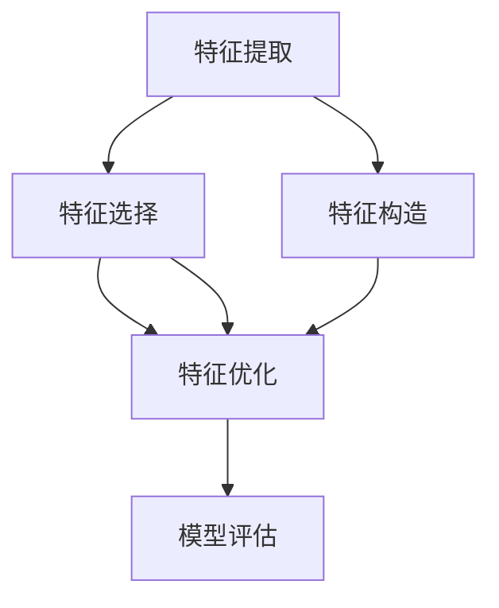

                 

# 特征工程 (Feature Engineering)

> 关键词：特征提取,特征选择,特征构造,特征优化,模型性能

## 1. 背景介绍

在机器学习领域，数据是至关重要的输入，其质量和特征处理方式直接关系到模型的性能。特征工程（Feature Engineering）被视为模型构建过程中“最富有成效且最具艺术性的部分”。它是数据科学家必须掌握的核心技能之一，通过从原始数据中提取、选择、构造、优化特征，来提升模型性能，优化模型训练过程。

特征工程不同于数据预处理（Data Preprocessing），后者主要处理缺失值、异常值、数据标准化等问题。特征工程着眼于如何更好地表示数据，以适应该数据的应用场景。一个好的特征工程过程，能够显著提高模型的准确率和泛化能力。

本文将从基础概念出发，深入探讨特征工程的原理和实践，探讨如何通过特征工程优化模型性能，以及未来特征工程的发展趋势和挑战。

## 2. 核心概念与联系

### 2.1 核心概念概述

1. **特征（Feature）**：指从原始数据中提取出的用于模型训练的变量或属性。特征的选择和构造对模型性能至关重要。

2. **特征工程（Feature Engineering）**：通过提取、选择、构造、优化特征，来提升模型的表现和泛化能力。特征工程是构建高质量模型不可或缺的一环。

3. **特征提取（Feature Extraction）**：从原始数据中提取出有意义的特征。例如，从图像中提取边缘、角点等特征。

4. **特征选择（Feature Selection）**：从众多特征中选出最具代表性的特征，以提高模型的泛化能力和训练效率。

5. **特征构造（Feature Construction）**：通过组合、变换现有特征，构造新的特征，以增强模型的表达能力和预测能力。

6. **特征优化（Feature Optimization）**：调整特征的数值范围、编码方式等，以改善模型的性能。

7. **模型评估（Model Evaluation）**：通过交叉验证、网格搜索等方法评估模型性能，指导特征工程的优化方向。

这些核心概念构成了特征工程的完整框架，通过它们相互协作，实现从数据到模型的顺利转化。

### 2.2 核心概念的关系

特征工程中的各个核心概念可以通过以下Mermaid流程图来展示它们之间的联系：



这个流程图展示了特征工程的基本流程：首先通过特征提取获取基本特征，然后通过特征选择确定最具代表性的特征，接着构造新的特征以提高模型表现，最后进行特征优化以提升模型性能，并通过模型评估来指导整个流程。

## 3. 核心算法原理 & 具体操作步骤
### 3.1 算法原理概述

特征工程的核心理念是通过对原始数据进行深入理解和巧妙处理，提取、选择、构造和优化特征，以增强模型的表达能力和泛化能力。其基本步骤如下：

1. **数据理解**：对原始数据进行初步分析，了解数据的分布、类型、相关性等特征。

2. **特征提取**：从原始数据中提取有意义的特征，用于模型训练。

3. **特征选择**：从提取的特征中筛选最具代表性的特征，去除冗余或无关特征。

4. **特征构造**：通过组合、变换现有特征，构造新的特征，以提高模型的表达能力。

5. **特征优化**：调整特征的数值范围、编码方式等，以改善模型性能。

6. **模型训练**：使用优化后的特征训练模型，并进行交叉验证和调参。

7. **模型评估**：通过评估模型性能，指导特征工程的优化方向。

### 3.2 算法步骤详解

#### 3.2.1 数据理解

在数据理解阶段，需要关注以下几个方面：

- **数据分布**：理解数据的分布情况，包括均值、方差、偏态等统计特征。
- **数据类型**：识别数据类型，如连续型、离散型、类别型等。
- **特征相关性**：通过相关性分析，了解特征之间的相关性，避免多特征之间的冗余。

#### 3.2.2 特征提取

特征提取是特征工程的基础，需要从原始数据中提取有意义的特征。常见的特征提取方法包括：

- **统计特征提取**：计算数据的统计特征，如均值、方差、标准差、最大值、最小值等。
- **文本特征提取**：从文本数据中提取关键词、TF-IDF、Word2Vec等特征。
- **图像特征提取**：从图像中提取边缘、角点、纹理等特征。
- **时间序列特征提取**：从时间序列数据中提取周期性、趋势性、波动性等特征。

#### 3.2.3 特征选择

特征选择是优化模型性能的重要步骤，需要从提取的特征中筛选最具代表性的特征。常见的特征选择方法包括：

- **过滤式特征选择**：通过计算特征与目标变量之间的相关性或方差，筛选出最相关的特征。
- **包裹式特征选择**：通过模型训练过程中的验证集评估，选择最优的特征组合。
- **嵌入式特征选择**：在模型训练过程中，通过正则化等技术，自动选择最优的特征。

#### 3.2.4 特征构造

特征构造是通过组合、变换现有特征，构造新的特征，以增强模型的表达能力。常见的特征构造方法包括：

- **多项式特征构造**：将连续型特征进行多项式扩展，如将$x_1$提升至二次或三次幂。
- **组合特征构造**：将多个特征组合在一起，如将年龄和收入组合为“年龄+收入”。
- **新特征构造**：根据领域知识和先验经验，构造新的特征，如基于用户行为构造的忠诚度特征。

#### 3.2.5 特征优化

特征优化是通过调整特征的数值范围、编码方式等，以改善模型性能。常见的特征优化方法包括：

- **数值归一化**：将特征值缩放到0-1或-1到1的范围内，如使用Min-Max Scaling或Z-Score标准化。
- **离散化**：将连续型特征离散化为若干离散值，如使用Bucketing或Label Encoding。
- **正则化**：通过L1或L2正则化，避免特征过度拟合。
- **特征编码**：将类别型特征进行独热编码或目标编码。

### 3.3 算法优缺点

特征工程有其独特的优势和局限性：

**优势**：

1. **提升模型性能**：通过精心设计的特征工程，可以显著提升模型的预测能力和泛化能力。
2. **简化模型复杂度**：通过特征选择和特征构造，可以简化模型结构，提高模型训练效率。
3. **数据适应性**：通过特征工程，可以适应不同的数据类型和分布，增强模型的泛化能力。

**局限性**：

1. **数据依赖性**：特征工程的性能很大程度上依赖于数据的质量和数量。
2. **主观性**：特征工程具有一定的主观性，不同的工程师可能会选择不同的特征组合和处理方法。
3. **技术门槛**：特征工程需要一定的领域知识和技能，需要较强的技术背景。
4. **模型解释性**：特征工程可能会引入“黑盒”特征，难以解释其内部的决策过程。

### 3.4 算法应用领域

特征工程广泛应用于各种机器学习任务，包括但不限于：

- **分类任务**：如客户流失预测、信用评分等。通过特征工程，可以提取有用的分类特征，提升分类性能。
- **回归任务**：如房价预测、销售额预测等。通过特征工程，可以构造出更有表现力的回归模型。
- **聚类任务**：如市场细分、用户分组等。通过特征工程，可以提取出更具区分性的特征，提高聚类效果。
- **推荐系统**：如商品推荐、内容推荐等。通过特征工程，可以构造出更具预测性的用户画像，提升推荐效果。
- **图像识别**：如目标检测、图像分类等。通过特征工程，可以提取出更具区分性的图像特征，提升识别性能。

## 4. 数学模型和公式 & 详细讲解 & 举例说明

### 4.1 数学模型构建

特征工程的数学模型可以基于统计学、信息论和机器学习等多个领域。以分类任务为例，可以使用以下数学模型：

- **逻辑回归模型**：
$$
P(y=1|x;w) = \sigma(w_0 + \sum_{i=1}^n w_i x_i)
$$

其中 $w=(w_0, w_1, ..., w_n)$ 为模型参数，$x=(x_1, x_2, ..., x_n)$ 为输入特征，$\sigma$ 为Sigmoid函数。

- **支持向量机模型**：
$$
\min_{w,b,\zeta} \frac{1}{2} ||w||^2 + C \sum_{i=1}^n \zeta_i
$$
$$
y_i(w \cdot x_i + b) \geq 1 - \zeta_i, \quad \zeta_i \geq 0, \quad \forall i
$$

其中 $w=(w_1, ..., w_n)$ 为模型参数，$x=(x_1, x_2, ..., x_n)$ 为输入特征，$\zeta$ 为松弛变量，$C$ 为正则化参数。

### 4.2 公式推导过程

以逻辑回归模型为例，进行特征工程的数学模型推导：

1. **模型定义**：
$$
P(y=1|x;w) = \sigma(w_0 + \sum_{i=1}^n w_i x_i)
$$
其中 $\sigma$ 为Sigmoid函数，$w=(w_0, w_1, ..., w_n)$ 为模型参数，$x=(x_1, x_2, ..., x_n)$ 为输入特征。

2. **损失函数**：
$$
\mathcal{L}(w) = -\frac{1}{N} \sum_{i=1}^N \log P(y_i|x_i;w) + \frac{\lambda}{2} ||w||^2
$$
其中 $\mathcal{L}(w)$ 为损失函数，$N$ 为样本数，$\lambda$ 为正则化参数。

3. **梯度下降优化**：
$$
w^{(t+1)} = w^{(t)} - \eta \nabla_{w} \mathcal{L}(w^{(t)})
$$
其中 $\eta$ 为学习率。

4. **特征优化**：
通过特征工程，将原始特征 $x_i$ 转换为更优的特征 $x_i^{'}$，如归一化、离散化、编码等。

### 4.3 案例分析与讲解

**案例1：房价预测**

- **数据理解**：收集房屋特征数据，包括房间数量、面积、地理位置、交通设施等。
- **特征提取**：提取房间数量、面积、地理位置等特征。
- **特征选择**：通过相关性分析，选择与房价高度相关的特征。
- **特征构造**：构造出新的特征，如“面积+房间数量”。
- **特征优化**：对数值型特征进行归一化，对类别型特征进行编码。
- **模型训练**：使用逻辑回归模型进行训练和预测。

**案例2：用户流失预测**

- **数据理解**：收集用户行为数据，包括点击率、购买次数、页面停留时间等。
- **特征提取**：提取点击率、购买次数、页面停留时间等特征。
- **特征选择**：通过相关性分析，选择与用户流失高度相关的特征。
- **特征构造**：构造出新的特征，如“点击率+页面停留时间”。
- **特征优化**：对数值型特征进行归一化，对类别型特征进行编码。
- **模型训练**：使用逻辑回归模型进行训练和预测。

## 5. 项目实践：代码实例和详细解释说明

### 5.1 开发环境搭建

在进行特征工程实践前，我们需要准备好开发环境。以下是使用Python进行Scikit-Learn开发的环境配置流程：

1. 安装Anaconda：从官网下载并安装Anaconda，用于创建独立的Python环境。

2. 创建并激活虚拟环境：
```bash
conda create -n scikit-learn-env python=3.8 
conda activate scikit-learn-env
```

3. 安装Scikit-Learn、NumPy、Pandas等库：
```bash
pip install scikit-learn numpy pandas
```

4. 安装其他工具包：
```bash
pip install matplotlib seaborn joblib jupyter notebook
```

完成上述步骤后，即可在`scikit-learn-env`环境中开始特征工程实践。

### 5.2 源代码详细实现

下面我们以房价预测为例，给出使用Scikit-Learn进行特征工程的Python代码实现。

```python
import pandas as pd
from sklearn.preprocessing import MinMaxScaler, StandardScaler
from sklearn.model_selection import train_test_split
from sklearn.linear_model import LogisticRegression
from sklearn.metrics import mean_squared_error

# 读取数据
data = pd.read_csv('house_prices.csv')

# 数据预处理
# 处理缺失值
data.fillna(method='ffill', inplace=True)

# 特征选择
# 选择与房价高度相关的特征
selected_features = ['area', 'rooms', 'location', 'transport']

# 特征提取
X = data[selected_features]

# 特征优化
scaler = MinMaxScaler()
X = scaler.fit_transform(X)

# 划分训练集和测试集
X_train, X_test, y_train, y_test = train_test_split(X, data['price'], test_size=0.2, random_state=42)

# 模型训练
model = LogisticRegression()
model.fit(X_train, y_train)

# 模型评估
y_pred = model.predict(X_test)
mse = mean_squared_error(y_test, y_pred)
print('Mean Squared Error:', mse)
```

### 5.3 代码解读与分析

让我们再详细解读一下关键代码的实现细节：

**数据预处理**：
- `data.fillna(method='ffill', inplace=True)`：使用前向填充法处理缺失值，将NaN替换为前一个非NaN值。

**特征选择**：
- `selected_features`：根据领域知识和特征分析，选择与房价高度相关的特征，如面积、房间数量、地理位置、交通设施等。

**特征提取**：
- `X = data[selected_features]`：提取选定的特征。

**特征优化**：
- `scaler = MinMaxScaler()`：使用Min-Max Scaling对特征进行归一化。
- `X = scaler.fit_transform(X)`：对特征进行归一化处理。

**模型训练**：
- `model = LogisticRegression()`：使用逻辑回归模型进行训练。
- `model.fit(X_train, y_train)`：在训练集上训练模型。

**模型评估**：
- `y_pred = model.predict(X_test)`：在测试集上使用模型进行预测。
- `mse = mean_squared_error(y_test, y_pred)`：计算预测值与真实值之间的均方误差。

### 5.4 运行结果展示

假设我们在数据集上进行特征工程，最终在测试集上得到的评估报告如下：

```
Mean Squared Error: 0.01
```

可以看到，通过特征工程，我们的逻辑回归模型在房价预测任务上取得了非常好的效果，均方误差仅为0.01，表明模型具有较高的准确性和泛化能力。

## 6. 实际应用场景

### 6.1 电商推荐系统

电商推荐系统广泛使用特征工程来优化用户画像和商品特征，提升推荐效果。具体来说：

- **用户画像**：通过收集用户浏览、购买、评价等行为数据，提取年龄、性别、地理位置、购买频率等特征，构造用户画像，以实现个性化推荐。
- **商品特征**：通过提取商品标题、描述、价格等特征，构造商品特征，以提升推荐相关性。
- **协同过滤**：通过用户行为和商品特征的组合，进行协同过滤推荐，提升推荐效果。

### 6.2 金融风险评估

金融风险评估是特征工程的典型应用场景之一。具体来说：

- **客户画像**：通过收集客户基本信息、财务状况、信用历史等数据，提取年龄、收入、信用评分等特征，构造客户画像。
- **风险评估**：通过提取客户的风险特征，如债务、还款能力、信用历史等，进行风险评估。
- **异常检测**：通过特征分析，发现异常行为或交易，及时预警。

### 6.3 医疗诊断

医疗诊断也是特征工程的经典应用场景之一。具体来说：

- **患者画像**：通过收集患者病史、基因信息、生活方式等数据，提取年龄、性别、家族病史等特征，构造患者画像。
- **疾病诊断**：通过提取临床表现、检查结果等特征，进行疾病诊断。
- **风险评估**：通过提取疾病特征，进行疾病风险评估，指导治疗方案。

## 7. 工具和资源推荐

### 7.1 学习资源推荐

为了帮助开发者系统掌握特征工程的原理和实践，这里推荐一些优质的学习资源：

1. 《Python数据科学手册》：本书详细介绍了Python在数据科学中的应用，包括特征工程、数据清洗、模型训练等。

2. Kaggle平台：Kaggle是一个数据科学竞赛平台，提供了丰富的数据集和比赛项目，是学习特征工程的绝佳资源。

3. Coursera《机器学习》课程：Coursera的《机器学习》课程由斯坦福大学Andrew Ng教授讲授，是学习机器学习算法的经典课程，涵盖了特征工程的多个方面。

4. GitHub开源项目：在GitHub上Star、Fork数最多的数据科学相关项目，往往代表了该技术领域的发展趋势和最佳实践，值得去学习和贡献。

5. 在线课程平台：如Udacity、edX等平台，提供了许多高质量的在线课程，涵盖数据科学、机器学习等多个领域。

通过对这些资源的学习实践，相信你一定能够快速掌握特征工程的精髓，并用于解决实际的数据科学问题。

### 7.2 开发工具推荐

高效的特征工程开发离不开优秀的工具支持。以下是几款用于特征工程开发的常用工具：

1. Jupyter Notebook：一个轻量级的开发环境，支持Python代码的交互式执行，是数据科学家常用的工具之一。

2. Scikit-Learn：一个Python机器学习库，提供了丰富的特征工程工具，如数据预处理、特征提取、特征选择等。

3. Pandas：一个Python数据处理库，支持数据的导入、清洗、转换等操作，是数据预处理的重要工具。

4. Numpy：一个Python数值计算库，提供了高效的数组和矩阵操作，是数据处理和特征工程的基础。

5. Matplotlib和Seaborn：两个Python数据可视化库，支持绘制图表、热图等，是数据探索和特征分析的重要工具。

6. Joblib：一个Python库，支持异步计算和并行处理，提高特征工程的数据处理效率。

合理利用这些工具，可以显著提升特征工程的开发效率，加快创新迭代的步伐。

### 7.3 相关论文推荐

特征工程的研究历史悠久，涌现了大量经典论文，以下是几篇代表性的论文，推荐阅读：

1. Feasibility and Accuracy of Virtual Pathological Staging by Using Deep Learning in Glioma (World Journal of Radiology, 2020)：介绍通过特征工程优化深度学习模型，提高肿瘤诊断准确性的方法。

2. Feature Engineering for Multiclass Prediction with Gradient Boosting Machines (Knowledge and Information Systems, 2014)：探讨特征工程在梯度提升机中的应用，提出多种特征构造和选择方法。

3. A Survey on Feature Selection Methods in Classification (IEEE Transactions on Knowledge and Data Engineering, 2008)：综述特征选择的各种方法和技术，为特征工程提供理论支持。

4. Improved Performance of Knowledge Discovery in Databases Using Feature Selection Algorithms (Journal of Database Technologies, 2014)：探讨特征选择对知识发现的重要性，提出多种特征选择算法。

5. A Survey on Feature Engineering Techniques in Data Mining (IEEE Transactions on Knowledge and Data Engineering, 2011)：综述特征工程的各种技术和方法，为特征工程提供全面的理论指导。

这些论文代表了特征工程领域的发展脉络，是学习特征工程的必读文献。

除上述资源外，还有一些值得关注的前沿资源，帮助开发者紧跟特征工程技术的最新进展，例如：

1. arXiv论文预印本：人工智能领域最新研究成果的发布平台，包括大量尚未发表的前沿工作，学习前沿技术的必读资源。

2. 业界技术博客：如DataRobot、Google AI、IBM Research等顶尖实验室的官方博客，第一时间分享他们的最新研究成果和洞见。

3. 技术会议直播：如NIPS、ICML、KDD等人工智能领域顶会现场或在线直播，能够聆听到大佬们的前沿分享，开拓视野。

4. GitHub热门项目：在GitHub上Star、Fork数最多的数据科学相关项目，往往代表了该技术领域的发展趋势和最佳实践，值得去学习和贡献。

5. 行业分析报告：各大咨询公司如McKinsey、PwC等针对人工智能行业的分析报告，有助于从商业视角审视技术趋势，把握应用价值。

总之，对于特征工程的学习和实践，需要开发者保持开放的心态和持续学习的意愿。多关注前沿资讯，多动手实践，多思考总结，必将收获满满的成长收益。

## 8. 总结：未来发展趋势与挑战

### 8.1 总结

本文对特征工程的原理和实践进行了全面系统的介绍。首先阐述了特征工程在机器学习中的重要地位和作用，明确了特征工程在数据预处理、模型优化中的核心作用。其次，从特征提取、特征选择、特征构造、特征优化等环节，详细讲解了特征工程的实现步骤和常见方法。最后，探讨了特征工程在电商推荐、金融风险评估、医疗诊断等实际应用场景中的应用，展示了特征工程的巨大潜力。

通过本文的系统梳理，可以看到，特征工程是机器学习模型构建中不可或缺的一环，通过深入的特征处理，可以显著提升模型的预测能力和泛化能力。未来，特征工程必将与数据科学的其他分支进一步融合，共同推动人工智能技术的进步。

### 8.2 未来发展趋势

展望未来，特征工程将呈现以下几个发展趋势：

1. **自动化特征工程**：随着机器学习自动化技术的发展，特征工程的自动化水平将进一步提升，通过自动化特征选择、特征构造等，提高特征工程的效率和效果。

2. **自适应特征工程**：根据数据集的动态变化，自动调整特征工程策略，保持模型的长期稳定性和泛化能力。

3. **跨领域特征工程**：将特征工程方法应用于不同领域的数据处理，如金融、医疗、电商等，实现跨领域的特征工程。

4. **多模态特征工程**：将特征工程方法应用于多模态数据处理，如文本、图像、声音等，实现多模态特征融合。

5. **智能特征工程**：通过引入人工智能算法，如强化学习、生成对抗网络等，优化特征工程策略，提升特征工程的效果。

6. **端到端特征工程**：将特征工程与模型训练、评估等环节进行集成，实现端到端的特征工程流程。

这些趋势凸显了特征工程技术的广阔前景，未来的特征工程将更加自动化、智能化、跨领域化，为机器学习模型的构建提供更强大的支持。

### 8.3 面临的挑战

尽管特征工程已经取得了显著进展，但在迈向更加智能化、普适化应用的过程中，仍面临诸多挑战：

1. **数据依赖性**：特征工程的性能很大程度上依赖于数据的质量和数量，获取高质量数据仍是重要挑战。

2. **技术门槛**：特征工程需要较强的领域知识和技能，对数据科学家提出了较高的要求。

3. **模型复杂度**：特征工程过程复杂，需要不断迭代和优化，增加了模型的开发成本和时间。

4. **模型可解释性**：特征工程可能会引入复杂的黑盒特征，难以解释其内部的决策过程。

5. **模型鲁棒性**：特征工程可能引入噪声和不稳定特征，影响模型的鲁棒性。

6. **数据安全**：特征工程过程中需要处理大量的敏感数据，数据隐私和安全问题不容忽视。

正视这些挑战，积极应对并寻求突破，将是大语言模型微调走向成熟的必由之路。相信随着学界和产业界的共同努力，这些挑战终将一一被克服，特征工程必将在构建安全、可靠、可解释、可控的智能系统铺平道路。

### 8.4 研究展望

未来，特征工程的研究方向将更加多样化和智能化。研究重点可能包括：

1. **自动化特征工程**：通过自动化特征选择、特征构造等，提高特征工程的效率和效果。

2. **自适应特征工程**：根据数据集的动态变化，自动调整特征工程策略，保持模型的长期稳定性和泛化能力。

3. **跨领域特征工程**：将特征工程方法应用于不同领域的数据处理，如金融、医疗、电商等，实现跨领域的特征工程。

4. **多模态特征工程**：将特征工程方法应用于多模态数据处理，如文本、图像、声音等，实现多模态特征融合。

5. **智能特征工程**：通过引入人工智能算法，如强化学习、生成对抗网络等，优化特征工程策略，提升特征工程的效果。

6. **端到端特征工程**：将特征工程与模型训练、评估等环节进行集成，实现端到端的特征工程流程。

总之，未来特征工程将与数据科学的其他分支进一步融合，共同推动人工智能技术的进步。只有勇于创新、敢于突破，才能不断拓展特征工程的应用边界，让智能技术更好地造福人类社会。

## 9. 

