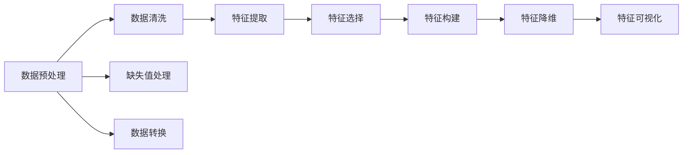
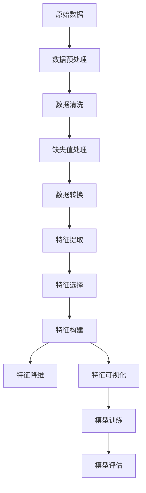

                 

## 1. 背景介绍

### 1.1 问题由来
在机器学习与数据科学领域，特征工程（Feature Engineering）是构建高性能模型、优化模型性能的重要步骤。特征工程通过数据预处理、特征提取、特征选择等手段，将原始数据转换为模型可以利用的特征，从而提升模型的预测能力与泛化能力。

### 1.2 问题核心关键点
1. **数据预处理**：包括数据清洗、缺失值处理、数据转换等步骤，确保数据的完整性与一致性。
2. **特征提取**：将原始数据转换为更有信息量的特征，如从文本数据中提取词频、TF-IDF、主题分布等。
3. **特征选择**：从众多特征中选择最有用的特征，减少冗余，提升模型性能。
4. **特征构建**：基于领域知识，设计新的特征表示方式，如时间序列特征、交互特征等。
5. **特征降维**：通过主成分分析（PCA）、线性判别分析（LDA）等方法，降低特征维度，提高计算效率。

### 1.3 问题研究意义
特征工程在机器学习中扮演着至关重要的角色，良好的特征设计能够显著提升模型性能，缩短模型开发周期。特别是对于数据复杂度较高、特征维度巨大的领域，如自然语言处理（NLP）、计算机视觉（CV）、信号处理等，特征工程的重要性尤为突出。通过深入理解特征工程原理，掌握关键技术，可以加速应用落地，提升模型效果，最终推动业务价值的最大化。

## 2. 核心概念与联系

### 2.1 核心概念概述

特征工程涉及多个核心概念，通过以下Mermaid流程图展示其逻辑关系：



1. **数据预处理**：确保数据集的质量和一致性，为后续特征工程打下良好基础。
2. **数据清洗**：去除噪声、异常值等不健康数据点，提升数据质量。
3. **缺失值处理**：处理缺失值，保证数据的完整性，避免模型训练时的偏差。
4. **数据转换**：通过多种方式（如标准化、归一化、对数变换等）改变数据分布，提升模型性能。
5. **特征提取**：从原始数据中提取有意义的特征，增加数据的表达能力。
6. **特征选择**：选择最有用的特征，减少维度，提升模型泛化能力。
7. **特征构建**：设计新的特征，增强模型的表达能力，如交叉特征、多项式特征等。
8. **特征降维**：减少特征维度，提高计算效率，防止过拟合。
9. **特征可视化**：通过可视化工具，帮助理解数据特征，发现潜在模式。

### 2.2 概念间的关系

特征工程中的各个步骤相互关联，通过以下Mermaid流程图展示其整体架构：



这个流程图展示了从原始数据到模型训练的全过程：

1. 原始数据通过预处理、清洗和转换，得到高质量的数据集。
2. 经过特征提取，从数据中提取有用的特征。
3. 通过特征选择和构建，进一步提升特征的有效性和多样性。
4. 特征经过降维处理，减少冗余，提升计算效率。
5. 可视化特征，帮助理解特征分布和关系。
6. 最后，特征被用于模型训练，模型进行评估和优化。

### 2.3 核心概念的整体架构

最后，我们用一个综合的流程图展示特征工程的整个架构：


该流程图展示了从数据预处理到模型训练的完整流程，帮助读者理解特征工程在大数据分析中的重要性。

## 3. 核心算法原理 & 具体操作步骤
### 3.1 算法原理概述

特征工程的核心目的是将原始数据转换为更有信息量的特征，从而提升模型的预测能力和泛化能力。这涉及到多个步骤，包括数据预处理、特征提取、特征选择等。

### 3.2 算法步骤详解

特征工程的详细步骤包括：

1. **数据预处理**：
   - 数据清洗：去除噪声、异常值等不健康数据点。
   - 缺失值处理：采用均值、中位数、插值等方法处理缺失值。
   - 数据转换：包括标准化、归一化、对数变换等，改变数据分布，提升模型性能。

2. **特征提取**：
   - 文本特征：包括词频、TF-IDF、主题分布等，将文本转换为数值特征。
   - 时间序列特征：通过滑动窗口、移动平均等方法提取时间序列特征。
   - 图像特征：提取像素值、颜色直方图、边缘信息等，将图像转换为数值特征。

3. **特征选择**：
   - 过滤法：通过计算特征与目标变量之间的相关性，选择与目标变量相关性高的特征。
   - 包裹法：使用模型（如决策树、随机森林等），评估特征的重要性，选择最优特征子集。
   - 嵌入式法：在模型训练过程中，动态选择特征，如Lasso回归、正则化等。

4. **特征构建**：
   - 交叉特征：将多个特征进行交叉组合，生成新的特征。
   - 多项式特征：通过多项式函数对原始特征进行变换，增加特征多样性。
   - 组合特征：将不同类型的数据进行组合，如时间与业务数据组合。

5. **特征降维**：
   - 主成分分析（PCA）：通过线性变换，将高维特征空间投影到低维空间，减少维度。
   - 线性判别分析（LDA）：通过投影，使投影后的特征具有较好的分类能力。
   - t-SNE：通过非线性降维，可视化高维数据。

### 3.3 算法优缺点

特征工程的优点：

1. **提升模型性能**：通过提取、选择、构建和降维，提升模型的预测能力和泛化能力。
2. **减少计算成本**：通过降维处理，减少计算复杂度，提高模型训练和推理速度。
3. **提高数据质量**：通过数据清洗和缺失值处理，提升数据质量，避免模型偏差。

特征工程的缺点：

1. **需要专业知识**：特征工程需要深厚的领域知识和经验，难度较大。
2. **容易过拟合**：过度复杂或无关的特征可能导致模型过拟合。
3. **计算资源消耗大**：特征工程涉及大量数据处理和计算，消耗大量资源。

### 3.4 算法应用领域

特征工程广泛应用于各种数据驱动的领域，包括：

1. **自然语言处理（NLP）**：从文本数据中提取关键词、主题、情感等特征。
2. **计算机视觉（CV）**：从图像中提取颜色、纹理、形状等特征。
3. **信号处理**：从时间序列数据中提取频率、振幅等特征。
4. **金融分析**：从金融数据中提取趋势、波动性、风险等特征。
5. **医疗分析**：从医疗数据中提取疾病、治疗、症状等特征。
6. **推荐系统**：从用户行为数据中提取用户兴趣、物品属性等特征。

## 4. 数学模型和公式 & 详细讲解 & 举例说明

### 4.1 数学模型构建

特征工程的数学模型包括数据预处理、特征提取、特征选择等步骤。下面以文本特征提取为例，展示如何构建特征工程模型。

假设我们有一组文本数据集 $\{d_1, d_2, ..., d_n\}$，每个文本 $d_i$ 包含 $m$ 个词语，可以表示为：

$$
d_i = \{w_{i1}, w_{i2}, ..., w_{im}\}
$$

其中 $w_{ik}$ 表示文本 $d_i$ 中的第 $k$ 个词语。

### 4.2 公式推导过程

我们以词频（Term Frequency, TF）和逆文档频率（Inverse Document Frequency, IDF）的计算为例，展示特征提取的具体过程。

1. **词频（TF）**：计算每个词语在文本中的出现频率，公式如下：

$$
TF(w_{ik}) = \frac{f_{ik}}{\sum_{j=1}^n f_{jk}}
$$

其中 $f_{ik}$ 表示词语 $w_{ik}$ 在文本 $d_i$ 中出现的次数。

2. **逆文档频率（IDF）**：计算每个词语在所有文本中的重要性，公式如下：

$$
IDF(w) = \log \frac{N}{\sum_{j=1}^n f_{jk}}
$$

其中 $N$ 表示文本总数，$\sum_{j=1}^n f_{jk}$ 表示词语 $w$ 在所有文本中出现的总次数。

### 4.3 案例分析与讲解

以新闻文本分类为例，展示特征工程在实际中的应用。

假设我们有一组新闻文本数据集 $\{n_1, n_2, ..., n_m\}$，每个新闻 $n_i$ 包含 $m$ 个词语，可以表示为：

$$
n_i = \{w_{i1}, w_{i2}, ..., w_{im}\}
$$

我们对每个新闻进行词频和逆文档频率的计算，得到每个词语的 TF-IDF 值。例如，第 $i$ 个新闻的第 $k$ 个词语的 TF-IDF 值可以表示为：

$$
TF-IDF_{ik} = TF(w_{ik}) \times IDF(w)
$$

然后，我们将这些 TF-IDF 值作为特征向量，用于训练分类模型，如朴素贝叶斯、逻辑回归、支持向量机等。

## 5. 项目实践：代码实例和详细解释说明

### 5.1 开发环境搭建

1. **安装Python**：确保系统安装 Python 3.x，可以使用 Anaconda 或 Miniconda 进行安装。
   ```bash
   wget https://repo.anaconda.com/miniconda/Miniconda3-latest-Linux-x86_64.sh
   bash Miniconda3-latest-Linux-x86_64.sh
   ```
2. **创建虚拟环境**：创建 Python 虚拟环境，安装必要的库。
   ```bash
   conda create --name feature_engineering python=3.7
   conda activate feature_engineering
   ```
3. **安装库**：安装 pandas、numpy、scikit-learn 等常用的库。
   ```bash
   pip install pandas numpy scikit-learn
   ```

### 5.2 源代码详细实现

以下是一个使用 pandas 和 scikit-learn 进行特征工程的示例代码：

```python
import pandas as pd
from sklearn.feature_extraction.text import TfidfVectorizer
from sklearn.preprocessing import StandardScaler
from sklearn.model_selection import train_test_split

# 加载数据集
df = pd.read_csv('data.csv')

# 数据预处理
df = df.dropna()  # 删除缺失值
df = df.drop_duplicates()  # 删除重复数据

# 数据转换
df = pd.get_dummies(df)  # 将类别特征转换为哑变量

# 特征提取
vectorizer = TfidfVectorizer()
X = vectorizer.fit_transform(df['text'])
y = df['label']

# 特征选择
X = X[:1000]  # 选择前1000个特征

# 特征构建
X = pd.concat([X, df['date']], axis=1)  # 将时间特征与文本特征合并

# 特征降维
scaler = StandardScaler()
X = scaler.fit_transform(X)

# 模型训练与评估
X_train, X_test, y_train, y_test = train_test_split(X, y, test_size=0.2)
clf = LogisticRegression()
clf.fit(X_train, y_train)
score = clf.score(X_test, y_test)
print('模型准确率：', score)
```

### 5.3 代码解读与分析

1. **数据预处理**：
   - 删除缺失值和重复数据，保证数据质量。
   - 将类别特征转换为哑变量，方便模型处理。

2. **特征提取**：
   - 使用 TfidfVectorizer 将文本转换为 TF-IDF 特征。

3. **特征选择**：
   - 仅选择前1000个特征，减少维度。

4. **特征构建**：
   - 将时间特征与文本特征合并，提升模型表达能力。

5. **特征降维**：
   - 使用 StandardScaler 标准化特征，减少特征间的差异。

6. **模型训练与评估**：
   - 使用 LogisticRegression 训练模型，评估模型性能。

### 5.4 运行结果展示

假设运行上述代码后，模型在测试集上的准确率为 0.85，表示模型具有较好的分类能力。

## 6. 实际应用场景

### 6.1 智能客服系统

智能客服系统通过自然语言处理技术，实现客户自助咨询。特征工程在此系统中起到了重要作用，可以通过分析客户提问，提取关键信息，匹配最合适的答案。

以问题分类为例，通过分析客户问题，提取问题中的关键词，计算 TF-IDF 值，构建特征向量，使用机器学习模型进行分类，找到最合适的答案，提供给客户。

### 6.2 金融风险评估

金融风险评估需要分析大量的金融数据，通过特征工程提取有意义的特征，如财务指标、市场波动性等，构建风险评估模型，预测客户的违约风险。

通过特征选择和构建，提高模型的预测能力，减少过拟合风险。

### 6.3 推荐系统

推荐系统通过分析用户行为数据，推荐用户可能感兴趣的商品或服务。特征工程在此系统中起到了重要作用，可以通过分析用户的历史行为，提取特征，如浏览历史、购买记录等，构建推荐模型，预测用户可能感兴趣的商品。

通过特征选择和降维，提高推荐系统的效率和效果。

### 6.4 未来应用展望

未来特征工程将在更多领域得到应用，例如医疗、环境监测、智能制造等。通过深入理解特征工程原理，掌握关键技术，可以加速应用落地，提升模型效果，最终推动业务价值的最大化。

## 7. 工具和资源推荐

### 7.1 学习资源推荐

1. **《Python数据科学手册》**：详细介绍了 pandas、NumPy、scikit-learn 等库的使用，适合初学者入门。
2. **Kaggle**：全球最大的数据科学竞赛平台，提供大量数据集和开源代码，适合实践和交流。
3. **Coursera**：提供多门数据科学和机器学习课程，适合系统学习。

### 7.2 开发工具推荐

1. **Anaconda**：Python 发行版，提供大量常用的数据科学库，适合快速迭代。
2. **Jupyter Notebook**：交互式开发环境，支持代码编写和数据分析。
3. **TensorBoard**：可视化工具，方便监控模型训练过程和调试。

### 7.3 相关论文推荐

1. **《A Survey of Feature Selection Techniques in Data Mining》**：综述了多种特征选择方法，适合深入理解特征选择原理。
2. **《Principal Component Analysis》**：介绍主成分分析的原理和应用，适合理解特征降维技术。
3. **《Text Mining: A Concise Introduction with Python》**：介绍文本特征提取的方法，适合理解文本处理技术。

## 8. 总结：未来发展趋势与挑战

### 8.1 研究成果总结

特征工程是机器学习和数据科学中的重要环节，通过数据预处理、特征提取、特征选择等手段，提升模型的预测能力和泛化能力。经过多年的发展，特征工程技术日益成熟，广泛应用于各个领域。

### 8.2 未来发展趋势

1. **自动化特征工程**：通过自动化工具，简化特征工程流程，提升效率。
2. **深度学习与特征工程结合**：深度学习模型在特征提取和选择中起到重要作用，未来将进一步融合。
3. **多模态特征工程**：结合多种数据源，提升特征表达能力。
4. **跨领域特征工程**：在不同领域中推广特征工程方法，提升通用性。

### 8.3 面临的挑战

1. **特征工程复杂度高**：特征工程需要深入领域知识，难度较大。
2. **过拟合风险高**：过度复杂的特征可能导致模型过拟合。
3. **计算资源消耗大**：特征工程涉及大量数据处理和计算，消耗大量资源。

### 8.4 研究展望

未来特征工程需要在自动化、深度学习融合、多模态特征工程等方面进行深入研究，提升特征工程的效果和效率，推动数据科学和机器学习的发展。

## 9. 附录：常见问题与解答

**Q1: 特征工程在机器学习中扮演什么角色？**

A: 特征工程在机器学习中扮演着至关重要的角色，通过数据预处理、特征提取、特征选择等手段，将原始数据转换为更有信息量的特征，从而提升模型的预测能力和泛化能力。良好的特征设计能够显著提升模型性能，缩短模型开发周期。

**Q2: 特征工程与数据预处理有何区别？**

A: 数据预处理是特征工程的一部分，主要指清洗数据、处理缺失值、数据转换等操作，保证数据的完整性与一致性。特征工程还包括特征提取、特征选择、特征构建和特征降维等步骤，将原始数据转换为更有信息量的特征，提升模型的预测能力。

**Q3: 如何进行特征选择？**

A: 特征选择可以通过以下方法实现：
1. 过滤法：计算特征与目标变量之间的相关性，选择与目标变量相关性高的特征。
2. 包裹法：使用模型（如决策树、随机森林等），评估特征的重要性，选择最优特征子集。
3. 嵌入式法：在模型训练过程中，动态选择特征，如Lasso回归、正则化等。

**Q4: 特征工程是否需要领域知识？**

A: 特征工程需要深厚的领域知识，以便更好地理解数据特征和模型需求。虽然自动化工具可以简化特征工程流程，但领域专家仍然在特征工程中扮演重要角色。

**Q5: 特征工程与模型选择的关系是什么？**

A: 特征工程与模型选择密切相关，选择合适的特征和模型能够提升模型效果。特征工程是模型选择的基础，模型选择是特征工程的目标，两者相辅相成。

**Q6: 特征工程在实际应用中是否需要持续优化？**

A: 是的，特征工程需要持续优化，以应对数据变化和模型需求的变化。通过不断改进特征工程流程，提升模型效果。

---

作者：禅与计算机程序设计艺术 / Zen and the Art of Computer Programming

