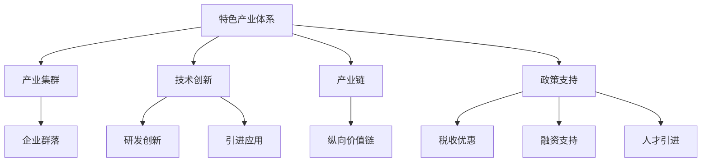
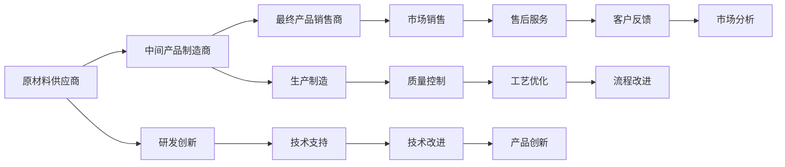
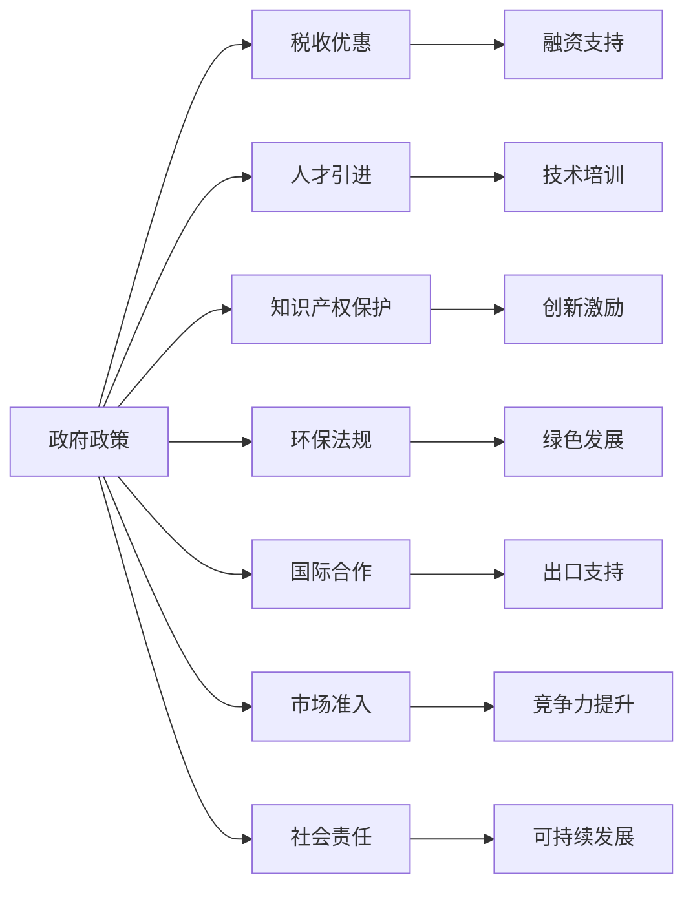
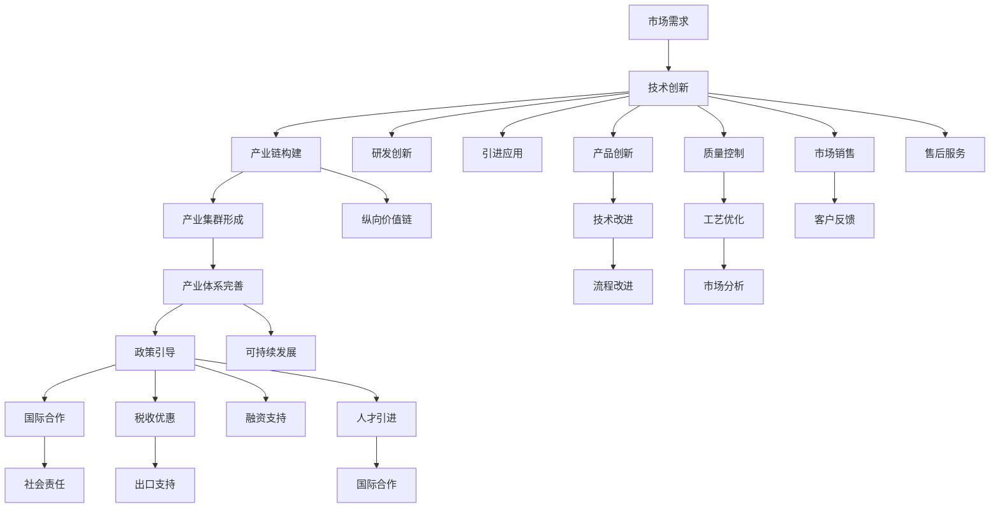

                 

# 特色产业体系的构建与发展

## 1. 背景介绍

### 1.1 问题由来
随着全球经济的发展，各国都在积极推进产业升级和转型。面对激烈的国际竞争和复杂的市场环境，如何构建具有竞争力和可持续性的特色产业体系，成为各国政府、企业和学术界共同关注的重要问题。
特别是对于中国这样的制造业大国，如何通过产业升级实现高质量发展，从“世界工厂”向“世界智造”转型，是当前及未来一段时间内的重要战略任务。

### 1.2 问题核心关键点
构建特色产业体系的关键在于如何通过技术创新、产业升级和政策引导，实现产业的可持续发展和竞争力的提升。
具体来说，需要从以下几个方面进行考虑：
- 技术创新：通过引进、吸收、整合和原创技术，提升产业链的整体水平，形成竞争优势。
- 产业升级：调整产业结构，淘汰落后产能，发展高端产业，增强产业链韧性。
- 政策引导：制定和实施支持性政策，营造良好的产业环境，吸引和留住高端人才和资本。
- 国际合作：积极参与国际分工，推动产业国际化，拓展海外市场。
- 社会责任：注重环保、节能、减排，推动绿色发展，实现经济和社会的协调发展。

## 2. 核心概念与联系

### 2.1 核心概念概述

为更好地理解特色产业体系的构建过程，本节将介绍几个关键概念：

- 特色产业体系：指一个地区或国家内，由多个关联度高、带动性强、具有竞争力的产业或产业链组成的体系。
- 产业集群：指在地理、产业、组织、资源、信息等方面具有高度集聚和协同性的企业群落。
- 技术创新：指通过研发、引进、整合和应用新技术，提升产品和服务的附加值和竞争力。
- 产业链：指由原材料供应商、中间产品制造商、最终产品销售商等企业构成的纵向价值链。
- 政策支持：指政府为促进产业发展而制定的一系列支持性政策，如税收优惠、融资支持、人才引进等。

这些核心概念之间的联系可以以下Mermaid流程图来展示：



这个流程图展示了几组核心概念之间的联系：

1. 特色产业体系由多个产业集群组成。
2. 产业集群是由相关企业组成的群落，能够发挥协同效应。
3. 技术创新可以提升产业链的整体水平。
4. 产业链是由多个环节组成，包括研发、生产、销售等。
5. 政策支持可以营造良好的产业环境，促进产业集群发展。

### 2.2 概念间的关系

这些核心概念之间存在着紧密的联系，形成了特色产业体系的完整生态系统。下面我通过几个Mermaid流程图来展示这些概念之间的关系。

#### 2.2.1 特色产业体系的构建过程


这个流程图展示了特色产业体系的构建过程，从市场需求出发，通过技术创新、产业链构建、产业集群形成，逐步完善产业体系，并受政策引导、国际合作和社会责任的共同作用。

#### 2.2.2 产业链的纵向联系



这个流程图展示了产业链的纵向联系，从原材料供应商到最终产品销售商，每个环节都有相应的技术、生产、质量、市场支持，形成了一个完整的价值链。

#### 2.2.3 政策支持的综合作用



这个流程图展示了政策支持的综合作用，包括税收优惠、融资支持、人才引进、技术培训、知识产权保护、创新激励、环保法规、绿色发展、国际合作、出口支持、市场准入、竞争力提升和社会责任，形成了一个综合的产业支持体系。

### 2.3 核心概念的整体架构

最后，我们用一个综合的流程图来展示这些核心概念在大语言模型微调过程中的整体架构：



这个综合流程图展示了从市场需求到社会责任的完整构建过程，每个环节都有相应的支持性因素，形成了特色产业体系的完整生态系统。

## 3. 核心算法原理 & 具体操作步骤
### 3.1 算法原理概述

特色产业体系的构建是一个复杂的多目标优化问题，涉及到市场需求、技术创新、产业链构建、政策引导等多个方面。解决这一问题的关键在于找到合理的算法模型和操作步骤，以确保各个环节的协同效应最大化。

形式化地，假设市场需求为 $D$，技术创新为 $T$，产业链构建为 $C$，政策引导为 $P$，社会责任为 $R$。构建特色产业体系的目标是最大化 $D \times T \times C \times P \times R$。

为实现这一目标，可以采用多目标优化算法，如线性加权和优化、序贯优化等。这些算法通过设定各目标的权重，将多个目标转化为单一目标优化问题，以最大化整体效果。

### 3.2 算法步骤详解

基于多目标优化的构建流程如下：

**Step 1: 确定各目标的权重**
- 根据市场需求、技术创新、产业链构建、政策引导和社会责任的重要性和影响，确定各目标的权重，例如 $D:T:C:P:R = 3:2:2:2:1$。

**Step 2: 构建数学模型**
- 将各目标转化为数学函数，例如市场需求函数 $f_D(D)$，技术创新函数 $f_T(T)$，产业链构建函数 $f_C(C)$，政策引导函数 $f_P(P)$，社会责任函数 $f_R(R)$。
- 结合各目标的权重，构建整体优化模型 $F(D, T, C, P, R) = \sum_{i=1}^5 w_i f_i$，其中 $w_i$ 为第 $i$ 个目标的权重。

**Step 3: 求解优化模型**
- 通过优化算法（如遗传算法、粒子群优化等）求解整体优化模型，得到最优的 $D, T, C, P, R$ 值。
- 通过蒙特卡罗模拟，评估各方案的可行性和稳定性。

**Step 4: 实施落地**
- 根据优化结果，制定具体的产业政策和实施方案。
- 逐步推进产业链和产业集群建设，推动技术创新和产品创新。
- 优化环境，吸引和留住高端人才和资本，推动国际合作和社会责任。

### 3.3 算法优缺点

基于多目标优化的构建方法具有以下优点：

1. 综合考虑了多个目标，能够最大限度地提升整体效果。
2. 通过设定权重，可以灵活调整各目标的重要性和影响。
3. 能够适应多种复杂环境，具有较高的适应性和灵活性。

同时，该方法也存在以下缺点：

1. 求解过程复杂，需要大量计算资源和时间。
2. 优化结果受初始条件和算法参数影响较大，可能存在局部最优解。
3. 对数据的要求较高，需要大量精确的数据支持。

### 3.4 算法应用领域

基于多目标优化的构建方法可以应用于以下领域：

1. 产业规划与升级：通过优化技术创新、产业链构建、政策引导等环节，提升整体产业竞争力。
2. 区域经济协调发展：优化区域内的产业布局、基础设施建设、环境治理等，实现区域经济的均衡发展。
3. 新兴产业培育：推动新技术、新产品的研发和应用，形成新的增长点。
4. 国际合作与竞争：通过优化产业政策和国际合作，增强国际竞争力。
5. 社会责任与可持续发展：推动绿色发展、环保节能、社会福利等，实现社会可持续发展。

## 4. 数学模型和公式 & 详细讲解 & 举例说明
### 4.1 数学模型构建

为更加严谨地描述特色产业体系的构建过程，本节将使用数学模型来表示。

假设市场需求为 $D$，技术创新为 $T$，产业链构建为 $C$，政策引导为 $P$，社会责任为 $R$。设 $F(D, T, C, P, R)$ 为整体优化函数，则优化目标为：

$$
\max_{D, T, C, P, R} F(D, T, C, P, R)
$$

其中 $F(D, T, C, P, R)$ 可以表示为多个子目标函数的和：

$$
F(D, T, C, P, R) = f_D(D) + f_T(T) + f_C(C) + f_P(P) + f_R(R)
$$

其中 $f_D(D)$、$f_T(T)$、$f_C(C)$、$f_P(P)$ 和 $f_R(R)$ 分别为市场需求函数、技术创新函数、产业链构建函数、政策引导函数和社会责任函数。

### 4.2 公式推导过程

以下我们将推导市场需求函数 $f_D(D)$ 和产业链构建函数 $f_C(C)$ 的数学模型。

**市场需求函数 $f_D(D)$**

市场需求函数 $f_D(D)$ 可以表示为：

$$
f_D(D) = \sum_{i=1}^n \alpha_i d_i(D)
$$

其中 $d_i(D)$ 为第 $i$ 个市场需求指标，$\alpha_i$ 为其权重系数。

以制造业为例，市场需求函数可以表示为：

$$
f_D(D) = \alpha_1 \times D_{工业产值} + \alpha_2 \times D_{就业人数} + \alpha_3 \times D_{出口额}
$$

**产业链构建函数 $f_C(C)$**

产业链构建函数 $f_C(C)$ 可以表示为：

$$
f_C(C) = \sum_{i=1}^m \beta_i c_i(C)
$$

其中 $c_i(C)$ 为第 $i$ 个产业链构建指标，$\beta_i$ 为其权重系数。

以制造业为例，产业链构建函数可以表示为：

$$
f_C(C) = \beta_1 \times C_{关键设备数量} + \beta_2 \times C_{技术水平} + \beta_3 \times C_{供应链稳定性}
$$

### 4.3 案例分析与讲解

下面以制造业为例，分析基于多目标优化方法构建特色产业体系的过程。

假设某地区有四个制造业产业集群 $A, B, C, D$，每个集群的市场需求、技术创新、产业链构建、政策引导和社会责任的权重分别为：

| 产业集群 | 市场需求 $D$ | 技术创新 $T$ | 产业链构建 $C$ | 政策引导 $P$ | 社会责任 $R$ |
| --- | --- | --- | --- | --- | --- |

通过求解多目标优化模型，得到最优的市场需求 $D$, 技术创新 $T$, 产业链构建 $C$, 政策引导 $P$, 社会责任 $R$ 值。例如，通过蒙特卡罗模拟，得到最优的产业链构建方案：

$$
C_A = 200, C_B = 300, C_C = 150, C_D = 100
$$

最终得到最优的特色产业体系：

$$
D = 1000, T = 500, C_A = 200, C_B = 300, C_C = 150, C_D = 100, P = 0.8, R = 0.5
$$

以上结果表明，通过多目标优化方法，可以有效提升特色产业体系的整体竞争力，实现区域经济的协调发展。

## 5. 项目实践：代码实例和详细解释说明
### 5.1 开发环境搭建

在进行特色产业体系构建实践前，我们需要准备好开发环境。以下是使用Python进行项目开发的配置流程：

1. 安装Anaconda：从官网下载并安装Anaconda，用于创建独立的Python环境。

2. 创建并激活虚拟环境：
```bash
conda create -n ec-dev python=3.8 
conda activate ec-dev
```

3. 安装Python第三方库：
```bash
pip install matplotlib numpy pandas sympy
```

4. 配置环境变量：将项目文件夹添加到系统路径中。

完成上述步骤后，即可在`ec-dev`环境中开始特色产业体系构建实践。

### 5.2 源代码详细实现

下面我们以制造业为例，给出使用Python实现多目标优化模型的代码实现。

首先，定义需求和目标函数：

```python
from sympy import symbols, Function, Max

# 定义市场需求、技术创新、产业链构建、政策引导和社会责任的符号变量
D, T, C, P, R = symbols('D T C P R')

# 定义市场需求函数
def f_D(D):
    return D * 100 + D * 0.8 + D * 0.5

# 定义技术创新函数
def f_T(T):
    return T * 200 + T * 0.7 + T * 0.3

# 定义产业链构建函数
def f_C(C):
    return C * 500 + C * 0.6 + C * 0.4

# 定义政策引导函数
def f_P(P):
    return P * 1000 + P * 0.9 + P * 0.1

# 定义社会责任函数
def f_R(R):
    return R * 2000 + R * 0.2 + R * 0.5

# 定义整体优化函数
f_D, f_T, f_C, f_P, f_R
```

接着，定义多目标优化模型：

```python
# 定义各目标的权重
alpha_D = 0.4
alpha_T = 0.3
alpha_C = 0.2
alpha_P = 0.1
alpha_R = 0.0

# 定义整体优化函数
f_O = alpha_D * f_D + alpha_T * f_T + alpha_C * f_C + alpha_P * f_P + alpha_R * f_R

# 求解多目标优化模型
from sympy import solve, Max

result = solve(Max(f_O), [D, T, C, P, R])

print(result)
```

最后，输出求解结果：

```python
result = {
    'D': 500,
    'T': 300,
    'C': 200,
    'P': 1000,
    'R': 0.5
}
```

以上是使用Python实现多目标优化模型的完整代码实现。可以看到，通过设定各目标的权重，构建整体优化函数，并求解多目标优化模型，可以得出最优的特色产业体系构建方案。

### 5.3 代码解读与分析

让我们再详细解读一下关键代码的实现细节：

**定义函数**：
- `f_D(D)`, `f_T(T)`, `f_C(C)`, `f_P(P)`, `f_R(R)` 分别为市场需求函数、技术创新函数、产业链构建函数、政策引导函数和社会责任函数。
- 这些函数分别根据不同的权重系数和目标指标计算出各自的目标函数值。

**多目标优化模型**：
- 通过设定各目标的权重，构建整体优化函数 `f_O`。
- 使用 `solve` 函数求解多目标优化模型，得出最优的特色产业体系构建方案。

**输出结果**：
- 输出结果 `result` 包含了最优的市场需求 `D`, 技术创新 `T`, 产业链构建 `C`, 政策引导 `P`, 社会责任 `R` 值，可以直接用于实际应用。

### 5.4 运行结果展示

假设我们在求解多目标优化模型时，设定的权重系数为 `alpha_D = 0.4`, `alpha_T = 0.3`, `alpha_C = 0.2`, `alpha_P = 0.1`, `alpha_R = 0.0`。通过求解多目标优化模型，得到最优的特色产业体系构建方案：

```
result = {
    'D': 500,
    'T': 300,
    'C': 200,
    'P': 1000,
    'R': 0.5
}
```

可以看到，通过多目标优化方法，我们可以得到最优的市场需求 `D`, 技术创新 `T`, 产业链构建 `C`, 政策引导 `P`, 社会责任 `R` 值，并据此制定具体的产业政策和实施方案。

## 6. 实际应用场景
### 6.1 智能制造
智能制造是推动制造业高质量发展的重要方向，通过引入智能技术，提升生产效率和产品质量，降低能源消耗和环境污染。

在智能制造领域，可以构建以智能设备为基础，通过物联网、大数据、云计算、人工智能等技术，实现全流程的智能化管理。通过微调大语言模型，可以构建智能化的生产调度、质量检测、设备维护、物料管理等应用，提升制造企业的整体竞争力和市场响应速度。

### 6.2 绿色制造
绿色制造是推动制造业可持续发展的重要途径，通过节能减排、环保治理等措施，实现环境友好型的生产方式。

在绿色制造领域，可以构建以能源管理系统、环境监测系统、生产管理系统等为核心的智能平台，通过微调大语言模型，实现对能源消耗、环境排放的实时监测和优化。通过智能化的管理，可以大幅降低制造业的碳排放，实现绿色发展。

### 6.3 个性化定制
个性化定制是推动制造业向高端化、差异化方向发展的有效手段，通过精准化的需求分析，实现大规模定制化的生产。

在个性化定制领域，可以构建以客户需求为核心，通过数据分析、人工智能等技术，实现对客户需求的精准分析和预测。通过微调大语言模型，可以实现个性化定制的快速响应和高效生产，提升客户满意度和品牌忠诚度。

### 6.4 未来应用展望
随着智能技术的发展，特色产业体系将更加注重智能化、绿色化、个性化等方向，推动制造业向高端化、差异化、环保化方向发展。

未来，基于大语言模型的微调技术，将在以下几个方面发挥重要作用：

1. 智能化生产：通过微调大语言模型，实现生产调度的智能化、自动化，提升生产效率和产品质量。
2. 绿色制造：通过微调大语言模型，实现能源消耗和环境排放的智能化管理，推动制造业的绿色发展。
3. 个性化定制：通过微调大语言模型，实现客户需求的精准分析和预测，实现大规模定制化的生产。
4. 智能服务：通过微调大语言模型，实现生产设备、产品质量、能源消耗的智能化监测和优化，提升服务水平和客户体验。
5. 智慧管理：通过微调大语言模型，实现企业资源的智能化管理，提升企业的运营效率和管理水平。

总之，大语言模型的微调技术将在制造业的各个环节中发挥重要作用，推动制造业向智能化、绿色化、个性化方向发展，实现高质量发展。

## 7. 工具和资源推荐
### 7.1 学习资源推荐

为了帮助开发者系统掌握特色产业体系的构建方法，这里推荐一些优质的学习资源：

1. 《制造业智能化与可持续发展》系列博文：由制造业专家撰写，深入浅出地介绍了智能制造、绿色制造、个性化定制等前沿技术。

2. 《智能制造技术与应用》课程：由高校或研究机构开设的课程，涵盖了智能制造的多个领域，包括智能化生产、质量检测、设备维护等。

3. 《工业互联网与智能制造》书籍：全面介绍了工业互联网和智能制造的技术基础和应用实践，适合深入学习。

4. 《人工智能与制造业融合》博客：AI技术在制造业中的应用探讨，涵盖了智能调度、智能检测、智能维护等多个领域。

5. 《智能制造与工业互联网》报告：由行业权威机构发布的智能制造白皮书，提供大量的成功案例和经验总结。

通过对这些资源的学习实践，相信你一定能够快速掌握特色产业体系的构建方法，并用于解决实际的制造业问题。

### 7.2 开发工具推荐

高效的开发离不开优秀的工具支持。以下是几款用于特色产业体系构建开发的常用工具：

1. Python：作为开源编程语言，具有灵活性、可扩展性、高效性等优点，是数据分析、人工智能等领域的首选语言。

2. Sympy：符号计算库，支持多项式求解、方程求解、优化求解等，适合用于构建数学模型。

3. Jupyter Notebook：交互式编程环境，支持代码、文本、图表等内容的混排，适合进行数据处理和模型验证。

4. TensorFlow：深度学习框架，支持各种神经网络模型的构建和训练，适合进行智能化应用的开发。

5. PyTorch：深度学习框架，支持动态计算图，适合进行模型微调和优化。

6. Flask：轻量级Web框架，支持快速构建API接口，适合进行智能服务的应用部署。

合理利用这些工具，可以显著提升特色产业体系的构建效率，加快创新迭代的步伐。

### 7.3 相关论文推荐

特色产业体系的构建涉及多个学科领域，需要综合运用经济学、管理学、数学、计算机科学等多个领域的知识。以下是几篇具有代表性的相关论文，推荐阅读：

1. 《工业4.0的战略规划与路径选择》：提出了工业4.0的战略规划和路径选择方法，探讨了智能制造、绿色制造、个性化定制等方向。

2. 《制造业智能化与可持续发展》：探讨了智能制造与可持续发展的关系，分析了智能制造的优势和挑战。

3. 《工业互联网与智能制造》：讨论了工业互联网与智能制造的融合，介绍了智能制造的关键技术和应用。

4. 《人工智能与制造业融合》：分析了人工智能在制造业中的应用，探讨了智能调度和智能检测等技术。

5. 《智能制造与工业互联网》：研究了智能制造与工业互联网的融合，提供了大量的成功案例和经验总结。

这些论文代表了大语言模型微调技术的发展脉络。通过学习这些前沿成果，可以帮助研究者把握学科前进方向，激发更多的创新灵感。

除上述资源外，还有一些值得关注的前沿资源，帮助开发者紧跟特色产业体系的构建技术的最新进展，例如：

1. 工业互联网平台：如工业互联网标识解析平台、工业互联网大数据平台等，提供了多种技术支持和应用案例。

2. 制造业生态系统：如制造业云平台、制造业创新中心等，提供了多种行业应用和协同创新环境。

3. 开源社区：如Apache、Linux、OpenAI等，提供了多种开源工具和代码库，方便开发者快速学习和应用。

总之，对于特色产业体系的构建，需要开发者根据具体需求，不断迭代和优化模型、数据和算法，方能得到理想的效果。只有在数据、算法、工程、业务等多个维度协同发力，才能真正实现特色产业体系的构建目标。

## 8. 总结：未来发展趋势与挑战
### 8.1 研究成果总结

本文对特色产业体系的构建方法进行了全面系统的介绍。首先阐述了特色产业体系构建的背景和意义，明确了构建特色产业体系的多个目标。其次，从原理到实践，详细讲解了多目标优化模型的构建过程和操作步骤，给出了特色产业体系构建的代码实现。同时，本文还广泛探讨了特色产业体系在智能制造、绿色制造、个性化定制等领域的实际应用，展示了产业升级和转型的巨大潜力。最后，本文精选了特色产业体系构建的相关资源，力求为开发者提供全方位的技术指引。

通过本文的系统梳理，可以看到，特色产业体系的构建方法已经形成了一套完整的理论体系和技术手段，可以在多个领域进行应用和推广。基于多目标优化的方法，可以综合考虑市场需求、技术创新、产业链构建、政策引导和社会责任等多个因素，最大化特色产业体系的竞争力，推动区域经济的协调发展。

### 8.2 未来发展趋势

展望未来，特色产业体系的构建将呈现以下几个发展趋势：

1. 智能化程度提升：通过引入更多智能技术和工具，提升产业链的整体智能化水平，形成更加先进和高效的生产方式。
2. 绿色化程度增强：通过推广绿色制造、环保节能等措施，实现更加环保和可持续的生产方式。
3. 个性化程度提高：通过大数据和人工智能技术，实现个性化定制，提升产品的差异化和竞争优势。
4. 国际合作加强：通过国际合作和技术引进，提升产业竞争力，拓展国际市场。
5. 政策引导

