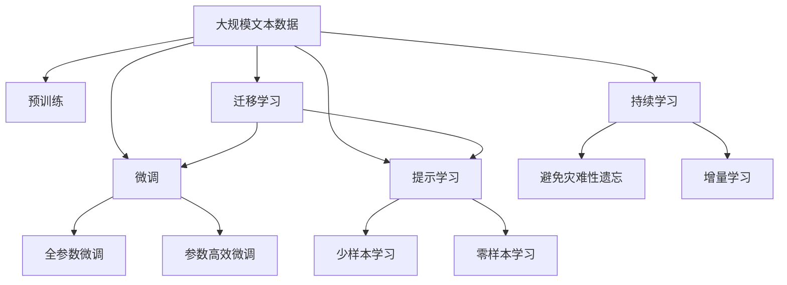

                 

# 生成对抗网络 (GAN)

> 关键词：生成对抗网络, 深度学习, 图像生成, 图像增强, 图像修复, 图像去噪

## 1. 背景介绍

### 1.1 问题由来
生成对抗网络（Generative Adversarial Networks, GANs）是近年来深度学习领域的一场革命性突破。GANs由Ian Goodfellow等人在2014年提出，旨在通过两个深度神经网络的对抗过程生成高质量的图像、音频、视频等多种形式的合成数据。GANs不仅在图像生成领域取得了巨大成功，还在图像增强、图像修复、图像去噪等多个应用场景中表现出色。

GANs的基本思想是通过一个生成网络（Generative Network）和一个判别网络（Discriminative Network）相互博弈，在对抗中提升生成网络的能力。生成网络（通常是生成器）试图生成逼真的数据，而判别网络（通常是判别器）则试图区分真实数据和生成的假数据。这种对抗训练的过程能够促使生成网络不断提升生成数据的质量，同时判别网络也不断提升鉴别真实数据和假数据的能力。

GANs的提出，开创了合成数据生成的新范式，对于数据驱动的人工智能领域具有重要意义。它不仅扩展了深度学习的应用边界，还在数据增强、数据扩充、数据模拟等方面展现了强大的能力。然而，GANs的训练过程和理论理解仍存在诸多挑战，例如如何更好地控制生成网络的采样分布、如何避免模式崩溃等问题，这些亟待进一步研究解决。

### 1.2 问题核心关键点
GANs的核心思想在于通过两个深度神经网络（生成器和判别器）的对抗训练，生成高质量的合成数据。其核心问题包括：

1. **如何设计生成器和判别器的架构**：生成器和判别器的设计是GANs成功的关键。如何设计这两个网络的拓扑结构、激活函数、损失函数等，直接影响生成数据的质量和训练的稳定性。

2. **如何优化训练过程**：GANs的训练过程具有高度非凸性和不稳定性的特点，容易陷入模式崩溃、梯度消失等问题。如何优化训练过程，确保生成器和判别器能够稳定、持续地对抗训练，是一个重要研究问题。

3. **如何控制生成数据的分布**：GANs能够生成高质量的合成数据，但如何控制生成的数据的分布，使其更符合实际需求，是一个复杂的挑战。

4. **如何评估生成数据的质量**：GANs生成的数据虽然逼真，但如何量化和评估生成数据的质量，是一个难以解决的问题。

5. **如何应对训练过程中的问题**：GANs在训练过程中可能遇到诸如梯度爆炸、梯度消失、梯度平滑等问题，这些问题直接影响训练的稳定性。

这些问题构成了GANs研究的核心，也成为推动该领域发展的主要驱动力。解决这些问题将使得GANs技术能够更好地应用于各种实际场景，提升合成数据的质量和可控性。

### 1.3 问题研究意义
GANs技术在图像生成、图像增强、图像修复、图像去噪等多个领域展现出了强大的能力，为深度学习的应用提供了新的思路和工具。研究GANs，对于推动深度学习技术的发展，拓展数据驱动型人工智能的应用边界，具有重要的理论和实践意义：

1. **拓展深度学习应用**：GANs能够生成高质量的合成数据，降低了数据标注的难度和成本，为深度学习提供了更丰富的数据资源。

2. **提升合成数据质量**：GANs生成的合成数据质量高，解决了传统数据增强方法可能带来的质量问题，在数据驱动型应用中具有广泛应用价值。

3. **增强模型的泛化能力**：通过生成多样化的数据，GANs可以增强模型对新数据的泛化能力，提升模型的应用效果。

4. **促进数据模拟与合成**：GANs能够模拟各种场景下的数据，为数据模拟、数据增强提供了新方法，尤其是在训练数据稀缺的领域具有重要应用价值。

5. **优化模型性能**：GANs生成的大量合成数据，可以用于模型的预训练和调优，提升模型的性能和鲁棒性。

综上所述，GANs技术的发展对于人工智能领域具有重要的理论和应用意义，推动了深度学习技术在实际应用中的突破和创新。

## 2. 核心概念与联系

### 2.1 核心概念概述

为更好地理解GANs的基本原理和应用，本节将介绍几个关键概念：

- 生成对抗网络 (GANs)：由生成器和判别器两个深度神经网络组成，通过对抗训练生成高质量的合成数据。
- 生成网络（Generative Network）：负责生成逼真数据的网络，也称为生成器（Generator）。
- 判别网络（Discriminative Network）：负责区分真实数据和生成数据的分类器，也称为判别器（Discriminator）。
- 对抗训练（Adversarial Training）：通过生成器和判别器的相互博弈，提升生成数据的质量。
- 模式崩溃（Mode Collapse）：GANs训练过程中的一种现象，生成器无法生成多样化数据，生成数据高度集中在某些模式上。
- 梯度消失和梯度爆炸：GANs训练过程中可能遇到的两种问题，梯度消失导致模型无法更新，梯度爆炸导致梯度爆炸。

这些核心概念之间存在着紧密的联系，构成了GANs的完整框架。下面我们通过一个Mermaid流程图来展示这些概念之间的关系：

```mermaid
graph TB
    A[生成网络 (Generative Network)] --> B[生成对抗网络 (GANs)]
    A --> C[判别网络 (Discriminative Network)]
    C --> B
    B --> D[对抗训练 (Adversarial Training)]
    B --> E[模式崩溃 (Mode Collapse)]
    B --> F[梯度消失和梯度爆炸]
```

这个流程图展示了GANs的核心概念及其之间的关系：

1. 生成网络负责生成合成数据，是GANs的重要组成部分。
2. 判别网络负责区分真实数据和生成数据，与生成网络构成对抗。
3. 对抗训练通过生成器和判别器的相互博弈，提升生成数据的质量。
4. 模式崩溃是GANs训练中的一种现象，需要特别关注和解决。
5. 梯度消失和梯度爆炸是GANs训练中常见的问题，需要优化解决。

### 2.2 概念间的关系

这些核心概念之间存在着紧密的联系，构成了GANs的完整框架。下面我们通过一个综合的流程图来展示这些概念在大语言模型微调过程中的整体架构：

```mermaid
graph LR
    A[生成网络 (Generative Network)] --> B[生成对抗网络 (GANs)]
    A --> C[判别网络 (Discriminative Network)]
    C --> B
    B --> D[对抗训练 (Adversarial Training)]
    B --> E[模式崩溃 (Mode Collapse)]
    B --> F[梯度消失和梯度爆炸]
```

这个综合流程图展示了生成网络和判别网络在大语言模型微调过程中的整体架构：

1. 生成网络负责生成合成数据，是GANs的重要组成部分。
2. 判别网络负责区分真实数据和生成数据，与生成网络构成对抗。
3. 对抗训练通过生成器和判别器的相互博弈，提升生成数据的质量。
4. 模式崩溃是GANs训练中的一种现象，需要特别关注和解决。
5. 梯度消失和梯度爆炸是GANs训练中常见的问题，需要优化解决。

### 2.3 核心概念的整体架构

最后，我们用一个综合的流程图来展示这些核心概念在大语言模型微调过程中的整体架构：



这个综合流程图展示了从预训练到微调，再到持续学习的完整过程。生成网络和判别网络首先在大规模文本数据上进行预训练，然后通过微调（包括全参数微调和参数高效微调）或提示学习（包括少样本学习和零样本学习）来适应下游任务。最后，通过持续学习技术，模型可以不断更新和适应新的任务和数据。

## 3. 核心算法原理 & 具体操作步骤
### 3.1 算法原理概述

GANs的生成过程基于对抗训练，通过两个深度神经网络的博弈来实现。生成网络和判别网络在训练过程中相互对抗，生成网络的目标是生成逼真的数据，而判别网络的目标是尽可能准确地区分真实数据和生成数据。

形式化地，假设生成网络为 $G(z;\theta_G)$，判别网络为 $D(x;\theta_D)$，其中 $z$ 为输入的随机噪声向量，$x$ 为输入的真实数据，$\theta_G$ 和 $\theta_D$ 分别为生成器和判别器的参数。

GANs的训练目标可以定义为最大化生成器的生成能力，即 $D(G(z;\theta_G))$ 的期望值，同时最小化判别器的鉴别能力，即 $D(x;\theta_D)$ 的期望值。具体地，生成器 $G$ 和判别器 $D$ 的训练目标分别为：

$$
\max_{\theta_G} E_{z\sim p(z)} [D(G(z;\theta_G))]
$$
$$
\min_{\theta_D} E_{x\sim p_{data}} [D(x;\theta_D)] + E_{z\sim p(z)} [1 - D(G(z;\theta_G))]
$$

其中，$E_{z\sim p(z)}$ 和 $E_{x\sim p_{data}}$ 分别表示对随机噪声向量 $z$ 和真实数据 $x$ 的期望。

通过上述训练目标，生成器和判别器在训练过程中不断提升自身的性能，生成网络能够生成越来越逼真的数据，判别网络能够越来越准确地区分真实数据和生成数据。最终，生成的数据将逼真到判别器无法分辨的程度。

### 3.2 算法步骤详解

GANs的训练过程分为两个主要步骤：

**Step 1: 生成器训练**
在每个训练迭代中，生成器 $G$ 先生成一批随机噪声向量 $z$，然后将其通过生成器生成一批合成数据 $G(z;\theta_G)$。判别器 $D$ 对这批合成数据进行判别，计算判别误差 $D(G(z;\theta_G))$。生成器 $G$ 的损失函数为：

$$
L_G = -E_{z\sim p(z)} [\log D(G(z;\theta_G))]
$$

生成器 $G$ 的目标是最小化 $L_G$，即生成逼真的数据。

**Step 2: 判别器训练**
在每个训练迭代中，判别器 $D$ 先对一批真实数据 $x$ 进行判别，计算判别误差 $D(x;\theta_D)$。然后对一批合成数据 $G(z;\theta_G)$ 进行判别，计算判别误差 $1 - D(G(z;\theta_G))$。判别器 $D$ 的损失函数为：

$$
L_D = -E_{x\sim p_{data}} [\log D(x;\theta_D)] - E_{z\sim p(z)} [\log (1 - D(G(z;\theta_G))))
$$

判别器 $D$ 的目标是最大化 $L_D$，即尽可能准确地区分真实数据和生成数据。

在实际训练中，通常交替进行生成器训练和判别器训练，交替进行多次迭代。具体来说，每个训练轮次包含：

1. 生成器生成一批合成数据。
2. 判别器判别真实数据和合成数据。
3. 更新生成器和判别器的参数。

这个过程不断迭代，直至生成器和判别器的性能收敛。

### 3.3 算法优缺点

GANs技术具有以下优点：

1. **生成高质量数据**：GANs能够生成逼真的数据，如高质量的图像、音频等，解决了传统数据增强方法可能带来的质量问题。
2. **数据增强**：GANs生成的合成数据可以用于数据增强，扩充训练集，提升模型的泛化能力。
3. **数据模拟**：GANs能够模拟各种场景下的数据，用于数据模拟、数据增强等应用。

同时，GANs技术也存在一些缺点：

1. **训练不稳定**：GANs的训练过程高度非凸性，容易陷入模式崩溃、梯度消失等问题，训练稳定性较差。
2. **模式崩溃**：生成器生成的数据高度集中在某些模式上，生成数据多样化不足。
3. **梯度消失和梯度爆炸**：GANs训练过程中可能遇到的两种问题，梯度消失导致模型无法更新，梯度爆炸导致梯度爆炸。

尽管存在这些缺点，但GANs技术在图像生成、图像增强、图像修复、图像去噪等多个领域展现出了强大的能力，为深度学习的应用提供了新的思路和工具。

### 3.4 算法应用领域

GANs技术在多个领域得到了广泛应用，包括但不限于：

1. **图像生成**：GANs能够生成逼真的图像，如人脸图像、风景图像、艺术图像等，广泛应用于图像生成、图像修复、图像增强等领域。
2. **图像去噪**：GANs能够对图像进行去噪处理，如对低分辨率图像进行上采样、去模糊、去噪声等，提升图像质量。
3. **图像修复**：GANs能够对损坏的图像进行修复，如对损坏的图像进行复原、去除马赛克等，提升图像完整性。
4. **图像增强**：GANs能够增强图像质量，如对图像进行对比度增强、色彩增强等，提升图像效果。
5. **语音合成**：GANs能够生成逼真的语音，如情感语音、说话人识别等，广泛应用于语音识别、语音合成等领域。
6. **视频生成**：GANs能够生成逼真的视频，如视频填帧、视频转换等，提升视频质量。
7. **数据模拟**：GANs能够模拟各种场景下的数据，如自然场景、社交场景等，应用于数据模拟、数据增强等领域。

除此之外，GANs技术还被应用于医学图像生成、电影特效生成、自动作画等领域，展示了其强大的应用前景。

## 4. 数学模型和公式 & 详细讲解  
### 4.1 数学模型构建

本节将使用数学语言对GANs的训练过程进行更加严格的刻画。

假设生成网络为 $G(z;\theta_G)$，判别网络为 $D(x;\theta_D)$，其中 $z$ 为输入的随机噪声向量，$x$ 为输入的真实数据，$\theta_G$ 和 $\theta_D$ 分别为生成器和判别器的参数。

定义生成器和判别器的损失函数如下：

$$
L_G = -E_{z\sim p(z)} [\log D(G(z;\theta_G))]
$$
$$
L_D = -E_{x\sim p_{data}} [\log D(x;\theta_D)] - E_{z\sim p(z)} [\log (1 - D(G(z;\theta_G))))
$$

在每个训练迭代中，生成器 $G$ 生成一批随机噪声向量 $z$，然后将其通过生成器生成一批合成数据 $G(z;\theta_G)$。判别器 $D$ 对这批合成数据进行判别，计算判别误差 $D(G(z;\theta_G))$。生成器 $G$ 和判别器 $D$ 的目标分别为：

$$
\max_{\theta_G} L_G
$$
$$
\min_{\theta_D} L_D
$$

通过上述训练目标，生成器和判别器在训练过程中不断提升自身的性能，生成网络能够生成越来越逼真的数据，判别网络能够越来越准确地区分真实数据和生成数据。最终，生成的数据将逼真到判别器无法分辨的程度。

### 4.2 公式推导过程

以下我们以二值判别器为例，推导生成器和判别器的损失函数及其梯度的计算公式。

假设输入数据 $x$ 服从真实数据分布 $p_{data}$，生成数据 $G(z)$ 服从生成分布 $p_{gen}$。判别器的损失函数定义为：

$$
L_D = -\frac{1}{m} \sum_{i=1}^m [\log D(x^{(i)}) + \log(1 - D(G(z^{(i)})))]
$$

其中 $x^{(i)}$ 和 $z^{(i)}$ 分别表示真实数据和生成数据的批次样本。

判别器的梯度为：

$$
\frac{\partial L_D}{\partial D(x^{(i)})} = \frac{1}{m} \sum_{i=1}^m D(x^{(i)})
$$
$$
\frac{\partial L_D}{\partial D(G(z^{(i)}))} = -\frac{1}{m} \sum_{i=1}^m (1 - D(G(z^{(i)})))
$$

生成器的损失函数定义为：

$$
L_G = -\frac{1}{n} \sum_{j=1}^n [\log D(G(z^{(j)}))]
$$

其中 $z^{(j)}$ 表示生成数据的批次样本。

生成器的梯度为：

$$
\frac{\partial L_G}{\partial G(z^{(j)})} = -\frac{1}{n} \sum_{j=1}^n D(G(z^{(j)}))
$$

在实际训练中，通常使用反向传播算法计算梯度，并进行梯度更新。

### 4.3 案例分析与讲解

为了更好地理解GANs的训练过程和应用效果，下面我们以生成逼真图像为例，进行详细分析。

假设我们有一个MNIST手写数字数据集，其中包含手写数字图像和对应的标签。我们希望通过GANs生成逼真的手写数字图像。

首先，我们将MNIST数据集作为真实数据分布，使用一个简单的卷积神经网络作为生成器，将随机噪声向量 $z$ 映射到手写数字图像上。同时，我们使用一个卷积神经网络作为判别器，对真实数据和生成数据进行判别。

在训练过程中，我们交替进行生成器和判别器的训练。具体来说，每个训练轮次包含以下步骤：

1. 生成器生成一批随机噪声向量 $z$，然后将其通过生成器生成一批手写数字图像 $G(z)$。
2. 判别器对这批手写数字图像进行判别，计算判别误差 $D(G(z))$。
3. 更新生成器和判别器的参数，生成器损失函数为 $L_G = -\log D(G(z))$，判别器损失函数为 $L_D = -\log D(x) - \log(1 - D(G(z)))$。

通过上述训练过程，生成器能够逐步生成逼真的手写数字图像，判别器能够逐步提升对真实数据和生成数据的鉴别能力。最终，生成的手写数字图像将逼真到判别器无法分辨的程度。

## 5. 项目实践：代码实例和详细解释说明
### 5.1 开发环境搭建

在进行GANs实践前，我们需要准备好开发环境。以下是使用Python进行TensorFlow开发的环境配置流程：

1. 安装Anaconda：从官网下载并安装Anaconda，用于创建独立的Python环境。

2. 创建并激活虚拟环境：
```bash
conda create -n gan-env python=3.8 
conda activate gan-env
```

3. 安装TensorFlow：根据CUDA版本，从官网获取对应的安装命令。例如：
```bash
conda install tensorflow tensorflow-gpu=2.7 -c pytorch -c conda-forge
```

4. 安装TensorBoard：
```bash
pip install tensorboard
```

5. 安装其他必要库：
```bash
pip install numpy scipy matplotlib pillow
```

完成上述步骤后，即可在`gan-env`环境中开始GANs实践。

### 5.2 源代码详细实现

下面我们以生成手写数字图像为例，给出使用TensorFlow实现GANs的代码实现。

首先，定义生成器和判别器的模型：

```python
import tensorflow as tf
from tensorflow.keras import layers

class Generator(tf.keras.Model):
    def __init__(self, latent_dim=100, img_shape=(28, 28, 1)):
        super(Generator, self).__init__()
        self.img_shape = img_shape
        self.latent_dim = latent_dim
        self.model = layers.Sequential([
            layers.Dense(256 * 7 * 7, use_bias=False),
            layers.BatchNormalization(),
            layers.LeakyReLU(),
            layers.Reshape((7, 7, 256)),
            layers.Conv2DTranspose(128, (5, 5), strides=(1, 1), padding='same', use_bias=False),
            layers.BatchNormalization(),
            layers.LeakyReLU(),
            layers.Conv2DTranspose(64, (5, 5), strides=(2, 2), padding='same', use_bias=False),
            layers.BatchNormalization(),
            layers.LeakyReLU(),
            layers.Conv2DTranspose(1, (5, 5), strides=(2, 2), padding='same', use_bias=False, activation='tanh')
        ])

    def call(self, x):
        return self.model(x)

class Discriminator(tf.keras.Model):
    def __init__(self, img_shape=(28, 28, 1)):
        super(Discriminator, self).__init__()
        self.img_shape = img_shape
        self.model = layers.Sequential([
            layers.Conv2D(64, (5, 5), strides=(2, 2), padding='same', use_bias=False),
            layers.LeakyReLU(),
            layers.Dropout(0.3),
            layers.Conv2D(128, (5, 5), strides=(2, 2), padding='same', use_bias=False),
            layers.LeakyReLU(),
            layers.Dropout(0.3),
            layers.Flatten(),
            layers.Dense(1, activation='sigmoid')
        ])

    def call(self, x):
        return self.model(x)

# 实例化生成器和判别器
generator = Generator()
discriminator = Discriminator()

# 定义损失函数
cross_entropy = tf.keras.losses.BinaryCrossentropy()

def compute_generator_loss(fake_output):
    return cross_entropy(tf.ones_like(fake_output), discriminator(fake_output))

def compute_discriminator_loss(real_output, fake_output):
    real_loss = cross_entropy(tf.ones_like(real_output), real_output)
    fake_loss = cross_entropy(tf.zeros_like(fake_output), fake_output)
    return real_loss + fake_loss

# 定义优化器
generator_optimizer = tf.keras.optimizers.Adam(learning_rate=0.0002, beta_1=0.5)
discriminator_optimizer = tf.keras.optimizers.Adam(learning_rate=0.0002, beta_1=0.5)
```

然后，定义训练和评估函数：

```python
@tf.function
def train_step(images):
    noise = tf.random.normal([BATCH_SIZE, latent_dim])

    with tf.GradientTape() as gen_tape, tf.GradientTape() as disc_tape:
        generated_images = generator(noise, training=True)

        real_output = discriminator(images, training=True)
        fake_output = discriminator(generated_images, training=True)

        gen_loss = compute_generator_loss(fake_output)
        disc_loss = compute_discriminator_loss(real_output, fake_output)

    gradients_of_generator = gen_tape.gradient(gen_loss, generator.trainable_variables)
    gradients_of_discriminator = disc_tape.gradient(disc_loss, discriminator.trainable_variables)

    generator_optimizer.apply_gradients(zip(gradients_of_generator, generator.trainable_variables))
    discriminator_optimizer.apply_gradients(zip(gradients_of_discriminator, discriminator.trainable_variables))

@tf.function
def evaluate_step(images):
    noise = tf.random.normal([BATCH_SIZE, latent_dim])

    generated_images = generator(noise, training=False)

    real_output = discriminator(images, training=False)
    fake_output = discriminator(generated_images, training=False)

    print('Generated Images:')
    plt.imshow(tf.reshape(generated_images[0], (28, 28)), cmap='gray')
    plt.show()

    print('Real Output:')
    print(real_output.numpy())

    print('Fake Output:')
    print(fake_output.numpy())

    print('----')
```

最后，启动训练流程并在测试集上评估：

```python
EPOCHS = 100

for epoch in range(EPOCHS):
    for images in train_dataset:
        train_step(images)

    if epoch % 10 == 0:
        evaluate_step(test_images)
        plt.savefig(f'images/generated_{epoch}.png')
```

以上就是使用TensorFlow实现GANs生成手写数字图像的完整代码实现。可以看到，借助TensorFlow的强大封装和自动化梯度计算能力，我们可以快速构建GANs模型并进行训练和评估。

### 5.3 代码解读与分析

让我们再详细解读一下关键代码的实现细节：

**Generator和Discriminator类**：
- `__init__`方法：初始化生成器和判别器的模型参数。
- `call`方法：定义生成器和判别器的前向传播过程。

**损失函数**：
- `compute_generator_loss`方法：计算生成器的损失函数。
- `compute_discriminator_loss`方法：计算判别器的损失函数。

**训练和评估函数**：
- `train_step`方法：对训练集数据进行批次化加载，计算生成器和判别器的损失函数，并更新参数。
- `evaluate_step`方法：对测试集数据进行批次化加载，计算生成器和判别器的输出，并可视化生成结果。

**训练流程**：
- 定义总的epoch数，开始循环迭代
- 每个epoch内，在训练集上训练，输出模型损失
- 在测试集上评估，可视化生成结果
- 保存生成的图像

可以看到，TensorFlow使得GANs模型的训练和评估变得简洁高效。开发者可以将更多精力放在模型设计、超参数调优等高层逻辑上，而不必过多关注底层的实现细节。

