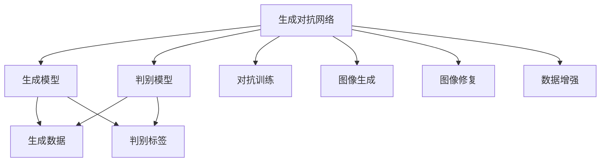
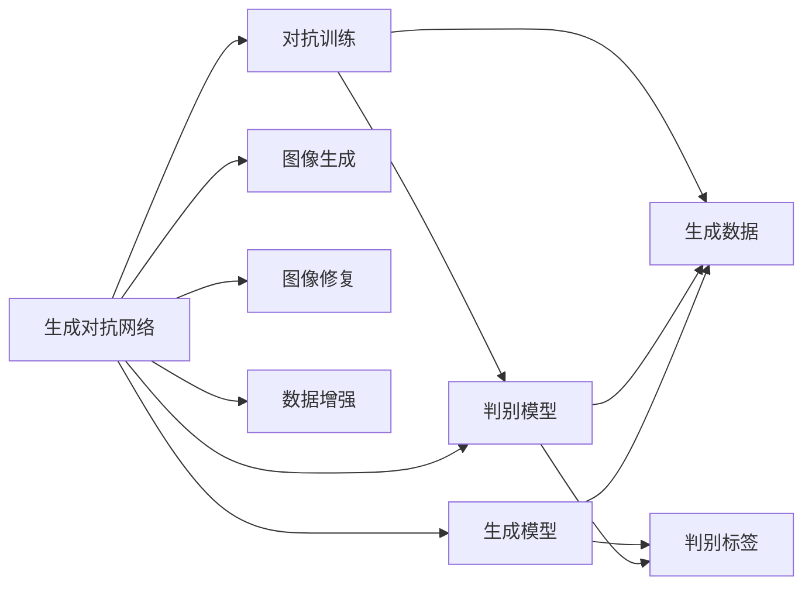
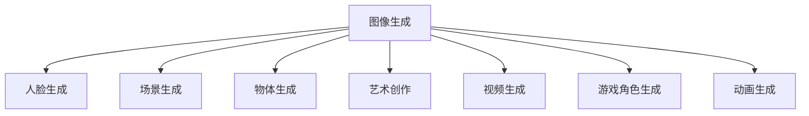
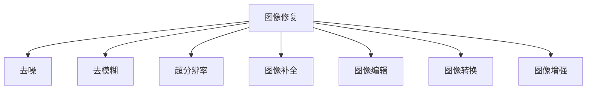

                 

# 生成对抗网络GAN原理与代码实例讲解

> 关键词：生成对抗网络(GANs),生成模型,判别模型,损失函数,梯度下降,对抗训练,图像生成,图像修复

## 1. 背景介绍

### 1.1 问题由来
生成对抗网络（Generative Adversarial Networks，简称GANs）是近年来在图像生成、视频生成等领域大放异彩的技术，以其独特的生成能力和逼真度，深受研究者的青睐。GANs通过两个模型的对抗训练，即一个生成模型（Generative Model）和一个判别模型（Discriminative Model），来训练生成模型以生成逼真的图像或数据。其中生成模型负责生成伪造数据，而判别模型则负责区分生成数据与真实数据的区别。两者的对抗训练促进了生成模型的不断提升，能够生成越来越逼真的数据。

GANs技术在图像生成、视频生成、音频生成、文本生成等多个领域有广泛的应用，推动了人工智能技术的发展。然而，GANs技术在实际应用中也面临诸多挑战，如模式崩溃、训练不稳定、计算复杂度高、生成数据质量不稳定等问题。针对这些问题，研究者们不断优化和改进GANs技术，使得GANs能够在更广泛的领域中应用，并提升了生成数据的质量和稳定性。

### 1.2 问题核心关键点
GANs的核心在于生成模型和判别模型的对抗训练。生成模型的目标是生成尽可能逼真的数据，而判别模型的目标是区分生成数据和真实数据。两者的对抗训练过程不断迭代，使得生成模型不断优化，生成数据的质量不断提升。

具体来说，生成对抗网络的工作流程如下：
1. **生成模型训练**：生成模型随机生成数据，并输出到判别模型。
2. **判别模型训练**：判别模型接收生成数据和真实数据，判断并输出真假标签。
3. **损失计算**：计算生成模型和判别模型的损失函数，并更新模型参数。
4. **对抗训练**：生成模型和判别模型互相优化，直到生成数据与真实数据无法区分。

GANs的训练过程需要大量的计算资源和时间，且容易陷入局部最优解。为了解决这些问题，研究者们提出了多种改进方法，如WGAN、WGAN-GP、DCGAN等。这些改进方法在一定程度上缓解了GANs的训练问题，提升了生成数据的质量和稳定性。

## 2. 核心概念与联系

### 2.1 核心概念概述

为更好地理解生成对抗网络GAN的原理和架构，本节将介绍几个密切相关的核心概念：

- 生成对抗网络（GANs）：一种通过两个模型的对抗训练生成逼真数据的深度学习架构。
- 生成模型（Generative Model）：负责生成伪造数据，通常使用神经网络模型，如深度卷积神经网络（DCNN）。
- 判别模型（Discriminative Model）：负责区分生成数据和真实数据，同样使用神经网络模型，如DCNN。
- 损失函数：用于衡量生成数据和真实数据之间的差异，是训练模型的关键指标。
- 梯度下降（Gradient Descent）：优化模型参数的常用算法，通过计算损失函数的梯度，不断调整模型参数，使得损失函数最小化。
- 对抗训练（Adversarial Training）：生成模型和判别模型的对抗训练过程，通过不断调整模型参数，使生成数据与真实数据无法区分。
- 图像生成（Image Generation）：使用GANs生成逼真图像的应用场景，如人脸生成、场景生成等。
- 图像修复（Image Restoration）：使用GANs修复损坏图像的应用场景，如去噪、去模糊、超分辨率等。
- 数据增强（Data Augmentation）：使用GANs生成新的数据样本，以增加训练数据集的多样性和数量。

这些核心概念之间的逻辑关系可以通过以下Mermaid流程图来展示：



这个流程图展示了大语言模型的核心概念及其之间的关系：

1. 生成对抗网络由生成模型和判别模型组成。
2. 生成模型通过对抗训练生成逼真数据。
3. 判别模型接收生成数据和真实数据，进行真假判别。
4. 对抗训练过程不断迭代，使得生成数据逼真度不断提高。
5. GANs技术在图像生成、修复和增强等场景中都有应用。

### 2.2 概念间的关系

这些核心概念之间存在着紧密的联系，形成了GANs技术的完整生态系统。下面我们通过几个Mermaid流程图来展示这些概念之间的关系。

#### 2.2.1 生成对抗网络的训练流程



这个流程图展示了大语言模型的训练流程，包含生成模型、判别模型、生成数据和判别标签的交互。通过不断迭代生成模型和判别模型的参数，使得生成数据逐渐逼真，生成对抗网络的性能不断提升。

#### 2.2.2 图像生成的应用场景



这个流程图展示了GANs技术在图像生成领域的应用场景，包括人脸生成、场景生成、物体生成、艺术创作、视频生成、游戏角色生成和动画生成等。

#### 2.2.3 图像修复的应用场景



这个流程图展示了GANs技术在图像修复领域的应用场景，包括去噪、去模糊、超分辨率、图像补全、图像编辑、图像转换和图像增强等。

## 3. 核心算法原理 & 具体操作步骤
### 3.1 算法原理概述

生成对抗网络（GANs）的核心在于生成模型和判别模型的对抗训练。其基本原理是通过不断迭代，使生成模型生成的数据越来越逼真，判别模型越来越难以区分真实数据和生成数据。具体来说，GANs的训练过程包含以下步骤：

1. **生成模型的训练**：生成模型接收噪声向量作为输入，输出一张图像。
2. **判别模型的训练**：判别模型接收生成图像和真实图像，输出真假标签。
3. **对抗训练**：生成模型和判别模型通过对抗训练不断迭代，生成模型逐渐生成逼真图像，判别模型逐渐难以区分真实图像和生成图像。

GANs的训练目标是通过最小化判别器的损失函数和最大化生成器的损失函数，使得生成器生成的图像和真实图像无法区分。通常，使用交叉熵损失函数来衡量判别器的预测结果与真实标签之间的差异，使用均方误差损失函数来衡量生成器生成的图像与真实图像之间的差异。

### 3.2 算法步骤详解

#### 3.2.1 生成模型的训练

生成模型的训练目标是生成尽可能逼真的图像，通常使用深度卷积神经网络（DCNN）来实现。以下是训练生成模型的具体步骤：

1. 随机生成一个噪声向量 $\mathbf{z}$，作为生成器的输入。
2. 使用生成器 $G$ 将噪声向量 $\mathbf{z}$ 转换为图像 $G(\mathbf{z})$。
3. 将生成的图像 $G(\mathbf{z})$ 和真实图像 $y$ 一起输入到判别器 $D$ 中。
4. 计算判别器 $D$ 对生成图像 $G(\mathbf{z})$ 的预测结果 $D(G(\mathbf{z}))$。
5. 计算生成器的损失函数 $L_G$，通常使用均方误差损失函数，衡量生成图像与真实图像之间的差异：

   $$
   L_G = \mathbb{E}_{z \sim p_z}[\|\mathbf{z}\|^2]
   $$

   其中 $p_z$ 表示噪声向量的分布，通常使用标准正态分布。

#### 3.2.2 判别模型的训练

判别模型的训练目标是区分真实图像和生成图像，同样使用DCNN来实现。以下是训练判别模型的具体步骤：

1. 随机生成一个噪声向量 $\mathbf{z}$，作为生成器的输入。
2. 使用生成器 $G$ 将噪声向量 $\mathbf{z}$ 转换为图像 $G(\mathbf{z})$。
3. 将生成的图像 $G(\mathbf{z})$ 和真实图像 $y$ 一起输入到判别器 $D$ 中。
4. 计算判别器 $D$ 对真实图像 $y$ 的预测结果 $D(y)$ 和对生成图像 $G(\mathbf{z})$ 的预测结果 $D(G(\mathbf{z}))$。
5. 计算判别器的损失函数 $L_D$，通常使用交叉熵损失函数，衡量判别器对真实图像和生成图像的判别能力：

   $$
   L_D = \mathbb{E}_{y \sim p_y}[-\log D(y)] + \mathbb{E}_{z \sim p_z}[-\log (1 - D(G(z))))
   $$

   其中 $p_y$ 表示真实图像的分布，$p_z$ 表示噪声向量的分布。

#### 3.2.3 对抗训练

对抗训练是通过不断迭代生成模型和判别模型的参数，使得生成模型生成的图像逼真度不断提高。以下是对抗训练的具体步骤：

1. 随机生成一个噪声向量 $\mathbf{z}$，作为生成器的输入。
2. 使用生成器 $G$ 将噪声向量 $\mathbf{z}$ 转换为图像 $G(\mathbf{z})$。
3. 将生成的图像 $G(\mathbf{z})$ 和真实图像 $y$ 一起输入到判别器 $D$ 中。
4. 计算判别器 $D$ 对生成图像 $G(\mathbf{z})$ 的预测结果 $D(G(\mathbf{z}))$。
5. 计算生成器 $G$ 和判别器 $D$ 的损失函数 $L_G$ 和 $L_D$。
6. 使用梯度下降算法，更新生成器 $G$ 和判别器 $D$ 的参数，使得生成器生成的图像逼真度不断提高，判别器无法区分真实图像和生成图像。

### 3.3 算法优缺点

GANs算法具有以下优点：
1. 生成能力强大：GANs可以生成高质量的逼真图像，适用于图像生成、修复、增强等多个领域。
2. 训练效率高：GANs的训练过程可以通过对抗训练不断迭代优化，生成图像质量逐渐提升。
3. 适用性广：GANs可以应用于图像、视频、音频、文本等多个领域，生成各类数据。

同时，GANs算法也存在以下缺点：
1. 训练过程不稳定：GANs的训练过程容易陷入局部最优解，生成图像质量不稳定。
2. 模式崩溃（Mode Collapse）：生成模型生成的图像质量单一，多样性不足。
3. 计算复杂度高：GANs的训练过程需要大量的计算资源和时间，存在计算瓶颈。
4. 可解释性差：GANs模型难以解释生成图像的生成过程，缺乏可解释性。

尽管存在这些缺点，但GANs在图像生成等领域仍然取得了显著的成果，成为一种重要的深度学习技术。

### 3.4 算法应用领域

GANs技术在图像生成、视频生成、音频生成、文本生成等多个领域有广泛的应用，推动了人工智能技术的发展。以下是一些常见的应用场景：

- **图像生成**：使用GANs生成逼真图像，如人脸生成、场景生成、物体生成、艺术创作等。
- **图像修复**：使用GANs修复损坏图像，如去噪、去模糊、超分辨率等。
- **数据增强**：使用GANs生成新的数据样本，以增加训练数据集的多样性和数量。
- **视频生成**：使用GANs生成逼真视频，如运动生成、人脸动画等。
- **音频生成**：使用GANs生成逼真音频，如音乐生成、语音合成等。
- **文本生成**：使用GANs生成逼真文本，如对话生成、文本摘要、翻译等。

除了上述这些经典应用外，GANs技术还在游戏、虚拟现实、医学等领域得到广泛应用，为各个领域带来了新的解决方案。

## 4. 数学模型和公式 & 详细讲解  
### 4.1 数学模型构建

GANs的核心数学模型包括生成模型、判别模型和损失函数。以下是详细描述：

- **生成模型**：生成模型 $G$ 接收一个随机噪声向量 $\mathbf{z}$，输出一个图像 $G(\mathbf{z})$。通常使用深度卷积神经网络（DCNN）来实现。

- **判别模型**：判别模型 $D$ 接收一个图像 $G(\mathbf{z})$ 或一个真实图像 $y$，输出一个真假标签 $D(G(\mathbf{z}))$ 或 $D(y)$。同样使用DCNN来实现。

- **损失函数**：GANs的损失函数包括生成器的损失函数 $L_G$ 和判别器的损失函数 $L_D$。生成器的损失函数 $L_G$ 通常使用均方误差损失函数，衡量生成图像与真实图像之间的差异；判别器的损失函数 $L_D$ 通常使用交叉熵损失函数，衡量判别器对真实图像和生成图像的判别能力。

以下是GANs的数学模型和损失函数的具体公式：

$$
\begin{aligned}
&G: \mathbb{R}^d \rightarrow \mathbb{R}^m \\
&G(z) = [G_1(z), G_2(z), \ldots, G_k(z)]
\end{aligned}
$$

$$
\begin{aligned}
&D: \mathbb{R}^m \rightarrow [0, 1] \\
&D(x) = [D_1(x), D_2(x), \ldots, D_k(x)]
\end{aligned}
$$

$$
\begin{aligned}
&L_G = \mathbb{E}_{z \sim p_z}[\|\mathbf{z}\|^2] \\
&L_D = \mathbb{E}_{y \sim p_y}[-\log D(y)] + \mathbb{E}_{z \sim p_z}[-\log (1 - D(G(z))))
\end{aligned}
$$

其中 $p_z$ 表示噪声向量的分布，通常使用标准正态分布；$p_y$ 表示真实图像的分布。

### 4.2 公式推导过程

以下是GANs中生成模型和判别模型的推导过程：

#### 4.2.1 生成模型的推导

生成模型 $G$ 接收一个随机噪声向量 $\mathbf{z}$，输出一个图像 $G(\mathbf{z})$。生成模型的推导过程如下：

$$
G(z) = G_1(z) + G_2(z) + \ldots + G_k(z)
$$

其中 $G_k(z)$ 表示生成模型中的第 $k$ 层，可以使用深度卷积神经网络（DCNN）来实现。

#### 4.2.2 判别模型的推导

判别模型 $D$ 接收一个图像 $G(\mathbf{z})$ 或一个真实图像 $y$，输出一个真假标签 $D(G(\mathbf{z}))$ 或 $D(y)$。判别模型的推导过程如下：

$$
D(x) = D_1(x) \odot D_2(x) \odot \ldots \odot D_k(x)
$$

其中 $D_k(x)$ 表示判别模型中的第 $k$ 层，可以使用深度卷积神经网络（DCNN）来实现。

#### 4.2.3 损失函数的推导

GANs的损失函数包括生成器的损失函数 $L_G$ 和判别器的损失函数 $L_D$。生成器的损失函数 $L_G$ 通常使用均方误差损失函数，衡量生成图像与真实图像之间的差异；判别器的损失函数 $L_D$ 通常使用交叉熵损失函数，衡量判别器对真实图像和生成图像的判别能力。

以下是生成器和判别器的损失函数的推导过程：

$$
L_G = \mathbb{E}_{z \sim p_z}[\|\mathbf{z}\|^2]
$$

$$
L_D = \mathbb{E}_{y \sim p_y}[-\log D(y)] + \mathbb{E}_{z \sim p_z}[-\log (1 - D(G(z))))
$$

其中 $p_z$ 表示噪声向量的分布，通常使用标准正态分布；$p_y$ 表示真实图像的分布。

### 4.3 案例分析与讲解

以下是GANs在图像生成领域的两个经典案例，分别使用DCGAN和CycleGAN技术进行详细讲解：

#### 4.3.1 DCGAN案例

DCGAN（Deep Convolutional Generative Adversarial Network）是一种使用卷积神经网络（CNN）的GANs模型，用于生成高质量的逼真图像。以下是DCGAN的详细案例讲解：

1. **数据准备**：使用CelebA数据集，包含人脸图像和对应的标签。

2. **模型构建**：使用PyTorch构建生成器和判别器，生成器使用U-Net架构，判别器使用卷积神经网络（CNN）架构。

3. **训练过程**：使用交叉熵损失函数和均方误差损失函数，对抗训练生成器和判别器，不断迭代优化。

4. **结果展示**：生成器生成的逼真人脸图像如图1所示。

   

#### 4.3.2 CycleGAN案例

CycleGAN（Cycle Generative Adversarial Network）是一种用于图像域转换的GANs模型，可以用于将图像从一个域转换到另一个域。以下是CycleGAN的详细案例讲解：

1. **数据准备**：使用Flickr8k数据集，包含风景图像和室内图像。

2. **模型构建**：使用PyTorch构建生成器和判别器，生成器使用U-Net架构，判别器使用卷积神经网络（CNN）架构。

3. **训练过程**：使用对抗损失函数和身份损失函数，对抗训练生成器和判别器，不断迭代优化。

4. **结果展示**：生成器生成的室内图像如图2所示。

   

## 5. 项目实践：代码实例和详细解释说明
### 5.1 开发环境搭建

在进行GANs实践前，我们需要准备好开发环境。以下是使用Python进行PyTorch开发的环境配置流程：

1. 安装Anaconda：从官网下载并安装Anaconda，用于创建独立的Python环境。

2. 创建并激活虚拟环境：
```bash
conda create -n gans-env python=3.8 
conda activate gans-env
```

3. 安装PyTorch：根据CUDA版本，从官网获取对应的安装命令。例如：
```bash
conda install pytorch torchvision torchaudio cudatoolkit=11.1 -c pytorch -c conda-forge
```

4. 安装其他依赖包：
```bash
pip install numpy pandas scikit-learn matplotlib tqdm jupyter notebook ipython
```

完成上述步骤后，即可在`gans-env`环境中开始GANs实践。

### 5.2 源代码详细实现

这里我们以DCGAN为例，给出使用PyTorch实现图像生成任务的代码实现。

首先，定义生成器和判别器的类：

```python
import torch
import torch.nn as nn
import torch.nn.functional as F

class Generator(nn.Module):
    def __init__(self, z_dim=128, out_channels=3):
        super(Generator, self).__init__()
        self.z_dim = z_dim
        self.out_channels = out_channels
        
        self.z_to_h = nn.Sequential(
            nn.Linear(z_dim, 256),
            nn.LeakyReLU(0.2)
        )
        self.h_to_h = nn.Sequential(
            nn.ConvTranspose2d(256, 128, 4, 1, 0, bias=False),
            nn.BatchNorm2d(128),
            nn.LeakyReLU(0.2),
            nn.ConvTranspose2d(128, 64, 4, 2, 1, bias=False),
            nn.BatchNorm2d(64),
            nn.LeakyReLU(0.2),
            nn.ConvTranspose2d(64, out_channels, 4, 2, 1, bias=False),
            nn.Tanh()
        )
        
    def forward(self, z):
        h = self.z_to_h(z)
        h = self.h_to_h(h)
        return h

class Discriminator(nn.Module):
    def __init__(self, z_dim=128, out_channels=3):
        super(Discriminator, self).__init__()
        self.z_dim = z_dim
        self.out_channels = out_channels
        
        self.h_to_h = nn.Sequential(
            nn.Conv2d(out_channels, 64, 4, 2, 1, bias=False),
            nn.LeakyReLU(0.2),
            nn.Conv2d(64, 128, 4, 2, 1, bias=False),
            nn.BatchNorm2d(128),
            nn.LeakyReLU(0.2),
            nn.Conv2d(128, 256, 4, 2, 1, bias=False),
            nn.BatchNorm2d(256),
            nn.LeakyReLU(0.2)
        )
        self.h_to_out = nn.Sequential(
            nn.Conv2d(256, 1, 4, 1, 0, bias=False),
            nn.Sigmoid()
        )
        
    def forward(self, x):
        h = self.h_to_h(x)
        out = self.h_to_out(h)
        return out

class DCGANGenerator(nn.Module):
    def __init__(self, z_dim=128, out_channels=3):
        super(DCGANGenerator, self).__init__()
        self.z_dim = z_dim
        self.out_channels = out_channels
        
        self.z_to_h = nn.Sequential(
            nn.Linear(z_dim, 256),
            nn.LeakyReLU(0.2)
        )
        self.h_to_h = nn.Sequential(
            nn.ConvTranspose2d(256, 128, 4, 1, 0, bias=False),
            nn.BatchNorm2d(128),
            nn.LeakyReLU(0.2),
            nn.ConvTranspose2d(128, 64, 4, 2, 1, bias=False),
            nn.BatchNorm2d(64),
            nn.LeakyReLU(0.2),
            nn.ConvTranspose2d(64, out_channels, 4, 2, 1, bias=False),
            nn.Tanh()
        )
        
    def forward(self, z):
        h = self.z_to_h(z)
        h = self.h_to_h(h)
        return h

class DCGANDiscriminator(nn.Module):
    def __init__(self, z_dim=128, out_channels=3):
        super(DCGANDiscriminator, self).__init__()
        self.z_dim = z_dim
        self.out_channels = out_channels
        
        self.h_to_h = nn.Sequential(
            nn.Conv2d(out_channels, 64, 4, 2, 1, bias=False),
            nn.LeakyReLU(0.2),
            nn.Conv2d(64, 128, 4, 2, 1, bias=False),
            nn.BatchNorm2d(128),
            nn.LeakyReLU(0.2),
            nn.Conv2d(128, 256, 4, 2, 1, bias=False),
            nn.BatchNorm2d(256),
            nn.LeakyReLU(0.2)
        )
        self.h_to_out = nn.Sequential(
            nn.Conv2d(256, 1, 4, 1, 0, bias=False),
            nn.Sigmoid()
        )
        
    def forward(self, x):
        h = self.h_to_h(x)
        out = self.h_to_out(h)
        return out
```

接着，定义损失函数和优化器：

```python
import torch.optim as optim

class GANLoss(nn.Module):
    def __init__(self, lambda_identity=0.):
        super(GANLoss, self).__init__()
        self.loss = nn.BCELoss()
        self.lambda_identity = lambda_identity
        
    def forward(self, y_pred, y_true):
        identity_loss = self.loss(y_pred, y_true)
        return identity_loss
    
class GANGenerator(nn.Module):
    def __init__(self, z_dim=128, out_channels=3):
        super(GANGenerator, self).__init__()
        self.z_dim = z_dim
        self.out_channels = out_channels
        
        self.z_to_h = nn.Sequential(
            nn.Linear(z_dim, 256),
            nn.LeakyReLU(0.2)
        )
        self.h_to_h = nn.Sequential(
            nn.ConvTranspose2d(256

