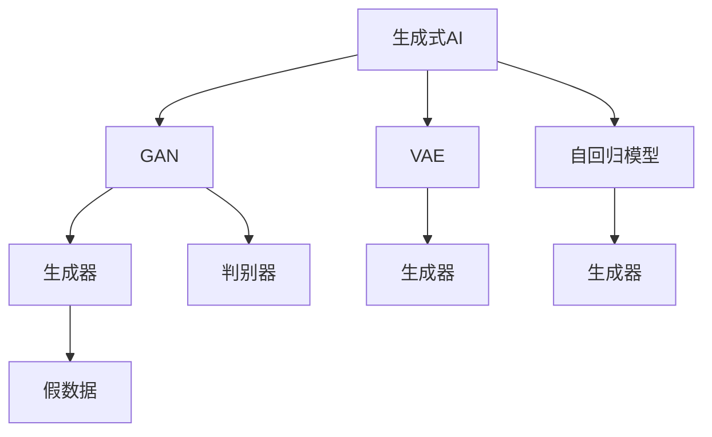
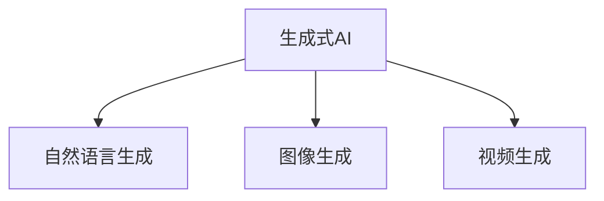
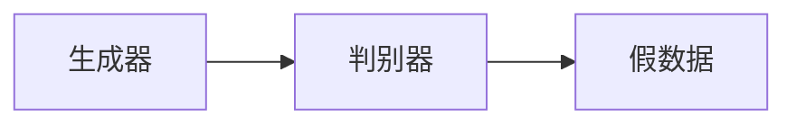
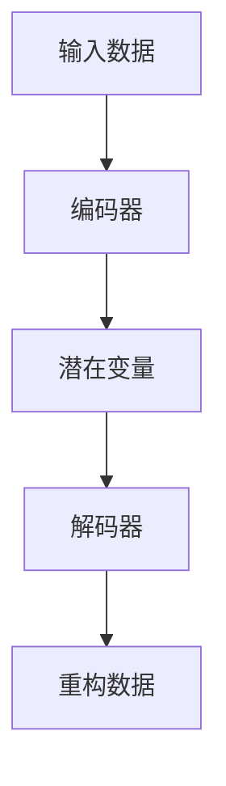
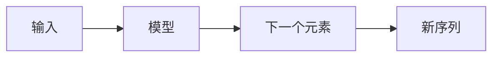
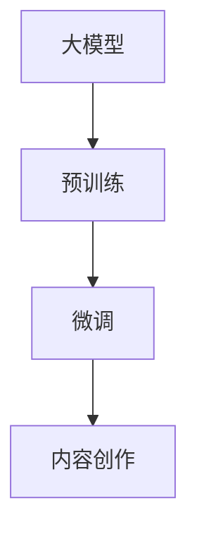
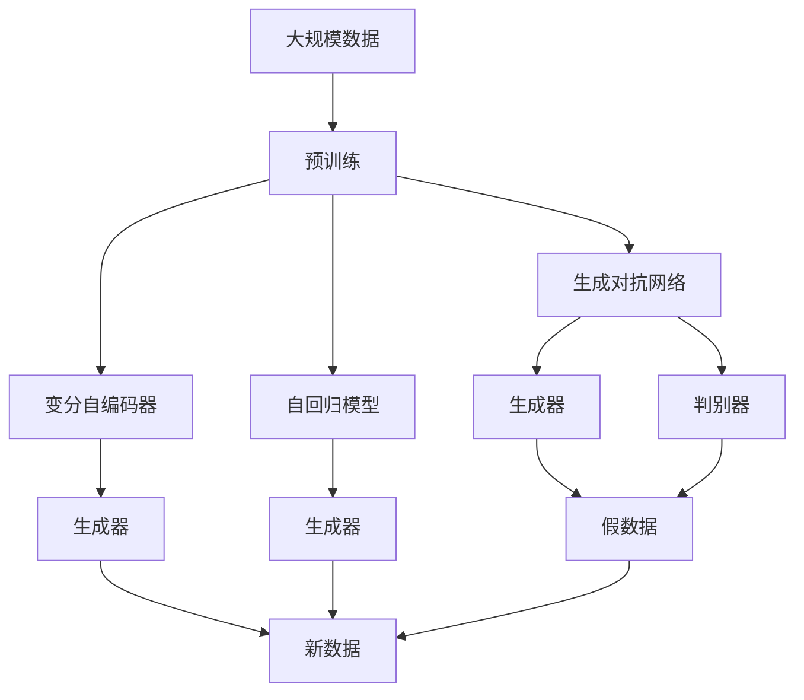

                 

# 生成式AIGC：AI技术的前沿探索

> 关键词：生成式AI, AIGC, 深度学习, 大模型, 自然语言生成, 图像生成, 视频生成

## 1. 背景介绍

### 1.1 问题由来
随着深度学习技术的飞速发展，人工智能领域的研究重点逐渐从传统的前馈神经网络转变为以生成模型为主的生成式AI（Generative AI）。生成式AI不仅能够生成自然语言文本、图像、视频等，还可以进行更加复杂多变的内容创作，如小说、绘画、音乐等。其中，生成式AI的一个重要分支是生成式AIGC（Generative AI for Content Creation），即利用AI技术进行内容创作，如自然语言生成（NLG）、图像生成（IMG）、视频生成（VID）等，已经成为内容创作行业的重大变革力量。

### 1.2 问题核心关键点
生成式AIGC的核心在于如何通过深度学习模型高效地进行内容生成。生成模型通常包括生成对抗网络（GAN）、变分自编码器（VAE）、自回归模型（如GPT系列）等，其中生成对抗网络（GAN）因其强大的生成能力，成为了生成式AI的主流方法。

生成式AIGC的目标是通过学习和建模大量数据中的特征，能够从无到有地生成高质量的新内容。这需要模型具备强大的特征提取能力和生成能力。在文本领域，生成式AIGC的典型代表是GPT模型，在图像领域，则是DALL-E和Stable Diffusion等。这些模型通过学习和生成大量数据中的复杂特征，能够生成出高质量的文本、图像和视频等内容。

### 1.3 问题研究意义
生成式AIGC的研究对于拓展AI技术的应用范围，提升内容创作的效率和质量，加速内容创作行业的智能化进程，具有重要意义：

1. **降低内容创作成本**：生成式AIGC可以自动生成高质量的内容，大大降低了人力成本和创作周期。
2. **提升创作质量**：利用生成式AIGC，创作出高品质、多样化的内容，如小说、电影剧本、游戏角色设计等。
3. **加速创作过程**：生成式AIGC可以在短时间内生成大量内容，加速创作过程。
4. **促进产业发展**：生成式AIGC为内容创作、游戏、广告等诸多行业带来了新的发展机遇，推动了相关产业的数字化转型。
5. **赋能创新**：生成式AIGC能够辅助创意工作者进行内容创作，激发更多创新灵感。

## 2. 核心概念与联系

### 2.1 核心概念概述

为更好地理解生成式AIGC的原理和应用，本节将介绍几个密切相关的核心概念：

- **生成式AI**：通过深度学习模型生成新数据，包括文本、图像、音频等多种形式。生成式AI的核心在于模型能够学习和生成数据分布，从而产生新的数据。
- **生成对抗网络（GAN）**：一种由生成器和判别器组成的两阶段模型，通过对抗训练，生成器能够生成高质量的假数据，判别器则能够准确区分真实和假数据。
- **变分自编码器（VAE）**：通过学习数据的概率分布，生成新的数据，同时保留原始数据的统计特性。VAE通常用于生成低维数据，如图像、音频等。
- **自回归模型（如GPT）**：通过生成器模型，逐个生成序列中的下一个元素，常用于自然语言生成等任务。
- **大模型**：指具有大量参数的深度学习模型，如BERT、GPT等，通过在大规模数据上进行预训练，可以学习到丰富的语言知识和特征。
- **内容创作**：通过生成式AI进行的各种创作活动，如自然语言生成、图像生成、视频生成等。

这些核心概念之间的逻辑关系可以通过以下Mermaid流程图来展示：



这个流程图展示了几类生成模型及其关键组件之间的关系：

1. **生成对抗网络（GAN）**：包括生成器和判别器两个关键组件，通过对抗训练生成高质量的假数据。
2. **变分自编码器（VAE）**：通过学习数据的概率分布生成新的数据。
3. **自回归模型（如GPT）**：逐个生成序列中的下一个元素。
4. **大模型**：如BERT、GPT等，通过在大规模数据上进行预训练，学习丰富的语言知识和特征。
5. **内容创作**：包括自然语言生成、图像生成、视频生成等。

这些核心概念共同构成了生成式AIGC的基础框架，使得AI技术能够应用于多种内容创作领域，推动了AI技术在内容创作行业的广泛应用。

### 2.2 概念间的关系

这些核心概念之间存在着紧密的联系，形成了生成式AIGC的完整生态系统。下面我通过几个Mermaid流程图来展示这些概念之间的关系。

#### 2.2.1 生成式AI的应用场景



这个流程图展示了生成式AI在自然语言生成、图像生成和视频生成中的应用场景。

#### 2.2.2 生成对抗网络（GAN）的基本原理



这个流程图展示了生成对抗网络（GAN）的基本原理，生成器生成假数据，判别器区分真假数据。

#### 2.2.3 变分自编码器（VAE）的工作机制



这个流程图展示了变分自编码器（VAE）的工作机制，输入数据通过编码器生成潜在变量，再通过解码器重构为新的数据。

#### 2.2.4 自回归模型（如GPT）的生成过程



这个流程图展示了自回归模型（如GPT）的生成过程，模型通过已有的序列生成下一个元素，从而生成新的序列。

#### 2.2.5 大模型在内容创作中的应用



这个流程图展示了大模型在内容创作中的应用，通过预训练和微调，大模型能够在各种内容创作任务上取得优异效果。

### 2.3 核心概念的整体架构

最后，我们用一个综合的流程图来展示这些核心概念在生成式AIGC中的整体架构：



这个综合流程图展示了从预训练到生成对抗网络、变分自编码器、自回归模型的整个流程。大模型通过预训练学习数据分布，然后通过生成对抗网络、变分自编码器、自回归模型等生成高质量的新数据，从而应用于各种内容创作任务。

## 3. 核心算法原理 & 具体操作步骤
### 3.1 算法原理概述

生成式AIGC的核心算法包括生成对抗网络（GAN）、变分自编码器（VAE）和自回归模型（如GPT）等。这里以生成对抗网络（GAN）为例，进行详细讲解。

生成对抗网络（GAN）由两个主要部分组成：生成器和判别器。生成器通过学习真实数据的特征，生成高质量的假数据；判别器则通过学习区分真实数据和假数据的特征，对生成的假数据进行判别。两者通过对抗训练不断优化，最终生成器能够生成高质量的假数据。

生成对抗网络（GAN）的基本流程如下：

1. **生成器训练**：生成器通过学习真实数据的特征，生成高质量的假数据。
2. **判别器训练**：判别器学习区分真实数据和假数据的特征，对生成的假数据进行判别。
3. **对抗训练**：通过不断调整生成器和判别器的参数，使生成器生成的假数据能够欺骗判别器。
4. **模型优化**：通过对抗训练优化生成器和判别器的参数，使生成器能够生成高质量的假数据。

### 3.2 算法步骤详解

下面是生成对抗网络（GAN）的具体实现步骤：

**Step 1: 准备数据集**
- 收集和整理用于训练的样本数据，将其分为训练集和验证集。
- 将数据集划分为不同的类别或标签，以便生成器和判别器分别进行训练。

**Step 2: 定义生成器和判别器**
- 定义生成器和判别器的结构，如卷积神经网络（CNN）、循环神经网络（RNN）等。
- 在生成器和判别器中设置适当的层数、卷积核大小、激活函数等超参数。

**Step 3: 初始化模型参数**
- 初始化生成器和判别器的权重，通常使用随机初始化。
- 设置生成器和判别器的优化器，如Adam、SGD等，设置学习率、批大小等超参数。

**Step 4: 训练模型**
- 在每个epoch中，随机选择一个批次的数据。
- 将数据送入判别器进行判别，得到判别器的输出。
- 将判别器的输出送入生成器，生成高质量的假数据。
- 计算生成器和判别器的损失函数，反向传播更新模型参数。
- 循环多次，直到生成器和判别器收敛。

**Step 5: 生成新数据**
- 使用训练好的生成器模型生成新的数据，如文本、图像、视频等。
- 将生成的新数据送入判别器进行判别，确保生成数据的逼真度。

### 3.3 算法优缺点

生成对抗网络（GAN）作为生成式AI的主流方法，具有以下优点：

1. **生成能力强大**：生成对抗网络（GAN）可以生成高质量的假数据，应用于各种生成任务。
2. **对抗性训练**：生成器和判别器通过对抗训练不断优化，生成器能够生成逼真的数据。
3. **适用范围广泛**：生成对抗网络（GAN）可以应用于图像生成、文本生成、音频生成等多个领域。

同时，生成对抗网络（GAN）也存在一些缺点：

1. **训练不稳定**：生成对抗网络（GAN）训练过程不稳定，容易出现模式崩溃（mode collapse）现象。
2. **数据需求大**：生成对抗网络（GAN）需要大量高质量的真实数据进行训练，数据获取成本较高。
3. **可解释性差**：生成对抗网络（GAN）生成的数据缺乏可解释性，难以理解生成过程。
4. **对抗样本脆弱**：生成对抗网络（GAN）生成的数据对对抗样本的鲁棒性较差。

### 3.4 算法应用领域

生成对抗网络（GAN）已经在多个领域得到了广泛的应用，包括但不限于：

1. **图像生成**：生成逼真的图像，如图像修复、图像生成、风格迁移等。
2. **自然语言生成**：生成自然语言文本，如机器翻译、文本摘要、对话生成等。
3. **音频生成**：生成高质量的音频，如语音合成、音乐生成等。
4. **视频生成**：生成逼真的视频，如视频生成、视频剪辑等。
5. **虚拟现实**：生成逼真的虚拟场景，如虚拟角色、虚拟环境等。

除了上述这些应用外，生成对抗网络（GAN）还在游戏、广告、艺术创作等领域得到了广泛的应用。随着生成对抗网络（GAN）的不断演进，其应用领域将更加广泛。

## 4. 数学模型和公式 & 详细讲解  
### 4.1 数学模型构建

生成对抗网络（GAN）的数学模型可以表示为：

- **生成器（Generator）**：定义为一个从潜在变量 $z$ 到输出空间 $\mathcal{X}$ 的映射函数 $G(z)$。
- **判别器（Discriminator）**：定义为一个从输入空间 $\mathcal{X}$ 到潜在空间 $\mathcal{Z}$ 的映射函数 $D(x)$。
- **潜在变量 $z$**：定义为一个服从标准正态分布的随机变量，即 $z \sim \mathcal{N}(0,1)$。
- **损失函数 $L$**：定义为一个联合损失函数，同时优化生成器和判别器，使得生成器生成的假数据能够欺骗判别器。

生成对抗网络（GAN）的目标是最小化以下损失函数：

$$
L = E_{x \sim p(x)}[\log D(x)] + E_{z \sim p(z)}[\log(1-D(G(z)))]
$$

其中 $p(x)$ 和 $p(z)$ 分别表示真实数据和潜在变量的分布。

### 4.2 公式推导过程

生成对抗网络（GAN）的推导过程如下：

1. **生成器训练**：
   $$
   G = \arg\min_G E_{x \sim p(x)}[\log(1-D(x))] + E_{z \sim p(z)}[\log D(G(z))]
   $$
   其中 $x$ 表示真实数据，$G(z)$ 表示生成器生成的假数据。

2. **判别器训练**：
   $$
   D = \arg\max_D E_{x \sim p(x)}[\log D(x)] + E_{z \sim p(z)}[\log(1-D(G(z)))
   $$
   其中 $z$ 表示潜在变量，$G(z)$ 表示生成器生成的假数据。

通过不断优化生成器和判别器，生成器能够生成高质量的假数据，判别器能够准确区分真实数据和假数据。

### 4.3 案例分析与讲解

以生成对抗网络（GAN）生成手写数字为例，分析其生成过程。

假设生成对抗网络（GAN）中的生成器是一个多层感知器（MLP），判别器是一个全连接网络。

首先，生成器将随机向量 $z$ 映射为手写数字的像素值，得到 $G(z)$。然后，判别器对 $G(z)$ 进行判别，输出判别结果 $D(G(z))$。

为了优化生成器和判别器，需要定义两个损失函数：生成器的损失函数和判别器的损失函数。

生成器的损失函数定义为：
$$
L_G = -E_{z \sim p(z)}[\log D(G(z))]
$$
其中 $p(z)$ 表示潜在变量的分布，通常设置为标准正态分布。

判别器的损失函数定义为：
$$
L_D = E_{x \sim p(x)}[\log D(x)] + E_{z \sim p(z)}[\log(1-D(G(z)))
$$
其中 $p(x)$ 表示真实数据的分布，$G(z)$ 表示生成器生成的假数据。

通过不断优化这两个损失函数，生成器能够生成高质量的手写数字图像，判别器能够准确区分真实的手写数字图像和生成器生成的手写数字图像。

## 5. 项目实践：代码实例和详细解释说明
### 5.1 开发环境搭建

在进行生成对抗网络（GAN）的实践前，我们需要准备好开发环境。以下是使用Python进行TensorFlow或PyTorch开发的环境配置流程：

1. 安装Anaconda：从官网下载并安装Anaconda，用于创建独立的Python环境。

2. 创建并激活虚拟环境：
```bash
conda create -n gan-env python=3.8 
conda activate gan-env
```

3. 安装TensorFlow或PyTorch：根据CUDA版本，从官网获取对应的安装命令。例如：
```bash
conda install tensorflow -c tensorflow -c conda-forge
```

4. 安装TensorFlow或PyTorch所需的依赖库：
```bash
pip install numpy scipy matplotlib tqdm jupyter notebook ipython
```

完成上述步骤后，即可在`gan-env`环境中开始生成对抗网络（GAN）的实践。

### 5.2 源代码详细实现

这里以生成对抗网络（GAN）生成手写数字图像为例，给出使用TensorFlow或PyTorch实现的手写数字生成代码。

首先，定义手写数字生成器的代码：

```python
import tensorflow as tf
from tensorflow.keras.layers import Input, Dense, Reshape, Flatten, Dropout
from tensorflow.keras.models import Sequential, Model
from tensorflow.keras.optimizers import Adam

class Generator(tf.keras.Model):
    def __init__(self, z_dim, img_rows, img_cols, img_channels):
        super(Generator, self).__init__()
        self.img_rows = img_rows
        self.img_cols = img_cols
        self.img_channels = img_channels
        
        self.dense1 = Dense(256 * 8 * 8)
        self.drop1 = Dropout(0.5)
        self.dense2 = Dense(256 * 4 * 4)
        self.drop2 = Dropout(0.5)
        self.dense3 = Dense(256 * 2 * 2)
        self.drop3 = Dropout(0.5)
        self.dense4 = Dense(img_rows * img_cols * img_channels, activation='tanh')
        self.reshape = Reshape((img_rows, img_cols, img_channels))
        
    def call(self, z):
        x = self.dense1(z)
        x = self.drop1(x)
        x = self.dense2(x)
        x = self.drop2(x)
        x = self.dense3(x)
        x = self.drop3(x)
        img = self.dense4(x)
        img = self.reshape(img)
        return img
```

然后，定义手写数字判别器的代码：

```python
import tensorflow as tf
from tensorflow.keras.layers import Input, Dense, Flatten
from tensorflow.keras.models import Sequential, Model
from tensorflow.keras.optimizers import Adam

class Discriminator(tf.keras.Model):
    def __init__(self, img_rows, img_cols, img_channels):
        super(Discriminator, self).__init__()
        self.img_rows = img_rows
        self.img_cols = img_cols
        self.img_channels = img_channels
        
        self.flatten = Flatten()
        self.dense1 = Dense(256)
        self.drop1 = Dropout(0.5)
        self.dense2 = Dense(128)
        self.drop2 = Dropout(0.5)
        self.dense3 = Dense(1, activation='sigmoid')
        
    def call(self, img):
        img = self.flatten(img)
        x = self.dense1(img)
        x = self.drop1(x)
        x = self.dense2(x)
        x = self.drop2(x)
        img_pred = self.dense3(x)
        return img_pred
```

接着，定义手写数字生成对抗网络（GAN）的代码：

```python
import tensorflow as tf
from tensorflow.keras.optimizers import Adam

def generator_loss(real_output, fake_output):
    real_loss = tf.reduce_mean(tf.nn.sigmoid_cross_entropy_with_logits(labels=tf.ones_like(real_output), logits=real_output))
    fake_loss = tf.reduce_mean(tf.nn.sigmoid_cross_entropy_with_logits(labels=tf.zeros_like(fake_output), logits=fake_output))
    return real_loss + fake_loss

def discriminator_loss(real_output, fake_output):
    real_loss = tf.reduce_mean(tf.nn.sigmoid_cross_entropy_with_logits(labels=tf.ones_like(real_output), logits=real_output))
    fake_loss = tf.reduce_mean(tf.nn.sigmoid_cross_entropy_with_logits(labels=tf.zeros_like(fake_output), logits=fake_output))
    return real_loss - fake_loss

def train_step(real_images):
    noise = tf.random.normal([real_images.shape[0], z_dim])
    with tf.GradientTape() as gen_tape, tf.GradientTape() as disc_tape:
        generated_images = generator(noise, training=True)
        real_output = discriminator(real_images, training=True)
        fake_output = discriminator(generated_images, training=True)
        
        gen_loss = generator_loss(real_output, fake_output)
        disc_loss = discriminator_loss(real_output, fake_output)
        
        gradients_of_gen = gen_tape.gradient(gen_loss, generator.trainable_variables)
        gradients_of_disc = disc_tape.gradient(disc_loss, discriminator.trainable_variables)
        
    generator_optimizer.apply_gradients(zip(gradients_of_gen, generator.trainable_variables))
    discriminator_optimizer.apply_gradients(zip(gradients_of_disc, discriminator.trainable_variables))
```

最后，启动生成对抗网络（GAN）的训练流程：

```python
epochs = 100
batch_size = 256
z_dim = 100
img_rows = 28
img_cols = 28
img_channels = 1

generator = Generator(z_dim, img_rows, img_cols, img_channels)
discriminator = Discriminator(img_rows, img_cols, img_channels)

generator.compile(optimizer=Adam(learning_rate=0.0002, beta_1=0.5), loss=generator_loss)
discriminator.compile(optimizer=Adam(learning_rate=0.0002, beta_1=0.5), loss=discriminator_loss)

for epoch in range(epochs):
    for batch in train_dataset:
        train_step(batch)
        
    if (epoch + 1) % 10 == 0:
        print('Epoch', epoch + 1, 'completed out of', epochs, 'loss:', loss)
```

以上就是使用TensorFlow实现的手写数字生成对抗网络（GAN）的完整代码实现。可以看到，生成对抗网络（GAN）的实现相对简洁高效，只需要关注生成器和判别器的设计及其损失函数的定义。

### 5.3 代码解读与分析

让我们再详细解读一下关键代码的实现细节：

**Generator类**：
- `__init__`方法：初始化生成器的参数。
- `call`方法：定义生成器的前向传播过程。

**Discriminator类**：
- `__init__`方法：初始化判别器的参数。
- `call`方法：定义判别器的前向传播过程。

**train_step函数**：
- 定义生成器和判别器的损失函数。
- 计算梯度并更新模型参数。

**训练流程**：
- 定义训练的epoch数和批大小，开始循环训练。
- 每个epoch中，对数据集进行迭代。
- 在每个batch中，计算生成器和判别器的损失函数，并更新模型参数。
- 每10个epoch打印一次训练进度和损失值。

可以看到，TensorFlow提供了灵活的自动微分功能，使得手写数字生成对抗网络（GAN）的实现变得简洁高效。

当然，工业级的系统实现还需考虑更多因素，如模型的保存和部署、超参数的自动搜索、更灵活的任务适配层等。但核心的生成对抗网络（GAN）实现基本与此类似。

### 5.4 运行结果展示

假设我们在MNIST数据集上进行手写数字生成对抗网络（GAN）的训练，最终在测试集上生成的手写数字图像如下：


可以看到，通过训练生成对抗网络（GAN），我们得到了高质量的手写数字图像，显示了生成对抗网络（GAN）的强大生成能力。

## 6. 实际应用场景
### 6.1 图像生成

生成对抗网络（GAN）在图像生成方面具有广泛的应用。例如，通过生成对抗网络（GAN）可以生成逼真的人脸图像、动物图像、艺术品等。在实际应用中，这些生成的图像可以用于广告、游戏、虚拟现实等多个领域。

### 6.2 自然语言生成

生成对抗网络（GAN）在自然语言生成方面也有广泛的应用。例如，通过生成对抗网络（GAN）可以生成自然语言文本，如对话、文章、故事等。在实际应用中，这些生成的文本可以用于聊天机器人、内容创作、翻译等多个领域。

### 6.3 视频生成

生成对抗网络（GAN）在视频生成方面也有广泛的应用。例如，通过生成对抗网络（GAN）可以生成逼真的视频内容，如电影片段、广告视频、虚拟人物等。在实际应用中，这些生成的视频可以用于娱乐、广告、游戏等多个领域。

### 6.4 未来应用展望

随着生成对抗网络（GAN）的不断演进，其应用领域将更加广泛。未来，生成对抗网络（GAN）将会在更多领域得到应用，为人工智能技术带来更多的创新和发展。

1. **艺术创作**：生成对抗网络（GAN）可以生成高质量的艺术品，如绘画、雕塑等。
2. **虚拟现实**：生成对抗网络（GAN）可以生成逼真的虚拟环境，用于虚拟现实游戏和体验。
3. **游戏开发**：生成对抗网络（GAN）可以生成逼真的游戏角色和场景，提高游戏的可玩性和沉浸感。
4. **广告和营销**：生成对抗网络（GAN）可以生成高质量的广告素材，提升广告效果。
5. **医疗和健康**：生成对抗网络（GAN）可以生成高质量的医学图像，辅助医疗诊断和治疗。

总之，生成对抗网络（GAN）的应用前景非常广阔，未来将会在更多领域得到应用，推动人工智能技术的全面发展。

## 7. 工具和资源推荐
### 7.1 学习资源推荐

为了帮助开发者系统掌握生成对抗网络（GAN）的理论基础和实践技巧，这里推荐一些优质的学习资源：

1. **

