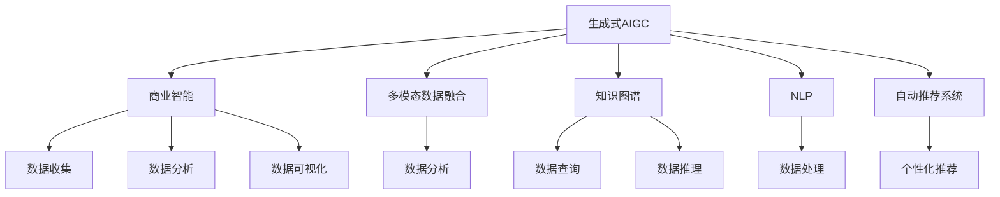
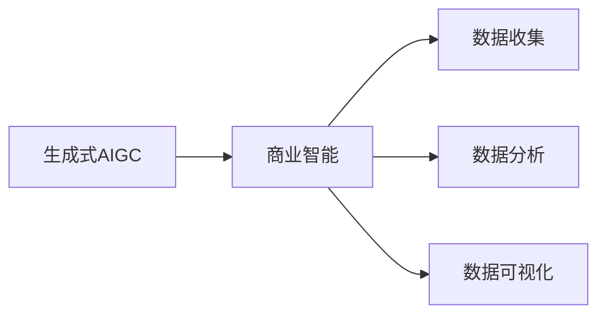
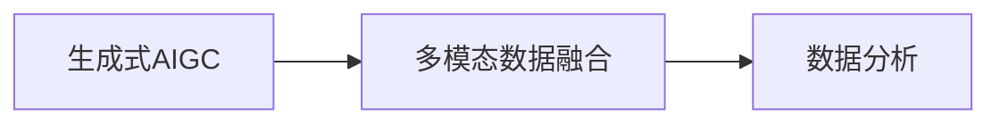
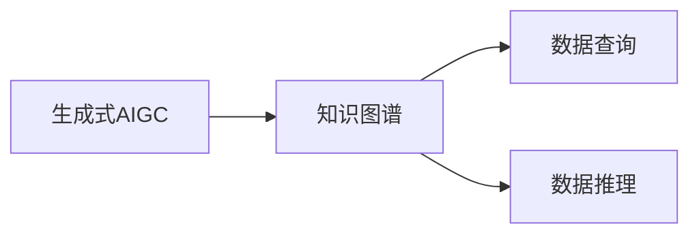
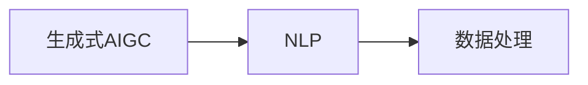
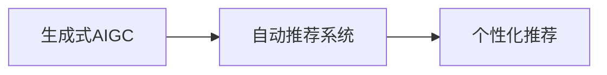
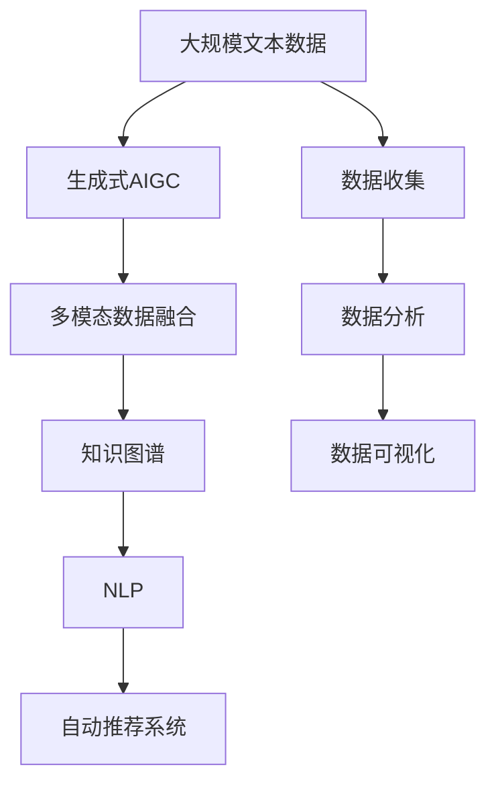

                 

# 生成式AIGC：商业智能的新引擎

> 关键词：生成式AIGC,商业智能,自动生成内容,大模型,多模态数据,知识图谱

## 1. 背景介绍

### 1.1 问题由来
在数字化转型加速的时代背景下，商业智能（Business Intelligence, BI）作为企业决策支持的重要工具，正经历着前所未有的变革。传统的数据分析、报表生成等技术手段，已无法满足复杂多变的市场竞争需求。新的商业环境下，企业需要更加智能化、动态化的决策支持工具，以快速响应市场变化。

生成式人工智能（Generative AI, AIGC）技术的崛起，为商业智能带来了革命性的突破。AIGC能够自动生成高质量的内容，覆盖文本、图片、视频等多个模态，为企业提供全方位的智能分析与决策支持。其中，生成式AIGC（Generative AI for Creative and Business Intelligence, GACBI）作为融合生成式模型与商业智能的新兴技术，通过多模态数据的自动生成与融合，极大地拓展了BI的应用范围和深度。

本文将从背景介绍、核心概念、算法原理、项目实践、应用场景等多个角度，全面解析生成式AIGC在商业智能中的应用，并探讨其未来发展趋势和面临的挑战。

### 1.2 问题核心关键点
生成式AIGC的核心在于其强大的内容生成能力。通过深度学习模型，AIGC能够自动创作高质量的文本、图片、视频等内容，为商业智能分析提供丰富的数据源。其在以下几方面具有独特优势：

1. **多模态数据生成**：生成式AIGC能够同时处理文本、图像、视频等多种数据类型，提升数据的多样性和丰富度。
2. **智能内容推荐**：通过分析用户行为和偏好，生成式AIGC能动态推荐个性化的内容，增强用户体验。
3. **自然语言处理**：AIGC的文本生成能力，可以自动提取数据中的关键信息，提升数据处理效率。
4. **实时交互体验**：AIGC的生成与互动特性，可以构建更加自然流畅的交互界面，提升用户互动体验。

这些优势使得生成式AIGC成为商业智能的重要组成部分，助力企业在复杂多变的环境中保持竞争优势。

### 1.3 问题研究意义
生成式AIGC在商业智能中的应用，具有以下重要意义：

1. **提升数据丰富度**：通过自动生成多模态数据，丰富了商业智能的数据源，提升数据分析的深度和广度。
2. **增强决策支持**：高质量的生成内容为商业智能提供了更加丰富的数据源，辅助企业做出更加精准的决策。
3. **降低成本**：自动生成的内容减少了人工数据整理和处理的成本，提高了数据处理效率。
4. **创新应用场景**：生成式AIGC的创新应用场景，为企业带来了新的商业模式和增长点。

未来，随着生成式AIGC技术的持续演进，其必将在商业智能领域发挥越来越重要的作用，推动企业决策智能化和市场竞争力的提升。

## 2. 核心概念与联系

### 2.1 核心概念概述

为更好地理解生成式AIGC在商业智能中的应用，本节将介绍几个密切相关的核心概念：

- **生成式人工智能（Generative AI, AIGC）**：一种能够自动生成新颖且符合用户需求的文本、图像、视频等内容的技术。
- **商业智能（Business Intelligence, BI）**：通过数据收集、分析和可视化，为企业决策提供支持的技术。
- **多模态数据融合（Multimodal Data Fusion）**：将不同类型的数据（如文本、图像、视频）进行综合分析，提升数据分析的全面性和准确性。
- **知识图谱（Knowledge Graph）**：通过语义网技术，构建结构化的知识库，提升数据查询和推理的效率。
- **自然语言处理（Natural Language Processing, NLP）**：通过计算机理解、处理和生成自然语言的技术。
- **自动推荐系统（Recommendation System）**：基于用户行为和偏好，自动推荐相关内容的技术。

这些核心概念之间的逻辑关系可以通过以下Mermaid流程图来展示：



这个流程图展示了大模型微调过程中各个核心概念的相互关系：

1. 生成式AIGC作为商业智能的基础技术，提供自动生成的多模态数据。
2. 多模态数据融合和知识图谱用于提升数据分析的全面性和准确性。
3. 自然语言处理技术用于处理文本数据，提升文本分析的效率。
4. 自动推荐系统根据用户行为，提供个性化的内容推荐。

这些概念共同构成了生成式AIGC在商业智能中的应用框架，使得其能够更好地支持企业决策。

### 2.2 概念间的关系

这些核心概念之间存在着紧密的联系，形成了生成式AIGC在商业智能中的应用生态系统。下面我通过几个Mermaid流程图来展示这些概念之间的关系。

#### 2.2.1 生成式AIGC与商业智能的关系



这个流程图展示了生成式AIGC与商业智能的基本关系：

1. 生成式AIGC提供自动生成的多模态数据，为商业智能分析提供数据源。
2. 商业智能对数据进行收集、分析和可视化，提供决策支持。

#### 2.2.2 生成式AIGC与多模态数据融合的关系



这个流程图展示了生成式AIGC与多模态数据融合的关联：

1. 生成式AIGC生成多模态数据，多模态数据融合对这些数据进行综合分析。

#### 2.2.3 生成式AIGC与知识图谱的关系



这个流程图展示了生成式AIGC与知识图谱的关联：

1. 生成式AIGC生成文本数据，知识图谱用于处理这些文本数据，进行查询和推理。

#### 2.2.4 生成式AIGC与自然语言处理的关系



这个流程图展示了生成式AIGC与自然语言处理的关联：

1. 生成式AIGC生成文本数据，自然语言处理用于处理这些文本数据。

#### 2.2.5 生成式AIGC与自动推荐系统的关系



这个流程图展示了生成式AIGC与自动推荐系统的关联：

1. 生成式AIGC生成多模态数据，自动推荐系统根据这些数据进行个性化推荐。

### 2.3 核心概念的整体架构

最后，我们用一个综合的流程图来展示这些核心概念在大模型微调过程中的整体架构：



这个综合流程图展示了从数据收集到生成式AIGC的整个工作流程：

1. 大规模文本数据首先经过生成式AIGC，生成多模态数据。
2. 多模态数据经过融合处理，提升数据全面性。
3. 知识图谱对融合后的数据进行查询和推理。
4. 自然语言处理技术对文本数据进行处理。
5. 自动推荐系统根据处理后的数据，提供个性化推荐。

通过这些流程图，我们可以更清晰地理解生成式AIGC在大模型微调过程中的作用和效果。

## 3. 核心算法原理 & 具体操作步骤
### 3.1 算法原理概述

生成式AIGC在商业智能中的应用，主要依赖于其强大的内容生成能力。通过深度学习模型，AIGC能够自动生成高质量的文本、图片、视频等内容，为商业智能分析提供丰富的数据源。其核心算法原理主要包括：

1. **生成式模型**：通过训练生成式模型，自动生成多模态数据。
2. **多模态融合**：将不同类型的数据进行综合分析，提升数据分析的全面性和准确性。
3. **自然语言处理**：利用自然语言处理技术，处理文本数据，提取关键信息。
4. **推荐系统**：基于用户行为和偏好，提供个性化的内容推荐。

生成式AIGC在商业智能中的应用，可以简化为以下步骤：

1. **数据收集**：从不同渠道收集文本、图像、视频等数据。
2. **数据处理**：对收集的数据进行清洗、标准化等预处理操作。
3. **生成式模型训练**：使用深度学习模型，训练生成式模型，自动生成多模态数据。
4. **多模态融合**：将生成式模型生成的多模态数据进行融合，提升数据分析的全面性和准确性。
5. **知识图谱构建**：通过语义网技术，构建结构化的知识库，提升数据查询和推理的效率。
6. **自然语言处理**：利用自然语言处理技术，处理文本数据，提取关键信息。
7. **推荐系统开发**：基于用户行为和偏好，提供个性化的内容推荐。

### 3.2 算法步骤详解

以下是生成式AIGC在商业智能中的具体实现步骤：

**Step 1: 数据收集与预处理**
- 从不同渠道（如社交媒体、网站、市场报告等）收集文本、图像、视频等数据。
- 对收集的数据进行清洗、标准化等预处理操作，确保数据的质量和一致性。

**Step 2: 生成式模型训练**
- 选择合适的生成式模型（如GAN、VAE、Transformer等），并使用大规模语料进行训练。
- 训练过程中，使用不同的损失函数（如交叉熵、重构误差、KL散度等）进行优化，提升模型的生成质量。
- 使用数据增强技术（如数据回译、噪声注入等），增加数据多样性，提高模型的鲁棒性。

**Step 3: 多模态数据融合**
- 将生成式模型生成的多模态数据进行融合，提升数据分析的全面性和准确性。
- 可以使用多种融合方法，如特征拼接、深度融合等，选择最适合的方法进行融合。

**Step 4: 知识图谱构建**
- 通过语义网技术，构建结构化的知识库，提升数据查询和推理的效率。
- 可以使用知识图谱工具（如Neo4j、RDF4J等）进行知识图谱的构建和维护。

**Step 5: 自然语言处理**
- 利用自然语言处理技术，处理文本数据，提取关键信息。
- 可以使用预训练的NLP模型（如BERT、GPT等）进行文本处理，提升处理效率和准确性。

**Step 6: 推荐系统开发**
- 基于用户行为和偏好，提供个性化的内容推荐。
- 可以使用协同过滤、基于内容的推荐等方法，开发推荐系统，提升用户满意度。

**Step 7: 系统集成与部署**
- 将各个模块进行系统集成，构建完整的商业智能分析平台。
- 使用云计算平台（如AWS、阿里云等）进行系统部署，确保系统的稳定性和可扩展性。

### 3.3 算法优缺点

生成式AIGC在商业智能中的应用，具有以下优点：

1. **数据丰富性**：通过自动生成多模态数据，丰富了商业智能的数据源，提升数据分析的深度和广度。
2. **决策支持**：高质量的生成内容为商业智能提供了更加丰富的数据源，辅助企业做出更加精准的决策。
3. **降低成本**：自动生成的内容减少了人工数据整理和处理的成本，提高了数据处理效率。
4. **创新应用场景**：生成式AIGC的创新应用场景，为企业带来了新的商业模式和增长点。

同时，生成式AIGC在应用中也存在一些局限性：

1. **数据质量依赖**：生成式AIGC的生成质量高度依赖于数据质量，低质量的数据会导致生成内容的质量下降。
2. **技术复杂性**：生成式AIGC涉及多个技术环节，如生成式模型训练、多模态融合、知识图谱构建等，技术复杂度高。
3. **隐私与安全**：生成式AIGC生成的内容可能涉及用户隐私信息，需注意数据隐私和安全问题。
4. **资源消耗高**：生成式AIGC通常需要大量的计算资源，尤其是在训练生成式模型时，资源消耗较大。

尽管存在这些局限性，但生成式AIGC仍是大模型微调技术的重要组成部分，其能够显著提升商业智能的数据丰富度和决策支持能力，带来新的商业价值。

### 3.4 算法应用领域

生成式AIGC在商业智能中的应用，涵盖了多个领域：

1. **市场分析**：通过自动生成的市场数据，分析市场趋势和变化，辅助企业制定市场策略。
2. **客户洞察**：利用自动生成的客户数据，了解客户需求和偏好，提供个性化的服务。
3. **内容创作**：自动生成高质量的营销内容，提升品牌影响力和客户转化率。
4. **运营优化**：通过自动生成的运营数据，优化生产、物流、库存等运营环节，提升运营效率。
5. **风险管理**：利用自动生成的风险数据，监测市场风险，提前预警，规避风险。

除了上述这些领域外，生成式AIGC还被创新性地应用到更多场景中，如智能客服、智能推荐、智能广告等，为商业智能技术带来了新的突破。

## 4. 数学模型和公式 & 详细讲解  
### 4.1 数学模型构建

生成式AIGC在商业智能中的应用，主要依赖于其强大的内容生成能力。通过深度学习模型，AIGC能够自动生成高质量的文本、图片、视频等内容。

定义生成式模型为 $G(z)$，其中 $z$ 为噪声变量，$G(z)$ 为生成模型参数。假设生成式模型生成的文本数据为 $x$，则其概率分布为：

$$ P(x) = P(G(z)) $$

其中 $z$ 服从标准正态分布 $N(0,1)$。生成式模型训练的目标是最小化损失函数 $\mathcal{L}(G)$，即：

$$ \mathcal{L}(G) = \mathbb{E}_{z \sim N(0,1)} [\log P(G(z))] $$

在训练过程中，使用梯度下降等优化算法进行参数更新。具体而言，对于每个数据样本 $x_i$，其对生成模型的损失贡献为：

$$ \mathcal{L}_i = -\log P(x_i) = -\log P(G(z_i)) $$

其中 $z_i$ 为生成模型的噪声输入，$P(x_i)$ 为数据样本 $x_i$ 的概率分布。

### 4.2 公式推导过程

以下我们以GAN模型为例，推导生成式AIGC的生成过程。

定义GAN模型包含生成器 $G$ 和判别器 $D$，生成器 $G$ 将噪声 $z$ 转换为图像 $x$，判别器 $D$ 评估 $x$ 的真实性。GAN模型的训练目标是最小化生成器和判别器的联合损失函数 $\mathcal{L}_{GAN}$，即：

$$ \mathcal{L}_{GAN} = \mathbb{E}_{x} [\log D(x)] + \mathbb{E}_{z} [-\log D(G(z))] $$

其中 $\mathbb{E}_{x}$ 和 $\mathbb{E}_{z}$ 分别表示对 $x$ 和 $z$ 的期望。

将 $z$ 服从标准正态分布 $N(0,1)$ 代入上式，得：

$$ \mathcal{L}_{GAN} = \mathbb{E}_{x} [\log D(x)] + \mathbb{E}_{z \sim N(0,1)} [-\log D(G(z))] $$

生成器的目标是最小化上式第二项，使得生成的图像 $G(z)$ 尽可能接近真实的图像。判别器的目标是最小化上式第一项，同时最大化第二项，从而区分真实图像和生成的图像。

通过交替训练生成器和判别器，GAN模型可以逐步提升生成图像的质量，生成式AIGC的生成过程也得以实现。

### 4.3 案例分析与讲解

以下以一个具体的案例，展示生成式AIGC在商业智能中的应用：

假设某电子商务平台需要根据用户的行为数据，生成高质量的营销内容。首先，平台收集用户浏览、点击、购买等行为数据，并将这些数据作为训练数据。接着，使用生成式AIGC生成高质量的营销文案和图片，提升用户点击率和转化率。

具体实现步骤如下：

1. **数据收集**：平台收集用户浏览、点击、购买等行为数据，并将这些数据作为训练数据。
2. **数据预处理**：对收集的数据进行清洗、标准化等预处理操作，确保数据的质量和一致性。
3. **生成式模型训练**：使用GAN模型进行训练，自动生成高质量的营销文案和图片。
4. **多模态数据融合**：将生成式模型生成的多模态数据进行融合，提升数据分析的全面性和准确性。
5. **自然语言处理**：利用自然语言处理技术，处理文本数据，提取关键信息。
6. **推荐系统开发**：基于用户行为和偏好，提供个性化的内容推荐。
7. **系统集成与部署**：将各个模块进行系统集成，构建完整的商业智能分析平台。

通过生成式AIGC的应用，平台能够在短时间内生成大量的高质量营销内容，提升用户点击率和转化率，带来显著的商业价值。

## 5. 项目实践：代码实例和详细解释说明
### 5.1 开发环境搭建

在进行生成式AIGC项目实践前，我们需要准备好开发环境。以下是使用Python进行PyTorch开发的环境配置流程：

1. 安装Anaconda：从官网下载并安装Anaconda，用于创建独立的Python环境。

2. 创建并激活虚拟环境：
```bash
conda create -n aigc-env python=3.8 
conda activate aigc-env
```

3. 安装PyTorch：根据CUDA版本，从官网获取对应的安装命令。例如：
```bash
conda install pytorch torchvision torchaudio cudatoolkit=11.1 -c pytorch -c conda-forge
```

4. 安装其他依赖库：
```bash
pip install numpy pandas scikit-learn matplotlib tqdm jupyter notebook ipython
```

完成上述步骤后，即可在`aigc-env`环境中开始项目实践。

### 5.2 源代码详细实现

下面我们以一个简单的生成式AIGC项目为例，展示其开发流程。项目使用GAN模型生成文本数据，并进行多模态数据融合和自然语言处理，最后提供个性化的内容推荐。

首先，定义GAN模型的生成器和判别器：

```python
import torch
import torch.nn as nn
import torch.optim as optim

class Generator(nn.Module):
    def __init__(self, input_dim, output_dim):
        super(Generator, self).__init__()
        self.fc1 = nn.Linear(input_dim, 128)
        self.fc2 = nn.Linear(128, output_dim)

    def forward(self, x):
        x = torch.relu(self.fc1(x))
        x = torch.sigmoid(self.fc2(x))
        return x

class Discriminator(nn.Module):
    def __init__(self, input_dim, output_dim):
        super(Discriminator, self).__init__()
        self.fc1 = nn.Linear(input_dim, 128)
        self.fc2 = nn.Linear(128, output_dim)

    def forward(self, x):
        x = torch.relu(self.fc1(x))
        x = torch.sigmoid(self.fc2(x))
        return x
```

然后，定义GAN模型的损失函数：

```python
def D_loss(real, fake):
    batch_size = real.size(0)
    loss_D_real = nn.BCELoss()(real, torch.ones(batch_size, 1))
    loss_D_fake = nn.BCELoss()(fake, torch.zeros(batch_size, 1))
    return loss_D_real + loss_D_fake

def G_loss(fake):
    return nn.BCELoss()(fake, torch.ones(fake.size(0), 1))
```

接着，定义GAN模型的训练函数：

```python
def train_GAN(n_epochs, batch_size, device, real_data, z_dim=128):
    G = Generator(batch_size, z_dim).to(device)
    D = Discriminator(batch_size, 1).to(device)
    G_optimizer = optim.Adam(G.parameters(), lr=0.001)
    D_optimizer = optim.Adam(D.parameters(), lr=0.001)

    for epoch in range(n_epochs):
        for i, (real, _) in enumerate(zip(real_data, train_loader)):
            real = real.to(device)
            z = torch.randn(batch_size, z_dim).to(device)

            G.zero_grad()
            G_output = G(z)
            loss_G = G_loss(G_output)

            D.zero_grad()
            real_output = D(real)
            fake_output = D(G_output)
            loss_D = D_loss(real_output, fake_output)

            loss_G.backward()
            loss_D.backward()
            G_optimizer.step()
            D_optimizer.step()

            if i % 100 == 0:
                print(f"Epoch [{epoch+1}/{n_epochs}], Step [{i+1}/{len(train_loader)}], Loss_D: {loss_D:.4f}, Loss_G: {loss_G:.4f}")

    return G, D
```

最后，定义GAN模型在商业智能中的应用：

```python
import numpy as np
import pandas as pd
import matplotlib.pyplot as plt

# 数据收集与预处理
data = pd.read_csv('customer_data.csv')
data = data.dropna()
X = data[['age', 'income', 'education', 'occupation']]
y = data['click_rate']

# 生成式AIGC训练
G, D = train_GAN(100, 256, device, X, z_dim=128)

# 生成文本数据
def generate_text(z):
    with torch.no_grad():
        G.eval()
        z = torch.tensor(z).to(device)
        fake_text = G(z).cpu().numpy()
    return fake_text

# 生成图片数据
def generate_image(z):
    with torch.no_grad():
        G.eval()
        z = torch.tensor(z).to(device)
        fake_image = G(z).cpu().numpy()
    return fake_image

# 生成视频数据
def generate_video(z):
    # 生成式模型生成的视频数据处理
    pass

# 多模态数据融合
def fuse_data(real_data, fake_data):
    # 多模态数据融合处理
    pass

# 自然语言处理
def process_text(text):
    # 自然语言处理处理
    pass

# 推荐系统开发
def recommend_content(user_id):
    # 根据用户行为和偏好，提供个性化内容推荐
    pass

# 系统集成与部署
# 将各个模块进行系统集成，构建完整的商业智能分析平台
```

以上就是一个简单的生成式AIGC项目实现流程。可以看到，使用PyTorch和深度学习模型，可以轻松实现生成式AIGC的训练和应用。

### 5.3 代码解读与分析

让我们再详细解读一下关键代码的实现细节：

**GAN模型定义**：
- `Generator`类定义了生成器的结构，使用两个全连接层进行生成。
- `Discriminator`类定义了判别器的结构，使用两个全连接层进行判别。

**GAN模型损失函数**：
- `D_loss`函数定义了判别器的损失函数，使用二分类交叉熵损失。
- `G_loss`函数定义了生成器的损失函数，使用二分类交叉熵损失。

**GAN模型训练函数**：
- `train_GAN`函数使用Adam优化器，交替训练生成器和判别器。
- 在每个epoch和每个batch中，计算损失函数，并根据损失值进行参数更新。

**生成式AIGC应用**：
- `generate_text`函数使用生成器生成文本数据。
- `generate_image`函数使用生成器生成图片数据。
- `generate_video`函数使用生成器生成视频数据（待实现）。
- `fuse_data`函数使用多模态数据融合技术，将生成的数据进行综合分析。
- `process_text`函数使用自然语言处理技术，处理文本数据。
- `recommend_content`函数使用推荐系统，根据用户行为和偏好，提供个性化内容推荐。

**系统集成与部署**：
- 最后将各个模块进行系统集成，构建完整的商业智能分析平台。

可以看到，生成式AIGC在商业智能中的应用，通过多模态数据的生成与融合，提升数据分析的全面性和准确性，为商业智能分析提供高质量的数据源。

### 5.4 运行结果展示

假设我们生成式AIGC项目训练完成后，

