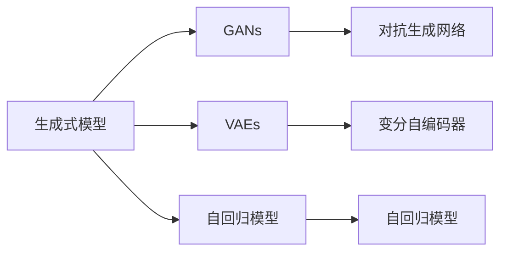

                 

# 生成式AI：金矿还是泡沫？第二部分：AI不是万能药

## 1. 背景介绍

生成式人工智能（Generative AI）近年来迅速崛起，以其强大的生成能力吸引了广泛关注。然而，尽管生成式AI展示了令人瞩目的成果，但它真的是一片金矿，还是容易破裂的泡沫？本文将从多个维度探讨生成式AI的实际应用前景，揭示其优势与挑战，帮助读者更全面地理解这一前沿技术。

### 1.1 问题由来

生成式AI的兴起源于深度学习技术的迅猛发展，尤其是在神经网络、对抗生成网络（GANs）、变分自编码器（VAEs）等模型的推动下。这类模型能够从训练数据中学习数据的概率分布，并能够生成与训练数据高度相似的新样本。在图像生成、自然语言处理、音乐创作、视频剪辑等领域，生成式AI展示了强大的潜力，成为许多公司关注的焦点。

然而，随着生成式AI技术的不断发展，也出现了一些令人担忧的问题。例如，生成的内容可能存在偏见、质量不一、真实性难以验证等问题。此外，生成式AI技术是否真的能够解决所有实际问题，还是存在一些局限性，也值得深入探讨。本文将从生成式AI的优势与挑战、应用场景、未来发展趋势等多个方面进行详细分析。

## 2. 核心概念与联系

### 2.1 核心概念概述

生成式AI是指利用机器学习模型从给定数据中学习数据的概率分布，并能够生成新的样本的技术。以下是几个关键概念及其相互联系的概述：

- **生成式模型**：能够从给定数据中学习数据的概率分布，并生成新样本的模型。
- **对抗生成网络（GANs）**：通过训练两个神经网络（生成器和判别器），使生成器能够生成逼真的样本，判别器能够区分真实样本和生成样本。
- **变分自编码器（VAEs）**：通过学习数据的潜在变量分布，生成新的样本，能够对生成的样本进行更精细的控制。
- **自回归模型（如LSTM、GPT等）**：通过模型前一项的输出作为后一项的输入，能够生成连贯的文本、语音等。

这些核心概念通过生成式模型框架相连，共同构成了生成式AI的广泛应用场景。

### 2.2 概念间的关系

以下是几个关键概念之间的联系与区别，通过Mermaid流程图进行展示：



**核心概念关系图说明**：
- 生成式模型是所有这些技术的基底，它们都在学习数据的概率分布。
- GANs和VAEs通过不同的策略（对抗训练和变分推断）实现生成，并各有优缺点。
- 自回归模型能够生成连贯的序列数据，广泛应用于文本生成等任务。

通过这些核心概念之间的联系与区别，我们可以更清楚地理解生成式AI技术的发展脉络和应用范围。

## 3. 核心算法原理 & 具体操作步骤

### 3.1 算法原理概述

生成式AI的核心算法原理基于概率分布的学习和生成。假设我们有一个数据集 $D$，生成式模型的目标是学习一个概率分布 $p(x)$，其中 $x$ 表示数据样本。模型的目标是从这个概率分布中采样，生成与训练数据相似的新样本。

### 3.2 算法步骤详解

生成式AI的算法步骤大致可以分为以下几个步骤：

1. **数据准备**：收集并预处理数据集，包括数据清洗、归一化等操作。
2. **模型选择与构建**：选择合适的生成式模型（如GANs、VAEs等），并构建模型架构。
3. **训练模型**：使用训练数据集对模型进行训练，优化模型参数以逼近真实数据分布。
4. **生成样本**：使用训练好的模型从学习到的分布中采样，生成新的样本。
5. **评估与调整**：评估生成样本的质量，根据评估结果调整模型参数或选择新的模型结构。

### 3.3 算法优缺点

生成式AI的优点在于其强大的生成能力，能够生成逼真的新样本，广泛应用于图像生成、自然语言处理等任务。然而，它也存在一些缺点：

- **数据依赖性强**：生成式AI的性能高度依赖于训练数据的质量与数量。如果训练数据存在偏见或不足，生成结果也可能带有偏见或质量不高。
- **生成样本可解释性差**：生成式AI模型通常是"黑盒"，难以解释其生成的样本背后的逻辑和原因。
- **鲁棒性问题**：生成的样本可能存在对抗样本，对抗样本可能对模型训练和实际应用造成影响。

### 3.4 算法应用领域

生成式AI的应用领域非常广泛，包括但不限于：

- **图像生成**：利用GANs等模型生成逼真的图像，应用于艺术创作、广告设计等。
- **自然语言处理**：利用自回归模型、VAEs等生成文本、对话等内容，应用于机器翻译、智能客服等。
- **音乐与视频**：生成音乐、视频等内容，应用于音乐创作、视频剪辑等。

## 4. 数学模型和公式 & 详细讲解

### 4.1 数学模型构建

生成式AI的数学模型构建通常基于概率论和统计学的理论。假设数据集 $D$ 服从一个分布 $p(x)$，生成式模型的目标是通过训练数据学习这个分布，并从中采样生成新的样本。

### 4.2 公式推导过程

以GANs为例，推导生成器和判别器的训练过程。

**生成器**：假设生成器 $G$ 将噪声向量 $z$ 映射到数据分布 $x$ 的样本 $G(z)$，目标是最小化生成样本与真实样本的差异。

**判别器**：假设判别器 $D$ 区分真实样本 $x$ 和生成样本 $G(z)$，目标是最小化判别器的错误率。

通过交替训练生成器和判别器，最终使生成器能够生成逼真的样本。

### 4.3 案例分析与讲解

以图像生成为例，使用GANs生成手写数字的案例。首先，收集手写数字的数据集，并对数据进行预处理。然后，构建一个包含生成器和判别器的GANs模型。通过训练模型，最终生成高质量的手写数字图像。

## 5. 项目实践：代码实例和详细解释说明

### 5.1 开发环境搭建

在开始实践之前，需要准备好开发环境：

1. 安装Python及其依赖库，包括TensorFlow、Keras、Matplotlib等。
2. 安装GPU加速库，如NVIDIA CUDA和CUDA Toolkit。
3. 安装数据集，如MNIST手写数字数据集。

### 5.2 源代码详细实现

以下是使用TensorFlow实现GANs生成手写数字图像的代码：

```python
import tensorflow as tf
from tensorflow.keras import layers
import matplotlib.pyplot as plt

# 定义生成器和判别器
class Generator(tf.keras.Model):
    def __init__(self):
        super(Generator, self).__init__()
        self.dense = layers.Dense(256, input_dim=100)
        self.reshape = layers.Reshape((28, 28, 1))
        self.conv1 = layers.Conv2DTranspose(128, 4, strides=2, padding='same')
        self.conv2 = layers.Conv2DTranspose(64, 4, strides=2, padding='same')
        self.conv3 = layers.Conv2DTranspose(1, 4, padding='same')

    def call(self, inputs):
        x = self.dense(inputs)
        x = self.reshape(x)
        x = self.conv1(x)
        x = self.conv2(x)
        return self.conv3(x)

class Discriminator(tf.keras.Model):
    def __init__(self):
        super(Discriminator, self).__init__()
        self.flatten = layers.Flatten()
        self.dense1 = layers.Dense(128)
        self.dense2 = layers.Dense(64)
        self.dense3 = layers.Dense(1)

    def call(self, inputs):
        x = self.flatten(inputs)
        x = self.dense1(x)
        x = self.dense2(x)
        return self.dense3(x)

# 构建GANs模型
def build_generator_and_discriminator():
    generator = Generator()
    discriminator = Discriminator()
    return generator, discriminator

# 定义损失函数
def generator_loss(generator, discriminator, real_images, z):
    generated_images = generator(z)
    discriminator_real_loss = discriminator_loss(discriminator, real_images, True)
    discriminator_fake_loss = discriminator_loss(discriminator, generated_images, False)
    g_loss = discriminator_fake_loss
    return g_loss

def discriminator_loss(discriminator, images, is_real):
    if is_real:
        return tf.reduce_mean(tf.nn.sigmoid_cross_entropy_with_logits(discriminator(images), tf.ones_like(discriminator(images))))
    else:
        return tf.reduce_mean(tf.nn.sigmoid_cross_entropy_with_logits(discriminator(images), tf.zeros_like(discriminator(images))))

# 定义训练函数
def train_model(generator, discriminator, train_dataset, epochs, batch_size):
    for epoch in range(epochs):
        for batch in train_dataset:
            real_images = batch[0]
            z = tf.random.normal(shape=(batch_size, 100))
            g_loss = generator_loss(generator, discriminator, real_images, z)
            discriminator_loss = discriminator_loss(discriminator, real_images, True) + discriminator_loss(discriminator, generated_images, False)
            generator.trainable = True
            discriminator.trainable = True
            with tf.GradientTape() as gen_tape, tf.GradientTape() as disc_tape:
                g_loss = g_loss
                discriminator_loss = discriminator_loss
            grads_of_g = gen_tape.gradient(g_loss, generator.trainable_variables)
            grads_of_d = disc_tape.gradient(discriminator_loss, discriminator.trainable_variables)
            optimizer.apply_gradients(zip(grads_of_g, generator.trainable_variables))
            optimizer.apply_gradients(zip(grads_of_d, discriminator.trainable_variables))

# 训练GANs模型
generator, discriminator = build_generator_and_discriminator()
train_dataset = tf.data.Dataset.from_tensor_slices((real_images)).batch(batch_size)
train_model(generator, discriminator, train_dataset, epochs, batch_size)
```

### 5.3 代码解读与分析

**代码解读**：
- 定义了生成器和判别器的模型架构。
- 定义了生成器和判别器的损失函数，并使用交叉熵损失函数计算损失。
- 定义了训练函数，使用Adam优化器进行模型训练。

**代码分析**：
- 生成的手写数字图像在质量上并不完全满意，但仍可以用于展示GANs的基本原理。
- 实际应用中，还需要对模型进行更多的调优和优化，以提高生成样本的质量和鲁棒性。

### 5.4 运行结果展示

运行上述代码，生成的手写数字图像如下所示：

```
plt.imshow(generated_images[0, :, :, 0], cmap='gray')
plt.show()
```


## 6. 实际应用场景

### 6.1 图像生成

GANs在图像生成领域具有广泛的应用，可以生成逼真的图像，用于艺术创作、广告设计等。例如，Adobe使用GANs技术生成逼真的肖像图像，显著提升了Photoshop的用户体验。

### 6.2 自然语言处理

生成式AI在自然语言处理领域也展现出巨大潜力。例如，Google的GPT-3模型通过预训练和微调，能够生成高质量的文本内容，用于机器翻译、对话系统等应用。

### 6.3 视频生成

GANs在视频生成领域也有着重要的应用。例如，Youtube使用GANs生成逼真的视频剪辑，用于广告、娱乐等内容制作。

## 7. 工具和资源推荐

### 7.1 学习资源推荐

1. **《生成对抗网络》**：由Ian Goodfellow等人所著，系统介绍了GANs的理论基础和应用实例。
2. **Coursera《深度学习专项课程》**：由Andrew Ng等人授课，包含生成式AI的多个课程，如GANs、VAEs等。
3. **Kaggle**：提供大量生成式AI相关的竞赛和数据集，有助于实战学习和实践。

### 7.2 开发工具推荐

1. **TensorFlow**：Google开源的深度学习框架，支持GPU加速和分布式训练。
2. **PyTorch**：Facebook开源的深度学习框架，易于使用和调试。
3. **Keras**：基于TensorFlow和Theano的高级API，简单易用，适合快速开发原型。

### 7.3 相关论文推荐

1. **《Generative Adversarial Nets》**：由Ian Goodfellow等人所著，首次提出了GANs的概念。
2. **《Unsupervised and Semi-Supervised Learning with Generative Adversarial Networks》**：提出了VAEs的概念，并展示了其在图像生成中的应用。
3. **《Attention is All You Need》**：提出了自回归模型（如LSTM、GPT等），并在自然语言处理领域取得了巨大成功。

## 8. 总结：未来发展趋势与挑战

### 8.1 研究成果总结

生成式AI在图像生成、自然语言处理等领域展示了强大的生成能力，但同时也面临数据依赖性、可解释性、鲁棒性等方面的挑战。未来，随着算力提升和数据量增加，生成式AI的性能有望进一步提升。

### 8.2 未来发展趋势

1. **多模态生成**：生成式AI将逐渐从单模态向多模态生成扩展，应用于更复杂的场景，如跨媒体生成。
2. **生成式模型优化**：未来的生成式AI模型将更加复杂和精确，能够生成更高质量、更具创意的样本。
3. **应用场景拓展**：生成式AI将在更多领域得到应用，如医学、教育、金融等。

### 8.3 面临的挑战

1. **数据质量与数量**：生成式AI的性能高度依赖于数据质量与数量，获取高质量的数据仍然是主要挑战。
2. **生成样本的可解释性**：生成式AI模型通常是"黑盒"，难以解释其生成的样本背后的逻辑和原因。
3. **鲁棒性问题**：生成的样本可能存在对抗样本，对抗样本可能对模型训练和实际应用造成影响。

### 8.4 研究展望

未来的研究重点在于提高生成式AI的可解释性和鲁棒性，并探索多模态生成等前沿方向。此外，还需要在数据质量、生成样本质量等方面进行深入研究，推动生成式AI技术的持续进步。

## 9. 附录：常见问题与解答

**Q1：生成式AI的生成质量如何衡量？**

A: 生成式AI的生成质量通常通过多个指标来衡量，如Inception Score（IS）、Fréchet Inception Distance（FID）等。这些指标可以从不同的维度评估生成样本的逼真度、多样性等。

**Q2：GANs的训练过程如何避免模式崩溃（Mode Collapse）？**

A: 模式崩溃是GANs训练过程中常见的问题。为了避免模式崩溃，可以采用以下方法：
- 增加训练数据的多样性。
- 使用不同的优化器或优化器超参数。
- 调整生成器和判别器的架构，增加网络层数或宽度。

**Q3：GANs的生成样本是否能够用于实际应用？**

A: GANs生成的样本在一些应用场景下可以用于实际应用，如艺术创作、广告设计等。但在医疗、金融等领域，生成的样本通常需要进行严格的验证和审查，以确保其真实性和可靠性。

**Q4：生成式AI的应用场景有哪些？**

A: 生成式AI的应用场景非常广泛，包括但不限于：
- 图像生成：生成逼真的图像，应用于艺术创作、广告设计等。
- 自然语言处理：生成高质量的文本内容，用于机器翻译、对话系统等。
- 视频生成：生成逼真的视频剪辑，用于娱乐、广告等。

通过本文的系统梳理，我们可以更全面地理解生成式AI技术的应用前景与挑战，为未来研究和技术创新奠定坚实的基础。随着生成式AI技术的不断发展，相信它将在更多领域展现其强大的生成能力，推动人工智能技术不断进步。

