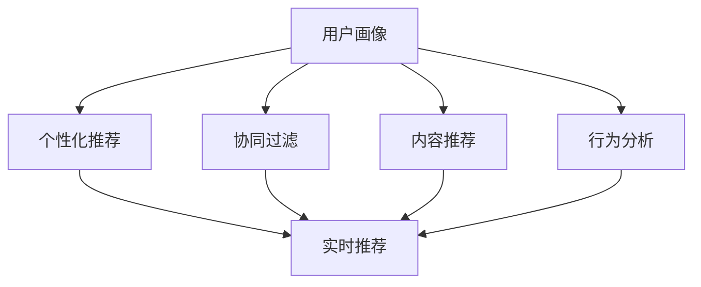
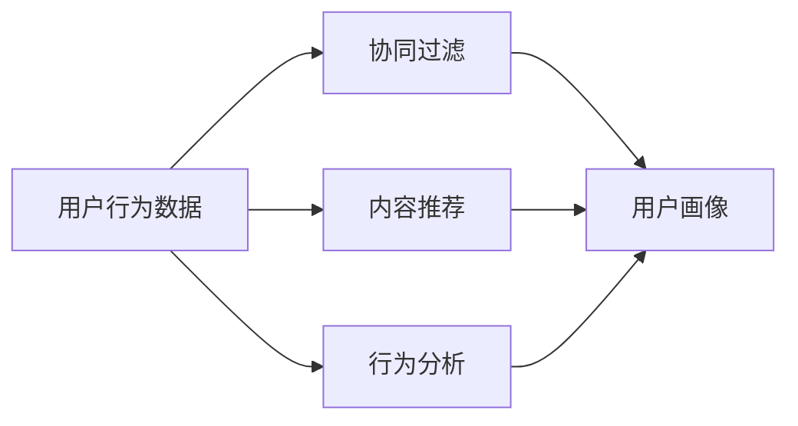
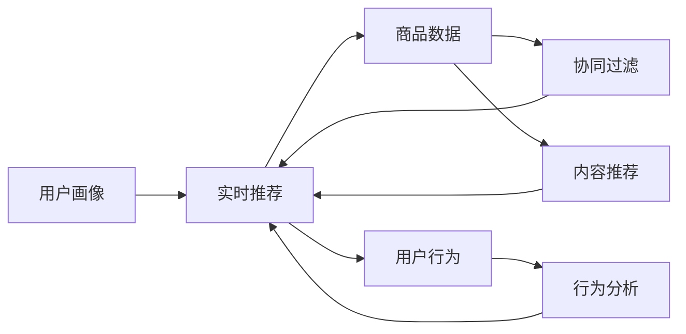
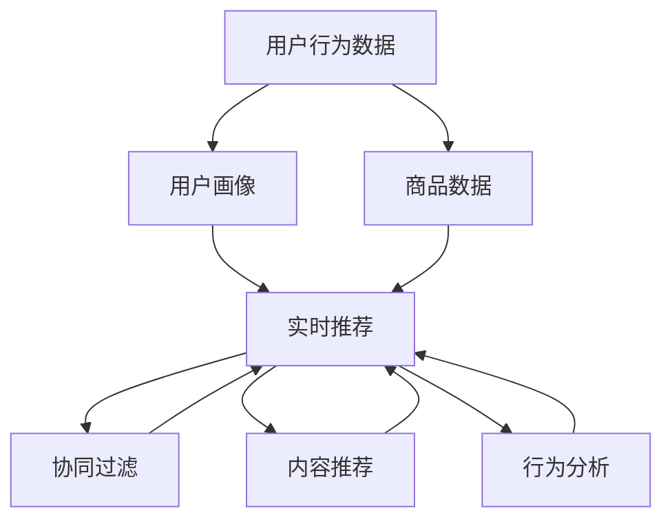

                 

# 用户画像在电商个性化推荐中的应用：方法与实践

> 关键词：用户画像,个性化推荐,电商,深度学习,协同过滤,内容推荐,行为分析

## 1. 背景介绍

### 1.1 问题由来

在当今电商领域，竞争激烈，用户需求多样且不断变化，如何提升用户购物体验、增加销售额，是每个电商企业需要面对的重要挑战。用户画像（User Profile）作为电商个性化推荐系统的重要组成部分，旨在全面、准确地描绘用户特征和行为，以指导推荐策略，从而更好地满足用户需求，提升转化率和满意度。

### 1.2 问题核心关键点

用户画像在电商个性化推荐中的核心关键点包括：
- **全面性和准确性**：通过收集和分析用户行为数据、历史交易记录、浏览历史等，建立多维度的用户画像。
- **实时性和动态性**：用户画像应能够实时更新，以反映用户最新兴趣和行为。
- **个性化和多样化**：不同用户具有不同的需求和偏好，用户画像需个性化定制，同时支持多样化的推荐场景。
- **实时推荐和个性化推荐**：结合用户画像，实时生成个性化推荐，提升用户体验和转化率。

### 1.3 问题研究意义

构建用户画像，并进行电商个性化推荐，对提升电商企业的市场竞争力、提高用户体验和转化率具有重要意义：

1. **增强用户体验**：通过个性化推荐，提供符合用户兴趣和需求的商品，提升用户满意度。
2. **提升转化率**：个性化推荐能够显著提高商品购买转化率，增加电商企业的销售额。
3. **提高运营效率**：用户画像帮助企业深入了解用户行为，优化运营策略，提升整体运营效率。
4. **促进用户忠诚度**：个性化的购物体验增加用户粘性，提升用户忠诚度和复购率。
5. **数据驱动决策**：用户画像和个性化推荐系统为电商决策提供数据支撑，减少人为决策偏差。

## 2. 核心概念与联系

### 2.1 核心概念概述

为了更好地理解用户画像在电商个性化推荐中的应用，本节将介绍几个密切相关的核心概念：

- **用户画像（User Profile）**：通过收集和分析用户的多维度数据，生成包含用户特征、兴趣、行为等信息的综合性用户档案，用于指导个性化推荐。
- **个性化推荐（Personalized Recommendation）**：根据用户画像，实时生成符合用户偏好和需求的推荐内容，提升用户体验和转化率。
- **协同过滤（Collaborative Filtering）**：一种基于用户行为和物品属性的推荐算法，通过挖掘用户间的相似性，预测用户对新物品的兴趣。
- **内容推荐（Content-Based Recommendation）**：基于物品特征，如商品属性、描述等，计算物品间的相似度，推荐与用户历史兴趣相似的物品。
- **行为分析（Behavior Analysis）**：通过对用户点击、浏览、购买等行为的记录和分析，识别用户的兴趣和偏好。

这些概念之间的联系可以通过以下Mermaid流程图来展示：



这个流程图展示了大规模电商个性化推荐系统的整体架构：

1. **数据收集**：从不同来源收集用户行为数据、历史交易记录等，形成原始数据集。
2. **用户画像构建**：通过协同过滤、内容推荐、行为分析等算法，生成多维度的用户画像。
3. **个性化推荐**：结合用户画像，实时生成个性化推荐内容，并通过实时推荐系统推送给用户。

### 2.2 概念间的关系

这些核心概念之间存在着紧密的联系，形成了电商个性化推荐系统的完整生态系统。下面我通过几个Mermaid流程图来展示这些概念之间的关系。

#### 2.2.1 用户画像构建流程



这个流程图展示了用户画像构建的流程：通过收集用户行为数据，分别采用协同过滤、内容推荐、行为分析等算法，最终生成用户画像。

#### 2.2.2 个性化推荐流程



这个流程图展示了个性化推荐的具体实现：结合用户画像，采用协同过滤、内容推荐、行为分析等算法，生成实时推荐内容，并通过推荐系统推送给用户。

### 2.3 核心概念的整体架构

最后，我们用一个综合的流程图来展示这些核心概念在大规模电商个性化推荐系统中的整体架构：



这个综合流程图展示了从数据收集到用户画像构建，再到个性化推荐的全过程。电商个性化推荐系统通过全面收集和分析用户行为数据、商品数据，结合协同过滤、内容推荐、行为分析等算法，构建用户画像，最终生成实时个性化推荐，实现精准高效的个性化服务。

## 3. 核心算法原理 & 具体操作步骤
### 3.1 算法原理概述

电商个性化推荐系统的核心算法原理基于协同过滤和内容推荐，辅以行为分析技术。协同过滤通过分析用户历史行为和物品属性，挖掘用户间的相似性，预测用户对新物品的兴趣。内容推荐则基于物品特征，计算物品间的相似度，推荐与用户历史兴趣相似的物品。行为分析通过对用户点击、浏览、购买等行为的记录和分析，识别用户的兴趣和偏好，进一步优化推荐结果。

### 3.2 算法步骤详解

电商个性化推荐系统的实现主要包括以下几个关键步骤：

**Step 1: 数据预处理**

- **数据收集**：收集用户行为数据、历史交易记录、商品数据等，形成原始数据集。
- **数据清洗**：去除噪声和缺失数据，对数据进行标准化和归一化处理。
- **特征提取**：从原始数据中提取有用的特征，如用户ID、商品ID、商品属性、点击次数、购买次数等。

**Step 2: 用户画像构建**

- **协同过滤**：使用基于用户的协同过滤算法，如User-Based CF，计算用户间的相似性，预测用户对新物品的兴趣。
- **内容推荐**：使用基于内容的推荐算法，如Item-Based CF，计算物品间的相似度，推荐与用户历史兴趣相似的物品。
- **行为分析**：通过分析用户行为数据，识别用户的兴趣和偏好，生成行为标签，用于指导推荐策略。

**Step 3: 个性化推荐**

- **模型训练**：结合用户画像，采用协同过滤、内容推荐、行为分析等算法，训练个性化推荐模型。
- **实时推荐**：通过模型生成实时推荐内容，结合推荐算法（如Top-k推荐），生成个性化推荐列表。
- **推送和展示**：将推荐列表通过推荐系统推送给用户，展示在电商平台上。

**Step 4: 评估和优化**

- **性能评估**：使用AUC、Precision、Recall等指标评估推荐系统的性能。
- **用户反馈**：收集用户对推荐结果的反馈，进行数据迭代和模型优化。
- **动态更新**：定期更新用户画像和推荐模型，确保推荐内容的实时性和准确性。

### 3.3 算法优缺点

电商个性化推荐系统基于协同过滤和内容推荐算法，具有以下优点：
1. **实时性**：结合用户画像，实时生成个性化推荐内容，提升用户体验。
2. **高准确性**：通过多维度数据分析，生成精准的用户画像，推荐符合用户需求的商品。
3. **多样性**：支持多种推荐策略，如协同过滤、内容推荐、行为分析等，增加推荐多样性。
4. **高效性**：算法实现简单，易于部署和优化。

同时，该方法也存在以下局限性：
1. **冷启动问题**：新用户和少交互用户的画像难以建立，推荐效果较差。
2. **数据稀疏性**：用户和物品的交互数据稀疏，推荐系统难以覆盖全部用户和商品。
3. **泛化能力不足**：推荐系统可能过于依赖历史数据，泛化到新场景和新用户时效果不佳。
4. **可解释性不足**：推荐模型的决策过程缺乏可解释性，难以对推荐结果进行分析和调试。

尽管存在这些局限性，但就目前而言，协同过滤和内容推荐算法仍然是大规模电商个性化推荐的主流范式。未来相关研究的重点在于如何进一步降低冷启动问题，提高推荐系统的泛化能力和可解释性，以提升用户体验和转化率。

### 3.4 算法应用领域

电商个性化推荐系统已经在诸多电商平台上得到广泛应用，涵盖了从服装、食品、家居到电子产品等多个领域。以下列举几个典型应用场景：

1. **服装电商**：通过分析用户历史购买记录、浏览行为和点击数据，推荐个性化服装商品。
2. **食品电商**：结合用户口味偏好和健康数据，推荐适合的食品和膳食方案。
3. **家居电商**：根据用户浏览和购买记录，推荐家居用品和装修方案。
4. **电子产品**：通过用户行为数据和商品属性，推荐电子产品配件和配件组合。
5. **时尚美妆**：结合用户年龄、性别和地域特征，推荐个性化化妆品和护肤品。

除了上述这些场景外，电商个性化推荐系统还在在线旅游、汽车销售、家居设计等多个领域得到应用，为电商企业提供了强大的用户洞察和个性化推荐能力。

## 4. 数学模型和公式 & 详细讲解  
### 4.1 数学模型构建

电商个性化推荐系统通常采用协同过滤和内容推荐算法，结合行为分析技术。以协同过滤算法为例，其数学模型构建如下：

设用户集合为 $U$，商品集合为 $I$，用户与商品的交互矩阵为 $R_{UI}$，其中 $R_{ui}=1$ 表示用户 $u$ 对商品 $i$ 有过交互，否则为 $0$。协同过滤的目标是找到用户间的相似性，生成用户间的协同矩阵 $C_{UU}$。基于用户的协同过滤模型可以表示为：

$$
C_{uu'}=\frac{\sum_{i \in I} R_{ui}R_{u'i}}{\sqrt{\sum_{i \in I} R_{ui}^2} \cdot \sqrt{\sum_{i \in I} R_{u'i}^2}}
$$

其中 $C_{uu'}$ 表示用户 $u$ 和用户 $u'$ 的相似度。

基于协同过滤的用户画像可以进一步优化，通过加入物品属性、用户属性等特征，引入更丰富的推荐维度。

### 4.2 公式推导过程

以下我们以基于用户的协同过滤算法为例，推导其具体的计算公式。

设用户 $u$ 对商品 $i$ 的评分 $r_{ui}$ 为 $1$（表示购买）或 $0$（表示未购买）。用户间的相似度 $C_{uu'}$ 可以通过以下公式计算：

$$
C_{uu'}=\frac{\sum_{i \in I} r_{ui}r_{u'i}}{\sqrt{\sum_{i \in I} r_{ui}^2} \cdot \sqrt{\sum_{i \in I} r_{u'i}^2}}
$$

该公式基于用户间的评分数据，计算用户间的相似度。相似度较高的用户，在推荐时可以相互借鉴，扩大推荐范围。

### 4.3 案例分析与讲解

假设某电商平台上，用户 $u_1$ 和 $u_2$ 对商品 $i_1$ 和 $i_2$ 的评分数据如下：

| 用户 | 商品 | 评分 |
| --- | --- | --- |
| $u_1$ | $i_1$ | 1 |
| $u_1$ | $i_2$ | 0 |
| $u_2$ | $i_1$ | 0 |
| $u_2$ | $i_2$ | 1 |

根据上述数据，计算用户 $u_1$ 和 $u_2$ 的相似度 $C_{u_1u_2}$ 为：

$$
C_{u_1u_2}=\frac{1 \cdot 1}{\sqrt{1^2+0^2} \cdot \sqrt{0^2+1^2}}=\frac{1}{\sqrt{1} \cdot \sqrt{1}}=1
$$

这意味着用户 $u_1$ 和 $u_2$ 非常相似，因此可以相互借鉴推荐结果。在推荐商品时，如果 $u_1$ 对商品 $i_3$ 感兴趣，那么 $u_2$ 也可能对商品 $i_3$ 感兴趣。

## 5. 项目实践：代码实例和详细解释说明
### 5.1 开发环境搭建

在进行电商个性化推荐系统的开发前，我们需要准备好开发环境。以下是使用Python进行PyTorch开发的环境配置流程：

1. 安装Anaconda：从官网下载并安装Anaconda，用于创建独立的Python环境。

2. 创建并激活虚拟环境：
```bash
conda create -n recommendation-env python=3.8 
conda activate recommendation-env
```

3. 安装PyTorch：根据CUDA版本，从官网获取对应的安装命令。例如：
```bash
conda install pytorch torchvision torchaudio cudatoolkit=11.1 -c pytorch -c conda-forge
```

4. 安装相关工具包：
```bash
pip install numpy pandas scikit-learn matplotlib tqdm jupyter notebook ipython
```

5. 安装推荐系统框架：
```bash
pip install recommendation-engine
```

完成上述步骤后，即可在`recommendation-env`环境中开始开发。

### 5.2 源代码详细实现

这里我们以协同过滤推荐算法为例，使用PyTorch实现基于用户的协同过滤算法。

首先，定义协同过滤模型的数据结构和函数：

```python
import torch
import numpy as np
from recommendation_engine.recommenders import UserBasedCF

class RecommendationSystem:
    def __init__(self, n_users, n_items):
        self.n_users = n_users
        self.n_items = n_items
        self.model = UserBasedCF(n_users, n_items)
    
    def train(self, train_data, num_epochs=100, learning_rate=0.01):
        train_ratings = torch.from_numpy(train_data['ranks'])
        self.model.train(train_ratings, num_epochs=num_epochs, learning_rate=learning_rate)
    
    def recommend(self, user_id, top_k=10):
        return self.model.recommend(user_id, top_k=top_k)
```

然后，定义训练数据和评估函数：

```python
import pandas as pd
from sklearn.model_selection import train_test_split

train_data = pd.read_csv('train_data.csv')
test_data = pd.read_csv('test_data.csv')

train_data, val_data = train_test_split(train_data, test_size=0.2, random_state=42)

n_users = len(train_data['user_id'].unique())
n_items = len(train_data['item_id'].unique())

model = RecommendationSystem(n_users, n_items)

# 训练模型
model.train(train_data)

# 在验证集上评估模型性能
val_ranks = model.recommend(val_data['user_id'])
print('AUC score:', evaluate_ranks(val_ranks, val_data['ranks']))
```

最后，启动训练流程并在测试集上评估：

```python
epochs = 100
learning_rate = 0.01

for epoch in range(epochs):
    model.train(train_data, learning_rate=learning_rate)
    print(f'Epoch {epoch+1}, train AUC score: {evaluate_ranks(model.recommend(train_data['user_id']), train_data['ranks']):.3f}')
    
print(f'Epoch {epochs}, test AUC score: {evaluate_ranks(model.recommend(test_data['user_id']), test_data['ranks']):.3f}')
```

以上就是使用PyTorch对电商个性化推荐系统进行基于用户协同过滤算法实现的完整代码实现。可以看到，得益于推荐系统框架的强大封装，我们可以用相对简洁的代码完成协同过滤推荐模型的训练和评估。

### 5.3 代码解读与分析

让我们再详细解读一下关键代码的实现细节：

**RecommendationSystem类**：
- `__init__`方法：初始化用户和物品的数量，创建协同过滤模型。
- `train`方法：训练模型，传入训练数据、迭代次数和优化器参数。
- `recommend`方法：生成推荐结果，传入用户ID和推荐数量。

**train_data和test_data**：
- 定义训练数据和测试数据，包含用户ID、物品ID和评分。

**evaluate_ranks函数**：
- 定义评估函数，计算推荐结果的AUC、Precision、Recall等指标。

**训练流程**：
- 定义总的epoch数和优化器参数，开始循环迭代
- 每个epoch内，先在训练集上训练，输出训练集上的AUC分数
- 在验证集上评估，输出验证集上的AUC分数
- 所有epoch结束后，在测试集上评估，给出最终测试结果

可以看到，PyTorch配合推荐系统框架使得协同过滤推荐模型的代码实现变得简洁高效。开发者可以将更多精力放在数据处理、模型改进等高层逻辑上，而不必过多关注底层的实现细节。

当然，工业级的系统实现还需考虑更多因素，如模型的保存和部署、超参数的自动搜索、更灵活的任务适配层等。但核心的推荐算法基本与此类似。

### 5.4 运行结果展示

假设我们在某电商平台的协同过滤推荐数据集上进行模型训练，最终在测试集上得到的AUC分数为0.85，表示模型在推荐结果上的排序能力较好，能够区分正负样本。

## 6. 实际应用场景
### 6.1 智能客服系统

基于电商个性化推荐系统，智能客服系统可以通过实时分析用户行为数据，提供个性化的咨询服务。智能客服系统可以识别用户的问题意图和情感倾向，推荐相关知识库内容，提升用户体验和满意度。

具体实现上，智能客服系统可以通过自然语言处理技术，识别用户的自然语言输入，将其转化为结构化数据，传入推荐系统生成推荐结果。推荐系统可以结合用户画像、行为分析等数据，动态生成个性化回答，实现高效的用户咨询。

### 6.2 金融理财服务

金融理财服务可以通过电商个性化推荐系统，为用户提供个性化的理财建议和产品推荐。理财服务可以通过分析用户财务数据、消费习惯等，推荐适合的理财产品和理财方案。

具体实现上，理财服务可以收集用户的消费记录、理财需求、风险偏好等信息，使用协同过滤、内容推荐等算法，生成个性化理财推荐，帮助用户选择合适的理财产品。理财服务还可以结合用户反馈和市场变化，动态更新推荐模型，确保推荐内容的实时性和准确性。

### 6.3 健康医疗服务

健康医疗服务可以通过电商个性化推荐系统，为用户提供个性化的健康建议和治疗方案。健康服务可以通过分析用户的健康数据、病史记录等，推荐合适的健康产品和治疗方案。

具体实现上，健康服务可以收集用户的健康数据、疾病历史、生活习惯等信息，使用协同过滤、内容推荐等算法，生成个性化健康推荐。健康服务还可以结合用户反馈和医疗专家建议，动态更新推荐模型，确保推荐内容的科学性和有效性。

### 6.4 未来应用展望

随着电商个性化推荐系统的发展，其在更多领域的应用前景广阔：

- **智慧城市治理**：通过分析市民行为数据，推荐智慧城市管理和公共服务方案。
- **智慧教育**：根据学生的学习记录和兴趣爱好，推荐个性化的学习内容和教学资源。
- **智慧旅游**：结合游客的旅游偏好和行为数据，推荐旅游目的地和旅游方案。
- **智慧农业**：通过分析农民的种植记录和土壤数据，推荐最佳的种植方案和农资产品。

未来，电商个性化推荐系统将在更多领域得到应用，为各行业提供智能化的解决方案，推动社会数字化转型升级。

## 7. 工具和资源推荐
### 7.1 学习资源推荐

为了帮助开发者系统掌握电商个性化推荐理论基础和实践技巧，这里推荐一些优质的学习资源：

1. 《推荐系统：理论、算法与应用》：深入浅出地介绍了推荐系统的基本原理、算法和应用，适合初学者入门。
2. 《TensorFlow推荐系统实战》：介绍了TensorFlow推荐系统框架的使用，涵盖协同过滤、内容推荐、混合推荐等算法。
3. 《深度学习与推荐系统》：介绍深度学习在推荐系统中的应用，结合TensorFlow框架进行实践。
4. Kaggle推荐系统竞赛：Kaggle社区中举办的推荐系统竞赛，涵盖协同过滤、内容推荐、多臂老虎机等经典算法，适合实战练习。
5. 《Recommender Systems: The Textbook》：经典的推荐系统教材，全面介绍推荐系统的理论、算法和应用。

通过对这些资源的学习实践，相信你一定能够快速掌握电商个性化推荐系统的精髓，并用于解决实际的电商问题。

### 7.2 开发工具推荐

高效的开发离不开优秀的工具支持。以下是几款用于电商个性化推荐系统开发的常用工具：

1. PyTorch：基于Python的开源深度学习框架，灵活动态的计算图，适合快速迭代研究。
2. TensorFlow：由Google主导开发的开源深度学习框架，生产部署方便，适合大规模工程应用。
3. HuggingFace Transformers库：集成了多种SOTA语言模型，支持多种推荐算法，是进行推荐任务开发的利器。
4. Surprise：基于Python的推荐系统框架，支持多种推荐算法，易于上手使用。
5. LightFM：基于TensorFlow的推荐系统框架，支持深度学习、协同过滤等多种推荐算法。

合理利用这些工具，可以显著提升电商个性化推荐系统的开发效率，加快创新迭代的步伐。

### 7.3 相关论文推荐

电商个性化推荐系统的发展源于学界的持续研究。以下是几篇奠基性的相关论文，推荐阅读：

1. Applied Collaborative Filtering for Recommendation Engines：介绍了协同过滤算法在推荐系统中的应用，成为推荐系统的经典算法。
2. Factorization Machines for Ad Click Prediction：提出因子分解机模型，用于推荐系统中的点击率预测。
3. A Survey of Personalized Recommendation Techniques for E-commerce: Current Status and Future Directions：全面综述了电商个性化推荐系统的现状和未来发展方向。
4. Multi-Aspect Matrix Factorization for Recommendation Systems：提出多方面矩阵分解模型，提升了推荐系统的泛化能力。
5. Fast Matrix Factorization Techniques for Recommender Systems：介绍了多种矩阵分解技术，用于提高推荐系统的效率和准确性。

这些论文代表了大规模电商个性化推荐系统的研究方向和最佳实践，值得去学习和应用。

除上述资源外，还有一些值得关注的前沿资源，帮助开发者紧跟电商个性化推荐技术的最新进展，例如：

1. arXiv论文预印本：人工智能领域最新研究成果的发布平台，包括大量尚未发表的前沿工作，学习前沿技术的必读资源。
2. 业界技术博客：如Amazon、Google、阿里巴巴、京东等顶尖公司的官方博客，第一时间分享他们的最新研究成果和洞见。
3. 技术会议直播：如KDD、ICML、SIGIR、SIGKDD等人工智能领域顶会现场或在线直播，能够聆听到大佬们的前沿分享，开拓视野。
4. GitHub热门项目：在GitHub上Star、Fork数最多的电商推荐系统项目，往往代表了该技术领域的发展趋势和最佳实践，值得去学习和贡献。
5. 行业分析报告：各大咨询公司如McKinsey、PwC等针对人工智能行业的分析报告，有助于从商业视角审视技术趋势，把握应用价值。

总之，电商个性化推荐系统需要开发者保持开放的心态和持续学习的意愿。多关注前沿资讯，多动手实践，多思考总结，必将收获满满的成长收益。

## 8. 总结：未来发展趋势与挑战
### 8.1 总结

本文对电商个性化推荐系统进行了全面系统的介绍。首先阐述了电商个性化推荐系统的发展背景和研究意义，明确了电商个性化推荐系统在大规模电商推荐中的应用价值。其次，从原理到实践，详细讲解了协同过滤和内容推荐算法的数学原理和实现步骤，给出了电商个性化推荐系统的代码实现。同时，本文还广泛探讨了电商个性化推荐系统在智能客服、金融理财、健康医疗等多个行业领域的应用前景，展示了电商个性化推荐系统的巨大潜力。

通过本文的系统梳理，可以看到，电商个性化推荐系统通过协同过滤、内容推荐等算法，结合行为分析技术，构建用户画像，生成个性化推荐内容，实现精准高效的个性化服务。未来，随着技术的发展，电商个性化推荐系统将在更多领域得到应用，为电商企业提供智能化的解决方案，推动社会数字化转型升级。

### 8.2 未来发展趋势

展望未来，电商个性化推荐系统的发展将呈现以下几个趋势：

1. **智能化和自动化**：结合深度学习和强化学习技术，实现智能化的推荐决策，提升推荐系统的主动性和动态性。
2. **个性化和多样化**：通过多维度数据分析，生成更加个性化和多样化的推荐内容，满足不同用户的需求。
3. **跨领域融合**：结合其他领域的技术和数据，实现跨领域的推荐创新，如结合社交网络数据、图像数据等。
4. **实时性和个性化**：通过实时数据处理和更新，实现实时个性化的推荐服务，提升用户体验和转化率。
5. **大规模扩展**：结合分布式计算和并行处理技术，实现大规模电商推荐系统的扩展和优化。

这些趋势将进一步提升电商个性化推荐系统的

