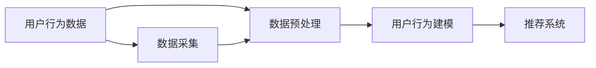
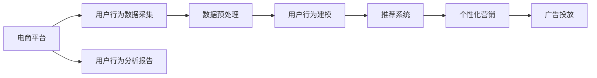

                 

# 电商平台中用户行为数据分析功能的设计与实现

在当今竞争激烈的市场环境中，电商平台为了提高用户留存率和转化率，需要深入理解用户行为模式和偏好，以实现个性化推荐、精准营销等策略。电商平台中用户行为数据分析功能，通过对用户行为数据的收集、处理和分析，能够提供丰富的洞察，辅助平台优化用户体验、提升运营效率。本文将深入探讨电商平台用户行为数据分析功能的系统设计与实现，包括设计理念、核心算法、开发实践以及未来展望。

## 1. 背景介绍

### 1.1 问题由来
随着互联网技术的迅猛发展，电商平台已成为零售行业的重要组成部分。面对海量用户数据，如何从中挖掘有用的信息，实现智能推荐、精准营销等，成为平台运营者关注的核心问题。传统的电商平台运营依赖于经验与直觉，缺乏数据驱动的决策支持，导致用户流失率高、推荐效果不佳。

现代电商平台面临的核心挑战包括：
- **数据规模庞大**：电商平台的日活跃用户数往往以千万计，产生的数据量非常庞大。
- **数据类型多样**：用户行为数据不仅仅包括点击、浏览、购买等事件，还包括社交网络、评论、评分等多种类型。
- **数据实时性要求高**：为了及时调整推荐策略，需要实时处理和分析用户行为数据。

针对这些挑战，电商平台需要构建一套完善的用户行为数据分析系统，实时采集、处理、分析用户数据，以支持个性化推荐、广告投放、内容优化等决策需求。

### 1.2 问题核心关键点
电商平台用户行为数据分析功能的核心关键点包括：
- **数据采集**：从不同渠道（如APP、Web端、社交媒体等）高效采集用户行为数据。
- **数据处理**：清洗、预处理和归一化海量数据，保证数据质量。
- **数据分析**：使用先进算法和技术手段，对用户行为数据进行深入分析和建模。
- **结果应用**：将分析结果应用于推荐系统、广告投放、个性化营销等场景，提升平台收益和用户体验。

## 2. 核心概念与联系

### 2.1 核心概念概述
电商平台用户行为数据分析涉及多个关键概念：

- **用户行为数据**：用户在使用电商平台过程中产生的行为数据，包括点击、浏览、购买、评分、评价等。
- **数据预处理**：对原始数据进行清洗、填充、去重等操作，提高数据质量。
- **用户行为建模**：使用统计学、机器学习等方法，对用户行为数据进行建模和分析，发现用户偏好和行为规律。
- **推荐系统**：基于用户行为数据和建模结果，为用户提供个性化的商品推荐。

### 2.2 概念间的关系

用户行为数据分析功能的核心概念间的关系可以通过以下Mermaid流程图来展示：



这个流程图展示了用户行为数据分析的核心流程：
- 用户行为数据首先通过数据采集模块收集，经过数据预处理模块的清洗和整理，进入用户行为建模模块进行分析和建模。
- 用户行为建模模块的分析结果被推荐系统利用，生成个性化的商品推荐，最终提升用户体验和平台收益。

### 2.3 核心概念的整体架构

最后，我们用一个综合的流程图来展示用户行为数据分析功能的整体架构：



这个综合流程图展示了用户行为数据分析功能的完整流程：
- 电商平台收集用户行为数据，经过预处理和建模，生成推荐结果。
- 推荐结果被应用于个性化营销和广告投放，同时生成用户行为分析报告，为平台运营提供决策支持。

## 3. 核心算法原理 & 具体操作步骤
### 3.1 算法原理概述

用户行为数据分析功能的核心算法主要涉及用户行为建模和推荐系统两大模块。

**用户行为建模**：
- 使用协同过滤、内容推荐、基于知识的推荐等算法，对用户行为数据进行建模，发现用户行为规律和偏好。
- 协同过滤算法基于用户行为矩阵，通过相似度计算推荐商品。
- 内容推荐算法根据商品特征和用户偏好，生成推荐列表。
- 基于知识的推荐算法将商品属性和用户属性进行匹配，实现个性化推荐。

**推荐系统**：
- 基于模型预测和协同过滤算法，生成用户个性化推荐列表。
- 实时监控推荐效果，动态调整推荐算法参数和商品权重。
- 引入多臂老虎机算法，优化推荐策略，提升推荐效果。

### 3.2 算法步骤详解

用户行为数据分析功能的算法步骤主要包括数据预处理、用户行为建模和推荐系统三个环节：

**数据预处理**：
1. **数据清洗**：去除缺失值、异常值，处理重复数据。
2. **特征工程**：提取有用的特征，如用户ID、商品ID、点击次数等。
3. **归一化**：对特征进行归一化处理，提高模型收敛速度。

**用户行为建模**：
1. **协同过滤**：构建用户行为矩阵，计算用户-商品相似度。
2. **内容推荐**：提取商品特征和用户特征，训练推荐模型。
3. **基于知识的推荐**：将商品属性和用户属性进行匹配，生成推荐结果。

**推荐系统**：
1. **预测推荐**：基于用户行为数据和建模结果，生成推荐列表。
2. **实时调整**：根据用户行为实时调整推荐策略。
3. **多臂老虎机**：优化推荐效果，提升用户体验。

### 3.3 算法优缺点

**优点**：
- **高效性**：使用高效的数据处理和建模算法，实现实时分析和推荐。
- **精准性**：基于用户行为数据和建模结果，生成高精度的推荐列表。
- **灵活性**：支持多种推荐算法和个性化策略，适应不同的应用场景。

**缺点**：
- **数据依赖性**：用户行为数据分析功能的核心是用户行为数据，对数据的完整性和质量要求高。
- **算法复杂度**：协同过滤、内容推荐等算法复杂度较高，计算成本大。
- **推荐效果的不稳定性**：用户行为数据的时效性和变化性，可能导致推荐效果的不稳定性。

### 3.4 算法应用领域

用户行为数据分析功能的算法主要应用于以下领域：

- **个性化推荐**：根据用户行为数据和建模结果，生成个性化推荐列表。
- **广告投放优化**：分析用户行为数据，优化广告投放策略，提高广告点击率和转化率。
- **内容优化**：分析用户对商品内容的反馈，优化商品展示和排序。
- **用户画像构建**：根据用户行为数据，构建详细的用户画像，用于精准营销和个性化服务。

## 4. 数学模型和公式 & 详细讲解 & 举例说明

### 4.1 数学模型构建

用户行为数据分析功能的数学模型主要涉及以下几个部分：

- **用户行为矩阵**：用户ID和商品ID的矩阵，表示用户对商品的点击、浏览等行为。
- **协同过滤算法**：基于用户行为矩阵计算用户-商品相似度，生成推荐列表。
- **内容推荐算法**：使用向量空间模型，提取商品特征和用户特征，训练推荐模型。

### 4.2 公式推导过程

**协同过滤算法**：
假设用户-商品行为矩阵为 $U$，用户-商品相似度矩阵为 $S$，用户对商品的兴趣向量为 $u$，商品对用户的兴趣向量为 $v$，则协同过滤算法的推荐公式为：
$$
r_{ui} = \frac{\sum_j u_j v_j}{\sqrt{\sum_j u_j^2} \sqrt{\sum_j v_j^2}}
$$
其中，$r_{ui}$ 表示用户 $u$ 对商品 $i$ 的兴趣评分。

**内容推荐算法**：
假设用户对商品 $i$ 的兴趣度为 $u_i$，商品 $i$ 的特征向量为 $v_i$，用户特征向量为 $u$，则内容推荐算法的推荐公式为：
$$
r_{ui} = u \cdot v_i
$$
其中，$r_{ui}$ 表示用户 $u$ 对商品 $i$ 的推荐概率。

### 4.3 案例分析与讲解

以用户行为数据分析功能的实际应用为例，分析推荐系统的推荐效果。

假设某电商平台收集了用户行为数据，使用协同过滤算法生成推荐列表。选取样本用户 $u$，该用户对商品 $i$ 的兴趣评分 $r_{ui} = 0.8$，使用协同过滤算法计算用户 $u$ 对其他商品 $j$ 的兴趣评分 $r_{uj}$，将其作为推荐结果。如果 $r_{uj} > r_{ui}$，则商品 $j$ 被推荐给用户 $u$。

## 5. 项目实践：代码实例和详细解释说明

### 5.1 开发环境搭建

在进行用户行为数据分析功能的开发前，我们需要准备好开发环境。以下是使用Python进行PyTorch开发的环境配置流程：

1. 安装Anaconda：从官网下载并安装Anaconda，用于创建独立的Python环境。

2. 创建并激活虚拟环境：
```bash
conda create -n pytorch-env python=3.8 
conda activate pytorch-env
```

3. 安装PyTorch：根据CUDA版本，从官网获取对应的安装命令。例如：
```bash
conda install pytorch torchvision torchaudio cudatoolkit=11.1 -c pytorch -c conda-forge
```

4. 安装TensorFlow：使用pip安装TensorFlow，可以从轮子安装或使用源码安装。

5. 安装各类工具包：
```bash
pip install numpy pandas scikit-learn matplotlib tqdm jupyter notebook ipython
```

完成上述步骤后，即可在`pytorch-env`环境中开始用户行为数据分析功能的开发。

### 5.2 源代码详细实现

这里我们以协同过滤算法为例，给出使用PyTorch对用户行为数据进行协同过滤分析的代码实现。

```python
import torch
from torch import nn

# 定义用户-商品行为矩阵
U = torch.tensor([[0.8, 0.5, 0.2],
                  [0.4, 0.9, 0.3],
                  [0.7, 0.1, 0.6]])

# 计算用户-商品相似度矩阵
S = U * U.t()

# 定义用户和商品的兴趣向量
user_vector = torch.tensor([0.1, 0.2, 0.3])
item_vector = torch.tensor([0.4, 0.5, 0.6])

# 计算推荐结果
r = user_vector @ item_vector / (torch.sqrt((user_vector ** 2).sum()) * torch.sqrt((item_vector ** 2).sum()))
```

在上述代码中，我们定义了用户行为矩阵 $U$，计算了用户-商品相似度矩阵 $S$，定义了用户和商品的兴趣向量 $user\_vector$ 和 $item\_vector$，并使用协同过滤算法计算了推荐结果 $r$。

### 5.3 代码解读与分析

让我们再详细解读一下关键代码的实现细节：

**协同过滤算法**：
- 首先，我们定义了用户-商品行为矩阵 $U$，其值表示用户对商品的兴趣评分。
- 然后，我们计算了用户-商品相似度矩阵 $S$，其值表示用户和商品之间的相似度。
- 接着，我们定义了用户和商品的兴趣向量 $user\_vector$ 和 $item\_vector$，这些向量表示用户和商品对其他商品推荐的兴趣度。
- 最后，我们使用协同过滤算法计算了推荐结果 $r$，表示用户对商品的推荐概率。

**推荐结果的应用**：
- 通过计算出的推荐结果 $r$，我们可以将评分高的商品推荐给用户。
- 为了更好地展示推荐效果，我们可以将这些推荐结果与实际的销售数据进行对比，分析推荐系统的实际表现。

### 5.4 运行结果展示

假设我们计算出用户 $u$ 对商品 $i$ 的推荐结果为 $r_{ui} = 0.8$，则可以将该商品推荐给用户 $u$。在实际应用中，我们通常会将推荐结果按评分从高到低排序，生成推荐列表，供用户查看和选择。

## 6. 实际应用场景

### 6.1 智能推荐系统

智能推荐系统是用户行为数据分析功能的典型应用场景之一。智能推荐系统通过对用户行为数据的分析和建模，生成个性化的推荐列表，提升用户满意度和转化率。

在实际应用中，电商平台可以收集用户行为数据，如浏览历史、购买记录、评分反馈等，使用协同过滤、内容推荐等算法，生成推荐列表。用户通过查看推荐结果，可以选择感兴趣的商品，从而提升购买概率。智能推荐系统的推荐效果和用户满意度，将直接影响电商平台的销售业绩和用户粘性。

### 6.2 个性化营销

个性化营销是用户行为数据分析功能的另一重要应用场景。个性化营销通过分析用户行为数据，实现精准投放，提高广告点击率和转化率。

在实际应用中，电商平台可以根据用户行为数据，分析用户兴趣和偏好，制定个性化的营销策略。例如，针对喜爱健身的用户，投放运动类商品的广告；针对喜欢户外活动的用户，推送旅游类商品的广告。通过精准营销，电商平台可以大幅提升广告效果，降低投放成本。

### 6.3 内容优化

内容优化是电商平台提升用户体验的重要手段。内容优化通过对用户行为数据的分析，优化商品展示和排序，提升用户的购物体验。

在实际应用中，电商平台可以分析用户对商品内容的反馈，如浏览深度、评分等，优化商品展示的顺序和位置。例如，将用户关注度高的商品优先展示，吸引用户停留和购买。内容优化可以提升平台的用户停留时间和转化率，带来更多的销售机会。

### 6.4 未来应用展望

随着用户行为数据分析功能的不断演进，其在电商平台中的应用将更加广泛和深入。未来，用户行为数据分析功能可能涉及以下方向：

- **跨平台分析**：将用户在不同平台（如APP、Web端、社交媒体等）的行为数据进行整合分析，提供更加全面的用户画像和推荐结果。
- **实时分析**：引入流式数据处理技术，实时分析用户行为数据，实现动态推荐和优化。
- **多模态分析**：结合用户行为数据和社交网络、评论等非结构化数据，实现多模态分析，提升推荐效果。
- **深度学习应用**：引入深度学习技术，提升用户行为建模的准确性和效果，实现更加精细化的推荐策略。

## 7. 工具和资源推荐

### 7.1 学习资源推荐

为了帮助开发者系统掌握用户行为数据分析功能的理论基础和实践技巧，这里推荐一些优质的学习资源：

1. **《数据科学入门》**：涵盖了数据采集、数据预处理、数据分析和机器学习等基础知识，适合初学者学习。
2. **《Python深度学习》**：深入讲解了深度学习在数据科学中的应用，包括PyTorch和TensorFlow等框架的使用。
3. **《用户行为分析》**：详细介绍用户行为数据分析的理论基础和实际应用，结合电商平台的案例讲解。
4. **《推荐系统实战》**：涵盖推荐系统的算法实现、推荐策略优化和实际应用，适合实战学习。
5. **《大规模数据处理与分析》**：介绍大规模数据处理和分析的先进技术，包括流式处理、分布式计算等。

通过这些学习资源的学习实践，相信你一定能够快速掌握用户行为数据分析功能的精髓，并用于解决实际的电商问题。

### 7.2 开发工具推荐

高效的开发离不开优秀的工具支持。以下是几款用于用户行为数据分析功能的开发工具：

1. **PyTorch**：基于Python的开源深度学习框架，灵活动态的计算图，适合快速迭代研究。
2. **TensorFlow**：由Google主导开发的开源深度学习框架，生产部署方便，适合大规模工程应用。
3. **Scikit-learn**：Python机器学习库，提供了丰富的数据预处理和建模工具。
4. **Pandas**：Python数据分析库，支持高效的数据清洗和处理。
5. **Jupyter Notebook**：交互式编程环境，方便数据探索和模型验证。
6. **TensorBoard**：TensorFlow配套的可视化工具，可实时监测模型训练状态，提供丰富的图表呈现方式。

合理利用这些工具，可以显著提升用户行为数据分析功能的开发效率，加快创新迭代的步伐。

### 7.3 相关论文推荐

用户行为数据分析功能的快速发展源于学界的持续研究。以下是几篇奠基性的相关论文，推荐阅读：

1. **《协同过滤推荐系统》**：研究了协同过滤算法的原理和应用，提供了丰富的推荐策略。
2. **《内容推荐系统》**：介绍了内容推荐算法的实现和优化，适用于电商平台的推荐系统。
3. **《深度学习在推荐系统中的应用》**：讨论了深度学习在推荐系统中的应用，提供了多种推荐模型。
4. **《多臂老虎机算法》**：研究了多臂老虎机算法在推荐系统中的应用，优化了推荐效果。
5. **《流式数据处理》**：介绍了流式数据处理的原理和应用，适用于实时推荐系统。

这些论文代表了大规模数据分析技术的最新进展。通过学习这些前沿成果，可以帮助研究者把握学科前进方向，激发更多的创新灵感。

## 8. 总结：未来发展趋势与挑战

### 8.1 总结

本文对电商平台用户行为数据分析功能的系统设计与实现进行了全面系统的介绍。首先阐述了用户行为数据分析功能的背景和意义，明确了其在电商平台中的重要地位。其次，从原理到实践，详细讲解了用户行为数据分析功能的核心算法和操作步骤，给出了完整的代码实例。同时，本文还探讨了用户行为数据分析功能的实际应用场景，展示了其在个性化推荐、精准营销等方面的潜力。此外，本文精选了用户行为数据分析功能的各类学习资源和工具，力求为开发者提供全方位的技术指引。

通过本文的系统梳理，可以看到，电商平台用户行为数据分析功能已经广泛应用于个性化推荐、精准营销、内容优化等多个场景，成为电商平台运营的重要工具。未来，伴随数据采集和处理技术的不断进步，用户行为数据分析功能将进一步提升电商平台的用户体验和运营效率，成为电商行业不可或缺的利器。

### 8.2 未来发展趋势

展望未来，电商平台用户行为数据分析功能将呈现以下几个发展趋势：

1. **数据采集自动化**：随着物联网技术的发展，电商平台将能够实时采集用户行为数据，提升数据的实时性和完整性。
2. **多平台整合**：电商平台将打破平台之间的壁垒，整合不同平台的用户行为数据，提供更加全面的用户画像。
3. **多模态融合**：结合用户行为数据和社交网络、评论等非结构化数据，实现多模态分析，提升推荐效果。
4. **深度学习应用**：引入深度学习技术，提升用户行为建模的准确性和效果，实现更加精细化的推荐策略。
5. **实时处理**：引入流式数据处理技术，实时分析用户行为数据，实现动态推荐和优化。

这些趋势凸显了电商平台用户行为数据分析功能的广阔前景。未来的数据采集和处理技术，将更加高效和智能，实现用户行为数据的实时分析和动态优化，为电商平台的运营带来新的突破。

### 8.3 面临的挑战

尽管电商平台用户行为数据分析功能已经取得了显著的进展，但在迈向更加智能化、普适化应用的过程中，仍面临诸多挑战：

1. **数据质量问题**：用户行为数据的完整性和准确性，对数据分析的效果有直接影响。如何保证数据的及时性、完整性和一致性，是数据采集和处理的难点。
2. **算法复杂度**：协同过滤、内容推荐等算法复杂度较高，计算成本大，如何优化算法，提高计算效率，是算法研究的方向。
3. **隐私保护**：用户行为数据的隐私保护问题，如何合理使用和保护用户隐私，是数据应用中的重要挑战。
4. **数据维度问题**：用户行为数据的维度较高，如何降维处理，提取有用的特征，是数据分析的关键。
5. **跨平台一致性**：不同平台的用户行为数据格式和标准不同，如何统一数据格式，实现跨平台的数据整合，是平台集成的难点。

这些挑战需要技术界和产业界的共同努力，通过不断创新和优化，才能实现电商平台用户行为数据分析功能的广泛应用。

### 8.4 研究展望

未来，电商平台用户行为数据分析功能需要在以下几个方向进行深入研究：

1. **用户行为建模**：引入深度学习技术，提升用户行为建模的准确性和效果，实现更加精细化的推荐策略。
2. **多平台数据整合**：打破平台之间的壁垒，整合不同平台的用户行为数据，提供更加全面的用户画像。
3. **多模态数据分析**：结合用户行为数据和社交网络、评论等非结构化数据，实现多模态分析，提升推荐效果。
4. **实时数据分析**：引入流式数据处理技术，实时分析用户行为数据，实现动态推荐和优化。
5. **隐私保护**：引入隐私保护技术，如差分隐私、联邦学习等，保护用户隐私，确保数据分析的安全性。

这些研究方向将进一步提升电商平台用户行为数据分析功能的性能和应用范围，为电商平台的运营带来新的突破，推动电商行业的创新与发展。

## 9. 附录：常见问题与解答

**Q1：如何提升推荐系统的推荐效果？**

A: 提升推荐系统的推荐效果，可以从以下几个方面入手：
1. **数据质量**：保证数据的及时性、完整性和一致性，对用户行为数据进行清洗和预处理。
2. **算法优化**：选择适合的推荐算法，如协同过滤、内容推荐、基于知识的推荐等，优化算法参数和模型结构。
3. **模型集成**：采用多种推荐模型，取平均或加权平均输出，提升推荐效果。
4. **用户画像构建**：构建详细的用户画像，实现个性化推荐。

**Q2：用户行为数据分析功能的开发难点有哪些？**

A: 用户行为数据分析功能的开发难点主要包括：
1. **数据采集**：不同平台和设备的数据格式和标准不同，如何统一数据格式，实现跨平台的数据采集。
2. **数据处理**：用户行为数据的海量性和多样性，如何高效清洗、预处理和归一化数据。
3. **算法选择**：用户行为数据分析功能的核心是算法选择，如何选择合适的推荐算法和建模方法，提升推荐效果。
4. **模型优化**：用户行为数据分析功能需要实时处理和分析数据，如何优化模型性能，提高计算效率。

**Q3：用户行为数据分析功能的实际应用有哪些？**

A: 用户行为数据分析功能的实际应用主要包括：
1. **个性化推荐**：根据用户行为数据和建模结果，生成个性化的推荐列表。
2. **精准营销**：分析用户行为数据，制定个性化的营销策略，提高广告点击率和转化率。
3. **内容优化**：分析用户对商品内容的反馈，优化商品展示和排序，提升用户体验。
4. **用户画像构建**：根据用户行为数据，构建详细的用户画像，用于精准营销和个性化服务。

通过本文的系统梳理，可以看到，电商平台用户行为数据分析功能已经成为电商运营的重要工具。未来的数据采集和处理技术，将更加高效和智能，实现用户行为数据的实时分析和动态优化，为电商平台的运营带来新的突破。合理利用这些工具，可以显著提升用户行为数据分析功能的开发效率，加快创新迭代的步伐。

---

作者：禅与计算机程序设计艺术 / Zen and the Art of Computer Programming

