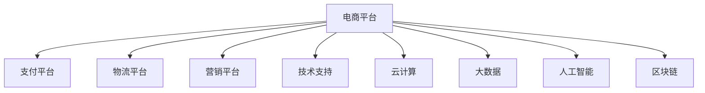

                 

# 电商生态系统建设的重要性

## 1. 背景介绍

在数字化时代，电商已成为推动经济增长、促进产业升级的重要力量。随着消费者购物习惯的变迁，以及数字化技术的发展，电商行业正在经历从传统电商向智能电商的全面转型。电商生态系统作为支撑这一转型的基础设施，其建设的重要性不言而喻。

### 1.1 电商生态系统的定义

电商生态系统（E-commerce Ecosystem），是指以电商平台为核心，涵盖供应链、物流、金融、营销、技术等各方面，形成的一体化、互惠共生的商业生态。电商生态系统不仅包括了各电商参与方，还涵盖了各类技术提供商、物流服务商、金融公司等。一个完善的电商生态系统，能够实现从商品信息获取、交易支付、物流配送、售后服务的全链路无缝对接，为用户提供一站式购物体验。

### 1.2 电商生态系统的组成

电商生态系统的构建需要多个关键组件的协同工作。主要包括：

- **电商平台**：如淘宝、京东、拼多多等，是生态系统的核心，提供交易平台。
- **支付平台**：如支付宝、微信支付等，完成交易资金的清算与结算。
- **物流平台**：如顺丰、菜鸟网络等，负责商品的配送。
- **营销平台**：如百度、抖音等，通过大数据和算法，提供精准营销服务。
- **技术支持**：如云计算、大数据、人工智能等技术，提供底层技术支持。

## 2. 核心概念与联系

### 2.1 核心概念概述

电商生态系统的构建涉及多个领域的技术和商业理念，本文将重点介绍以下核心概念：

- **云计算**：提供电商系统的底层基础设施，如计算、存储、网络等。
- **大数据**：用于用户行为分析、市场趋势预测等，为电商决策提供支持。
- **人工智能**：在推荐系统、图像识别、自然语言处理等方面提升电商效率和用户体验。
- **区块链**：保障电商交易的透明性和安全性，降低欺诈风险。
- **物流系统**：包括仓储、配送、库存管理等，确保商品的及时送达。

这些核心概念通过协同工作，共同构建起电商生态系统，提供高效的电商解决方案。

### 2.2 核心概念间的关系

电商生态系统的构建，涉及多个核心概念之间的有机联系。我们可以通过以下Mermaid流程图来展示这些概念之间的关系：



这个流程图展示了电商平台与其他关键组件的连接关系。

## 3. 核心算法原理 & 具体操作步骤

### 3.1 算法原理概述

构建电商生态系统，需要解决多个技术难题，如数据高效存储、实时计算、用户行为分析等。本文将以数据高效存储和实时计算为例，介绍核心算法原理。

### 3.2 算法步骤详解

#### 3.2.1 数据高效存储

电商系统中，用户行为数据、商品信息、订单信息等数据量巨大，需要高效存储以支持快速访问和查询。

**步骤1：选择存储技术**

- 关系型数据库：如MySQL、Oracle等，适用于结构化数据，查询效率高。
- 非关系型数据库：如MongoDB、Redis等，适用于大规模无结构数据，扩展性好。
- 分布式文件系统：如HDFS、Hadoop等，适用于大规模数据存储，高可靠性。

**步骤2：数据分布式存储**

- 采用分片技术，将数据分散存储在多个节点上，提高数据读取效率。
- 使用一致性哈希算法，保证数据分布的均衡性和扩展性。

**步骤3：数据备份与恢复**

- 采用多副本机制，保证数据的高可用性。
- 定期进行数据备份，防止数据丢失。

#### 3.2.2 实时计算

电商系统中，用户行为数据实时更新，需要实时计算来提供决策支持。

**步骤1：选择合适的计算框架**

- Apache Spark：分布式计算框架，支持大规模数据处理。
- Apache Flink：流式计算框架，适用于实时数据处理。
- Apache Storm：分布式实时计算系统，高吞吐量。

**步骤2：数据流处理**

- 采用流式数据处理技术，实时处理电商数据。
- 使用消息队列（如Kafka），异步处理电商事件，提高系统的吞吐量。

**步骤3：实时计算优化**

- 优化计算算法，减少计算时间。
- 使用缓存技术，减少重复计算。

### 3.3 算法优缺点

电商生态系统的建设，涉及多方面的技术，以下是核心算法的主要优缺点：

#### 优点

1. **提升效率**：通过分布式计算和存储，能够快速处理大量数据，提升系统效率。
2. **保障数据安全**：采用加密、备份等技术，确保数据的安全性和可靠性。
3. **提高用户体验**：实时计算和个性化推荐，提升用户购物体验。

#### 缺点

1. **技术复杂性高**：涉及多种技术，需要综合考虑各种因素。
2. **成本高**：需要投入大量的硬件资源和技术人力。
3. **数据隐私问题**：电商系统中涉及大量用户隐私数据，需要严格控制和保护。

### 3.4 算法应用领域

电商生态系统的建设，主要应用于以下几个领域：

- **电商平台**：构建交易平台，支持在线购物。
- **支付平台**：提供安全的支付服务。
- **物流系统**：优化物流配送，提升配送效率。
- **营销系统**：通过大数据和算法，实现精准营销。
- **技术支持**：提供云计算、大数据、人工智能等底层技术支持。

## 4. 数学模型和公式 & 详细讲解

### 4.1 数学模型构建

电商生态系统的构建涉及多个领域的数学模型，以下以电商平台的数据存储和实时计算为例进行讲解。

#### 数据存储模型

- 采用关系型数据库的存储模型，可以通过SQL查询语句进行操作。例如，MySQL的InnoDB引擎支持事务，能够保证数据的完整性和一致性。
- 采用非关系型数据库的存储模型，可以通过文档、键值对等方式进行操作。例如，MongoDB支持灵活的数据结构，适合存储无结构化数据。

#### 实时计算模型

- 采用流式计算框架的模型，通过流式数据处理技术进行实时计算。例如，Apache Flink采用数据流模型，支持复杂窗口、状态管理等功能。

### 4.2 公式推导过程

#### 数据存储公式

- 关系型数据库存储公式：$Data\_Storage = f(Schema, Data\_type, Index)$
- 非关系型数据库存储公式：$Data\_Storage = f(Document, Key, Value)$

#### 实时计算公式

- 流式计算公式：$Real-time\_Calculation = f(Data\_stream, Window, Aggregation)$

### 4.3 案例分析与讲解

#### 案例分析：电商平台的数据存储

- **场景**：电商平台存储海量用户行为数据、商品信息、订单信息等。
- **数据类型**：关系型数据库存储用户行为数据和订单信息，非关系型数据库存储商品信息。
- **存储模型**：采用关系型数据库的存储模型，支持事务和SQL查询。

#### 案例讲解：电商平台的实时计算

- **场景**：电商平台实时计算用户行为数据，生成个性化推荐。
- **计算框架**：Apache Spark进行离线计算，Apache Flink进行流式计算。
- **计算模型**：采用流式数据处理技术，实时计算用户行为数据，生成个性化推荐。

## 5. 项目实践：代码实例和详细解释说明

### 5.1 开发环境搭建

电商生态系统的构建涉及多种技术，开发环境搭建需要以下步骤：

1. **安装开发环境**

- 操作系统：Linux，推荐使用Ubuntu。
- 开发工具：IDE（如IntelliJ IDEA）、版本控制（如Git）、编译器（如gcc）等。
- 数据库：MySQL、MongoDB、Redis等。
- 实时计算：Apache Spark、Apache Flink等。

2. **配置环境**

- 安装所需的依赖包。
- 配置数据库连接信息。
- 配置实时计算框架的参数。

### 5.2 源代码详细实现

#### 电商平台数据存储实现

**实现代码**

```python
# 使用MySQL数据库存储用户行为数据和订单信息
import mysql.connector

# 连接MySQL数据库
conn = mysql.connector.connect(
    host="localhost",
    user="root",
    password="password",
    database="ecommerce"
)

# 创建数据表
query = """
CREATE TABLE user_behavior (
    user_id INT,
    timestamp TIMESTAMP,
    action VARCHAR(255)
)
"""

conn.cursor().execute(query)

# 插入数据
data = [
    (1, '2021-01-01 10:00:00', '浏览商品'),
    (1, '2021-01-01 12:00:00', '加入购物车'),
    (2, '2021-01-01 14:00:00', '下单购买')
]

conn.cursor().executemany("INSERT INTO user_behavior VALUES (%s, %s, %s)", data)
```

#### 电商平台实时计算实现

**实现代码**

```python
# 使用Apache Flink进行流式计算
from pyflink.datastream import StreamExecutionEnvironment
from pyflink.table import StreamTableEnvironment, EnvironmentSettings

# 连接Flink环境
env = StreamExecutionEnvironment.get_execution_environment()
settings = EnvironmentSettings.new_instance().in_streaming_mode().use_blink_planner().build()
t_env = StreamTableEnvironment.create(env, settings)

# 创建数据表
t_env.create_temporary_table(
    "user_behavior",
    ["user_id INT", "timestamp TIMESTAMP", "action VARCHAR(255)"]
)

# 查询实时数据
t_env.sql_query("SELECT user_id, timestamp, action FROM user_behavior")

# 启动Flink环境
env.execute("E-commerce Ecosystem - Real-time Calculation")
```

### 5.3 代码解读与分析

#### 电商平台数据存储代码解读

- **数据库连接**：使用mysql.connector连接到MySQL数据库。
- **创建数据表**：使用SQL语句创建用户行为数据表。
- **插入数据**：使用executemany方法批量插入数据。

#### 电商平台实时计算代码解读

- **连接Flink环境**：使用StreamExecutionEnvironment和StreamTableEnvironment创建Flink环境。
- **创建数据表**：使用create_temporary_table方法创建用户行为数据表。
- **查询实时数据**：使用SQL语句查询实时数据。
- **启动Flink环境**：使用execute方法启动Flink环境。

### 5.4 运行结果展示

- **数据存储结果**：成功创建用户行为数据表，并插入数据。
- **实时计算结果**：实时查询用户行为数据，显示最新数据。

## 6. 实际应用场景

### 6.1 电商平台推荐系统

电商平台的推荐系统是电商生态系统的核心应用之一。通过实时计算用户行为数据，生成个性化推荐，提升用户购物体验。

**应用场景**：电商平台推荐系统通过分析用户的历史行为数据，生成个性化推荐。

**技术实现**：
- 使用Apache Spark进行离线计算，生成用户行为特征。
- 使用Apache Flink进行流式计算，实时更新推荐模型。
- 使用机器学习算法，生成个性化推荐。

### 6.2 电商平台库存管理系统

库存管理是电商系统的另一重要应用。通过实时计算库存数据，优化库存管理，提升供应链效率。

**应用场景**：电商平台库存管理系统通过实时计算库存数据，优化库存管理。

**技术实现**：
- 使用Apache Kafka实时采集订单数据。
- 使用Apache Spark进行离线计算，生成库存数据。
- 使用Redis进行库存数据的实时存储和查询。

### 6.3 电商平台用户行为分析

电商平台上，用户行为分析是重要的商业决策支持。通过实时计算用户行为数据，提供决策支持。

**应用场景**：电商平台用户行为分析通过实时计算用户行为数据，提供决策支持。

**技术实现**：
- 使用Apache Spark进行离线计算，生成用户行为数据。
- 使用Apache Flink进行流式计算，实时更新用户行为数据。
- 使用数据可视化工具，展示用户行为数据。

## 7. 工具和资源推荐

### 7.1 学习资源推荐

电商生态系统的建设涉及多个领域的技术，以下推荐一些优质的学习资源：

1. **云计算**：
   - AWS官方文档：提供了详细的AWS云服务介绍和使用方法。
   - Google Cloud Platform文档：提供了Google云服务的使用方法和案例。
   - Microsoft Azure文档：提供了Azure云服务的使用方法和案例。

2. **大数据**：
   - Hadoop官方文档：提供了Hadoop大数据平台的使用方法和案例。
   - Apache Spark官方文档：提供了Spark大数据处理框架的使用方法和案例。
   - Apache Hive官方文档：提供了Hive数据仓库的使用方法和案例。

3. **人工智能**：
   - TensorFlow官方文档：提供了TensorFlow深度学习框架的使用方法和案例。
   - PyTorch官方文档：提供了PyTorch深度学习框架的使用方法和案例。
   - Keras官方文档：提供了Keras深度学习框架的使用方法和案例。

### 7.2 开发工具推荐

电商生态系统的构建涉及多种技术，以下推荐一些常用的开发工具：

1. **IDE**：
   - IntelliJ IDEA：支持多种编程语言，提供丰富的插件和工具。
   - Eclipse：支持多种编程语言，提供丰富的插件和工具。
   - VSCode：支持多种编程语言，提供丰富的插件和工具。

2. **数据库**：
   - MySQL：开源的关系型数据库，适用于中小型应用。
   - MongoDB：开源的文档型数据库，适用于大规模无结构化数据。
   - Redis：开源的键值数据库，适用于高并发读写操作。

3. **实时计算**：
   - Apache Spark：分布式计算框架，支持大规模数据处理。
   - Apache Flink：流式计算框架，适用于实时数据处理。
   - Apache Storm：分布式实时计算系统，高吞吐量。

### 7.3 相关论文推荐

电商生态系统的构建涉及多个领域的论文，以下推荐一些经典论文：

1. **云计算**：
   - "A Survey on Cloud Computing Technologies and Cloud Computing Services" by Anu Rohatgi.
   - "Cloud Computing: Concepts, Technology, and Architecture" by Rajkumar Buyya.

2. **大数据**：
   - "Big Data: Concepts, Technology, and Architecture" by Vinod K. Malhotra.
   - "Hadoop: The Definitive Guide" by Tom White.

3. **人工智能**：
   - "Deep Learning" by Ian Goodfellow, Yoshua Bengio, and Aaron Courville.
   - "Pattern Recognition and Machine Learning" by Christopher Bishop.

## 8. 总结：未来发展趋势与挑战

### 8.1 研究成果总结

电商生态系统的构建是一项复杂的系统工程，涉及多个领域的先进技术。以下是对目前研究成果的总结：

- **云计算**：通过分布式计算和存储，提高了系统的效率和可靠性。
- **大数据**：通过实时计算和数据挖掘，提升了电商决策的准确性和实时性。
- **人工智能**：通过个性化推荐和自然语言处理，提升了用户体验和商业价值。

### 8.2 未来发展趋势

电商生态系统的未来发展趋势主要包括以下几个方面：

1. **智能化**：通过人工智能技术，实现个性化推荐和智能客服。
2. **一体化**：实现电商、物流、金融等各环节的无缝对接。
3. **安全性**：采用区块链技术，保障交易的透明性和安全性。
4. **实时性**：通过实时计算和流式处理，提升系统响应速度和实时性。
5. **可持续发展**：采用节能减排技术，实现绿色电商。

### 8.3 面临的挑战

电商生态系统的建设过程中，还面临一些挑战：

1. **技术复杂性**：涉及多个领域的先进技术，需要综合考虑各种因素。
2. **成本高**：需要投入大量的硬件资源和技术人力。
3. **数据隐私**：电商系统中涉及大量用户隐私数据，需要严格控制和保护。
4. **实时性要求高**：实时计算和数据处理对系统的实时性要求很高。
5. **系统稳定性**：电商系统的稳定性需要得到充分保障，防止系统崩溃。

### 8.4 研究展望

电商生态系统的未来研究展望主要包括以下几个方向：

1. **智能化提升**：通过更多的智能化技术，提升电商系统的自动化水平。
2. **集成优化**：实现电商、物流、金融等各环节的深度集成。
3. **数据隐私保护**：采用更严格的数据隐私保护措施，保障用户隐私。
4. **系统优化**：通过优化系统架构和算法，提升系统效率和稳定性。
5. **可持续发展**：采用更多的绿色技术和节能措施，实现可持续发展。

## 9. 附录：常见问题与解答

### 9.1 常见问题

**Q1：电商生态系统中，如何保障数据隐私？**

A: 电商系统中，保障数据隐私是关键问题。可以采用以下措施：
- 数据加密：对敏感数据进行加密处理，防止数据泄露。
- 访问控制：采用权限管理机制，严格控制数据访问权限。
- 匿名化处理：对数据进行匿名化处理，防止数据泄露。
- 安全审计：定期进行安全审计，防止数据泄露。

**Q2：电商生态系统中，如何提高系统稳定性？**

A: 电商系统的稳定性需要得到充分保障，可以采用以下措施：
- 高可用性设计：采用冗余设计和备份机制，保证系统的可靠性。
- 监控告警：实时监控系统状态，设置异常告警阈值，及时发现问题。
- 自动化恢复：采用自动化的故障恢复机制，减少系统停机时间。
- 负载均衡：采用负载均衡技术，防止系统过载。

**Q3：电商生态系统中，如何选择适合的云计算平台？**

A: 选择适合的云计算平台，需要考虑以下因素：
- 数据量和存储需求：根据数据量和存储需求选择合适的平台。
- 计算需求：根据计算需求选择合适的平台。
- 地理位置：根据地理位置选择合适的平台。
- 安全性需求：根据安全性需求选择合适的平台。

**Q4：电商生态系统中，如何实现实时计算？**

A: 实现实时计算，需要采用以下技术：
- 流式计算框架：采用Apache Flink、Apache Kafka等流式计算框架，处理实时数据。
- 分布式存储：采用分布式存储系统，如HDFS、Hadoop等，支持大规模数据存储。
- 实时数据采集：采用实时数据采集工具，如Flume、Kafka等，实时采集数据。

---

作者：禅与计算机程序设计艺术 / Zen and the Art of Computer Programming

