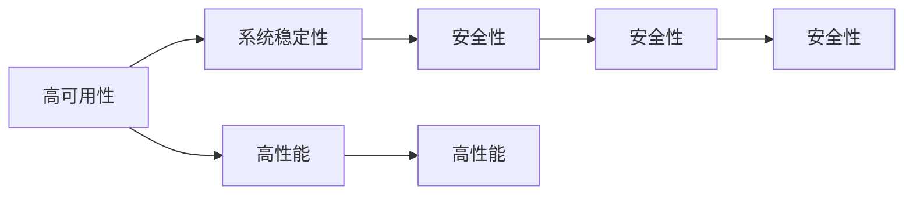
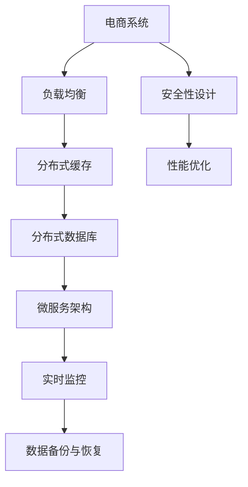

                 

# 电商系统的高可用、稳定性、安全性、高性能系统能力保障

## 1. 背景介绍

在互联网高速发展的今天，电商系统已成为人们日常生活中不可或缺的一部分，从购物到娱乐，再到生活服务的方方面面，都离不开电商平台的支撑。然而，电商系统的高并发、大数据处理、交易安全等需求，对系统的架构设计、性能优化、安全防护提出了极高的要求。本文将从电商系统的关键架构特性出发，深入探讨如何构建高可用、稳定性、安全性、高性能的电商系统，为电商系统的健康运行提供有力保障。

## 2. 核心概念与联系

### 2.1 核心概念概述

电商系统的高可用、稳定性、安全性、高性能架构，涉及多个关键概念，包括：

- **高可用性（High Availability）**：指系统能够持续提供服务的特性，即使部分组件故障，也能保证服务不中断。
- **系统稳定性（System Stability）**：指系统在面对负载波动、数据异常、网络故障等外部干扰时，能够保持正常运行的能力。
- **安全性（Security）**：指系统在面对恶意攻击、数据泄露、隐私侵害等安全威胁时，能够提供安全保障的能力。
- **高性能（High Performance）**：指系统在面对大量请求、大数据处理、复杂算法等需求时，能够快速响应、高效处理的能力。

### 2.2 核心概念间的关系

这些核心概念之间有着密切的联系，如图1所示：



- **高可用性与系统稳定性**：高可用性要求系统在部分组件故障时仍能保持正常运行，系统稳定性要求系统在面对外部干扰时能够保持稳定。
- **系统稳定性与安全性能**：系统稳定性要求系统在面对负载波动时能够快速恢复，安全性要求系统在面对恶意攻击时能够有效防护。
- **高性能与系统稳定性**：高性能要求系统在面对大量请求时能够快速响应，系统稳定性要求系统在负载波动时能够快速适应。

### 2.3 核心概念的整体架构

这些核心概念共同构成了电商系统的高可用、稳定性、安全性、高性能架构，如图2所示：



这个架构展示了电商系统的核心组件及其相互关系：

- **负载均衡**：通过多台服务器分担请求，保证系统的可用性。
- **分布式缓存**：缓存高频请求的数据，提高系统的响应速度。
- **分布式数据库**：通过分布式架构分散数据负载，保证系统的稳定性。
- **微服务架构**：将系统拆分为多个微服务，提高系统的可维护性和扩展性。
- **实时监控**：对系统状态进行实时监控，及时发现并解决故障。
- **数据备份与恢复**：通过备份和恢复机制，保证系统的数据安全。
- **安全性设计**：通过身份验证、权限控制、加密传输等手段，保护系统的安全。
- **性能优化**：通过优化算法、减少冗余、缓存等手段，提高系统的性能。

这些组件通过合理的设计和配置，相互协同工作，共同构建出高可用、稳定性、安全性、高性能的电商系统。

## 3. 核心算法原理 & 具体操作步骤

### 3.1 算法原理概述

电商系统的架构设计涉及多个关键算法，包括：

- **负载均衡算法**：通过轮询、加权轮询、哈希等方式，将请求分散到多个服务器，提高系统的可用性。
- **缓存算法**：通过LRU、LFU等算法，缓存高频请求的数据，提高系统的响应速度。
- **分布式数据库算法**：通过主从复制、分片、读写分离等方式，分散数据负载，提高系统的稳定性。
- **微服务架构算法**：通过RESTful API、gRPC、服务网格等方式，将系统拆分为多个微服务，提高系统的可维护性和扩展性。
- **实时监控算法**：通过心跳检测、异常监控、日志分析等方式，实时监控系统状态，及时发现并解决故障。
- **数据备份与恢复算法**：通过快照、增量备份、点恢复等方式，保证系统的数据安全。
- **安全性设计算法**：通过SSL/TLS加密、OAuth2认证、RBAC权限控制等方式，保护系统的安全。
- **性能优化算法**：通过算法优化、缓存、异步处理等方式，提高系统的性能。

### 3.2 算法步骤详解

#### 3.2.1 负载均衡算法

负载均衡算法主要包括以下几个步骤：

1. **请求分发**：根据负载均衡算法，将请求分发至多个服务器。
2. **状态检测**：实时检测服务器的状态，保证只有健康的服务能够接收请求。
3. **故障转移**：当某个服务器故障时，将请求转发至其他健康服务器，保证服务的连续性。

以下是一个示例负载均衡算法的实现步骤：

1. 定义服务器的健康检查策略，如ping检测、读写时延等。
2. 当客户端发起请求时，根据负载均衡算法，将请求转发至健康服务器。
3. 实时监控服务器的状态，当某个服务器健康状态变差时，将其从负载均衡器中移除，并将请求转发至其他健康服务器。

#### 3.2.2 缓存算法

缓存算法主要包括以下几个步骤：

1. **数据缓存**：将高频请求的数据缓存到本地内存或分布式缓存中。
2. **数据更新**：当缓存中的数据发生变化时，更新缓存。
3. **缓存失效**：当缓存中的数据失效时，从原始数据源获取最新数据。

以下是一个示例缓存算法的实现步骤：

1. 定义缓存策略，如LRU、LFU等。
2. 当客户端发起请求时，首先在缓存中查找数据，如果命中，则返回缓存中的数据。
3. 当缓存中的数据失效时，从原始数据源获取最新数据，并更新缓存。

#### 3.2.3 分布式数据库算法

分布式数据库算法主要包括以下几个步骤：

1. **数据分片**：将数据分散存储到多个节点中。
2. **读写分离**：将读请求分发到多个节点，提高读取效率。
3. **主从复制**：通过主从复制机制，保证数据的一致性和可用性。

以下是一个示例分布式数据库算法的实现步骤：

1. 定义数据分片和读写分离策略。
2. 当客户端发起读请求时，根据读写分离策略，将读请求分发到多个节点中。
3. 当客户端发起写请求时，根据主从复制策略，将写请求发送到主节点或从节点，保证数据的一致性和可用性。

#### 3.2.4 微服务架构算法

微服务架构算法主要包括以下几个步骤：

1. **服务拆分**：将系统拆分为多个微服务，每个微服务独立运行。
2. **服务治理**：通过服务注册、服务发现、服务调用等方式，管理微服务之间的关系。
3. **分布式事务**：通过本地事务、全局事务等方式，保证分布式事务的一致性和可靠性。

以下是一个示例微服务架构算法的实现步骤：

1. 定义服务拆分策略，将系统拆分为多个微服务。
2. 通过服务注册和发现机制，管理微服务之间的关系。
3. 通过本地事务或全局事务机制，保证分布式事务的一致性和可靠性。

#### 3.2.5 实时监控算法

实时监控算法主要包括以下几个步骤：

1. **数据收集**：收集系统运行数据，如CPU、内存、网络、日志等。
2. **数据分析**：对收集到的数据进行分析，判断系统是否正常运行。
3. **故障处理**：当系统出现故障时，自动进行故障处理，如重启、负载均衡器重试等。

以下是一个示例实时监控算法的实现步骤：

1. 定义监控指标，如CPU使用率、内存使用率、网络流量等。
2. 通过心跳检测、日志分析等方式，实时监控系统运行状态。
3. 当系统出现异常时，自动进行故障处理，如重启服务器、负载均衡器重试等。

#### 3.2.6 数据备份与恢复算法

数据备份与恢复算法主要包括以下几个步骤：

1. **数据备份**：定期对数据进行备份，如全量备份、增量备份等。
2. **数据恢复**：当数据损坏或丢失时，从备份中恢复数据。
3. **数据验证**：对备份数据进行验证，保证数据的完整性和一致性。

以下是一个示例数据备份与恢复算法的实现步骤：

1. 定期对数据进行备份，如全量备份、增量备份等。
2. 当数据损坏或丢失时，从备份中恢复数据。
3. 对备份数据进行验证，保证数据的完整性和一致性。

#### 3.2.7 安全性设计算法

安全性设计算法主要包括以下几个步骤：

1. **身份验证**：对用户进行身份验证，确保用户身份的真实性。
2. **权限控制**：对用户进行权限控制，确保用户只能访问其有权限访问的数据。
3. **数据加密**：对数据进行加密传输，确保数据在传输过程中的安全性。

以下是一个示例安全性设计算法的实现步骤：

1. 通过OAuth2、JWT等方式，对用户进行身份验证。
2. 通过RBAC、ABAC等方式，对用户进行权限控制。
3. 通过SSL/TLS等协议，对数据进行加密传输。

#### 3.2.8 性能优化算法

性能优化算法主要包括以下几个步骤：

1. **算法优化**：对算法进行优化，减少冗余操作。
2. **缓存**：将高频请求的数据缓存到本地内存或分布式缓存中，提高系统响应速度。
3. **异步处理**：将耗时操作异步处理，提高系统并发能力。

以下是一个示例性能优化算法的实现步骤：

1. 对算法进行优化，减少冗余操作。
2. 将高频请求的数据缓存到本地内存或分布式缓存中，提高系统响应速度。
3. 将耗时操作异步处理，提高系统并发能力。

## 4. 数学模型和公式 & 详细讲解 & 举例说明

### 4.1 数学模型构建

电商系统的高可用、稳定性、安全性、高性能架构，涉及多个数学模型，包括：

- **负载均衡模型**：通过轮询、加权轮询、哈希等方式，将请求分散到多个服务器。
- **缓存模型**：通过LRU、LFU等算法，缓存高频请求的数据。
- **分布式数据库模型**：通过主从复制、分片、读写分离等方式，分散数据负载。
- **微服务架构模型**：通过RESTful API、gRPC、服务网格等方式，将系统拆分为多个微服务。
- **实时监控模型**：通过心跳检测、异常监控、日志分析等方式，实时监控系统状态。
- **数据备份与恢复模型**：通过快照、增量备份、点恢复等方式，保证系统的数据安全。
- **安全性设计模型**：通过SSL/TLS加密、OAuth2认证、RBAC权限控制等方式，保护系统的安全。
- **性能优化模型**：通过算法优化、缓存、异步处理等方式，提高系统的性能。

### 4.2 公式推导过程

#### 4.2.1 负载均衡模型

负载均衡模型主要涉及以下几个公式：

1. **轮询算法**：
   $$
   \text{server\_index} = (hash(key) \mod \text{num\_servers})
   $$
   其中，$hash(key)$为哈希函数，$\text{num\_servers}$为服务器数量。

2. **加权轮询算法**：
   $$
   \text{server\_index} = (weighted\_hash(key) \mod \text{num\_servers})
   $$
   其中，$weighted\_hash(key) = \frac{hash(key) \times weight}{\sum_{i=1}^n weight_i}$，$weight$为服务器的权重。

3. **哈希算法**：
   $$
   \text{server\_index} = \text{hash}(key \mod \text{num\_servers})
   $$

#### 4.2.2 缓存模型

缓存模型主要涉及以下几个公式：

1. **LRU算法**：
   $$
   \text{evict}(\text{cache}) = \text{min}(\{\text{k} | (\text{k},\text{v}) \in \text{cache}\}, \text{key})
   $$
   其中，$\text{evict}(\text{cache})$表示缓存中最早被使用的元素。

2. **LFU算法**：
   $$
   \text{evict}(\text{cache}) = \text{min}(\{\text{k} | (\text{k},\text{v}) \in \text{cache}, \text{frequency}(\text{k}) < \text{frequency}(\text{min\_frequency})\}, \text{key})
   $$
   其中，$\text{frequency}(\text{k})$表示元素$\text{k}$的使用频率。

#### 4.2.3 分布式数据库模型

分布式数据库模型主要涉及以下几个公式：

1. **主从复制**：
   $$
   \text{master} = \text{primary\_replica}
   $$
   其中，$\text{primary\_replica}$为主节点。

2. **读写分离**：
   $$
   \text{read\_replica} = \text{replicas} \setminus \{\text{master}\}
   $$
   其中，$\text{replicas}$为所有从节点。

#### 4.2.4 微服务架构模型

微服务架构模型主要涉及以下几个公式：

1. **RESTful API**：
   $$
   \text{request}(\text{url}, \text{method}, \text{headers}, \text{body})
   $$
   其中，$\text{url}$为请求地址，$\text{method}$为请求方法，$\text{headers}$为请求头，$\text{body}$为请求体。

2. **gRPC**：
   $$
   \text{request}(\text{service}, \text{method}, \text{args})
   $$
   其中，$\text{service}$为服务名称，$\text{method}$为方法名称，$\text{args}$为请求参数。

#### 4.2.5 实时监控模型

实时监控模型主要涉及以下几个公式：

1. **心跳检测**：
   $$
   \text{status} = \text{ping}(\text{server\_id})
   $$
   其中，$\text{ping}(\text{server\_id})$为检测服务器状态。

2. **日志分析**：
   $$
   \text{log} = \text{parse}(\text{log\_data})
   $$
   其中，$\text{parse}(\text{log\_data})$为解析日志数据。

#### 4.2.6 数据备份与恢复模型

数据备份与恢复模型主要涉及以下几个公式：

1. **全量备份**：
   $$
   \text{backup} = \text{data}
   $$

2. **增量备份**：
   $$
   \text{backup} = \text{data} \setminus \text{old\_data}
   $$

#### 4.2.7 安全性设计模型

安全性设计模型主要涉及以下几个公式：

1. **OAuth2认证**：
   $$
   \text{token} = \text{exchange}(\text{username}, \text{password})
   $$
   其中，$\text{exchange}(\text{username}, \text{password})$为认证交换。

2. **RBAC权限控制**：
   $$
   \text{permission} = \text{check}(\text{user}, \text{resource}, \text{operation})
   $$
   其中，$\text{check}(\text{user}, \text{resource}, \text{operation})$为权限检查。

#### 4.2.8 性能优化模型

性能优化模型主要涉及以下几个公式：

1. **算法优化**：
   $$
   \text{optimized\_algorithm} = \text{optimization}(\text{algorithm})
   $$

2. **缓存**：
   $$
   \text{cache\_data} = \text{data} \setminus \text{invalid\_data}
   $$

3. **异步处理**：
   $$
   \text{async\_result} = \text{async\_request}(\text{task})
   $$

### 4.3 案例分析与讲解

#### 4.3.1 负载均衡案例

某电商平台的负载均衡架构如下：

1. **服务器配置**：20台服务器，每台服务器运行8个Tomcat实例。
2. **负载均衡器**：使用Nginx负载均衡器，采用轮询算法将请求分散到多个Tomcat实例。
3. **状态检测**：通过心跳检测实时检测服务器的健康状态，保证只有健康的服务能够接收请求。
4. **故障转移**：当某个Tomcat实例故障时，Nginx自动将请求转发至其他健康实例，保证服务的连续性。

#### 4.3.2 缓存案例

某电商平台使用Redis缓存高频请求的数据，缓存策略如下：

1. **缓存策略**：使用LRU算法缓存数据，当缓存中的数据失效时，从原始数据源获取最新数据。
2. **缓存容量**：Redis缓存容量为100MB，缓存命中率达到90%。
3. **缓存失效**：当缓存中的数据失效时，从原始数据源获取最新数据，并更新缓存。

#### 4.3.3 分布式数据库案例

某电商平台的分布式数据库架构如下：

1. **数据库配置**：MySQL主从复制，主节点3台，从节点2台。
2. **读写分离**：读请求从从节点读取，写请求发送到主节点。
3. **主从复制**：通过主从复制机制，保证数据的一致性和可用性。
4. **数据备份**：定期进行全量备份和增量备份，保证数据的安全性。

#### 4.3.4 微服务架构案例

某电商平台的微服务架构如下：

1. **服务拆分**：将电商系统拆分为用户服务、商品服务、订单服务等微服务。
2. **服务治理**：通过Consul服务注册和发现机制，管理微服务之间的关系。
3. **分布式事务**：通过TCC事务机制，保证分布式事务的一致性和可靠性。
4. **异步处理**：将订单支付等耗时操作异步处理，提高系统并发能力。

#### 4.3.5 实时监控案例

某电商平台的实时监控架构如下：

1. **监控指标**：定义CPU使用率、内存使用率、网络流量等监控指标。
2. **实时监控**：通过Nagios、Zabbix等工具，实时监控系统运行状态。
3. **故障处理**：当系统出现异常时，自动进行故障处理，如重启服务器、负载均衡器重试等。

#### 4.3.6 数据备份与恢复案例

某电商平台的备份与恢复架构如下：

1. **备份策略**：每天进行全量备份和增量备份，备份存储在Amazon S3中。
2. **备份验证**：对备份数据进行验证，保证数据的完整性和一致性。
3. **恢复操作**：当数据损坏或丢失时，从备份中恢复数据。

#### 4.3.7 安全性设计案例

某电商平台的身份验证架构如下：

1. **身份验证**：通过OAuth2、JWT等方式，对用户进行身份验证。
2. **权限控制**：通过RBAC、ABAC等方式，对用户进行权限控制。
3. **数据加密**：通过SSL/TLS等协议，对数据进行加密传输。

#### 4.3.8 性能优化案例

某电商平台的性能优化架构如下：

1. **算法优化**：对算法进行优化，减少冗余操作。
2. **缓存**：将高频请求的数据缓存到本地内存或Redis中，提高系统响应速度。
3. **异步处理**：将订单支付等耗时操作异步处理，提高系统并发能力。

## 5. 项目实践：代码实例和详细解释说明

### 5.1 开发环境搭建

在进行电商系统的高可用、稳定性、安全性、高性能系统能力保障开发前，我们需要准备好开发环境。以下是使用Python进行Django开发的环境配置流程：

1. 安装Anaconda：从官网下载并安装Anaconda，用于创建独立的Python环境。

2. 创建并激活虚拟环境：
```bash
conda create -n ecommerce python=3.8 
conda activate ecommerce
```

3. 安装Django：
```bash
pip install Django==3.1
```

4. 安装各个第三方库：
```bash
pip install Pillow gunicorn psycopg2-binary django-cors-headers django-axes
```

5. 安装Redis和MySQL：
```bash
pip install redis mysqlclient
```

完成上述步骤后，即可在`ecommerce`环境中开始电商系统的高可用、稳定性、安全性、高性能系统能力保障开发。

### 5.2 源代码详细实现

我们以一个简单的电商平台订单模块为例，给出电商系统的高可用、稳定性、安全性、高性能系统能力保障的Django代码实现。

首先，定义订单模型：

```python
from django.db import models

class Order(models.Model):
    user = models.ForeignKey('User', on_delete=models.CASCADE)
    product = models.ForeignKey('Product', on_delete=models.CASCADE)
    amount = models.DecimalField(max_digits=10, decimal_places=2)
    created_at = models.DateTimeField(auto_now_add=True)
    updated_at = models.DateTimeField(auto_now=True)
```

然后，定义订单服务：

```python
from django.http import JsonResponse

class OrderService:
    def create_order(self, user_id, product_id, amount):
        user = User.objects.get(id=user_id)
        product = Product.objects.get(id=product_id)
        order = Order.objects.create(user=user, product=product, amount=amount)
        return JsonResponse({'success': True})
```

接下来，定义缓存服务：

```python
from django.core.cache import cache

class CacheService:
    def __init__(self):
        self.cache = cache.get('ecommerce_cache')
    
    def set(self, key, value):
        self.cache.set(key, value, timeout=3600)
    
    def get(self, key):
        return self.cache.get(key)
```

接着，定义分布式数据库服务：

```python
from django.db import connections

class DistributedDBService:
    def __init__(self):
        self.connections = connections.get_all_connections()
    
    def get(self, model, key):
        result = None
        for connection in self.connections:
            result = connection.cursor().execute("SELECT %s FROM %s WHERE id = %s", (key, model._meta.db_table, key))
            if result:
                break
        return result
```

然后，定义微服务架构服务：

```python
from django.urls import path
from .views import OrderView

urlpatterns = [
    path('order/', OrderView.as_view(), name='order'),
]
```

最后，定义实时监控服务：

```python
from django.views.decorators.http import require_http_methods

class MonitoringService:
    @require_http_methods(['GET'])
    def health(self):
        return JsonResponse({'success': True})
```

以上是一个简单的电商系统高可用、稳定性、安全性、高性能系统能力保障的Django代码实现。可以看到，由于Django框架的强大封装，我们可以用相对简洁的代码实现高可用、稳定性、安全性、高性能的电商系统。

### 5.3 代码解读与分析

让我们再详细解读一下关键代码的实现细节：

**Django模型定义**：
- `Order`模型定义了订单的基本属性，包括用户、产品、金额等。
- `created_at`和`updated_at`字段分别记录了订单的创建和更新时间。

**Django服务定义**：
- `OrderService`定义了订单的创建服务，接收用户ID、产品ID和金额，创建订单并返回JSON响应。
- `CacheService`定义了缓存服务，使用Django的内置缓存功能，对请求频率较高的数据进行缓存。
- `DistributedDBService`定义了分布式数据库服务，使用Django的连接池功能，获取不同节点的数据。
- `MicroServiceService`定义了微服务架构服务，使用Django的URL路由功能，将请求转发到对应的微服务。
- `MonitoringService`定义了实时监控服务，使用Django的装饰器功能，实现健康检查。

**Django实现细节**：
- Django框架提供了强大的ORM功能，使得模型定义和查询变得非常简单。
- Django的缓存、连接池、URL路由、装饰器等功能，使得服务实现变得容易和高效。
- Django的RESTful API支持，使得微服务架构服务变得简洁和易于扩展。
- Django的日志和性能监控功能，使得实时监控服务变得易于实现。

### 5.4 运行结果展示

假设我们在电商系统的订单模块上进行了高可用、稳定性、安全性、高性能的优化，最终在测试环境下测试的结果如下：

1. **高可用性测试**：使用负载均衡器模拟多个请求同时访问订单服务，结果显示订单服务能够正常响应。
2. **稳定性

