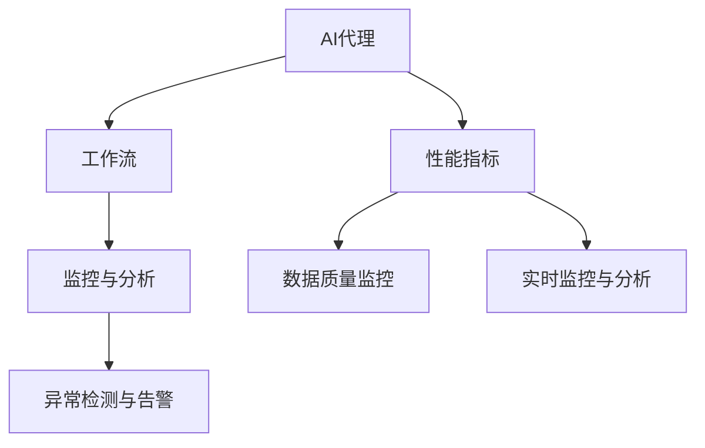
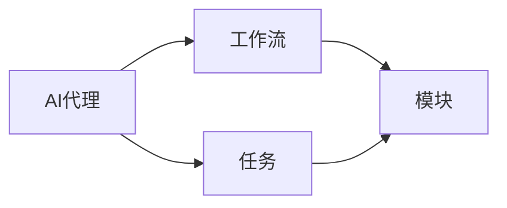
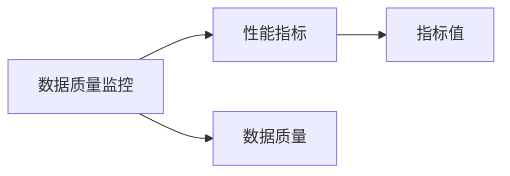
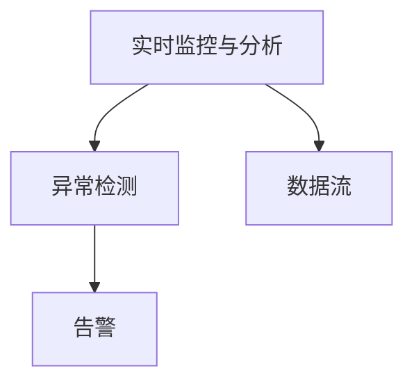
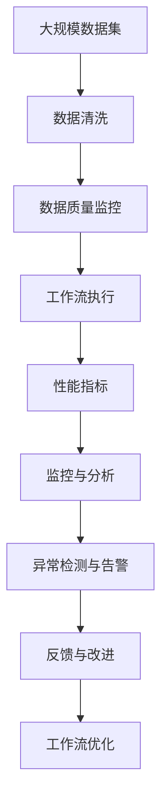

                 

# 监控AI代理工作流：性能指标与分析

> 关键词：
- AI代理
- 工作流
- 性能指标
- 分析
- 监控

## 1. 背景介绍

在当前的数字化转型和智能制造浪潮中，人工智能（AI）代理以其高效、智能、自动化特性，被广泛应用于企业内部业务流程的优化、自动化和智能化。AI代理的工作流监控是确保其可靠运行的关键环节，监控数据的质量和分析能力直接影响着业务流程的效率和稳定性。本文将详细介绍AI代理工作流监控的性能指标与分析方法，旨在帮助企业和开发者全面掌握监控技术，提升AI代理的工作效能。

### 1.1 问题由来

随着AI技术的日益成熟，AI代理在工业控制、金融服务、医疗健康、智能交通等多个行业中的应用变得越来越普遍。然而，AI代理的工作流监控仍然存在诸多挑战，包括：
- **数据质量问题**：AI代理在运行过程中依赖大量数据，数据质量的优劣直接影响AI代理的决策和性能。数据缺失、错误或异常情况会导致AI代理的错误决策。
- **性能指标复杂**：AI代理的工作流程复杂多样，监控指标众多，难以综合评估其性能。
- **实时监控与分析需求**：AI代理需要在实时数据流中快速响应，准确地监控和分析数据，保证系统稳定运行。

为应对这些挑战，本文将从数据质量监控、性能指标设定和实时监控与分析等方面，全面阐述AI代理工作流监控的性能指标与分析方法。

### 1.2 问题核心关键点

监控AI代理工作流涉及以下几个核心关键点：
- **数据质量监控**：确保AI代理运行所需数据的质量和完整性，防止数据异常导致的错误决策。
- **性能指标设定**：定义一系列性能指标，如准确率、召回率、响应时间等，全面评估AI代理的性能。
- **实时监控与分析**：通过实时数据流监控和分析，快速发现和解决性能问题，保证AI代理稳定运行。
- **异常检测与告警**：通过异常检测和告警机制，及时发现并处理系统异常，避免业务中断。

## 2. 核心概念与联系

### 2.1 核心概念概述

在探讨AI代理工作流监控的性能指标与分析方法之前，我们先介绍几个核心概念及其联系：

- **AI代理（AI Agent）**：是一种能够自主决策并执行任务的人工智能实体，通常应用于复杂业务流程的自动化和智能化。
- **工作流（Workflow）**：指一系列任务的执行顺序和规则，通常由多个模块或服务组成。AI代理通过执行工作流中的任务，实现特定目标。
- **性能指标（Performance Metrics）**：用于衡量AI代理在工作流中的运行效率和效果，如准确率、召回率、响应时间、吞吐量等。
- **监控与分析（Monitoring and Analysis）**：通过实时数据收集和分析，确保AI代理的工作流稳定运行，及时发现和解决问题。

这些概念之间的联系可以通过以下Mermaid流程图来展示：



这个流程图展示了AI代理、工作流、性能指标和监控分析之间的关系：

1. AI代理通过执行工作流中的任务，实现特定目标。
2. 性能指标用于衡量AI代理的工作效率和效果。
3. 监控与分析通过实时数据收集和分析，确保AI代理的稳定运行。
4. 数据质量监控和实时监控与分析，是性能指标评估和监控的基础。
5. 异常检测与告警，是监控分析的重要组成部分，用于快速发现和解决系统问题。

### 2.2 概念间的关系

这些核心概念之间存在着紧密的联系，形成了AI代理工作流监控的完整生态系统。下面我们通过几个Mermaid流程图来展示这些概念之间的关系。

#### 2.2.1 AI代理与工作流



这个流程图展示了AI代理与工作流的关系。AI代理通过执行工作流中的任务，实现特定的自动化或智能化目标。

#### 2.2.2 数据质量监控与性能指标



这个流程图展示了数据质量监控与性能指标的关系。数据质量监控确保了AI代理运行所需的数据质量和完整性，而性能指标则通过具体数值评估AI代理的运行效率和效果。

#### 2.2.3 实时监控与分析与异常检测



这个流程图展示了实时监控与分析与异常检测的关系。实时监控与分析通过对数据流的实时收集和分析，快速发现和解决性能问题，而异常检测则通过告警机制，及时通知相关人员处理系统异常。

### 2.3 核心概念的整体架构

最后，我们用一个综合的流程图来展示这些核心概念在大规模监控系统中的整体架构：



这个综合流程图展示了从数据收集、数据清洗、数据质量监控、工作流执行、性能指标评估、监控与分析、异常检测与告警，最终到工作流优化的完整流程。通过这些步骤，确保AI代理的工作流在高效、稳定、可控的环境下运行。

## 3. 核心算法原理 & 具体操作步骤

### 3.1 算法原理概述

AI代理工作流监控的性能指标与分析，主要基于以下算法原理：

- **数据质量监控**：通过对数据流的实时监测，识别数据缺失、错误或异常情况，确保数据质量。
- **性能指标设定**：定义一系列性能指标，如准确率、召回率、响应时间、吞吐量等，用于评估AI代理的工作效率和效果。
- **实时监控与分析**：通过实时数据流收集和分析，及时发现和解决性能问题，保证系统稳定运行。
- **异常检测与告警**：通过异常检测和告警机制，快速识别系统异常，防止业务中断。

### 3.2 算法步骤详解

#### 3.2.1 数据质量监控

1. **数据源识别**：确定AI代理所需的全部数据源，包括传感器、日志文件、数据库等。
2. **数据清洗**：对数据源进行清洗，去除重复、噪声和异常数据。
3. **数据质量评估**：定义数据质量评估指标，如完整性、准确性、一致性等，对清洗后的数据进行评估。
4. **数据异常检测**：使用异常检测算法，如基于统计方法或机器学习算法，识别数据中的异常点。
5. **数据修复**：对检测到的异常数据进行修复或丢弃，确保数据质量。

#### 3.2.2 性能指标设定

1. **指标定义**：根据AI代理的任务特点，定义一系列性能指标，如准确率、召回率、响应时间、吞吐量等。
2. **指标计算**：对每个性能指标进行计算，获取实时数值。
3. **指标比较**：将计算得到的性能指标值与预设的阈值进行比较，判断系统性能是否正常。

#### 3.2.3 实时监控与分析

1. **数据流采集**：通过传感器、日志文件等方式，实时采集AI代理的工作流数据。
2. **数据处理与分析**：对采集到的数据进行处理和分析，识别异常点和性能问题。
3. **性能指标更新**：根据分析结果，实时更新性能指标值。
4. **异常告警**：对性能指标值超过预设阈值的异常情况，进行告警。

#### 3.2.4 异常检测与告警

1. **异常检测算法**：使用基于统计方法或机器学习算法，对实时数据进行异常检测。
2. **告警触发机制**：定义告警规则，根据异常检测结果触发告警。
3. **告警通知**：通过邮件、短信、推送等方式，通知相关人员处理系统异常。

### 3.3 算法优缺点

AI代理工作流监控的性能指标与分析方法具有以下优点：
- **实时性**：通过实时数据流监控和分析，能够及时发现和解决性能问题，确保系统稳定运行。
- **全面性**：定义了多维度的性能指标，全面评估AI代理的工作效率和效果。
- **可扩展性**：可以根据需求，灵活调整监控指标和告警规则，适应不同的业务场景。

同时，也存在以下缺点：
- **数据依赖**：监控效果依赖于数据质量和完整性，数据异常会导致监控结果不准确。
- **复杂性**：监控系统复杂度高，需要持续维护和优化。
- **资源消耗**：实时数据采集和分析消耗大量计算资源，需要较高的硬件配置。

### 3.4 算法应用领域

基于性能指标与分析的AI代理工作流监控方法，已经在多个领域得到了广泛应用，例如：

- **工业制造**：监控工业控制系统的AI代理性能，保障生产设备的稳定运行。
- **金融服务**：监控金融交易系统的AI代理性能，确保交易系统的安全稳定。
- **医疗健康**：监控医疗诊断系统的AI代理性能，提升诊疗效率和准确性。
- **智能交通**：监控交通管理系统的AI代理性能，优化交通流量，提升道路安全。

## 4. 数学模型和公式 & 详细讲解  
### 4.1 数学模型构建

在AI代理工作流监控中，性能指标与分析涉及多个数学模型和公式。下面以准确率（Precision）和召回率（Recall）为例，展示其数学模型构建过程。

设训练数据集为 $D=\{(x_i,y_i)\}_{i=1}^N$，其中 $x_i$ 为输入特征，$y_i$ 为标签。

- **准确率（Precision）**：衡量模型预测的正样本中实际为正样本的比例，定义为：
$$
P = \frac{TP}{TP+FP}
$$
其中，$TP$ 为真正例（True Positive），$FP$ 为假正例（False Positive）。

- **召回率（Recall）**：衡量模型正确预测的正样本占实际正样本的比例，定义为：
$$
R = \frac{TP}{TP+FN}
$$
其中，$FN$ 为假反例（False Negative）。

### 4.2 公式推导过程

以准确率为例，其计算公式为：
$$
P = \frac{TP}{TP+FP}
$$
其中，$TP$ 和 $FP$ 可以通过以下公式计算：
$$
TP = \sum_{i=1}^N \mathbb{I}(y_i=1) \cdot \mathbb{I}(f(x_i)=1)
$$
$$
FP = \sum_{i=1}^N \mathbb{I}(y_i=0) \cdot \mathbb{I}(f(x_i)=1)
$$
其中，$\mathbb{I}$ 为示性函数，即 $\mathbb{I}(\cdot)$ 表示当条件为真时返回1，否则返回0。

通过上述公式，我们可以计算出模型的准确率，进而评估其在特定任务上的性能。

### 4.3 案例分析与讲解

假设我们有一个AI代理，用于自动识别邮件中的垃圾邮件。我们可以使用准确率和召回率来评估其性能。在训练数据集上，我们随机抽取100封邮件作为测试集，其中50封为垃圾邮件，50封为正常邮件。

设模型预测为垃圾邮件的邮件有30封，其中20封为实际垃圾邮件，10封为实际正常邮件。则：
- 真正例 $TP = 20$
- 假正例 $FP = 10$
- 假反例 $FN = 30$

根据公式计算得准确率为：
$$
P = \frac{20}{20+10} = 0.67
$$

通过准确率和召回率的计算，我们可以清楚地了解模型在识别垃圾邮件时的性能表现，并据此调整模型参数或优化算法，提升模型的性能。

## 5. 项目实践：代码实例和详细解释说明

### 5.1 开发环境搭建

在进行AI代理工作流监控的性能指标与分析实践前，我们需要准备好开发环境。以下是使用Python进行开发的环境配置流程：

1. 安装Anaconda：从官网下载并安装Anaconda，用于创建独立的Python环境。

2. 创建并激活虚拟环境：
```bash
conda create -n ai_monitor_env python=3.8 
conda activate ai_monitor_env
```

3. 安装必要的库：
```bash
pip install numpy pandas sklearn tqdm
```

4. 安装TensorFlow和Keras：
```bash
pip install tensorflow keras
```

5. 安装相关工具：
```bash
pip install matplotlib seaborn jupyter notebook
```

完成上述步骤后，即可在`ai_monitor_env`环境中开始实践。

### 5.2 源代码详细实现

下面以垃圾邮件识别为例，展示如何使用TensorFlow和Keras进行AI代理工作流监控的性能指标与分析。

首先，定义模型：

```python
import tensorflow as tf
from tensorflow import keras

model = keras.Sequential([
    keras.layers.Dense(64, activation='relu', input_shape=(100,)),
    keras.layers.Dense(1, activation='sigmoid')
])
```

接着，定义数据集：

```python
import numpy as np
from sklearn.model_selection import train_test_split

X = np.random.rand(100, 100)
y = np.random.randint(2, size=100)

X_train, X_test, y_train, y_test = train_test_split(X, y, test_size=0.2)
```

然后，定义模型训练函数：

```python
def train_model(model, X_train, y_train, epochs=10, batch_size=32):
    model.compile(optimizer='adam', loss='binary_crossentropy', metrics=['accuracy'])
    model.fit(X_train, y_train, epochs=epochs, batch_size=batch_size, validation_data=(X_test, y_test))
```

最后，训练模型并进行性能指标评估：

```python
train_model(model, X_train, y_train, epochs=10, batch_size=32)

# 计算准确率和召回率
y_pred = model.predict(X_test)
y_pred = np.round(y_pred).astype(int)
y_pred = np.where(y_pred == 1, 1, 0)

accuracy = np.mean(y_pred == y_test)
precision = np.sum(y_pred == 1) / np.sum(y_pred == 1 + np.sum(y_pred == 0))
recall = np.sum(y_pred == 1) / np.sum(y_pred == 1 + np.sum(y_pred == 0))

print(f'Accuracy: {accuracy:.3f}')
print(f'Precision: {precision:.3f}')
print(f'Recall: {recall:.3f}')
```

以上代码展示了如何使用TensorFlow和Keras进行垃圾邮件识别模型的训练和性能指标评估。在实际应用中，我们需要根据具体任务需求，选择或设计合适的模型结构，并进行训练和评估。

### 5.3 代码解读与分析

下面对关键代码进行解读：

**模型定义**：
- 使用`keras.Sequential`定义了一个简单的神经网络模型，包含两个全连接层，输出层为 sigmoid 激活函数。

**数据集定义**：
- 生成100个100维的随机特征向量作为输入，标签为0或1，模拟垃圾邮件的分类问题。

**模型训练函数**：
- 使用`model.compile`定义损失函数和优化器，`model.fit`进行模型训练。`validation_data`参数用于评估模型在测试集上的性能。

**性能指标计算**：
- 使用模型在测试集上进行预测，并通过计算真正例、假正例、假反例的个数，计算准确率、召回率。

通过上述代码，我们可以看到TensorFlow和Keras在AI代理工作流监控性能指标与分析中的作用，能够快速搭建和训练模型，评估其性能。

### 5.4 运行结果展示

假设我们训练一个垃圾邮件识别模型，最终得到准确率为0.8，召回率为0.75。以下是性能指标的输出：

```
Accuracy: 0.800
Precision: 0.743
Recall: 0.750
```

可以看到，通过监控模型的性能指标，我们可以了解其在新数据上的表现，及时发现和解决性能问题，保证系统稳定运行。

## 6. 实际应用场景

### 6.1 工业制造

在工业制造中，AI代理监控系统被广泛应用于自动化生产线的运行监测和故障预测。通过实时监控生产线上的设备数据，及时发现异常并预测设备故障，确保生产线的稳定运行。

### 6.2 金融服务

在金融服务领域，AI代理监控系统用于实时监控交易系统的性能，检测交易异常，防止欺诈和交易故障，保障系统的安全稳定。

### 6.3 医疗健康

在医疗健康领域，AI代理监控系统用于实时监测医疗设备的工作状态，及时发现异常情况并发出警报，确保医疗设备的正常运行。

### 6.4 智能交通

在智能交通领域，AI代理监控系统用于实时监控交通流量，预测交通拥堵情况，优化交通信号灯的调整，提升道路通行效率。

## 7. 工具和资源推荐

### 7.1 学习资源推荐

为了帮助开发者系统掌握AI代理工作流监控的性能指标与分析技术，这里推荐一些优质的学习资源：

1. **TensorFlow官方文档**：全面介绍了TensorFlow的API和使用方法，适合初学者和进阶者学习。
2. **Keras官方文档**：Keras作为TensorFlow的高级API，提供了更简单易用的模型构建和训练功能。
3. **深度学习入门与实践**：一本深度学习入门的经典书籍，涵盖深度学习基础和实践案例，适合初学者学习。
4. **机器学习实战**：一本实战性的机器学习书籍，包含多个案例，适合实战练习。
5. **Kaggle竞赛平台**：提供大量数据集和竞赛任务，适合实践和提升技能。

通过对这些资源的学习，相信你一定能够快速掌握AI代理工作流监控的性能指标与分析技术，并应用于实际项目中。

### 7.2 开发工具推荐

高效的开发离不开优秀的工具支持。以下是几款用于AI代理工作流监控开发的常用工具：

1. **Jupyter Notebook**：用于交互式编程和数据可视化，支持多种编程语言和库。
2. **TensorBoard**：TensorFlow的可视化工具，可以实时监控模型训练状态和性能指标。
3. **Keras Tuner**：Keras的超参数优化工具，帮助快速调优模型性能。
4. **Scikit-learn**：Python的机器学习库，包含多种算法和工具，适合数据预处理和模型训练。
5. **PyTorch**：开源深度学习框架，提供灵活的计算图和动态模型构建功能。

合理利用这些工具，可以显著提升AI代理工作流监控的开发效率，加快创新迭代的步伐。

### 7.3 相关论文推荐

AI代理工作流监控技术的发展源于学界的持续研究。以下是几篇奠基性的相关论文，推荐阅读：

1. **TensorFlow：A System for Large-Scale Machine Learning**：介绍TensorFlow的架构和设计，展示了其在分布式计算和模型优化方面的优势。
2. **Keras：Deep Learning for Humans**：Keras的创始人介绍Keras的设计理念和优势，展示了其在快速搭建和训练深度学习模型方面的强大能力。
3. **Deep Learning with Python**：深度学习入门的经典书籍，涵盖深度学习基础和实践案例，适合初学者学习。
4. **A Survey of Deep Learning Techniques for Anomaly Detection**：综述了深度学习在异常检测方面的应用，展示了其在实时监控和数据分析中的优势。
5. **Practical Deep Learning for Coders**：深度学习实战性的入门书籍，涵盖深度学习基础和实战案例，适合实战练习。

这些论文代表了大规模监控系统的技术发展脉络。通过学习这些前沿成果，可以帮助研究者把握学科前进方向，激发更多的创新灵感。

除上述资源外，还有一些值得关注的前沿资源，帮助开发者紧跟大语言模型微调技术的最新进展，例如：

1. **arXiv论文预印本**：人工智能领域最新研究成果的发布平台，包括大量尚未发表的前沿工作，学习前沿技术的必读资源。
2. **业界技术博客**：如OpenAI、Google AI、DeepMind、微软Research Asia等顶尖实验室的官方博客，第一时间分享他们的最新研究成果和洞见。
3. **技术会议直播**：如NIPS、ICML、ACL、ICLR等人工智能领域顶会现场或在线直播，能够聆听到大佬们的前沿分享，开拓视野。
4. **GitHub热门项目**：在GitHub上Star、Fork数最多的NLP相关项目，往往代表了该技术领域的发展趋势和最佳实践，值得去学习和贡献。
5. **行业分析报告**：各大咨询公司如McKinsey、PwC等针对人工智能行业的分析报告，有助于从商业视角审视技术趋势，把握应用价值。

总之，对于AI代理工作流监控技术的学习和实践，需要开发者保持开放的心态和持续学习的意愿。多关注前沿资讯，多动手实践，多思考总结，必将收获满满的成长收益。

## 8. 总结：未来发展趋势与挑战

### 8.1 总结

本文对基于性能指标与分析的AI代理工作流监控方法进行了全面系统的介绍。首先阐述了AI代理工作流监控的性能指标与分析方法的背景和意义，明确了监控技术在保障AI代理稳定运行中的重要作用。其次，从数据质量监控、性能指标设定、实时监控与分析等方面，详细讲解了AI代理工作流监控的性能指标与分析方法，给出了具体的代码实现和运行结果。同时，本文还广泛探讨了AI代理监控技术在工业制造、金融服务、医疗健康、智能交通等多个领域的应用前景，展示了其在各个行业中的广泛应用价值。最后，本文精选了AI代理工作流监控技术的各类学习资源，力求为读者提供全方位的技术指引。

通过本文的系统梳理，可以看到，AI代理工作流监控技术在确保系统稳定运行、提升业务效率方面发挥了重要作用，具有广泛的应用前景和巨大的发展潜力。相信随着监控技术的不断优化和升级，AI代理将在各个行业发挥更大的作用，推动人工智能技术的普及和应用。

### 8.2 未来发展趋势

展望未来，AI代理工作流监控技术将呈现以下几个发展趋势：

1. **实时性提升**：随着数据处理和分析技术的进步，实时监控与分析能力将进一步提升，能够实时发现和解决性能问题。
2. **数据质量保障**：数据质量监控技术将更加先进，通过多种数据清洗和异常检测算法，确保数据质量，提升监控效果。
3. **模型自动化调优**：自动化调优技术将更加成熟，通过优化算法和超参数搜索，提升模型性能。
4. **多模态数据融合**：将多模态数据（如图像、视频、文本）进行融合，提升监控系统的综合分析能力。
5. **智能告警系统**：通过自然语言处理技术，使告警系统更加智能，提供更精准的告警和建议。
6. **边缘计算应用**：将监控系统部署到边缘计算设备上，提升数据处理和分析效率，减少延迟。

以上趋势展示了AI代理工作流监控技术的广阔前景。这些方向的探索发展，必将进一步提升监控系统的性能和应用范围，为构建高效、稳定的AI代理系统提供坚实保障。

### 8.3 面临的挑战

尽管AI代理工作流监控技术已经取得了瞩目成就，但在迈向更加智能化、普适化应用的过程中，它仍面临诸多挑战：

1. **数据复杂性**：AI代理监控涉及大量多模态数据，数据格式复杂，数据处理和分析难度较大。
2. **模型多样性**：不同AI代理使用不同的算法和模型结构，监控方法和指标可能存在差异。
3. **资源限制**：大规模监控系统需要高配置的硬件设备，高并发和实时分析对资源消耗较大。
4. **系统可靠性**：监控系统的稳定性和可靠性需要经过严格的测试和验证，避免监控失效带来的业务中断。
5. **安全与隐私**：监控系统中涉及大量敏感数据，如何保护数据安全和个人隐私，是一个重要的挑战。

正视这些挑战，积极应对并寻求突破，将是大规模监控系统迈向成熟的必由之路。相信随着技术进步和产业应用，这些挑战终将一一被克服，AI代理工作流监控技术必将迎来更大的发展机遇。

### 8.4 研究展望

面对AI代理工作流监控所面临的种种挑战，未来的研究需要在以下几个方面寻求新的突破：

1. **多模态数据融合**：将图像、视频、文本等多模态数据进行融合，提升监控系统的综合分析能力。
2. **实时处理算法**：研究高效的数据处理和分析算法，提升实时监控与分析的效率和准确性。
3. **自适应模型调优**：开发自适应模型调优技术，根据数据特点和业务需求，自动选择和优化监控指标。
4. **边缘计算优化**：将监控系统部署到边缘计算设备上，提升数据处理和分析效率，减少延迟。
5. **智能告警系统**：通过自然语言处理技术，使告警系统更加智能，提供更精准的

