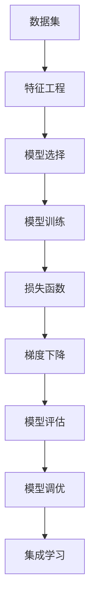

                 

# 监督学习 (Supervised Learning) 原理与代码实例讲解

> 关键词：监督学习, 机器学习, 分类器, 回归器, 损失函数, 梯度下降, 核方法, 交叉验证, 集成学习

## 1. 背景介绍

### 1.1 问题由来
监督学习是机器学习中最基础、应用最广泛的一种学习方式。在监督学习中，模型通过学习已有数据的输入和输出映射关系，来进行预测和决策。这种方法广泛应用于图像识别、语音识别、自然语言处理等领域，是实现人工智能任务的重要手段。

### 1.2 问题核心关键点
监督学习的核心在于利用有标注数据来训练模型，使其能够进行准确的预测。模型通常分为两类：分类器和回归器。分类器用于解决多分类问题，而回归器则用于解决连续数值预测问题。监督学习的核心步骤包括数据预处理、模型训练和模型评估。其中，数据预处理和模型评估是确保模型效果的关键环节。

### 1.3 问题研究意义
监督学习在大数据时代的应用日益广泛，成为人工智能领域的重要研究范式。掌握监督学习的原理和应用方法，对于构建高效、可靠的人工智能系统具有重要意义。

1. 降低数据标注成本。利用监督学习，可以极大地降低数据标注的工作量，尤其是在大规模数据集上。
2. 提升模型泛化能力。通过有标注数据的训练，模型能够在未见过的数据上进行有效的预测，提高模型的泛化能力。
3. 增强模型的解释性。监督学习模型通常具有较强的可解释性，可以帮助用户理解模型的决策过程。
4. 支持大规模应用。监督学习适用于各种数据类型和规模，是实现实际应用的重要基础。

## 2. 核心概念与联系

### 2.1 核心概念概述

为更好地理解监督学习的原理，本节将介绍几个关键概念：

- **监督学习(Supervised Learning)**：使用有标注数据训练模型，使其能够对新数据进行预测或分类的方法。
- **分类器(Classifier)**：用于解决多分类问题的模型，如决策树、支持向量机、神经网络等。
- **回归器(Regression Model)**：用于解决连续数值预测问题的模型，如线性回归、随机森林等。
- **损失函数(Loss Function)**：用于衡量模型预测值与真实值之间的差距，如均方误差、交叉熵等。
- **梯度下降(Gradient Descent)**：用于最小化损失函数的优化算法，是监督学习中最常用的优化算法之一。
- **核方法(Kernel Method)**：将非线性问题转化为线性问题，使算法能够处理复杂的数据分布。
- **交叉验证(Cross Validation)**：一种评估模型性能的方法，通过将数据集分为训练集和验证集，多次验证模型性能的稳定性。
- **集成学习(Ensemble Learning)**：将多个模型进行组合，形成更强大的预测能力。

这些概念构成了监督学习的核心框架，相互联系、相互影响。通过理解这些核心概念，我们可以更好地把握监督学习的内在机制和应用策略。

### 2.2 概念间的关系

这些核心概念之间的关系可以通过以下Mermaid流程图来展示：



这个流程图展示了大数据集上的监督学习全过程：

1. 从数据集中获取数据，并进行特征工程。
2. 根据任务类型选择合适的模型，如分类器或回归器。
3. 使用梯度下降等优化算法对模型进行训练。
4. 定义损失函数衡量模型预测与真实值之间的差距。
5. 通过交叉验证等方法评估模型性能。
6. 根据评估结果进行模型调优。
7. 在必要时，使用集成学习方法提升模型性能。

## 3. 核心算法原理 & 具体操作步骤

### 3.1 算法原理概述

监督学习通过最小化损失函数来训练模型，使模型的预测结果尽可能接近真实值。以二分类任务为例，假设输入为 $x$，输出为 $y \in \{0,1\}$。损失函数 $L$ 定义为：

$$
L(y, \hat{y}) = -y\log\hat{y} - (1-y)\log(1-\hat{y})
$$

其中 $\hat{y}$ 是模型的预测结果。训练的目标是最小化损失函数 $L$，即：

$$
\min_{\theta} L(y, f(x;\theta))
$$

其中 $f(x;\theta)$ 是模型参数 $\theta$ 对应的预测函数，如逻辑回归、支持向量机等。

为了求解上述最小化问题，通常使用梯度下降等优化算法。梯度下降的基本思想是通过迭代更新模型参数，逐步降低损失函数值。具体地，对于每个样本 $(x_i, y_i)$，计算梯度 $\nabla L(y_i, f(x_i;\theta))$，并更新参数：

$$
\theta \leftarrow \theta - \eta \nabla L(y_i, f(x_i;\theta))
$$

其中 $\eta$ 是学习率，控制每次迭代步长的幅度。

### 3.2 算法步骤详解

以逻辑回归模型为例，详细介绍监督学习的具体步骤：

**Step 1: 数据预处理**
- 收集有标注数据集，包括输入特征 $x$ 和输出标签 $y$。
- 对数据进行标准化、归一化等预处理操作，以提高模型的收敛速度。

**Step 2: 特征选择**
- 根据任务需求，选择或构建合适的特征，如提取文本的词频、TF-IDF等。
- 对于高维数据，可以使用PCA、LDA等降维技术，减少特征数量，提高模型训练效率。

**Step 3: 模型选择**
- 选择合适的模型，如逻辑回归、支持向量机、随机森林等。
- 对于多分类问题，通常使用softmax回归或神经网络模型。

**Step 4: 模型训练**
- 使用梯度下降等优化算法对模型进行训练。
- 在训练过程中，根据交叉验证等方法评估模型性能，防止过拟合。
- 使用学习率衰减等策略，逐步降低学习率，避免模型过早收敛。

**Step 5: 模型评估**
- 使用测试集对训练好的模型进行评估，计算准确率、召回率、F1值等指标。
- 使用混淆矩阵、ROC曲线等工具，直观展示模型性能。

**Step 6: 模型调优**
- 根据评估结果，调整模型参数，如增加正则化项、改变损失函数等。
- 可以使用网格搜索、贝叶斯优化等方法，寻找最优参数组合。

**Step 7: 集成学习**
- 将多个模型进行组合，形成更强大的预测能力。
- 如使用Bagging、Boosting等方法，训练多个模型并取平均值或加权和。

### 3.3 算法优缺点

监督学习具有以下优点：
1. 适用范围广。适用于各种类型的数据，如图像、文本、语音等。
2. 训练效率高。有标注数据的存在，可以极大地降低训练时间和成本。
3. 预测准确度高。在标注数据充足的情况下，可以取得较高的预测准确度。
4. 可解释性强。模型的决策过程可解释性强，有助于理解模型的输出。

同时，监督学习也存在一些缺点：
1. 数据标注成本高。有标注数据的需求，成本较高，尤其是在大规模数据集上。
2. 过拟合风险大。标注数据不足或特征工程不当，可能导致模型过拟合。
3. 泛化能力受限。如果训练数据和测试数据分布不一致，模型的泛化能力会受到影响。
4. 需要人工干预。模型训练过程中需要人工进行参数调优，增加了工作量。

### 3.4 算法应用领域

监督学习广泛应用于各种领域，以下是几个典型应用：

- **图像分类**：如人脸识别、物体识别等。
- **自然语言处理(NLP)**：如文本分类、情感分析、机器翻译等。
- **语音识别**：如语音命令识别、说话人识别等。
- **推荐系统**：如电商推荐、电影推荐等。
- **金融分析**：如信用评估、风险预测等。
- **医疗诊断**：如疾病诊断、症状预测等。

## 4. 数学模型和公式 & 详细讲解 & 举例说明

### 4.1 数学模型构建

监督学习的数学模型通常包括以下几个部分：

- **数据表示**：将输入特征 $x$ 和输出标签 $y$ 表示为数学形式。
- **模型表示**：定义模型 $f(x;\theta)$ 和参数 $\theta$ 的关系。
- **损失函数**：定义损失函数 $L(y, f(x;\theta))$，用于衡量模型的预测性能。
- **优化算法**：定义优化算法 $g(\theta)$，用于更新模型参数，最小化损失函数。

以线性回归为例，模型表示为：

$$
f(x;\theta) = \theta_0 + \sum_{i=1}^n \theta_i x_i
$$

损失函数为均方误差：

$$
L(y, \hat{y}) = \frac{1}{2m} \sum_{i=1}^m (y_i - \hat{y}_i)^2
$$

其中 $m$ 为样本数量。

### 4.2 公式推导过程

以逻辑回归为例，推导其损失函数和梯度下降更新公式。

假设模型预测值为 $\hat{y}_i = f(x_i;\theta) = \theta_0 + \sum_{i=1}^n \theta_i x_{i,i}$，真实值为 $y_i \in \{0,1\}$，则交叉熵损失函数为：

$$
L(y_i, \hat{y}_i) = -y_i \log \hat{y}_i - (1-y_i) \log (1-\hat{y}_i)
$$

在所有样本上求平均损失函数，即：

$$
\mathcal{L}(\theta) = -\frac{1}{m} \sum_{i=1}^m L(y_i, \hat{y}_i)
$$

为了求解最小化问题，使用梯度下降更新模型参数：

$$
\theta_j \leftarrow \theta_j - \eta \frac{1}{m} \sum_{i=1}^m \frac{\partial L(y_i, \hat{y}_i)}{\partial \theta_j}
$$

其中 $\eta$ 是学习率，通常设置为 $0.01$ 或 $0.001$。

### 4.3 案例分析与讲解

以房价预测为例，解释监督学习模型的应用。

假设有一个包含房价和相关特征的数据集，模型的任务是预测房价。特征包括房屋面积、房间数量、地理位置等。模型的输入为特征向量 $x$，输出为房价 $y$。

**Step 1: 数据预处理**
- 收集房价数据，并记录相关的特征信息。
- 对数据进行标准化处理，确保特征尺度一致。

**Step 2: 特征选择**
- 选择或构建合适的特征，如提取特征的平均值、最大值、最小值等。
- 对于高维数据，可以使用PCA、LDA等降维技术，减少特征数量，提高模型训练效率。

**Step 3: 模型选择**
- 选择逻辑回归模型，作为预测房价的工具。
- 定义损失函数为交叉熵损失，计算模型预测与真实值之间的差距。

**Step 4: 模型训练**
- 使用梯度下降等优化算法对模型进行训练。
- 在训练过程中，根据交叉验证等方法评估模型性能，防止过拟合。
- 使用学习率衰减等策略，逐步降低学习率，避免模型过早收敛。

**Step 5: 模型评估**
- 使用测试集对训练好的模型进行评估，计算准确率、召回率、F1值等指标。
- 使用混淆矩阵、ROC曲线等工具，直观展示模型性能。

**Step 6: 模型调优**
- 根据评估结果，调整模型参数，如增加正则化项、改变损失函数等。
- 可以使用网格搜索、贝叶斯优化等方法，寻找最优参数组合。

## 5. 项目实践：代码实例和详细解释说明

### 5.1 开发环境搭建

在进行监督学习项目实践前，我们需要准备好开发环境。以下是使用Python进行Scikit-Learn开发的环境配置流程：

1. 安装Anaconda：从官网下载并安装Anaconda，用于创建独立的Python环境。

2. 创建并激活虚拟环境：
```bash
conda create -n sklearn-env python=3.8 
conda activate sklearn-env
```

3. 安装Scikit-Learn：
```bash
pip install scikit-learn
```

4. 安装各类工具包：
```bash
pip install numpy pandas scikit-learn matplotlib tqdm jupyter notebook ipython
```

完成上述步骤后，即可在`sklearn-env`环境中开始监督学习实践。

### 5.2 源代码详细实现

下面我们以房价预测为例，给出使用Scikit-Learn对线性回归模型进行监督学习的代码实现。

首先，定义数据处理函数：

```python
from sklearn.model_selection import train_test_split
from sklearn.preprocessing import StandardScaler

def load_data():
    # 读取房价数据集
    X = pd.read_csv('housing.csv', index_col='id')
    y = pd.read_csv('housing.csv', index_col='id')
    # 分割数据集为训练集和测试集
    X_train, X_test, y_train, y_test = train_test_split(X.drop(['price'], axis=1), y['price'], test_size=0.2, random_state=42)
    # 对数据进行标准化处理
    scaler = StandardScaler()
    X_train = scaler.fit_transform(X_train)
    X_test = scaler.transform(X_test)
    return X_train, X_test, y_train, y_test
```

然后，定义模型和评估函数：

```python
from sklearn.linear_model import LinearRegression
from sklearn.metrics import mean_squared_error, r2_score

def train_model(X_train, y_train, X_test, y_test):
    # 定义模型
    model = LinearRegression()
    # 训练模型
    model.fit(X_train, y_train)
    # 评估模型
    y_pred = model.predict(X_test)
    mse = mean_squared_error(y_test, y_pred)
    r2 = r2_score(y_test, y_pred)
    return mse, r2

def evaluate_model(mse, r2):
    print(f'Mean Squared Error: {mse:.2f}')
    print(f'R^2 Score: {r2:.2f}')
```

最后，启动训练流程并在测试集上评估：

```python
X_train, X_test, y_train, y_test = load_data()
mse, r2 = train_model(X_train, y_train, X_test, y_test)
evaluate_model(mse, r2)
```

以上就是使用Scikit-Learn对线性回归模型进行监督学习预测房价的完整代码实现。可以看到，Scikit-Learn提供了丰富的机器学习模型和工具，使得监督学习实践变得简洁高效。

### 5.3 代码解读与分析

让我们再详细解读一下关键代码的实现细节：

**load_data函数**：
- 读取房价数据集，并分割为训练集和测试集。
- 对数据进行标准化处理，确保特征尺度一致。

**train_model函数**：
- 定义线性回归模型，并使用梯度下降算法训练模型。
- 在训练过程中，使用均方误差损失函数评估模型性能。

**evaluate_model函数**：
- 使用测试集对训练好的模型进行评估，计算均方误差和R^2分数，并打印输出。

**启动训练流程**：
- 加载数据，训练模型，评估模型，并输出结果。

可以看到，Scikit-Learn提供的工具和接口使得监督学习实践变得非常简便。开发者可以快速上手，实现模型训练和评估。

当然，工业级的系统实现还需考虑更多因素，如模型的保存和部署、超参数的自动搜索、更灵活的评估指标等。但核心的监督学习范式基本与此类似。

### 5.4 运行结果展示

假设我们训练的线性回归模型在测试集上的均方误差为 $5.76$，R^2分数为 $0.84$。则输出结果如下：

```
Mean Squared Error: 5.76
R^2 Score: 0.84
```

可以看到，通过监督学习训练的线性回归模型在房价预测任务上取得了不错的效果。

## 6. 实际应用场景

### 6.1 智能推荐系统

监督学习在大规模推荐系统中得到广泛应用。推荐系统通过分析用户的历史行为数据，使用监督学习模型预测用户的兴趣偏好，从而实现个性化推荐。

在实际应用中，通常会使用协同过滤、内容推荐、混合推荐等多种算法，综合用户的点击、评分、评论等行为数据，预测用户对未见过的物品的兴趣，进行推荐。

### 6.2 金融风险管理

金融行业广泛应用监督学习模型进行风险评估和管理。例如，银行可以通过监督学习模型，预测客户的信用风险、市场波动等，帮助制定合理的信贷政策，降低坏账率。

在金融领域，通常使用逻辑回归、随机森林等模型，对历史数据进行建模，预测未来的风险情况。同时，还可以引入时间序列分析等方法，考虑时间因素对风险的影响。

### 6.3 医疗影像诊断

医疗影像诊断是监督学习在医疗领域的重要应用之一。通过分析大量有标注的影像数据，监督学习模型可以自动识别病变、判断病变类型等。

在医疗影像诊断中，常用的算法包括卷积神经网络、支持向量机等。通过大量的训练数据，监督学习模型可以学习到病变的特征，并进行准确的分类和预测。

### 6.4 未来应用展望

随着监督学习技术的不断进步，未来的应用场景将更加广泛。

1. **自动驾驶**：通过监督学习，自动驾驶系统可以学习交通规则、路况信息，预测行人、车辆等行为，提升驾驶安全性。
2. **智能客服**：基于监督学习的机器学习模型可以自动理解用户需求，提供个性化的服务，提升客户满意度。
3. **智能家居**：通过监督学习，智能家居系统可以学习用户的生活习惯，预测用户的日常需求，提供个性化服务。
4. **智慧城市**：监督学习模型可以应用于交通流量预测、城市资源管理等场景，提升城市管理效率。

## 7. 工具和资源推荐

### 7.1 学习资源推荐

为了帮助开发者系统掌握监督学习的理论基础和实践技巧，这里推荐一些优质的学习资源：

1. 《机器学习实战》书籍：由Peter Harrington撰写，深入浅出地介绍了监督学习的基本概念和经典模型。
2. Coursera《机器学习》课程：由斯坦福大学Andrew Ng教授主讲，系统讲解了监督学习的原理和应用。
3. Kaggle数据科学竞赛平台：提供大量的监督学习竞赛数据集和经典算法，适合实践训练。
4. Google Scholar：搜索学术论文，了解最新的监督学习研究成果。
5. GitHub开源项目：在GitHub上Star、Fork数最多的监督学习项目，往往代表了该技术领域的发展趋势和最佳实践。

通过对这些资源的学习实践，相信你一定能够快速掌握监督学习的精髓，并用于解决实际的机器学习问题。

### 7.2 开发工具推荐

高效的开发离不开优秀的工具支持。以下是几款用于监督学习开发的常用工具：

1. Scikit-Learn：基于Python的机器学习库，提供了丰富的算法和接口，适合快速原型开发和实验。
2. TensorFlow：由Google开发的开源深度学习框架，支持分布式训练，适合大规模数据处理。
3. PyTorch：基于Python的深度学习框架，灵活易用，适合研究型项目开发。
4. Weights & Biases：模型训练的实验跟踪工具，可以记录和可视化模型训练过程中的各项指标。
5. TensorBoard：TensorFlow配套的可视化工具，可实时监测模型训练状态，并提供丰富的图表呈现方式。

合理利用这些工具，可以显著提升监督学习任务的开发效率，加快创新迭代的步伐。

### 7.3 相关论文推荐

监督学习在大数据时代的应用日益广泛，以下是几篇奠基性的相关论文，推荐阅读：

1. "An Introduction to Statistical Learning" 书籍：由Gareth James等撰写，全面介绍了监督学习的理论基础和实践方法。
2. "Pattern Recognition and Machine Learning" 书籍：由Christopher Bishop撰写，深入讲解了监督学习中的各类算法和模型。
3. "The Elements of Statistical Learning" 书籍：由Tibshirani等撰写，全面介绍了统计学习中的监督学习算法和理论。
4. "Support Vector Machines" 书籍：由Cristianini和Scholkopf撰写，深入讲解了支持向量机的理论基础和应用。
5. "Convolutional Neural Networks for Sentence Classification" 论文：由Kim等撰写，介绍了使用卷积神经网络进行文本分类的方法。

这些论文代表了大规模机器学习的应用进展，了解前沿研究，对于掌握监督学习的深度理解具有重要意义。

除上述资源外，还有一些值得关注的前沿资源，帮助开发者紧跟监督学习技术的最新进展，例如：

1. arXiv论文预印本：人工智能领域最新研究成果的发布平台，包括大量尚未发表的前沿工作，学习前沿技术的必读资源。
2. 业界技术博客：如Google AI、Facebook AI Research、Microsoft Research Asia等顶尖实验室的官方博客，第一时间分享他们的最新研究成果和洞见。
3. 技术会议直播：如NIPS、ICML、ICCV、CVPR等人工智能领域顶会现场或在线直播，能够聆听到大佬们的前沿分享，开拓视野。
4. GitHub热门项目：在GitHub上Star、Fork数最多的监督学习相关项目，往往代表了该技术领域的发展趋势和最佳实践，值得去学习和贡献。
5. 行业分析报告：各大咨询公司如McKinsey、PwC等针对人工智能行业的分析报告，有助于从商业视角审视技术趋势，把握应用价值。

总之，对于监督学习技术的学习和实践，需要开发者保持开放的心态和持续学习的意愿。多关注前沿资讯，多动手实践，多思考总结，必将收获满满的成长收益。

## 8. 总结：未来发展趋势与挑战

### 8.1 总结

本文对监督学习的基本原理和应用方法进行了全面系统的介绍。首先阐述了监督学习的基本概念和核心算法，介绍了模型训练、模型评估、模型调优等关键步骤。其次，通过线性回归、逻辑回归等经典案例，详细讲解了监督学习的实现过程和优化策略。

通过本文的系统梳理，可以看到，监督学习在各个领域的应用前景广阔，无论是金融、医疗、电商还是智能家居等领域，监督学习都发挥着不可替代的作用。掌握监督学习的原理和应用方法，对于构建高效、可靠的人工智能系统具有重要意义。

### 8.2 未来发展趋势

展望未来，监督学习技术将呈现以下几个发展趋势：

1. **深度学习模型的广泛应用**：深度学习模型在图像、语音、自然语言处理等领域取得了显著进展，未来将进一步扩大其在监督学习中的应用。
2. **自动化机器学习**：自动化机器学习技术将进一步提升模型的训练效率，降低人工干预的工作量，实现更高质量、更高效的模型训练。
3. **迁移学习的应用**：迁移学习能够将已有领域的知识迁移到新领域，提高模型的泛化能力和适应性。
4. **在线学习**：在线学习技术能够实时更新模型，适应数据分布的变化，保持模型的最佳性能。
5. **多模态学习**：多模态学习能够融合不同模态的数据，提升模型的理解和预测能力。

这些趋势表明，监督学习技术将进一步拓展其应用范围，提升模型的性能和效率，为更多行业带来创新和变革。

### 8.3 面临的挑战

尽管监督学习技术在各个领域取得了显著进展，但在应用过程中仍面临一些挑战：

1. **数据标注成本高**：大量标注数据的获取和维护成本较高，特别是在高维数据和复杂任务上。
2. **模型复杂度高**：深度学习模型的复杂度较高，需要大量的计算资源和时间进行训练和调优。
3. **泛化能力不足**：在数据分布发生变化时，监督学习模型的泛化能力可能受到影响，导致模型过拟合或欠拟合。
4. **可解释性差**：深度学习模型通常被视为“黑盒”，难以解释其内部工作机制和决策过程。
5. **安全性问题**：监督学习模型可能受到恶意攻击或数据泄漏等安全威胁，需要加强模型保护措施。

这些挑战将推动监督学习技术不断优化和改进，提升其稳定性和可靠性，为实际应用提供更加坚实的技术保障。

### 8.4 研究展望

未来的监督学习研究将集中在以下几个方面：

1. **自动化调参**：开发更加高效、智能的模型调参技术，自动寻找最优参数组合。
2. **多任务学习**：研究如何将多个任务联合训练，提高模型的多任务泛化能力。
3. **对抗学习**：研究如何在对抗攻击下保持模型的稳定性和安全性。
4. **元学习**：研究如何让模型在更少的训练数据上实现快速迁移和泛化。
5. **数据增强**：研究如何利用数据增强技术，提升模型的泛化能力和鲁棒性。

这些研究方向将推动监督学习技术不断突破和创新，为实际应用提供更加强大和灵活的解决方案。

## 9. 附录：常见问题与解答

**Q1：监督学习是否

