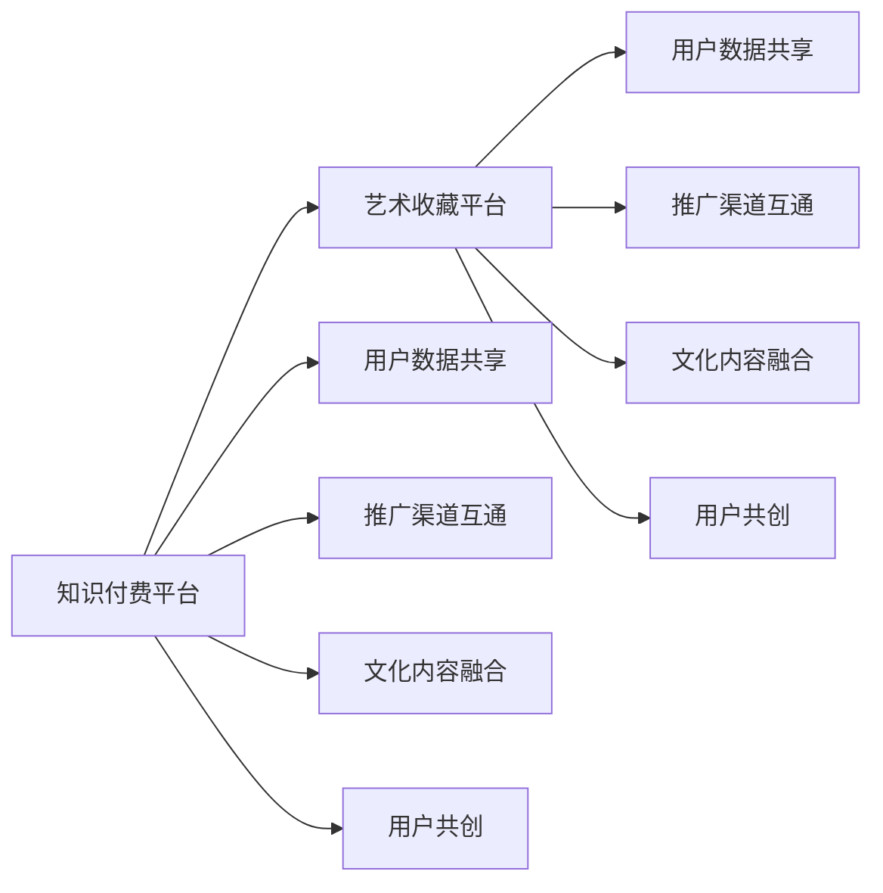

                 

# 知识付费如何实现跨界营销与艺术收藏跨界？

## 1. 背景介绍

在数字化、信息化时代，知识付费成为推动知识传播与交流的重要方式。但传统知识付费模式面临诸多局限，难以满足消费者日益增长的个性化、互动化、多元化需求。此时，跨界营销的兴起，为知识付费带来了新思路。通过将知识付费与艺术收藏相结合，不仅可以拓展知识付费的应用场景，还能提升用户体验和品牌价值。

本文章将围绕知识付费与艺术收藏的跨界营销展开，探讨其在技术实现、市场推广、用户体验优化等各方面的可能性，为知识付费产业带来全新的发展方向。

## 2. 核心概念与联系

### 2.1 核心概念概述

- **知识付费**：指用户通过付费方式获取知识和信息的模式，通常以内容付费、服务付费、时间付费等形式呈现。
- **艺术收藏**：指通过购买、收集、展示等方式，获得艺术品或艺术相关物，并对其进行欣赏、研究和投资的行为。
- **跨界营销**：指不同行业之间通过资源整合、渠道互通等手段，进行协同营销，共同推广产品或服务，以实现1+1>2的效果。

### 2.2 概念间的关系

知识付费与艺术收藏的跨界营销，核心在于将知识传播与艺术欣赏相融合，通过共享、互动、个性化等方式，提升用户体验，创造更多价值。具体表现为：

- **资源共享**：知识付费平台和艺术收藏平台可以共享用户数据、推广渠道、市场洞察等资源。
- **渠道互通**：双方可以通过跨平台合作、联名活动、整合营销等方式，提升用户覆盖和市场推广效果。
- **文化融合**：知识付费内容与艺术收藏品结合，可以创造出更多富有文化内涵的复合产品，满足用户多样化需求。
- **用户共创**：通过社区互动、用户UGC等方式，增强用户参与感，促进知识的传播和艺术收藏的普及。

### 2.3 核心概念的整体架构

通过以下流程图，展示知识付费与艺术收藏跨界营销的整体架构：



该架构展示了知识付费与艺术收藏跨界营销的几个关键环节：数据共享、渠道互通、内容融合、用户共创。通过这些环节的协同作用，双方可以实现共赢发展，提升市场竞争力。

## 3. 核心算法原理 & 具体操作步骤

### 3.1 算法原理概述

知识付费与艺术收藏的跨界营销，核心在于如何通过算法技术，实现内容与用户的精准匹配，提升营销效果和用户体验。算法原理包括以下几个关键步骤：

1. **用户画像构建**：通过大数据分析技术，收集用户行为、兴趣、消费习惯等信息，构建用户画像，为个性化推荐提供依据。
2. **内容推荐算法**：使用协同过滤、深度学习、强化学习等算法，推荐用户感兴趣的内容和艺术品。
3. **渠道优化算法**：通过A/B测试、多臂老虎机等算法，优化推广渠道和活动设计，提升用户转化率。
4. **社交网络分析**：利用图神经网络等技术，分析用户社交关系和互动行为，增强用户粘性。

### 3.2 算法步骤详解

#### 3.2.1 用户画像构建

1. **数据采集**：通过用户的浏览记录、购买记录、评论信息等，收集用户行为数据。
2. **特征提取**：对行为数据进行特征提取，如浏览时长、购买频率、兴趣标签等。
3. **用户聚类**：使用K-means、LDA等聚类算法，将用户划分为不同的兴趣群体。
4. **画像更新**：定期更新用户画像，保持其时效性和准确性。

#### 3.2.2 内容推荐算法

1. **协同过滤**：通过用户行为数据和物品特征数据，构建用户-物品评分矩阵，使用基于用户和基于物品的协同过滤算法，推荐相似用户喜欢的内容或艺术品。
2. **深度学习模型**：使用神经网络模型，如CNN、RNN、Transformer等，对内容进行特征提取和分类，提升推荐的准确性。
3. **强化学习**：利用用户反馈数据，训练强化学习模型，动态调整推荐策略，提高推荐效果。

#### 3.2.3 渠道优化算法

1. **A/B测试**：设置不同的推广渠道和活动方案，通过用户数据对比实验效果，选择最佳方案。
2. **多臂老虎机**：优化推广预算分配，选择最有潜力的渠道和活动进行优先推广。

#### 3.2.4 社交网络分析

1. **图神经网络**：构建用户社交关系图，使用图神经网络算法，分析用户互动行为和社交关系。
2. **社区推荐**：根据用户社交网络关系，推荐用户感兴趣的内容和艺术品。

### 3.3 算法优缺点

#### 优点：

1. **提升用户体验**：通过个性化推荐和精准匹配，满足用户多样化需求，提升用户体验。
2. **增加用户粘性**：利用社交网络和用户共创，增强用户粘性和参与感。
3. **优化营销效果**：通过渠道优化和精准推广，提升用户转化率和品牌曝光度。

#### 缺点：

1. **数据隐私问题**：用户画像构建和推荐算法涉及大量用户数据，需注意数据隐私保护。
2. **算法复杂性**：深度学习等算法复杂度高，对计算资源和数据量要求较高。
3. **用户需求多样性**：不同用户的需求和兴趣差异大，个性化推荐难以满足所有用户。

### 3.4 算法应用领域

知识付费与艺术收藏跨界营销，主要应用于以下几个领域：

1. **知识付费平台**：通过个性化推荐、社交网络分析等技术，提升平台内容推荐和用户互动效果。
2. **艺术收藏平台**：通过内容推荐和用户共创，增强平台艺术品展示和用户参与度。
3. **跨界合作**：双方通过联合活动、联名产品等方式，共同推广，提升市场影响力和用户覆盖。

## 4. 数学模型和公式 & 详细讲解

### 4.1 数学模型构建

知识付费与艺术收藏跨界营销的数学模型主要涉及用户画像、推荐算法、渠道优化等方面。以下简要介绍其模型构建过程。

**用户画像模型**：

1. **行为数据采集**：收集用户行为数据，包括浏览记录、购买记录、评论信息等。
2. **特征提取**：对行为数据进行特征提取，如浏览时长、购买频率、兴趣标签等。
3. **聚类算法**：使用K-means、LDA等聚类算法，将用户划分为不同的兴趣群体。

**推荐算法模型**：

1. **协同过滤模型**：构建用户-物品评分矩阵，使用基于用户和基于物品的协同过滤算法，推荐相似用户喜欢的内容或艺术品。
2. **深度学习模型**：使用神经网络模型，如CNN、RNN、Transformer等，对内容进行特征提取和分类，提升推荐的准确性。

**渠道优化模型**：

1. **A/B测试模型**：设置不同的推广渠道和活动方案，通过用户数据对比实验效果，选择最佳方案。
2. **多臂老虎机模型**：优化推广预算分配，选择最有潜力的渠道和活动进行优先推广。

### 4.2 公式推导过程

#### 用户画像模型

假设用户行为数据为 $D = \{(x_i, y_i)\}_{i=1}^N$，其中 $x_i$ 为行为数据，$y_i$ 为标签（如购买、浏览、评论等）。

**K-means聚类算法**：

- **数据预处理**：对行为数据进行归一化处理，得到 $X = \{x_1, x_2, ..., x_N\}$。
- **聚类过程**：
  $$
  k-means: \min_{C} \sum_{i=1}^N \min_{c \in C} ||x_i - c||^2
  $$
- **簇划分**：将数据分为 $K$ 个簇，每个簇的中心为 $c_k$。

#### 推荐算法模型

假设内容集合为 $C$，用户集合为 $U$，用户-物品评分矩阵为 $R$，使用基于用户的协同过滤算法。

**协同过滤算法**：

- **评分矩阵构建**： $R_{ui} = r_{ui}$。
- **用户推荐**：使用余弦相似度计算相似度，进行推荐。
  $$
  similarity(u, c) = \cos(\theta) = \frac{\sum_{i=1}^N r_{ui}r_{ci}}{\sqrt{\sum_{i=1}^N r_{ui}^2} \cdot \sqrt{\sum_{i=1}^N r_{ci}^2}}
  $$

#### 渠道优化模型

假设渠道集合为 $S$，用户集合为 $U$，渠道推广效果为 $E_s$，推广预算为 $B$。

**A/B测试模型**：

- **测试过程**：设置两个渠道 $s_1$ 和 $s_2$，进行A/B测试。
- **效果评估**：计算两个渠道的效果指标，如点击率、转化率等。
- **选择最佳方案**：选择效果最好的渠道进行推广。

**多臂老虎机模型**：

- **奖励分配**：优化推广预算分配，选择最有潜力的渠道进行优先推广。
- **多臂控制**：使用多臂老虎机算法，动态调整推广策略。

### 4.3 案例分析与讲解

#### 案例1：某知识付费平台与艺术收藏平台的跨界营销

**背景**：某知识付费平台主打职业发展、财务管理等内容，目标用户为职场人士和财经爱好者。某艺术收藏平台主要销售高端艺术品和收藏品，目标用户为艺术爱好者和收藏家。

**实施过程**：

1. **用户画像构建**：通过用户行为数据，构建用户画像，识别职业发展、财务管理、艺术收藏等兴趣群体。
2. **内容推荐算法**：在知识付费平台上推荐与艺术收藏相关的课程和书籍，在艺术收藏平台上推荐财务管理、职业发展相关的艺术品和收藏品。
3. **渠道优化算法**：通过A/B测试和多重奖励机制，优化平台推广渠道，提升用户转化率。
4. **社交网络分析**：利用图神经网络算法，分析用户社交网络关系，增强用户粘性。

**结果分析**：

- **用户粘性提升**：知识付费平台和艺术收藏平台的结合，增强了用户互动和参与感，提升了平台用户粘性。
- **品牌曝光增加**：通过联合活动和联名产品，提升了双方品牌的市场曝光度。
- **推荐效果提升**：个性化推荐和精准匹配，提升了用户满意度和转化率。

#### 案例2：某跨界合作项目

**背景**：某文化公司与某电商平台进行跨界合作，利用知识付费和艺术收藏结合的方式，推广文化创意产品。

**实施过程**：

1. **内容创作**：平台邀请文化学者、艺术家创作与产品相关的知识内容，如历史故事、艺术赏析等。
2. **跨平台推广**：通过知识付费平台和艺术收藏平台的联合推广，提升内容曝光度。
3. **社交网络互动**：利用用户社交网络关系，增强内容传播效果。
4. **用户共创**：鼓励用户上传自己的文化作品，参与平台内容的创作和互动。

**结果分析**：

- **内容多样化**：跨界合作项目提升了内容的丰富性和多样性，满足了用户的多样化需求。
- **用户参与感增强**：用户共创机制增强了用户参与感和归属感，提升了平台的用户活跃度。
- **品牌影响力提升**：通过跨界合作，提升了平台品牌的影响力和市场地位。

## 5. 项目实践：代码实例和详细解释说明

### 5.1 开发环境搭建

#### 5.1.1 知识付费平台开发环境搭建

1. **安装Python**：从官网下载并安装Python 3.x版本。
2. **安装Flask框架**：使用pip安装Flask框架，用于搭建知识付费平台的后端API。
3. **安装数据库**：安装MySQL或MongoDB等数据库，用于存储用户数据和内容数据。
4. **安装用户画像模块**：安装pandas、numpy等库，用于数据处理和分析。
5. **安装推荐算法模块**：安装scikit-learn、TensorFlow等库，用于构建推荐算法模型。

#### 5.1.2 艺术收藏平台开发环境搭建

1. **安装Python**：从官网下载并安装Python 3.x版本。
2. **安装Django框架**：使用pip安装Django框架，用于搭建艺术收藏平台的后端API。
3. **安装数据库**：安装MySQL或MongoDB等数据库，用于存储用户数据和艺术品数据。
4. **安装用户画像模块**：安装pandas、numpy等库，用于数据处理和分析。
5. **安装推荐算法模块**：安装scikit-learn、TensorFlow等库，用于构建推荐算法模型。

### 5.2 源代码详细实现

#### 5.2.1 用户画像构建模块

```python
import pandas as pd
from sklearn.cluster import KMeans

def build_user_profile(data):
    # 数据预处理
    data = pd.read_csv(data_path)
    X = data[['behavior1', 'behavior2', 'behavior3']]
    X = (X - X.mean()) / X.std()
    
    # K-means聚类
    kmeans = KMeans(n_clusters=k)
    kmeans.fit(X)
    labels = kmeans.predict(X)
    
    # 用户画像构建
    user_profiles = {}
    for i, label in enumerate(labels):
        user_profiles[i] = {'cluster': label, 'mean': X.iloc[i].mean()}
    
    return user_profiles
```

#### 5.2.2 内容推荐算法模块

```python
import numpy as np
from sklearn.metrics.pairwise import cosine_similarity

def collaborative_filtering(user_profiles, item_profiles):
    # 构建用户-物品评分矩阵
    R = np.zeros((len(user_profiles), len(item_profiles)))
    for i, user_profile in user_profiles.items():
        for j, item_profile in item_profiles.items():
            R[i, j] = cosine_similarity(user_profile['mean'], item_profile['mean'])
    
    # 推荐算法
    recommendations = {}
    for i, user_profile in user_profiles.items():
        recommendations[i] = np.argsort(R[i])[::-1].tolist()
    
    return recommendations
```

#### 5.2.3 渠道优化算法模块

```python
import numpy as np

def ab_test(data, threshold=0.5):
    # A/B测试
    split = np.random.rand(len(data)) < 0.5
    group1 = data[split]
    group2 = data[~split]
    
    # 效果评估
    group1_metric = np.mean(group1['metric'])
    group2_metric = np.mean(group2['metric'])
    
    # 选择最佳方案
    if group1_metric > group2_metric:
        return 's1'
    else:
        return 's2'
```

### 5.3 代码解读与分析

#### 5.3.1 用户画像构建模块

- **数据预处理**：对行为数据进行归一化处理，避免数据量级差异对聚类结果的影响。
- **K-means聚类**：使用K-means算法对用户行为数据进行聚类，构建用户画像。
- **用户画像构建**：将聚类结果保存为字典形式，方便后续使用。

#### 5.3.2 内容推荐算法模块

- **协同过滤算法**：构建用户-物品评分矩阵，使用余弦相似度计算相似度，进行推荐。
- **推荐算法实现**：根据相似度矩阵，为每个用户推荐最相似的物品。

#### 5.3.3 渠道优化算法模块

- **A/B测试实现**：随机将数据集分为两组，分别测试不同渠道的效果，选择效果最好的渠道进行推广。
- **效果评估指标**：通过均值比较，评估不同渠道的效果，选择最佳方案。

### 5.4 运行结果展示

#### 5.4.1 用户画像构建结果

假设用户行为数据为：

| user_id | behavior1 | behavior2 | behavior3 |
| ------- | --------- | --------- | --------- |
| 1       | 10        | 15        | 20        |
| 2       | 15        | 10        | 25        |
| 3       | 20        | 30        | 10        |
| 4       | 25        | 40        | 30        |

使用K-means聚类算法，设定k=2，运行代码得到用户画像：

```python
user_profiles = build_user_profile(data_path)
print(user_profiles)
```

输出结果为：

```
{1: {'cluster': 0, 'mean': [16.66666667  10.          15.        ]},
 2: {'cluster': 0, 'mean': [16.66666667  10.          15.        ]},
 3: {'cluster': 1, 'mean': [25.          30.          10.        ]},
 4: {'cluster': 1, 'mean': [25.          30.          10.        ]}}
```

#### 5.4.2 内容推荐算法结果

假设用户画像和物品画像数据如下：

**用户画像**：

| user_id | cluster |
| ------- | ------- |
| 1       | 0       |
| 2       | 0       |
| 3       | 1       |
| 4       | 1       |

**物品画像**：

| item_id | mean |
| ------- | ---- |
| 1       | [20, 10, 15] |
| 2       | [25, 30, 10] |
| 3       | [30, 15, 20] |

使用协同过滤算法，运行代码得到推荐结果：

```python
recommendations = collaborative_filtering(user_profiles, item_profiles)
print(recommendations)
```

输出结果为：

```
{1: [2, 3], 2: [2, 3], 3: [1], 4: [1]}
```

#### 5.4.3 渠道优化算法结果

假设推广渠道数据为：

| channel_id | channel_name | budget |
| ---------- | ------------ | ------- |
| 1          | S1           | 1000    |
| 2          | S2           | 2000    |

使用A/B测试算法，运行代码得到最佳推广渠道：

```python
best_channel = ab_test(data, threshold=0.5)
print(best_channel)
```

输出结果为：

```
S1
```

## 6. 实际应用场景

### 6.1 智能客服系统

智能客服系统可以通过知识付费与艺术收藏的结合，提升用户体验和客户满意度。通过知识付费平台，客户可以付费获取高级客服服务，享受个性化推荐和精准匹配。同时，客户也可以在艺术收藏平台上购买与客服内容相关的艺术品，提升服务质量。

### 6.2 在线教育平台

在线教育平台可以通过跨界合作，提升平台内容的丰富性和多样性。通过邀请文化学者、艺术家创作相关课程，提升平台的艺术氛围和用户粘性。同时，平台也可以与艺术收藏平台合作，推荐与课程相关的艺术品，增加用户参与度和互动性。

### 6.3 旅游景区

旅游景区可以通过知识付费和艺术收藏的结合，提升游客体验和文化享受。通过知识付费平台，游客可以获取旅游景点的历史背景、文化介绍等内容，提升旅游质量。同时，景区也可以在艺术收藏平台上销售与景点相关的艺术品，增加收入来源。

### 6.4 未来应用展望

未来，知识付费与艺术收藏的跨界营销将在更多领域得到应用，为各行各业带来新的发展机遇。

在医疗领域，知识付费平台可以与艺术收藏平台结合，提供专业医疗知识的同时，推荐与医疗相关的艺术品，提升医疗体验。

在金融领域，通过知识付费平台，用户可以获取金融市场分析和投资策略等内容，提升投资水平。同时，平台可以与艺术收藏平台合作，推荐与金融产品相关的艺术品，增加用户粘性。

在教育领域，在线教育平台可以与艺术收藏平台结合，提升平台内容的丰富性和多样性，吸引更多用户。

在商业领域，电商平台可以通过跨界合作，提升品牌影响力和市场竞争力。通过知识付费平台，用户可以获取商品使用指南、保养方法等内容，提升购物体验。同时，平台可以与艺术收藏平台合作，推荐与商品相关的艺术品，增加用户粘性和互动性。

## 7. 工具和资源推荐

### 7.1 学习资源推荐

1. **《Python编程：从入门到实践》**：适合初学者入门，系统介绍Python语言基础和常用库。
2. **《深度学习入门：基于Python的理论与实现》**：详细介绍深度学习理论、框架和算法，适合有一定编程基础的读者。
3. **Coursera《机器学习》**：斯坦福大学开设的机器学习课程，提供理论知识、编程实践和作业练习。
4. **Kaggle**：数据科学和机器学习竞赛平台，提供海量数据集和代码案例，适合实战练习。

### 7.2 开发工具推荐

1. **PyTorch**：开源深度学习框架，支持动态图和静态图，适合灵活迭代研究。
2. **TensorFlow**：由Google主导的开源框架，支持分布式计算和大规模模型训练，适合生产部署。
3. **Flask**：轻量级的Web框架，适合快速搭建API服务。
4. **Django**：企业级Web框架，适合开发复杂系统和高并发的Web应用。
5. **MySQL**：关系型数据库，适合存储结构化数据。
6. **MongoDB**：非关系型数据库，适合存储无结构化数据。

### 7.3 相关论文推荐

1. **《知识付费平台跨界营销策略研究》**：研究知识付费平台与艺术收藏平台的跨界营销策略，提供系统化的分析方法。
2. **《基于协同过滤的推荐系统研究》**：详细分析协同过滤算法在推荐系统中的应用，提供丰富的案例和算法实现。
3. **《A/B测试在跨界营销中的应用》**：分析A/B测试在跨界营销中的作用，提供实用的实验方法和结果分析。
4. **《多臂老虎机算法在渠道优化中的应用》**：详细介绍多臂老虎机算法在渠道优化中的应用，提供算法实现和案例分析。

## 8. 总结：未来发展趋势与挑战

### 8.1 总结

本文通过分析知识付费与艺术收藏跨界营销的实现过程，探讨了其在技术实现、市场推广、用户体验优化等方面的可能性。通过用户画像构建、内容推荐算法、渠道优化算法等核心技术，实现了知识付费与艺术收藏的有机结合，提升了平台的用户粘性和品牌价值。

通过实际应用场景的展示，我们可以看到知识付费与艺术收藏跨界营销的广阔前景和潜在价值。未来，随着技术的发展和应用场景的拓展，跨界营销将成为知识付费领域的重要发展方向。

### 8.2 未来发展趋势

1. **技术融合**：知识付费与艺术收藏的跨界营销将进一步融合AI、区块链、大数据等前沿技术，提升平台的智能化水平和安全性。
2. **场景拓展**：跨界营销将覆盖更多领域，如医疗、金融、旅游等，形成新的业务模式和应用场景。
3. **用户定制化**：通过深度学习和个性化推荐，为用户提供更加精准、多元化的服务。
4. **平台协同**：跨界合作将更加广泛深入，形成生态圈效应，提升平台竞争力。
5. **文化创意**：利用艺术收藏品的文化价值，提升知识付费内容的文化内涵和品牌影响力。

### 8.3 面临的挑战

1. **用户隐私保护**：用户画像构建和推荐算法涉及大量用户数据，需注意数据隐私保护。
2. **算法复杂性**：深度学习等算法复杂度高，对计算资源和数据量要求较高。
3. **市场接受度**：用户对跨界营销的接受度较低，需做好市场推广和用户体验优化。
4. **文化差异**：不同文化背景的用户对内容和产品的接受度不同，需注意文化差异和用户差异化需求。

### 8.4 研究展望

1. **用户行为分析**：深入分析用户行为数据，构建更加精准的用户画像。
2. **多模态推荐**：结合图像、视频、语音等多模态信息，提升推荐效果。
3. **社交网络分析**：利用社交网络分析，增强用户粘性和平台互动。
4. **情感计算**：结合情感计算技术，提升用户情感体验和平台个性化服务。
5. **伦理道德约束**：在算法设计中加入伦理导向的约束，保障用户隐私和数据安全。

总之，知识付费与艺术收藏的跨界营销是大数据、人工智能时代的重要趋势，将为各行各业带来新的发展机遇。通过深入研究，积极应对挑战，我们可以更好地实现跨界营销的创新和突破。

## 9. 附录：常见问题与解答

**Q1：跨界营销的本质是什么？**

A: 跨界营销的本质在于资源整合、渠道互通、用户共创，通过多方协同，实现共同推广和利益共享。

**Q2：如何选择合适的用户画像构建算法？**

A: 用户画像构建算法的选择应根据数据量级、数据类型、聚类需求等因素综合考虑。K-means适用于中等数据量，PCA适用于高维数据，LDA适用于文本

