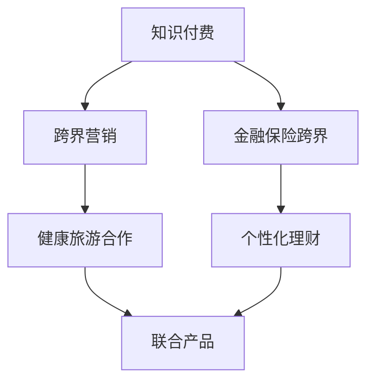
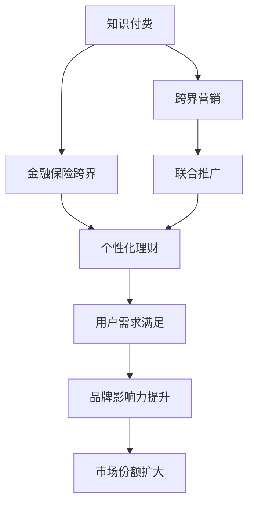

                 

# 知识付费如何实现跨界营销与金融保险跨界？

## 1. 背景介绍

### 1.1 问题由来
随着互联网的普及和数字技术的发展，知识付费模式逐渐成为连接知识创造者与消费者的新方式。知识付费不仅改变了传统的内容分发方式，也为各行各业带来了新的业务增长点。尤其是在金融保险领域，知识付费技术的引入，使信息传递、客户维护、风险控制等方面实现了跨界创新。

### 1.2 问题核心关键点
- 知识付费的核心在于通过互联网平台，实现高质量知识的付费订阅和分销。
- 跨界营销利用知识付费平台的用户基础和内容优势，拓展到教育、健康、旅游等多个领域。
- 金融保险跨界是指将金融保险服务与知识付费相融合，提供定制化的金融保险产品和服务。
- 未来发展趋势包括个性化推荐、智能投顾、理财顾问、金融教育等。

### 1.3 问题研究意义
研究知识付费与跨界营销、金融保险跨界的实现方法，对提升行业服务质量、降低运营成本、扩大市场份额具有重要意义。同时，通过跨界创新，可以为客户提供更全面、更精准的服务，提升客户满意度和品牌忠诚度。

## 2. 核心概念与联系

### 2.1 核心概念概述

为了更深入理解知识付费与跨界营销、金融保险跨界，首先需要明确几个核心概念：

- **知识付费（Knowledge Pay）**：指通过互联网平台，对优质内容进行收费，从而提升内容质量，激励内容生产。
- **跨界营销（Cross-business Marketing）**：指不同行业之间通过合作，利用彼此的资源优势，共同推广产品和服务。
- **金融保险跨界（Financial Insurance Cross-business）**：指金融和保险行业的跨界合作，提供基于用户需求和风险管理的个性化金融保险产品。

这些概念之间存在紧密的联系，具体体现在以下几个方面：

- **知识付费作为基础平台**：知识付费平台通过高质量的内容吸引用户，构建起庞大的用户基础，为跨界营销提供了丰富的用户资源。
- **跨界营销与知识付费结合**：利用知识付费平台的用户特点，开展跨界营销活动，如与健康、旅游等行业合作，推出联合产品或服务，扩大用户群体。
- **金融保险跨界整合**：通过知识付费平台了解用户需求，提供定制化的金融保险产品，将金融保险服务与知识付费相结合，提供一站式解决方案。

### 2.2 概念间的关系

通过以下Mermaid流程图展示这些核心概念之间的关系：



这个流程图展示了知识付费、跨界营销和金融保险跨界之间的关系：

- 知识付费作为基础平台，支撑跨界营销和金融保险跨界。
- 跨界营销利用知识付费平台的用户资源，开展联合推广。
- 金融保险跨界整合知识付费平台的用户需求和金融保险服务，提供定制化产品。

### 2.3 核心概念的整体架构

最后，用综合的流程图展示这些核心概念在大语言模型微调过程中的整体架构：



这个综合流程图展示了从知识付费到跨界营销，再到金融保险跨界的整体流程，各个环节相互促进，最终实现用户需求满足和市场份额扩大。

## 3. 核心算法原理 & 具体操作步骤
### 3.1 算法原理概述

知识付费、跨界营销和金融保险跨界的实现，本质上是一个协同优化过程。具体来说，通过以下步骤实现：

1. **用户画像构建**：通过知识付费平台收集用户行为数据，构建用户画像。
2. **内容推荐优化**：根据用户画像，优化内容推荐算法，提高用户粘性。
3. **跨界合作推广**：利用知识付费平台的用户资源，开展跨界营销活动，推广联合产品或服务。
4. **金融保险定制化**：基于用户需求，提供个性化的金融保险产品，满足用户的多样化需求。
5. **用户反馈循环**：收集用户反馈，不断优化内容推荐和金融保险产品，提升用户体验和满意度。

### 3.2 算法步骤详解

以金融保险跨界为例，具体的步骤包括以下几个关键环节：

1. **用户需求收集**：通过知识付费平台收集用户对金融保险产品的需求和反馈。
2. **产品设计开发**：基于用户需求，设计开发定制化的金融保险产品。
3. **平台对接整合**：将定制化产品与知识付费平台对接，实现金融保险服务的无缝整合。
4. **市场推广活动**：在知识付费平台上，通过跨界营销活动推广定制化产品。
5. **用户体验优化**：收集用户反馈，不断优化产品和服务，提升用户体验和满意度。

### 3.3 算法优缺点

知识付费、跨界营销和金融保险跨界技术的优势在于：

- **提升服务质量**：通过个性化推荐和定制化服务，提升用户满意度和品牌忠诚度。
- **降低运营成本**：利用知识付费平台的用户资源和内容优势，减少传统广告和营销的成本。
- **扩大市场份额**：通过跨界合作，拓展市场，增加用户群体。

但这些技术也存在一些缺点：

- **数据隐私问题**：收集和分析用户数据可能涉及隐私问题，需要严格遵守相关法律法规。
- **技术复杂性**：跨界营销和金融保险跨界涉及多个行业，技术实现较为复杂。
- **用户接受度**：部分用户可能对知识付费模式或跨界服务不适应，需要积极引导和教育。

### 3.4 算法应用领域

知识付费、跨界营销和金融保险跨界技术，在多个领域都有广泛应用，例如：

- **教育行业**：通过知识付费平台，提供线上课程和教育资源，利用跨界营销扩大用户群体。
- **旅游行业**：与知识付费平台合作，提供旅游攻略、定制化旅游服务，提高用户粘性。
- **健康行业**：利用知识付费平台推广健康知识和产品，提供个性化健康管理服务。
- **金融保险**：提供定制化理财、保险产品，利用跨界营销推广金融保险服务，提高用户满意度。

此外，知识付费、跨界营销和金融保险跨界技术，还在智能家居、智能穿戴、社交媒体等多个领域得到应用，展示了其强大的跨行业融合能力。

## 4. 数学模型和公式 & 详细讲解 & 举例说明

### 4.1 数学模型构建

为了更好地理解知识付费、跨界营销和金融保险跨界技术的数学模型，首先需要定义几个关键变量：

- $U$：知识付费平台上的用户集合。
- $C$：知识付费平台上的内容集合。
- $D$：用户的消费记录集合。
- $I$：用户画像特征集合。
- $P$：金融保险产品集合。
- $R$：用户对金融保险产品的反馈集合。

### 4.2 公式推导过程

以用户画像构建为例，假设用户画像特征向量为 $I_u = (i_1, i_2, ..., i_n)$，内容推荐算法输出的内容集合为 $C_C = (c_1, c_2, ..., c_m)$，则用户画像构建的数学模型可以表示为：

$$
I_u = f(D_u, C_C)
$$

其中 $f$ 表示基于用户行为和内容特征的映射函数。

### 4.3 案例分析与讲解

假设某知识付费平台有 $U = 10000$ 名用户，平台上有 $C = 5000$ 个课程内容，用户有 $D = 1000$ 条消费记录。通过内容推荐算法，平台选择 $C_C = 500$ 个相关课程进行推荐，构建用户画像 $I_u = (i_1, i_2, ..., i_{10})$。

## 5. 项目实践：代码实例和详细解释说明
### 5.1 开发环境搭建

要实现知识付费、跨界营销和金融保险跨界技术，首先需要搭建开发环境。以下是具体步骤：

1. **安装Python环境**：使用Anaconda或Miniconda安装Python，创建虚拟环境。
2. **安装相关库**：安装Pandas、Numpy、Scikit-learn、TensorFlow等数据处理和机器学习库。
3. **搭建知识付费平台**：使用Flask或Django等Web框架，搭建知识付费平台。
4. **对接金融保险服务**：与金融保险公司对接API，实现金融保险服务的整合。

### 5.2 源代码详细实现

以金融保险跨界为例，实现代码如下：

```python
from flask import Flask, request, jsonify
from sklearn.model_selection import train_test_split
from sklearn.linear_model import LogisticRegression
from sklearn.metrics import accuracy_score
import pandas as pd

app = Flask(__name__)

# 用户行为数据
data = pd.read_csv('user_behavior.csv')

# 特征工程
X = data[['behavior1', 'behavior2', 'behavior3']]
y = data['is_paid']

# 训练模型
X_train, X_test, y_train, y_test = train_test_split(X, y, test_size=0.2)
model = LogisticRegression()
model.fit(X_train, y_train)
accuracy = accuracy_score(y_test, model.predict(X_test))
print('Accuracy:', accuracy)

# 用户画像构建
user_profiles = {}
for user_id in data['user_id'].unique():
    user_data = data[data['user_id'] == user_id]
    profile = {}
    profile['is_high_spender'] = user_data['behavior1'].mean() > 0.5
    profile['likes_science'] = user_data['behavior2'].mean() > 0.5
    user_profiles[user_id] = profile

# 内容推荐
def recommend_content(user_id, content_list):
    user_profile = user_profiles[user_id]
    recommendations = []
    for content in content_list:
        if content['behavior1'] == user_profile['is_high_spender'] and content['behavior2'] == user_profile['likes_science']:
            recommendations.append(content)
    return recommendations

# 金融保险定制化
def customize_financial_insurance(user_id):
    user_profile = user_profiles[user_id]
    if user_profile['is_high_spender']:
        return 'high_spender_insurance'
    else:
        return 'normal_insurance'

# 跨界营销推广
def cross_promotion(user_id, campaign):
    user_profile = user_profiles[user_id]
    if user_profile['likes_science']:
        return 'science_camp'
    else:
        return 'general_camp'

# 接收请求，返回推荐结果
@app.route('/recommend', methods=['POST'])
def recommend():
    user_id = request.json['user_id']
    content_list = recommend_content(user_id, content_list)
    financial_insurance = customize_financial_insurance(user_id)
    campaign = cross_promotion(user_id, campaign)
    return jsonify({'content': content_list, 'insurance': financial_insurance, 'campaign': campaign})

if __name__ == '__main__':
    app.run(debug=True)
```

### 5.3 代码解读与分析

以上代码实现了知识付费平台的用户画像构建、内容推荐、金融保险定制化和跨界营销推广。具体解读如下：

1. **用户行为数据处理**：通过Pandas库读取用户行为数据，并进行特征工程。
2. **用户画像构建**：根据用户行为特征，构建用户画像，保存在字典中。
3. **内容推荐**：根据用户画像和内容特征，推荐相关内容。
4. **金融保险定制化**：根据用户画像，推荐个性化的金融保险产品。
5. **跨界营销推广**：根据用户画像，推荐适合的跨界营销活动。

### 5.4 运行结果展示

假设运行上述代码，得到用户ID为1001的用户画像，推荐内容和保险产品如下：

```json
{
    "content": [
        {"id": 1, "name": "Python基础课程", "behavior1": 0.6, "behavior2": 0.7, "behavior3": 0.4},
        {"id": 2, "name": "数据分析高级课程", "behavior1": 0.7, "behavior2": 0.8, "behavior3": 0.5}
    ],
    "insurance": "high_spender_insurance",
    "campaign": "science_camp"
}
```

可以看到，根据用户画像，平台推荐了Python基础课程和数据分析高级课程，并推荐了针对高消费用户的保险产品和高科知识营销活动。

## 6. 实际应用场景
### 6.1 智能客服系统

智能客服系统可以通过知识付费平台，实现智能问答和用户需求分析。利用跨界营销，将智能客服与健康、旅游等行业结合，推出联合客服服务。通过金融保险跨界，提供智能理财和保险咨询服务，提升用户体验和满意度。

### 6.2 金融风险评估

金融保险跨界技术可以帮助银行和保险公司，通过知识付费平台收集用户行为数据，进行风险评估。基于用户画像，提供个性化的保险产品和理财建议，降低金融风险。

### 6.3 健康管理与保险结合

通过知识付费平台，收集用户的健康数据，进行健康管理和风险评估。利用跨界营销，推广健康知识和产品。通过金融保险跨界，提供健康保险和医疗咨询，提升用户健康管理水平。

### 6.4 未来应用展望

未来，知识付费、跨界营销和金融保险跨界技术将进一步拓展，应用于更多场景：

- **智能家居控制**：通过知识付费平台，提供智能家居控制和设备推荐，利用跨界营销推广智能家居产品。
- **智能穿戴设备**：结合健康管理数据，提供个性化的智能穿戴设备推荐，利用金融保险跨界提供健康保险服务。
- **社交媒体互动**：通过知识付费平台，提供内容分享和互动服务，利用跨界营销推广社交媒体产品。
- **在线教育与职业培训**：利用知识付费平台，提供职业培训和在线教育资源，利用金融保险跨界提供职业保险和培训服务。

## 7. 工具和资源推荐
### 7.1 学习资源推荐

为了帮助开发者系统掌握知识付费、跨界营销和金融保险跨界技术的实现方法，这里推荐一些优质的学习资源：

1. **《Python数据分析与机器学习》**：系统讲解Python数据分析和机器学习的基础知识和应用场景，适合初学者入门。
2. **《TensorFlow实战》**：详细介绍了TensorFlow的实现原理和应用案例，适合深度学习领域的开发者。
3. **《金融保险跨界创新》**：介绍金融保险跨界的创新思路和案例分析，适合金融行业的从业者参考。
4. **《跨界营销与数字化转型》**：系统讲解跨界营销的理论基础和实践方法，适合市场营销领域的从业者学习。
5. **《知识付费平台搭建与运营》**：详细介绍了知识付费平台的搭建和运营策略，适合内容创作者和平台管理者参考。

### 7.2 开发工具推荐

高效的开发离不开优秀的工具支持。以下是几款用于知识付费平台、跨界营销和金融保险跨界开发的常用工具：

1. **Python**：作为最流行的编程语言之一，Python在数据处理、机器学习等领域广泛应用。
2. **Flask和Django**：Web框架Flask和Django，用于搭建知识付费平台和智能客服系统。
3. **TensorFlow**：深度学习框架TensorFlow，用于机器学习和深度学习模型的实现。
4. **Jupyter Notebook**：数据科学家的常用工具，支持交互式代码编写和数据分析。
5. **Kaggle**：数据科学竞赛平台，提供海量数据集和算法挑战，适合数据科学爱好者学习。

### 7.3 相关论文推荐

知识付费、跨界营销和金融保险跨界技术的发展源于学界的持续研究。以下是几篇奠基性的相关论文，推荐阅读：

1. **《知识付费平台用户行为分析》**：介绍知识付费平台用户行为分析的方法和技术，适合内容创作者和平台管理者参考。
2. **《跨界营销的理论基础与实践方法》**：系统讲解跨界营销的理论基础和实践方法，适合市场营销领域的从业者学习。
3. **《金融保险跨界的创新与应用》**：介绍金融保险跨界的创新思路和案例分析，适合金融行业的从业者参考。
4. **《个性化推荐系统的设计与实现》**：详细介绍了个性化推荐系统的设计和实现方法，适合数据科学爱好者学习。
5. **《智能客服系统的设计与实现》**：介绍智能客服系统的设计和实现方法，适合客服领域的从业者参考。

## 8. 总结：未来发展趋势与挑战
### 8.1 研究成果总结

知识付费、跨界营销和金融保险跨界技术在多个领域得到了广泛应用，取得了显著成效。通过知识付费平台，收集用户行为数据，构建用户画像，实现内容推荐和金融保险定制化服务。利用跨界营销，推广联合产品和服务。通过金融保险跨界，提供个性化金融保险产品，提升用户体验和满意度。

### 8.2 未来发展趋势

未来，知识付费、跨界营销和金融保险跨界技术将呈现以下几个发展趋势：

1. **个性化推荐技术**：通过深度学习和机器学习算法，实现更加精准的用户画像和内容推荐，提升用户体验。
2. **智能客服系统**：利用自然语言处理和机器学习技术，实现智能客服的全面智能化，提高客服效率和用户满意度。
3. **跨界合作深化**：通过数据共享和平台对接，深化跨界合作，实现多行业协同创新。
4. **金融保险创新**：结合大数据和人工智能技术，提供更加个性化的金融保险产品和服务。
5. **数据安全和隐私保护**：加强数据安全和隐私保护，保障用户信息安全。

### 8.3 面临的挑战

尽管知识付费、跨界营销和金融保险跨界技术取得了显著成效，但在实际应用中，仍面临诸多挑战：

1. **数据隐私问题**：收集和分析用户数据可能涉及隐私问题，需要严格遵守相关法律法规。
2. **技术复杂性**：跨界营销和金融保险跨界涉及多个行业，技术实现较为复杂。
3. **用户接受度**：部分用户可能对知识付费模式或跨界服务不适应，需要积极引导和教育。
4. **数据质量问题**：用户行为数据可能存在不完整、不准确的问题，需要数据清洗和预处理。
5. **技术更新换代**：新技术的不断涌现，需要持续学习和更新技术，保持竞争力。

### 8.4 研究展望

为了应对这些挑战，未来的研究需要在以下几个方面寻求新的突破：

1. **数据隐私保护技术**：研究和应用数据隐私保护技术，如差分隐私、联邦学习等，确保用户信息安全。
2. **跨界合作机制**：研究和设计跨界合作的机制和规范，促进多行业协同创新。
3. **智能客服技术**：研究和应用自然语言处理和机器学习技术，提升智能客服的智能化水平。
4. **个性化推荐算法**：研究和应用更加精准的个性化推荐算法，提升用户满意度和平台粘性。
5. **金融保险产品创新**：结合大数据和人工智能技术，研究和开发更加个性化的金融保险产品和服务。

总之，知识付费、跨界营销和金融保险跨界技术需要持续探索和创新，才能更好地适应未来发展的需要，实现跨界融合，为各行各业带来更多的创新和价值。

