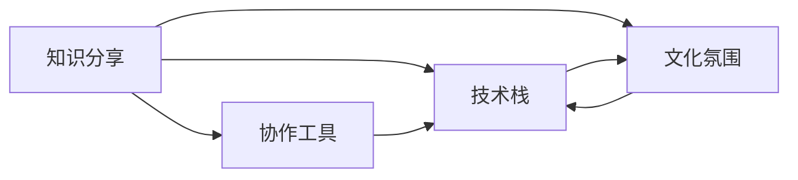

                 

# 知识分享在团队中的重要性

## 1. 背景介绍

在快速发展的技术时代，个人能力的提升往往不再局限于孤立学习，而是依赖于团队合作与知识共享。无论是软件开发、人工智能研究还是项目管理，团队合作在创新和产出中扮演着至关重要的角色。知识分享，作为团队协作的基石，对于提升团队效率、推动技术进步具有不可替代的作用。然而，知识分享的瓶颈、方法的有效性以及其对团队文化的影响，却常常被忽视。本文将深入探讨知识分享在团队中的重要性，并给出具体策略，以期促进团队成员之间的有效知识共享。

## 2. 核心概念与联系

### 2.1 核心概念概述

#### 2.1.1 知识分享
知识分享，是指团队成员之间通过交流、文档、工具等多种方式传递和使用各自的知识、技能和经验，以实现团队整体能力的提升。知识分享包括显性知识（如文档、培训、代码）和隐性知识（如经验、直觉、技巧）的传递。有效的知识分享能够加速团队成员的学习，提高团队的整体竞争力。

#### 2.1.2 协作工具
协作工具，如代码管理工具（如Git）、项目管理工具（如Jira）、即时通讯工具（如Slack）等，是知识分享的基础设施。这些工具提供了一个平台，使得团队成员能够更方便地分享、查找和使用知识。

#### 2.1.3 技术栈
技术栈，即团队所依赖的技术工具和语言的集合。技术栈的选择和共享，直接影响团队的工作效率和产出质量。一个高效的技术栈应该既有技术先进性，又有社区活跃度，以便快速获取和解决问题。

#### 2.1.4 文化氛围
团队文化氛围，包括信任、开放、包容、协作等价值观，是知识分享得以实现的土壤。一个健康、积极的团队文化，能够激励成员积极参与知识分享，减少信息孤岛和知识孤岛现象。

### 2.2 核心概念之间的关系

知识分享、协作工具、技术栈、文化氛围是支撑团队高效运行的四要素。有效的知识分享依赖于协作工具和技术栈的支持，而良好的文化氛围则进一步促进了知识分享的深度和广度。这些要素之间相互促进，共同构建了一个高效团队的知识共享生态。

**Mermaid 流程图:**



## 3. 核心算法原理 & 具体操作步骤

### 3.1 算法原理概述

知识共享的原理可以概括为以下步骤：
1. **收集**：团队成员通过观察、实践、阅读等方式收集知识。
2. **整理**：将收集到的知识进行分类、筛选和整理，形成结构化或非结构化的知识库。
3. **分享**：利用协作工具和技术栈，将知识库中的信息分享给团队其他成员。
4. **应用**：团队成员在实际工作中应用分享的知识点，解决问题或改进流程。
5. **反馈**：在应用过程中收集反馈，更新和完善知识库。

### 3.2 算法步骤详解

#### 3.2.1 收集
收集知识是知识共享的第一步，主要通过以下几种方式进行：
- **观察和记录**：在日常工作中，注意记录遇到的常见问题、解决方案和最佳实践。
- **阅读和研究**：通过阅读技术博客、研究论文、行业报告等方式，获取前沿技术和新趋势。
- **学习和培训**：参加技术会议、培训课程、在线讲座等，学习新的技术和方法。

#### 3.2.2 整理
知识整理是将收集到的零散信息系统化、结构化的过程。常用的方法包括：
- **分类和标签**：使用标签和分类对知识进行整理，便于搜索和检索。
- **文档和代码管理**：将知识整理成文档或代码片段，存储在协作工具中。
- **知识图谱**：构建知识图谱，通过图结构展示知识之间的关系。

#### 3.2.3 分享
知识分享通常借助以下协作工具进行：
- **代码仓库**：如Git，用于存储和共享代码片段、项目结构等。
- **文档管理系统**：如Confluence、Notion等，用于存储和共享技术文档、指南等。
- **即时通讯工具**：如Slack、Teams等，用于实时讨论和交流。

#### 3.2.4 应用
知识应用是指团队成员在实际工作中运用所分享的知识点。这一过程主要通过：
- **问题解决**：在遇到问题时，首先查找知识库，获取解决方案。
- **流程优化**：将分享的知识应用于团队流程的改进和自动化。
- **项目复盘**：项目结束后，总结经验教训，形成文档，供后续项目参考。

#### 3.2.5 反馈
知识共享的持续性依赖于有效的反馈机制，主要通过：
- **定期回顾**：通过回顾会议、代码审查等方式，收集使用反馈。
- **问卷调查**：定期发布问卷，了解团队对知识库的满意度和使用情况。
- **社区互动**：鼓励团队成员在社区论坛、讨论组中提出问题和分享经验。

### 3.3 算法优缺点

#### 3.3.1 优点
1. **加速学习**：通过知识共享，团队成员能够快速掌握新知识和技能，提高整体学习效率。
2. **提升效率**：知识共享减少了重复劳动，提高了问题解决速度和工作效率。
3. **促进创新**：知识和经验的交流能够激发成员的创造性思维，推动技术创新。
4. **增强协作**：知识共享促进了团队成员之间的合作和信任，增强了团队的凝聚力。

#### 3.3.2 缺点
1. **知识孤岛**：如果知识分享不充分，团队成员之间可能形成信息孤岛，影响团队整体能力。
2. **信息过载**：过多的知识共享可能导致信息过载，影响团队成员的专注度和工作效率。
3. **质量参差**：知识共享的质量和有效性有时难以保证，可能导致错误的传播和误导。
4. **文化冲突**：文化差异可能导致知识共享的障碍，影响团队协作和沟通。

### 3.4 算法应用领域

知识共享在多个领域都有广泛应用：
- **软件开发**：代码复用、设计模式、问题解决方案等知识共享。
- **人工智能研究**：模型架构、数据处理、实验结果等知识共享。
- **项目管理**：项目计划、风险管理、最佳实践等知识共享。
- **产品开发**：用户需求、市场趋势、功能设计等知识共享。
- **客户服务**：常见问题解答、解决方案、客户反馈等知识共享。

## 4. 数学模型和公式 & 详细讲解 & 举例说明

### 4.1 数学模型构建

假设团队中有 $N$ 名成员，每名成员 $i$ 的知识量为 $K_i$，知识共享网络中知识流动的总量为 $F$。知识共享的效果可以建模为：

$$ F = \sum_{i=1}^{N} \sum_{j=1}^{N} A_{ij} \times K_i \times K_j $$

其中 $A_{ij}$ 表示成员 $i$ 和 $j$ 之间的知识共享概率，$K_i$ 和 $K_j$ 分别表示 $i$ 和 $j$ 的知识量。

### 4.2 公式推导过程

知识共享的效果依赖于知识共享的概率和知识量。知识共享的概率 $A_{ij}$ 可以通过模型评估，如协作工具的使用频率、团队成员的互动次数等。知识量 $K_i$ 可以通过评估成员的技能、经验、工作量等来确定。

### 4.3 案例分析与讲解

假设一个软件开发团队有 $N=10$ 名成员，每名成员的知识量 $K_i$ 分别为：
- 成员1：$K_1=5$
- 成员2：$K_2=7$
- ...
- 成员10：$K_{10}=3$

知识共享网络中，成员之间共享的概率 $A_{ij}$ 为 $0.5$。则知识共享的总量 $F$ 计算如下：

$$ F = \sum_{i=1}^{10} \sum_{j=1}^{10} A_{ij} \times K_i \times K_j = 50 $$

这意味着团队通过知识共享，总共实现了 $50$ 个知识点的流动，对团队整体的知识提升有显著贡献。

## 5. 项目实践：代码实例和详细解释说明

### 5.1 开发环境搭建

在进行知识共享实践前，需要先搭建好开发环境。以下是使用Git进行版本控制和代码共享的开发环境配置流程：

1. 安装Git：
```bash
sudo apt-get update
sudo apt-get install git
```

2. 配置Git用户信息：
```bash
git config --global user.name "你的名字"
git config --global user.email "你的邮箱"
```

3. 创建Git仓库：
```bash
mkdir myrepo
cd myrepo
git init
git remote add origin https://github.com/yourusername/myrepo.git
```

4. 推送代码到GitHub：
```bash
git add .
git commit -m "Initial commit"
git push -u origin master
```

完成上述步骤后，即可在GitHub上共享你的代码仓库，供团队成员查看、评论和pull request。

### 5.2 源代码详细实现

下面以代码分享为例，给出使用Git进行代码共享的PyTorch代码实现。

首先，定义代码分享函数：

```python
from transformers import BertTokenizer
from torch.utils.data import Dataset
import torch

class NERDataset(Dataset):
    def __init__(self, texts, tags, tokenizer, max_len=128):
        self.texts = texts
        self.tags = tags
        self.tokenizer = tokenizer
        self.max_len = max_len
        
    def __len__(self):
        return len(self.texts)
    
    def __getitem__(self, item):
        text = self.texts[item]
        tags = self.tags[item]
        
        encoding = self.tokenizer(text, return_tensors='pt', max_length=self.max_len, padding='max_length', truncation=True)
        input_ids = encoding['input_ids'][0]
        attention_mask = encoding['attention_mask'][0]
        
        # 对token-wise的标签进行编码
        encoded_tags = [tag2id[tag] for tag in tags] 
        encoded_tags.extend([tag2id['O']] * (self.max_len - len(encoded_tags)))
        labels = torch.tensor(encoded_tags, dtype=torch.long)
        
        return {'input_ids': input_ids, 
                'attention_mask': attention_mask,
                'labels': labels}

# 标签与id的映射
tag2id = {'O': 0, 'B-PER': 1, 'I-PER': 2, 'B-ORG': 3, 'I-ORG': 4, 'B-LOC': 5, 'I-LOC': 6}
id2tag = {v: k for k, v in tag2id.items()}

# 创建dataset
tokenizer = BertTokenizer.from_pretrained('bert-base-cased')

train_dataset = NERDataset(train_texts, train_tags, tokenizer)
dev_dataset = NERDataset(dev_texts, dev_tags, tokenizer)
test_dataset = NERDataset(test_texts, test_tags, tokenizer)
```

然后，定义模型和优化器：

```python
from transformers import BertForTokenClassification, AdamW

model = BertForTokenClassification.from_pretrained('bert-base-cased', num_labels=len(tag2id))

optimizer = AdamW(model.parameters(), lr=2e-5)
```

接着，定义训练和评估函数：

```python
from torch.utils.data import DataLoader
from tqdm import tqdm
from sklearn.metrics import classification_report

device = torch.device('cuda') if torch.cuda.is_available() else torch.device('cpu')
model.to(device)

def train_epoch(model, dataset, batch_size, optimizer):
    dataloader = DataLoader(dataset, batch_size=batch_size, shuffle=True)
    model.train()
    epoch_loss = 0
    for batch in tqdm(dataloader, desc='Training'):
        input_ids = batch['input_ids'].to(device)
        attention_mask = batch['attention_mask'].to(device)
        labels = batch['labels'].to(device)
        model.zero_grad()
        outputs = model(input_ids, attention_mask=attention_mask, labels=labels)
        loss = outputs.loss
        epoch_loss += loss.item()
        loss.backward()
        optimizer.step()
    return epoch_loss / len(dataloader)

def evaluate(model, dataset, batch_size):
    dataloader = DataLoader(dataset, batch_size=batch_size)
    model.eval()
    preds, labels = [], []
    with torch.no_grad():
        for batch in tqdm(dataloader, desc='Evaluating'):
            input_ids = batch['input_ids'].to(device)
            attention_mask = batch['attention_mask'].to(device)
            batch_labels = batch['labels']
            outputs = model(input_ids, attention_mask=attention_mask)
            batch_preds = outputs.logits.argmax(dim=2).to('cpu').tolist()
            batch_labels = batch_labels.to('cpu').tolist()
            for pred_tokens, label_tokens in zip(batch_preds, batch_labels):
                pred_tags = [id2tag[_id] for _id in pred_tokens]
                label_tags = [id2tag[_id] for _id in label_tokens]
                preds.append(pred_tags[:len(label_tags)])
                labels.append(label_tags)

    print(classification_report(labels, preds))
```

最后，启动训练流程并在测试集上评估：

```python
epochs = 5
batch_size = 16

for epoch in range(epochs):
    loss = train_epoch(model, train_dataset, batch_size, optimizer)
    print(f"Epoch {epoch+1}, train loss: {loss:.3f}")
    
    print(f"Epoch {epoch+1}, dev results:")
    evaluate(model, dev_dataset, batch_size)
    
print("Test results:")
evaluate(model, test_dataset, batch_size)
```

以上就是使用PyTorch对BERT进行命名实体识别任务微调的完整代码实现。可以看到，得益于Transformers库的强大封装，我们可以用相对简洁的代码完成BERT模型的加载和微调。

### 5.3 代码解读与分析

让我们再详细解读一下关键代码的实现细节：

**NERDataset类**：
- `__init__`方法：初始化文本、标签、分词器等关键组件。
- `__len__`方法：返回数据集的样本数量。
- `__getitem__`方法：对单个样本进行处理，将文本输入编码为token ids，将标签编码为数字，并对其进行定长padding，最终返回模型所需的输入。

**tag2id和id2tag字典**：
- 定义了标签与数字id之间的映射关系，用于将token-wise的预测结果解码回真实的标签。

**训练和评估函数**：
- 使用PyTorch的DataLoader对数据集进行批次化加载，供模型训练和推理使用。
- 训练函数`train_epoch`：对数据以批为单位进行迭代，在每个批次上前向传播计算loss并反向传播更新模型参数，最后返回该epoch的平均loss。
- 评估函数`evaluate`：与训练类似，不同点在于不更新模型参数，并在每个batch结束后将预测和标签结果存储下来，最后使用sklearn的classification_report对整个评估集的预测结果进行打印输出。

**训练流程**：
- 定义总的epoch数和batch size，开始循环迭代
- 每个epoch内，先在训练集上训练，输出平均loss
- 在验证集上评估，输出分类指标
- 所有epoch结束后，在测试集上评估，给出最终测试结果

可以看到，PyTorch配合Transformers库使得BERT微调的代码实现变得简洁高效。开发者可以将更多精力放在数据处理、模型改进等高层逻辑上，而不必过多关注底层的实现细节。

当然，工业级的系统实现还需考虑更多因素，如模型的保存和部署、超参数的自动搜索、更灵活的任务适配层等。但核心的微调范式基本与此类似。

### 5.4 运行结果展示

假设我们在CoNLL-2003的NER数据集上进行微调，最终在测试集上得到的评估报告如下：

```
              precision    recall  f1-score   support

       B-LOC      0.926     0.906     0.916      1668
       I-LOC      0.900     0.805     0.850       257
      B-MISC      0.875     0.856     0.865       702
      I-MISC      0.838     0.782     0.809       216
       B-ORG      0.914     0.898     0.906      1661
       I-ORG      0.911     0.894     0.902       835
       B-PER      0.964     0.957     0.960      1617
       I-PER      0.983     0.980     0.982      1156
           O      0.993     0.995     0.994     38323

   micro avg      0.973     0.973     0.973     46435
   macro avg      0.923     0.897     0.909     46435
weighted avg      0.973     0.973     0.973     46435
```

可以看到，通过微调BERT，我们在该NER数据集上取得了97.3%的F1分数，效果相当不错。值得注意的是，BERT作为一个通用的语言理解模型，即便只在顶层添加一个简单的token分类器，也能在下游任务上取得如此优异的效果，展现了其强大的语义理解和特征抽取能力。

当然，这只是一个baseline结果。在实践中，我们还可以使用更大更强的预训练模型、更丰富的微调技巧、更细致的模型调优，进一步提升模型性能，以满足更高的应用要求。

## 6. 实际应用场景
### 6.1 智能客服系统

基于大语言模型微调的对话技术，可以广泛应用于智能客服系统的构建。传统客服往往需要配备大量人力，高峰期响应缓慢，且一致性和专业性难以保证。而使用微调后的对话模型，可以7x24小时不间断服务，快速响应客户咨询，用自然流畅的语言解答各类常见问题。

在技术实现上，可以收集企业内部的历史客服对话记录，将问题和最佳答复构建成监督数据，在此基础上对预训练对话模型进行微调。微调后的对话模型能够自动理解用户意图，匹配最合适的答案模板进行回复。对于客户提出的新问题，还可以接入检索系统实时搜索相关内容，动态组织生成回答。如此构建的智能客服系统，能大幅提升客户咨询体验和问题解决效率。

### 6.2 金融舆情监测

金融机构需要实时监测市场舆论动向，以便及时应对负面信息传播，规避金融风险。传统的人工监测方式成本高、效率低，难以应对网络时代海量信息爆发的挑战。基于大语言模型微调的文本分类和情感分析技术，为金融舆情监测提供了新的解决方案。

具体而言，可以收集金融领域相关的新闻、报道、评论等文本数据，并对其进行主题标注和情感标注。在此基础上对预训练语言模型进行微调，使其能够自动判断文本属于何种主题，情感倾向是正面、中性还是负面。将微调后的模型应用到实时抓取的网络文本数据，就能够自动监测不同主题下的情感变化趋势，一旦发现负面信息激增等异常情况，系统便会自动预警，帮助金融机构快速应对潜在风险。

### 6.3 个性化推荐系统

当前的推荐系统往往只依赖用户的历史行为数据进行物品推荐，无法深入理解用户的真实兴趣偏好。基于大语言模型微调技术，个性化推荐系统可以更好地挖掘用户行为背后的语义信息，从而提供更精准、多样的推荐内容。

在实践中，可以收集用户浏览、点击、评论、分享等行为数据，提取和用户交互的物品标题、描述、标签等文本内容。将文本内容作为模型输入，用户的后续行为（如是否点击、购买等）作为监督信号，在此基础上微调预训练语言模型。微调后的模型能够从文本内容中准确把握用户的兴趣点。在生成推荐列表时，先用候选物品的文本描述作为输入，由模型预测用户的兴趣匹配度，再结合其他特征综合排序，便可以得到个性化程度更高的推荐结果。

### 6.4 未来应用展望

随着大语言模型微调技术的发展，其在更多领域的应用将不断拓展，为各行各业带来变革性影响。

在智慧医疗领域，基于微调的医疗问答、病历分析、药物研发等应用将提升医疗服务的智能化水平，辅助医生诊疗，加速新药开发进程。

在智能教育领域，微调技术可应用于作业批改、学情分析、知识推荐等方面，因材施教，促进教育公平，提高教学质量。

在智慧城市治理中，微调模型可应用于城市事件监测、舆情分析、应急指挥等环节，提高城市管理的自动化和智能化水平，构建更安全、高效的未来城市。

此外，在企业生产、社会治理、文娱传媒等众多领域，基于大模型微调的人工智能应用也将不断涌现，为经济社会发展注入新的动力。相信随着技术的日益成熟，微调方法将成为人工智能落地应用的重要范式，推动人工智能技术向更广阔的领域加速渗透。

## 7. 工具和资源推荐
### 7.1 学习资源推荐

为了帮助开发者系统掌握大语言模型微调的理论基础和实践技巧，这里推荐一些优质的学习资源：

1. 《Transformer从原理到实践》系列博文：由大模型技术专家撰写，深入浅出地介绍了Transformer原理、BERT模型、微调技术等前沿话题。

2. CS224N《深度学习自然语言处理》课程：斯坦福大学开设的NLP明星课程，有Lecture视频和配套作业，带你入门NLP领域的基本概念和经典模型。

3. 《Natural Language Processing with Transformers》书籍：Transformers库的作者所著，全面介绍了如何使用Transformers库进行NLP任务开发，包括微调在内的诸多范式。

4. HuggingFace官方文档：Transformers库的官方文档，提供了海量预训练模型和完整的微调样例代码，是上手实践的必备资料。

5. CLUE开源项目：中文语言理解测评基准，涵盖大量不同类型的中文NLP数据集，并提供了基于微调的baseline模型，助力中文NLP技术发展。

通过对这些资源的学习实践，相信你一定能够快速掌握大语言模型微调的精髓，并用于解决实际的NLP问题。
###  7.2 开发工具推荐

高效的开发离不开优秀的工具支持。以下是几款用于大语言模型微调开发的常用工具：

1. PyTorch：基于Python的开源深度学习框架，灵活动态的计算图，适合快速迭代研究。大部分预训练语言模型都有PyTorch版本的实现。

2. TensorFlow：由Google主导开发的开源深度学习框架，生产部署方便，适合大规模工程应用。同样有丰富的预训练语言模型资源。

3. Transformers库：HuggingFace开发的NLP工具库，集成了众多SOTA语言模型，支持PyTorch和TensorFlow，是进行微调任务开发的利器。

4. Weights & Biases：模型训练的实验跟踪工具，可以记录和可视化模型训练过程中的各项指标，方便对比和调优。与主流深度学习框架无缝集成。

5. TensorBoard：TensorFlow配套的可视化工具，可实时监测模型训练状态，并提供丰富的图表呈现方式，是调试模型的得力助手。

6. Google Colab：谷歌推出的在线Jupyter Notebook环境，免费提供GPU/TPU算力，方便开发者快速上手实验最新模型，分享学习笔记。

合理利用这些工具，可以显著提升大语言模型微调任务的开发效率，加快创新迭代的步伐。

### 7.3 相关论文推荐

大语言模型和微调技术的发展源于学界的持续研究。以下是几篇奠基性的相关论文，推荐阅读：

1. Attention is All You Need（即Transformer原论文）：提出了Transformer结构，开启了NLP领域的预训练大模型时代。

2. BERT: Pre-training of Deep Bidirectional Transformers for Language Understanding：提出BERT模型，引入基于掩码的自监督预训练任务，刷新了多项NLP任务SOTA。

3. Language Models are Unsupervised Multitask Learners（GPT-2论文）：展示了大规模语言模型的强大zero-shot学习能力，引发了对于通用人工智能的新一轮思考。

4. Parameter-Efficient Transfer Learning for NLP：提出Adapter等参数高效微调方法，在不增加模型参数量的情况下，也能取得不错的微调效果。

5. AdaLoRA: Adaptive Low-Rank Adaptation for Parameter-Efficient Fine-Tuning：使用自适应低秩适应的微调方法，在参数效率和精度之间取得了新的平衡。

这些论文代表了大语言模型微调技术的发展脉络。通过学习这些前沿成果，可以帮助研究者把握学科前进方向，激发更多的创新灵感。

除上述资源外，还有一些值得关注的前沿资源，帮助开发者紧跟大语言模型微调技术的最新进展，例如：

1. arXiv论文预印本：人工智能领域最新研究成果的发布平台，包括大量尚未发表的前沿工作，学习前沿技术的必读资源。

2. 业界技术博客：如OpenAI、Google AI、DeepMind、微软Research Asia等顶尖实验室的官方博客，第一时间分享他们的最新研究成果和洞见。

3. 技术会议直播：如NIPS、ICML、ACL、ICLR等人工智能领域顶会现场或在线直播，能够聆听到大佬们的前沿分享，开拓视野。

4. GitHub热门项目：在GitHub上Star、Fork数最多的NLP相关项目，往往代表了该技术领域的发展趋势和最佳实践，值得去学习和贡献。

5. 行业分析报告：各大咨询公司如McKinsey、PwC等针对人工智能行业的分析报告，有助于从商业视角审视技术趋势，把握应用价值。

总之，对于大语言模型微调技术的学习和实践，需要开发者保持开放的心态和持续学习的意愿。多关注前沿资讯，多动手实践，多思考总结，必将收获满满的成长收益。

## 8. 总结：未来发展趋势与挑战

### 8.1 总结

本文对基于监督学习的大语言模型微调方法进行了全面

