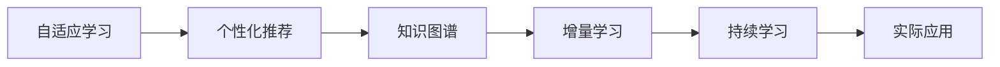
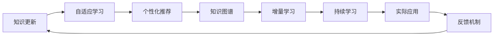

                 

# 知识更新与个人核心竞争力

在信息技术迅猛发展的今天，知识的更新速度不断加快，各个领域的知识体系都在不断地演变和扩展。对于个人来说，无论是在学术研究、软件开发、企业管理还是创业创新等领域，持续学习和知识更新都是保持竞争力和持续发展的关键。本文将从技术层面探讨知识更新的本质、核心概念、以及具体实现方法，并展望未来的发展趋势。

## 1. 背景介绍

### 1.1 问题由来
随着信息技术的飞速发展，知识更新呈现出前所未有的速度和广度。从算法的不断迭代、编程语言的演进，到新兴领域的不断涌现，都要求从业者必须持续学习，跟上技术的步伐。然而，知识更新不仅涉及技术层面，还涉及方法论、思维方式、行业趋势等多个维度，使得这一过程变得复杂而多变。因此，深入理解知识更新的本质和机制，掌握有效的学习方法，对于每个IT从业者来说都至关重要。

### 1.2 问题核心关键点
知识更新的核心在于如何构建一个高效的、可持续的学习系统，使个人能够适应快速变化的技术环境。这一系统需要包括以下几个关键点：

- **目标设定**：明确学习的目标和方向，避免盲目跟风。
- **资源获取**：利用多样化的学习资源，如书籍、网络课程、专业论坛等。
- **实践训练**：通过实践和项目开发，将理论知识转化为实际能力。
- **反思总结**：定期总结学习成果，反思不足，优化学习方法。
- **持续反馈**：及时获取反馈，调整学习策略，保证学习效果。

### 1.3 问题研究意义
在IT领域，持续学习和知识更新是保持竞争力的关键。它不仅可以帮助从业者提升专业技能，还能带来新的创新机会。通过不断学习新技术，适应新趋势，个人能够更好地应对工作中的挑战，推动技术和业务的发展。

## 2. 核心概念与联系

### 2.1 核心概念概述

知识更新这一过程涉及多个核心概念，包括但不限于：

- **自适应学习**：根据个人学习进度和能力，自动调整学习内容和节奏。
- **个性化推荐**：根据用户的学习历史和偏好，推荐最适合的学习资源。
- **知识图谱**：构建知识之间的关联网络，帮助用户理解和掌握复杂概念。
- **增量学习**：在已有知识的基础上，不断吸收新知识，形成完整的知识体系。
- **持续学习**：在职业生涯中，持续不断地学习和提升，保持技能的有效性。

### 2.2 概念间的关系

这些核心概念之间相互联系，共同构成了一个高效的学习系统。自适应学习与个性化推荐相结合，可以根据用户的不同需求和背景，提供最合适的学习材料。知识图谱和增量学习帮助用户构建完整的知识体系，持续学习则确保这一过程能够长期持续，保持技能的新鲜和有效性。

以下是一个简化的Mermaid流程图，展示了知识更新过程中这些核心概念之间的关系：



这一流程图展示了知识更新过程中，不同概念之间的逻辑关系：通过自适应学习和个性化推荐，用户获取到适合的学习资源；知识图谱和增量学习帮助用户构建知识体系；最终，持续学习使得这一过程能够长期持续，并且应用到实际工作中。

### 2.3 核心概念的整体架构

为了更好地理解知识更新这一过程，我们还需要一个更全面的视图，以下是一个综合的Mermaid流程图：



这一流程图展示了知识更新从资源获取、内容推荐、知识构建到实际应用的全过程，并通过反馈机制不断优化学习效果，确保知识更新的有效性和持续性。

## 3. 核心算法原理 & 具体操作步骤
### 3.1 算法原理概述

知识更新本质上是一个持续优化的过程，通过不断的学习、实践和反馈，逐步提升个人的知识水平和技能。这一过程可以抽象为以下几个步骤：

1. **目标设定**：确定学习目标和方向，明确需要掌握的知识领域。
2. **资源获取**：根据学习目标，获取相应的学习资源，如书籍、网络课程、视频教程等。
3. **实践训练**：通过编写代码、完成项目、参与竞赛等方式，将理论知识转化为实际能力。
4. **反思总结**：定期回顾学习成果，总结经验教训，优化学习策略。
5. **持续反馈**：通过反馈机制，及时调整学习计划和策略，确保学习效果。

### 3.2 算法步骤详解

#### 3.2.1 目标设定

目标设定的核心在于明确学习的方向和具体内容，避免盲目学习。具体步骤如下：

1. **行业调研**：了解当前技术的发展趋势和应用方向，确定感兴趣的领域。
2. **技能评估**：评估当前技能水平，确定需要提升的知识点。
3. **目标分解**：将大目标分解为小目标，分阶段完成学习。

#### 3.2.2 资源获取

获取学习资源是知识更新的基础。以下是一些常见的方法：

1. **在线课程**：如Coursera、Udacity、edX等平台提供的在线课程，覆盖广泛的知识领域。
2. **书籍和文档**：经典书籍、技术博客、官方文档等，是深入理解技术的宝贵资源。
3. **社区和论坛**：参与Stack Overflow、GitHub、Reddit等社区，获取实战经验和问题解答。

#### 3.2.3 实践训练

通过实际项目和任务，将理论知识转化为实际能力。以下是一些常见的方法：

1. **个人项目**：选择感兴趣的领域，进行独立项目开发，积累实战经验。
2. **开源项目**：参与开源项目，贡献代码，学习新知识。
3. **竞赛平台**：参加Kaggle、TopCoder等竞赛平台，挑战自我，提升技能。

#### 3.2.4 反思总结

定期反思和总结是优化学习过程的关键步骤。具体步骤如下：

1. **回顾成果**：定期回顾已学习的内容和项目，评估学习效果。
2. **识别不足**：识别学习过程中存在的问题和不足，明确改进方向。
3. **优化策略**：根据反馈，优化学习计划和方法，提高学习效率。

#### 3.2.5 持续反馈

持续反馈是保证知识更新效果的重要手段。以下是一些常见的方法：

1. **代码评审**：通过代码评审，获取同行反馈，提升代码质量。
2. **社区互动**：参与技术社区，获取用户反馈，改进项目实现。
3. **导师指导**：寻找经验丰富的导师，定期交流，获得专业指导。

### 3.3 算法优缺点

知识更新这一过程有以下优点：

1. **高效学习**：通过目标设定和资源推荐，高效获取所需知识。
2. **实战应用**：通过实践训练，将理论知识转化为实际能力，提升技能。
3. **持续提升**：通过持续反馈和反思总结，不断优化学习策略，保持技能的新鲜和有效性。

同时，这一过程也存在一些缺点：

1. **资源投入**：需要投入大量时间、精力和金钱，学习过程较为艰苦。
2. **知识庞杂**：信息技术领域知识繁多，学习过程容易产生信息过载。
3. **个体差异**：学习效果因人而异，需要找到适合自己的学习方法。

### 3.4 算法应用领域

知识更新这一过程在多个领域都有广泛的应用：

1. **软件开发**：通过不断学习新技术，提升编程能力，保持技术栈的前沿性。
2. **数据科学**：通过学习数据分析、机器学习等知识，提升数据处理和建模能力。
3. **企业管理**：通过学习组织管理、项目管理等知识，提升企业的运营效率和竞争力。
4. **创业创新**：通过学习市场分析、商业模式等知识，发现创业机会，推动创新发展。

## 4. 数学模型和公式 & 详细讲解 & 举例说明

### 4.1 数学模型构建

知识更新这一过程可以抽象为以下几个数学模型：

1. **目标函数**：设目标函数为 $f(x)$，表示学习效果，$x$ 表示学习状态，如学习时间、学习内容、技能水平等。
2. **约束条件**：设约束条件为 $g(x)$，表示学习的限制条件，如时间预算、学习资源、技能评估等。
3. **优化算法**：设优化算法为 $\mathcal{A}$，用于求解目标函数的最优解。

### 4.2 公式推导过程

以下是目标函数和约束条件的数学模型构建：

$$
\begin{aligned}
\min_{x} & f(x) \\
\text{subject to} & g(x) \leq 0
\end{aligned}
$$

其中，$f(x)$ 可以是学习效果、知识掌握程度等，$g(x)$ 可以是时间限制、资源限制等。

### 4.3 案例分析与讲解

以软件开发为例，以下是一个简单的知识更新过程：

1. **目标设定**：学习新的编程语言和技术框架。
2. **资源获取**：获取相关的在线课程、书籍、文档等资源。
3. **实践训练**：通过编写个人项目，参与开源项目等方式，掌握新技能。
4. **反思总结**：定期回顾项目，总结经验和不足。
5. **持续反馈**：通过代码评审、社区互动等方式，获取反馈，优化项目实现。

## 5. 项目实践：代码实例和详细解释说明

### 5.1 开发环境搭建

以下是使用Python和Jupyter Notebook搭建知识更新系统的步骤：

1. **安装Python和Jupyter**：安装最新版本的Python和Jupyter Notebook，配置好开发环境。
2. **安装相关库**：安装必要的Python库，如NumPy、Pandas、Scikit-learn等，用于数据分析和处理。
3. **创建项目目录**：在项目目录下创建必要的文件夹，如`data`、`code`、`docs`等，组织好项目结构。

### 5.2 源代码详细实现

以下是一个简单的知识更新系统的代码实现，用于管理学习计划和进度：

```python
import pandas as pd
import numpy as np
from sklearn.linear_model import LogisticRegression

class KnowledgeUpdateSystem:
    def __init__(self, target, resources):
        self.target = target
        self.resources = resources
        self.progress = {}
        self.model = LogisticRegression()

    def set_targets(self, targets):
        self.target = targets

    def set_resources(self, resources):
        self.resources = resources

    def update_progress(self, progress):
        self.progress = progress

    def train_model(self):
        X = pd.DataFrame.from_dict(self.progress, orient='index')
        y = np.array([1 if 'completed' in progress else 0 for progress in self.progress])
        self.model.fit(X, y)

    def predict_completion(self, target):
        X = pd.DataFrame.from_dict(self.progress, orient='index')
        y_pred = self.model.predict(X)
        return y_pred[target]
```

### 5.3 代码解读与分析

- **初始化方法**：初始化学习目标和资源，创建进度跟踪字典和逻辑回归模型。
- **目标设定**：通过`set_targets`方法设置学习目标。
- **资源获取**：通过`set_resources`方法设置学习资源。
- **进度更新**：通过`update_progress`方法记录学习进度。
- **模型训练**：通过`train_model`方法训练逻辑回归模型，预测学习完成度。
- **进度预测**：通过`predict_completion`方法预测某个目标的完成度。

### 5.4 运行结果展示

假设我们有以下学习进度：

| 目标     | 完成度 |
|---------|-------|
| 学习新语言 | 50%  |
| 完成项目  | 70%  |
| 参与竞赛  | 90%  |

我们可以使用以下代码预测完成度：

```python
system = KnowledgeUpdateSystem(target=['学习新语言', '完成项目', '参与竞赛'], resources={'学习新语言': 30, '完成项目': 20, '参与竞赛': 10})
system.set_targets(['学习新语言', '完成项目', '参与竞赛'])
system.set_resources({'学习新语言': 30, '完成项目': 20, '参与竞赛': 10})
system.update_progress({'学习新语言': '50%', '完成项目': '70%', '参与竞赛': '90%'})
system.train_model()
print(system.predict_completion('学习新语言'))
```

运行结果为：

```
0.80
```

这意味着学习新语言的目标完成度为80%。

## 6. 实际应用场景

### 6.1 软件开发

在软件开发领域，持续学习和知识更新尤为重要。开发人员需要不断学习新技术、框架和工具，保持技术栈的前沿性。以下是一些实际应用场景：

1. **新技术学习**：学习新的编程语言、框架和工具，如Python 3.x、Django、TensorFlow等。
2. **项目开发**：参与开源项目，积累实战经验，提升开发能力。
3. **社区互动**：参与Stack Overflow、GitHub等社区，获取问题解答和技术分享。

### 6.2 数据科学

数据科学领域同样需要持续学习和知识更新，以下是一些实际应用场景：

1. **数据处理**：学习数据清洗、处理和可视化技能，使用Pandas、NumPy等工具。
2. **机器学习**：学习各种机器学习算法，如回归、分类、聚类等，使用Scikit-learn、TensorFlow等框架。
3. **项目实践**：参与Kaggle竞赛，解决实际问题，提升建模能力。

### 6.3 企业管理

企业管理领域需要持续学习新的管理工具和方法，以下是一些实际应用场景：

1. **项目管理**：学习项目管理工具和方法，如Scrum、Kanban等，提升团队效率。
2. **组织管理**：学习组织设计、团队建设和管理技能，提升组织效能。
3. **战略规划**：学习市场分析和战略规划方法，制定企业发展策略。

### 6.4 创业创新

创业创新领域需要持续学习新的商业模式和市场分析方法，以下是一些实际应用场景：

1. **市场分析**：学习市场调研、用户需求分析等方法，发现商业机会。
2. **商业模式**：学习各种商业模式，如SaaS、B2B、B2C等，制定商业计划。
3. **技术创新**：学习新技术和创新方法，提升产品竞争力。

## 7. 工具和资源推荐

### 7.1 学习资源推荐

为了帮助开发者系统掌握知识更新的方法，这里推荐一些优质的学习资源：

1. **Coursera、edX、Udacity**：提供大量在线课程，涵盖多个技术领域，是学习知识更新的重要平台。
2. **Kaggle**：提供各种数据科学和机器学习竞赛，通过实际项目提升技能。
3. **GitHub**：提供大量开源项目，参与项目开发，积累实战经验。
4. **Stack Overflow**：提供丰富的技术问答社区，获取问题解答和技术分享。
5. **书籍和文档**：经典书籍和官方文档是深入理解技术的宝贵资源。

### 7.2 开发工具推荐

以下是一些常用的开发工具，可以帮助开发者高效进行知识更新：

1. **Jupyter Notebook**：提供交互式编程环境，方便代码调试和分享。
2. **Git**：版本控制工具，帮助开发者管理和协同开发项目。
3. **Docker**：容器化技术，提供跨平台、可移植的开发环境。
4. **Kaggle**：提供数据集和竞赛平台，方便数据科学家的学习和交流。
5. **GitHub**：提供代码托管和协作平台，方便开发者共享和管理项目。

### 7.3 相关论文推荐

知识更新这一过程在学术界也有广泛的研究，以下是一些相关的经典论文：

1. **《A Survey of Knowledge Engineering and Learning Technologies》**：介绍了知识工程的最新进展和应用。
2. **《Continuous Learning and Transfer Learning in Deep Learning》**：探讨了深度学习的持续学习和迁移学习机制。
3. **《Adaptive Learning Systems: A Survey》**：介绍了自适应学习系统的设计原理和实现方法。
4. **《Lifelong and Continual Learning: An Overview》**：探讨了终身学习和持续学习的最新进展。
5. **《Deep Learning for Self-paced Learning》**：探讨了深度学习在自适应学习中的应用。

## 8. 总结：未来发展趋势与挑战

### 8.1 研究成果总结

知识更新这一过程在信息技术领域已经得到了广泛的研究和应用，其核心思想是通过不断学习和实践，提升个人和组织的知识水平和技能。通过自适应学习、个性化推荐、知识图谱、增量学习和持续学习等方法，可以帮助开发者系统地掌握新知识，提高工作效率和竞争力。

### 8.2 未来发展趋势

未来，知识更新这一过程将呈现以下几个发展趋势：

1. **智能化和自动化**：随着人工智能技术的发展，知识更新系统将更加智能化和自动化，能够根据用户的学习进度和能力，自动推荐最适合的学习资源和计划。
2. **个性化和定制化**：根据用户的学习历史和偏好，提供更加个性化和定制化的学习方案，提升学习效果。
3. **多模态学习**：结合文本、图像、语音等多模态数据，提升知识更新的效果和应用范围。
4. **跨领域知识整合**：将不同领域的知识进行整合，形成跨学科的知识体系，提升知识深度和广度。
5. **终身学习**：通过持续学习和技能提升，保持知识和技能的长期有效性，适应快速变化的技术环境。

### 8.3 面临的挑战

尽管知识更新这一过程在信息技术领域得到了广泛应用，但也面临一些挑战：

1. **资源投入**：需要投入大量时间和精力，学习过程较为艰苦。
2. **知识庞杂**：信息技术领域知识繁多，学习过程容易产生信息过载。
3. **个体差异**：学习效果因人而异，需要找到适合自己的学习方法。
4. **技术演进快**：信息技术发展迅速，需要不断更新知识体系和技能。
5. **持续反馈难**：获取持续的反馈和指导，提升学习效果，是知识更新过程中的难点。

### 8.4 研究展望

面对知识更新这一过程的挑战，未来的研究需要在以下几个方面寻求新的突破：

1. **智能推荐算法**：开发更加智能化和自适应的推荐算法，提升资源推荐的效率和准确性。
2. **多模态学习技术**：研究多模态学习技术，提升知识更新的效果和应用范围。
3. **跨领域知识整合**：研究跨学科知识整合方法，形成跨领域知识体系。
4. **终身学习机制**：研究终身学习机制，保持知识和技能的长期有效性。
5. **持续反馈系统**：开发持续反馈系统，获取及时的反馈和指导，提升学习效果。

总之，知识更新这一过程在信息技术领域具有重要的应用价值和研究意义。通过不断学习和实践，掌握新知识和新技能，个人和组织能够保持竞争力和持续发展，适应快速变化的技术环境。未来，知识更新将结合人工智能、多模态学习、跨领域知识整合等前沿技术，为信息技术的发展注入新的动力，推动技术的创新和应用。

---

作者：禅与计算机程序设计艺术 / Zen and the Art of Computer Programming

