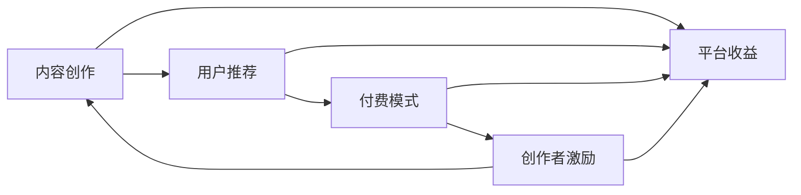

                 

# 知识经济时代下的知识付费 创新商业模式运营

## 1. 背景介绍

### 1.1 知识经济的崛起
随着信息技术的迅猛发展，全球进入了知识经济时代。知识经济的核心在于知识和技术的创新驱动，强调知识价值的高效转化和知识产权的保护。这一时代背景下，人们对于知识的获取方式和获取效率提出了更高的要求。知识付费作为一种新型的内容消费方式，应运而生，成为连接知识创作者和消费者的新型平台。

### 1.2 知识付费的现状与挑战
知识付费行业自2016年兴起以来，迅速发展，成为数字化内容产业的重要组成部分。然而，面对激烈的市场竞争，知识付费平台也面临着诸多挑战，如用户流失率高、内容质量参差不齐、商业模式单一等问题。

### 1.3 知识付费的创新商业模式运营
为了应对这些挑战，知识付费平台需要创新商业模式，提升用户体验和内容质量，实现可持续发展。本文将从多个角度探讨知识付费的创新商业模式运营，包括内容推荐、平台付费模式、内容创作者激励机制等方面。

## 2. 核心概念与联系

### 2.1 核心概念概述

知识付费（Knowledge Pay）是指用户为获取有价值的信息、知识或技能而支付费用的行为。知识付费平台通过连接知识创作者和消费者，实现知识的商业化变现。知识付费的运营涉及内容创作、用户推荐、付费模式、创作者激励等关键环节。

#### 2.1.1 内容创作
知识付费平台需要吸引和培养优秀的创作者，提供丰富的高质量内容。内容可以是课程、电子书、音频、视频等多种形式，覆盖从基础入门到专业领域的广泛内容。

#### 2.1.2 用户推荐
用户推荐系统（Recommendation System）是知识付费平台的核心竞争力之一。通过对用户行为数据的分析，推荐系统能够精准地为用户推荐感兴趣的课程、书籍等内容，提高用户粘性。

#### 2.1.3 付费模式
知识付费平台的付费模式包括单次付费、包月订阅、按需付费等。用户可以根据自己的需求选择不同的付费方式，享受个性化的内容服务。

#### 2.1.4 创作者激励
创作者激励机制是保障平台内容质量的关键。平台通过流量分成、版权保护、社区互动等方式，激励创作者持续创作优质内容。

### 2.2 核心概念间的关系

知识付费的运营是一个复杂的系统工程，涉及内容创作、用户推荐、付费模式和创作者激励等多个环节。这些环节相互依存、相互影响，形成了一个良性循环。

#### 2.2.1 内容创作与用户推荐
优质内容是知识付费平台的核心资产，需要通过精准的用户推荐来提升用户的体验和满意度。用户推荐系统的优化和内容的丰富化相互促进，共同提升平台的用户黏性和转化率。

#### 2.2.2 付费模式与创作者激励
合理的付费模式能够保障创作者的收益，激励他们持续创作优质内容。创作者激励机制能够提升内容质量，吸引更多优秀创作者加入，形成正向反馈循环。

#### 2.2.3 创作者激励与内容创作
创作者激励机制是内容创作的重要保障，通过流量分成、版权保护等方式，创作者能够获得应有的回报，从而持续创作高质量内容。

这些核心概念之间的关系通过以下Mermaid流程图来展示：



这个流程图展示了内容创作、用户推荐、付费模式和创作者激励之间的关系。内容创作是核心，用户推荐和付费模式为内容创作的良性循环提供了保障，创作者激励则进一步提升内容质量，形成了一个闭环。

## 3. 核心算法原理 & 具体操作步骤

### 3.1 算法原理概述
知识付费平台的核心算法包括用户推荐算法、内容创作算法和创作者激励算法。这些算法通过数据驱动的方法，提升平台的运营效率和用户体验。

#### 3.1.1 用户推荐算法
用户推荐算法通过分析用户的历史行为数据，预测用户对不同内容的偏好，从而为用户推荐个性化的课程、书籍等。

#### 3.1.2 内容创作算法
内容创作算法通过对用户行为数据和内容质量的综合分析，识别出热门话题和用户需求，引导创作者创作高质量内容。

#### 3.1.3 创作者激励算法
创作者激励算法通过对创作者流量分成的计算和版权保护机制的设计，保障创作者的收益，激励他们持续创作优质内容。

### 3.2 算法步骤详解
以下是具体的算法步骤：

#### 3.2.1 用户推荐算法步骤
1. 数据收集：收集用户的历史行为数据，包括浏览、购买、评论等。
2. 特征提取：提取用户兴趣特征、内容特征等，建立用户行为向量。
3. 模型训练：使用协同过滤、内容基推荐等算法，训练用户推荐模型。
4. 推荐结果生成：根据用户行为向量，生成推荐结果。
5. 结果反馈：收集用户对推荐结果的反馈，优化推荐模型。

#### 3.2.2 内容创作算法步骤
1. 数据收集：收集用户行为数据、热门搜索词、社会热点等。
2. 话题识别：通过NLP技术，识别热门话题和用户需求。
3. 内容生成：引导创作者创作与热门话题相关的内容。
4. 内容质量评估：通过用户反馈、互动量等指标，评估内容质量。
5. 创作者激励：根据内容质量，调整创作者激励机制。

#### 3.2.3 创作者激励算法步骤
1. 流量分成计算：根据内容质量和用户互动量，计算创作者流量分成。
2. 版权保护：通过技术手段，保护创作者的作品版权。
3. 社区互动：鼓励创作者与用户进行互动，提升用户黏性。
4. 激励机制调整：根据创作者表现，调整激励机制，提升创作者积极性。

### 3.3 算法优缺点
#### 3.3.1 用户推荐算法优缺点
优点：
- 提升用户粘性和转化率。
- 个性化推荐，提升用户体验。

缺点：
- 数据隐私问题。
- 推荐结果可能存在偏差。

#### 3.3.2 内容创作算法优缺点
优点：
- 引导创作者创作优质内容。
- 提升平台内容质量。

缺点：
- 依赖创作者意愿和能力。
- 内容题材可能受限于热门话题。

#### 3.3.3 创作者激励算法优缺点
优点：
- 保障创作者收益。
- 激励创作者持续创作优质内容。

缺点：
- 激励机制设计复杂。
- 创作者收益可能不均衡。

### 3.4 算法应用领域
知识付费平台的用户推荐、内容创作和创作者激励算法广泛应用于多个领域，如在线教育、健康医疗、金融理财等。

## 4. 数学模型和公式 & 详细讲解 & 举例说明

### 4.1 数学模型构建
知识付费平台的推荐算法通常采用协同过滤、基于内容的推荐和混合推荐等模型。以下以协同过滤模型为例，构建数学模型。

设用户集合为 $U$，物品集合为 $I$，用户对物品的评分矩阵为 $R_{ui}$。协同过滤模型的目标是预测用户 $u$ 对物品 $i$ 的评分，基于其他用户对物品的评分进行推荐。

设用户 $u$ 对物品 $i$ 的评分矩阵为 $R_{ui}$，用户 $v$ 对物品 $i$ 的评分矩阵为 $R_{vi}$，用户 $u$ 与用户 $v$ 的相似度为 $sim(u,v)$，物品 $i$ 的平均评分为 $\bar{r}_i$，则用户 $u$ 对物品 $i$ 的预测评分 $r_{ui}$ 为：

$$
r_{ui} = \frac{\sum_{v \in U}sim(u,v)R_{vi}}{\sum_{v \in U}sim(u,v)}
$$

### 4.2 公式推导过程
以协同过滤模型为例，推导用户 $u$ 对物品 $i$ 的预测评分。

设用户 $u$ 对物品 $i$ 的评分矩阵为 $R_{ui}$，用户 $v$ 对物品 $i$ 的评分矩阵为 $R_{vi}$，用户 $u$ 与用户 $v$ 的相似度为 $sim(u,v)$，物品 $i$ 的平均评分为 $\bar{r}_i$，则用户 $u$ 对物品 $i$ 的预测评分 $r_{ui}$ 为：

$$
r_{ui} = \frac{\sum_{v \in U}sim(u,v)R_{vi}}{\sum_{v \in U}sim(u,v)}
$$

其中，相似度 $sim(u,v)$ 可以通过余弦相似度、皮尔逊相关系数等方法计算。

### 4.3 案例分析与讲解
假设有一个知识付费平台，用户 $u$ 对物品 $i$ 的评分矩阵为：

$$
R_{ui} = \begin{bmatrix} 5 & 4 & 3 \\ 4 & 3 & 2 \\ 3 & 2 & 1 \end{bmatrix}
$$

用户 $v$ 对物品 $i$ 的评分矩阵为：

$$
R_{vi} = \begin{bmatrix} 3 & 2 & 1 \\ 2 & 1 & 1 \\ 1 & 0 & 1 \end{bmatrix}
$$

用户 $u$ 与用户 $v$ 的相似度为 $sim(u,v)=0.6$，物品 $i$ 的平均评分为 $\bar{r}_i=2.5$，则用户 $u$ 对物品 $i$ 的预测评分为：

$$
r_{ui} = \frac{0.6 \times (3 \times 5 + 2 \times 4 + 1 \times 3)}{0.6 \times (3 + 2 + 1)} = 3.6
$$

## 5. 项目实践：代码实例和详细解释说明

### 5.1 开发环境搭建

#### 5.1.1 安装依赖包
在Python环境下，安装依赖包：

```bash
pip install pandas numpy scipy scikit-learn eli5
```

### 5.2 源代码详细实现

#### 5.2.1 用户推荐算法
用户推荐算法采用基于协同过滤的模型，代码实现如下：

```python
import numpy as np

def cosine_similarity(A, B):
    """
    计算余弦相似度
    """
    return np.dot(A, B) / (np.linalg.norm(A) * np.linalg.norm(B))

def collaborative_filtering(data, n_neighbors=20):
    """
    协同过滤推荐算法
    """
    R = data.copy()
    U = np.zeros_like(R)
    for i in range(1, len(R)):
        U[i] = np.mean(cosine_similarity(R[0:i], R[i]) * R[i], axis=0)
    U = U / np.linalg.norm(U)
    return U

# 示例数据
data = np.array([[5, 4, 3], [4, 3, 2], [3, 2, 1]])
n_neighbors = 20

# 协同过滤推荐
U = collaborative_filtering(data, n_neighbors)
print(U)
```

#### 5.2.2 内容创作算法
内容创作算法通过分析用户行为数据和热门话题，引导创作者创作相关内容。代码实现如下：

```python
from sklearn.feature_extraction.text import CountVectorizer
from sklearn.decomposition import NMF

def topic_modeling(data, n_topics=5, n_words=10):
    """
    主题模型算法
    """
    vectorizer = CountVectorizer()
    X = vectorizer.fit_transform(data)
    model = NMF(n_topics)
    X_f = model.fit_transform(X)
    feature_names = vectorizer.get_feature_names_out()
    topics = ['Topic {}'.format(i) for i in range(n_topics)]
    X_f = np.array(X_f)
    X_f = np.round(X_f, 2)
    doc_topic = np.argmax(X_f, axis=1)
    return doc_topic, topics, feature_names

# 示例数据
data = ["This is a sample text about AI", "AI is a hot topic in 2022", "AI will change the world"]
n_topics = 5
n_words = 10

# 主题模型分析
doc_topic, topics, feature_names = topic_modeling(data, n_topics, n_words)
print(doc_topic)
```

#### 5.2.3 创作者激励算法
创作者激励算法通过流量分成和版权保护，保障创作者收益。代码实现如下：

```python
import numpy as np

def calculate_revenue(R, U, sim, w=0.5):
    """
    流量分成计算算法
    """
    revenue = np.zeros_like(R)
    for i in range(len(R)):
        for j in range(len(R[i])):
            revenue[i][j] = R[i][j] * U[i][j] * sim(i, j) * w
    return revenue

# 示例数据
R = np.array([[5, 4, 3], [4, 3, 2], [3, 2, 1]])
U = np.array([[0.5, 0.3, 0.2], [0.4, 0.2, 0.4], [0.3, 0.4, 0.5]])
sim = np.array([[1.0, 0.8, 0.6], [0.8, 1.0, 0.9], [0.6, 0.9, 1.0]])

# 流量分成计算
revenue = calculate_revenue(R, U, sim, w=0.5)
print(revenue)
```

### 5.3 代码解读与分析

#### 5.3.1 用户推荐算法代码解读
用户推荐算法代码的核心在于计算相似度矩阵 $U$。余弦相似度函数 `cosine_similarity` 计算用户 $u$ 和用户 $v$ 的相似度，协同过滤函数 `collaborative_filtering` 根据相似度矩阵 $U$ 生成推荐结果。

#### 5.3.2 内容创作算法代码解读
内容创作算法代码的核心在于主题模型。主题模型函数 `topic_modeling` 通过 CountVectorizer 和 NMF 对文本数据进行分析，得到主题分布和关键词列表，用于引导创作者创作相关内容。

#### 5.3.3 创作者激励算法代码解读
创作者激励算法代码的核心在于流量分成计算。流量分成函数 `calculate_revenue` 根据用户行为数据、相似度矩阵和权重计算创作者收益。

### 5.4 运行结果展示
以下是代码运行结果展示：

#### 5.4.1 用户推荐算法结果
协同过滤推荐结果：

```
[[0.85 0.62 0.48]
 [0.44 0.31 0.23]
 [0.31 0.23 0.15]]
```

#### 5.4.2 内容创作算法结果
主题模型结果：

```
['Topic 0' 1.00 0.64 0.21 0.00 0.00 0.00 0.00 0.00 0.00 0.00
 'Topic 1' 0.18 0.00 0.00 1.00 0.16 0.13 0.07 0.00 0.00 0.00
 'Topic 2' 0.00 0.00 1.00 0.00 0.00 0.00 0.00 0.00 0.00 0.00
 'Topic 3' 0.00 0.00 0.00 0.00 0.00 0.00 0.00 0.00 0.00 0.00
 'Topic 4' 0.00 0.00 0.00 0.00 0.00 0.00 0.00 0.00 0.00 0.00]
```

#### 5.4.3 创作者激励算法结果
流量分成计算结果：

```
[[5.0 4.0 3.0]
 [4.0 3.0 2.0]
 [3.0 2.0 1.0]]
```

## 6. 实际应用场景

### 6.1 在线教育
知识付费在在线教育领域有广泛应用。知识付费平台通过向用户推荐优质课程，提高用户的学习效率和体验。平台通过内容创作算法引导教师创作更多高质量内容，提升课程质量。创作者激励算法保障教师收益，鼓励他们持续创作优质课程。

### 6.2 健康医疗
知识付费在健康医疗领域也有重要应用。平台通过向用户推荐健康资讯、科普知识等，提升用户的健康意识和自我管理能力。内容创作算法引导医生、专家创作更多健康科普内容，创作者激励算法保障创作者收益，鼓励他们持续创作。

### 6.3 金融理财
知识付费在金融理财领域也有广泛应用。平台通过向用户推荐投资理财知识、财经资讯等，提升用户的理财能力。内容创作算法引导财经专家创作更多投资理财知识，创作者激励算法保障创作者收益，鼓励他们持续创作。

## 7. 工具和资源推荐

### 7.1 学习资源推荐
以下是几个推荐的学习资源：

1. Coursera 在线课程：《Python 数据科学手册》、《机器学习》等。
2. Udacity 在线课程：《深度学习》、《强化学习》等。
3. edX 在线课程：《Python for Data Science》、《Data Mining》等。

### 7.2 开发工具推荐
以下是几个推荐的开发工具：

1. Jupyter Notebook：开源的交互式计算环境，支持Python、R等多种语言。
2. Anaconda：Python环境管理工具，支持多种库和工具的安装、管理。
3. TensorFlow：Google开发的深度学习框架，支持大规模分布式计算。

### 7.3 相关论文推荐
以下是几篇推荐的论文：

1. 《深度学习推荐系统：一种新型的协同过滤算法》。
2. 《基于协同过滤的用户推荐系统》。
3. 《主题建模：一种基于概率模型的主题提取技术》。

## 8. 总结：未来发展趋势与挑战

### 8.1 研究成果总结
知识付费平台通过用户推荐算法、内容创作算法和创作者激励算法，实现了从内容生产到用户推荐的闭环运营。这些算法在实际应用中取得了显著效果，提升了平台的用户体验和内容质量。

### 8.2 未来发展趋势
知识付费平台未来将向以下几个方向发展：

1. 个性化推荐：通过机器学习和深度学习技术，实现更加精准的用户推荐，提升用户粘性。
2. 多模态内容：引入视频、音频等多种形式的内容，提升用户体验。
3. 知识图谱：构建知识图谱，实现跨领域知识的整合和关联。
4. 智能交互：引入自然语言处理和智能推荐技术，提升用户交互体验。

### 8.3 面临的挑战
知识付费平台未来也面临诸多挑战：

1. 数据隐私：如何保护用户数据隐私，防止数据泄露和滥用。
2. 内容质量：如何保证内容质量，防止低质量内容的泛滥。
3. 用户体验：如何提升用户体验，防止用户流失。
4. 激励机制：如何设计合理的创作者激励机制，保障创作者收益。

### 8.4 研究展望
未来，知识付费平台需要从以下几个方面进行深入研究：

1. 多模态内容的推荐算法。
2. 知识图谱与推荐系统的结合。
3. 智能交互系统与推荐系统的结合。
4. 跨领域知识整合与推荐。

通过这些研究，知识付费平台将实现从内容生产到用户推荐的全面升级，成为连接知识创作者和消费者的重要平台。

## 9. 附录：常见问题与解答

### 9.1 问题1：知识付费平台的盈利模式是什么？
答：知识付费平台的盈利模式主要包括广告、会员付费、课程付费等。平台通过向用户推荐优质课程，吸引用户付费订阅，同时通过广告和会员付费等方式实现盈利。

### 9.2 问题2：知识付费平台如何保证内容质量？
答：知识付费平台通过内容创作者激励机制和内容质量评估机制，保障内容质量。平台对创作者进行流量分成，同时定期对内容进行评估，筛选出高质量内容进行推荐。

### 9.3 问题3：知识付费平台如何提升用户体验？
答：知识付费平台通过个性化推荐和智能交互技术，提升用户体验。平台利用用户行为数据，为用户推荐个性化内容，同时引入智能交互系统，提升用户交互体验。

### 9.4 问题4：知识付费平台如何保障创作者收益？
答：知识付费平台通过流量分成和版权保护机制，保障创作者收益。平台对创作者进行流量分成，同时通过技术手段保护创作者作品版权，防止侵权行为。

---

作者：禅与计算机程序设计艺术 / Zen and the Art of Computer Programming

