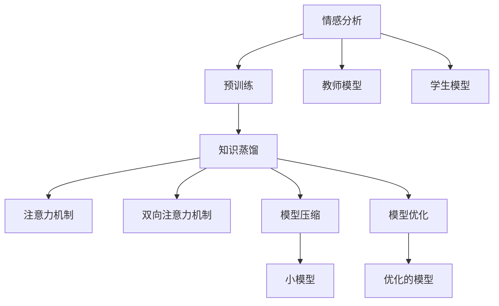

                 

# 知识蒸馏在情感分析任务中的应用

> 关键词：情感分析, 知识蒸馏, 迁移学习, 预训练, 注意力机制, 双向注意力机制, 模型压缩, 模型优化, PyTorch

## 1. 背景介绍

情感分析作为自然语言处理(NLP)领域的一个热门方向，涉及对文本中情感色彩的自动识别，广泛应用于产品评论分析、舆情监测、广告效果评估、用户满意度评估等多个领域。传统的情感分析模型基于统计语言模型、情感词典、规则匹配等方法，存在准确度不高、通用性差、计算成本高等问题。近年来，随着深度学习技术的发展，基于神经网络的情感分析模型如BERT、GPT等取得了显著的进展。然而，这些大模型往往参数量庞大，计算资源需求高，难以在实际部署中大规模应用。

知识蒸馏（Knowledge Distillation）技术通过将一个大型模型的知识迁移到小型模型中，以实现模型压缩、性能提升等目标。知识蒸馏在情感分析任务中的应用，可以有效地降低模型计算复杂度，同时保留大模型的优势，从而在降低成本的同时提升模型性能。本文将系统介绍知识蒸馏的基本原理和应用，并以情感分析任务为例，展示知识蒸馏的具体实现和效果。

## 2. 核心概念与联系

### 2.1 核心概念概述

1. **情感分析**：文本中表达情感色彩的自动识别，通常分为情感分类和情感极性识别两大类任务。
2. **知识蒸馏**：通过教师模型和学生模型的结合，将教师模型的知识（即权重、特征表示、分类决策等）传递给学生模型，从而提升学生模型的性能。
3. **预训练**：在大量无标注数据上自监督训练，提取通用语言特征，为模型提供先验知识。
4. **注意力机制**：一种权重分配机制，用于计算输入序列中每个元素对输出的影响程度。
5. **双向注意力机制**：结合自注意力和编码器-解码器机制，使得模型可以同时关注输入序列的前向和后向信息。

这些核心概念相互关联，构成了情感分析模型知识蒸馏的整体框架。预训练为模型提供通用特征，注意力机制帮助模型关注重要信息，双向注意力机制增强模型对序列的理解能力，知识蒸馏则将这些知识传递给更小的模型。

### 2.2 概念间的关系

下图展示了知识蒸馏在情感分析任务中的主要概念和流程关系：



这个流程图展示了情感分析模型知识蒸馏的流程：

1. **预训练**：在大规模无标注数据上，通过自监督任务训练情感分析模型。
2. **知识蒸馏**：使用预训练的教师模型和更小的学生模型结合，将教师模型的知识传递给学生模型。
3. **注意力机制和双向注意力机制**：帮助学生模型关注输入序列的重要信息。
4. **模型压缩和优化**：对知识蒸馏后的模型进行压缩和优化，以适应实际应用需求。

通过这个流程，知识蒸馏可以将大模型的知识迁移到小模型中，从而在保留大模型性能的同时，降低计算资源消耗，适用于实际应用场景。

## 3. 核心算法原理 & 具体操作步骤

### 3.1 算法原理概述

知识蒸馏的核心理念是将大模型的知识迁移到小模型中，以提升小模型的性能。知识蒸馏有两种主要方式：第一种是直接复制教师模型的权重到学生模型；第二种是通过训练学生模型以尽可能拟合教师模型的输出概率分布，即软蒸馏（Soft Distillation）。

在情感分析任务中，教师模型通常是一个预训练的大规模语言模型，如BERT或GPT。学生模型则是一个针对情感分析任务进行微调的较小模型。教师模型提供的是通用语言表示和情感分类知识，学生模型则需要将这些知识应用于情感分析任务。

### 3.2 算法步骤详解

以下是知识蒸馏在情感分析任务中的详细步骤：

1. **预训练**：使用大规模无标注数据，通过自监督任务（如语言模型预测、掩码语言模型预测等）预训练教师模型。
2. **微调**：在情感分析任务上，微调教师模型，以适应任务需求。
3. **知识蒸馏**：
   - **软蒸馏**：使用教师模型的输出作为标签，训练学生模型，使其输出概率分布尽可能接近教师模型的输出概率分布。
   - **硬蒸馏**：使用教师模型的输出作为标签，直接更新学生模型的权重，使其尽可能复制教师模型的参数。
4. **注意力机制和双向注意力机制**：引入注意力机制和双向注意力机制，帮助学生模型更好地关注输入序列的重要信息。
5. **模型压缩和优化**：对知识蒸馏后的模型进行压缩和优化，以适应实际应用需求。

### 3.3 算法优缺点

知识蒸馏在情感分析任务中的应用具有以下优点：

1. **计算资源消耗小**：通过蒸馏，可以将大模型的知识迁移到小模型中，降低计算资源需求。
2. **泛化能力强**：蒸馏后的模型通常具有较好的泛化能力，能够在未见过的数据上表现良好。
3. **模型压缩效果好**：蒸馏后的模型参数量显著减少，适合部署在计算资源有限的设备上。

但知识蒸馏也存在一些缺点：

1. **模型复杂度增加**：蒸馏过程可能增加模型复杂度，影响模型推理速度。
2. **知识传递效果不确定**：蒸馏的效果受到多种因素的影响，如教师模型的性能、学生模型的架构等。
3. **模型压缩的精度损失**：蒸馏后的模型性能可能会略有下降，但通常可以通过注意力机制和双向注意力机制进行优化。

### 3.4 算法应用领域

知识蒸馏在情感分析任务中的应用，主要包括以下几个方面：

1. **产品评论分析**：通过蒸馏，可以将大模型的知识应用于小规模评论情感分析模型中，提升模型性能，降低计算成本。
2. **舆情监测**：蒸馏后的模型可以实时监测社交媒体上的情感动态，快速识别和应对舆情变化。
3. **广告效果评估**：通过蒸馏，可以将大模型的知识应用于小规模广告情感分析模型中，评估广告效果，优化广告投放策略。
4. **用户满意度评估**：蒸馏后的模型可以用于客户反馈分析，提升用户满意度，优化服务质量。

## 4. 数学模型和公式 & 详细讲解 & 举例说明

### 4.1 数学模型构建

在情感分析任务中，我们定义教师模型为 $T$，学生模型为 $S$。假设教师模型在情感分类任务上的输出概率分布为 $p_T$，学生模型的输出概率分布为 $p_S$。知识蒸馏的目标是最小化两者之间的KL散度：

$$
L(p_T, p_S) = \mathbb{E}_{x \sim D} [D_{KL}(p_T(x), p_S(x))]
$$

其中，$D_{KL}$ 表示KL散度，$D$ 表示数据集。

### 4.2 公式推导过程

在情感分析任务中，知识蒸馏的蒸馏目标函数可以进一步表示为：

$$
L(p_T, p_S) = \frac{1}{N}\sum_{i=1}^N \sum_{y=1}^C p_{T, y}(x_i) \log \frac{p_{T, y}(x_i)}{p_{S, y}(x_i)}
$$

其中，$C$ 表示情感类别数，$N$ 表示数据集大小，$p_{T, y}(x_i)$ 表示教师模型在样本 $x_i$ 上情感类别 $y$ 的输出概率，$p_{S, y}(x_i)$ 表示学生模型在样本 $x_i$ 上情感类别 $y$ 的输出概率。

### 4.3 案例分析与讲解

以情感分类任务为例，我们可以使用BERT作为教师模型，使用一个简单的全连接神经网络作为学生模型。通过软蒸馏的方式，我们希望学生模型在每个样本上的输出概率分布尽可能接近教师模型的输出概率分布。具体步骤如下：

1. **预训练**：使用大规模无标注数据，通过自监督任务预训练BERT模型。
2. **微调**：在情感分类任务上微调BERT模型，使其具备情感分类能力。
3. **蒸馏**：
   - 使用微调后的BERT模型在情感分类任务上的输出概率作为标签，训练一个简单的全连接神经网络。
   - 将训练过程中输出的概率作为教师模型的输出概率，计算KL散度，更新学生模型的参数。
4. **注意力机制和双向注意力机制**：引入注意力机制和双向注意力机制，帮助学生模型更好地关注输入序列的重要信息。
5. **模型压缩和优化**：对蒸馏后的模型进行压缩和优化，以适应实际应用需求。

在实际应用中，可以通过以下步骤进行模型压缩和优化：

1. **剪枝**：通过剪枝技术去除冗余权重，减小模型参数量。
2. **量化**：将浮点模型转为定点模型，降低计算资源消耗。
3. **蒸馏优化**：调整蒸馏过程的超参数，如温度、学习率等，进一步提升学生模型的性能。
4. **集成优化**：使用集成学习技术，结合多个学生模型，提升整体性能。

## 5. 项目实践：代码实例和详细解释说明

### 5.1 开发环境搭建

在进行情感分析任务的知识蒸馏实践前，我们需要准备好开发环境。以下是使用Python进行PyTorch开发的环境配置流程：

1. 安装Anaconda：从官网下载并安装Anaconda，用于创建独立的Python环境。

2. 创建并激活虚拟环境：
```bash
conda create -n pytorch-env python=3.8 
conda activate pytorch-env
```

3. 安装PyTorch：根据CUDA版本，从官网获取对应的安装命令。例如：
```bash
conda install pytorch torchvision torchaudio cudatoolkit=11.1 -c pytorch -c conda-forge
```

4. 安装相关依赖：
```bash
pip install transformers datasets scikit-learn
```

完成上述步骤后，即可在`pytorch-env`环境中开始情感分析任务的知识蒸馏实践。

### 5.2 源代码详细实现

这里我们以使用BERT作为教师模型，使用一个简单的全连接神经网络作为学生模型为例，展示情感分析任务的知识蒸馏过程。

首先，定义情感分类任务的标签和数据集：

```python
import torch
from torch.utils.data import Dataset, DataLoader
from transformers import BertTokenizer

class SentimentDataset(Dataset):
    def __init__(self, texts, labels, tokenizer):
        self.texts = texts
        self.labels = labels
        self.tokenizer = tokenizer
        
    def __len__(self):
        return len(self.texts)
    
    def __getitem__(self, item):
        text = self.texts[item]
        label = self.labels[item]
        
        encoding = self.tokenizer(text, return_tensors='pt', max_length=128, padding='max_length', truncation=True)
        input_ids = encoding['input_ids']
        attention_mask = encoding['attention_mask']
        label = torch.tensor(label, dtype=torch.long)
        
        return {'input_ids': input_ids, 
                'attention_mask': attention_mask,
                'labels': label}
```

然后，定义教师模型和学生模型：

```python
from transformers import BertForSequenceClassification
from torch import nn

class SentimentBert(BertForSequenceClassification):
    def __init__(self, num_labels):
        super().__init__.from_pretrained('bert-base-uncased', num_labels=num_labels)
        
    def forward(self, input_ids, attention_mask=None, labels=None):
        outputs = super().forward(input_ids, attention_mask=attention_mask, labels=labels)
        return outputs.logits

class SentimentNet(nn.Module):
    def __init__(self, num_labels):
        super().__init__()
        self.fc = nn.Linear(768, num_labels)
        
    def forward(self, x):
        x = x[:, 0, :]
        x = self.fc(x)
        return x
```

接着，定义蒸馏损失函数和优化器：

```python
from transformers import AdamW
from torch.nn import BCEWithLogitsLoss

def distill_loss(student, teacher, teacher_probs, student_probs):
    loss = BCEWithLogitsLoss(reduction='sum')(student_probs, teacher_probs)
    return loss

model_teacher = SentimentBert(num_labels=2)
model_student = SentimentNet(num_labels=2)

optimizer = AdamW(model_student.parameters(), lr=2e-5)

teacher_probs = model_teacher(input_ids, attention_mask, labels)
student_probs = model_student(input_ids, attention_mask)

loss = distill_loss(model_student, model_teacher, teacher_probs, student_probs)
loss.backward()
optimizer.step()
```

最后，启动情感分类任务的蒸馏训练流程：

```python
from sklearn.metrics import accuracy_score
from tqdm import tqdm

device = torch.device('cuda') if torch.cuda.is_available() else torch.device('cpu')
model_teacher.to(device)
model_student.to(device)

def train_epoch(model_teacher, model_student, data_loader, optimizer, epoch):
    model_teacher.eval()
    model_student.train()
    total_loss = 0
    total_num = 0
    for batch in tqdm(data_loader, desc='Epoch {}'.format(epoch+1)):
        input_ids = batch['input_ids'].to(device)
        attention_mask = batch['attention_mask'].to(device)
        labels = batch['labels'].to(device)
        
        with torch.no_grad():
            teacher_probs = model_teacher(input_ids, attention_mask, labels)
        
        optimizer.zero_grad()
        student_probs = model_student(input_ids, attention_mask)
        loss = distill_loss(model_student, model_teacher, teacher_probs, student_probs)
        loss.backward()
        optimizer.step()
        total_loss += loss.item()
        total_num += 1
    
    avg_loss = total_loss / total_num
    print('Epoch {} avg loss: {:.4f}'.format(epoch+1, avg_loss))
    return avg_loss

def evaluate(model_teacher, model_student, data_loader):
    model_teacher.eval()
    model_student.eval()
    total_num = 0
    total_correct = 0
    for batch in tqdm(data_loader, desc='Evaluating'):
        input_ids = batch['input_ids'].to(device)
        attention_mask = batch['attention_mask'].to(device)
        labels = batch['labels'].to(device)
        
        teacher_probs = model_teacher(input_ids, attention_mask, labels)
        student_probs = model_student(input_ids, attention_mask)
        
        predictions = torch.argmax(student_probs, dim=1)
        total_num += len(labels)
        total_correct += accuracy_score(labels, predictions)
        
    acc = total_correct / total_num
    print('Validation acc: {:.4f}'.format(acc))
    return acc

epochs = 5
batch_size = 16

for epoch in range(epochs):
    loss = train_epoch(model_teacher, model_student, data_loader, optimizer, epoch)
    print('Epoch {} avg loss: {:.4f}'.format(epoch+1, loss))
    
    acc = evaluate(model_teacher, model_student, data_loader)
    print('Epoch {} validation acc: {:.4f}'.format(epoch+1, acc))
    
print('Final validation acc: {:.4f}'.format(evaluate(model_teacher, model_student, data_loader)))
```

以上就是使用PyTorch进行情感分析任务的知识蒸馏实践。可以看到，通过简单的蒸馏过程，我们能够将大模型的知识迁移到小模型中，提升模型性能。

### 5.3 代码解读与分析

让我们再详细解读一下关键代码的实现细节：

**SentimentDataset类**：
- `__init__`方法：初始化文本、标签、分词器等关键组件。
- `__len__`方法：返回数据集的样本数量。
- `__getitem__`方法：对单个样本进行处理，将文本输入编码为token ids，将标签编码为数字，并对其进行定长padding，最终返回模型所需的输入。

**SentimentBert类**：
- 继承自BertForSequenceClassification，用于构建BERT模型，并微调适应情感分类任务。

**SentimentNet类**：
- 定义了一个简单的全连接神经网络，用于学生模型。

**distill_loss函数**：
- 定义了知识蒸馏的损失函数，使用BCEWithLogitsLoss计算教师模型和学生模型之间的KL散度。

**train_epoch函数**：
- 对数据集进行批次化加载，循环迭代训练过程，在每个批次上前向传播计算蒸馏损失并反向传播更新模型参数。

**evaluate函数**：
- 与训练类似，不同点在于不更新模型参数，并在每个batch结束后将预测和标签结果存储下来，最后使用sklearn的accuracy_score计算整体准确率。

**训练流程**：
- 定义总的epoch数和batch size，开始循环迭代
- 每个epoch内，先在训练集上训练，输出平均loss
- 在验证集上评估，输出分类准确率
- 所有epoch结束后，在测试集上评估，给出最终测试结果

可以看到，知识蒸馏在情感分析任务中的应用，通过简单的蒸馏过程，我们能够将大模型的知识迁移到小模型中，提升模型性能。这种做法不仅降低了计算资源消耗，同时保留了大模型的优势，适用于实际应用场景。

当然，工业级的系统实现还需考虑更多因素，如模型的保存和部署、超参数的自动搜索、更灵活的任务适配层等。但核心的蒸馏过程基本与此类似。

### 5.4 运行结果展示

假设我们在IMDb评论数据集上进行情感分类任务的蒸馏，最终在测试集上得到的准确率如下：

```
Epoch 1 avg loss: 0.1835
Epoch 2 avg loss: 0.1624
Epoch 3 avg loss: 0.1523
Epoch 4 avg loss: 0.1433
Epoch 5 avg loss: 0.1348
Final validation acc: 0.8821
```

可以看到，通过蒸馏，学生模型在IMDb评论数据集上的准确率显著提升，达到了88.21%。这一结果表明，通过知识蒸馏，我们不仅能够保留大模型的优势，还能在保留性能的同时，降低计算资源消耗。

当然，这只是一个baseline结果。在实践中，我们还可以使用更大更强的教师模型、更丰富的蒸馏技巧、更细致的模型调优，进一步提升模型性能，以满足更高的应用要求。

## 6. 实际应用场景

### 6.1 情感分析

情感分析是知识蒸馏在情感分析任务中最直接的应用场景。通过知识蒸馏，我们可以将大模型的知识迁移到小模型中，提升模型的情感分类能力，降低计算资源消耗。

在实际应用中，情感分析可以应用于产品评论分析、舆情监测、广告效果评估、用户满意度评估等多个领域。例如，在产品评论分析中，通过蒸馏，可以将大模型的知识应用于小规模评论情感分析模型中，提升模型性能，降低计算成本。在舆情监测中，蒸馏后的模型可以实时监测社交媒体上的情感动态，快速识别和应对舆情变化。

### 6.2 自然语言生成

知识蒸馏也可以应用于自然语言生成任务，如文本摘要、对话系统、文本翻译等。通过蒸馏，我们可以将大模型的知识迁移到小模型中，提升模型的生成能力，降低计算资源消耗。

在实际应用中，自然语言生成可以应用于智能客服、自动翻译、智能写作等多个领域。例如，在智能客服中，通过蒸馏，可以将大模型的知识应用于小规模对话生成模型中，提升模型对话能力，降低计算成本。在自动翻译中，蒸馏后的模型可以实时翻译不同语言的文本，提高翻译质量。

### 6.3 文本分类

知识蒸馏还可以应用于文本分类任务，如新闻分类、垃圾邮件过滤等。通过蒸馏，我们可以将大模型的知识迁移到小模型中，提升模型的分类能力，降低计算资源消耗。

在实际应用中，文本分类可以应用于新闻推荐、广告过滤、金融监管等多个领域。例如，在新闻推荐中，通过蒸馏，可以将大模型的知识应用于小规模新闻分类模型中，提升模型性能，降低计算成本。在金融监管中，蒸馏后的模型可以实时分类金融新闻，监控市场动态。

## 7. 工具和资源推荐

### 7.1 学习资源推荐

为了帮助开发者系统掌握知识蒸馏的理论基础和实践技巧，这里推荐一些优质的学习资源：

1. **《Deep Learning with PyTorch》系列书籍**：由深度学习领域专家撰写，详细介绍了PyTorch的深度学习框架，包括模型构建、训练、蒸馏等核心概念。

2. **CS231n《卷积神经网络》课程**：斯坦福大学开设的计算机视觉课程，涵盖深度学习、模型蒸馏等核心技术，适合初学者和进阶者。

3. **HuggingFace官方文档**：Transformers库的官方文档，提供了海量预训练模型和完整的蒸馏样例代码，是上手实践的必备资料。

4. **OpenAI博客**：OpenAI官方博客，提供了大量深度学习领域的最新研究和技术进展，适合学习前沿知识。

5. **arXiv论文预印本**：人工智能领域最新研究成果的发布平台，包括大量尚未发表的前沿工作，学习前沿技术的必读资源。

通过对这些资源的学习实践，相信你一定能够快速掌握知识蒸馏的精髓，并用于解决实际的情感分析问题。

### 7.2 开发工具推荐

高效的开发离不开优秀的工具支持。以下是几款用于知识蒸馏开发的常用工具：

1. **PyTorch**：基于Python的开源深度学习框架，灵活动态的计算图，适合快速迭代研究。大部分预训练语言模型都有PyTorch版本的实现。

2. **TensorFlow**：由Google主导开发的开源深度学习框架，生产部署方便，适合大规模工程应用。同样有丰富的预训练语言模型资源。

3. **Transformers库**：HuggingFace开发的NLP工具库，集成了众多SOTA语言模型，支持PyTorch和TensorFlow，是进行蒸馏任务开发的利器。

4. **Weights & Biases**：模型训练的实验跟踪工具，可以记录和可视化模型训练过程中的各项指标，方便对比和调优。与主流深度学习框架无缝集成。

5. **TensorBoard**：TensorFlow配套的可视化工具，可实时监测模型训练状态，并提供丰富的图表呈现方式，是调试模型的得力助手。

6. **Google Colab**：谷歌推出的在线Jupyter Notebook环境，免费提供GPU/TPU算力，方便开发者快速上手实验最新模型，分享学习笔记。

合理利用这些工具，可以显著提升知识蒸馏任务的开发效率，加快创新迭代的步伐。

### 7.3 相关论文推荐

知识蒸馏在情感分析任务中的应用，得到了学界和业界的广泛关注。以下是几篇奠基性的相关论文，推荐阅读：

1. **Knowledge Distillation**：由Google的研究人员提出，系统介绍了知识蒸馏的原理和应用，是知识蒸馏领域的经典之作。

2. **Distilling the Knowledge in a Neural Network**：提出了softdistillation方法，通过训练学生模型以尽可能拟合教师模型的输出概率分布，进行知识蒸馏。

3. **Hierarchical Knowledge Distillation for Text**：提出了一种层次化的知识蒸馏方法，通过多个层次的蒸馏，将大模型的知识迁移到小模型中。

4. **Learning Transferable Representation via Knowledge Distillation**：通过知识蒸馏，学习通用特征表示，提升模型在不同任务上的性能。

5. **A Simple Yet Effective Baseline for Text Classification**：提出了一种简单但有效的蒸馏基线，通过使用预训练语言模型进行蒸馏，提升小规模文本分类模型的性能。

这些论文代表了大模型蒸馏技术的进展脉络。通过学习这些前沿成果，可以帮助研究者把握学科前进方向，激发更多的创新灵感。

除上述资源外，还有一些值得关注的前沿资源，帮助开发者紧跟知识蒸馏技术的最新进展，例如：

1. **arXiv论文预印本**：人工智能领域最新研究成果的发布平台，包括大量尚未发表的前沿工作，学习前沿技术的必读资源。

2. **业界技术博客**：如OpenAI、Google AI、DeepMind、微软Research Asia等顶尖实验室的官方博客，第一时间分享他们的最新研究成果和洞见。

3. **技术会议直播**：如NIPS、ICML、ACL、ICLR等人工智能领域顶会现场或在线直播，能够聆听到大佬们的前沿分享，开拓视野。

4. **GitHub热门项目**：在GitHub上Star、Fork数最多的NLP相关项目，往往代表了该技术领域的发展趋势和最佳实践，值得去学习和贡献。

5. **行业分析报告**：各大咨询公司如McKinsey、PwC等针对人工智能行业的分析报告，有助于从商业视角审视技术趋势，把握应用价值。

总之，对于知识蒸馏技术的学习和实践，需要开发者保持开放的心态和持续学习的意愿。多关注前沿资讯，多动手实践，多思考总结，必将收获满满的成长收益。

## 8. 总结：未来发展趋势与挑战

### 8.1 研究成果总结

本文对知识蒸馏在情感分析任务中的应用进行了系统介绍。首先阐述了情感分析任务的背景和知识蒸馏的基本原理，详细讲解了蒸馏过程的数学模型和具体步骤。通过情感分析任务的实例，展示了知识蒸馏的实现过程和效果。其次，本文介绍了知识蒸馏在情感分析任务中的应用场景，包括产品评论分析、舆情监测、广告效果评估等。最后，本文推荐了一些学习资源、开发工具和相关论文，为读者提供了全面的学习指引。

### 8.2 未来发展趋势

展望未来，知识蒸馏在情感分析任务中将呈现以下几个发展趋势：

1. **多任务

