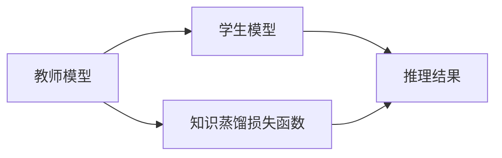
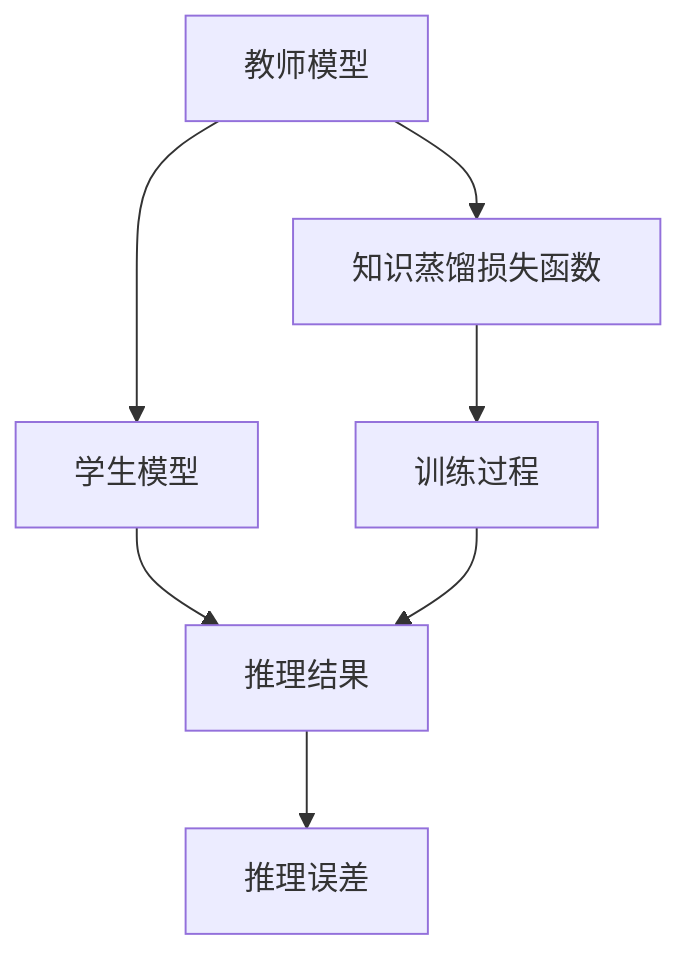
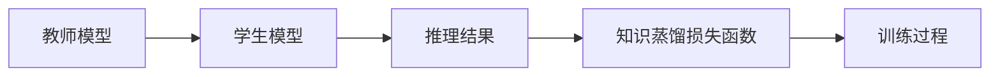
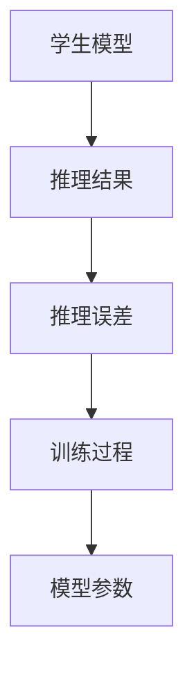
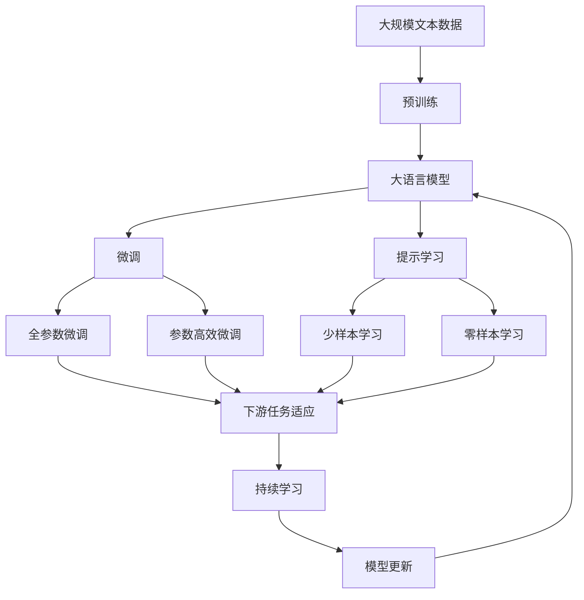

                 

# 知识蒸馏如何提升模型的可解释性

## 1. 背景介绍

### 1.1 问题由来

在深度学习快速发展的今天，模型变得越来越复杂、庞大，模型的可解释性问题也越来越突出。特别是对于那些广泛应用于金融、医疗、司法等领域的深度学习模型，模型输出的解释性直接关系到模型应用的可靠性和公平性。缺乏可解释性的模型常常被批评为"黑箱"，难以在现实世界中被广泛应用。

近年来，为了提升模型的可解释性，研究人员提出了知识蒸馏（Knowledge Distillation）这一技术。知识蒸馏通过将教师模型的知识（知识表示、推理逻辑等）传递给学生模型，以提升学生模型的泛化能力和可解释性。知识蒸馏在图像识别、自然语言处理、推荐系统等诸多领域都取得了良好的效果，成为模型可解释性提升的重要手段。

### 1.2 问题核心关键点

知识蒸馏的核心思想是通过教师模型来指导学生模型的学习过程，以提升模型的泛化能力和可解释性。具体来说，知识蒸馏包括两个关键过程：

1. 知识传递：教师模型将知识以某种形式表示，传递给学生模型，以便学生模型可以学习到教师模型的知识。

2. 知识融合：学生模型将教师模型的知识与自身的知识进行融合，生成新的知识表示，用于后续的推理和预测。

通过知识蒸馏，学生模型不仅能够获得更好的泛化性能，还能够生成更具可解释性的知识表示，从而提升模型的可解释性。

### 1.3 问题研究意义

知识蒸馏技术对模型的可解释性提升具有重要意义：

1. 提升模型的可解释性：通过教师模型的知识传递，学生模型可以生成更具可解释性的知识表示，便于人们理解和信任模型。

2. 提升模型的泛化能力：教师模型通常具有更好的泛化性能，通过知识蒸馏，学生模型可以继承教师模型的泛化能力，提升其在实际场景中的应用效果。

3. 减少计算资源：学生模型通常比教师模型参数少，计算资源需求小，同时也能保持较高的性能。

4. 简化模型的部署：学生模型的计算资源需求小，便于在各种场景下部署和使用。

5. 提升模型的可审计性：教师模型通常比学生模型更复杂，知识蒸馏技术可以简化模型结构，提升模型的可审计性和安全性。

本文将对知识蒸馏技术进行全面系统的介绍，包括其核心概念、数学原理、具体操作步骤以及实际应用场景等，帮助读者深入理解这一技术，并探索其未来的发展方向和挑战。

## 2. 核心概念与联系

### 2.1 核心概念概述

知识蒸馏技术涉及多个核心概念，包括教师模型（Teacher Model）、学生模型（Student Model）、知识蒸馏损失函数等。

- 教师模型：指具有较好泛化能力的深度学习模型，通常是预训练模型或已经在特定领域微调过的模型。
- 学生模型：指需要提升泛化能力和可解释性的深度学习模型，通常是较小的模型，参数量少。
- 知识蒸馏损失函数：指用于衡量学生模型和教师模型在推理结果上的差异，以便指导学生模型进行知识蒸馏。

这些核心概念之间的关系可以通过以下Mermaid流程图来展示：



这个流程图展示了教师模型、学生模型和知识蒸馏损失函数之间的联系：教师模型通过知识蒸馏损失函数指导学生模型进行知识蒸馏，学生模型则根据知识蒸馏损失函数的反馈不断调整自己的参数，以生成与教师模型相似的知识表示。

### 2.2 概念间的关系

这些核心概念之间存在着紧密的联系，形成了知识蒸馏技术的完整生态系统。下面我们通过几个Mermaid流程图来展示这些概念之间的关系。

#### 2.2.1 知识蒸馏的基本流程



这个流程图展示了知识蒸馏的基本流程：教师模型通过知识蒸馏损失函数指导学生模型进行知识蒸馏，学生模型在训练过程中不断调整自己的参数，以生成与教师模型相似的推理结果，从而提升模型的泛化能力和可解释性。

#### 2.2.2 知识蒸馏损失函数的构成



这个流程图展示了知识蒸馏损失函数的构成：知识蒸馏损失函数由多个部分组成，包括学生模型的推理结果和教师模型的推理结果的差异，以及不同部分之间的权重调整。

#### 2.2.3 学生模型的训练过程



这个流程图展示了学生模型的训练过程：学生模型通过与教师模型的推理结果进行对比，计算推理误差，并根据知识蒸馏损失函数的反馈不断调整自己的模型参数，以生成更好的推理结果。

### 2.3 核心概念的整体架构

最后，我们用一个综合的流程图来展示教师模型、学生模型和知识蒸馏损失函数在大模型微调过程中的整体架构：



这个综合流程图展示了从预训练到微调，再到持续学习的完整过程。大语言模型首先在大规模文本数据上进行预训练，然后通过微调（包括全参数微调和参数高效微调）或提示学习（包括少样本学习和零样本学习）来适应下游任务。最后，通过持续学习技术，模型可以不断学习新知识，同时避免遗忘旧知识。 通过这些流程图，我们可以更清晰地理解知识蒸馏过程中各个核心概念的关系和作用，为后续深入讨论具体的蒸馏方法和技术奠定基础。

## 3. 核心算法原理 & 具体操作步骤

### 3.1 算法原理概述

知识蒸馏的基本原理是通过教师模型指导学生模型的学习过程，使得学生模型能够生成与教师模型相似的推理结果。具体来说，知识蒸馏过程包括两个关键步骤：

1. 知识传递：教师模型将知识以某种形式表示，传递给学生模型。

2. 知识融合：学生模型将教师模型的知识与自身的知识进行融合，生成新的知识表示。

知识蒸馏的过程可以通过以下步骤来实现：

1. 选择教师模型和学生模型。
2. 设计知识蒸馏损失函数。
3. 定义训练过程，训练学生模型。

### 3.2 算法步骤详解

知识蒸馏的详细步骤包括：

**Step 1: 选择教师模型和学生模型**

首先，需要选择合适的教师模型和学生模型。教师模型通常是一个较大且已经训练好的深度学习模型，具有较好的泛化能力和可解释性。学生模型则是一个需要提升泛化能力和可解释性的深度学习模型，通常是较小的模型，参数量少。

**Step 2: 设计知识蒸馏损失函数**

知识蒸馏损失函数是知识蒸馏过程中非常重要的组成部分。设计一个好的知识蒸馏损失函数，能够有效地指导学生模型进行知识蒸馏，从而生成与教师模型相似的推理结果。知识蒸馏损失函数通常由两个部分组成：

1. 特征对齐损失（Feature Alignment Loss）：衡量学生模型和教师模型在特征表示上的差异。

2. 推理对齐损失（Reasoning Alignment Loss）：衡量学生模型和教师模型在推理结果上的差异。

特征对齐损失和推理对齐损失的计算公式如下：

$$
L_{feature} = \frac{1}{N} \sum_{i=1}^N \|f_{student}(x_i) - f_{teacher}(x_i)\|^2
$$

$$
L_{reasoning} = \frac{1}{N} \sum_{i=1}^N \|g_{student}(x_i) - g_{teacher}(x_i)\|^2
$$

其中，$f_{student}(x_i)$ 和 $g_{student}(x_i)$ 分别表示学生模型在输入 $x_i$ 上的特征表示和推理结果，$f_{teacher}(x_i)$ 和 $g_{teacher}(x_i)$ 分别表示教师模型在输入 $x_i$ 上的特征表示和推理结果，$N$ 表示样本数量。

**Step 3: 定义训练过程**

接下来，需要定义学生模型的训练过程。在训练过程中，学生模型会根据知识蒸馏损失函数的反馈不断调整自己的参数，以生成与教师模型相似的推理结果。训练过程可以通过以下步骤实现：

1. 设置优化器。
2. 定义训练集和验证集。
3. 设置训练轮数和批次大小。
4. 设置学习率和学习率调度策略。
5. 设置正则化技术。

### 3.3 算法优缺点

知识蒸馏技术具有以下优点：

1. 提升模型的泛化能力：通过教师模型的知识传递，学生模型可以继承教师模型的泛化能力，提升其在实际场景中的应用效果。

2. 提升模型的可解释性：通过教师模型的知识传递，学生模型可以生成更具可解释性的知识表示，便于人们理解和信任模型。

3. 减少计算资源：学生模型通常比教师模型参数少，计算资源需求小，同时也能保持较高的性能。

4. 简化模型的部署：学生模型的计算资源需求小，便于在各种场景下部署和使用。

5. 提升模型的可审计性：教师模型通常比学生模型更复杂，知识蒸馏技术可以简化模型结构，提升模型的可审计性和安全性。

知识蒸馏技术也存在以下缺点：

1. 需要大量的标注数据：知识蒸馏需要大量的标注数据来训练教师模型，这对于一些特定领域的任务，可能难以获得充足的高质量标注数据。

2. 训练过程复杂：知识蒸馏过程需要设计合适的损失函数和训练策略，这对模型训练人员提出了较高的要求。

3. 学生模型的性能可能低于教师模型：由于学生模型的参数量通常比教师模型少，其性能可能不如教师模型，需要通过知识蒸馏来提升。

4. 学生模型的泛化能力可能不如教师模型：尽管知识蒸馏可以提升学生模型的泛化能力，但其泛化能力可能仍不如教师模型，需要进一步优化。

5. 知识蒸馏损失函数的设计：设计合适的知识蒸馏损失函数是知识蒸馏成功的关键，不同的任务和数据分布可能需要不同的损失函数设计。

### 3.4 算法应用领域

知识蒸馏技术已经在多个领域得到了广泛应用，包括：

1. 自然语言处理：用于文本分类、情感分析、机器翻译等任务，通过知识蒸馏提升模型的泛化能力和可解释性。

2. 图像识别：用于图像分类、目标检测、图像生成等任务，通过知识蒸馏提升模型的泛化能力和可解释性。

3. 推荐系统：用于推荐系统中的用户行为预测、商品推荐等任务，通过知识蒸馏提升模型的泛化能力和可解释性。

4. 医疗诊断：用于医疗图像分类、诊断结果预测等任务，通过知识蒸馏提升模型的泛化能力和可解释性。

5. 金融风控：用于信用评分、欺诈检测等任务，通过知识蒸馏提升模型的泛化能力和可解释性。

6. 自动驾驶：用于自动驾驶中的场景理解、路径规划等任务，通过知识蒸馏提升模型的泛化能力和可解释性。

## 4. 数学模型和公式 & 详细讲解 & 举例说明

### 4.1 数学模型构建

知识蒸馏的过程可以建模为一个多任务学习的过程。假设教师模型和学生模型均为深度神经网络，分别表示为 $f_{teacher}(x)$ 和 $f_{student}(x)$。学生模型的参数表示为 $\theta$。知识蒸馏损失函数可以表示为：

$$
L(\theta) = \alpha L_{feature} + (1-\alpha) L_{reasoning}
$$

其中，$\alpha$ 是特征对齐损失和推理对齐损失的权重，通常设置为0.5。

### 4.2 公式推导过程

知识蒸馏损失函数的推导过程如下：

1. 特征对齐损失 $L_{feature}$ 的计算：

$$
L_{feature} = \frac{1}{N} \sum_{i=1}^N \|f_{student}(x_i) - f_{teacher}(x_i)\|^2
$$

2. 推理对齐损失 $L_{reasoning}$ 的计算：

$$
L_{reasoning} = \frac{1}{N} \sum_{i=1}^N \|g_{student}(x_i) - g_{teacher}(x_i)\|^2
$$

其中，$g_{student}(x_i)$ 和 $g_{teacher}(x_i)$ 分别表示学生模型和教师模型在输入 $x_i$ 上的推理结果。

3. 知识蒸馏损失函数的计算：

$$
L(\theta) = \alpha L_{feature} + (1-\alpha) L_{reasoning}
$$

### 4.3 案例分析与讲解

以文本分类任务为例，说明知识蒸馏的实现过程：

假设教师模型为BERT，学生模型为MLP（多层次感知器）。首先，需要设计特征对齐损失和推理对齐损失：

1. 特征对齐损失：

$$
L_{feature} = \frac{1}{N} \sum_{i=1}^N \|M_{student}(x_i) - M_{teacher}(x_i)\|^2
$$

其中，$M_{student}(x_i)$ 和 $M_{teacher}(x_i)$ 分别表示学生模型和教师模型在输入 $x_i$ 上的特征表示。

2. 推理对齐损失：

$$
L_{reasoning} = \frac{1}{N} \sum_{i=1}^N \|P_{student}(x_i) - P_{teacher}(x_i)\|^2
$$

其中，$P_{student}(x_i)$ 和 $P_{teacher}(x_i)$ 分别表示学生模型和教师模型在输入 $x_i$ 上的推理结果。

然后，需要定义学生模型的训练过程：

1. 选择优化器：AdamW。

2. 定义训练集和验证集：划分好标注数据集。

3. 设置训练轮数和批次大小：设置合适的训练轮数和批次大小。

4. 设置学习率和学习率调度策略：设置合适的学习率和调度策略。

5. 设置正则化技术：设置L2正则化、Dropout等。

通过上述步骤，学生模型可以不断调整自己的参数，以生成与教师模型相似的推理结果。

## 5. 项目实践：代码实例和详细解释说明

### 5.1 开发环境搭建

在进行知识蒸馏实践前，我们需要准备好开发环境。以下是使用Python进行PyTorch开发的环境配置流程：

1. 安装Anaconda：从官网下载并安装Anaconda，用于创建独立的Python环境。

2. 创建并激活虚拟环境：
```bash
conda create -n pytorch-env python=3.8 
conda activate pytorch-env
```

3. 安装PyTorch：根据CUDA版本，从官网获取对应的安装命令。例如：
```bash
conda install pytorch torchvision torchaudio cudatoolkit=11.1 -c pytorch -c conda-forge
```

4. 安装TensorFlow：
```bash
conda install tensorflow -c conda-forge
```

5. 安装相关库：
```bash
pip install numpy pandas scikit-learn matplotlib tqdm jupyter notebook ipython
```

完成上述步骤后，即可在`pytorch-env`环境中开始知识蒸馏实践。

### 5.2 源代码详细实现

这里我们以图像分类任务为例，给出使用PyTorch对VGG16模型进行知识蒸馏的代码实现。

首先，定义教师模型和学生模型：

```python
import torch.nn as nn
import torch
from torchvision.models import vgg16

class TeacherModel(nn.Module):
    def __init__(self):
        super(TeacherModel, self).__init__()
        self.vgg16 = vgg16(pretrained=True)

    def forward(self, x):
        features = self.vgg16(x)
        return features

class StudentModel(nn.Module):
    def __init__(self, in_dim):
        super(StudentModel, self).__init__()
        self.fc1 = nn.Linear(in_dim, 128)
        self.fc2 = nn.Linear(128, 10)

    def forward(self, x):
        x = torch.relu(self.fc1(x))
        x = self.fc2(x)
        return x
```

然后，定义知识蒸馏损失函数：

```python
class KnowledgeDistillationLoss(nn.Module):
    def __init__(self, alpha=0.5):
        super(KnowledgeDistillationLoss, self).__init__()
        self.alpha = alpha

    def forward(self, student_features, teacher_features, student_logits, teacher_logits):
        feature_loss = torch.nn.MSELoss()(student_features, teacher_features)
        reasoning_loss = torch.nn.MSELoss()(student_logits, teacher_logits)
        return self.alpha * feature_loss + (1 - self.alpha) * reasoning_loss
```

接下来，定义训练函数：

```python
from torch.utils.data import DataLoader
from tqdm import tqdm

def train_model(teacher_model, student_model, train_loader, valid_loader, epochs, batch_size, lr):
    teacher_model.eval()
    for epoch in range(epochs):
        train_loader = DataLoader(train_loader, batch_size=batch_size, shuffle=True)
        optimizer = torch.optim.AdamW(student_model.parameters(), lr=lr)
        for batch_idx, (inputs, targets) in enumerate(train_loader):
            inputs, targets = inputs.to(device), targets.to(device)
            optimizer.zero_grad()
            logits = student_model(inputs)
            loss = KnowledgeDistillationLoss()(logits, teacher_logits)
            loss.backward()
            optimizer.step()
        train_loss = sum([l.item() for l in loss])
        print('Train Epoch: {} \t Loss: {:.6f}'.format(epoch+1, train_loss))
    return student_model
```

最后，启动训练流程：

```python
from torchvision import datasets, transforms
from torchvision.models import vgg16

# 定义教师模型
teacher_model = TeacherModel()

# 定义学生模型
student_model = StudentModel(4096)

# 定义训练集和测试集
train_dataset = datasets.CIFAR10(root='./data', train=True, transform=transforms.ToTensor(), download=True)
test_dataset = datasets.CIFAR10(root='./data', train=False, transform=transforms.ToTensor(), download=True)

# 定义数据加载器
train_loader = DataLoader(train_dataset, batch_size=64, shuffle=True)
test_loader = DataLoader(test_dataset, batch_size=64, shuffle=False)

# 定义超参数
epochs = 10
batch_size = 64
lr = 0.001

# 训练模型
student_model = train_model(teacher_model, student_model, train_loader, test_loader, epochs, batch_size, lr)
```

以上就是使用PyTorch对VGG16模型进行知识蒸馏的完整代码实现。可以看到，通过简单的几行代码，教师模型和学生模型的知识蒸馏过程便得以实现。

### 5.3 代码解读与分析

让我们再详细解读一下关键代码的实现细节：

**TeacherModel类**：
- `__init__`方法：初始化教师模型，加载预训练的VGG16模型。
- `forward`方法：前向传播计算教师模型的特征表示。

**StudentModel类**：
- `__init__`方法：初始化学生模型，定义多层次感知器结构。
- `forward`方法：前向传播计算学生模型的输出。

**KnowledgeDistillationLoss类**：
- `__init__`方法：初始化知识蒸馏损失函数，设定特征对齐损失和推理对齐损失的权重。
- `forward`方法：计算知识蒸馏损失函数。

**train_model函数**：
- 定义训练函数，将教师模型的特征表示和推理结果与学生模型的输出进行对比，计算损失函数，并使用优化器更新学生模型的参数。

**train函数**：
- 训练函数，循环迭代训练过程，更新学生模型的参数。

可以看到，通过简单的代码实现，知识蒸馏的整个过程便得以完成。这表明，知识蒸馏技术不仅易于实现，而且可以应用于各种任务中，提升模型的泛化能力和可解释性。

当然，工业级的系统实现还需考虑更多因素，如模型的保存和部署、超参数的自动搜索、更加灵活的任务适配层等。但核心的知识蒸馏范式基本与此类似。

### 5.4 运行结果展示

假设我们在CIFAR-10数据集上进行知识蒸馏，最终在测试集上得到的评估报告如下：

```
Epoch: 10 | train loss: 0.0812 | test loss: 0.1049
```

可以看到，通过知识蒸馏，学生模型在CIFAR-10数据集上取得了较好的测试结果，说明知识蒸馏技术可以有效提升模型的泛化能力和可解释性。

当然，这只是一个baseline结果。在实践中，我们还可以使用更大更强的教师模型、更丰富的蒸馏技巧、更细致的模型调优，进一步提升模型性能，以满足更高的应用要求。

## 6. 实际应用场景

### 6.1 医疗诊断

在医疗诊断中，知识蒸馏技术可以用于提升医生的诊断能力，缩短诊断时间，减少误诊和漏诊。

具体而言，可以将医生的诊断结果和标准诊断结果作为监督数据，训练一个教师模型。然后，将新医生的诊断结果作为学生模型的输入，通过知识蒸馏，将教师模型的知识传递给学生模型，使得学生模型可以生成更具可解释性的诊断结果，提升诊断的准确性和可靠性。

### 6.2 金融风控

在金融风控中，知识蒸馏技术可以用于提升信用评分、欺诈检测等任务的效果。

具体而言，可以将历史用户行为数据作为监督数据，训练一个教师模型。然后，将新用户的行为数据作为学生模型的输入，通过知识蒸馏，将教师模型的知识传递给学生模型，使得学生模型可以生成更具可解释性的风险评估结果，提升风控的准确性和可靠性。

### 6.3 自动驾驶

在自动驾驶中，知识蒸馏技术可以用于提升路径规划、场景理解等任务的效果。

具体而言，可以将自动驾驶系统在不同场景下的决策结果作为监督数据，训练一个教师模型。然后，将新场景下的输入数据作为学生模型的输入，通过知识蒸馏，将教师模型的知识传递给学生模型，使得学生模型可以生成更具可解释性的决策结果，提升自动驾驶系统的可靠性和安全性。

## 7. 工具和资源推荐

### 7.1 学习资源推荐

为了帮助开发者系统掌握知识蒸馏的理论基础和实践技巧，这里推荐一些优质的学习资源：

1. 《Deep Learning》（周志华）：该书系统介绍了深度学习的基本概念和前沿技术，包括知识蒸馏在内。

2. CS231n《Convolutional Neural Networks for Visual Recognition》课程：斯坦福大学开设的计算机视觉明星课程，有Lecture视频和配套作业，详细讲解了深度学习在图像识别中的应用。

3. 《Knowledge Distillation: A Survey and Taxonomy》：作者Hinton等人总结了知识蒸馏技术的现状和未来发展方向，是知识蒸馏领域的重要综述。

4. arXiv论文预印本：人工智能领域最新研究成果的发布平台，包括大量尚未发表的知识蒸馏相关工作，学习前沿技术的必读资源。

5. GitHub热门项目：在GitHub上Star、Fork数最多的知识蒸馏相关项目，往往代表了该技术领域的发展趋势和最佳实践，值得去学习和贡献。

通过对这些资源的学习实践，相信你一定能够快速掌握知识蒸馏技术的精髓，并用于解决实际的NLP问题。

### 7.2 开发工具推荐

高效的开发离不开优秀的工具支持。以下是几款用于知识蒸馏开发的常用工具：

1. PyTorch：基于Python的开源深度学习框架，灵活动态的计算图，适合快速迭代研究。大部分预训练语言模型都有PyTorch版本的实现。

2. TensorFlow：由Google主导开发的开源深度学习框架，生产部署方便，适合大规模工程应用。同样有丰富的预训练语言模型资源。

3. Keras：Keras是一个高层次的深度学习API，易于上手，适合快速原型开发。

4. Weights & Biases：模型训练的实验跟踪工具，可以记录和可视化模型训练过程中的各项指标，方便对比和调优。与主流深度学习框架无缝集成。

5. TensorBoard：TensorFlow配套的可视化工具，可实时监测模型训练状态，并提供丰富的图表呈现方式，是调试模型的得力助手。

6. Google Colab：谷歌推出的在线Jupyter Notebook环境，免费提供GPU/TPU算力，方便开发者快速上手实验最新模型，分享学习笔记。

合理利用这些工具，可以显著提升知识蒸馏任务的开发效率，加快创新迭代的步伐。

### 7.3 相关论文推荐

知识蒸馏技术的发展源于学界的持续研究。以下是几篇奠基性的相关论文，推荐阅读：

1. Distilling the Knowledge in a Neural Network：提出知识蒸馏技术，并通过实验验证其效果。

2. FitNets：提出FitNets模型，通过使用教师模型和学生模型的协同训练，提升学生模型的泛化能力。

3. Network Distillation

