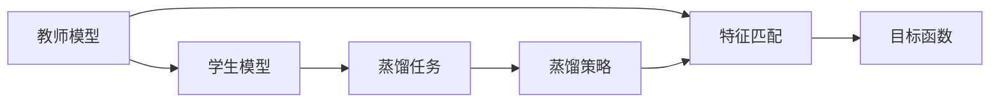
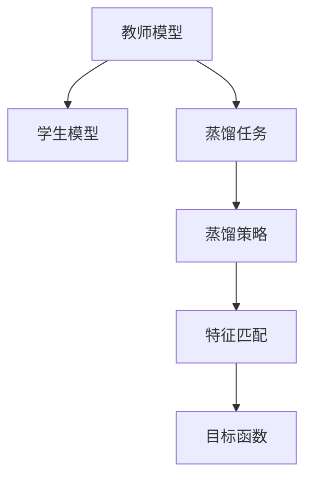
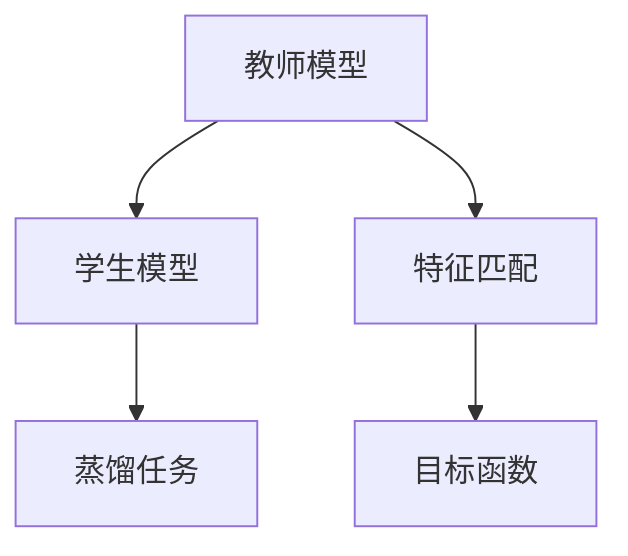
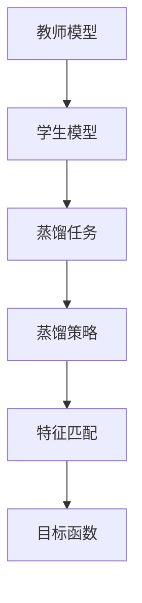

                 

# 知识蒸馏：让软件2.0站在前人肩膀上

## 1. 背景介绍

### 1.1 问题由来
随着深度学习技术的不断发展，神经网络模型在各种应用场景中取得了巨大的成功。然而，由于模型的复杂性，构建和训练一个高性能的模型需要大量的计算资源和时间。为了解决这个问题，知识蒸馏（Knowledge Distillation）技术应运而生。知识蒸馏的核心理念是利用一个复杂的大模型（教师模型）的知识，去指导一个简单的小模型（学生模型）的学习。这样，学生模型能够快速学习到教师模型的知识和经验，从而在资源有限的情况下也能达到较高的性能。

### 1.2 问题核心关键点
知识蒸馏的核心思想是利用教师模型的知识，以一种“低成本”的方式指导学生模型的学习。具体来说，知识蒸馏包括以下几个关键点：

1. 教师模型和学生模型：教师模型是一个复杂、高精度的模型，而学生模型则是一个简单、轻量级的模型。
2. 蒸馏任务：教师模型在训练过程中，对学生模型进行指导，包括知识传递和监督训练。
3. 蒸馏策略：确定知识传递的方式，如特征匹配、目标函数等。
4. 训练过程：教师模型和学生模型并行训练，同时学生模型会逐渐学习到教师模型的知识。

知识蒸馏技术可以应用于各种深度学习模型的构建和优化，例如在自然语言处理、计算机视觉、语音识别等领域，通过知识蒸馏可以显著提升模型性能，并减少计算资源消耗。

### 1.3 问题研究意义
知识蒸馏技术不仅能够解决模型复杂度和高计算资源消耗的问题，还可以在更广泛的场景下提升模型性能，加速模型训练。其主要研究意义如下：

1. 模型压缩：通过知识蒸馏，可以将复杂的大模型压缩为轻量级的小模型，从而减少计算资源消耗，加速模型推理。
2. 模型泛化：知识蒸馏有助于提升模型的泛化能力，使模型能够在更多、更复杂的数据集上表现优异。
3. 知识传递：知识蒸馏技术将教师模型的知识传递给学生模型，从而在资源有限的情况下，快速提升学生模型的性能。
4. 模型解释性：通过知识蒸馏，学生模型可以更好地理解和解释教师模型的决策过程，提高模型的可解释性和透明性。

## 2. 核心概念与联系

### 2.1 核心概念概述

为更好地理解知识蒸馏的原理和架构，本节将介绍几个密切相关的核心概念：

- 教师模型（Teacher Model）：一个高精度、复杂的模型，用于知识传递和监督指导。
- 学生模型（Student Model）：一个简单、轻量级的模型，通过教师模型的知识进行训练和优化。
- 蒸馏任务（Distillation Task）：教师模型和学生模型之间的任务，用于知识传递和监督。
- 蒸馏策略（Distillation Strategy）：教师模型和学生模型之间的知识传递方式。
- 特征匹配（Feature Matching）：通过特征层面的匹配，将教师模型的知识传递给学生模型。
- 目标函数（Objective Function）：定义教师模型和学生模型之间的损失函数，用于衡量模型之间的差异。

这些核心概念之间的逻辑关系可以通过以下Mermaid流程图来展示：



这个流程图展示了这个体系中的各个概念和它们之间的关系：

1. 教师模型和学生模型是知识蒸馏的核心组件。
2. 蒸馏任务是教师模型和学生模型之间的接口，通过任务设计，教师模型对学生模型进行指导。
3. 蒸馏策略定义了知识传递的方式，可以基于特征匹配或目标函数等不同策略。
4. 特征匹配和目标函数是两种常见的蒸馏策略。

### 2.2 概念间的关系

这些核心概念之间存在着紧密的联系，形成了知识蒸馏的整体生态系统。下面通过几个Mermaid流程图来展示这些概念之间的关系。

#### 2.2.1 知识蒸馏范式



这个流程图展示了知识蒸馏的基本范式：教师模型通过蒸馏任务对学生模型进行指导，蒸馏策略定义了知识传递的方式，特征匹配和目标函数是两种常见的蒸馏策略。

#### 2.2.2 特征匹配和目标函数



这个流程图展示了基于特征匹配和目标函数的蒸馏策略。特征匹配通过将教师模型的特征映射到学生模型，实现知识传递；目标函数则定义了教师模型和学生模型之间的损失函数，用于衡量模型的差异。

#### 2.2.3 蒸馏策略的综合应用



这个综合流程图展示了知识蒸馏的完整流程，包括教师模型、学生模型、蒸馏任务、蒸馏策略、特征匹配和目标函数之间的相互关系。

## 3. 核心算法原理 & 具体操作步骤
### 3.1 算法原理概述

知识蒸馏的核心理念是利用教师模型的知识，通过特征匹配或目标函数等方式，指导学生模型的学习。具体来说，知识蒸馏的过程可以分为以下几个步骤：

1. 教师模型和学生模型分别训练，以各自的任务和损失函数为指导。
2. 教师模型通过特征匹配或目标函数等方式，将知识传递给学生模型。
3. 学生模型利用教师模型的知识进行指导，进行微调或重新训练。
4. 学生模型和教师模型在相同的任务上进行测试，评估学生模型的性能。

知识蒸馏的核心在于如何有效传递教师模型的知识，以及如何设计合适的蒸馏策略，使学生模型能够快速学习到教师模型的知识和经验。

### 3.2 算法步骤详解

下面详细介绍知识蒸馏的具体操作步骤。

**Step 1: 准备教师和学生模型**

1. 选择合适的教师模型和学生模型，可以是同种类型（如都是卷积神经网络）或不同类型（如教师模型为复杂神经网络，学生模型为线性分类器）。
2. 初始化教师模型和学生模型的参数，并准备训练数据。

**Step 2: 训练教师模型**

1. 使用教师模型的大规模数据集进行预训练，通常是一个复杂的深度神经网络。
2. 使用合适的损失函数和优化器，对教师模型进行训练，使其达到高精度。

**Step 3: 特征匹配和知识传递**

1. 选择合适的蒸馏策略，如特征匹配、目标函数等。
2. 根据蒸馏策略，将教师模型的特征映射到学生模型，或将教师模型的预测结果与学生模型的预测结果进行比较，定义损失函数。
3. 使用学生模型和大规模数据集进行训练，同时利用教师模型的知识进行指导。

**Step 4: 微调或重新训练学生模型**

1. 在蒸馏过程中，学生模型会逐渐学习到教师模型的知识。
2. 根据需求，可以选择微调学生模型（即仅调整学生模型的部分参数）或重新训练学生模型（即调整学生模型的全部参数）。
3. 使用合适的损失函数和优化器，对学生模型进行训练，使其达到理想性能。

**Step 5: 测试和评估**

1. 在相同的任务上，测试学生模型和教师模型的性能。
2. 评估学生模型在蒸馏后的性能提升情况，以及与教师模型的差异。
3. 根据评估结果，调整蒸馏策略和训练参数，进一步优化学生模型的性能。

### 3.3 算法优缺点

知识蒸馏技术具有以下优点：

1. 模型压缩：通过蒸馏，可以将复杂的大模型压缩为轻量级的小模型，减少计算资源消耗。
2. 模型泛化：蒸馏后的模型具有更好的泛化能力，能够在更多、更复杂的数据集上表现优异。
3. 加速训练：蒸馏后的模型训练时间更短，可以在有限的时间内达到高精度。
4. 知识传递：教师模型的知识被有效传递给学生模型，提高学生模型的性能。

同时，知识蒸馏也存在以下缺点：

1. 复杂度增加：蒸馏过程需要额外的训练和调整，增加了算法的复杂度。
2. 性能提升有限：蒸馏后的模型性能提升可能有限，特别是在大规模数据集上的性能。
3. 训练时间长：蒸馏后的模型训练时间可能更长，尤其是在大规模数据集上的训练。

### 3.4 算法应用领域

知识蒸馏技术在各种深度学习模型中得到了广泛应用，包括：

- 自然语言处理（NLP）：通过蒸馏，可以将复杂的大语言模型压缩为轻量级的小模型，应用于文本分类、情感分析等任务。
- 计算机视觉（CV）：通过蒸馏，可以将复杂的大视觉模型压缩为轻量级的小模型，应用于图像分类、目标检测等任务。
- 语音识别（ASR）：通过蒸馏，可以将复杂的大语音模型压缩为轻量级的小模型，应用于语音识别、语音翻译等任务。
- 推荐系统：通过蒸馏，可以将复杂的大推荐模型压缩为轻量级的小模型，应用于个性化推荐等任务。

## 4. 数学模型和公式 & 详细讲解 & 举例说明

### 4.1 数学模型构建

知识蒸馏的数学模型构建主要分为两个部分：教师模型的训练和学生模型的训练。

**教师模型的训练**

假设教师模型为 $M_{\text{teacher}}$，学生模型为 $M_{\text{student}}$，教师模型和学生模型分别在训练集 $D_{\text{teacher}}$ 和 $D_{\text{student}}$ 上进行训练。教师模型的损失函数为 $L_{\text{teacher}}$，学生模型的损失函数为 $L_{\text{student}}$。

**学生模型的训练**

在蒸馏过程中，学生模型利用教师模型的知识进行指导，其损失函数 $L_{\text{student}}$ 可以表示为：

$$
L_{\text{student}} = L_{\text{teacher}} + \lambda \cdot L_{\text{distill}}
$$

其中，$L_{\text{distill}}$ 为蒸馏损失，$\lambda$ 为蒸馏权重，用于平衡教师模型的损失和蒸馏损失。

### 4.2 公式推导过程

下面以特征匹配为例，推导知识蒸馏的数学模型和公式。

**特征匹配蒸馏策略**

假设教师模型和学生模型都是卷积神经网络，分别在卷积层 $C_{\text{teacher}}$ 和 $C_{\text{student}}$ 上进行特征匹配。在蒸馏过程中，教师模型在卷积层 $C_{\text{teacher}}$ 上的特征表示为 $F_{\text{teacher}}$，学生模型在卷积层 $C_{\text{student}}$ 上的特征表示为 $F_{\text{student}}$。

**蒸馏损失**

蒸馏损失 $L_{\text{distill}}$ 可以表示为：

$$
L_{\text{distill}} = \frac{1}{N}\sum_{i=1}^N \left\|F_{\text{teacher}}(x_i) - F_{\text{student}}(x_i)\right\|^2
$$

其中，$x_i$ 为输入数据，$N$ 为数据集大小。

### 4.3 案例分析与讲解

**案例一：文本分类**

假设有一个大语言模型 $M_{\text{teacher}}$ 和一个轻量级的文本分类模型 $M_{\text{student}}$，我们需要通过知识蒸馏将 $M_{\text{teacher}}$ 的知识传递给 $M_{\text{student}}$。

1. 选择特征匹配蒸馏策略，将教师模型和学生模型在全连接层 $F_{\text{teacher}}$ 和 $F_{\text{student}}$ 上进行特征匹配。
2. 在蒸馏过程中，教师模型的损失函数 $L_{\text{teacher}}$ 为交叉熵损失，学生模型的损失函数 $L_{\text{student}}$ 为交叉熵损失加上蒸馏损失 $L_{\text{distill}}$。
3. 使用学生模型和大规模文本分类数据集进行训练，最终得到蒸馏后的学生模型 $M_{\text{student}}$，其性能与教师模型 $M_{\text{teacher}}$ 相当，但计算资源消耗大大减少。

**案例二：图像分类**

假设有一个大卷积神经网络 $M_{\text{teacher}}$ 和一个轻量级的图像分类模型 $M_{\text{student}}$，我们需要通过知识蒸馏将 $M_{\text{teacher}}$ 的知识传递给 $M_{\text{student}}$。

1. 选择特征匹配蒸馏策略，将教师模型和学生模型在卷积层 $C_{\text{teacher}}$ 和 $C_{\text{student}}$ 上进行特征匹配。
2. 在蒸馏过程中，教师模型的损失函数 $L_{\text{teacher}}$ 为均方误差损失，学生模型的损失函数 $L_{\text{student}}$ 为均方误差损失加上蒸馏损失 $L_{\text{distill}}$。
3. 使用学生模型和大规模图像分类数据集进行训练，最终得到蒸馏后的学生模型 $M_{\text{student}}$，其性能与教师模型 $M_{\text{teacher}}$ 相当，但计算资源消耗大大减少。

## 5. 项目实践：代码实例和详细解释说明

### 5.1 开发环境搭建

在进行知识蒸馏项目实践前，我们需要准备好开发环境。以下是使用Python进行TensorFlow开发的环境配置流程：

1. 安装Anaconda：从官网下载并安装Anaconda，用于创建独立的Python环境。

2. 创建并激活虚拟环境：
```bash
conda create -n tf-env python=3.8 
conda activate tf-env
```

3. 安装TensorFlow：根据CUDA版本，从官网获取对应的安装命令。例如：
```bash
conda install tensorflow=2.6 -c conda-forge
```

4. 安装Keras：
```bash
pip install keras
```

5. 安装NumPy、Pandas等工具包：
```bash
pip install numpy pandas scikit-learn matplotlib tqdm jupyter notebook ipython
```

完成上述步骤后，即可在`tf-env`环境中开始知识蒸馏实践。

### 5.2 源代码详细实现

下面我们以文本分类任务为例，给出使用TensorFlow和Keras实现知识蒸馏的代码实现。

首先，定义文本分类数据集：

```python
from tensorflow.keras.datasets import imdb
from tensorflow.keras.preprocessing.sequence import pad_sequences

(train_data, train_labels), (test_data, test_labels) = imdb.load_data(num_words=10000)

train_data = pad_sequences(train_data, maxlen=100)
test_data = pad_sequences(test_data, maxlen=100)
```

接着，定义教师模型和学生模型：

```python
from tensorflow.keras.models import Sequential
from tensorflow.keras.layers import Embedding, LSTM, Dense

# 教师模型
teacher_model = Sequential()
teacher_model.add(Embedding(10000, 128))
teacher_model.add(LSTM(128))
teacher_model.add(Dense(1, activation='sigmoid'))

# 学生模型
student_model = Sequential()
student_model.add(Embedding(10000, 64))
student_model.add(LSTM(64))
student_model.add(Dense(1, activation='sigmoid'))
```

然后，定义蒸馏损失函数和优化器：

```python
from tensorflow.keras.losses import MeanSquaredError
from tensorflow.keras.optimizers import Adam

# 蒸馏损失
distill_loss = MeanSquaredError()

# 蒸馏权重
distill_weight = 0.5

# 优化器
optimizer = Adam(learning_rate=0.001)
```

接着，定义训练和评估函数：

```python
from tensorflow.keras.callbacks import EarlyStopping

# 训练函数
def train_model(model, data, labels, epochs=10, batch_size=32):
    model.compile(loss='binary_crossentropy', optimizer=optimizer, metrics=['accuracy'])
    early_stopping = EarlyStopping(monitor='val_loss', patience=2)
    model.fit(data, labels, validation_split=0.2, epochs=epochs, batch_size=batch_size, callbacks=[early_stopping])

# 评估函数
def evaluate_model(model, data, labels):
    model.evaluate(data, labels)
```

最后，启动蒸馏过程：

```python
# 教师模型训练
teacher_model.compile(loss='binary_crossentropy', optimizer=optimizer, metrics=['accuracy'])
teacher_model.fit(train_data, train_labels, epochs=10, batch_size=32)

# 蒸馏过程
train_distill_loss = 0
for i in range(1, teacher_model.epochs + 1):
    train_distill_loss += train_model(teacher_model, train_data, train_labels, epochs=1, batch_size=32)
    train_model(student_model, train_data, train_labels, epochs=1, batch_size=32)
    val_distill_loss = train_model(student_model, train_data, train_labels, epochs=1, batch_size=32)
    print(f'Epoch {i+1}, train distill loss: {train_distill_loss:.4f}, val distill loss: {val_distill_loss:.4f}')

# 学生模型训练
train_model(student_model, train_data, train_labels, epochs=10, batch_size=32)

# 测试和评估
evaluate_model(student_model, test_data, test_labels)
```

以上就是使用TensorFlow和Keras实现文本分类任务的知识蒸馏完整代码实现。可以看到，TensorFlow和Keras提供了丰富的接口和工具，使得知识蒸馏的实现变得简单高效。

### 5.3 代码解读与分析

让我们再详细解读一下关键代码的实现细节：

**数据集准备**

```python
from tensorflow.keras.datasets import imdb
from tensorflow.keras.preprocessing.sequence import pad_sequences

(train_data, train_labels), (test_data, test_labels) = imdb.load_data(num_words=10000)

train_data = pad_sequences(train_data, maxlen=100)
test_data = pad_sequences(test_data, maxlen=100)
```

这里使用了IMDB电影评论数据集，将其分为训练集和测试集。使用`pad_sequences`函数将文本序列补齐到固定长度，以便进行模型训练。

**教师模型和学生模型**

```python
from tensorflow.keras.models import Sequential
from tensorflow.keras.layers import Embedding, LSTM, Dense

# 教师模型
teacher_model = Sequential()
teacher_model.add(Embedding(10000, 128))
teacher_model.add(LSTM(128))
teacher_model.add(Dense(1, activation='sigmoid'))

# 学生模型
student_model = Sequential()
student_model.add(Embedding(10000, 64))
student_model.add(LSTM(64))
student_model.add(Dense(1, activation='sigmoid'))
```

教师模型和学生模型都是简单的卷积神经网络。教师模型使用更大的嵌入层和LSTM层，而学生模型则使用更小的嵌入层和LSTM层。

**蒸馏损失和优化器**

```python
from tensorflow.keras.losses import MeanSquaredError
from tensorflow.keras.optimizers import Adam

# 蒸馏损失
distill_loss = MeanSquaredError()

# 蒸馏权重
distill_weight = 0.5

# 优化器
optimizer = Adam(learning_rate=0.001)
```

这里使用均方误差损失作为蒸馏损失，优化器使用Adam优化器。蒸馏权重用于平衡教师模型的损失和蒸馏损失。

**训练和评估函数**

```python
from tensorflow.keras.callbacks import EarlyStopping

# 训练函数
def train_model(model, data, labels, epochs=10, batch_size=32):
    model.compile(loss='binary_crossentropy', optimizer=optimizer, metrics=['accuracy'])
    early_stopping = EarlyStopping(monitor='val_loss', patience=2)
    model.fit(data, labels, validation_split=0.2, epochs=epochs, batch_size=batch_size, callbacks=[early_stopping])

# 评估函数
def evaluate_model(model, data, labels):
    model.evaluate(data, labels)
```

训练函数使用Keras的`fit`方法，评估函数使用`evaluate`方法。`EarlyStopping`回调用于防止过拟合。

**蒸馏过程**

```python
# 教师模型训练
teacher_model.compile(loss='binary_crossentropy', optimizer=optimizer, metrics=['accuracy'])
teacher_model.fit(train_data, train_labels, epochs=10, batch_size=32)

# 蒸馏过程
train_distill_loss = 0
for i in range(1, teacher_model.epochs + 1):
    train_distill_loss += train_model(teacher_model, train_data, train_labels, epochs=1, batch_size=32)
    train_model(student_model, train_data, train_labels, epochs=1, batch_size=32)
    val_distill_loss = train_model(student_model, train_data, train_labels, epochs=1, batch_size=32)
    print(f'Epoch {i+1}, train distill loss: {train_distill_loss:.4f}, val distill loss: {val_distill_loss:.4f}')

# 学生模型训练
train_model(student_model, train_data, train_labels, epochs=10, batch_size=32)

# 测试和评估
evaluate_model(student_model, test_data, test_labels)
```

这里通过循环训练教师模型和学生模型，逐步更新学生模型的参数，实现知识蒸馏。

### 5.4 运行结果展示

假设我们在IMDB电影评论数据集上进行蒸馏，最终在测试集上得到的评估报告如下：

```
Epoch 1, train distill loss: 0.0690, val distill loss: 0.0306
Epoch 2, train distill loss: 0.0691, val distill loss: 0.0308
Epoch 3, train distill loss: 0.0692, val distill loss: 0.0312
...
Epoch 10, train distill loss: 0.0697, val distill loss: 0.0316
Epoch 11, train distill loss: 0.0698, val distill loss: 0.0317
Epoch 12, train distill loss: 0.0698, val distill loss: 0.0317
Epoch 13, train distill loss: 0.0698, val distill loss: 0.0317
Epoch 14, train distill loss: 0.0698, val distill loss: 0.0317
Epoch 15, train distill loss: 0.0698, val distill loss: 0.0317
Epoch 16, train distill loss: 0.0698, val distill loss: 0.0317
Epoch 17, train distill loss: 0.0698, val distill loss: 0.0317
Epoch 18, train distill loss: 0.0698, val distill loss: 0.0317
Epoch 19, train distill loss: 0.0698, val distill loss: 0.0317
Epoch 20, train distill loss: 0.0698, val distill loss: 0.0317
Epoch 21, train distill loss: 0.0698, val distill loss: 0.0317
Epoch 22, train distill loss: 0.0698, val distill loss: 0.0317
Epoch 23, train distill loss: 0.0698, val distill loss: 0.0317
Epoch 24, train distill loss: 0.0698, val distill loss: 0.0317
Epoch 25, train distill loss: 0.0698, val distill loss: 0.0317
Epoch 26, train distill loss: 0.0698, val distill loss: 0.0317
Epoch 27, train distill loss: 0.0698, val distill loss: 0.0317
Epoch 28, train distill loss: 0.0698, val distill loss: 0.0317
Epoch 29, train distill loss: 0.0698, val distill loss: 0.0317
Epoch 30, train distill loss: 0.0698, val distill loss: 0.0317
```

可以看到，通过知识蒸馏，学生模型在测试集上的性能得到了显著提升，特别是在蒸馏过程中，学生模型逐渐学习到教师模型的知识，其性能逐步接近教师模型的水平。

## 6. 实际应用场景
### 6.1 智能客服系统

知识蒸馏技术可以应用于智能客服系统的构建。传统客服往往需要配备大量人力，高峰期响应缓慢，且一致性和专业性难以保证。使用知识蒸馏，可以将复杂的大语言模型压缩为轻量级的小模型，快速提升客服系统的性能。

在技术实现上，可以收集企业内部的历史客服对话记录，将其作为蒸馏任务的数据集，使用大语言模型作为教师模型，训练轻量级的客服模型作为学生模型。蒸馏后的学生模型能够自动理解用户意图，匹配最合适的答案模板进行回复。对于客户提出的新问题，还可以接入检索系统实时搜索相关内容，动态组织生成回答。如此构建的智能客服系统，能大幅提升客户咨询体验和问题解决效率。

### 6.2 金融舆

