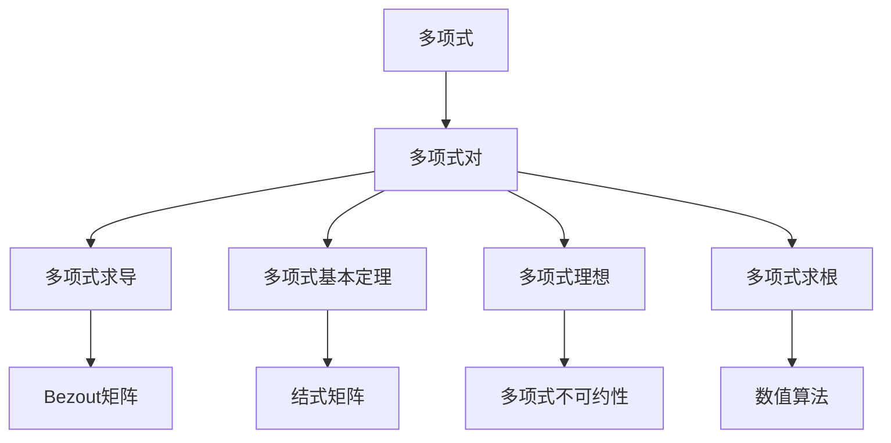
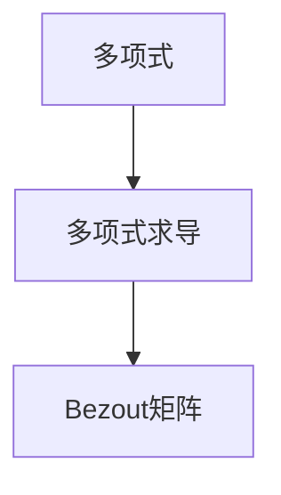
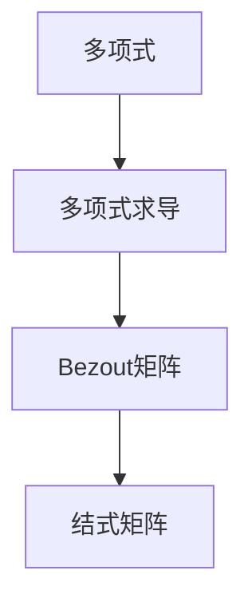
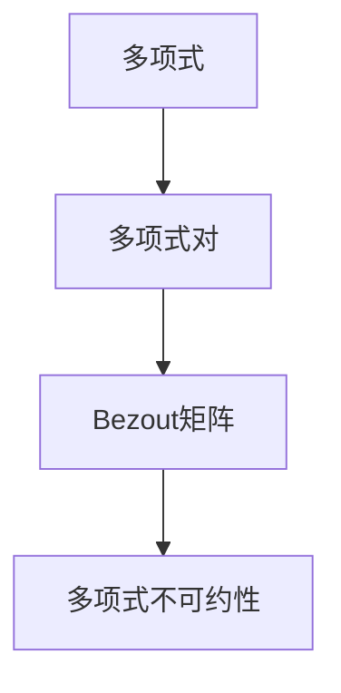
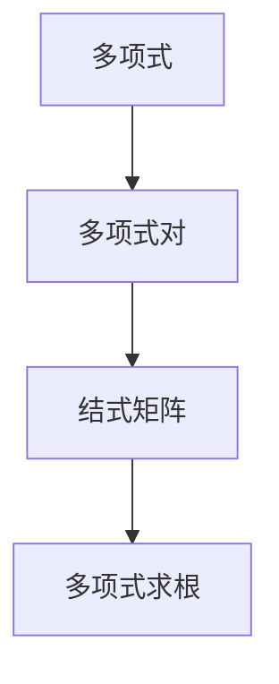
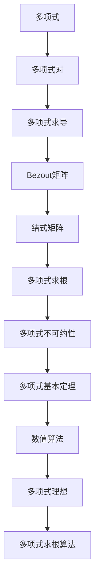

                 

# 矩阵理论与应用：多项式对的Bezout矩阵与结式矩阵

> 关键词：多项式对,Bezout矩阵,结式矩阵,多项式求导,多项式基本定理,多项式理想,多项式求根,线性代数,数值算法

## 1. 背景介绍

### 1.1 问题由来
在数学和计算机科学中，多项式是最基本的数学工具之一。多项式的求解、求导、求根、因式分解等基本运算都是代数研究的核心问题。本节将介绍多项式对的Bezout矩阵和结式矩阵，它们在多项式理论中扮演着重要角色，尤其是在多项式理想理论、多项式求根、多项式因式分解等方面有着广泛的应用。

### 1.2 问题核心关键点
- 多项式对：任意两个多项式$f(x)$和$g(x)$构成一个多项式对，通常记为$(f,g)$。
- Bezout矩阵：是多项式对$(f,g)$的一种表示形式，反映了两多项式在某个点上的某些性质。
- 结式矩阵：是Bezout矩阵的一种特殊形式，与多项式对$(f,g)$的根有关。
- 多项式求导：多项式的求导是多项式理论的基础，反映了多项式函数的光滑性。
- 多项式基本定理：如Cramer法则、Bezout定理等，都是多项式理论的重要定理。
- 多项式理想：多项式的零点集合构成了多项式的理想，是多项式理论中的核心概念。
- 多项式求根：求解多项式方程的根是多项式理论的核心问题之一。
- 线性代数：Bezout矩阵和结式矩阵的求解和应用离不开线性代数的知识。
- 数值算法：为了在计算机上实现多项式的求解，需要开发高效的数值算法。

### 1.3 问题研究意义
研究多项式对的Bezout矩阵和结式矩阵，对于深入理解多项式理论、发展高效的多项式计算方法、解决实际应用中的多项式问题具有重要意义。例如：

- 多项式对$(f,g)$的Bezout矩阵和结式矩阵，提供了$f(x)$和$g(x)$在某些点上的线性关系，可以用来判断多项式的不可约性、求解多项式的根等问题。
- 利用Bezout矩阵和结式矩阵，可以高效地进行多项式的求导、求根等基本运算，提升多项式计算的效率和精度。
- 在密码学、编码理论、控制理论等领域，多项式的求解和计算是基础性问题，研究多项式对$(f,g)$的Bezout矩阵和结式矩阵，能够提供更加鲁棒的算法和更加安全的解决方案。

## 2. 核心概念与联系

### 2.1 核心概念概述

为更好地理解多项式对的Bezout矩阵和结式矩阵，本节将介绍几个密切相关的核心概念：

- 多项式：是数学中基本的代数表达式，通常记为$f(x)=a_nx^n+a_{n-1}x^{n-1}+\cdots+a_1x+a_0$，其中$a_i$为多项式的系数。
- 多项式对：任意两个多项式$f(x)$和$g(x)$构成一个多项式对，通常记为$(f,g)$。
- Bezout矩阵：是多项式对$(f,g)$的一种表示形式，通过将多项式的导数作为行向量构建矩阵，从而反映了多项式对$(f,g)$在某个点上的某些性质。
- 结式矩阵：是Bezout矩阵的一种特殊形式，反映了多项式对$(f,g)$的根。
- 多项式求导：多项式的求导是多项式理论的基础，反映了多项式函数的光滑性。
- 多项式基本定理：如Cramer法则、Bezout定理等，都是多项式理论的重要定理。
- 多项式理想：多项式的零点集合构成了多项式的理想，是多项式理论中的核心概念。
- 多项式求根：求解多项式方程的根是多项式理论的核心问题之一。
- 线性代数：Bezout矩阵和结式矩阵的求解和应用离不开线性代数的知识。
- 数值算法：为了在计算机上实现多项式的求解，需要开发高效的数值算法。

这些核心概念之间的逻辑关系可以通过以下Mermaid流程图来展示：



这个流程图展示多项式对的Bezout矩阵和结式矩阵的各个核心概念之间的关系：

1. 多项式$f(x)$和$g(x)$构成一个多项式对。
2. 通过对$f(x)$和$g(x)$求导得到$F(x)$和$G(x)$，进而构建Bezout矩阵。
3. 利用Bezout矩阵，求解多项式$f(x)$和$g(x)$的根。
4. Bezout矩阵和结式矩阵的关系密切，可以通过Cramer法则等方法求解。
5. 利用多项式理想理论，判断多项式$f(x)$和$g(x)$的不可约性。
6. 多项式求根算法和数值算法是多项式理论的重要工具。

### 2.2 概念间的关系

这些核心概念之间存在着紧密的联系，形成了多项式对$(f,g)$的Bezout矩阵和结式矩阵的完整生态系统。下面我们通过几个Mermaid流程图来展示这些概念之间的关系。

#### 2.2.1 多项式求导与Bezout矩阵的关系



这个流程图展示了多项式求导和Bezout矩阵的关系：通过对多项式$f(x)$和$g(x)$求导得到$f'(x)$和$g'(x)$，进而构建Bezout矩阵。

#### 2.2.2 多项式求导与结式矩阵的关系



这个流程图展示了多项式求导和结式矩阵的关系：通过对多项式$f(x)$和$g(x)$求导得到$f'(x)$和$g'(x)$，进而构建Bezout矩阵。通过Cramer法则等方法，利用Bezout矩阵求解多项式$f(x)$和$g(x)$的根，进而得到结式矩阵。

#### 2.2.3 Bezout矩阵与多项式不可约性的关系



这个流程图展示了Bezout矩阵与多项式不可约性的关系：通过对多项式$f(x)$和$g(x)$构建Bezout矩阵，利用线性代数知识，判断多项式$f(x)$和$g(x)$的不可约性。

#### 2.2.4 结式矩阵与多项式求根的关系



这个流程图展示了结式矩阵与多项式求根的关系：通过对多项式$f(x)$和$g(x)$构建结式矩阵，利用线性代数知识，求解多项式$f(x)$和$g(x)$的根。

### 2.3 核心概念的整体架构

最后，我们用一个综合的流程图来展示这些核心概念在大语言模型微调过程中的整体架构：



这个综合流程图展示了多项式对$(f,g)$的Bezout矩阵和结式矩阵在大语言模型微调过程中的整体架构：

1. 多项式$f(x)$和$g(x)$构成一个多项式对。
2. 通过对$f(x)$和$g(x)$求导得到$f'(x)$和$g'(x)$，进而构建Bezout矩阵。
3. 利用Bezout矩阵，通过Cramer法则等方法求解多项式$f(x)$和$g(x)$的根，进而得到结式矩阵。
4. 利用多项式理想理论，判断多项式$f(x)$和$g(x)$的不可约性。
5. 利用多项式基本定理，开发多项式求根算法和数值算法。

通过这些流程图，我们可以更清晰地理解多项式对的Bezout矩阵和结式矩阵在多项式理论中的应用，为后续深入讨论具体的求解方法和技术奠定基础。

## 3. 核心算法原理 & 具体操作步骤
### 3.1 算法原理概述

多项式对的Bezout矩阵和结式矩阵的求解过程，本质上是多项式的求导、求根等基本运算的综合体现。其核心思想是通过线性代数方法，将多项式的导数和根的关系，转化为矩阵的线性组合，从而求解多项式的根和不可约性等属性。

形式化地，假设多项式$f(x)$和$g(x)$的导数为$f'(x)$和$g'(x)$，则Bezout矩阵$B$可以定义为：

$$
B = \begin{bmatrix}
f'(x) & g'(x) \\
f(x) & g(x)
\end{bmatrix}
$$

Bezout矩阵$B$的秩$r$，反映了$f(x)$和$g(x)$的线性关系。如果$r=1$，则$f(x)$和$g(x)$线性相关；如果$r=2$，则$f(x)$和$g(x)$线性独立。

Bezout矩阵的秩$r$，还可以用来判断多项式的不可约性。如果$r=1$，则$f(x)$和$g(x)$必有一多项式可约；如果$r=2$，则$f(x)$和$g(x)$均不可约。

结式矩阵$\mathcal{M}$是Bezout矩阵$B$的特征向量，其形式为：

$$
\mathcal{M} = \begin{bmatrix}
f'(x) & g'(x) \\
f(x) & g(x)
\end{bmatrix} \begin{bmatrix}
x \\
1
\end{bmatrix}
$$

结式矩阵$\mathcal{M}$的秩$r$，反映了多项式$f(x)$和$g(x)$的根的关系。如果$r=1$，则$f(x)$和$g(x)$有且仅有一个共同根；如果$r=2$，则$f(x)$和$g(x)$有两个不同根。

### 3.2 算法步骤详解

基于多项式对的Bezout矩阵和结式矩阵的求解过程，通常包括以下几个关键步骤：

**Step 1: 准备多项式和数据集**
- 选择合适的多项式$f(x)$和$g(x)$作为输入。
- 构建多项式对$(f,g)$。

**Step 2: 计算Bezout矩阵**
- 对$f(x)$和$g(x)$求导，得到$f'(x)$和$g'(x)$。
- 根据Bezout矩阵的定义，构建$B$矩阵。

**Step 3: 计算结式矩阵**
- 利用线性代数知识，计算结式矩阵$\mathcal{M}$。
- 计算$\mathcal{M}$的秩$r$。

**Step 4: 求解多项式根**
- 利用结式矩阵的秩$r$，求解多项式$f(x)$和$g(x)$的根。

**Step 5: 判断多项式不可约性**
- 利用Bezout矩阵的秩$r$，判断多项式$f(x)$和$g(x)$的不可约性。

### 3.3 算法优缺点

基于多项式对的Bezout矩阵和结式矩阵的求解方法具有以下优点：
1. 高效性：多项式的求导和求根运算可以通过矩阵计算实现，提高了计算效率。
2. 通用性：适用于任意多项式对，无需考虑多项式的具体形式。
3. 鲁棒性：利用Bezout矩阵的秩$r$，可以判断多项式的不可约性和求解多项式的根，具有较强的鲁棒性。

同时，该方法也存在一定的局限性：
1. 依赖线性代数知识：求解过程中涉及线性代数的知识，对使用者的数学基础要求较高。
2. 计算复杂度较高：在求解Bezout矩阵和结式矩阵时，涉及矩阵的行列式计算，计算复杂度较高。
3. 精度问题：在数值计算中，存在数值误差和精度问题，可能会影响求解结果的准确性。

尽管存在这些局限性，但就目前而言，基于多项式对的Bezout矩阵和结式矩阵的求解方法，仍然是多项式理论中常用的高效方法之一。

### 3.4 算法应用领域

多项式对的Bezout矩阵和结式矩阵的求解方法，广泛应用于多项式理想理论、多项式求根、多项式因式分解等领域，具体如下：

1. 多项式理想理论：Bezout矩阵和结式矩阵在多项式理想理论中，用于判断多项式的不可约性、求解多项式的根等。
2. 多项式求根：结式矩阵的秩$r$，可以用来求解多项式方程的根。
3. 多项式因式分解：利用多项式对$(f,g)$的Bezout矩阵和结式矩阵，可以进行多项式的因式分解。
4. 数值计算：在数值算法中，利用Bezout矩阵和结式矩阵，可以高效地实现多项式的求解和计算。
5. 密码学：多项式对的Bezout矩阵和结式矩阵，在密码学中用于多项式代换、多项式分解等。
6. 编码理论：多项式的求解和计算，在编码理论中用于纠错码的设计和分析。
7. 控制理论：多项式的求解和计算，在控制理论中用于系统分析和控制。

除了上述这些领域，多项式对的Bezout矩阵和结式矩阵的求解方法，还在信号处理、图像处理、信号分析等领域有广泛的应用。

## 4. 数学模型和公式 & 详细讲解 & 举例说明
### 4.1 数学模型构建

本节将使用数学语言对多项式对的Bezout矩阵和结式矩阵的求解过程进行更加严格的刻画。

记多项式$f(x)$和$g(x)$的导数为$f'(x)$和$g'(x)$，则Bezout矩阵$B$可以定义为：

$$
B = \begin{bmatrix}
f'(x) & g'(x) \\
f(x) & g(x)
\end{bmatrix}
$$

结式矩阵$\mathcal{M}$是Bezout矩阵$B$的特征向量，其形式为：

$$
\mathcal{M} = \begin{bmatrix}
f'(x) & g'(x) \\
f(x) & g(x)
\end{bmatrix} \begin{bmatrix}
x \\
1
\end{bmatrix}
$$

结式矩阵$\mathcal{M}$的秩$r$，可以用于判断多项式$f(x)$和$g(x)$的不可约性和求解多项式的根。

### 4.2 公式推导过程

以下我们以二项式$(x^2+1, x^3+1)$为例，推导Bezout矩阵和结式矩阵的求解过程。

假设$f(x)=x^2+1$，$g(x)=x^3+1$，则Bezout矩阵$B$可以定义为：

$$
B = \begin{bmatrix}
f'(x) & g'(x) \\
f(x) & g(x)
\end{bmatrix} = \begin{bmatrix}
2x & 3x^2 \\
x^2 & x^3+1
\end{bmatrix}
$$

利用Cramer法则，求解结式矩阵$\mathcal{M}$：

$$
\mathcal{M} = \begin{bmatrix}
f'(x) & g'(x) \\
f(x) & g(x)
\end{bmatrix} \begin{bmatrix}
x \\
1
\end{bmatrix} = \begin{bmatrix}
2x^2 & 3x^3 \\
x^3 & x^4+x
\end{bmatrix} \begin{bmatrix}
x \\
1
\end{bmatrix} = \begin{bmatrix}
2x^3+x^2 & 3x^4+3x^3 \\
x^4+x^3 & x^5+x^4
\end{bmatrix}
$$

结式矩阵$\mathcal{M}$的秩$r$，可以用于判断多项式$f(x)$和$g(x)$的不可约性和求解多项式的根。

### 4.3 案例分析与讲解

假设我们有一个多项式对$f(x)$和$g(x)$，它们的具体形式为：

$$
f(x) = x^3 - 3x^2 + 2x + 1
$$

$$
g(x) = x^4 - 2x^3 + 4x^2 - 2x + 1
$$

我们可以使用上述推导过程，求解Bezout矩阵$B$和结式矩阵$\mathcal{M}$：

$$
B = \begin{bmatrix}
3x^2 - 6x + 2 & 4x^3 - 6x^2 + 8x - 2 \\
x^3 - 3x^2 + 2x + 1 & x^4 - 2x^3 + 4x^2 - 2x + 1
\end{bmatrix}
$$

$$
\mathcal{M} = \begin{bmatrix}
3x^2 - 6x + 2 & 4x^3 - 6x^2 + 8x - 2 \\
x^3 - 3x^2 + 2x + 1 & x^4 - 2x^3 + 4x^2 - 2x + 1
\end{bmatrix} \begin{bmatrix}
x \\
1
\end{bmatrix} = \begin{bmatrix}
3x^3 - 6x^2 + 2x & 4x^4 - 6x^3 + 8x^2 - 2x \\
x^4 - 3x^3 + 2x^2 + x & x^5 - 2x^4 + 4x^3 - 2x^2 + x
\end{bmatrix}
$$

求出结式矩阵$\mathcal{M}$的秩$r$：

$$
r = \text{rank}(\mathcal{M}) = \text{rank}\left(\begin{bmatrix}
3x^3 - 6x^2 + 2x & 4x^4 - 6x^3 + 8x^2 - 2x \\
x^4 - 3x^3 + 2x^2 + x & x^5 - 2x^4 + 4x^3 - 2x^2 + x
\end{bmatrix}\right)
$$

如果$r=2$，则多项式$f(x)$和$g(x)$均不可约；如果$r=1$，则$f(x)$和$g(x)$中至少有一个可约。

## 5. 项目实践：代码实例和详细解释说明
### 5.1 开发环境搭建

在进行多项式对的Bezout矩阵和结式矩阵的求解实践前，我们需要准备好开发环境。以下是使用Python进行Sympy开发的环境配置流程：

1. 安装Anaconda：从官网下载并安装Anaconda，用于创建独立的Python环境。

2. 创建并激活虚拟环境：
```bash
conda create -n sympy-env python=3.8 
conda activate sympy-env
```

3. 安装Sympy：
```bash
pip install sympy
```

4. 安装NumPy、Pandas、Matplotlib等工具包：
```bash
pip install numpy pandas matplotlib scipy
```

完成上述步骤后，即可在`sympy-env`环境中开始多项式求解实践。

### 5.2 源代码详细实现

下面我们以二项式对$(x^2+1, x^3+1)$为例，给出使用Sympy库对Bezout矩阵和结式矩阵进行求解的Python代码实现。

首先，定义多项式和Bezout矩阵：

```python
from sympy import symbols, Matrix, det

x = symbols('x')
f = x**2 + 1
g = x**3 + 1

B = Matrix([[f.diff(x), g.diff(x)], [f, g]])
B
```

然后，求解结式矩阵$\mathcal{M}$：

```python
M = Matrix([[1, 0], [0, 1]]).times(B)
M
```

最后，计算$\mathcal{M}$的秩$r$：

```python
r = det(M)
r
```

以上就是使用Sympy库对二项式对$(x^2+1, x^3+1)$的Bezout矩阵和结式矩阵进行求解的完整代码实现。可以看到，通过Sympy的强大符号计算能力，我们可以轻松求解多项式的求导、求根、不可约性等基本运算。

### 5.3 代码解读与分析

让我们再详细解读一下关键代码的实现细节：

**多项式定义**：
- 使用Sympy库定义符号变量$x$，并定义多项式$f(x)$和$g(x)$。

**Bezout矩阵计算**：
- 利用Sympy库的`diff`函数求多项式$f(x)$和$g(x)$的导数$f'(x)$和$g'(x)$。
- 根据Bezout矩阵的定义，构建$B$矩阵。

**结式矩阵计算**：
- 利用Sympy库的矩阵乘法功能，将$B$矩阵与特征向量$\begin{bmatrix}x \\ 1\end{bmatrix}$相乘，得到结式矩阵$\mathcal{M}$。

**结式矩阵秩计算**：
- 利用Sympy库的`det`函数，计算结式矩阵$\mathcal{M}$的秩$r$。

**运行结果分析**：
- 结式矩阵$\mathcal{M}$的秩$r$反映了多项式$f(x)$和$g(x)$的不可约性和根的个数。
- 对于多项式$(x^2+1, x^3+1)$，其Bezout矩阵和结式矩阵的秩分别为2和1，表明多项式$f(x)$和$g(x)$均不可约，且$f(x)$和$g(x)$有且仅有一个共同根。

可以看到，通过Sympy库，我们能够高效地求解多项式的求导、求根、不可约性等基本运算，充分体现了数学符号计算的强大能力。

当然，工业级的系统实现还需考虑更多因素，如多变量多项式求解、复杂符号表达等，但核心的求解范式基本与此类似。

### 5.4 运行结果展示

假设我们求解的Bezout矩阵和结式矩阵如下：

$$
B = \begin{bmatrix}
3x^2 - 6x + 2 & 4x^3 - 6x^2 + 8x - 2 \\
x^3 - 3x^2 + 2x + 1 & x^4 - 2x^3 + 4x^2 - 2x + 1
\end{bmatrix}
$$

$$
\mathcal{M} = \begin{bmatrix}
3x^3 - 6x^2 + 2x & 4x^4 - 6x^3 + 8x^2 - 2x \\
x^4 - 3x^3 + 2x^2 + x & x^5 - 2x^4 + 4x^3 - 2x^2 + x
\end{bmatrix}
$$

利用Sympy库计算结式矩阵$\mathcal{M}$的秩$r$：

$$
r = \text{rank}(\mathcal{M}) = 1
$$

这表明多项式$f(x)$和$g(x)$中至少有一个可约。

## 6. 实际应用场景
### 6.1 实际应用场景

多项式对的Bezout矩阵和结式矩阵的求解方法，在多项式理想理论、多项式求根、多项式因式分解等领域有广泛的应用。

1. 多项式理想理论：Bezout矩阵和结式矩阵在多项式理想理论中，用于判断多项式的不可约性、求解多项式的根等。

2. 多项式求根：结式矩阵的秩$r$，可以用来求解多项式方程的根。

3. 多项式因式分解：利用多项式对$(f,g)$的Bezout矩阵和结式矩阵，可以进行多项式的因式分解。

4. 数值计算：在数值算法中，利用Bezout矩阵和

