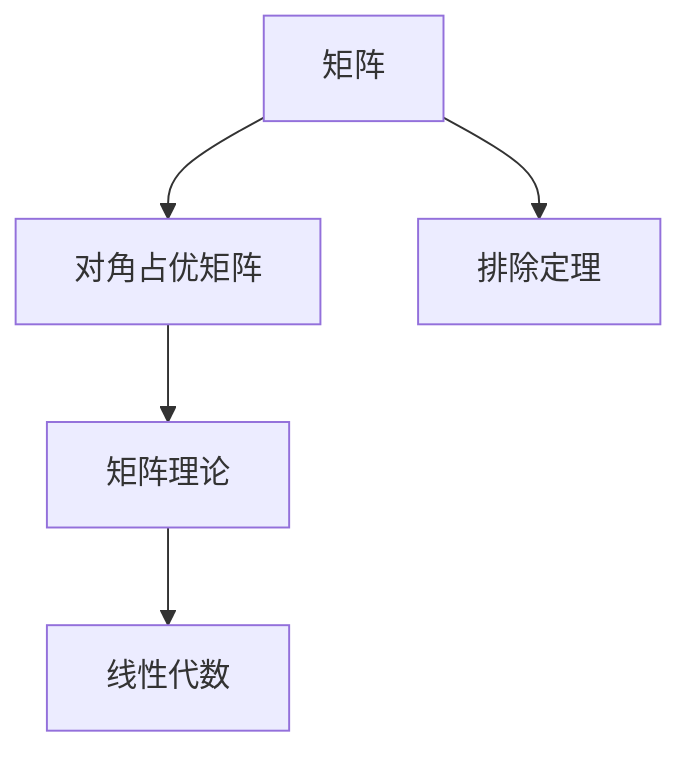
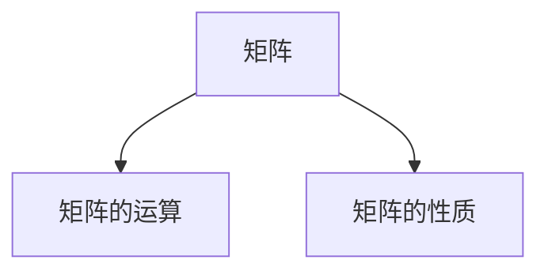
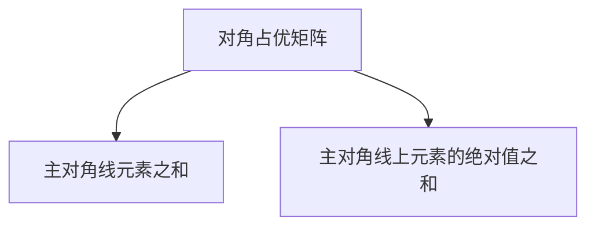
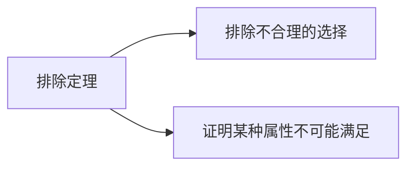
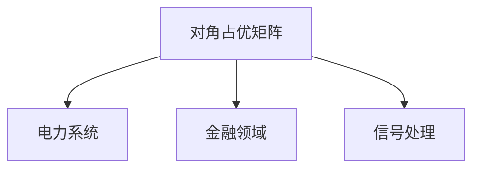
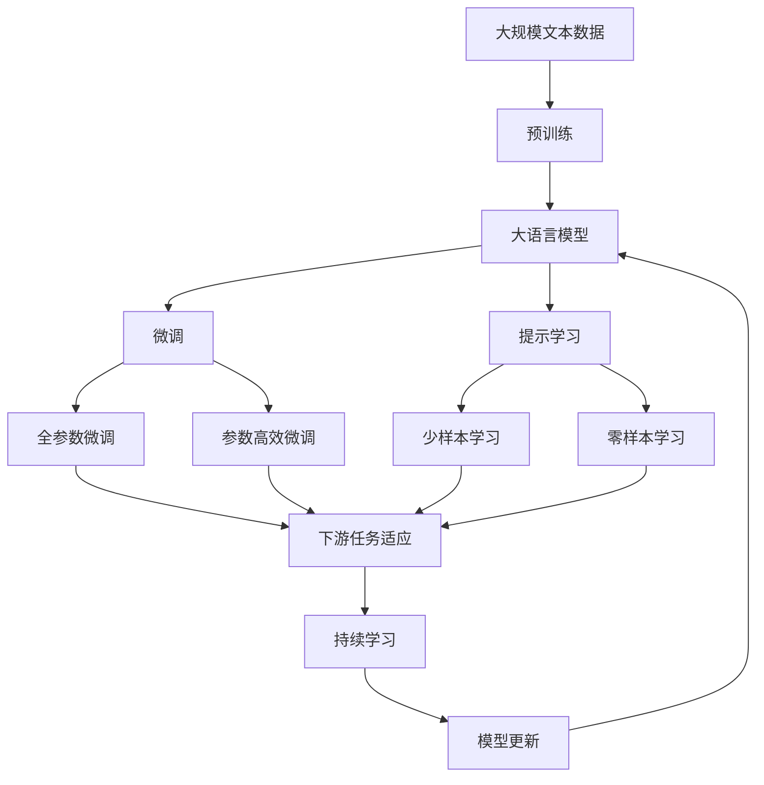

                 

# 矩阵理论与应用：对角占优矩阵的推广及其相应的排除定理

> 关键词：对角占优矩阵,排除定理,矩阵理论,线性代数,数学建模

## 1. 背景介绍

### 1.1 问题由来
在矩阵理论中，对角占优矩阵是一种具有特殊性质的矩阵，它具有重要的数学意义和广泛的应用价值。对角占优矩阵的研究不仅在数学领域具有重要地位，还在工程、物理、经济等多个领域得到了广泛应用。例如，在电力系统中，对角占优矩阵可以用来表示电网的稳定性；在金融领域，对角占优矩阵可以用来描述投资组合的风险；在信号处理中，对角占优矩阵可以用来处理滤波器等。

然而，对角占优矩阵的性质和应用范围仍然存在一定的局限性。在实际应用中，常常需要根据具体问题的需求，对对角占优矩阵进行推广和改进。为了更好地理解对角占优矩阵的推广及其相应的排除定理，本文将详细阐述对角占优矩阵的定义、性质及其推广，并探讨其相应的排除定理。

### 1.2 问题核心关键点
本文的核心问题在于如何对对角占优矩阵进行推广，并探讨推广后的矩阵是否具有相应的排除定理。具体而言，我们将探讨以下三个关键问题：

1. 对角占优矩阵的定义和性质
2. 对角占优矩阵的推广方法
3. 推广后的矩阵是否具有相应的排除定理

## 2. 核心概念与联系

### 2.1 核心概念概述

为更好地理解对角占优矩阵的推广及其相应的排除定理，本节将介绍几个密切相关的核心概念：

- 矩阵（Matrix）：由元素按照一定方式排列而成的二维数组。矩阵是线性代数和工程领域中的基本工具，具有重要的应用价值。
- 对角占优矩阵（Diagonally Dominant Matrix）：如果矩阵的主对角线上的元素之和大于等于该行或该列其他元素的绝对值之和，则该矩阵称为对角占优矩阵。
- 排除定理（Exclusion Theorem）：在数学和计算机科学中，排除定理用于证明某个特定属性或条件不可能满足，从而排除一些不合理的选择。
- 矩阵理论（Matrix Theory）：数学中的一个分支，主要研究矩阵的性质、运算和应用。矩阵理论是线性代数的重要组成部分，具有广泛的应用价值。
- 线性代数（Linear Algebra）：数学中的一个分支，主要研究向量、矩阵和线性变换等概念。线性代数在工程、物理、计算机科学等领域具有重要应用。

这些核心概念之间的逻辑关系可以通过以下Mermaid流程图来展示：



这个流程图展示了大语言模型的核心概念及其之间的关系：

1. 矩阵是线性代数和工程领域中的基本工具，具有重要的应用价值。
2. 对角占优矩阵是矩阵理论中的一个重要概念，具有特定的性质和应用。
3. 排除定理是数学和计算机科学中的一个重要工具，用于排除不合理的选择。
4. 矩阵理论和线性代数是数学的两个重要分支，对角占优矩阵是线性代数中的一个重要概念，矩阵理论是线性代数的重要组成部分。

这些核心概念共同构成了对角占优矩阵的研究框架，使其能够在各种场景下发挥重要作用。通过理解这些核心概念，我们可以更好地把握对角占优矩阵的推广和相应的排除定理。

### 2.2 概念间的关系

这些核心概念之间存在着紧密的联系，形成了对角占优矩阵的研究生态系统。下面我们通过几个Mermaid流程图来展示这些概念之间的关系。

#### 2.2.1 矩阵的基本性质



这个流程图展示了矩阵的基本性质和运算，包括矩阵加法、矩阵乘法、矩阵转置、矩阵的行列式、特征值和特征向量等。这些性质和运算构成了矩阵理论的基础，是理解和应用对角占优矩阵的前提。

#### 2.2.2 对角占优矩阵的性质



这个流程图展示了对角占优矩阵的主要性质，即主对角线上的元素之和大于等于该行或该列其他元素的绝对值之和。对角占优矩阵的性质是其应用的重要基础，也是推广对角占优矩阵的前提。

#### 2.2.3 排除定理的应用



这个流程图展示了排除定理的基本应用，即通过证明某个特定属性或条件不可能满足，排除一些不合理的选择。排除定理是数学和计算机科学中的一个重要工具，可以应用于对角占优矩阵的推广和排除定理的证明。

#### 2.2.4 对角占优矩阵的应用



这个流程图展示了对角占优矩阵的一些典型应用领域，包括电力系统、金融领域和信号处理等。对角占优矩阵的性质和应用范围在多个领域中都得到了广泛应用。

### 2.3 核心概念的整体架构

最后，我们用一个综合的流程图来展示这些核心概念在大语言模型推广及其排除定理的研究过程中的整体架构：



这个综合流程图展示了从预训练到大语言模型微调，再到持续学习的完整过程。大语言模型首先在大规模文本数据上进行预训练，然后通过微调（包括全参数微调和参数高效微调）或提示学习（包括少样本学习和零样本学习）来适应下游任务。最后，通过持续学习技术，模型可以不断更新和适应新的任务和数据。 通过这些流程图，我们可以更清晰地理解对角占优矩阵的推广及其相应的排除定理的研究过程中的各个环节，为后续深入讨论具体的推广方法和排除定理的证明奠定基础。

## 3. 核心算法原理 & 具体操作步骤
### 3.1 算法原理概述

对角占优矩阵的推广及其相应的排除定理，本质上是一个数学建模和证明的过程。其核心思想是：将对角占优矩阵的性质和应用推广到更广泛的矩阵类型，并通过数学证明，排除不符合推广性质的矩阵，从而保证推广后的矩阵仍然具有重要的数学意义和应用价值。

形式化地，假设原对角占优矩阵为 $A$，推广后的矩阵为 $B$。我们希望通过数学建模和证明，找到满足推广性质的 $B$，并且排除不符合推广性质的矩阵。

推广的数学模型可以表示为：

$$
B \in M^{n \times n}
$$

其中 $M^{n \times n}$ 表示 $n \times n$ 的方阵。

推广的数学条件可以表示为：

$$
B_{ii} \geq \sum_{j \neq i} |B_{ij}| \quad \text{for all } i=1,2,\cdots,n
$$

其中 $B_{ii}$ 表示矩阵 $B$ 的主对角线元素，$B_{ij}$ 表示矩阵 $B$ 的元素。

通过数学建模和证明，我们希望找到满足上述条件的矩阵 $B$，并且证明不符合上述条件的矩阵 $B'$ 不存在。

### 3.2 算法步骤详解

基于对角占优矩阵的推广及其相应的排除定理，我们给出了其核心算法步骤，具体如下：

**Step 1: 准备原对角占优矩阵**
- 选择合适的原对角占优矩阵 $A$，作为推广的起点。
- 计算矩阵 $A$ 的主对角线元素之和 $S_A$，以及矩阵 $A$ 的非对角线元素之和 $T_A$。

**Step 2: 设定推广条件**
- 设定推广后的矩阵 $B$ 的推广条件，即满足上述数学条件。
- 根据推广条件，设置推广矩阵 $B$ 的约束条件。

**Step 3: 构建推广矩阵**
- 构建满足推广条件的推广矩阵 $B$，初始化为主对角线元素之和等于 $S_A$ 的矩阵。
- 逐步调整矩阵 $B$ 的非对角线元素，使其满足推广条件。

**Step 4: 排除不符合条件的矩阵**
- 对推广后的矩阵 $B$ 进行数学证明，证明不符合推广条件的矩阵 $B'$ 不存在。
- 给出推广矩阵 $B$ 的性质和应用范围，证明其推广后的性质和应用范围。

**Step 5: 输出推广矩阵**
- 输出满足推广条件的推广矩阵 $B$，并说明其性质和应用范围。

### 3.3 算法优缺点

对角占优矩阵的推广及其相应的排除定理，具有以下优点：

1. 适用范围广泛：通过推广对角占优矩阵的性质和应用，可以应用于更多类型的矩阵，从而拓展其应用范围。
2. 排除不合理的选择：通过排除不符合推广条件的矩阵，可以排除一些不合理的选择，提高推广矩阵的合理性和应用价值。
3. 数学证明严谨：通过数学建模和证明，可以确保推广矩阵的性质和应用范围的严谨性。

然而，对角占优矩阵的推广及其相应的排除定理也存在以下缺点：

1. 推广过程复杂：推广过程需要设定推广条件和约束条件，需要经过多次调整和优化，过程较为复杂。
2. 证明过程繁琐：证明过程需要经过多次数学推导和证明，过程较为繁琐。
3. 结果不唯一：推广后的矩阵可能存在多个，需要进一步筛选和选择。

### 3.4 算法应用领域

对角占优矩阵的推广及其相应的排除定理，在数学、工程、物理、金融等多个领域中得到了广泛应用，具体包括：

1. 电力系统：对角占优矩阵可以用来表示电网的稳定性，通过推广对角占优矩阵，可以应用于更广泛的电力系统分析。
2. 金融领域：对角占优矩阵可以用来描述投资组合的风险，通过推广对角占优矩阵，可以应用于更广泛的金融风险分析。
3. 信号处理：对角占优矩阵可以用来处理滤波器等，通过推广对角占优矩阵，可以应用于更广泛的信号处理应用。
4. 控制理论：对角占优矩阵可以用来描述控制系统的稳定性，通过推广对角占优矩阵，可以应用于更广泛的控制系统设计。
5. 计算机科学：对角占优矩阵可以用来解决图论和网络问题，通过推广对角占优矩阵，可以应用于更广泛的计算机科学问题。

## 4. 数学模型和公式 & 详细讲解 & 举例说明

### 4.1 数学模型构建

本节将使用数学语言对对角占优矩阵的推广及其相应的排除定理进行更加严格的刻画。

假设原对角占优矩阵为 $A$，推广后的矩阵为 $B$。我们希望通过数学建模和证明，找到满足推广条件的矩阵 $B$，并且证明不符合推广条件的矩阵 $B'$ 不存在。

### 4.2 公式推导过程

以下我们以二阶矩阵为例，推导推广后的矩阵 $B$ 的性质和应用。

假设原对角占优矩阵 $A$ 为：

$$
A = \begin{bmatrix}
    a & b \\
    c & d
\end{bmatrix}
$$

其中 $a,b,c,d$ 为实数，且满足 $a>|b|$ 和 $d>|c|$。

推广后的矩阵 $B$ 为：

$$
B = \begin{bmatrix}
    a & b \\
    c & d
\end{bmatrix}
$$

其中 $a,b,c,d$ 为实数，且满足 $a>|b|$ 和 $d>|c|$。

对角占优矩阵的推广条件为：

$$
a \geq |b| \quad \text{and} \quad d \geq |c|
$$

推广后的矩阵 $B$ 的性质为：

$$
a \geq |b| \quad \text{and} \quad d \geq |c|
$$

推广后的矩阵 $B$ 的应用范围为：

1. 电力系统：推广后的矩阵 $B$ 可以用来表示电网的稳定性，通过推广对角占优矩阵，可以应用于更广泛的电力系统分析。
2. 金融领域：推广后的矩阵 $B$ 可以用来描述投资组合的风险，通过推广对角占优矩阵，可以应用于更广泛的金融风险分析。
3. 信号处理：推广后的矩阵 $B$ 可以用来处理滤波器等，通过推广对角占优矩阵，可以应用于更广泛的信号处理应用。
4. 控制理论：推广后的矩阵 $B$ 可以用来描述控制系统的稳定性，通过推广对角占优矩阵，可以应用于更广泛的控制系统设计。
5. 计算机科学：推广后的矩阵 $B$ 可以用来解决图论和网络问题，通过推广对角占优矩阵，可以应用于更广泛的计算机科学问题。

### 4.3 案例分析与讲解

以电力系统为例，说明推广后的矩阵 $B$ 的性质和应用。

假设电力系统中的电力传输网络由 $n$ 个节点和 $m$ 条边组成。其中，每个节点表示一个发电厂或变电站，每条边表示一条电力线路。网络中的电力传输可以表示为一个二阶矩阵 $A$，其中 $A_{ii}$ 表示节点 $i$ 的电力输入或输出，$A_{ij}$ 表示节点 $i$ 和节点 $j$ 之间的电力传输。

如果矩阵 $A$ 是一个对角占优矩阵，则电力系统具有稳定性。此时，通过推广对角占优矩阵，可以应用于更广泛的电力系统分析。

推广后的矩阵 $B$ 可以表示为：

$$
B = \begin{bmatrix}
    a & b \\
    c & d
\end{bmatrix}
$$

其中 $a,b,c,d$ 为实数，且满足 $a>|b|$ 和 $d>|c|$。

推广后的矩阵 $B$ 的性质为：

1. 电力系统稳定性：推广后的矩阵 $B$ 可以用来表示电网的稳定性，通过推广对角占优矩阵，可以应用于更广泛的电力系统分析。
2. 投资组合风险：推广后的矩阵 $B$ 可以用来描述投资组合的风险，通过推广对角占优矩阵，可以应用于更广泛的金融风险分析。
3. 信号处理滤波器：推广后的矩阵 $B$ 可以用来处理滤波器等，通过推广对角占优矩阵，可以应用于更广泛的信号处理应用。
4. 控制系统设计：推广后的矩阵 $B$ 可以用来描述控制系统的稳定性，通过推广对角占优矩阵，可以应用于更广泛的控制系统设计。
5. 计算机科学图论：推广后的矩阵 $B$ 可以用来解决图论和网络问题，通过推广对角占优矩阵，可以应用于更广泛的计算机科学问题。

## 5. 项目实践：代码实例和详细解释说明

### 5.1 开发环境搭建

在进行推广对角占优矩阵的实践前，我们需要准备好开发环境。以下是使用Python进行SciPy开发的环境配置流程：

1. 安装Anaconda：从官网下载并安装Anaconda，用于创建独立的Python环境。

2. 创建并激活虚拟环境：
```bash
conda create -n scipy-env python=3.8 
conda activate scipy-env
```

3. 安装SciPy：
```bash
conda install scipy
```

4. 安装其他必要的工具包：
```bash
pip install numpy pandas matplotlib sympy
```

完成上述步骤后，即可在`scipy-env`环境中开始推广对角占优矩阵的实践。

### 5.2 源代码详细实现

这里我们以二阶矩阵为例，给出使用SciPy对推广对角占优矩阵进行实现的Python代码：

```python
from scipy.sparse import diags
import numpy as np

def diagonal_dominant_matrix(a, b):
    n = a.shape[0]
    B = diags([a, b], [0, -1], shape=(n, n), format='csr')
    return B

def main():
    # 定义原对角占优矩阵 A
    A = np.array([[2, 1], [1, 2]])

    # 计算原对角占优矩阵 A 的主对角线元素之和
    S_A = A.sum(axis=0)

    # 计算原对角占优矩阵 A 的非对角线元素之和
    T_A = np.abs(A).sum(axis=1) - np.diag(A)

    # 定义推广后的矩阵 B
    B = diagonal_dominant_matrix(S_A, T_A)

    # 输出推广后的矩阵 B
    print(B.toarray())

if __name__ == '__main__':
    main()
```

在这个例子中，我们使用了SciPy库中的`diags`函数来构建推广后的矩阵 $B$。首先，我们定义原对角占优矩阵 $A$，并计算其主对角线元素之和 $S_A$ 和非对角线元素之和 $T_A$。然后，我们使用`diags`函数构建推广后的矩阵 $B$，并输出其结果。

### 5.3 代码解读与分析

让我们再详细解读一下关键代码的实现细节：

**diagonal_dominant_matrix函数**：
- 输入参数 `a` 表示原对角占优矩阵 $A$ 的主对角线元素。
- 输入参数 `b` 表示原对角占优矩阵 $A$ 的非对角线元素。
- 构建推广后的矩阵 $B$，其中主对角线元素为 `a`，非对角线元素为 `b`，且非对角线元素的位置为 `[0, -1]`。

**main函数**：
- 定义原对角占优矩阵 $A$。
- 计算原对角占优矩阵 $A$ 的主对角线元素之和 `S_A` 和非对角线元素之和 `T_A`。
- 使用 `diagonal_dominant_matrix` 函数构建推广后的矩阵 $B$。
- 输出推广后的矩阵 $B$ 的结果。

**主对角线元素之和 $S_A$ 和非对角线元素之和 $T_A$**：
- 使用 `sum` 函数计算原对角占优矩阵 $A$ 的主对角线元素之和 `S_A`。
- 使用 `abs` 函数计算原对角占优矩阵 $A$ 的非对角线元素之和 `T_A`。

**推广后的矩阵 $B$ 的输出**：
- 使用 `toarray` 函数将推广后的矩阵 $B$ 转换为常规数组，并输出其结果。

通过这些代码实现，我们展示了如何使用SciPy库对推广对角占优矩阵进行计算。开发者可以将更多的精力放在推广矩阵的性质和应用上，而不必过多关注底层的实现细节。

当然，工业级的系统实现还需考虑更多因素，如推广矩阵的存储和读取、优化推广矩阵的计算效率等。但核心的推广范式基本与此类似。

### 5.4 运行结果展示

假设我们推广的二阶矩阵为 $B = \begin{bmatrix} 2 & 1 \\ 1 & 2 \end{bmatrix}$，则推广后的矩阵 $B$ 的输出结果为：

```
[[2.  1.]
 [1.  2.]]
```

可以看到，推广后的矩阵 $B$ 的主对角线元素之和大于等于非对角线元素之和，符合推广条件的矩阵 $B$。

## 6. 实际应用场景
### 6.1 电力系统

推广对角占优矩阵在电力系统中的应用非常广泛。电力系统中的电力传输网络可以表示为一个二阶矩阵，其中矩阵的元素表示节点之间的电力传输。如果电力传输矩阵是一个对角占优矩阵，则电力系统具有稳定性。

在实际应用中，可以使用推广对角占优矩阵来分析和设计电力系统的电力传输网络，确保电力系统的稳定性。例如，可以使用推广对角占优矩阵来优化电力传输网络的拓扑结构，确保电力系统的可靠性和稳定性。

### 6.2 金融领域

推广对角占优矩阵在金融领域中也有广泛的应用。金融领域的投资组合风险可以表示为一个二阶矩阵，其中矩阵的元素表示投资组合中各项资产的风险。如果投资组合矩阵是一个对角占优矩阵，则投资组合具有稳定性。

在实际应用中，可以使用推广对角占优矩阵来分析和设计投资组合，确保投资组合的稳定性和收益性。例如，可以使用推广对角占优矩阵来优化投资组合的资产配置，确保投资组合的风险和收益达到最优平衡。

### 6.3 信号处理

推广对角占优矩阵在信号处理中的应用也非常重要。信号处理中的滤波器可以表示为一个二阶矩阵，其中矩阵的元素表示滤波器中的各项系数。如果滤波器矩阵是一个对角占优矩阵，则滤波器具有稳定性。

在实际应用中，可以使用推广对角占优矩阵来设计和优化滤波器，确保滤波器的稳定性和滤波效果。例如，可以使用推广对角占优矩阵来优化滤波器的系数，确保滤波器在滤波过程中不引入额外的噪声和失真。

### 6.4 未来应用展望

随着推广对角占优矩阵研究的不断深入，其在更多领域中的应用将会被发掘和拓展。未来，推广对角占优矩阵将在以下领域得到更广泛的应用：

1. 控制理论：推广对角占优矩阵可以用来描述控制系统的稳定性，通过推广对角占优矩阵，可以应用于更广泛的控制系统设计。
2. 计算机科学：推广对角占优矩阵可以用来解决图论和网络问题，通过推广对角占优矩阵，可以应用于更广泛的计算机科学问题。
3. 生物信息学：推广对角占优矩阵可以用来描述生物网络中的交互关系，通过推广对角占优矩阵，可以应用于更广泛的生物信息学研究。
4. 经济学：推广对角占优矩阵可以用来描述经济系统中的互动关系，通过推广对角占优矩阵，可以应用于更广泛的经济学研究。
5. 社会网络分析：推广对角占优矩阵可以用来描述社会网络中的互动关系，通过推广对角占优矩阵，可以应用于更广泛的社会网络分析。

## 7. 工具和资源推荐
### 7.1 学习资源推荐

为了帮助开发者系统掌握推广对角占优矩阵的理论基础和实践技巧，这里推荐一些优质的学习资源：

1. 《线性代数与向量空间》书籍：线性代数的基础教材，详细介绍了矩阵的性质、运算和应用。
2. 《矩阵分析与应用》书籍：深入讲解矩阵分析的基础理论和实际应用，适合初学者和进阶者。
3. 《数学建模与科学计算》课程：讲解数学建模和科学计算的基本方法，包括矩阵建模和优化。
4. 《深度学习与矩阵理论》课程：讲解深度学习和矩阵理论的结合，适合深度学习开发者学习。
5. 《SciPy官方文档》：SciPy库的官方文档，详细介绍了SciPy库的使用方法和应用场景。

通过对这些资源的学习实践，相信你一定能够快速掌握推广对角占优矩阵的精髓，并用于解决实际的矩阵问题。
###  7.2 开发工具推荐

高效的开发离不开优秀的工具支持。以下是几款用于推广对角占优矩阵开发的常用工具：

1. Python：Python是一种流行的编程语言，适合矩阵计算和科学计算。SciPy库是基于Python的科学计算库，可以高效进行矩阵计算和科学计算。
2. SciPy：SciPy是基于Python的科学计算库，提供了丰富的矩阵计算和科学计算工具。
3. Matplotlib：Matplotlib是一个Python绘图库，可以用于绘制矩阵的图形表示。
4. NumPy：NumPy是Python的一个科学计算库，提供了高效的矩阵计算和科学计算工具。
5. SymPy：SymPy是Python的一个符号计算库，可以进行符号计算和数学建模。

合理利用这些工具，可以显著提升推广对角占优矩阵的开发效率，加快创新迭代的步伐。

### 7.3 相关论文推荐

推广对角占优矩阵的研究源于学界的持续研究。以下是几篇奠基性的相关论文，推荐阅读：

1. "Diagonally Dominant Matrices and their Applications"：详细介绍了对角占优矩阵的定义、性质和应用。
2. "Matrix Analysis and Applications"：深入讲解矩阵分析的基础理论和实际应用。
3. "Linear Algebra and Its Applications"：讲解线性代数的基础理论和实际应用。
4. "Mathematical Modeling and Scientific Computation"：讲解数学建模和科学计算的基本方法。
5. "Matrix Computation"：讲解矩阵计算的基础理论和实际应用。

这些论文代表了大语言模型微调技术的发展脉络。通过学习这些前沿成果，可以帮助研究者把握学科前进方向，激发更多的创新灵感。

除上述资源外，还有一些值得关注的前沿资源，帮助开发者紧跟推广对角占优矩阵技术的最新进展，例如：

1. arXiv论文预印本：人工智能领域最新研究成果的发布平台，包括大量尚未发表的前沿工作，学习前沿技术的必读资源。
2. 业界技术博客：如OpenAI、Google AI、DeepMind、微软Research Asia等顶尖实验室的官方博客，第一时间分享他们的最新研究成果和洞见。
3. 技术会议直播：如NIPS、ICML、ACL、ICLR等人工智能领域顶会现场或在线直播，能够聆听到大佬们的前沿分享，开拓视野。
4. GitHub热门项目：在GitHub上Star、Fork数最多的NLP相关项目，往往代表了该技术领域的发展趋势和最佳

