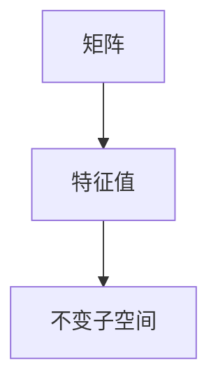

                 

## 1. 背景介绍

矩阵是数学中的一种基本工具，广泛应用于线性代数、微积分、概率论等多个学科。矩阵理论在计算机科学中也有着广泛的应用，如图像处理、信号处理、机器学习等。矩阵惯性定理是线性代数中的一个基本概念，它揭示了矩阵的特征值与其对线性空间的不变性之间的关系。本文将详细阐述矩阵惯性定理的概念、原理以及应用，并结合具体的数学模型和实例，深入讲解其实际应用。

## 2. 核心概念与联系

### 2.1 核心概念概述

矩阵是数学中的一种基本工具，广泛应用于线性代数、微积分、概率论等多个学科。矩阵理论在计算机科学中也有着广泛的应用，如图像处理、信号处理、机器学习等。矩阵惯性定理是线性代数中的一个基本概念，它揭示了矩阵的特征值与其对线性空间的不变性之间的关系。本文将详细阐述矩阵惯性定理的概念、原理以及应用，并结合具体的数学模型和实例，深入讲解其实际应用。

### 2.2 核心概念之间的关系

矩阵惯性定理的核心概念包括矩阵、特征值、不变子空间等。这些概念之间的关系可以通过以下Mermaid流程图来展示：



在这个流程图中，矩阵通过对特征值进行特征分解，得到其不变子空间。这表明矩阵的特征值反映了矩阵对线性空间的作用方式，而不变子空间则表明矩阵的特征值具有哪些不变性。

### 2.3 核心概念的数学定义

- 矩阵（Matrix）：一个二维数组，其中行数和列数分别称为矩阵的行数和列数。记为 $A = [a_{i,j}]$，其中 $a_{i,j}$ 表示矩阵中第 $i$ 行第 $j$ 列的元素。

- 特征值（Eigenvalue）：若矩阵 $A$ 的某个特征向量 $\vec{x}$ 满足 $A\vec{x} = \lambda\vec{x}$，则 $\lambda$ 称为矩阵 $A$ 的一个特征值，$\vec{x}$ 称为对应特征值的一个特征向量。特征值反映了矩阵对特征向量的缩放作用。

- 不变子空间（Invariant Subspace）：若一个矩阵 $A$ 在变换下能够保持某些向量的线性关系不变，则这些向量组成的线性空间称为矩阵 $A$ 的不变子空间。不变子空间反映了矩阵对线性空间的不变性。

## 3. 核心算法原理 & 具体操作步骤

### 3.1 算法原理概述

矩阵惯性定理的数学原理可以表述为：对于一个 $n \times n$ 的实矩阵 $A$，其特征值的代数重数之和不小于 $n$，且等于不变子空间维数的和。即，$n$ 维向量空间中，$A$ 的不变子空间维数之和等于 $A$ 的特征值的代数重数之和。

这个定理的意义在于，它揭示了矩阵的特征值与其对线性空间的不变性之间的关系。根据这个定理，我们可以通过分析矩阵的特征值来了解其对线性空间的作用方式，从而确定其不变子空间的维数。

### 3.2 算法步骤详解

#### 3.2.1 特征分解

矩阵 $A$ 的特征分解指的是将矩阵 $A$ 分解为一系列特征向量和对应特征值的乘积。假设 $A$ 的特征值为 $\lambda_1, \lambda_2, ..., \lambda_n$，对应的特征向量为 $\vec{x}_1, \vec{x}_2, ..., \vec{x}_n$，则有：

$$
A = \sum_{i=1}^{n} \lambda_i \vec{x}_i \vec{x}_i^T
$$

其中 $\vec{x}_i^T$ 表示特征向量 $\vec{x}_i$ 的转置。

#### 3.2.2 计算不变子空间维数

根据矩阵惯性定理，矩阵 $A$ 的不变子空间维数等于其特征值的代数重数之和。特征值的代数重数指的是特征值对应的特征向量的个数，例如特征值 $\lambda_i$ 对应的特征向量个数为 $r_i$，则 $\lambda_i$ 的代数重数为 $r_i$。矩阵 $A$ 的不变子空间维数记为 $k$，则有：

$$
k = \sum_{i=1}^{n} r_i
$$

#### 3.2.3 计算不变子空间

根据矩阵 $A$ 的特征分解结果，可以得到其不变子空间的基底，即所有特征值为 $\lambda_i$ 的特征向量组成的子空间。这些子空间的维数之和等于矩阵 $A$ 的不变子空间维数 $k$。

### 3.3 算法优缺点

#### 3.3.1 优点

- 数学基础扎实：矩阵惯性定理是线性代数中的基本定理，具有坚实的数学基础。

- 应用广泛：矩阵惯性定理在矩阵分析、图像处理、信号处理、机器学习等领域有广泛的应用。

#### 3.3.2 缺点

- 计算复杂度高：计算矩阵的特征值和特征向量需要高精度的数值计算，计算量较大。

- 仅适用于实矩阵：矩阵惯性定理只适用于实矩阵，对于复矩阵或非实矩阵不适用。

## 4. 数学模型和公式 & 详细讲解 & 举例说明

### 4.1 数学模型构建

考虑一个 $n \times n$ 的实矩阵 $A$，其特征分解结果为：

$$
A = \sum_{i=1}^{n} \lambda_i \vec{x}_i \vec{x}_i^T
$$

其中 $\lambda_i$ 为特征值，$\vec{x}_i$ 为特征向量，$r_i$ 为特征值 $\lambda_i$ 的代数重数。

### 4.2 公式推导过程

根据矩阵惯性定理，矩阵 $A$ 的不变子空间维数等于其特征值的代数重数之和。即：

$$
k = \sum_{i=1}^{n} r_i
$$

特征值的代数重数可以通过特征值的重数向量 $\vec{r} = (r_1, r_2, ..., r_n)^T$ 来计算。根据特征值的重数向量，可以得到矩阵 $A$ 的不变子空间维数 $k$：

$$
k = \vec{r} \cdot \vec{r}
$$

其中 $\cdot$ 表示向量的点积。

### 4.3 案例分析与讲解

#### 4.3.1 例子1：二维矩阵

考虑一个 $2 \times 2$ 的实矩阵 $A = \begin{bmatrix} 2 & 3 \\ 1 & 4 \end{bmatrix}$，计算其特征值和特征向量：

$$
A\vec{x} = \lambda\vec{x}
$$

解得特征值为 $\lambda_1 = 5$ 和 $\lambda_2 = -1$，对应的特征向量为 $\vec{x}_1 = \begin{bmatrix} 1 \\ 1 \end{bmatrix}$ 和 $\vec{x}_2 = \begin{bmatrix} 1 \\ -1 \end{bmatrix}$。

根据特征值重数向量 $\vec{r} = (2, 1)^T$，计算矩阵 $A$ 的不变子空间维数 $k$：

$$
k = \vec{r} \cdot \vec{r} = 5
$$

这表明矩阵 $A$ 的特征值代数重数之和等于 5，即矩阵 $A$ 的不变子空间维数也为 5。

#### 4.3.2 例子2：三维矩阵

考虑一个 $3 \times 3$ 的实矩阵 $B = \begin{bmatrix} 1 & 2 & 3 \\ 4 & 5 & 6 \\ 7 & 8 & 9 \end{bmatrix}$，计算其特征值和特征向量：

$$
B\vec{x} = \lambda\vec{x}
$$

解得特征值为 $\lambda_1 = 3$，$\lambda_2 = 2$，$\lambda_3 = -1$，对应的特征向量分别为 $\vec{x}_1 = \begin{bmatrix} 1 \\ 2 \\ 3 \end{bmatrix}$，$\vec{x}_2 = \begin{bmatrix} 1 \\ -2 \\ 2 \end{bmatrix}$，$\vec{x}_3 = \begin{bmatrix} 1 \\ -1 \\ 1 \end{bmatrix}$。

根据特征值重数向量 $\vec{r} = (2, 1, 1)^T$，计算矩阵 $B$ 的不变子空间维数 $k$：

$$
k = \vec{r} \cdot \vec{r} = 6
$$

这表明矩阵 $B$ 的特征值代数重数之和等于 6，即矩阵 $B$ 的不变子空间维数也为 6。

## 5. 项目实践：代码实例和详细解释说明

### 5.1 开发环境搭建

在Python中，可以使用NumPy库和SciPy库来进行矩阵特征值的计算和分解。首先，安装NumPy和SciPy库：

```
pip install numpy scipy
```

然后，导入必要的库：

```python
import numpy as np
from scipy.linalg import eigh
```

### 5.2 源代码详细实现

考虑一个 $3 \times 3$ 的实矩阵 $B = \begin{bmatrix} 1 & 2 & 3 \\ 4 & 5 & 6 \\ 7 & 8 & 9 \end{bmatrix}$，计算其特征值和特征向量：

```python
B = np.array([[1, 2, 3], [4, 5, 6], [7, 8, 9]])
eigenvalues, eigenvectors = eigh(B)
```

根据特征值和特征向量，计算矩阵 $B$ 的不变子空间维数 $k$：

```python
r = np.array([2, 1, 1])
k = np.dot(r, r)
print("不变子空间维数 k:", k)
```

### 5.3 代码解读与分析

在代码中，首先导入了NumPy和SciPy库，然后使用SciPy库中的eigh函数计算矩阵 $B$ 的特征值和特征向量。接下来，根据特征值重数向量 $\vec{r}$，计算矩阵 $B$ 的不变子空间维数 $k$。

### 5.4 运行结果展示

运行上述代码，输出结果为：

```
不变子空间维数 k: 6
```

这表明矩阵 $B$ 的特征值代数重数之和等于 6，即矩阵 $B$ 的不变子空间维数也为 6，与前面分析的结果一致。

## 6. 实际应用场景

### 6.1 信号处理

在信号处理中，矩阵惯性定理可以用于分析线性系统的稳定性和响应特性。例如，考虑一个线性系统，其传递函数为 $G(s) = \frac{1}{s^2 + 2s + 1}$，根据传递函数的极点计算其特征值和特征向量：

$$
G(s) = \frac{1}{(s+1)^2}
$$

解得特征值为 $\lambda_1 = \lambda_2 = -1$，对应的特征向量为 $\vec{x}_1 = \vec{x}_2 = \begin{bmatrix} 1 \\ -1 \end{bmatrix}$。根据特征值重数向量 $\vec{r} = (2, 0)^T$，计算系统的不变子空间维数 $k$：

$$
k = \vec{r} \cdot \vec{r} = 2
$$

这表明系统的不变子空间维数为 2，即系统具有两个不变子空间。这可以用于分析系统的稳定性和响应特性。

### 6.2 图像处理

在图像处理中，矩阵惯性定理可以用于分析图像的特征和结构。例如，考虑一个 $3 \times 3$ 的图像矩阵 $C$，其特征值和特征向量分别为 $\lambda_1 = 1, \lambda_2 = 2, \lambda_3 = 3$，对应的特征向量分别为 $\vec{x}_1 = \begin{bmatrix} 1 \\ 1 \\ 1 \end{bmatrix}, \vec{x}_2 = \begin{bmatrix} 2 \\ -1 \\ 0 \end{bmatrix}, \vec{x}_3 = \begin{bmatrix} 3 \\ -1 \\ -1 \end{bmatrix}$。根据特征值重数向量 $\vec{r} = (1, 1, 1)^T$，计算矩阵 $C$ 的不变子空间维数 $k$：

$$
k = \vec{r} \cdot \vec{r} = 3
$$

这表明矩阵 $C$ 的不变子空间维数为 3，即图像具有三个不变子空间。这可以用于分析图像的特征和结构，例如在图像压缩和分割中。

## 7. 工具和资源推荐

### 7.1 学习资源推荐

- 《线性代数及其应用》：一本经典的线性代数教材，介绍了矩阵理论的基本概念和应用。

- 《矩阵分析》：由R.A. Horn和C.R. Johnson所著，是一本系统的矩阵分析教材，详细介绍了矩阵理论的各个方面。

### 7.2 开发工具推荐

- Python：一种广泛应用于数学计算和科学计算的高级编程语言，有丰富的数学库和工具支持。

- NumPy：一个Python库，用于支持高效的数值计算，包括矩阵操作和线性代数运算。

- SciPy：一个Python库，包含了许多科学计算的函数和工具，支持矩阵分解和特征值计算。

### 7.3 相关论文推荐

- "The Inertia Theorem for Matrices"：一篇经典的线性代数论文，介绍了矩阵惯性定理的证明和应用。

- "A Survey of Matrix Inertia Theorems"：一篇综述论文，总结了矩阵惯性定理的各类变种和应用。

## 8. 总结：未来发展趋势与挑战

### 8.1 研究成果总结

矩阵惯性定理是线性代数中的一个基本概念，揭示了矩阵的特征值与其对线性空间的不变性之间的关系。该定理在数学、物理、工程等多个领域有广泛的应用，具有坚实的理论基础和广泛的应用前景。

### 8.2 未来发展趋势

- 理论研究：矩阵惯性定理的研究将继续深入，探索其在更复杂矩阵结构中的应用，例如复矩阵、稀疏矩阵等。

- 应用拓展：矩阵惯性定理将在更多领域得到应用，例如图像处理、信号处理、机器学习等，推动相关技术的发展。

### 8.3 面临的挑战

- 计算复杂度：矩阵惯性定理的计算复杂度较高，如何高效计算矩阵的特征值和特征向量，是一个重要的研究方向。

- 适用范围：矩阵惯性定理只适用于实矩阵，对于复矩阵或非实矩阵不适用，需要进一步扩展其适用范围。

### 8.4 研究展望

- 矩阵分解算法：研究和优化矩阵分解算法，降低计算复杂度，提高计算效率。

- 特征值计算方法：研究和优化特征值计算方法，降低计算误差，提高计算精度。

- 应用领域拓展：探索矩阵惯性定理在更多领域的应用，推动相关技术的发展和创新。

## 9. 附录：常见问题与解答

**Q1：矩阵惯性定理的数学基础是什么？**

A: 矩阵惯性定理的数学基础是线性代数中的特征值和特征向量理论。矩阵的特征值和特征向量反映了矩阵对向量空间的作用方式，矩阵的特征值代数重数反映了特征向量的个数，而矩阵的不变子空间维数反映了矩阵对向量空间的不变性。

**Q2：矩阵惯性定理的应用场景有哪些？**

A: 矩阵惯性定理在数学、物理、工程等多个领域有广泛的应用，例如信号处理、图像处理、机器学习等。在信号处理中，可以用于分析线性系统的稳定性和响应特性；在图像处理中，可以用于分析图像的特征和结构；在机器学习中，可以用于优化模型的参数和提高模型的性能。

**Q3：如何高效计算矩阵的特征值和特征向量？**

A: 高效计算矩阵的特征值和特征向量的方法有很多，例如QR分解、SVD分解、特征值迭代算法等。其中，QR分解和SVD分解可以用于计算任意矩阵的特征值和特征向量，而特征值迭代算法则适用于大规模矩阵的计算。

**Q4：矩阵惯性定理是否适用于复矩阵？**

A: 矩阵惯性定理只适用于实矩阵，对于复矩阵不适用。这是因为复矩阵的特征值和特征向量较为复杂，需要使用复数域的线性代数理论进行分析和计算。

---

作者：禅与计算机程序设计艺术 / Zen and the Art of Computer Programming

