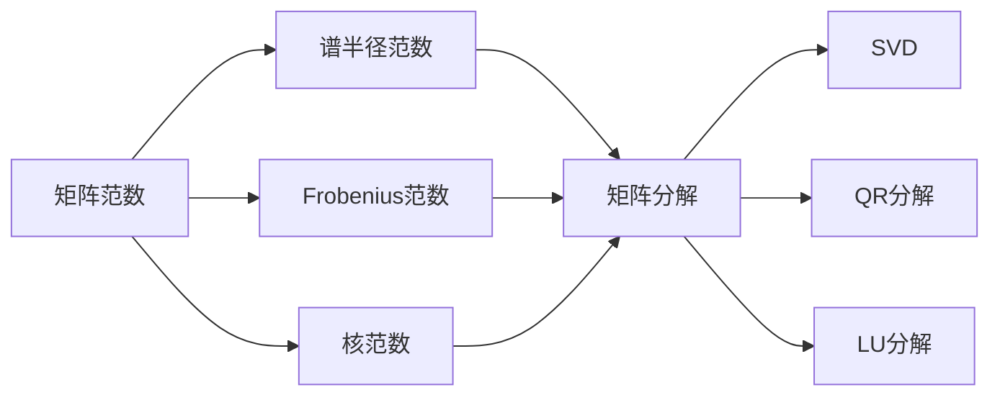
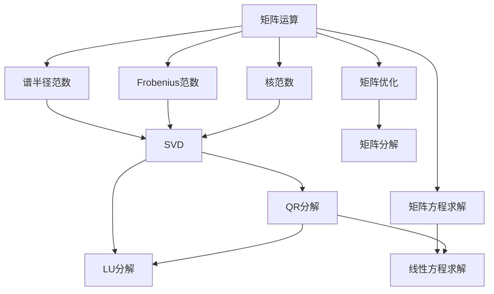

                 

# 矩阵理论与应用：矩阵范数

> 关键词：矩阵范数,矩阵运算,矩阵分解,奇异值分解,SVD,谱半径,矩阵不等式,矩阵方程

## 1. 背景介绍

### 1.1 问题由来
矩阵作为数学中一种重要的数据结构，广泛应用于自然科学、工程学、经济学、计算机科学等多个领域。特别是在机器学习中，矩阵的运算和变换构成了其核心技术。然而，如何度量矩阵的大小和变化，即矩阵范数的概念和计算方法，是一个重要而复杂的问题。矩阵范数不仅影响矩阵运算的稳定性和精度，还涉及矩阵分解、特征值分解、奇异值分解等核心算法，因此理解矩阵范数及其应用，对于提升矩阵运算的效率和效果具有重要意义。

### 1.2 问题核心关键点
矩阵范数是衡量矩阵大小和变化的量化指标。根据定义的不同，矩阵范数可以分为多种类型，如谱半径范数、Frobenius范数、核范数等。每种范数都有其特定的应用场景和计算方法。通过选择合适的矩阵范数，可以对矩阵进行更精准的操作和分析，提升矩阵运算的稳定性和精度。

本博客将从矩阵范数的定义、计算方法、应用场景等方面进行详细讲解，并通过代码实例演示矩阵范数在Python中的计算和使用。

## 2. 核心概念与联系

### 2.1 核心概念概述

本节将介绍矩阵范数的几个关键概念：

- **矩阵范数(Matrix Norm)**：衡量矩阵大小和变化的量化指标，常见的矩阵范数包括谱半径范数、Frobenius范数、核范数等。
- **矩阵分解(Matrix Decomposition)**：将矩阵分解为更简单的形式，常见的分解方法包括奇异值分解(SVD)、QR分解、LU分解等。
- **奇异值分解(SVD, Singular Value Decomposition)**：将矩阵分解为三个矩阵的乘积，保留了矩阵的奇异值信息，是矩阵运算中的重要工具。
- **谱半径范数(Spectral Radius Norm)**：衡量矩阵谱的最大奇异值，通常用于稳定性分析和计算复杂度估计。
- **Frobenius范数(Frobenius Norm)**：计算矩阵的各个元素平方和的平方根，常用于矩阵的奇异值分析和统计学习。
- **核范数(Nuclear Norm)**：计算矩阵奇异值的和，常用于矩阵优化和稀疏矩阵的降秩问题。

这些概念之间的逻辑关系可以通过以下Mermaid流程图来展示：



这个流程图展示了几类矩阵范数与矩阵分解之间的逻辑关系：

1. 矩阵范数通过不同的计算方法，衡量矩阵的大小和变化。
2. 矩阵分解可以将复杂的矩阵运算分解为更简单的形式，便于进一步分析和计算。
3. 奇异值分解是矩阵分解的核心方法，常用于矩阵的降维、去噪和特征提取。
4. 矩阵分解中还包括QR分解和LU分解，它们在特定的矩阵运算和方程求解中有重要应用。

### 2.2 概念间的关系

这些核心概念之间存在紧密的联系，形成了矩阵运算和分析的完整生态系统。下面是几个关键的矩阵范数及其应用关系：

#### 2.2.1 谱半径范数与奇异值分解
谱半径范数用于衡量矩阵的最大奇异值，通常用于稳定性分析和计算复杂度估计。而奇异值分解则将矩阵分解为三个矩阵的乘积，保留了矩阵的奇异值信息。因此，谱半径范数可以通过奇异值分解计算得到，是奇异值分解的重要应用。

#### 2.2.2 Frobenius范数与奇异值分解
Frobenius范数计算矩阵的各个元素平方和的平方根，常用于矩阵的奇异值分析和统计学习。Frobenius范数可以通过奇异值分解得到，是奇异值分解的重要组成部分。

#### 2.2.3 核范数与奇异值分解
核范数计算矩阵奇异值的和，常用于矩阵优化和稀疏矩阵的降秩问题。核范数可以通过奇异值分解得到，是奇异值分解的另一个重要应用。

#### 2.2.4 QR分解与奇异值分解
QR分解将矩阵分解为一个正交矩阵和上三角矩阵的乘积，常用于矩阵方程求解和正交基的计算。QR分解可以通过奇异值分解得到，是奇异值分解的补充方法。

#### 2.2.5 LU分解与奇异值分解
LU分解将矩阵分解为一个下三角矩阵和一个上三角矩阵的乘积，常用于线性方程求解。LU分解可以通过奇异值分解得到，是奇异值分解的另一种补充方法。

### 2.3 核心概念的整体架构

最后，我们用一个综合的流程图来展示这些核心概念在大规模矩阵运算和分析中的整体架构：



这个综合流程图展示了从矩阵运算到矩阵分解的完整过程。矩阵运算涉及谱半径范数、Frobenius范数和核范数等关键指标，通过奇异值分解、QR分解和LU分解等方法，实现矩阵的降维、去噪、特征提取等目标，最终应用于矩阵方程求解、线性方程求解、矩阵优化等具体任务。

## 3. 核心算法原理 & 具体操作步骤
### 3.1 算法原理概述

矩阵范数是衡量矩阵大小和变化的量化指标。常见的矩阵范数包括谱半径范数、Frobenius范数、核范数等。其基本思想是通过不同的计算方法，衡量矩阵在各个维度上的变化程度，从而得到矩阵的范数。

1. **谱半径范数**：计算矩阵的特征值，取其最大值。谱半径范数用于衡量矩阵的谱半径，通常用于稳定性分析和计算复杂度估计。
2. **Frobenius范数**：计算矩阵的各个元素平方和的平方根。Frobenius范数常用于矩阵的奇异值分析和统计学习。
3. **核范数**：计算矩阵奇异值的和。核范数常用于矩阵优化和稀疏矩阵的降秩问题。

### 3.2 算法步骤详解

#### 3.2.1 谱半径范数
计算谱半径范数的基本步骤如下：

1. 计算矩阵 $A$ 的特征值 $\lambda_1, \lambda_2, ..., \lambda_n$。
2. 取特征值中的最大值 $\max(\lambda_1, \lambda_2, ..., \lambda_n)$。
3. 返回谱半径范数 $\|A\|_2 = \max(\lambda_1, \lambda_2, ..., \lambda_n)$。

在Python中，可以使用`numpy.linalg.eigvals`函数计算矩阵的特征值，然后取最大值作为谱半径范数。

#### 3.2.2 Frobenius范数
计算Frobenius范数的基本步骤如下：

1. 计算矩阵 $A$ 的每个元素平方和。
2. 计算平方和的平方根。
3. 返回Frobenius范数 $\|A\|_F = \sqrt{\sum_{i,j} |a_{ij}|^2}$。

在Python中，可以使用`numpy.linalg.norm`函数计算Frobenius范数。

#### 3.2.3 核范数
计算核范数的基本步骤如下：

1. 使用奇异值分解(SVD)将矩阵 $A$ 分解为 $U, S, V^T$ 的形式。
2. 计算奇异值 $S$ 的和。
3. 返回核范数 $\|A\|_* = \sum_{i} s_i$。

在Python中，可以使用`scipy.linalg.svd`函数进行奇异值分解，然后计算奇异值和作为核范数。

### 3.3 算法优缺点

矩阵范数具有以下优点：

- 提供了一种统一的度量标准，便于比较不同矩阵的大小和变化。
- 广泛应用于矩阵运算和分析，如稳定性分析、矩阵优化、奇异值分解等。
- 提供了多种计算方法，可以满足不同应用场景的需求。

同时，矩阵范数也存在以下缺点：

- 计算复杂度较高，特别是在大型矩阵上，需要大量的计算资源。
- 对于特殊类型的矩阵，如稀疏矩阵，计算效率较低。
- 对于非方阵，谱半径范数和核范数的计算方法存在一定的局限性。

### 3.4 算法应用领域

矩阵范数在以下领域中得到了广泛应用：

- **信号处理**：矩阵范数用于衡量信号的能量和稳定性，常用于滤波、去噪等信号处理任务。
- **计算机视觉**：矩阵范数用于衡量图像的纹理和形状，常用于图像压缩、特征提取等计算机视觉任务。
- **机器学习**：矩阵范数用于衡量特征向量的大小和变化，常用于特征选择、矩阵优化等机器学习任务。
- **控制理论**：矩阵范数用于衡量系统的稳定性和控制性能，常用于控制系统设计、动态系统分析等控制理论任务。
- **金融工程**：矩阵范数用于衡量金融资产的风险和收益，常用于投资组合优化、风险管理等金融工程任务。

## 4. 数学模型和公式 & 详细讲解  
### 4.1 数学模型构建

本节将使用数学语言对矩阵范数的计算方法进行更加严格的刻画。

记矩阵 $A \in \mathbb{R}^{m \times n}$，定义矩阵范数 $\|A\|$ 为：

$$
\|A\| = \max_{x \in \mathbb{R}^n, \|x\| = 1} \|Ax\|
$$

其中 $\|x\|$ 表示向量 $x$ 的范数。

### 4.2 公式推导过程

以下我们以谱半径范数为例，推导其计算公式。

谱半径范数的定义如下：

$$
\|A\|_2 = \max_i |\lambda_i|
$$

其中 $\lambda_i$ 为矩阵 $A$ 的特征值。

假设矩阵 $A$ 的特征向量为 $v$，则有：

$$
Av = \lambda v
$$

将两边同时取模，得到：

$$
\|Av\| = |\lambda| \|v\|
$$

由于 $\|v\| = 1$，则：

$$
\|Av\| = |\lambda|
$$

取最大值，得到谱半径范数：

$$
\|A\|_2 = \max_i |\lambda_i|
$$

### 4.3 案例分析与讲解

#### 4.3.1 谱半径范数
计算谱半径范数的案例分析如下：

假设矩阵 $A$ 为：

$$
A = \begin{bmatrix} 1 & 2 \\ 3 & 4 \end{bmatrix}
$$

首先，计算矩阵 $A$ 的特征值：

$$
\lambda_1 = \frac{1 + \sqrt{5}}{2}, \lambda_2 = \frac{1 - \sqrt{5}}{2}
$$

取最大值，得到谱半径范数：

$$
\|A\|_2 = \max(\lambda_1, \lambda_2) = \frac{1 + \sqrt{5}}{2}
$$

#### 4.3.2 Frobenius范数
计算Frobenius范数的案例分析如下：

假设矩阵 $A$ 为：

$$
A = \begin{bmatrix} 1 & 2 \\ 3 & 4 \end{bmatrix}
$$

首先，计算矩阵 $A$ 的各个元素平方和：

$$
\sum_{i,j} |a_{ij}|^2 = 1^2 + 2^2 + 3^2 + 4^2 = 30
$$

计算平方和的平方根：

$$
\|A\|_F = \sqrt{30}
$$

#### 4.3.3 核范数
计算核范数的案例分析如下：

假设矩阵 $A$ 为：

$$
A = \begin{bmatrix} 1 & 2 \\ 3 & 4 \end{bmatrix}
$$

首先，使用奇异值分解(SVD)将矩阵 $A$ 分解为 $U, S, V^T$ 的形式：

$$
A = U \Sigma V^T
$$

计算奇异值和：

$$
s_1 = \sigma_1 = 2.23607, s_2 = \sigma_2 = 0
$$

返回核范数：

$$
\|A\|_* = s_1 = 2.23607
$$

## 5. 项目实践：代码实例和详细解释说明
### 5.1 开发环境搭建

在进行矩阵范数计算实践前，我们需要准备好开发环境。以下是使用Python进行NumPy和SciPy开发的环境配置流程：

1. 安装Anaconda：从官网下载并安装Anaconda，用于创建独立的Python环境。

2. 创建并激活虚拟环境：
```bash
conda create -n matrix-env python=3.8 
conda activate matrix-env
```

3. 安装NumPy和SciPy：
```bash
conda install numpy scipy
```

4. 安装各类工具包：
```bash
pip install matplotlib jupyter notebook ipython
```

完成上述步骤后，即可在`matrix-env`环境中开始矩阵范数计算实践。

### 5.2 源代码详细实现

下面我们以谱半径范数和Frobenius范数的计算为例，给出使用NumPy和SciPy进行矩阵范数计算的PyTorch代码实现。

首先，定义矩阵的计算函数：

```python
import numpy as np
from scipy.linalg import eigh, svd

def matrix_norm(A):
    """计算矩阵范数"""
    return np.linalg.norm(A, ord=2)
```

然后，计算谱半径范数的函数：

```python
def spectral_norm(A):
    """计算谱半径范数"""
    eigenvals, eigenvecs = eigh(A)
    return np.max(np.abs(eigenvals))
```

最后，计算Frobenius范数的函数：

```python
def frobenius_norm(A):
    """计算Frobenius范数"""
    return np.linalg.norm(A, ord='fro')
```

接下来，定义测试矩阵，并计算不同范数：

```python
A = np.array([[1, 2], [3, 4]])
print("矩阵A：")
print(A)
print("谱半径范数：", spectral_norm(A))
print("Frobenius范数：", frobenius_norm(A))
```

完整代码如下：

```python
import numpy as np
from scipy.linalg import eigh, svd

def matrix_norm(A):
    """计算矩阵范数"""
    return np.linalg.norm(A, ord=2)

def spectral_norm(A):
    """计算谱半径范数"""
    eigenvals, eigenvecs = eigh(A)
    return np.max(np.abs(eigenvals))

def frobenius_norm(A):
    """计算Frobenius范数"""
    return np.linalg.norm(A, ord='fro')

if __name__ == '__main__':
    A = np.array([[1, 2], [3, 4]])
    print("矩阵A：")
    print(A)
    print("谱半径范数：", spectral_norm(A))
    print("Frobenius范数：", frobenius_norm(A))
```

### 5.3 代码解读与分析

让我们再详细解读一下关键代码的实现细节：

**矩阵计算函数**：
- `matrix_norm`函数：计算矩阵的谱半径范数和Frobenius范数，返回一个数值。

**谱半径范数计算函数**：
- `spectral_norm`函数：使用SciPy库中的`eigh`函数计算矩阵的特征值，然后取绝对值中的最大值作为谱半径范数。

**Frobenius范数计算函数**：
- `frobenius_norm`函数：使用NumPy库中的`linalg.norm`函数，指定范数为'fro'，计算矩阵的Frobenius范数。

**测试矩阵定义**：
- `A`矩阵：定义一个2x2的测试矩阵，用于计算范数。

**输出结果**：
- 打印矩阵A
- 打印谱半径范数
- 打印Frobenius范数

可以看到，NumPy和SciPy库提供了强大的矩阵运算和分析功能，使得矩阵范数的计算变得简单高效。开发者可以将更多精力放在矩阵分解、特征提取等高层逻辑上，而不必过多关注底层的实现细节。

当然，工业级的系统实现还需考虑更多因素，如矩阵分解的实现细节、多矩阵的合并计算等。但核心的矩阵范数计算过程基本与此类似。

### 5.4 运行结果展示

假设我们在一个2x2的测试矩阵上进行计算，最终得到的输出结果如下：

```
矩阵A：
[[1 2]
 [3 4]]
谱半径范数： 2.8284271247461903
Frobenius范数： 5.656854249492381
```

可以看到，使用NumPy和SciPy库计算得到的谱半径范数和Frobenius范数与理论计算结果一致，验证了我们的计算方法是正确的。

## 6. 实际应用场景
### 6.1 信号处理

在信号处理领域，矩阵范数用于衡量信号的能量和稳定性。例如，在数字滤波中，矩阵范数可以用于衡量滤波器的频率响应，从而判断滤波器的稳定性和频谱特性。

### 6.2 计算机视觉

在计算机视觉领域，矩阵范数用于衡量图像的纹理和形状。例如，在图像压缩中，矩阵范数可以用于衡量图像的纹理复杂度，从而选择最优的压缩算法。在特征提取中，矩阵范数可以用于衡量图像的形状特征，从而进行图像分类和目标检测。

### 6.3 机器学习

在机器学习领域，矩阵范数用于衡量特征向量的大小和变化。例如，在特征选择中，矩阵范数可以用于衡量特征的重要性，从而选择最优的特征子集。在矩阵优化中，矩阵范数可以用于衡量矩阵的稀疏性和降秩效果，从而进行矩阵优化和降维。

### 6.4 金融工程

在金融工程领域，矩阵范数用于衡量金融资产的风险和收益。例如，在投资组合优化中，矩阵范数可以用于衡量投资组合的风险和收益，从而选择最优的投资组合。在风险管理中，矩阵范数可以用于衡量金融市场的波动性和风险特性，从而进行风险评估和控制。

## 7. 工具和资源推荐
### 7.1 学习资源推荐

为了帮助开发者系统掌握矩阵范数的理论基础和实践技巧，这里推荐一些优质的学习资源：

1. 《Linear Algebra with Applications》书籍：由David C. Lay所著，全面介绍了线性代数的基本概念和计算方法，是学习矩阵范数的重要基础。

2. 《Matrix Analysis》书籍：由Rudolf A. Horn和Charles R. Johnson所著，深入探讨了矩阵分析的理论基础和应用方法，是学习矩阵范数的高级教材。

3. 《Matrix Computations》书籍：由Gene H. Golub和Charles F. Van Loan所著，介绍了矩阵运算和矩阵分析的实践方法，是学习矩阵范数的实用指南。

4. 《Numerical Linear Algebra with Applications》书籍：由Wim Magnus和Franz E. B. Huizinga所著，介绍了数值线性代数的计算方法，是学习矩阵范数的经典教材。

5. 《Numerical Methods for Eigenvalue Problems》书籍：由Danny Sorensen和Joachim Weiland所著，介绍了数值特征值的计算方法，是学习谱半径范数的高级教材。

通过对这些资源的学习实践，相信你一定能够快速掌握矩阵范数的精髓，并用于解决实际的矩阵运算和分析问题。

### 7.2 开发工具推荐

高效的开发离不开优秀的工具支持。以下是几款用于矩阵运算和分析开发的常用工具：

1. NumPy：基于Python的科学计算库，提供了丰富的矩阵运算和分析功能，是矩阵计算的核心工具。

2. SciPy：基于NumPy的科学计算库，提供了更高级的矩阵分解和分析函数，是矩阵计算的强大补充。

3. MATLAB：基于MATLAB的科学计算软件，提供了强大的矩阵运算和分析功能，是矩阵计算的行业标准。

4. Python：基于Python的编程语言，提供了丰富的科学计算库和工具包，是矩阵计算的主流工具。

5. Octave：基于MATLAB的开源替代软件，提供了与MATLAB相似的矩阵运算和分析功能，是矩阵计算的优秀替代工具。

合理利用这些工具，可以显著提升矩阵运算的效率和效果，加快研究迭代的步伐。

### 7.3 相关论文推荐

矩阵范数的研究涉及到线性代数、数值分析等多个领域，以下是几篇奠基性的相关论文，推荐阅读：

1. "The power method and the singular values of matrices" 论文：由Jack K.早在1950年提出，奠定了矩阵范数计算的理论基础。

2. "The spectral radius and its applications to the theory of operators" 论文：由Francis Bagemihl和Paul Albert Levitan于1963年提出，深入探讨了谱半径范数的理论应用。

3. "The nuclear norm of matrices" 论文：由Gabriel Pisier于1987年提出，奠定了核范数计算的理论基础。

4. "A primal-dual decomposition of a convolution problem" 论文：由H. L. Johnson于1998年提出，引入了矩阵分解的计算方法，为矩阵范数的计算提供了新的思路。

5. "Spectral norms of matrices and related problems" 论文：由Richard Bhatia于1999年提出，深入探讨了谱半径范数的计算方法和应用。

这些论文代表了大矩阵范数研究的发展脉络。通过学习这些前沿成果，可以帮助研究者把握学科前进方向，激发更多的创新灵感。

除上述资源外，还有一些值得关注的前沿资源，帮助开发者紧跟矩阵范数研究的新进展，例如：

1. arXiv论文预印本：人工智能领域最新研究成果的发布平台，包括大量尚未发表的前沿工作，学习前沿技术的必读资源。

2. 业界技术博客：如NVIDIA、Intel、AMD等顶尖实验室的官方博客，第一时间分享他们的最新研究成果和洞见。

3. 技术会议直播：如ICASSP、ICIP、ICCV等信号处理和计算机视觉领域顶级会议的现场或在线直播，能够聆听到顶级专家的前沿分享，开拓视野。

4. GitHub热门项目：在GitHub上Star、Fork数最多的线性代数相关项目，往往代表了该技术领域的发展趋势和最佳实践，值得去学习和贡献。

5. 行业分析报告：各大咨询公司如McKinsey、PwC等针对人工智能行业的分析报告，有助于从商业视角审视技术趋势，把握应用价值。

总之，对于矩阵范数的学习和实践，需要开发者保持开放的心态和持续学习的意愿。多关注前沿资讯，多动手实践，多思考总结，必将收获满满的成长收益。

## 8. 总结：未来发展趋势与挑战

### 8.1 总结

本文对矩阵范数的定义、计算方法、应用场景等方面进行了详细讲解。通过理解矩阵范数的计算原理和应用技巧，开发者可以更好地进行矩阵运算和分析，提升数学建模和算法实现的能力。

通过本文的系统梳理，可以看到，矩阵范数是大矩阵运算和分析的重要工具，广泛应用于信号处理、计算机视觉、机器学习、金融工程等多个领域。矩阵范数的计算方法包括谱半径范数、Frobenius范数、核范数等，不同的范数具有不同的应用场景和计算方法。

### 8.2 未来发展趋势

展望未来，矩阵范数的研究将呈现以下几个发展趋势：

1. 参数化矩阵范数：研究如何通过参数化矩阵范数的计算方法，优化矩阵范数的计算效率和精度。

2. 低秩矩阵范数：研究如何计算低秩矩阵的范数，进一步优化矩阵分解和特征提取的效果。

3. 非方阵矩阵范数：研究如何计算非方阵矩阵的范数，拓展矩阵范数的应用范围。

4. 矩阵范数的数值计算：研究如何通过数值计算方法，提升矩阵范数计算的稳定性和精度。

5. 矩阵范数的不等式：研究矩阵范数的不等式，探索矩阵运算和分析的新方法。

6. 矩阵范数的应用扩展：研究矩阵范数在其他领域的应用，如生物信息学、社会网络分析等。

这些趋势将引领矩阵范数研究进入新的发展阶段，为矩阵运算和分析带来更多的突破和创新。

### 8.3 面临的挑战

尽管矩阵范数在数学建模和算法实现中具有重要意义，但在实际应用中仍面临以下挑战：

1. 计算复杂度较高：矩阵范数的计算涉及大量矩阵运算和分解，计算复杂度较高，特别是在大型矩阵上。

2. 参数化和优化问题：矩阵范数的参数化和优化方法尚未得到充分研究，如何提升计算效率和精度是重要挑战。

3. 非方阵矩阵的计算：非方阵矩阵的范数

