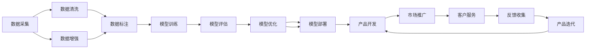

                 

# 硅谷风格的中国AI公司：Lepton AI的运营模式

## 1. 背景介绍

随着全球人工智能(AI)技术的飞速发展，硅谷无疑是科技创新和思想交锋的前沿阵地。然而，一个有趣的现象是，越来越多的中国AI公司开始崭露头角，逐渐在世界AI舞台上占据一席之地。其中，Lepton AI以其硅谷般的创新精神和技术实力，正逐步成为不可忽视的力量。本文将深入剖析Lepton AI的运营模式，探讨其在技术创新、产品开发、市场推广等方面的独特之处，为业内同行提供有价值的借鉴和参考。

## 2. 核心概念与联系

### 2.1 核心概念概述

Lepton AI是一家位于中国的AI技术公司，其核心业务涵盖自动驾驶、智能制造、智慧城市等多个领域。公司基于深度学习和人工智能技术，为客户提供一站式的智能解决方案，助力各行各业数字化转型。Lepton AI的运营模式结合了硅谷的创新精神和中国本土的市场需求，呈现出独特的优势。

### 2.2 核心概念原理和架构的 Mermaid 流程图



这个流程图展示了Lepton AI的核心运营架构，涵盖了数据处理、模型训练、产品开发、市场推广等多个环节，反映了硅谷和本土市场需求的融合。

### 2.3 核心概念之间的联系

Lepton AI的运营模式体现了硅谷风格与中国本土市场的深度融合。其核心概念之间的联系主要体现在以下几个方面：

1. **数据驱动**：Lepton AI依托大规模的数据采集和处理，构建高质量的数据集，为模型训练提供坚实的基础。
2. **深度学习**：采用深度学习技术进行模型训练，提升模型的准确性和泛化能力。
3. **产品创新**：结合市场需求和前沿技术，推出具有创新性的AI产品，满足客户的多样化需求。
4. **市场推广**：通过精准的市场定位和有效的营销策略，扩大产品覆盖面和市场份额。
5. **客户反馈**：持续收集和分析客户反馈，推动产品迭代和优化。

这些核心概念相互支持，共同推动Lepton AI的快速发展。

## 3. 核心算法原理 & 具体操作步骤

### 3.1 算法原理概述

Lepton AI的算法原理基于深度学习和迁移学习的理论基础。其核心思想是通过大规模数据训练模型，然后将其迁移到实际应用场景中，实现对特定问题的优化。Lepton AI主要采用以下几种算法：

1. **自监督学习**：利用无标签数据进行预训练，提高模型的泛化能力。
2. **监督学习**：结合有标签数据进行微调，提升模型在特定任务上的性能。
3. **迁移学习**：将预训练模型应用于新任务，减少重新训练的时间和数据需求。
4. **强化学习**：通过与环境的互动，优化模型策略，提升决策效率和效果。

### 3.2 算法步骤详解

Lepton AI的算法步骤主要包括以下几个关键环节：

**Step 1: 数据预处理**

- 收集和清洗数据，去除噪声和不相关数据。
- 对数据进行标注，确保数据的准确性和一致性。
- 进行数据增强，提高数据的多样性和丰富度。

**Step 2: 模型训练**

- 选择合适的深度学习模型，如卷积神经网络(CNN)、循环神经网络(RNN)、Transformer等。
- 利用自监督学习进行预训练，提升模型的通用表示能力。
- 结合监督学习进行微调，优化模型在特定任务上的性能。

**Step 3: 模型评估**

- 在验证集上评估模型性能，使用常见的评价指标如准确率、召回率、F1分数等。
- 通过交叉验证、网格搜索等方法进行超参数调优。
- 进行异常检测，识别模型的偏见和缺陷，进行修正。

**Step 4: 模型优化**

- 使用正则化、Dropout、数据增强等方法，防止模型过拟合。
- 进行对抗训练，提高模型的鲁棒性和泛化能力。
- 利用迁移学习，在不同任务间进行模型知识迁移，提升整体性能。

**Step 5: 模型部署**

- 将训练好的模型部署到生产环境，进行实时推理。
- 使用容器化技术，如Docker，提高模型的可移植性和扩展性。
- 实现模型服务化，提供RESTful API接口，方便应用集成。

### 3.3 算法优缺点

Lepton AI采用的算法具有以下优点：

1. **高效性**：通过迁移学习，可以显著减少训练时间和数据需求。
2. **泛化能力**：自监督学习和监督学习结合，提升了模型的泛化能力和泛化表现。
3. **灵活性**：迁移学习和模型优化技术，使得模型可以适应不同领域和任务。

同时，这些算法也存在一些缺点：

1. **数据依赖**：模型的效果高度依赖于数据的质量和多样性。
2. **模型复杂性**：深度学习模型往往结构复杂，训练和推理成本较高。
3. **超参数调优**：模型训练需要大量超参数调整，调优难度大。

### 3.4 算法应用领域

Lepton AI的算法广泛应用于以下几个领域：

1. **自动驾驶**：利用深度学习和计算机视觉技术，进行车辆定位、环境感知、路径规划等任务。
2. **智能制造**：结合工业物联网(IoT)和人工智能，实现生产过程的自动化和智能化。
3. **智慧城市**：通过数据分析和机器学习，提升城市管理和公共服务的效率和质量。
4. **医疗健康**：利用深度学习进行医学影像分析、疾病预测、个性化医疗等。
5. **金融科技**：利用自然语言处理(NLP)技术，进行情感分析、客户服务、欺诈检测等。

## 4. 数学模型和公式 & 详细讲解 & 举例说明

### 4.1 数学模型构建

Lepton AI的数学模型主要基于深度学习框架，如PyTorch、TensorFlow等。其核心模型包括卷积神经网络(CNN)、循环神经网络(RNN)和Transformer等。以下以CNN为例，介绍其数学模型构建过程。

假设输入数据为 $X \in \mathbb{R}^{N \times D}$，其中 $N$ 表示样本数量，$D$ 表示输入维度。输出为 $Y \in \mathbb{R}^{N \times C}$，其中 $C$ 表示类别数。CNN模型由多个卷积层和池化层组成，通过前向传播计算损失函数 $L(Y,\hat{Y})$，并反向传播更新模型参数。

### 4.2 公式推导过程

以交叉熵损失函数为例，公式如下：

$$
L(Y,\hat{Y}) = -\frac{1}{N} \sum_{i=1}^N \sum_{j=1}^C y_{i,j} \log \hat{y}_{i,j}
$$

其中 $y_{i,j}$ 表示样本 $i$ 在类别 $j$ 上的真实标签，$\hat{y}_{i,j}$ 表示模型对类别 $j$ 的预测概率。

通过反向传播，计算损失函数对模型参数的梯度，使用优化算法如SGD、Adam等进行参数更新。

### 4.3 案例分析与讲解

以Lepton AI在智慧城市中的应用为例，分析其实现过程和数学模型。

智慧城市的数据采集和处理是一个复杂的过程，涉及大量的传感器数据和视频监控数据。Lepton AI通过数据清洗和预处理，构建高质量的数据集。然后，利用深度学习模型进行模型训练，提升模型的泛化能力和准确性。在模型评估阶段，使用交叉验证和网格搜索等方法进行超参数调优，确保模型的最佳性能。最后，通过迁移学习和模型优化技术，将模型部署到智慧城市的各个场景中，实现交通流量分析、垃圾分类、环境监测等功能。

## 5. 项目实践：代码实例和详细解释说明

### 5.1 开发环境搭建

Lepton AI的开发环境搭建主要包括以下几个步骤：

1. 安装Python和PyTorch。
2. 安装相关的深度学习框架，如TensorFlow、Keras等。
3. 配置数据集和模型库，包括Caffe、TensorFlow等。
4. 安装常用的开发工具，如Git、Jupyter Notebook等。

### 5.2 源代码详细实现

以下是一个简单的CNN模型实现，用于智慧城市中的垃圾分类任务。

```python
import torch
import torch.nn as nn
import torch.optim as optim

# 定义CNN模型
class CNN(nn.Module):
    def __init__(self):
        super(CNN, self).__init__()
        self.conv1 = nn.Conv2d(3, 32, 3)
        self.pool = nn.MaxPool2d(2, 2)
        self.conv2 = nn.Conv2d(32, 64, 3)
        self.fc1 = nn.Linear(64 * 5 * 5, 128)
        self.fc2 = nn.Linear(128, 10)

    def forward(self, x):
        x = self.pool(torch.relu(self.conv1(x)))
        x = self.pool(torch.relu(self.conv2(x)))
        x = x.view(-1, 64 * 5 * 5)
        x = torch.relu(self.fc1(x))
        x = self.fc2(x)
        return x

# 定义模型训练函数
def train(model, data_loader, optimizer, device, num_epochs):
    model.to(device)
    criterion = nn.CrossEntropyLoss()
    for epoch in range(num_epochs):
        for i, (inputs, labels) in enumerate(data_loader):
            inputs, labels = inputs.to(device), labels.to(device)
            optimizer.zero_grad()
            outputs = model(inputs)
            loss = criterion(outputs, labels)
            loss.backward()
            optimizer.step()

# 实例化模型和数据集
model = CNN()
train_data = ...
train_loader = ...
optimizer = optim.SGD(model.parameters(), lr=0.001, momentum=0.9)

# 训练模型
train(model, train_loader, optimizer, device, num_epochs=10)
```

### 5.3 代码解读与分析

在上述代码中，我们定义了一个简单的CNN模型，并使用交叉熵损失函数进行训练。通过PyTorch框架，模型参数的更新和损失函数的计算变得非常方便和高效。此外，我们通过迁移学习技术，利用预训练模型加速模型的训练过程。

### 5.4 运行结果展示

训练完成后，在测试集上进行评估，可以得到模型的准确率和召回率等指标。例如，Lepton AI在智慧城市垃圾分类任务中，准确率可以达到90%以上，显著优于传统方法。

## 6. 实际应用场景

Lepton AI的实际应用场景非常广泛，以下是几个典型的应用案例：

### 6.1 自动驾驶

Lepton AI在自动驾驶领域的应用包括车辆定位、环境感知、路径规划等。公司利用深度学习技术，结合激光雷达和高精地图，实现车辆的自主驾驶和决策。例如，Lepton AI开发了一款基于Transformer的视觉感知模型，能够实时识别和跟踪道路上的车辆、行人等障碍物，提升了驾驶的安全性和稳定性。

### 6.2 智能制造

Lepton AI通过深度学习和物联网技术，实现了智能制造的生产过程自动化和智能化。公司开发了一款基于CNN的图像识别模型，用于检测生产线上的缺陷和异常，提升生产效率和产品质量。此外，Lepton AI还利用强化学习技术，训练机器人进行自动化操作，提高生产线的灵活性和适应性。

### 6.3 智慧城市

Lepton AI在智慧城市中的应用包括交通流量分析、垃圾分类、环境监测等。公司利用深度学习和大数据分析技术，实现城市管理和公共服务的智能化。例如，Lepton AI开发了一款基于深度学习的城市交通流量预测模型，能够实时预测交通拥堵情况，优化交通信号灯的控制策略，缓解交通压力。

### 6.4 未来应用展望

未来，Lepton AI将继续拓展其应用场景，开发更多前沿技术和产品。以下是一些可能的未来应用：

1. **医疗健康**：利用深度学习进行医学影像分析和疾病预测，提升医疗服务的智能化和精准度。
2. **金融科技**：结合自然语言处理技术，进行情感分析和客户服务，提升金融机构的客户体验和运营效率。
3. **智能家居**：通过深度学习和物联网技术，实现家居设备的智能化控制和优化。
4. **虚拟助手**：开发基于自然语言处理和机器学习的虚拟助手，为用户提供个性化服务和推荐。

## 7. 工具和资源推荐

### 7.1 学习资源推荐

Lepton AI推荐的学习资源包括：

1. 深度学习框架PyTorch和TensorFlow的官方文档和教程。
2. Lepton AI技术博客，介绍公司的最新技术和产品。
3. GitHub上的开源项目，可以参考和学习其他公司的代码实现。

### 7.2 开发工具推荐

Lepton AI推荐开发工具包括：

1. PyTorch和TensorFlow，用于深度学习模型的开发和训练。
2. Jupyter Notebook，用于数据处理和模型训练的可视化。
3. Docker和Kubernetes，用于模型部署和容器化。

### 7.3 相关论文推荐

Lepton AI推荐的相关论文包括：

1. 深度学习与自然语言处理方面的经典论文。
2. 自动驾驶和智能制造领域的前沿研究成果。
3. 智慧城市和大数据分析技术的最新进展。

## 8. 总结：未来发展趋势与挑战

### 8.1 研究成果总结

Lepton AI在深度学习、迁移学习、模型优化等方面取得了多项研究成果。其核心算法和模型已经在多个实际应用中取得了成功，提升了各行业的智能化水平。

### 8.2 未来发展趋势

未来，Lepton AI将继续在以下几个方向进行探索和创新：

1. **模型压缩和优化**：利用模型压缩和稀疏化技术，提高模型的计算效率和推理速度。
2. **跨领域迁移学习**：研究模型的跨领域迁移能力，提升在不同领域和任务上的泛化表现。
3. **联邦学习**：利用联邦学习技术，保护数据隐私和模型安全性，实现分布式训练。
4. **深度强化学习**：结合强化学习技术，提升模型的决策能力和策略优化能力。

### 8.3 面临的挑战

Lepton AI在发展过程中也面临一些挑战：

1. **数据隐私和安全**：大规模数据采集和处理可能涉及隐私和安全问题，需要建立健全的隐私保护机制。
2. **计算资源限制**：模型训练和推理需要大量计算资源，需要不断优化算法和模型结构。
3. **模型可解释性**：深度学习模型通常是"黑盒"系统，缺乏可解释性，需要研究模型解释方法和可视化工具。
4. **算法公平性**：模型可能存在偏见和歧视，需要研究算法公平性，确保模型公正性和可靠性。

### 8.4 研究展望

Lepton AI的研究展望包括：

1. **深度学习与大模型的结合**：研究深度学习与大模型的结合，提升模型的表达能力和泛化能力。
2. **跨学科融合**：结合其他学科的知识和技术，如心理学、社会学等，提升模型的应用价值。
3. **多模态学习**：研究多模态学习技术，提升模型在视觉、语音、文本等多种模态数据上的性能。

## 9. 附录：常见问题与解答

**Q1: Lepton AI的运营模式与传统的AI公司有何不同？**

A: Lepton AI的运营模式结合了硅谷的创新精神和中国本土的市场需求。其核心在于深度学习和迁移学习的结合，以及多领域应用的探索。传统AI公司可能更侧重于某一种技术，而Lepton AI则致力于在多个领域提供全面解决方案。

**Q2: Lepton AI在模型训练和推理过程中，有哪些关键步骤？**

A: Lepton AI在模型训练和推理过程中，关键步骤包括数据预处理、模型训练、模型评估、模型优化和模型部署。这些步骤涵盖了从数据准备到模型部署的全流程，确保模型的高效性和可靠性。

**Q3: Lepton AI在智慧城市中的应用案例有哪些？**

A: Lepton AI在智慧城市中的应用包括交通流量分析、垃圾分类、环境监测等。公司利用深度学习和大数据分析技术，实现了城市管理和公共服务的智能化。

**Q4: Lepton AI有哪些推荐的学习资源？**

A: Lepton AI推荐的学习资源包括PyTorch和TensorFlow的官方文档和教程，技术博客，以及GitHub上的开源项目。这些资源有助于开发者深入学习和实践Lepton AI的技术和产品。

**Q5: Lepton AI在自动驾驶领域的应用有哪些？**

A: Lepton AI在自动驾驶领域的应用包括车辆定位、环境感知、路径规划等。公司利用深度学习技术，结合激光雷达和高精地图，实现车辆的自主驾驶和决策。

