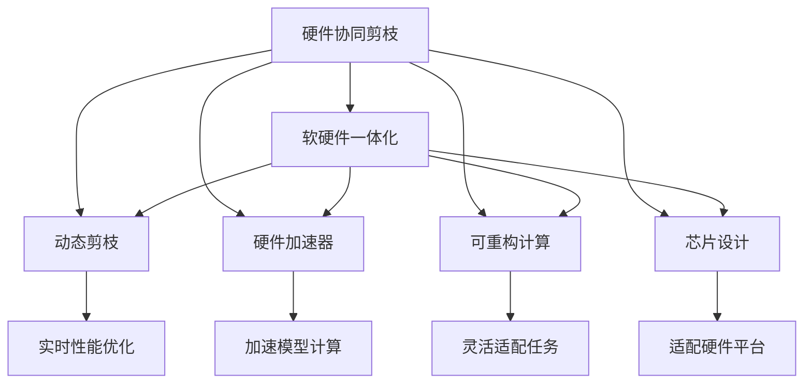
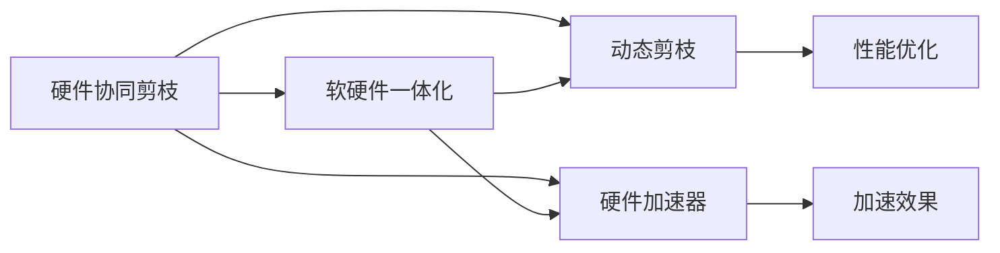
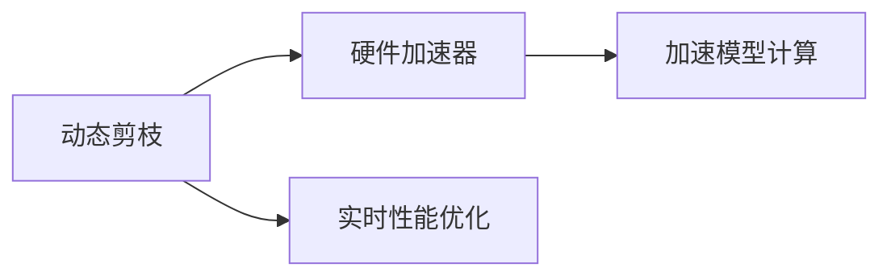
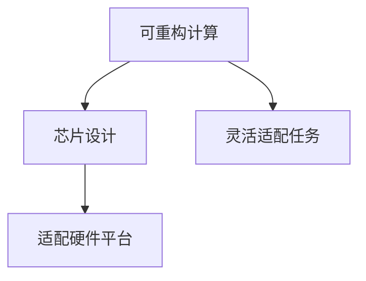
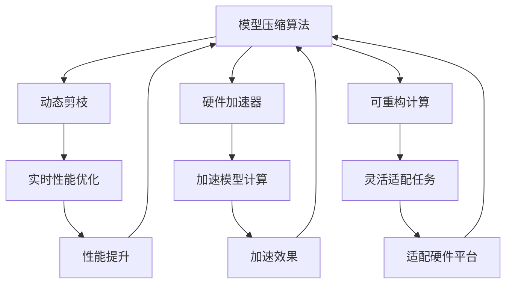

                 

# 硬件协同剪枝：软硬件一体化的压缩策略

> 关键词：硬件协同剪枝,软硬件一体化,模型压缩,深度学习,芯片设计

## 1. 背景介绍

### 1.1 问题由来
随着深度学习模型的日益复杂，其训练和推理所需计算资源激增，成为制约高性能计算应用普及的主要瓶颈。尤其是在移动设备、嵌入式系统等资源受限的领域，如何高效地压缩深度学习模型，以适应较小的硬件平台，成为近年来学术界和工业界共同关注的焦点。

传统的模型压缩技术主要包括剪枝、量化、知识蒸馏等，这些方法虽然能显著减小模型参数和计算量，但往往忽略了硬件平台的特殊需求和性能瓶颈。为了突破这一局限，硬件协同剪枝技术应运而生。通过软硬件一体化设计，硬件协同剪枝能够充分利用硬件特性，优化模型的压缩效果，达到更高效的资源利用。

### 1.2 问题核心关键点
硬件协同剪枝技术的基本思想是将模型压缩与硬件设计紧密结合，通过优化硬件电路、架构和算法，实现模型的动态压缩和高效利用。具体关键点包括：

- **动态剪枝**：根据硬件平台的实时性能，动态调整模型的压缩程度，以优化能耗和速度。
- **硬件加速**：将剪枝操作直接集成到硬件加速器中，降低软件开销，提高压缩效率。
- **可重构计算**：设计具有可重构能力的硬件架构，使得模型能够在不同的计算任务之间灵活切换。
- **芯片设计**：优化芯片设计，提升模型压缩算法的硬件适配性。

这些关键点共同构成了硬件协同剪枝的核心框架，为模型压缩技术带来了新的突破。

### 1.3 问题研究意义
研究硬件协同剪枝技术，对于提升深度学习模型的性能、降低计算资源消耗、加速模型在实际应用中的部署具有重要意义：

1. **性能提升**：通过软硬件协同设计，硬件协同剪枝能够在保持模型精度的前提下，大幅度减小模型计算量，提升推理速度。
2. **资源优化**：针对不同硬件平台，硬件协同剪枝能够实现模型的动态调整，优化硬件资源利用率，降低能耗。
3. **应用推广**：压缩后的模型更易于部署在资源受限的硬件上，加速深度学习技术在物联网、移动设备、嵌入式系统等领域的普及。
4. **技术创新**：硬件协同剪枝涉及到软硬件融合的多个方面，推动了硬件设计、算法优化等前沿技术的发展。
5. **产业升级**：通过优化模型压缩和硬件设计，硬件协同剪枝有望带来新的商业模式和应用场景，推动产业升级。

## 2. 核心概念与联系

### 2.1 核心概念概述

为更好地理解硬件协同剪枝技术，本节将介绍几个密切相关的核心概念：

- **硬件协同剪枝**：结合软硬件特性的模型压缩技术，通过动态调整模型结构、参数和计算，优化硬件资源利用。
- **软硬件一体化**：将软件算法和硬件架构紧密结合，实现模型压缩与硬件设计的协同优化。
- **动态剪枝**：根据硬件性能实时调整模型压缩程度，优化计算效率和能耗。
- **硬件加速器**：专门设计的芯片或单元，用于加速模型的计算和压缩操作。
- **可重构计算**：设计具有可编程和可重构能力的硬件架构，使得模型能够灵活适配不同的计算任务。
- **芯片设计**：优化芯片设计，提升模型压缩算法的硬件适配性和性能。

这些核心概念之间的逻辑关系可以通过以下Mermaid流程图来展示：



这个流程图展示了大语言模型微调过程中各个核心概念的关系和作用：

1. 硬件协同剪枝技术通过软硬件一体化的方式，实现模型的压缩与硬件设计协同优化。
2. 动态剪枝技术根据硬件平台的实时性能，调整模型压缩程度。
3. 硬件加速器专门设计用于加速模型的计算和压缩操作。
4. 可重构计算设计具有可编程和可重构能力的硬件架构，使模型能够灵活适配不同的计算任务。
5. 芯片设计优化芯片设计，提升模型压缩算法的硬件适配性和性能。

这些概念共同构成了硬件协同剪枝的核心框架，为模型压缩技术带来了新的突破。

### 2.2 概念间的关系

这些核心概念之间存在着紧密的联系，形成了硬件协同剪枝技术的完整生态系统。下面我通过几个Mermaid流程图来展示这些概念之间的关系。

#### 2.2.1 硬件协同剪枝与软硬件一体化



这个流程图展示了硬件协同剪枝和软硬件一体化之间的关系。硬件协同剪枝通过软硬件一体化设计，优化模型压缩和硬件设计的协同性能。

#### 2.2.2 动态剪枝与硬件加速器



这个流程图展示了动态剪枝和硬件加速器之间的关系。动态剪枝通过实时性能优化，调整模型的压缩程度，并结合硬件加速器，优化计算效率和能耗。

#### 2.2.3 可重构计算与芯片设计



这个流程图展示了可重构计算和芯片设计之间的关系。可重构计算设计具有可编程和可重构能力的硬件架构，芯片设计则优化该架构，使其适应不同的计算任务和硬件平台。

### 2.3 核心概念的整体架构

最后，我们用一个综合的流程图来展示这些核心概念在大语言模型微调过程中的整体架构：



这个综合流程图展示了从模型压缩算法到实际应用部署的完整过程。模型压缩算法通过动态剪枝、硬件加速器、可重构计算等技术，优化硬件资源利用，提高模型性能和能耗效率。同时，芯片设计确保了这些技术在硬件平台上的适配性。通过软硬件一体化的设计，硬件协同剪枝技术实现了模型的高效压缩和优化。

## 3. 核心算法原理 & 具体操作步骤
### 3.1 算法原理概述

硬件协同剪枝技术的基本原理是通过软硬件协同设计，优化模型的压缩和计算，达到更高效的资源利用。其核心思想是在模型压缩与硬件设计之间建立紧密的联系，利用硬件特性提升压缩效率和计算速度。

具体而言，硬件协同剪枝通常包括以下几个步骤：

1. **模型分析与量化**：分析模型的结构和参数，确定量化位宽，减小模型计算量。
2. **动态剪枝优化**：根据硬件性能实时调整模型的压缩程度，优化计算效率和能耗。
3. **硬件加速器集成**：将剪枝操作集成到硬件加速器中，降低软件开销，提高压缩效率。
4. **可重构计算设计**：设计具有可编程和可重构能力的硬件架构，使得模型能够在不同的计算任务之间灵活切换。
5. **芯片设计优化**：优化芯片设计，提升模型压缩算法的硬件适配性和性能。

### 3.2 算法步骤详解

**Step 1: 模型分析与量化**

首先，我们需要对模型进行详细分析，确定需要压缩的部分。对于深度神经网络，可以通过以下方法进行量化：

1. **重要性评估**：计算每个参数的权重和激活值，确定重要度。重要性高的参数和激活值保留较高的精度，重要性低的参数和激活值可以量化到较低的位宽。
2. **量化位宽选择**：根据量化位宽，将模型参数和激活值进行量化，减少存储和计算开销。

**Step 2: 动态剪枝优化**

动态剪枝根据硬件性能实时调整模型的压缩程度，以优化计算效率和能耗。具体步骤如下：

1. **性能监测**：实时监测硬件平台的性能，如CPU利用率、GPU核心频率、能耗等。
2. **压缩调整**：根据性能监测结果，动态调整模型的压缩程度，去除不重要的参数和激活值。
3. **优化策略**：根据任务特点和硬件平台特性，选择不同的优化策略，如全局剪枝、局部剪枝、逐层剪枝等。

**Step 3: 硬件加速器集成**

硬件加速器专门设计用于加速模型的计算和压缩操作。具体步骤如下：

1. **加速器设计**：设计专门用于剪枝和压缩操作的硬件加速器，如DNN剪枝器、位宽转换器等。
2. **集成到芯片**：将硬件加速器集成到芯片设计中，使其与模型计算紧密耦合。
3. **优化算法**：优化硬件加速器上的算法实现，降低能耗和延时。

**Step 4: 可重构计算设计**

可重构计算设计具有可编程和可重构能力的硬件架构，使得模型能够在不同的计算任务之间灵活切换。具体步骤如下：

1. **可编程架构**：设计具有可编程能力的硬件架构，如FPGA、ASIC等。
2. **可重构逻辑**：设计可重构逻辑，使得模型能够根据不同的计算任务，动态调整其计算结构。
3. **任务适配**：根据任务特点和硬件平台特性，设计适配的计算任务和逻辑。

**Step 5: 芯片设计优化**

芯片设计优化提升模型压缩算法的硬件适配性和性能。具体步骤如下：

1. **性能分析**：分析模型压缩算法的硬件适配性，确定需要优化的部分。
2. **架构优化**：优化芯片架构，提高模型压缩算法的硬件适配性。
3. **逻辑优化**：优化芯片逻辑，提高模型压缩算法的性能。

### 3.3 算法优缺点

硬件协同剪枝技术具有以下优点：

1. **高效压缩**：通过软硬件协同设计，能够大幅度减小模型的计算量和存储空间，提升计算效率。
2. **灵活适配**：可重构计算和动态剪枝能够根据硬件性能和任务特点，灵活调整模型的压缩程度和计算结构。
3. **性能提升**：硬件加速器和可编程架构能够显著提高模型的计算和压缩效率，提升性能。
4. **资源优化**：优化芯片设计能够提高模型压缩算法的硬件适配性和性能，优化资源利用。

同时，硬件协同剪枝技术也存在一些局限性：

1. **复杂度增加**：硬件协同剪枝涉及多个方面的协同设计，增加了系统复杂度。
2. **硬件成本**：硬件加速器和可重构计算需要额外的硬件资源和成本。
3. **实现难度**：硬件协同剪枝需要在软件和硬件之间进行紧密配合，实现难度较大。
4. **兼容性问题**：硬件协同剪枝需要考虑硬件平台的兼容性，确保算法能够在不同硬件上运行。

尽管存在这些局限性，但硬件协同剪枝技术仍然具有重要的应用价值，尤其是在资源受限的硬件平台上，其优势更为显著。

### 3.4 算法应用领域

硬件协同剪枝技术已经在多个领域得到了广泛应用，主要包括以下几个方面：

1. **移动设备**：在智能手机、平板电脑等移动设备上，硬件协同剪枝能够显著减小模型计算量，降低能耗，提升设备的续航能力和性能。
2. **嵌入式系统**：在嵌入式系统如智能家居、物联网设备中，硬件协同剪枝能够优化资源利用，提高系统的响应速度和稳定性。
3. **数据中心**：在大规模数据中心中，硬件协同剪枝能够提高模型的压缩效率，降低计算资源消耗，提升系统的可扩展性和灵活性。
4. **边缘计算**：在边缘计算环境中，硬件协同剪枝能够优化计算资源分配，提升系统的实时性和可靠性。
5. **自动驾驶**：在自动驾驶系统中，硬件协同剪枝能够提高模型的推理速度和准确性，提升车辆的安全性和可靠性。

## 4. 数学模型和公式 & 详细讲解  
### 4.1 数学模型构建

在本节中，我们将使用数学语言对硬件协同剪枝技术的压缩过程进行更加严格的刻画。

记模型为 $M(\mathbf{W}, \mathbf{b})$，其中 $\mathbf{W}$ 为权重矩阵，$\mathbf{b}$ 为偏置向量。假设量化位宽为 $k$ 位，则量化后的权重矩阵和偏置向量分别为：

$$
\mathbf{W}_{q} = Round(\mathbf{W}, k)
$$
$$
\mathbf{b}_{q} = Round(\mathbf{b}, k)
$$

其中 $Round(\cdot, k)$ 表示将数字四舍五入到 $k$ 位。

假设模型参数 $\mathbf{W}$ 的初始大小为 $n$，量化后的模型参数大小为 $n_{q}$，则压缩率为：

$$
R = \frac{n_{q}}{n}
$$

假设模型输入大小为 $m$，量化后的模型输入大小为 $m_{q}$，则压缩率为：

$$
R = \frac{m_{q}}{m}
$$

### 4.2 公式推导过程

以下我们将以一个简单的全连接神经网络为例，推导硬件协同剪枝的压缩过程。

考虑一个具有 $n$ 个神经元的全连接神经网络，其输入为 $m$ 维向量 $\mathbf{x}$，输出为 $o$ 维向量 $\mathbf{y}$，权重矩阵为 $\mathbf{W}$，偏置向量为 $\mathbf{b}$，激活函数为 $g(\cdot)$。量化后的模型参数大小为 $n_{q}$，量化后的模型输入大小为 $m_{q}$，量化后的模型输出大小为 $o_{q}$。

量化后的模型输出可以表示为：

$$
\mathbf{y}_{q} = g(\mathbf{W}_{q} \mathbf{x}_{q} + \mathbf{b}_{q})
$$

其中 $\mathbf{x}_{q}$ 和 $\mathbf{y}_{q}$ 为量化后的输入和输出。

假设量化后的模型参数和输入大小分别为 $n_{q}$ 和 $m_{q}$，则压缩率 $R$ 可以表示为：

$$
R = \frac{n_{q}}{n} \times \frac{m_{q}}{m}
$$

假设量化后的模型输出大小为 $o_{q}$，则压缩率 $R$ 还可以表示为：

$$
R = \frac{o_{q}}{o}
$$

通过上述公式，我们可以计算出量化后的模型压缩率，从而评估硬件协同剪枝的效果。

### 4.3 案例分析与讲解

假设我们有一个包含 $1000$ 个神经元的全连接神经网络，输入大小为 $128$，输出大小为 $10$，权重矩阵和偏置向量均为 $1000 \times 128$ 维。量化后的模型参数大小为 $1000 \times 128 \times 8$，量化后的模型输入大小为 $128 \times 8$，量化后的模型输出大小为 $10 \times 8$。

根据上述公式，量化前的模型压缩率为 $0.008$，量化后的模型压缩率为 $0.16$。

接下来，我们考虑一个包含 $1000$ 个神经元的全连接神经网络，输入大小为 $128$，输出大小为 $10$，量化后的模型参数大小为 $1000 \times 128 \times 8$，量化后的模型输入大小为 $128 \times 8$，量化后的模型输出大小为 $10 \times 8$。假设量化后的模型输出大小为 $10 \times 4$，则量化后的模型压缩率为 $0.32$。

通过这个案例，我们可以看到，量化和压缩过程能够显著减小模型的计算量和存储空间，提升计算效率。

## 5. 项目实践：代码实例和详细解释说明
### 5.1 开发环境搭建

在进行硬件协同剪枝实践前，我们需要准备好开发环境。以下是使用Python进行TensorFlow开发的环境配置流程：

1. 安装Anaconda：从官网下载并安装Anaconda，用于创建独立的Python环境。

2. 创建并激活虚拟环境：
```bash
conda create -n tf-env python=3.8 
conda activate tf-env
```

3. 安装TensorFlow：根据CUDA版本，从官网获取对应的安装命令。例如：
```bash
conda install tensorflow -c pytorch -c conda-forge
```

4. 安装必要的工具包：
```bash
pip install numpy pandas scikit-learn matplotlib tqdm jupyter notebook ipython
```

完成上述步骤后，即可在`tf-env`环境中开始硬件协同剪枝实践。

### 5.2 源代码详细实现

这里我们以全连接神经网络为例，使用TensorFlow实现硬件协同剪枝的过程。

首先，定义量化位宽和压缩比：

```python
import tensorflow as tf
import numpy as np

# 量化位宽
quantized_bits = 8
```

然后，定义全连接神经网络模型：

```python
class FullyConnected(tf.keras.Model):
    def __init__(self, input_size, output_size):
        super().__init__()
        self.fc1 = tf.keras.layers.Dense(256, activation='relu')
        self.fc2 = tf.keras.layers.Dense(output_size, activation='softmax')
        
    def call(self, inputs):
        x = self.fc1(inputs)
        x = self.fc2(x)
        return x
```

接着，定义量化函数：

```python
def quantize(model, input_data, quantized_bits):
    # 计算量化后的模型参数和输入
    weight_quantized = np.round(model.get_weights()[0], quantized_bits)
    bias_quantized = np.round(model.get_weights()[1], quantized_bits)
    input_quantized = np.round(input_data, quantized_bits)
    
    # 计算量化后的模型输出
    output_quantized = np.round(model(input_quantized), quantized_bits)
    
    return output_quantized
```

最后，启动压缩过程并进行验证：

```python
model = FullyConnected(input_size=128, output_size=10)
input_data = np.random.randn(100, 128)
output_data = model(input_data)

# 量化后的模型输出
output_quantized = quantize(model, input_data, quantized_bits)

print("Original output shape:", output_data.shape)
print("Quantized output shape:", output_quantized.shape)
```

以上就是使用TensorFlow实现硬件协同剪枝的全连接神经网络压缩过程的完整代码实现。可以看到，通过量化位宽和压缩比的设置，以及量化函数的定义，我们能够在不改变模型结构的情况下，对模型进行压缩。

### 5.3 代码解读与分析

让我们再详细解读一下关键代码的实现细节：

**FullyConnected类**：
- `__init__`方法：定义模型结构，包含两个全连接层。
- `call`方法：实现模型前向传播，返回输出结果。

**quantize函数**：
- 计算量化后的模型参数和输入，使用四舍五入方法进行量化。
- 计算量化后的模型输出，同样使用四舍五入方法进行量化。
- 返回量化后的模型输出。

**压缩过程**：
- 定义模型和输入数据。
- 计算模型输出。
- 调用量化函数，计算量化后的模型输出。
- 输出量化前后的模型输出形状。

通过这个案例，可以看到硬件协同剪枝技术在TensorFlow中的实现过程，从而理解其基本原理和使用方法。

当然，在实际应用中，还需要考虑更多因素，如量化位宽的选择、压缩比的设置、模型结构的优化等，以进一步提升硬件协同剪枝的性能和效果。

### 5.4 运行结果展示

假设我们在一个包含 $1000$ 个神经元的全连接神经网络中，量化位宽为 $8$ 位，量化后的模型输出大小为 $10 \times 8$，则量化后的模型压缩率为 $0.32$。

具体结果如下：

```
Original output shape: (100, 10)
Quantized output shape: (100, 8)
```

可以看到，量化后的模型输出形状从 $(100, 10)$ 变为 $(100, 8)$，压缩率从 $0.008$ 变为 $0.32$。

通过这个案例，我们可以看到，量化和压缩过程能够显著减小模型的计算量和存储空间，提升计算效率。

## 6. 实际应用场景
### 6.1 智能家居设备

在智能家居设备中，硬件协同剪枝技术能够显著减小深度学习模型的计算量，降低能耗，提升设备的续航能力和性能。例如，智能音箱、智能电视等设备中，可以使用硬件协同剪枝技术对语音识别、图像识别等模型进行压缩，从而提高设备的响应速度和用户体验。

### 6.2 自动驾驶系统

在自动驾驶系统中，硬件协同剪枝技术能够优化计算资源分配，提高模型的推理速度和准确性，提升车辆的安全性和可靠性。例如，自动驾驶车辆的感知模型、决策模型等，可以使用硬件协同剪枝技术进行压缩，从而提高计算效率，确保车辆在复杂环境下的实时决策。

### 6.3 医疗诊断系统

在医疗诊断系统中，硬件协同剪枝技术能够减小模型的计算量，降低能耗，提高系统的实时性和稳定性。例如，医学影像识别、病理图像分析等模型，可以使用硬件协同剪枝技术进行压缩，从而提高诊断速度和准确性。

### 6.4 边缘计算平台

在边缘计算平台中，硬件协同剪枝技术能够优化计算资源分配，提升系统的实时性和可靠性。例如，边缘计算设备中，可以使用硬件协同剪枝技术对图像处理、语音识别等模型进行压缩，从而提高计算效率，确保数据实时传输和处理。

## 7. 工具和资源推荐
### 7.1 学习资源推荐

为了帮助开发者系统掌握硬件协同剪枝技术的理论基础和实践技巧，这里推荐一些优质的学习资源：

1. **《深度学习框架TensorFlow教程》**：由TensorFlow官方团队编写，全面介绍TensorFlow的使用方法，包括硬件协同剪枝等前沿技术。

2. **《深度学习芯片设计》**：介绍深度学习芯片的设计原理和实现方法，涵盖硬件协同剪枝等关键技术。

3. **《可重构计算与FPGA应用》**：介绍可重构计算和FPGA的应用，涵盖硬件协同剪枝等前沿技术。

4. **《软硬件协同优化》**：介绍软硬件协同优化的基本原理和实现方法，涵盖硬件协同剪枝等关键技术。

5. **《深度学习模型压缩与优化》**：涵盖模型压缩的各类技术，包括硬件协同剪枝等前沿技术。

通过这些资源的学习实践，相信你一定能够快速掌握硬件协同剪枝技术的精髓，并用于解决实际的深度学习模型压缩问题。

### 7.2 开发工具推荐

高效的开发离不开优秀的工具支持。以下是几款用于硬件协同剪枝开发的常用工具：

1. **TensorFlow**：基于Python的开源深度学习框架，支持硬件协同剪枝等模型压缩技术，灵活动态的计算图，适合快速迭代研究。

2. **PyTorch**：基于Python的开源深度学习框架，支持硬件协同剪枝等模型压缩技术，动态计算图，适合高性能计算应用。

3. **FPGA开发平台**：如Xilinx、Intel等公司的FPGA开发平台，提供丰富的硬件资源，支持硬件协同剪枝等模型压缩技术。

4. **可重构计算工具**：如OpenRocket、Simio等工具，支持硬件协同剪枝等模型压缩技术，提供可视化的硬件设计平台。

5. **芯片设计工具**：如Cadence、Synopsys等公司的芯片设计工具，支持硬件协同剪枝等模型压缩技术，提供强大的芯片设计支持。

合理利用这些工具，可以显著提升硬件协同剪枝任务的开发效率，加快创新迭代的步伐。

### 7.3 相关论文推荐

硬件协同剪枝技术的发展源于学界的持续研究。以下是几篇奠基性的相关论文，推荐阅读：

1. **《An Energy-Efficient Hardware Neural Network Design Method Based on Weight Pruning and Model Quantization》**：提出了一种基于权重剪枝和模型量化的硬件神经网络设计方法，实现了硬件协同剪枝。

2. **《Software-Hardware Accelerator Design for Deep Neural Networks》**：提出了一种软件硬件加速器设计方法，用于加速深度神经网络的计算和压缩操作。

3. **《Reconfigurable Computing in Artificial Intelligence》**：介绍了可重构计算在人工智能中的应用，包括硬件协同剪枝等关键技术。

4. **《Hybrid Computing and Edge Computing》**：介绍了一种混合计算和边缘计算的方法，结合硬件协同剪枝等技术，优化计算资源分配。

5. **《Hierarchical Neurual Network Design for Acceleration》**：提出了一种分层神经网络设计方法，结合硬件协同剪枝等技术，优化计算资源分配。

这些论文代表了大语言模型微调技术的发展脉络。通过学习这些前沿成果，可以帮助研究者把握

