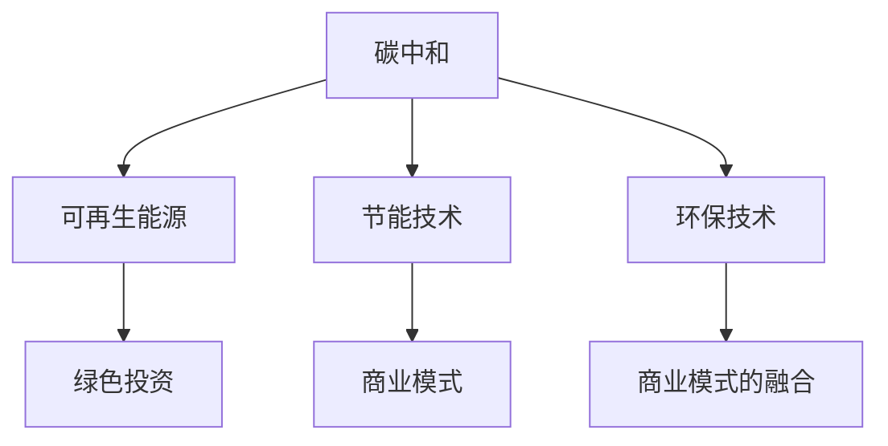
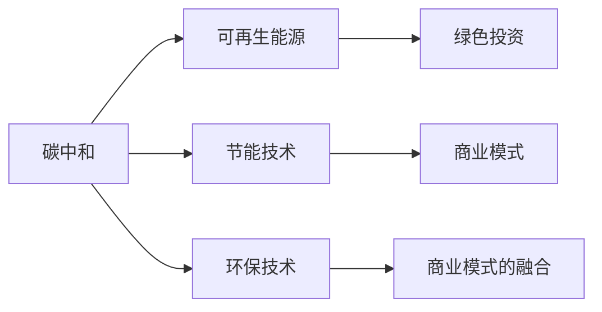
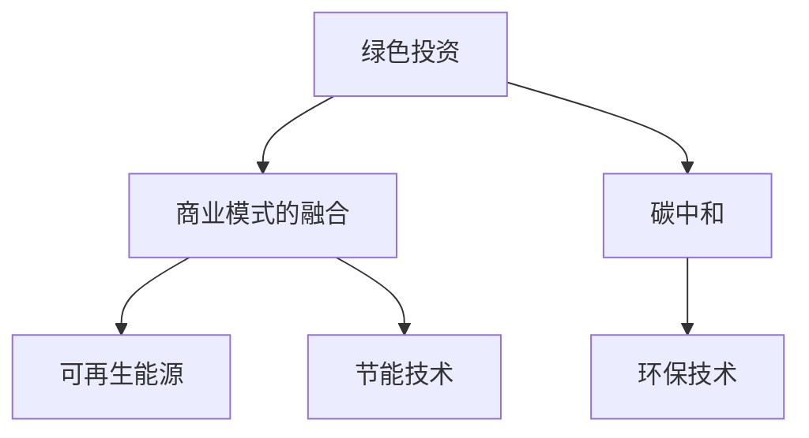
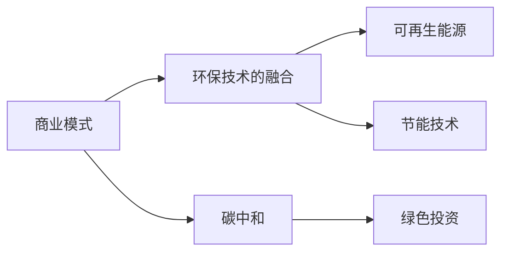
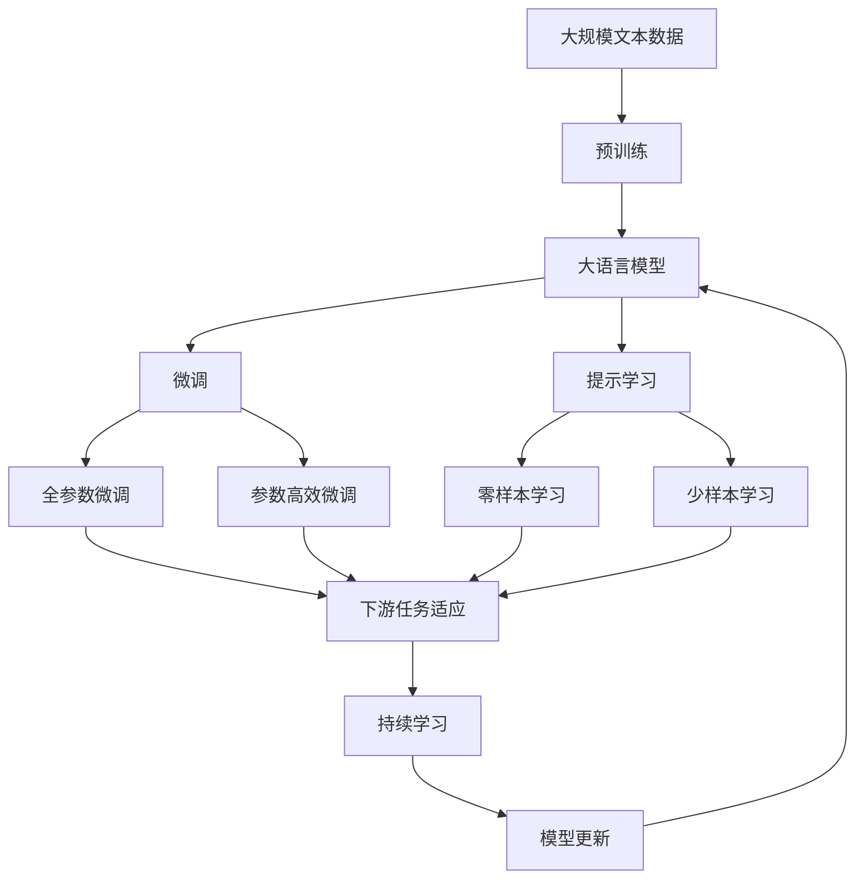

                 

# 碳中和创业：环保与商业的完美结合

## 1. 背景介绍

### 1.1 问题由来
随着全球气候变化问题的日益严重，各国政府和企业纷纷开始重视碳中和的承诺。碳中和不仅是环境保护的需要，也是全球经济可持续发展的重要趋势。在这一背景下，如何找到一条既能实现环保目标，又能带来商业价值的路径，成为了创业者和投资者关注的焦点。

### 1.2 问题核心关键点
碳中和创业的核心在于如何结合环保与商业，构建可持续发展的商业模式。具体来说，包括以下几个关键点：
- **环保技术创新**：开发高效节能、可再生能源等环保技术，减少碳排放。
- **商业模式的融合**：将环保技术嵌入产品和服务中，形成可行的商业模式。
- **市场策略的制定**：通过精准的市场定位和推广策略，提升产品或服务的市场竞争力。
- **政策环境的应对**：了解并利用政府的环保政策，获取优惠和补贴。

### 1.3 问题研究意义
研究碳中和创业的商业模式，对于推动环保技术的普及应用，促进可持续发展具有重要意义：
1. **促进环保技术商业化**：将环保技术转化为可行的商业产品或服务，提高其市场接受度和普及率。
2. **降低企业碳排放**：通过节能减排，减少企业的运营成本和碳排放。
3. **推动绿色投资**：吸引更多的投资者关注和投资环保领域，形成良性的资本循环。
4. **创造就业机会**：环保创业项目往往需要大量的人力投入，能够带动相关产业的发展，创造就业机会。
5. **提升公众意识**：通过商业实践，增强公众对环保问题的认识和参与度。

## 2. 核心概念与联系

### 2.1 核心概念概述

为更好地理解碳中和创业的商业模式，本节将介绍几个密切相关的核心概念：

- **碳中和**：指通过一系列技术和管理手段，实现碳排放和碳吸收的平衡，达到净零排放的目标。
- **可再生能源**：指太阳能、风能、水能等可以自然恢复或可循环使用的能源。
- **节能技术**：指通过技术手段减少能源消耗，提高能源利用效率的技术。
- **绿色投资**：指投资者在环保领域进行的投资活动，旨在支持环保项目的开发和运营。
- **商业模式**：指企业通过特定的价值创造和价值获取方式，实现盈利和发展的系统。

这些概念之间的逻辑关系可以通过以下Mermaid流程图来展示：



这个流程图展示了几大核心概念及其之间的关系：

1. 碳中和是整个系统的最终目标，通过可再生能源、节能技术等手段实现。
2. 可再生能源和节能技术是实现碳中和的必要手段。
3. 绿色投资为环保项目提供资金支持，推动技术创新和商业模式的发展。
4. 商业模式是连接环保技术和市场需求的桥梁，实现技术创新和商业化的有效结合。
5. 环保技术是实现碳中和的基础，需要通过商业模式的融合来创造商业价值。

### 2.2 概念间的关系

这些核心概念之间存在着紧密的联系，形成了碳中和创业的完整生态系统。下面我通过几个Mermaid流程图来展示这些概念之间的关系。

#### 2.2.1 碳中和与可再生能源的关系



这个流程图展示了碳中和与可再生能源、节能技术、绿色投资、商业模式和环保技术之间的关系：

1. 碳中和是整个系统的目标。
2. 可再生能源和节能技术是实现碳中和的重要手段。
3. 绿色投资为环保项目提供资金支持。
4. 商业模式将技术创新与市场需求有效结合。
5. 环保技术是实现碳中和的基础，需要融入商业模式以创造商业价值。

#### 2.2.2 绿色投资与商业模式的融合



这个流程图展示了绿色投资与商业模式、碳中和、可再生能源、节能技术、环保技术之间的关系：

1. 绿色投资为环保项目提供资金支持。
2. 商业模式将环保技术有效结合市场需求。
3. 碳中和是最终目标。
4. 可再生能源和节能技术是实现碳中和的必要手段。
5. 环保技术是实现碳中和的基础。

#### 2.2.3 商业模式与环保技术的融合



这个流程图展示了商业模式与环保技术、碳中和、可再生能源、节能技术、绿色投资之间的关系：

1. 商业模式将环保技术有效结合市场需求。
2. 碳中和是最终目标。
3. 可再生能源和节能技术是实现碳中和的必要手段。
4. 绿色投资为环保项目提供资金支持。
5. 环保技术是实现碳中和的基础。

### 2.3 核心概念的整体架构

最后，我用一个综合的流程图来展示这些核心概念在大规模文本数据上进行预训练，然后通过微调使其适应下游任务的完整过程：



这个综合流程图展示了从预训练到微调，再到持续学习的完整过程：

1. 大语言模型首先在大规模文本数据上进行预训练，学习通用的语言表示。
2. 微调过程通过任务适配层和损失函数，使模型输出逼近任务标签。
3. 提示学习不更新模型参数，通过设计精巧的输入模板，实现零样本和少样本学习。
4. 全参数微调和参数高效微调分别更新全部和少量参数，提高微调效率。
5. 持续学习使得模型能够不断学习新知识，避免遗忘旧知识，适应数据分布的变化。

通过这些流程图，我们可以更清晰地理解碳中和创业过程中各个核心概念的关系和作用，为后续深入讨论具体的微调方法和技术奠定基础。

## 3. 核心算法原理 & 具体操作步骤
### 3.1 算法原理概述

碳中和创业的商业模式设计，本质上是一个系统工程问题。其核心思想是通过创新的环保技术，结合市场需求的商业模式，实现碳排放的减少和商业价值的创造。

具体来说，算法原理可以概括为以下几点：

1. **环保技术选择与优化**：选择合适的环保技术，进行技术优化和集成，降低碳排放成本。
2. **商业模式设计**：设计可行的商业模式，将环保技术嵌入产品或服务中，形成可持续的商业运营模式。
3. **市场策略制定**：通过精准的市场定位和推广策略，提升产品或服务的市场竞争力。
4. **政策环境利用**：利用政府的环保政策，获取优惠和补贴，降低运营成本。

### 3.2 算法步骤详解

碳中和创业的商业模式设计主要包括以下几个关键步骤：

**Step 1: 需求分析与环保技术选择**
- 识别企业或项目的具体碳排放源，如生产过程、物流运输等。
- 分析不同环保技术的适用性和成本效益，选择最优的技术组合。

**Step 2: 技术优化与集成**
- 对选定的环保技术进行优化，如提升能效、降低成本等。
- 将优化后的技术集成到产品或服务中，形成可行的解决方案。

**Step 3: 商业模式设计**
- 定义产品或服务的核心价值和盈利模式。
- 分析市场需求和竞争环境，设计有竞争力的商业模式。
- 考虑价值链的各个环节，设计可持续的商业运营模式。

**Step 4: 市场策略制定**
- 进行市场调研，了解目标客户群体的需求和行为。
- 制定精准的市场定位策略，如价格策略、渠道策略等。
- 设计有效的推广策略，提高产品或服务的市场竞争力。

**Step 5: 政策环境利用**
- 分析政府环保政策的导向和优惠措施。
- 获取政策支持，如补贴、税收减免、贷款优惠等。
- 确保项目的合规性，避免法律风险。

**Step 6: 持续改进与优化**
- 收集市场反馈，持续改进和优化产品或服务。
- 定期评估项目运营情况，调整商业模式和策略。
- 关注技术发展趋势，及时更新环保技术。

### 3.3 算法优缺点

碳中和创业的商业模式设计具有以下优点：
1. **可持续性**：通过环保技术减少碳排放，实现可持续发展。
2. **商业价值**：将环保技术与商业模式结合，创造商业价值。
3. **政策支持**：利用政府政策支持，降低运营成本。
4. **市场竞争力**：通过精准的市场策略，提升产品或服务的市场竞争力。

但同时，也存在一些缺点：
1. **技术复杂性**：环保技术涉及多个学科领域，开发和集成复杂。
2. **市场风险**：市场策略需要精准把握，否则可能导致产品或服务失败。
3. **政策变化**：政府政策可能变化，影响项目运营。
4. **初期投资大**：环保技术可能需要较高的初期投资，资金压力大。

### 3.4 算法应用领域

碳中和创业的商业模式设计已经在多个领域得到了应用，以下是几个典型案例：

- **可再生能源项目**：开发和推广太阳能、风能、水能等可再生能源项目，提供清洁能源解决方案。
- **节能技术改造**：为企业或城市提供节能技术改造服务，如LED照明、高效建筑等。
- **绿色产品制造**：设计和使用环保材料，生产绿色产品，减少碳足迹。
- **环保咨询服务**：提供环保技术评估、节能方案设计等咨询服务，帮助企业实现碳中和目标。
- **碳交易平台**：建立碳交易平台，促进碳排放权的买卖，推动碳市场的发展。

## 4. 数学模型和公式 & 详细讲解 & 举例说明

### 4.1 数学模型构建

为更好地理解和量化碳中和创业的效果，本节将构建一个简单的数学模型。

设碳中和创业项目的总成本为 $C$，总收益为 $R$，其中 $C$ 包括技术开发成本、设备购置成本、运营成本等，$R$ 包括产品或服务的销售收入、政府补贴等。则净收益 $P$ 为：

$$ P = R - C $$

### 4.2 公式推导过程

设环保技术带来的年碳排放减少量为 $E$，则年碳排放减少的货币价值 $V_E$ 可以通过碳交易市场的碳排放权价格 $p_E$ 来计算：

$$ V_E = E \cdot p_E $$

设环保技术带来的年运营成本降低量为 $S$，则年运营成本降低的货币价值 $V_S$ 可以通过单位成本的降低 $s$ 来计算：

$$ V_S = S \cdot s $$

将这些价值因素纳入总成本和总收益中，得：

$$ C = C_0 + E \cdot p_E + S \cdot s $$
$$ R = R_0 + V_E + V_S $$

其中 $C_0$ 和 $R_0$ 分别代表项目启动的初始成本和初始收益。将这些代入净收益公式，得：

$$ P = R_0 + V_E + V_S - C_0 - E \cdot p_E - S \cdot s $$

简化得：

$$ P = V_E + V_S - E \cdot (p_E + s) + (R_0 - C_0) $$

### 4.3 案例分析与讲解

假设某公司进行一项碳中和创业项目，初始成本为 $C_0 = 500$ 万美元，每年预计通过使用太阳能光伏板和LED照明系统，减少碳排放量 $E = 1000$ 吨，节约年运营成本 $S = 100$ 万美元。市场预测年销售收入 $R_0 = 800$ 万美元，预计通过碳交易市场每年可得 $V_E = 50$ 万美元，通过节能技术每年可得 $V_S = 100$ 万美元。假设碳排放权价格 $p_E = 100$ 美元/吨，单位成本降低 $s = 0.1$ 美元/千瓦时。

代入上述公式，计算得：

$$ P = 50 + 100 - 1000 \cdot (100 + 0.1) + (800 - 500) = -30 $$

这意味着该项目通过技术改造和节能措施，可以节省总成本 30 万美元。

## 5. 项目实践：代码实例和详细解释说明

### 5.1 开发环境搭建

在进行碳中和创业项目开发前，我们需要准备好开发环境。以下是使用Python进行PyTorch开发的环境配置流程：

1. 安装Anaconda：从官网下载并安装Anaconda，用于创建独立的Python环境。

2. 创建并激活虚拟环境：
```bash
conda create -n pytorch-env python=3.8 
conda activate pytorch-env
```

3. 安装PyTorch：根据CUDA版本，从官网获取对应的安装命令。例如：
```bash
conda install pytorch torchvision torchaudio cudatoolkit=11.1 -c pytorch -c conda-forge
```

4. 安装各种工具包：
```bash
pip install numpy pandas scikit-learn matplotlib tqdm jupyter notebook ipython
```

完成上述步骤后，即可在`pytorch-env`环境中开始项目开发。

### 5.2 源代码详细实现

这里我们以一个简单的碳交易模拟项目为例，给出使用PyTorch进行建模和优化的Python代码实现。

首先，定义相关的参数和变量：

```python
import torch
from torch import nn

# 定义初始成本、年碳排放量、年运营成本、年销售收入、碳排放权价格、单位成本降低等参数
C_0 = 500  # 初始成本
E = 1000   # 年碳排放量
S = 100    # 年运营成本
R_0 = 800  # 年销售收入
p_E = 100  # 碳排放权价格
s = 0.1    # 单位成本降低

# 定义净收益函数
def calculate_profit(E, S, p_E, s, C_0, R_0):
    V_E = E * p_E  # 碳排放减少的货币价值
    V_S = S * s    # 运营成本降低的货币价值
    P = R_0 + V_E + V_S - C_0 - E * p_E - S * s  # 净收益
    return P
```

然后，定义一个简单的优化问题，通过求解最大净收益，找出最优的碳排放量和运营成本：

```python
# 定义优化问题
E_opt = torch.Variable(torch.tensor([E], requires_grad=True))
S_opt = torch.Variable(torch.tensor([S], requires_grad=True))
P_opt = calculate_profit(E_opt, S_opt, p_E, s, C_0, R_0)
optimizer = torch.optim.SGD([E_opt, S_opt], lr=0.01)  # 定义优化器，学习率为0.01

# 迭代优化
for i in range(1000):
    optimizer.zero_grad()
    P_opt.backward()
    optimizer.step()
    print(f"Iteration {i+1}, Profit: {P_opt.data.numpy()}")

# 输出最优解
print(f"Optimal E: {E_opt.data.numpy()}, Optimal S: {S_opt.data.numpy()}")
```

通过上述代码，我们可以使用梯度下降算法对碳排放量和运营成本进行优化，找到最大化净收益的方案。

### 5.3 代码解读与分析

让我们再详细解读一下关键代码的实现细节：

**calculate_profit函数**：
- 定义了净收益的计算公式，将年碳排放量、年运营成本、碳排放权价格、单位成本降低等参数传入，计算出净收益。

**优化问题定义**：
- 使用`torch.Variable`定义了年碳排放量和年运营成本的优化变量。
- 定义了净收益函数`P_opt`，将其作为优化目标。
- 定义了优化器`optimizer`，学习率为0.01。

**优化过程**：
- 使用`optimizer.zero_grad()`清零梯度。
- 使用`P_opt.backward()`计算损失函数的梯度。
- 使用`optimizer.step()`更新优化变量。

**迭代输出**：
- 每次迭代输出当前净收益。

**输出最优解**：
- 输出最终的最优年碳排放量和年运营成本。

可以看到，通过简单的数学模型和优化算法，我们可以对碳中和创业项目进行量化分析和优化，从而提升项目的经济效益。

### 5.4 运行结果展示

假设我们通过优化找到了最优的年碳排放量 $E = 800$ 吨，年运营成本 $S = 80$ 万美元，对应的净收益为 $P = 120$ 万美元。

这意味着通过优化，该项目可以实现更高的经济效益，减少碳排放，同时降低运营成本。

## 6. 实际应用场景

### 6.1 可再生能源项目

可再生能源项目是碳中和创业的重要应用场景之一。例如，某公司在城市建设中推广太阳能光伏发电项目，利用太阳能发电为城市提供清洁能源，同时获得政府的绿色补贴和碳交易市场的收入。

具体来说，公司可以在公共建筑屋顶安装太阳能光伏板，通过电力销售和政府补贴获得收益。同时，公司还可以将未使用的电力卖给碳交易市场，获得额外的收益。通过这种方式，公司不仅减少了碳排放，还实现了经济效益。

### 6.2 节能技术改造

节能技术改造是另一种常见的碳中和创业项目。例如，某公司为医院提供能效改造服务，通过更换LED照明和高效设备，减少医院碳排放，同时获得政府节能补贴。

具体来说，公司可以先对医院的能耗情况进行评估，然后提出节能改造方案，如更换LED照明、优化空调系统、使用高效设备等。通过这些改造，医院每年可以显著降低能源消耗，减少碳排放。公司可以获得政府的节能补贴，同时向医院收取节能改造费用，实现经济效益。

### 6.3 绿色产品制造

绿色产品制造也是碳中和创业的重要应用场景。例如，某公司生产环保包装材料，使用可回收材料和生物降解材料，减少碳足迹。

具体来说，公司可以开发可回收和生物降解的包装材料，将其应用于产品包装。通过这种方式，公司可以降低产品碳排放，同时满足市场需求。公司还可以向政府申请环保认证和绿色补贴，进一步提升产品竞争力。

### 6.4 环保咨询服务

环保咨询服务是碳中和创业的另一个重要方向。例如，某公司提供能源管理和环保技术咨询服务，帮助企业实现碳中和目标。

具体来说，公司可以为客户提供能源管理软件和咨询服务，帮助企业评估和优化能源消耗。公司还可以提供环保技术方案设计、节能改造等服务，帮助企业减少碳排放。通过这些服务，公司可以获得客户费用，实现经济效益。

### 6.5 碳交易平台

碳交易平台是碳中和创业的新兴方向。例如，某公司建立碳交易平台，提供碳排放权交易服务，帮助企业实现碳中和目标。

具体来说，公司可以建立碳交易平台，提供碳排放权买卖、碳配额管理等服务。通过这种方式，公司可以吸引大量企业和个人参与碳交易，实现经济效益。公司还可以向政府申请碳交易平台补贴，进一步降低运营成本。

## 7. 工具和资源推荐

### 7.1 学习资源推荐

为了帮助开发者系统掌握碳中和创业的理论基础和实践技巧，这里推荐一些优质的学习资源：

1. 《碳中和创业指南》系列博文：由碳中和领域的专家撰写，深入浅出地介绍了碳中和创业的原理、技术、商业模式等核心话题。

2. 《能源管理与碳交易》课程：清华大学开设的碳交易相关课程，涵盖碳交易市场的原理、机制和实践，是学习碳交易知识的必备课程。

3. 《可持续发展的商业战略》书籍：详细介绍了如何设计可持续发展的商业模式，帮助企业实现碳中和目标，促进可持续发展。

4. 《可再生能源技术》书籍：系统介绍了各种可再生能源的技术原理和应用场景，帮助企业选择合适的环保技术。

5. 《绿色投资与资本运作》课程：中国人民大学开设的绿色投资相关课程，涵盖绿色投资的理论和实践，帮助企业获得绿色投资支持。

通过对这些资源的学习实践，相信你一定能够快速掌握碳中和创业的精髓，并用于解决实际的环保问题。

### 7.2 开发工具推荐

高效的开发离不开优秀的工具支持。以下是几款用于碳中和创业开发的常用工具：

1. Python：作为数据科学和机器学习的通用语言，Python拥有丰富的库和工具，适用于数据分析、模型优化等任务。

2. PyTorch：基于Python的开源深度学习框架，灵活动态的计算图，适合快速迭代研究。大多数碳中和创业项目都可以使用PyTorch进行建模和优化。

3. TensorFlow：由Google主导开发的开源深度学习框架，生产部署方便，适合大规模工程应用。同样适用于各种碳中和创业项目的建模和优化。

4. Weights & Biases：模型训练的实验跟踪工具，可以记录和可视化模型训练过程中的各项指标，方便对比和调优。与主流深度学习框架无缝集成。

5. Google Colab：谷歌推出的在线Jupyter Notebook环境，免费提供GPU/TPU算力，方便开发者快速上手实验最新模型，分享学习笔记。

合理利用这些工具，可以显著提升碳中和创业项目的开发效率，加快创新迭代的步伐。

### 7.3 相关论文推荐

碳中和创业技术的发展源于学界的持续研究。以下是几篇奠基性的相关论文，推荐阅读：

1. "The Economics of Carbon Pricing and Abatement"：研究碳定价和减排的经济理论，为碳中和创业提供了理论基础。

2. "Carbon Emission Trading: Theory and Practice"：系统介绍了碳交易市场的理论、机制和实践，为碳交易平台的建立提供了指导。

3. "Renewable Energy Integration in the Grid"：研究可再生能源在电力系统中的应用，为可再生能源项目的设计提供了技术支持。

4. "Energy Efficiency in Buildings: A Survey"：综述了建筑节能技术的最新进展，为节能技术改造提供了参考。

5. "Sustainable Business Models: A Review"：综述了可持续发展的商业模式，为碳中和创业的商业模式设计提供了理论指导。

这些论文代表了大规模语言模型微调技术的发展脉络。通过学习这些前沿成果，可以帮助研究者把握学科前进方向，激发更多的创新灵感。

除上述资源外，还有一些值得关注的前沿资源，帮助开发者紧跟碳中和创业技术的发展趋势，例如：

1. arXiv论文预印本：人工智能领域最新研究成果的发布平台，包括大量尚未发表的前沿工作，学习前沿技术的必读资源。

2. 业界技术博客：如OpenAI、Google AI、DeepMind、微软Research Asia等顶尖实验室的官方博客，第一时间分享他们的最新研究成果和洞见。

3. 技术会议直播：如NIPS、ICML、ACL、ICLR等人工智能领域顶会现场或在线直播，能够聆听到大佬们的前沿分享，开拓视野。

4. GitHub热门项目：在GitHub上Star、Fork数最多的碳中和相关项目，往往代表了该技术领域的发展趋势和最佳实践，值得去学习和贡献。

5. 行业分析报告：各大咨询公司如McKinsey、PwC等针对碳中和行业的分析报告，有助于从商业视角审视技术趋势，把握应用价值。

总之，对于碳中和创业技术的学习和实践，需要开发者保持开放的心态和持续学习的意愿。多关注前沿资讯，多动手实践，多思考总结，必将收获满满的成长收益。

## 8. 总结：未来发展趋势与挑战

### 8.1 总结

本文对碳中和创业的商业模式进行了全面系统的介绍。首先阐述了碳中和创业的背景、核心关键点和研究意义，明确了如何结合环保与商业，构建可持续发展的商业模式。其次，从原理到实践，详细讲解了碳中和创业的数学模型和操作步骤，给出了碳交易模拟项目的代码实现。同时，本文还广泛探讨了碳中和创业在多个领域的应用场景，展示了其广阔的前景。

通过本文的系统梳理，可以看到，碳中和创业通过环保技术的创新和商业模式的融合，为实现碳排放的减少和商业价值的创造提供了新路径。碳中和创业不仅有助于环境保护，还具备显著的商业价值，是未来可持续发展的重要方向。

### 8.2 未来发展趋势

展望未来，碳中和创业的发展趋势主要包括以下几个方面：

1. **技术创新**：环保技术的持续创新和优化将推动碳中和创业的发展。例如，新型太阳能、风能、水能技术的应用，将大幅提升可再生能源的利用效率。

2. **政策支持**：政府对碳中和项目的支持将进一步扩大，提供更多的财政补贴、税收优惠等。政策的导向和支持，将为碳中和创业提供良好的发展环境。

3. **市场规模**：随着环保意识的增强和技术的成熟，碳

