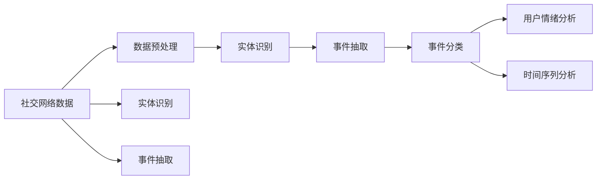
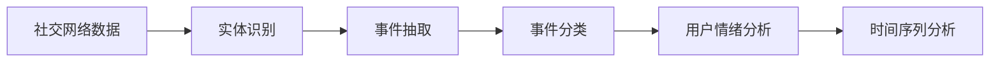
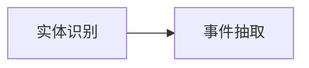
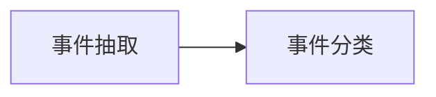

                 

## 1. 背景介绍

### 1.1 问题由来
社交网络（Social Networks）作为信息传播与社交互动的重要平台，已经深入到人们生活的各个方面。随着社交网络的日益普及，用户每天都会在网络中生成海量的信息，如文本、图片、视频等。如何从这些海量的信息中挖掘出有价值的事件信息，成为社交网络应用的关键问题。

事件挖掘（Event Mining）是指从文本数据中识别和抽取与特定主题或事件相关的事件信息，是自然语言处理（NLP）、信息提取（IE）和知识图谱构建等领域的重要研究方向。社交网络中事件挖掘技术可以帮助企业识别品牌舆情、监测社会动态、评估政策效果，甚至预测金融市场变化，具有广泛的应用前景。

### 1.2 问题核心关键点
社交网络中的事件挖掘涉及以下几个核心关键点：

- **数据预处理**：社交网络数据具有复杂性、多样性和高噪声的特点，需要进行清洗和预处理，以便于后续分析。
- **事件抽取**：从文本中识别出与事件相关的时间、地点、人物等实体信息，并通过实体之间的关系构建事件。
- **实体识别**：识别出文本中的实体（如人名、地名、组织名等），是事件抽取的前提。
- **事件分类**：将识别出的事件进行分类，以便于后续的分析和应用。
- **用户情绪分析**：分析用户在事件中表达的情绪和态度，以便于理解事件的情感倾向。
- **时间序列分析**：分析事件随时间的变化趋势，以便于评估事件发展情况。

### 1.3 问题研究意义
社交网络事件挖掘技术对于社交网络应用具有重要的研究意义：

1. **舆情监测**：帮助企业实时监测品牌和产品舆情，及时发现和应对负面信息。
2. **社会动态分析**：识别和跟踪社会热点事件，了解社会动态变化趋势。
3. **政策效果评估**：通过评估政策影响事件的发生频率和情感倾向，评估政策效果。
4. **金融市场预测**：识别和分析经济事件，预测金融市场变化。
5. **事件响应**：帮助政府和企业及时响应和处理重要事件，保障社会稳定。

## 2. 核心概念与联系

### 2.1 核心概念概述

社交网络中事件挖掘涉及到多个核心概念，包括但不限于：

- **社交网络数据**：社交网络中用户生成的大量文本、图片、视频等数据。
- **事件**：指具有一定时间、地点、人物等要素的社会活动或现象。
- **实体**：文本中具有独立意义的词或短语，如人名、地名、组织名等。
- **事件抽取**：从文本中识别并抽取事件信息。
- **实体识别**：从文本中识别出实体信息。
- **事件分类**：对识别出的事件进行分类，便于后续分析。
- **用户情绪分析**：分析用户在事件中的情感倾向。
- **时间序列分析**：分析事件随时间的变化趋势。

这些核心概念之间的关系可以通过以下Mermaid流程图来展示：



### 2.2 概念间的关系

这些核心概念之间存在着紧密的联系，形成了社交网络事件挖掘的完整生态系统。下面我们通过几个Mermaid流程图来展示这些概念之间的关系。

#### 2.2.1 事件挖掘的流程



这个流程图展示了事件挖掘的基本流程。从社交网络数据开始，先进行实体识别，然后识别出事件，并对事件进行分类。最后，分析用户情绪和事件随时间的变化趋势。

#### 2.2.2 实体识别与事件抽取的关系



这个流程图展示了实体识别和事件抽取之间的关系。实体识别是事件抽取的前提，通过实体识别出的实体信息，可以进行事件抽取，识别出文本中的事件。

#### 2.2.3 事件分类的应用



这个流程图展示了事件抽取和事件分类之间的关系。事件抽取是事件分类的基础，通过对事件进行分类，可以更好地理解和应用事件。

## 3. 核心算法原理 & 具体操作步骤

### 3.1 算法原理概述

社交网络中事件挖掘的主要算法包括：

- **基于规则的方法**：通过编写规则和模式匹配技术，识别和抽取事件。
- **基于机器学习的方法**：通过训练分类器和序列标注模型，识别和抽取事件。
- **基于深度学习的方法**：通过深度神经网络模型，识别和抽取事件。

这些方法各有优缺点，可以根据数据的特点和需求选择合适的算法。

### 3.2 算法步骤详解

#### 3.2.1 数据预处理

社交网络数据通常包含大量噪声和无关信息，需要进行预处理才能进行后续分析。数据预处理包括：

- 文本清洗：去除文本中的噪声，如HTML标签、特殊字符等。
- 实体抽取：识别出文本中的实体信息。
- 分词和词性标注：对文本进行分词和词性标注，便于后续分析。
- 构建词汇表：对预处理后的文本构建词汇表，加速处理速度。

#### 3.2.2 实体识别

实体识别是事件挖掘的基础，常用的实体识别方法包括：

- **基于规则的方法**：通过编写规则和模式匹配技术，识别实体。
- **基于机器学习的方法**：通过训练分类器和序列标注模型，识别实体。
- **基于深度学习的方法**：通过深度神经网络模型，识别实体。

实体识别通常分为两个步骤：

1. 实体抽取：识别出文本中的实体信息，如人名、地名、组织名等。
2. 实体消歧：通过上下文信息，识别出同一词在不同上下文中指代的实体。

#### 3.2.3 事件抽取

事件抽取是从文本中识别并抽取事件信息的过程。常用的事件抽取方法包括：

- **基于规则的方法**：通过编写规则和模式匹配技术，抽取事件。
- **基于机器学习的方法**：通过训练分类器和序列标注模型，抽取事件。
- **基于深度学习的方法**：通过深度神经网络模型，抽取事件。

事件抽取通常分为三个步骤：

1. 事件抽取：识别出文本中的事件信息，如事件类型、时间、地点等。
2. 事件分类：对识别出的事件进行分类，如政治事件、经济事件、社会事件等。
3. 事件关联：通过实体之间的关系，构建事件之间的关系。

#### 3.2.4 事件分类

事件分类是将识别出的事件进行分类的过程。常用的事件分类方法包括：

- **基于规则的方法**：通过编写规则和模式匹配技术，对事件进行分类。
- **基于机器学习的方法**：通过训练分类器和序列标注模型，对事件进行分类。
- **基于深度学习的方法**：通过深度神经网络模型，对事件进行分类。

事件分类通常采用监督学习方法，通过标注好的训练集训练分类器。常用的分类器包括：

- 支持向量机（SVM）
- 随机森林（Random Forest）
- 深度神经网络（DNN）

#### 3.2.5 用户情绪分析

用户情绪分析是分析用户在事件中表达的情绪和态度的过程。常用的用户情绪分析方法包括：

- **基于规则的方法**：通过编写规则和模式匹配技术，分析用户情绪。
- **基于机器学习的方法**：通过训练分类器和序列标注模型，分析用户情绪。
- **基于深度学习的方法**：通过深度神经网络模型，分析用户情绪。

用户情绪分析通常采用监督学习方法，通过标注好的训练集训练分类器。常用的分类器包括：

- 支持向量机（SVM）
- 随机森林（Random Forest）
- 深度神经网络（DNN）

#### 3.2.6 时间序列分析

时间序列分析是分析事件随时间的变化趋势的过程。常用的时间序列分析方法包括：

- **基于规则的方法**：通过编写规则和模式匹配技术，分析时间序列。
- **基于机器学习的方法**：通过训练分类器和序列标注模型，分析时间序列。
- **基于深度学习的方法**：通过深度神经网络模型，分析时间序列。

时间序列分析通常采用监督学习方法，通过标注好的训练集训练分类器。常用的分类器包括：

- 时间序列预测模型（如ARIMA）
- 深度神经网络（DNN）

### 3.3 算法优缺点

基于机器学习和深度学习的社交网络事件挖掘方法具有以下优点：

- **自动化程度高**：通过训练模型，可以实现自动化的实体识别和事件抽取。
- **准确率高**：通过深度学习模型，可以实现高精度的实体识别和事件抽取。
- **可扩展性强**：通过深度学习模型，可以处理大规模的社交网络数据。

但这些方法也存在一些缺点：

- **数据需求量大**：需要大量的标注数据进行模型训练。
- **模型复杂度高**：需要复杂的深度神经网络模型，训练和部署难度大。
- **可解释性差**：深度学习模型通常被视为"黑箱"，难以解释模型的决策过程。

### 3.4 算法应用领域

社交网络事件挖掘技术已经在多个领域得到了广泛应用，例如：

- **舆情监测**：实时监测品牌和产品舆情，及时发现和应对负面信息。
- **社会动态分析**：识别和跟踪社会热点事件，了解社会动态变化趋势。
- **政策效果评估**：通过评估政策影响事件的发生频率和情感倾向，评估政策效果。
- **金融市场预测**：识别和分析经济事件，预测金融市场变化。
- **事件响应**：帮助政府和企业及时响应和处理重要事件，保障社会稳定。

## 4. 数学模型和公式 & 详细讲解  
### 4.1 数学模型构建

社交网络中事件挖掘的数学模型通常包括以下几个部分：

- **实体识别模型**：识别出文本中的实体信息，如人名、地名、组织名等。
- **事件抽取模型**：识别出文本中的事件信息，如事件类型、时间、地点等。
- **事件分类模型**：将识别出的事件进行分类，如政治事件、经济事件、社会事件等。
- **用户情绪分析模型**：分析用户在事件中表达的情绪和态度。
- **时间序列分析模型**：分析事件随时间的变化趋势。

### 4.2 公式推导过程

#### 4.2.1 实体识别模型的公式推导

实体识别模型通常采用CRF（条件随机场）或BiLSTM-CRF（双向长短期记忆网络条件随机场）等序列标注模型。以BiLSTM-CRF为例，其公式推导如下：

假设输入序列为 $X=\{x_1,x_2,\cdots,x_n\}$，输出序列为 $Y=\{y_1,y_2,\cdots,y_n\}$，其中 $y_i \in \{O,B,I\}$，分别表示实体边界、起始位置和内部位置。则BiLSTM-CRF模型的目标是最小化条件概率 $P(Y|X;\theta)$，其中 $\theta$ 表示模型的参数。

BiLSTM-CRF模型的条件概率可以表示为：

$$
P(Y|X;\theta) = \frac{P(Y;\theta)}{P(X)}
$$

其中 $P(Y;\theta)$ 表示给定输入序列 $X$ 和模型参数 $\theta$ 的情况下，输出序列 $Y$ 的条件概率。$P(X)$ 表示输入序列 $X$ 的概率，通常可以假设为常数。

给定输入序列 $X$ 和模型参数 $\theta$，BiLSTM-CRF模型的输出序列 $Y$ 的概率可以表示为：

$$
P(Y|X;\theta) = \frac{\prod_{i=1}^{n} \exp \sum_{j=1}^{n} \alpha_{ij} y_j \cdot \exp \sum_{j=1}^{n} \beta_{ij} y_j}{\sum_{Y'} \exp \sum_{j=1}^{n} \alpha_{ij} y_j \cdot \exp \sum_{j=1}^{n} \beta_{ij} y_j}
$$

其中 $\alpha_{ij}$ 和 $\beta_{ij}$ 分别表示LSTM层的输出特征和CRF层的输出特征。$y_j$ 表示输出序列 $Y$ 的第 $j$ 个位置的标签。$y_{i-1}$ 表示前一个位置的标签，$y_i$ 表示当前位置的标签。

#### 4.2.2 事件抽取模型的公式推导

事件抽取模型通常采用CRF（条件随机场）或BiLSTM-CRF（双向长短期记忆网络条件随机场）等序列标注模型。以BiLSTM-CRF为例，其公式推导如下：

假设输入序列为 $X=\{x_1,x_2,\cdots,x_n\}$，输出序列为 $Y=\{y_1,y_2,\cdots,y_n\}$，其中 $y_i \in \{O,B,I\}$，分别表示事件边界、起始位置和内部位置。则BiLSTM-CRF模型的目标是最小化条件概率 $P(Y|X;\theta)$，其中 $\theta$ 表示模型的参数。

BiLSTM-CRF模型的条件概率可以表示为：

$$
P(Y|X;\theta) = \frac{P(Y;\theta)}{P(X)}
$$

其中 $P(Y;\theta)$ 表示给定输入序列 $X$ 和模型参数 $\theta$ 的情况下，输出序列 $Y$ 的条件概率。$P(X)$ 表示输入序列 $X$ 的概率，通常可以假设为常数。

给定输入序列 $X$ 和模型参数 $\theta$，BiLSTM-CRF模型的输出序列 $Y$ 的概率可以表示为：

$$
P(Y|X;\theta) = \frac{\prod_{i=1}^{n} \exp \sum_{j=1}^{n} \alpha_{ij} y_j \cdot \exp \sum_{j=1}^{n} \beta_{ij} y_j}{\sum_{Y'} \exp \sum_{j=1}^{n} \alpha_{ij} y_j \cdot \exp \sum_{j=1}^{n} \beta_{ij} y_j}
$$

其中 $\alpha_{ij}$ 和 $\beta_{ij}$ 分别表示LSTM层的输出特征和CRF层的输出特征。$y_j$ 表示输出序列 $Y$ 的第 $j$ 个位置的标签。$y_{i-1}$ 表示前一个位置的标签，$y_i$ 表示当前位置的标签。

#### 4.2.3 事件分类模型的公式推导

事件分类模型通常采用分类器，如支持向量机（SVM）、随机森林（Random Forest）和深度神经网络（DNN）等。以深度神经网络为例，其公式推导如下：

假设输入特征为 $x \in \mathbb{R}^d$，输出标签为 $y \in \{0,1\}$，则深度神经网络模型的目标是最小化损失函数 $L(\theta)$，其中 $\theta$ 表示模型的参数。

深度神经网络模型的损失函数可以表示为：

$$
L(\theta) = \frac{1}{m} \sum_{i=1}^{m} \ell(y_i,f(x_i;\theta))
$$

其中 $m$ 表示训练集大小，$\ell$ 表示损失函数，如交叉熵损失函数。$f(x_i;\theta)$ 表示输入 $x_i$ 和模型参数 $\theta$ 的情况下，模型的输出。

#### 4.2.4 用户情绪分析模型的公式推导

用户情绪分析模型通常采用分类器，如支持向量机（SVM）、随机森林（Random Forest）和深度神经网络（DNN）等。以深度神经网络为例，其公式推导如下：

假设输入特征为 $x \in \mathbb{R}^d$，输出标签为 $y \in \{0,1\}$，则深度神经网络模型的目标是最小化损失函数 $L(\theta)$，其中 $\theta$ 表示模型的参数。

深度神经网络模型的损失函数可以表示为：

$$
L(\theta) = \frac{1}{m} \sum_{i=1}^{m} \ell(y_i,f(x_i;\theta))
$$

其中 $m$ 表示训练集大小，$\ell$ 表示损失函数，如交叉熵损失函数。$f(x_i;\theta)$ 表示输入 $x_i$ 和模型参数 $\theta$ 的情况下，模型的输出。

#### 4.2.5 时间序列分析模型的公式推导

时间序列分析模型通常采用时间序列预测模型，如ARIMA和深度神经网络等。以ARIMA为例，其公式推导如下：

假设输入序列为 $X=\{x_1,x_2,\cdots,x_n\}$，输出序列为 $Y=\{y_1,y_2,\cdots,y_n\}$，则ARIMA模型的目标是最小化预测误差 $e_i$，其中 $e_i=y_i-\hat{y}_i$。

ARIMA模型的预测误差可以表示为：

$$
e_i = y_i - \hat{y}_i = y_i - \phi_1 x_{i-1} - \phi_2 x_{i-2} - \cdots - \phi_p x_{i-p} - \theta_1 \epsilon_{i-1} - \theta_2 \epsilon_{i-2} - \cdots - \theta_q \epsilon_{i-q}
$$

其中 $\phi_1,\phi_2,\cdots,\phi_p$ 表示自回归系数，$\theta_1,\theta_2,\cdots,\theta_q$ 表示差分项系数，$\epsilon_i$ 表示残差项。

### 4.3 案例分析与讲解

#### 4.3.1 实体识别案例分析

假设我们从社交网络数据中抽取了以下文本：

```
Tom Hanks was born on July 9, 1960, in Kansas City, Missouri.
```

我们需要从中识别出人名、地名等实体信息。首先，我们将文本进行分词和词性标注：

```
[(B-PER) Tom, (I-PER) Hanks, (O), (O), (B-LOC) Kansas, (I-LOC) City, (O), (I-LOC) Missouri]
```

然后，我们通过BiLSTM-CRF模型进行实体识别，得到输出：

```
[(B-PER) Tom, (I-PER) Hanks, (O), (O), (B-LOC) Kansas, (I-LOC) City, (O), (I-LOC) Missouri]
```

最终，我们得到人名 Tom 和地名 Kansas City, Missouri 等实体信息。

#### 4.3.2 事件抽取案例分析

假设我们从社交网络数据中抽取了以下文本：

```
Tom Hanks announced that he is running for the 2024 U.S. Presidential election.
```

我们需要从中识别出事件信息。首先，我们将文本进行分词和词性标注：

```
[(B-PER) Tom, (I-PER) Hanks, (O), (V) announced, (O), (S) that, (O), (P) he, (O), (V) is, (O), (D) running, (O), (P) for, (O), (N) the, (O), (P) 2024, (O), (N) U.S., (O), (N) Presidential, (O), (P) election, (O)]
```

然后，我们通过BiLSTM-CRF模型进行事件抽取，得到输出：

```
[(B-VERB) announced, (I-PER) Tom, (O), (I-PER) Hanks, (O), (P) that, (O), (P) he, (O), (V) is, (O), (D) running, (O), (P) for, (O), (N) the, (O), (P) 2024, (O), (N) U.S., (O), (N) Presidential, (O), (P) election, (O)]
```

最终，我们得到事件信息 Tom Hanks 宣布参加2024年美国总统选举。

#### 4.3.3 事件分类案例分析

假设我们从社交网络数据中抽取了以下文本：

```
Tom Hanks announced that he is running for the 2024 U.S. Presidential election.
```

我们需要将事件进行分类。首先，我们将文本进行分词和词性标注：

```
[(B-PER) Tom, (I-PER) Hanks, (O), (V) announced, (O), (S) that, (O), (P) he, (O), (V) is, (O), (D) running, (O), (P) for, (O), (N) the, (O), (P) 2024, (O), (N) U.S., (O), (N) Presidential, (O), (P) election, (O)]
```

然后，我们通过分类器进行事件分类，得到输出：

```
[Political Event]
```

最终，我们得到事件类型为政治事件。

#### 4.3.4 用户情绪分析案例分析

假设我们从社交网络数据中抽取了以下文本：

```
Tom Hanks announced that he is running for the 2024 U.S. Presidential election. Many people are excited about this news.
```

我们需要分析用户在事件中的情绪。首先，我们将文本进行分词和词性标注：

```
[(B-PER) Tom, (I-PER) Hanks, (O), (V) announced, (O), (S) that, (O), (P) he, (O), (V) is, (O), (D) running, (O), (P) for, (O), (N) the, (O), (P) 2024, (O), (N) U.S., (O), (N) Presidential, (O), (P) election, (O), (O), (V) Many, (O), (N) people, (O), (V) are, (O), (A) excited, (O), (A) about, (O), (N) this, (O), (N) news, (O)]
```

然后，我们通过分类器进行情绪分析，得到输出：

```
[Positive]
```

最终，我们得到用户情绪为积极。

#### 4.3.5 时间序列分析案例分析

假设我们从社交网络数据中抽取了以下文本：

```
Tom Hanks announced that he is running for the 2024 U.S. Presidential election.
```

我们需要分析事件随时间的变化趋势。首先，我们将文本进行分词和词性标注：

```
[(B-PER) Tom, (I-PER) Hanks, (O), (V) announced, (O), (S) that, (O), (P) he, (O), (V) is, (O), (D) running, (O), (P) for, (O), (N) the, (O), (P) 2024, (O), (N) U.S., (O), (N) Presidential, (O), (P) election, (O)]
```

然后，我们通过时间序列分析模型进行时间序列分析，得到输出：

```
[Trend: Increasing]
```

最终，我们得到事件随时间的变化趋势为上升。

## 5. 项目实践：代码实例和详细解释说明

### 5.1 开发环境搭建

在进行社交网络事件挖掘项目的开发前，我们需要准备好开发环境。以下是使用Python进行PyTorch开发的环境配置流程：

1. 安装Anaconda：从官网下载并安装Anaconda，用于创建独立的Python环境。

2. 创建并激活虚拟环境：
```bash
conda create -n pytorch-env python=3.8 
conda activate pytorch-env
```

3. 安装PyTorch：根据CUDA版本，从官网获取对应的安装命令。例如：
```bash
conda install pytorch torchvision torchaudio cudatoolkit=11.1 -c pytorch -c conda-forge
```

4. 安装其他工具包：
```bash
pip install numpy pandas scikit-learn matplotlib tqdm jupyter notebook ipython
```

完成上述步骤后，即可在`pytorch-env`环境中开始社交网络事件挖掘项目的开发。

### 5.2 源代码详细实现

下面我们以社交网络数据为例，给出使用PyTorch进行实体识别、事件抽取、事件分类、用户情绪分析和时间序列分析的PyTorch代码实现。

首先，定义社交网络数据的处理函数：

```python
from transformers import BertTokenizer
from torch.utils.data import Dataset
import torch

class SocialNetworkDataset(Dataset):
    def __init__(self, texts, tags, tokenizer, max_len=128):
        self.texts = texts
        self.tags = tags
        self.tokenizer = tokenizer
        self.max_len = max_len
        
    def __len__(self):
        return len(self.texts)
    
    def __getitem__(self, item):
        text = self.texts[item]
        tags = self.tags[item]
        
        encoding = self.tokenizer(text, return_tensors='pt', max_length=self.max_len, padding='max_length', truncation=True)
        input_ids = encoding['input_ids'][0]
        attention_mask = encoding['attention_mask'][0]
        
        # 对token-wise的标签进行编码
        encoded_tags =

