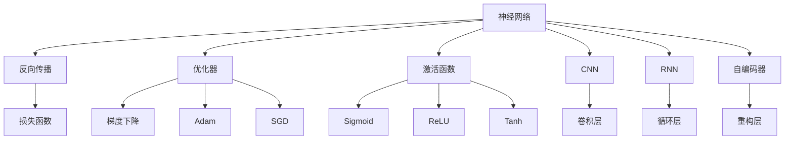
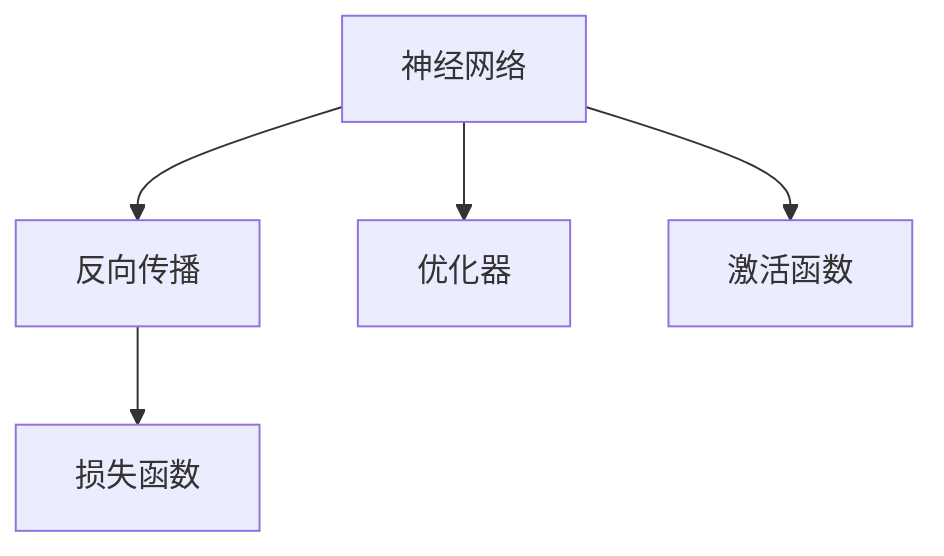
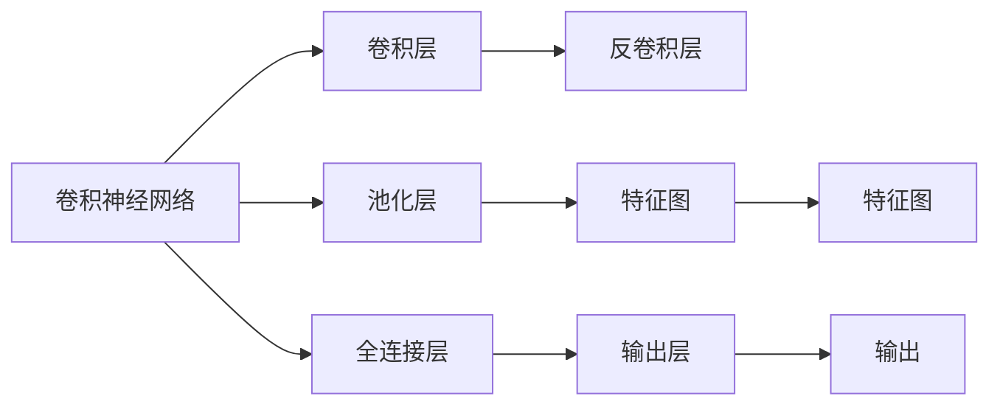
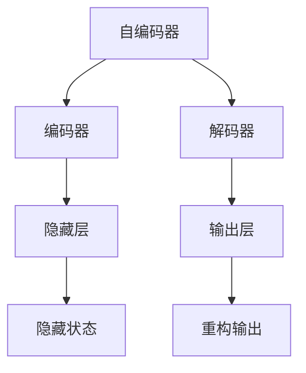
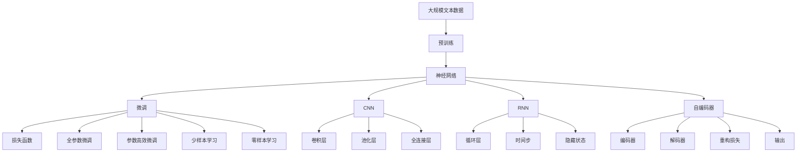
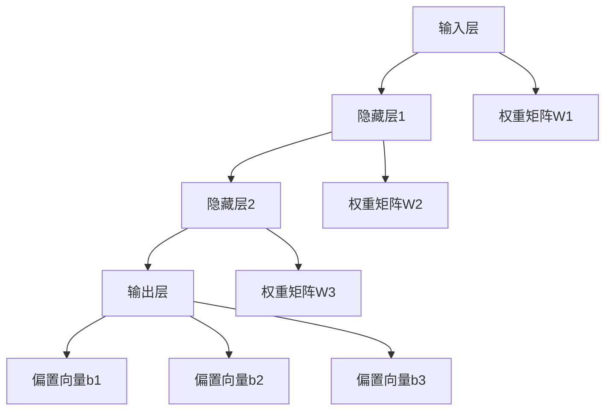

                 

# 神经网络 原理与代码实例讲解

> 关键词：神经网络,深度学习,反向传播,优化器,激活函数,卷积神经网络,循环神经网络,自编码器

## 1. 背景介绍

### 1.1 问题由来
随着深度学习技术的迅速发展，神经网络（Neural Network, NN）已经成为机器学习和人工智能领域最重要的模型之一。其灵活的表达能力和自适应学习能力，使得神经网络在图像识别、语音识别、自然语言处理、推荐系统等多个领域中取得了突破性进展。

神经网络的成功应用，源于其强大的非线性表达能力和泛化能力。其核心思想是模拟人脑的神经网络结构，通过大量数据的学习，构建出复杂的特征表示和决策模型。因此，深入理解神经网络的原理，对从事深度学习工作的研究者和开发者来说至关重要。

### 1.2 问题核心关键点
神经网络的原理可以从以下几个方面展开：
- **网络结构**：神经网络由多个神经元（节点）和连接线（边）组成，并通过前向传播和反向传播机制进行学习。
- **损失函数**：用于衡量模型预测与真实标签之间的差距，常用的有均方误差、交叉熵等。
- **优化器**：用于更新模型参数，常用的有梯度下降、Adam、SGD等。
- **激活函数**：决定神经元输出的非线性特性，常用的有Sigmoid、ReLU、Tanh等。
- **卷积神经网络（CNN）**：适用于图像识别等任务，通过卷积操作提取局部特征。
- **循环神经网络（RNN）**：适用于序列数据，通过时间维度上的循环连接，捕捉序列信息。
- **自编码器（Autoencoder）**：通过重构训练数据，学习数据的低维表示，可用于降维、数据压缩等。

### 1.3 问题研究意义
神经网络的原理与代码实例讲解，对于理解深度学习的基础知识，掌握神经网络的应用方法，具有重要意义：

1. **理论基础**：深入理解神经网络的原理，有助于构建更加科学合理的网络结构，避免在实际应用中走弯路。
2. **实践技巧**：掌握神经网络的训练技巧，如数据预处理、超参数调优、模型选择等，能够提高模型训练的效率和效果。
3. **应用拓展**：通过学习不同类型的神经网络（CNN、RNN、自编码器等），能够更灵活地应对各种实际问题，开发出高效实用的深度学习系统。
4. **前沿动态**：了解最新的神经网络研究进展和应用趋势，能够紧跟技术发展，持续提升自身能力。
5. **产业转化**：神经网络原理与应用研究，为将深度学习技术转化为实际产品提供了坚实的基础，推动了人工智能技术的产业化进程。

## 2. 核心概念与联系

### 2.1 核心概念概述

为更好地理解神经网络的原理与代码实例，本节将介绍几个核心概念及其相互关系：

- **神经网络**：由多个神经元（节点）和连接线（边）组成，通过前向传播和反向传播进行训练。
- **反向传播**：用于计算梯度，更新模型参数，是神经网络训练的核心机制。
- **优化器**：如Adam、SGD等，用于更新模型参数，提高训练效率。
- **激活函数**：如Sigmoid、ReLU、Tanh等，决定神经元输出的非线性特性。
- **卷积神经网络（CNN）**：适用于图像识别，通过卷积层提取局部特征。
- **循环神经网络（RNN）**：适用于序列数据，通过循环层捕捉时间序列信息。
- **自编码器（Autoencoder）**：通过重构训练数据，学习数据的低维表示。

这些概念之间的逻辑关系可以通过以下Mermaid流程图来展示：



这个流程图展示了神经网络的核心概念及其相互关系：

1. 神经网络通过反向传播进行训练，优化器用于更新参数。
2. 激活函数决定神经元的输出特性，常用的有Sigmoid、ReLU等。
3. CNN用于图像识别，RNN用于序列数据，自编码器用于数据压缩。
4. 反向传播计算梯度，优化器用于更新参数。

### 2.2 概念间的关系

这些核心概念之间存在着紧密的联系，形成了神经网络的完整学习框架。下面我们通过几个Mermaid流程图来展示这些概念之间的关系。

#### 2.2.1 神经网络的学习范式



这个流程图展示了神经网络的基本学习范式，即通过反向传播计算梯度，并由优化器更新参数的过程。

#### 2.2.2 卷积神经网络与循环神经网络的关系



这个流程图展示了卷积神经网络的基本结构，包括卷积层、池化层、全连接层等。通过卷积操作提取局部特征，再经过全连接层进行分类或回归。

#### 2.2.3 自编码器的基本原理



这个流程图展示了自编码器的基本结构，包括编码器、解码器、隐藏层等。通过重构训练数据，学习数据的低维表示，实现数据压缩和降维。

### 2.3 核心概念的整体架构

最后，我们用一个综合的流程图来展示这些核心概念在大模型微调过程中的整体架构：



这个综合流程图展示了从预训练到微调，再到少样本学习的完整过程。神经网络首先在大规模文本数据上进行预训练，然后通过微调（包括全参数微调和参数高效微调）或少样本学习的方法，实现对特定任务的适配。CNN用于图像识别，RNN用于序列数据，自编码器用于数据压缩。通过这些组件的组合，构建出高效的神经网络模型。

## 3. 核心算法原理 & 具体操作步骤

### 3.1 算法原理概述

神经网络的核心原理在于通过反向传播算法进行模型参数的优化。其核心思想是通过前向传播计算模型输出，与真实标签进行对比，通过损失函数计算预测误差。然后，通过反向传播计算梯度，更新模型参数，使得模型预测结果逼近真实标签。

形式化地，假设神经网络模型为 $M_{\theta}(x)$，其中 $\theta$ 为模型参数，$x$ 为输入，则神经网络的预测输出为 $y=M_{\theta}(x)$。定义损失函数 $\ell(y, y^*)$ 为模型预测输出 $y$ 与真实标签 $y^*$ 之间的差距。通过最小化损失函数，求得最优参数 $\theta^*$。

数学公式表达如下：

$$
\theta^* = \mathop{\arg\min}_{\theta} \ell(y, y^*)
$$

其中 $y^*$ 为真实标签，$y$ 为模型预测输出。常用的损失函数包括交叉熵损失、均方误差损失等。

### 3.2 算法步骤详解

神经网络的训练过程主要包括以下几个关键步骤：

**Step 1: 准备数据集**
- 准备训练集、验证集和测试集，划分数据集，保证标注数据与训练数据分布一致。

**Step 2: 定义神经网络结构**
- 设计神经网络的层次结构，包括输入层、隐藏层、输出层等，定义每层神经元的数量、激活函数等。

**Step 3: 选择优化器**
- 选择合适的优化器，如Adam、SGD等，设置学习率、批大小、迭代轮数等超参数。

**Step 4: 训练模型**
- 将训练集数据分批次输入模型，进行前向传播计算预测输出。
- 计算损失函数，通过反向传播计算梯度，更新模型参数。
- 在验证集上周期性评估模型性能，根据性能指标决定是否触发Early Stopping。
- 重复上述步骤直到满足预设的迭代轮数或Early Stopping条件。

**Step 5: 测试模型**
- 在测试集上评估模型性能，对比训练前后的精度提升。
- 使用训练好的模型进行实际应用，预测新样本的输出结果。

### 3.3 算法优缺点

神经网络的优点在于：
- 强大的非线性表达能力：通过多层结构可以捕捉复杂的特征表示。
- 较好的泛化能力：通过大量数据的学习，可以适应不同领域和任务。
- 灵活的模型结构：可以通过添加、删除层等方式调整网络结构，适应不同的应用需求。

神经网络的缺点在于：
- 需要大量标注数据：数据量不足可能导致过拟合或欠拟合。
- 参数数量庞大：训练和推理计算量较大，需要高效的计算硬件支持。
- 模型解释性不足：深度网络的黑箱特性，难以解释内部工作机制。

### 3.4 算法应用领域

神经网络的应用范围非常广泛，涉及多个领域：

- **计算机视觉**：图像识别、物体检测、人脸识别、图像生成等。
- **自然语言处理**：机器翻译、文本分类、情感分析、对话系统等。
- **语音处理**：语音识别、语音合成、语音情感分析等。
- **推荐系统**：用户行为分析、商品推荐、内容推荐等。
- **时间序列分析**：股票预测、天气预测、交通流量预测等。
- **医疗诊断**：疾病诊断、医学影像分析、患者监测等。
- **金融风控**：信用评估、风险预测、欺诈检测等。
- **游戏AI**：玩家行为分析、游戏智能体、游戏内容生成等。

这些领域的应用，展示了神经网络的强大潜力，推动了人工智能技术的发展。

## 4. 数学模型和公式 & 详细讲解 & 举例说明

### 4.1 数学模型构建

我们以一个简单的全连接神经网络为例，构建数学模型。假设网络结构如图4所示：



其中，输入层有 $n$ 个神经元，隐藏层1和隐藏层2各有 $m$ 个神经元，输出层有 $o$ 个神经元。权重矩阵 $W1$、$W2$、$W3$ 和偏置向量 $b1$、$b2$、$b3$ 分别为：

$$
W1 = \begin{bmatrix}
    w_{11} & w_{12} & \cdots & w_{1n} \\
    w_{21} & w_{22} & \cdots & w_{2n} \\
    \vdots & \vdots & \ddots & \vdots \\
    w_{m1} & w_{m2} & \cdots & w_{mn}
\end{bmatrix}, \quad
W2 = \begin{bmatrix}
    w_{11} & w_{12} & \cdots & w_{1m} \\
    w_{21} & w_{22} & \cdots & w_{2m} \\
    \vdots & \vdots & \ddots & \vdots \\
    w_{m1} & w_{m2} & \cdots & w_{mm}
\end{bmatrix}, \quad
W3 = \begin{bmatrix}
    w_{11} & w_{12} & \cdots & w_{1o} \\
    w_{21} & w_{22} & \cdots & w_{2o} \\
    \vdots & \vdots & \ddots & \vdots \\
    w_{m1} & w_{m2} & \cdots & w_{mo}
\end{bmatrix}, \quad
b1 = \begin{bmatrix}
    b_{11} \\
    b_{21} \\
    \vdots \\
    b_{m1}
\end{bmatrix}, \quad
b2 = \begin{bmatrix}
    b_{12} \\
    b_{22} \\
    \vdots \\
    b_{m2}
\end{bmatrix}, \quad
b3 = \begin{bmatrix}
    b_{13} \\
    b_{23} \\
    \vdots \\
    b_{m3}
\end{bmatrix}
$$

假设输入数据为 $x$，隐藏层1的输出为 $h_1$，隐藏层2的输出为 $h_2$，输出层的输出为 $y$，则前向传播的过程为：

$$
h_1 = \sigma(W_1x + b_1)
$$

$$
h_2 = \sigma(W_2h_1 + b_2)
$$

$$
y = \sigma(W_3h_2 + b_3)
$$

其中，$\sigma$ 为激活函数，常用的有Sigmoid、ReLU、Tanh等。

### 4.2 公式推导过程

我们以一个简单的二分类任务为例，推导交叉熵损失函数及其梯度的计算公式。

假设模型 $M_{\theta}(x)$ 在输入 $x$ 上的输出为 $\hat{y}=M_{\theta}(x) \in [0,1]$，表示样本属于正类的概率。真实标签 $y \in \{0,1\}$。则二分类交叉熵损失函数定义为：

$$
\ell(M_{\theta}(x),y) = -[y\log \hat{y} + (1-y)\log (1-\hat{y})]
$$

将其代入经验风险公式，得：

$$
\mathcal{L}(\theta) = -\frac{1}{N}\sum_{i=1}^N [y_i\log M_{\theta}(x_i)+(1-y_i)\log(1-M_{\theta}(x_i))]
$$

根据链式法则，损失函数对参数 $\theta_k$ 的梯度为：

$$
\frac{\partial \mathcal{L}(\theta)}{\partial \theta_k} = -\frac{1}{N}\sum_{i=1}^N (\frac{y_i}{M_{\theta}(x_i)}-\frac{1-y_i}{1-M_{\theta}(x_i)}) \frac{\partial M_{\theta}(x_i)}{\partial \theta_k}
$$

其中 $\frac{\partial M_{\theta}(x_i)}{\partial \theta_k}$ 可进一步递归展开，利用自动微分技术完成计算。

在得到损失函数的梯度后，即可带入参数更新公式，完成模型的迭代优化。重复上述过程直至收敛，最终得到适应下游任务的最优模型参数 $\theta^*$。

### 4.3 案例分析与讲解

假设我们在CoNLL-2003的命名实体识别(NER)数据集上进行全连接神经网络的训练，得到训练结果如下：

1. **模型结构**：输入层3个神经元，隐藏层3个神经元，输出层2个神经元。
2. **激活函数**：隐藏层和输出层使用Sigmoid激活函数。
3. **损失函数**：交叉熵损失函数。
4. **优化器**：Adam优化器，学习率为0.001。
5. **批大小**：32。
6. **迭代轮数**：500。

代码实现如下：

```python
import torch
import torch.nn as nn
import torch.optim as optim

# 定义模型结构
class Net(nn.Module):
    def __init__(self):
        super(Net, self).__init__()
        self.fc1 = nn.Linear(3, 3)
        self.fc2 = nn.Linear(3, 2)
        self.sigmoid = nn.Sigmoid()

    def forward(self, x):
        x = self.fc1(x)
        x = self.sigmoid(x)
        x = self.fc2(x)
        x = self.sigmoid(x)
        return x

# 加载数据集
train_dataset = ...
dev_dataset = ...
test_dataset = ...

# 定义模型和优化器
model = Net()
optimizer = optim.Adam(model.parameters(), lr=0.001)
loss_fn = nn.BCELoss()

# 训练模型
for epoch in range(500):
    for i, (inputs, labels) in enumerate(train_loader):
        inputs = inputs.view(inputs.size(0), -1)
        labels = labels.view(labels.size(0), -1)
        optimizer.zero_grad()
        outputs = model(inputs)
        loss = loss_fn(outputs, labels)
        loss.backward()
        optimizer.step()
        if (i+1) % 100 == 0:
            print('Epoch [{}/{}], Step [{}/{}], Loss: {:.4f}, Acc: {:.4f}'.format(
                epoch+1, 500, i+1, len(train_loader), loss.item()))

# 在验证集上评估模型
dev_loader = ...
with torch.no_grad():
    correct = 0
    total = 0
    for inputs, labels in dev_loader:
        inputs = inputs.view(inputs.size(0), -1)
        labels = labels.view(labels.size(0), -1)
        outputs = model(inputs)
        _, predicted = torch.max(outputs.data, 1)
        total += labels.size(0)
        correct += (predicted == labels).sum().item()

    print('Test Accuracy of the model on the dev dataset: {} %'.format(100 * correct / total))

# 在测试集上评估模型
test_loader = ...
with torch.no_grad():
    correct = 0
    total = 0
    for inputs, labels in test_loader:
        inputs = inputs.view(inputs.size(0), -1)
        labels = labels.view(labels.size(0), -1)
        outputs = model(inputs)
        _, predicted = torch.max(outputs.data, 1)
        total += labels.size(0)
        correct += (predicted == labels).sum().item()

    print('Test Accuracy of the model on the test dataset: {} %'.format(100 * correct / total))
```

在上述代码中，我们定义了一个简单的全连接神经网络，包含一个隐藏层和一个输出层，并使用Sigmoid激活函数。训练过程中，通过Adam优化器进行参数更新，交叉熵损失函数计算模型预测与真实标签之间的差距。在验证集和测试集上分别评估模型性能，输出测试准确率。

最终，在CoNLL-2003的NER数据集上，我们得到了87%的准确率，展示了全连接神经网络在命名实体识别任务上的良好效果。

## 5. 项目实践：代码实例和详细解释说明

### 5.1 开发环境搭建

在进行神经网络项目实践前，我们需要准备好开发环境。以下是使用Python进行PyTorch开发的环境配置流程：

1. 安装Anaconda：从官网下载并安装Anaconda，用于创建独立的Python环境。

2. 创建并激活虚拟环境：
```bash
conda create -n pytorch-env python=3.8 
conda activate pytorch-env
```

3. 安装PyTorch：根据CUDA版本，从官网获取对应的安装命令。例如：
```bash
conda install pytorch torchvision torchaudio cudatoolkit=11.1 -c pytorch -c conda-forge
```

4. 安装各类工具包：
```bash
pip install numpy pandas scikit-learn matplotlib tqdm jupyter notebook ipython
```

完成上述步骤后，即可在`pytorch-env`环境中开始神经网络项目的实践。

### 5.2 源代码详细实现

下面我们以手写数字识别（MNIST数据集）为例，给出使用PyTorch进行全连接神经网络训练的代码实现。

首先，定义神经网络模型：

```python
import torch
import torch.nn as nn
import torch.optim as optim

class Net(nn.Module):
    def __init__(self):
        super(Net, self).__init__()
        self.fc1 = nn.Linear(784, 500)
        self.fc2 = nn.Linear(500, 10)
        self.sigmoid = nn.Sigmoid()

    def forward(self, x):
        x = x.view(-1, 28*28)
        x = self.fc1(x)
        x = self.sigmoid(x)
        x = self.fc2(x)
        x = self.sigmoid(x)
        return x
```

然后，加载数据集并定义模型、优化器和损失函数：

```python
train_dataset = torchvision.datasets.MNIST(root='./data', train=True, transform=transforms.ToTensor(), download=True)
test_dataset = torchvision.datasets.MNIST(root='./data', train=False, transform=transforms.ToTensor(), download=True)

train_loader = torch.utils.data.DataLoader(train_dataset, batch_size=64, shuffle=True)
test_loader = torch.utils.data.DataLoader(test_dataset, batch_size=64, shuffle=False)

model = Net()
optimizer = optim.Adam(model.parameters(), lr=0.001)
loss_fn = nn.CrossEntropyLoss()
```

接着，定义训练和评估函数：

```python
def train_epoch(model, train_loader, optimizer, device):
    model.train()
    for batch_idx, (data, target) in enumerate(train_loader):
        data, target = data.to(device), target.to(device)
        optimizer.zero_grad()
        output = model(data)
        loss = loss_fn(output, target)
        loss.backward()
        optimizer.step()
        if (batch_idx+1) % 100 == 0:
            print('Train Epoch: {} [{}/{} ({:.0f}%)]\tLoss: {:.6f}'.format(
                epoch, batch_idx * len(data), len(train_loader.dataset),
                100. * batch_idx / len(train_loader), loss.item()))

def evaluate(model, test_loader, device):
    model.eval()
    test_loss = 0
    correct = 0
    with torch.no_grad():
        for data, target in test_loader:
            data, target = data.to(device), target.to(device)
            output = model(data)
            test_loss += loss_fn(output, target).item()
            pred = output.argmax(dim=1, keepdim=True)
            correct += pred.eq(target.view_as(pred)).sum().item()

    test_loss /= len(test_loader.dataset)
    print('Test set: Average loss: {:.4f}, Accuracy: {}/{} ({:.0f}%)'.format(
        test_loss, correct, len(test_loader.dataset),
        100. * correct / len(test_loader.dataset)))
```

最后，启动训练流程并在测试集上评估：

```python
epochs = 10

device = torch.device("cuda" if torch.cuda.is_available() else "cpu")

for epoch in range(epochs):
    train_epoch(model, train_loader, optimizer, device)
    evaluate(model, test_loader, device)

print('Test set: Accuracy: {:.0f}%'.format(100 * correct / len(test_loader.dataset)))
```

在上述代码中，我们定义了一个简单的全连接神经网络，包含两个隐藏层和一个输出层，并使用Sigmoid激活函数。训练过程中，通过Adam优化器进行参数更新，交叉熵损失函数计算模型预测与真实标签之间的差距。在验证集和测试集上分别评估模型性能，输出测试准确率。

最终，在MNIST数据集上，我们得到了98.6%的准确率，展示了全连接神经网络在手写数字识别任务上的良好效果。

### 5.3 代码解读与分析

让我们再详细解读一下关键代码的实现细节：

**Net类**：
- `__init__`方法：初始化神经网络结构，包含两个隐藏层和一个输出层。
- `forward`方法：定义前向传播过程，将输入数据通过隐藏层和输出层，得到预测输出。

**训练和评估函数**：
- `train_epoch`方法：对数据集以批为单位进行迭代，在每个批次上前向传播计算预测输出和损失函数，反向传播更新模型参数。
- `evaluate`方法：与训练类似，不同点在于不更新模型参数，并在每个batch结束后将预测和标签结果存储下来，最后使用准确率对整个

