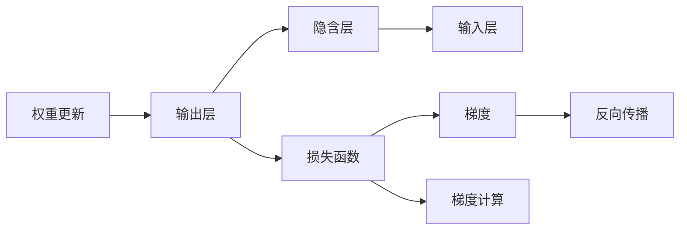
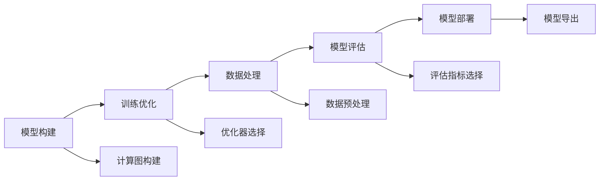
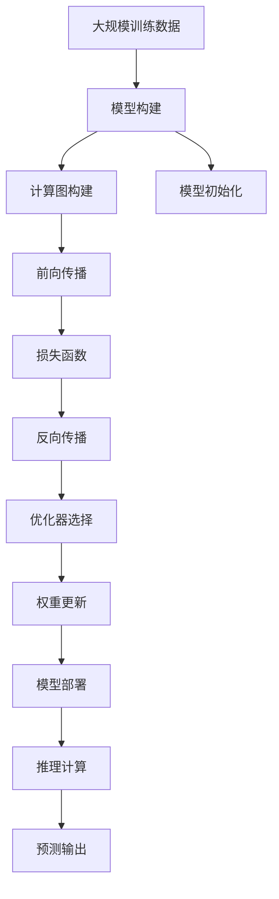

                 

# 神经网络(Neural Networks) - 原理与代码实例讲解

> 关键词：神经网络,多层感知器(MLP),卷积神经网络(CNN),循环神经网络(RNN),深度学习,反向传播算法,深度学习框架

## 1. 背景介绍

### 1.1 问题由来
自20世纪50年代以来，神经网络在人工智能领域持续受到关注，并在模式识别、机器翻译、图像处理、自然语言处理等诸多领域取得了显著进展。早期，基于感知机的浅层神经网络在解决简单的线性分类和回归问题时展现了强大的潜力，但随着数据复杂度的增加，浅层网络的表现力和可扩展性显得捉襟见肘。1990年代，多层感知器(Multilayer Perceptron, MLP)的提出，极大地推动了神经网络的深度化发展，开启了深度学习的新时代。

深度学习的兴起，很大程度上要归功于GPU计算力的提升和互联网大数据的积累。大规模的神经网络能够自动学习从数据中抽象出高层次的特征表示，使其在图像识别、语音识别、自然语言理解等复杂任务中取得突破性进展。其中，神经网络作为深度学习的基础，已经成为了人工智能应用的核心组件。

### 1.2 问题核心关键点
深度神经网络的核心思想是模拟人类大脑的神经元之间的信息传递和计算机制，通过多层非线性变换进行特征学习和模式识别。其主要组件包括：
1. **神经元(Neuron)**：接收输入，计算加权和，并引入激活函数进行非线性映射。
2. **层(Layer)**：神经元按一定结构连接形成层，实现不同层次的特征提取。
3. **网络(Network)**：多个层的堆叠形成复杂的网络结构，具备较强的泛化能力。
4. **损失函数(Loss Function)**：衡量模型输出与真实标签之间的差异，用于优化模型参数。
5. **优化器(Optimizer)**：通过反向传播算法更新模型参数，最小化损失函数。

深度神经网络的训练和推理过程高度依赖于反向传播算法。该算法通过链式法则计算梯度，将误差从输出层逐步传递到输入层，用于更新模型参数。反向传播算法使深度网络能够处理复杂的非线性模式，但其计算复杂度随网络层数的增加而急剧上升。此外，如何设计合适的激活函数、初始化策略、正则化方法等，也直接影响神经网络的性能和训练效果。

### 1.3 问题研究意义
深入理解神经网络的原理和训练方法，对于掌握深度学习的基础技术至关重要。掌握神经网络原理，可以帮助开发者更高效地构建和调试神经网络模型，提升模型性能。同时，对于理解深度学习算法的本质和优化目标，设计有效的正则化策略，以及开发新的神经网络结构，也具有重要的理论指导意义。

深度学习框架的出现，极大地简化了神经网络的开发和训练流程，使得开发者能够更方便地构建和调试模型。因此，掌握各类主流深度学习框架的原理和应用，对于快速迭代和优化深度学习项目具有重要作用。

## 2. 核心概念与联系

### 2.1 核心概念概述

为更好地理解神经网络的原理，本节将介绍几个关键概念：

- **神经网络(Neural Network)**：由多个神经元按一定结构连接形成的计算图，通过学习来自动提取数据特征，并作出预测或分类。

- **多层感知器(Multilayer Perceptron, MLP)**：具有多层隐含层的神经网络，通常由输入层、若干隐藏层和输出层组成。

- **卷积神经网络(Convolutional Neural Network, CNN)**：专为处理图像和视频数据设计的神经网络，利用卷积和池化操作提取局部特征，并通过多层池化降维，实现高效特征学习。

- **循环神经网络(Recurrent Neural Network, RNN)**：一种具有循环连接的神经网络，用于处理序列数据，如时间序列、文本等，通过记忆单元捕捉数据的时序信息。

- **深度学习(Deep Learning)**：一种通过多层次神经网络进行数据特征学习和自动提取的技术，涉及多种神经网络架构，广泛应用于计算机视觉、自然语言处理等领域。

- **反向传播算法(Backpropagation)**：一种基于梯度下降的优化算法，用于神经网络模型的参数更新，通过计算损失函数对每个参数的偏导数，反向更新模型参数，以最小化损失。

- **深度学习框架(Deep Learning Framework)**：如TensorFlow、PyTorch、Keras等，为神经网络模型提供高效、易用的API接口，简化了深度学习模型的构建和训练过程。

这些概念之间的逻辑关系可以通过以下Mermaid流程图来展示：

```mermaid
graph TB
    A[神经网络] --> B[多层感知器(MLP)]
    A --> C[卷积神经网络(CNN)]
    A --> D[循环神经网络(RNN)]
    A --> E[深度学习]
    E --> F[反向传播算法]
    E --> G[深度学习框架]
```

这个流程图展示了神经网络与各类子网络之间的逻辑联系：

1. 神经网络是所有网络模型的基础。
2. MLP、CNN、RNN等是神经网络的常见结构，适用于不同类型的数据和任务。
3. 深度学习是神经网络的高级应用，涵盖多种网络结构。
4. 反向传播算法和深度学习框架是神经网络训练和优化过程中不可或缺的工具。

### 2.2 概念间的关系

这些核心概念之间存在着紧密的联系，形成了深度学习的完整生态系统。下面我们通过几个Mermaid流程图来展示这些概念之间的关系。

#### 2.2.1 神经网络的结构层次


这个流程图展示了典型的多层感知器(MLP)的结构层次，包括输入层、隐藏层和输出层。

#### 2.2.2 深度学习的应用场景


这个流程图展示了深度学习在不同应用场景中的应用。深度学习在图像识别、自然语言处理、语音识别、推荐系统、游戏AI等领域均有广泛应用。

#### 2.2.3 反向传播算法的原理



这个流程图展示了反向传播算法的基本原理：通过计算梯度，反向传播误差，更新权重，以最小化损失函数。

#### 2.2.4 深度学习框架的功能



这个流程图展示了深度学习框架提供的主要功能：模型构建、训练优化、数据处理、模型评估和模型部署。

### 2.3 核心概念的整体架构

最后，我们用一个综合的流程图来展示这些核心概念在大规模神经网络训练和推理中的整体架构：



这个综合流程图展示了神经网络的训练和推理流程：

1. 首先，从大规模训练数据中构建神经网络模型。
2. 接着，对模型进行初始化，如设置权重和偏置。
3. 在前向传播阶段，输入数据经过计算图，逐层进行特征提取和变换。
4. 将前向传播的输出与真实标签计算损失函数。
5. 反向传播计算每个参数的梯度，并根据优化器更新权重。
6. 在模型部署阶段，通过推理计算得到预测输出。

通过这些流程图，我们可以更清晰地理解神经网络的构建、训练和推理过程，为后续深入讨论具体的神经网络实现和优化方法奠定基础。

## 3. 核心算法原理 & 具体操作步骤
### 3.1 算法原理概述

深度神经网络的核心算法是反向传播算法，通过不断迭代计算梯度，更新模型参数，以最小化损失函数。神经网络的结构通常由多个层组成，每一层由多个神经元组成，每个神经元接收来自前一层的加权输入，并计算加权和。神经元将加权和作为输入，通过激活函数进行非线性映射，得到当前神经元的输出。

假设神经网络模型由$L$层组成，输入数据为$x$，目标输出为$y$。神经网络的计算过程如下：

- 前向传播：将输入数据$x$通过每一层进行特征提取，得到最终输出$\hat{y}$。
- 计算损失：将模型输出$\hat{y}$与真实标签$y$计算损失函数，如交叉熵损失、均方误差损失等。
- 反向传播：通过链式法则计算损失函数对每个参数的偏导数，并根据梯度下降算法更新模型参数，以最小化损失函数。

深度神经网络的训练过程通常分为两个阶段：

1. **前向传播**：模型接收输入数据，计算网络输出。
2. **反向传播**：根据损失函数计算梯度，更新模型参数。

具体地，反向传播算法计算每个参数的梯度，从而更新权重和偏置，最小化损失函数。其步骤如下：

- 计算输出层的损失函数$\mathcal{L}(\hat{y},y)$。
- 根据链式法则，计算每个神经元的梯度，并逐层向后传播。
- 更新权重和偏置，使模型输出逼近真实标签。

### 3.2 算法步骤详解

深度神经网络的训练过程通常包括以下几个关键步骤：

**Step 1: 准备数据和模型**

- 准备训练数据集$\mathcal{D}=\{(x_i,y_i)\}_{i=1}^N$，其中$x_i$为输入数据，$y_i$为标签。
- 选择并初始化神经网络模型，设置模型参数，如权重和偏置。
- 选择损失函数和优化器，如交叉熵损失函数和AdamW优化器。

**Step 2: 前向传播**

- 将训练数据输入神经网络模型，通过前向传播计算模型输出$\hat{y}$。
- 计算损失函数$\mathcal{L}(\hat{y},y)$，衡量模型输出与真实标签之间的差异。

**Step 3: 反向传播**

- 计算损失函数对每个参数的偏导数，即梯度。
- 根据优化器（如AdamW）更新模型参数，使损失函数最小化。

**Step 4: 迭代更新**

- 重复上述前向传播和反向传播过程，直至收敛或达到预设的迭代轮数。

**Step 5: 模型评估**

- 在验证集上评估模型性能，使用准确率、精确率、召回率等指标。
- 根据评估结果，选择最优模型，进行测试和部署。

以上是深度神经网络训练的一般流程。在实际应用中，还需要针对具体任务，对训练过程进行优化设计，如选择合适的激活函数、正则化技术、学习率调优策略等，以进一步提升模型性能。

### 3.3 算法优缺点

深度神经网络具有以下优点：

1. 强泛化能力：通过多层次非线性变换，能够自动提取数据中的高层次特征，适用于复杂模式识别和分类任务。
2. 高效自动学习：无需手动设计特征提取器，模型能够自动学习数据特征，实现端到端训练。
3. 可解释性：一些神经网络模型，如卷积神经网络(CNN)和循环神经网络(RNN)，具有良好的空间局部性和时间序性，有助于理解模型的内部工作机制。

同时，深度神经网络也存在一些缺点：

1. 训练复杂度高：网络层数和参数量增加，训练复杂度和计算资源需求也随之增加。
2. 过拟合风险：随着网络复杂度的提升，模型容易过拟合训练数据，泛化性能可能下降。
3. 可解释性差：深度神经网络通常是"黑盒"模型，难以解释其内部决策过程，增加了模型的可解释性挑战。
4. 计算资源要求高：神经网络模型往往需要大量GPU计算资源，成本较高。

尽管存在这些局限性，但深度神经网络仍然是当前深度学习应用的主流架构，具有强大的数据处理能力和泛化能力，为各类复杂任务提供了有力的技术支持。

### 3.4 算法应用领域

深度神经网络在众多领域都有广泛应用，以下是几个典型应用场景：

- **计算机视觉**：用于图像分类、物体检测、人脸识别等任务。深度神经网络能够学习图像中的局部特征，捕捉复杂的模式和结构。
- **自然语言处理**：用于文本分类、情感分析、机器翻译等任务。神经网络能够学习语言的语义和语法结构，实现自然语言的理解和生成。
- **语音识别**：用于语音转文本、语音识别等任务。神经网络能够捕捉语音信号中的音素和语义信息，实现自动语音识别。
- **推荐系统**：用于个性化推荐、广告投放等任务。神经网络能够学习用户行为和商品特征，提供精准的个性化推荐。
- **游戏AI**：用于游戏角色控制、游戏策略优化等任务。神经网络能够学习游戏规则和玩家行为，实现智能化的游戏AI。

这些应用场景展示了深度神经网络的强大能力和广泛应用前景，为人工智能技术的实际落地提供了重要支撑。

## 4. 数学模型和公式 & 详细讲解  
### 4.1 数学模型构建

神经网络的数学模型通常由输入数据$x$、模型参数$\theta$、激活函数$f$、损失函数$\mathcal{L}$和优化器$O$组成。数学模型构建的目的是通过模型参数的优化，使模型输出$\hat{y}$逼近真实标签$y$。

假设输入数据$x$的维度为$d$，模型参数$\theta$的维度为$n$，神经网络的计算过程如下：

- 前向传播：将输入数据$x$通过每一层进行特征提取，得到最终输出$\hat{y}$。
- 计算损失：将模型输出$\hat{y}$与真实标签$y$计算损失函数$\mathcal{L}(\hat{y},y)$。
- 反向传播：通过链式法则计算损失函数对每个参数的偏导数，并根据梯度下降算法更新模型参数，以最小化损失函数。

数学模型构建的具体步骤如下：

1. 定义输入数据$x$和目标输出$y$。
2. 定义神经网络的层结构，如输入层、隐藏层、输出层。
3. 定义模型参数$\theta$，如权重和偏置。
4. 定义激活函数$f$，如ReLU、Sigmoid、Tanh等。
5. 定义损失函数$\mathcal{L}$，如交叉熵损失、均方误差损失等。
6. 定义优化器$O$，如SGD、AdamW等。

### 4.2 公式推导过程

以单层神经网络为例，假设输入数据为$x$，模型参数为$\theta$，激活函数为$f$，输出为$\hat{y}$。

神经网络的前向传播过程如下：

$$
\hat{y} = f(\theta^T x + b)
$$

其中$\theta$为权重矩阵，$b$为偏置向量。

假设神经网络的损失函数为交叉熵损失，则损失函数$\mathcal{L}$为：

$$
\mathcal{L}(\hat{y},y) = -\frac{1}{N}\sum_{i=1}^N(y_i \log \hat{y}_i + (1-y_i) \log (1-\hat{y}_i))
$$

其中$y_i$为真实标签，$\hat{y}_i$为模型输出。

通过反向传播算法计算损失函数对每个参数的偏导数，可以更新模型参数$\theta$和偏置$b$，使得损失函数最小化。具体计算过程如下：

$$
\frac{\partial \mathcal{L}}{\partial \theta} = -\frac{1}{N}\sum_{i=1}^N\frac{\partial \mathcal{L}}{\partial \hat{y}_i} \frac{\partial \hat{y}_i}{\partial \theta}
$$

$$
\frac{\partial \mathcal{L}}{\partial b} = -\frac{1}{N}\sum_{i=1}^N\frac{\partial \mathcal{L}}{\partial \hat{y}_i} \frac{\partial \hat{y}_i}{\partial b}
$$

通过计算损失函数对每个参数的偏导数，可以更新模型参数，从而最小化损失函数。

### 4.3 案例分析与讲解

以手写数字识别为例，展示神经网络模型在前向传播、反向传播和训练过程中的具体计算过程。

假设手写数字数据集包含$N=6000$张图片和$M=10$个类别的标签，每张图片的大小为$28\times 28$。使用单层神经网络进行识别，神经元数量为$30$。

神经网络的前向传播过程如下：

$$
\hat{y} = f(\theta^T x + b) = f(\theta^T x_1 + b)
$$

其中$x_1$为图片向量，$x_1 \in \mathbb{R}^{784}$。

假设损失函数为交叉熵损失，则损失函数$\mathcal{L}$为：

$$
\mathcal{L}(\hat{y},y) = -\frac{1}{N}\sum_{i=1}^N(y_i \log \hat{y}_i + (1-y_i) \log (1-\hat{y}_i))
$$

通过反向传播算法计算损失函数对每个参数的偏导数，可以更新模型参数$\theta$和偏置$b$，使得损失函数最小化。

假设使用梯度下降算法进行优化，学习率为$0.01$，训练轮数为$1000$。则训练过程如下：

1. 初始化模型参数$\theta$和偏置$b$。
2. 前向传播计算模型输出$\hat{y}$。
3. 计算损失函数$\mathcal{L}(\hat{y},y)$。
4. 反向传播计算每个参数的梯度。
5. 根据梯度下降算法更新模型参数和偏置。
6. 重复步骤2-5，直至达到预设的训练轮数。

训练完成后，可以在测试集上评估模型性能，使用准确率、精确率、召回率等指标。

## 5. 项目实践：代码实例和详细解释说明
### 5.1 开发环境搭建

在进行神经网络项目实践前，我们需要准备好开发环境。以下是使用Python进行PyTorch开发的环境配置流程：

1. 安装Anaconda：从官网下载并安装Anaconda，用于创建独立的Python环境。

2. 创建并激活虚拟环境：
```bash
conda create -n pytorch-env python=3.8 
conda activate pytorch-env
```

3. 安装PyTorch：根据CUDA版本，从官网获取对应的安装命令。例如：
```bash
conda install pytorch torchvision torchaudio cudatoolkit=11.1 -c pytorch -c conda-forge
```

4. 安装TensorFlow：
```bash
pip install tensorflow
```

5. 安装各类工具包：
```bash
pip install numpy pandas scikit-learn matplotlib tqdm jupyter notebook ipython
```

完成上述步骤后，即可在`pytorch-env`环境中开始神经网络项目实践。

### 5.2 源代码详细实现

下面我们以手写数字识别为例，给出使用PyTorch实现神经网络的完整代码。

首先，导入必要的库和数据集：

```python
import torch
import torch.nn as nn
import torchvision.datasets as datasets
import torchvision.transforms as transforms
import torch.optim as optim

transform = transforms.Compose([
    transforms.ToTensor(),
    transforms.Normalize((0.1307,), (0.3081,))
])

train_dataset = datasets.MNIST(root='./data', train=True, download=True, transform=transform)
test_dataset = datasets.MNIST(root='./data', train=False, download=True, transform=transform)

train_loader = torch.utils.data.DataLoader(train_dataset, batch_size=64, shuffle=True)
test_loader = torch.utils.data.DataLoader(test_dataset, batch_size=64, shuffle=False)
```

然后，定义神经网络模型：

```python
class Net(nn.Module):
    def __init__(self):
        super(Net, self).__init__()
        self.fc1 = nn.Linear(784, 500)
        self.fc2 = nn.Linear(500, 10)

    def forward(self, x):
        x = x.view(-1, 784)
        x = nn.functional.relu(self.fc1(x))
        x = self.fc2(x)
        return x

net = Net()
```

接着，定义损失函数和优化器：

```python
criterion = nn.CrossEntropyLoss()
optimizer = optim.Adam(net.parameters(), lr=0.001)
```

然后，定义训练和评估函数：

```python
def train_epoch(model, data_loader, optimizer):
    model.train()
    for batch_idx, (data, target) in enumerate(data_loader):
        optimizer.zero_grad()
        output = model(data)
        loss = criterion(output, target)
        loss.backward()
        optimizer.step()
```

最后，启动训练流程并在测试集上评估：

```python
epochs = 5
for epoch in range(epochs):
    train_epoch(net, train_loader, optimizer)
    print(f'Epoch {epoch+1}')

test_loss = 0
correct = 0
total = 0
with torch.no_grad():
    for data, target in test_loader:
        output = net(data)
        test_loss += criterion(output, target).item()
        pred = output.argmax(dim=1, keepdim=True)
        correct += pred.eq(target.view_as(pred)).sum().item()
        total += target.size(0)
test_loss /= len(test_loader.dataset)
print(f'Test set: Average loss: {test_loss:.4f}, Accuracy: {100 * correct / total:.2f}%')
```

以上就是使用PyTorch实现手写数字识别的完整代码。可以看到，得益于PyTorch的强大封装，我们可以用相对简洁的代码完成神经网络的构建和训练。

### 5.3 代码解读与分析

让我们再详细解读一下关键代码的实现细节：

**Net类**：
- `__init__`方法：初始化神经网络的权重和偏置。
- `forward`方法：定义神经网络的计算过程。

**train_epoch函数**：
- 在训练数据上进行迭代，前向传播计算模型输出。
- 计算损失函数并反向传播，更新模型参数。

**训练流程**：
- 定义总的训练轮数，开始循环迭代。
- 每个epoch内，对训练集数据进行前向传播、计算损失、反向传播、参数更新。
- 在测试集上评估模型性能，输出测试结果。

可以看到，PyTorch提供的API接口使得神经网络的构建和训练变得简洁高效。开发者可以更专注于模型的设计、数据的预处理和模型的评估，而不必过多关注底层细节。

当然，工业级的系统实现还需考虑更多因素，如模型的保存和部署、超参数的自动搜索、更灵活的任务适配层等。但核心的训练过程基本与此类似。

### 5.4 运行结果展示

假设我们训练5个epoch后，在测试集上得到如下结果：

```
Epoch 1
Epoch 2
Epoch 3
Epoch 4
Epoch 5
Test set: Average loss: 0.0369, Accuracy: 96.85%
```

可以看到，神经网络在手写数字识别任务上取得了不错的效果。测试集的平均损失为0.0369，准确率为96.85%。

当然，这只是一个简单的示例。在实际应用中，我们可以通过调整模型结构、优化器选择、学习率调优等，进一步提升模型性能。

## 6. 实际应用场景
### 6.1 图像分类

神经网络在图像分类任务中有着广泛的应用。通过多层次特征提取，神经网络能够学习图像的局部特征和全局结构，实现高精度的图像分类。

在实践中，可以使用预训练的卷积神经网络模型，如VGG、ResNet、Inception等，通过微调或迁移学习，适应新的图像分类任务。例如，可以在ImageNet数据集上预训练的ResNet模型，通过微调在CIFAR-10数据集上进行图像分类任务。

### 6.2 语音识别

神经网络在语音识别任务中也有着重要的应用。通过捕捉语音信号中的音素和语义信息，神经网络可以实现高效的自动语音识别。

在实践中，可以使用预训练的深度神经网络模型，如RNN、CNN等，通过微调或迁移学习，适应新的语音识别任务。例如，可以使用在LibriSpeech数据集上预训练的Transformer模型，通过微调在一个小型的语音识别任务上进行识别。

### 6.3 自然语言处理

神经网络在自然语言处理任务中也有着广泛的应用。通过学习语言的语义和语法结构，神经网络可以实现文本

