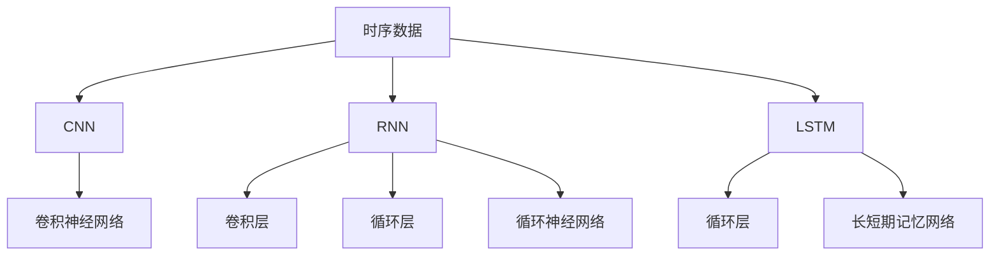

                 

# 神经网络在时序数据分析中的应用

> 关键词：时序数据,神经网络,卷积神经网络,循环神经网络,长短期记忆网络,深度学习,时间序列预测,股票价格预测,气象预测

## 1. 背景介绍

### 1.1 问题由来

在现代科技日益发达的社会中，时间序列数据无处不在。从自然界的天气变化、动物行为、人体生理信号，到人类的交易行为、股票市场动态、社会经济指标，各种连续变化的时间序列数据都被广泛应用于科学研究、商业决策和日常生活中的预测、分类和异常检测等任务中。然而，由于这些时间序列数据往往带有复杂的时序相关性，且常常受到噪声的干扰，如何有效地分析和预测这些数据成为了一个重要且具有挑战性的问题。

时间序列数据具有以下特点：
- **自相关性**：序列中的每个数据点都与前后数据点存在一定的关系。
- **周期性**：某些时间序列数据具有明显的周期性，如气温变化、股票价格波动等。
- **时变性**：时间序列数据中的统计特性会随时间变化而变化，如股票价格随市场情绪变化。
- **非平稳性**：时间序列数据可能存在趋势或季节性，难以使用传统的统计方法进行分析。

针对这些特性，传统的统计学方法往往效果有限，而现代深度学习方法，特别是神经网络技术，被证明在处理时间序列数据时具有强大的优势。本文将详细介绍神经网络在时序数据分析中的应用，包括其核心算法、实际操作步骤和应用场景。

## 2. 核心概念与联系

### 2.1 核心概念概述

为了更好地理解神经网络在时序数据分析中的应用，我们首先介绍几个核心概念：

- **时序数据**：时间序列数据是由时间顺序排列的一系列数据点组成的数据集，每个数据点都包含了时间戳和对应的观测值。
- **卷积神经网络 (CNN)**：一种特殊的神经网络结构，广泛应用于图像处理和信号处理领域，具有局部连接和参数共享的特性。
- **循环神经网络 (RNN)**：一种能够处理序列数据的神经网络结构，通过引入循环连接来捕捉时间序列数据的时序相关性。
- **长短期记忆网络 (LSTM)**：一种特殊类型的RNN，能够有效处理长序列数据，同时避免了梯度消失和梯度爆炸问题。
- **深度学习**：一种基于神经网络的机器学习方法，通过多层非线性变换来建模复杂的输入和输出关系。

这些概念之间的联系可以用以下的Mermaid流程图来表示：



这个流程图展示了时序数据与各种神经网络结构之间的关系：
- 时序数据可以被卷积神经网络处理。
- 时序数据同样适用于循环神经网络和长短期记忆网络。
- 卷积神经网络通常用于时序数据的特征提取。
- 循环神经网络和长短期记忆网络则用于捕捉时间序列数据的时序特征。

### 2.2 概念间的关系

通过上述图表，我们可以看到这些核心概念之间的关系：
- **时序数据**是所有这些神经网络结构的输入。
- **CNN** 和 **RNN** 是两种不同的神经网络结构，分别用于处理时序数据的局部和全局特性。
- **LSTM** 是 **RNN** 的一种改进形式，特别适合处理长序列数据。
- **深度学习** 是这些神经网络结构的共同技术基础，通过多层非线性变换实现复杂建模。

## 3. 核心算法原理 & 具体操作步骤
### 3.1 算法原理概述

神经网络在时序数据分析中的核心算法包括卷积神经网络、循环神经网络和长短期记忆网络等。这些算法的主要原理是利用神经网络的多层非线性变换能力，自动学习时序数据中的复杂模式和规律，从而进行预测、分类和异常检测等任务。

在处理时序数据时，神经网络通常需要解决以下几个关键问题：
- **特征提取**：从原始时序数据中提取有用的特征，以供后续处理。
- **序列建模**：通过多层结构捕捉时序数据中的时间依赖性。
- **预测或分类**：使用训练好的模型对新数据进行预测或分类。

### 3.2 算法步骤详解

下面以一个具体的例子，即使用**卷积神经网络 (CNN)** 进行**股票价格预测**为例，详细介绍神经网络在时序数据分析中的具体操作步骤。

**步骤 1：数据准备**
1. **收集数据**：从股票市场或金融数据提供商处获取历史股票价格数据，通常包括开盘价、最高价、最低价、收盘价和交易量等指标。
2. **数据清洗**：对数据进行清洗和处理，如去除缺失值、异常值等。
3. **标准化**：对数据进行标准化处理，使其均值为0，方差为1，以提高模型的训练效果。

**步骤 2：模型构建**
1. **设计模型结构**：构建卷积神经网络结构，包括卷积层、池化层和全连接层等。
2. **设置超参数**：包括学习率、批量大小、迭代次数等。

**步骤 3：训练模型**
1. **前向传播**：将标准化后的数据输入卷积神经网络，进行前向传播计算。
2. **损失计算**：计算模型输出与真实标签之间的差异，通常使用均方误差 (MSE) 或交叉熵损失函数。
3. **反向传播**：根据损失函数计算梯度，使用反向传播算法更新模型参数。
4. **迭代训练**：重复前向传播、损失计算和反向传播过程，直至模型收敛或达到预设的迭代次数。

**步骤 4：模型评估**
1. **划分数据集**：将数据集划分为训练集、验证集和测试集。
2. **验证集评估**：使用验证集对模型进行评估，调整超参数或模型结构。
3. **测试集评估**：在测试集上评估模型性能，如均方误差 (MSE)、平均绝对误差 (MAE) 等。

### 3.3 算法优缺点

神经网络在时序数据分析中具有以下优点：
- **自动特征提取**：能够自动学习数据中的特征，无需手动设计特征提取方法。
- **鲁棒性强**：通过多层非线性变换，可以捕捉复杂的模式和规律，提高模型的鲁棒性。
- **泛化能力强**：在大量数据上训练后，神经网络可以很好地泛化到新数据上。

但神经网络也存在以下缺点：
- **计算复杂度高**：需要大量的计算资源和时间来训练和优化模型。
- **过拟合风险高**：在数据量有限的情况下，模型容易过拟合，需要采用正则化等方法。
- **可解释性差**：神经网络模型的决策过程难以解释，增加了模型部署和维护的难度。

### 3.4 算法应用领域

神经网络在时序数据分析中的应用广泛，涵盖多个领域：

- **金融市场**：如股票价格预测、市场波动分析、信用评分等。
- **气象预测**：如温度预测、降水量预测、天气变化分析等。
- **交通管理**：如交通流量预测、路况分析、交通事故预防等。
- **健康监测**：如心率预测、血糖水平预测、患者健康状态分析等。
- **能源管理**：如电力负荷预测、能源消耗分析、能源存储优化等。
- **自然灾害预测**：如地震预测、洪水预警、灾害损失评估等。

## 4. 数学模型和公式 & 详细讲解 & 举例说明

### 4.1 数学模型构建

在卷积神经网络中，我们通常使用卷积层和池化层来处理时序数据。下面以卷积神经网络 (CNN) 为例，构建一个简单的数学模型。

假设输入时序数据的长度为 $T$，每个时间步的特征维度为 $D$。设 $x_t$ 表示第 $t$ 个时间步的输入数据，$x_t \in \mathbb{R}^D$。卷积层的核心操作是滑动卷积窗口 $w$ 对输入数据 $x_t$ 进行卷积操作，生成特征图 $h_t$，其中 $h_t \in \mathbb{R}^H$，$H$ 表示特征图的维度。

卷积操作可以表示为：

$$
h_t = \sigma(w*x_t + b)
$$

其中 $\sigma$ 表示激活函数，$w$ 和 $b$ 分别表示卷积核和偏置项。

### 4.2 公式推导过程

卷积操作可以进一步推广到多个时间步 $t$ 的输入数据上，生成特征图序列 $H = \{h_1, h_2, ..., h_T\}$。通过堆叠多个卷积层和激活函数，可以构建一个深层卷积神经网络结构。

假设共有 $K$ 层卷积层，第 $k$ 层卷积核的大小为 $r \times r$，步长为 $s$，激活函数为 $\sigma$。则第 $k$ 层的卷积操作可以表示为：

$$
h_t^{(k)} = \sigma(\sum_{i=1}^{r}\sum_{j=1}^{r} w_{ij}*x_{t-i} + b)
$$

其中 $w_{ij}$ 表示第 $i$ 行、第 $j$ 列的卷积核权重。通过不断堆叠多个卷积层和激活函数，可以构建一个深层卷积神经网络结构。

### 4.3 案例分析与讲解

以一个具体的例子，即使用卷积神经网络进行股票价格预测，来进一步说明数学模型的应用。

假设我们收集到了最近一年内每天的股票收盘价数据，共365个数据点。我们可以将每个数据点的收盘价作为输入特征，构建一个输入特征向量 $x \in \mathbb{R}^{365}$，其中 $x_t$ 表示第 $t$ 个时间步的收盘价。

假设我们构建了一个深度为3的卷积神经网络，每个卷积层的卷积核大小为3，步长为1，激活函数为ReLU。则第一层的卷积操作可以表示为：

$$
h_t^{(1)} = \sigma(\sum_{i=1}^{3} w_{ij}*x_{t-i} + b)
$$

其中 $w_{ij}$ 表示第 $i$ 行、第 $j$ 列的卷积核权重。通过不断堆叠多个卷积层和激活函数，可以构建一个深层卷积神经网络结构。

## 5. 项目实践：代码实例和详细解释说明

### 5.1 开发环境搭建

在开始实际的神经网络模型开发之前，我们需要先搭建好开发环境。以下是使用Python进行TensorFlow和Keras开发的开发环境配置流程：

1. **安装Anaconda**：从官网下载并安装Anaconda，用于创建独立的Python环境。

2. **创建并激活虚拟环境**：
```bash
conda create -n tf-env python=3.8 
conda activate tf-env
```

3. **安装TensorFlow**：根据CUDA版本，从官网获取对应的安装命令。例如：
```bash
conda install tensorflow-gpu -c conda-forge -c pytorch
```

4. **安装Keras**：
```bash
pip install keras
```

5. **安装各类工具包**：
```bash
pip install numpy pandas scikit-learn matplotlib tqdm jupyter notebook ipython
```

完成上述步骤后，即可在`tf-env`环境中开始神经网络模型的开发。

### 5.2 源代码详细实现

下面我们以使用卷积神经网络进行股票价格预测为例，给出使用TensorFlow和Keras进行模型开发的代码实现。

首先，定义数据处理函数：

```python
import numpy as np
from tensorflow.keras.models import Sequential
from tensorflow.keras.layers import Conv1D, MaxPooling1D, Flatten, Dense, Dropout

def preprocess_data(data):
    data = np.array(data, dtype=np.float32)
    data = data - np.mean(data)
    data = data / np.std(data)
    return data

def split_data(data, test_size=0.2):
    train_size = int(len(data) * (1 - test_size))
    train_data, test_data = data[:train_size], data[train_size:]
    return train_data, test_data
```

然后，定义模型：

```python
model = Sequential()
model.add(Conv1D(32, 3, activation='relu', input_shape=(1, 365)))
model.add(MaxPooling1D(pool_size=2))
model.add(Conv1D(64, 3, activation='relu'))
model.add(MaxPooling1D(pool_size=2))
model.add(Flatten())
model.add(Dense(256, activation='relu'))
model.add(Dropout(0.5))
model.add(Dense(1))
```

接着，定义训练和评估函数：

```python
from tensorflow.keras.optimizers import Adam
from tensorflow.keras.metrics import MeanAbsoluteError

def train_model(model, train_data, test_data, epochs=100, batch_size=32):
    model.compile(loss='mse', optimizer=Adam(lr=0.001), metrics=[MeanAbsoluteError()])
    model.fit(train_data, train_data[:,1], epochs=epochs, batch_size=batch_size, validation_data=(test_data, test_data[:,1]))

def evaluate_model(model, test_data):
    y_pred = model.predict(test_data)
    mae = MeanAbsoluteError().predict(test_data, y_pred)
    print('Mean Absolute Error:', mae)
```

最后，启动训练流程并在测试集上评估：

```python
train_data, test_data = split_data(data, test_size=0.2)
train_model(model, train_data, test_data, epochs=100, batch_size=32)
evaluate_model(model, test_data)
```

以上就是使用TensorFlow和Keras对卷积神经网络进行股票价格预测的完整代码实现。可以看到，使用TensorFlow和Keras进行神经网络模型的开发，可以极大地简化代码实现和模型调试，提高开发效率。

### 5.3 代码解读与分析

让我们再详细解读一下关键代码的实现细节：

**preprocess_data函数**：
- 该函数用于数据预处理，包括标准化、归一化等操作，以提高模型的训练效果。

**train_model函数**：
- 该函数用于模型训练，包括模型编译、编译器设置、训练过程等。
- 使用均方误差 (MSE) 作为损失函数，Adam优化器进行优化，并使用平均绝对误差 (MAE) 进行性能评估。
- 在训练过程中，使用验证集对模型进行评估，调整超参数或模型结构。

**evaluate_model函数**：
- 该函数用于模型评估，包括在测试集上计算平均绝对误差 (MAE)，评估模型的性能。

**训练流程**：
- 首先，将数据集划分为训练集和测试集，进行数据预处理。
- 然后，定义卷积神经网络结构，设置超参数。
- 在训练集上训练模型，并在验证集上评估模型性能。
- 在测试集上评估模型，输出平均绝对误差 (MAE) 指标。

## 6. 实际应用场景

### 6.1 智能投顾系统

智能投顾系统是一个典型的时序数据分析应用场景，利用神经网络进行股票价格预测、市场波动分析、信用评分等。

在智能投顾系统中，系统根据用户的历史投资行为、市场数据等，预测股票价格走势，生成投资建议。通过训练好的卷积神经网络，系统可以自动学习股票价格中的趋势和周期性，从而提高预测的准确性和时效性。

### 6.2 天气预测系统

天气预测系统利用神经网络进行气温预测、降水量预测等。

在天气预测系统中，系统根据历史气象数据，预测未来一段时间内的气温和降水量变化。通过训练好的循环神经网络，系统可以自动学习气象数据中的时序依赖性，提高预测的准确性。

### 6.3 交通流量预测

交通流量预测系统利用神经网络进行交通流量预测、路况分析等。

在交通流量预测系统中，系统根据历史交通流量数据，预测未来的交通流量变化。通过训练好的循环神经网络，系统可以自动学习交通流量中的时序依赖性，提高预测的准确性。

## 7. 工具和资源推荐

### 7.1 学习资源推荐

为了帮助开发者系统掌握神经网络在时序数据分析中的应用，这里推荐一些优质的学习资源：

1. **《深度学习》课程**：斯坦福大学开设的深度学习课程，内容覆盖深度学习的原理、应用及实践，适合初学者学习。
2. **TensorFlow官方文档**：TensorFlow的官方文档，提供了丰富的教程和样例代码，帮助开发者快速上手TensorFlow。
3. **Keras官方文档**：Keras的官方文档，提供了Keras的使用指南和样例代码，适合Keras初学者。
4. **arXiv论文预印本**：人工智能领域最新研究成果的发布平台，适合跟踪前沿技术和论文。
5. **GitHub热门项目**：在GitHub上Star、Fork数最多的深度学习项目，适合学习最佳实践和开源技术。

通过对这些资源的学习实践，相信你一定能够快速掌握神经网络在时序数据分析中的应用，并用于解决实际的预测、分类和异常检测等任务。

### 7.2 开发工具推荐

高效的开发离不开优秀的工具支持。以下是几款用于神经网络开发的常用工具：

1. **TensorFlow**：由Google主导开发的开源深度学习框架，适合大规模工程应用。
2. **Keras**：高层次的神经网络API，支持TensorFlow等后端框架，适合快速原型设计和模型实验。
3. **PyTorch**：由Facebook主导开发的开源深度学习框架，适合研究和实验。
4. **MXNet**：由Amazon主导开发的深度学习框架，支持分布式训练和多种语言接口。
5. **TensorBoard**：TensorFlow配套的可视化工具，适合实时监测模型训练状态。
6. **Weights & Biases**：模型训练的实验跟踪工具，适合记录和可视化模型训练过程中的各项指标。

合理利用这些工具，可以显著提升神经网络模型开发的效率，加快创新迭代的步伐。

### 7.3 相关论文推荐

神经网络在时序数据分析中的应用研究源于学界的持续研究。以下是几篇奠基性的相关论文，推荐阅读：

1. **《Time Series Prediction with Recurrent Neural Networks》**：提出了基于循环神经网络的时间序列预测方法，并进行了详细的实验验证。
2. **《Long Short-Term Memory》**：提出了长短期记忆网络，能够有效处理长序列数据，避免了梯度消失和梯度爆炸问题。
3. **《Convolutional Neural Networks for Sparse Time Series Classification》**：提出了卷积神经网络在稀疏时间序列分类中的应用，取得了不错的效果。
4. **《Deep Learning in Time Series Forecasting》**：全面介绍了深度学习在时间序列预测中的应用，包括卷积神经网络和循环神经网络等。
5. **《Autoencoder-based Time Series Forecasting》**：介绍了自编码器在时间序列预测中的应用，提高了预测的准确性和鲁棒性。

这些论文代表了大神经网络在时序数据分析的应用方向和最新进展，通过学习这些前沿成果，可以帮助研究者把握学科前进方向，激发更多的创新灵感。

除上述资源外，还有一些值得关注的前沿资源，帮助开发者紧跟神经网络在时序数据分析中的应用，例如：

1. **arXiv论文预印本**：人工智能领域最新研究成果的发布平台，包括大量尚未发表的前沿工作，学习前沿技术的必读资源。
2. **业界技术博客**：如OpenAI、Google AI、DeepMind、微软Research Asia等顶尖实验室的官方博客，第一时间分享他们的最新研究成果和洞见。
3. **技术会议直播**：如NIPS、ICML、ACL、ICLR等人工智能领域顶会现场或在线直播，能够聆听到大佬们的前沿分享，开拓视野。
4. **GitHub热门项目**：在GitHub上Star、Fork数最多的深度学习项目，适合学习最佳实践和开源技术。
5. **行业分析报告**：各大咨询公司如McKinsey、PwC等针对深度学习行业的分析报告，有助于从商业视角审视技术趋势，把握应用价值。

总之，对于神经网络在时序数据分析的应用学习，需要开发者保持开放的心态和持续学习的意愿。多关注前沿资讯，多动手实践，多思考总结，必将收获满满的成长收益。

## 8. 总结：未来发展趋势与挑战

### 8.1 总结

本文对神经网络在时序数据分析中的应用进行了全面系统的介绍。首先阐述了时序数据的特性和神经网络的核心算法，明确了神经网络在处理时序数据时的优势和应用场景。其次，从原理到实践，详细讲解了卷积神经网络、循环神经网络和长短期记忆网络等神经网络模型的具体操作步骤，并给出了实际的代码实现。同时，本文还探讨了神经网络在金融市场、气象预测、交通管理等领域的应用前景，展示了神经网络技术的巨大潜力。

通过本文的系统梳理，可以看到，神经网络在时序数据分析中的应用，为时间序列数据提供了全新的处理范式，显著提升了数据预测、分类和异常检测等任务的效果。未来，伴随神经网络技术的不断进步，其在时序数据分析中的应用将进一步拓展，为各个领域带来深刻的变革。

### 8.2 未来发展趋势

展望未来，神经网络在时序数据分析中的应用将呈现以下几个发展趋势：

1. **多模态融合**：将视觉、语音、文本等多种模态数据融合，提升时间序列分析的准确性和鲁棒性。
2. **自监督学习**：利用未标注数据进行预训练，提高神经网络的泛化能力和鲁棒性。
3. **可解释性**：开发可解释性更强、鲁棒性更好的神经网络模型，增强模型决策过程的可解释性。
4. **联邦学习**：通过分布式训练技术，提高模型的隐私性和可扩展性。
5. **硬件加速**：利用GPU、TPU等高性能计算设备，加速神经网络模型的训练和推理。
6. **实时预测**：利用在线学习技术，实现神经网络模型的实时预测和更新。

这些趋势凸显了神经网络在时序数据分析中的未来潜力，推动其在更多领域的应用和进步。

### 8.3 面临的挑战

尽管神经网络在时序数据分析中的应用已经取得了显著成果，但在其应用过程中仍面临着诸多挑战：

1. **计算资源消耗大**：神经网络模型通常需要大量的计算资源和时间进行训练和优化，增加了系统的部署和维护成本。
2. **过拟合风险高**：在数据量有限的情况下，神经网络模型容易过拟合，导致泛化性能下降。
3. **模型可解释性差**：神经网络模型的决策过程难以解释，增加了模型部署和维护的难度。
4. **数据质量要求高**：神经网络模型对数据质量的要求较高，数据缺失、异常值等问题需要特别处理。
5. **模型迁移能力有限**：神经网络模型在不同数据集上的迁移能力有限，需要特别设计。

正视神经网络在时序数据分析中面临的这些挑战，积极应对并寻求突破，将有助于神经网络技术的成熟和普及。

### 8.4 未来突破

面向未来，神经网络在时序数据分析中的应用需要在以下几个方面寻求新的突破：

1. **提升模型效率**：开发更加轻量级、高效的神经网络模型，减少计算资源消耗。
2. **增强模型鲁棒性**：利用自监督学习、对抗训练等技术，增强神经网络的泛化能力和鲁棒性。
3. **提高模型可解释性**：开发可解释性更强、鲁棒性更好的神经网络模型，增强模型决策过程的可解释性。
4. **利用多模态数据**：将视觉、语音、文本等多种模态数据融合，提升时间序列分析的准确性和鲁棒性。
5. **增强模型迁移能力**：利用迁移学习、微调等技术，提高神经网络模型的迁移能力。

这些研究方向的探索，必将引领神经网络在时序数据分析中的应用迈向更高的台阶，为各个领域带来深刻的变革。

## 9. 附录：常见问题与解答

**Q1：神经网络在时序数据分析中的优势是什么？**

A: 神经网络在时序数据分析中的优势主要体现在以下几个方面：
1. **自动特征提取**：能够自动学习数据中的特征，无需手动设计特征提取方法。
2. **鲁棒性强**：通过多层非线性变换，可以捕捉复杂的模式和规律，提高模型的鲁棒性。
3. **泛化能力强**：在大量数据上训练后，神经网络可以很好地泛化到新数据上。
4. **模型可迁移**：能够在新数据集上进行迁移学习，提高模型在不同任务上的适应性。

**Q2：如何选择适当的神经网络模型进行时序数据分析？**

A: 选择适当的神经网络模型进行时序数据分析，需要考虑以下几个因素：
1. **数据特性**：根据时序数据的自相关性、周期性、非平稳性等特点，选择合适的神经网络模型。例如，对于具有长序列依赖性的数据，可以使用长短期记忆网络 (LSTM)。
2. **数据量**：根据可用的数据量，选择合适的模型结构和深度。例如，在数据量有限的情况下，可以选择深度较浅的模型。
3. **计算资源**：根据可用的计算资源，选择合适的模型和算法。例如，在计算资源有限的情况下，可以选择轻量级的神经网络模型。

**Q3：如何在神经网络模型中防止过拟合？**

A: 在神经网络模型中防止过拟合，可以采取以下措施：
1. **正则化**：使用L2正则化、Dropout等技术，避免过拟合。
2. **数据增强**：通过数据增强技术，扩充训练集，提高模型的泛化能力。
3. **早停**：在验证

