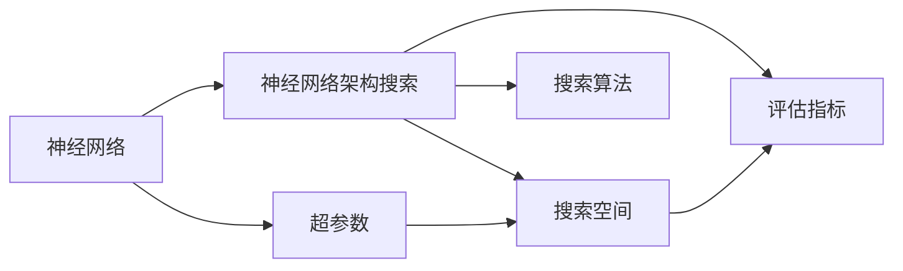
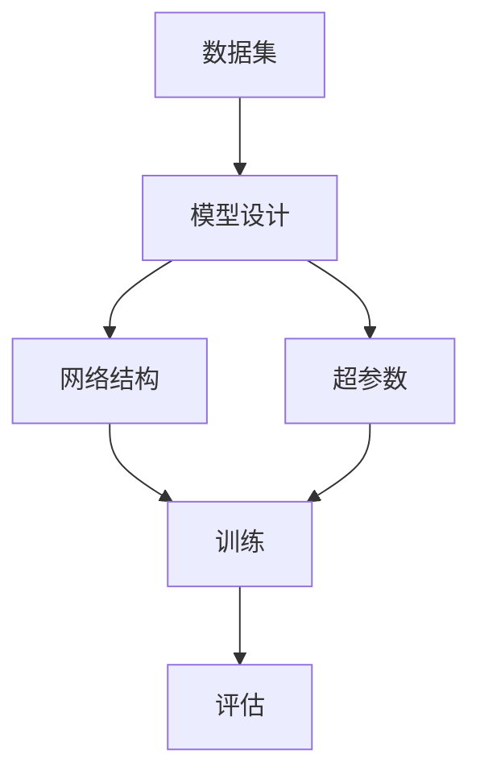
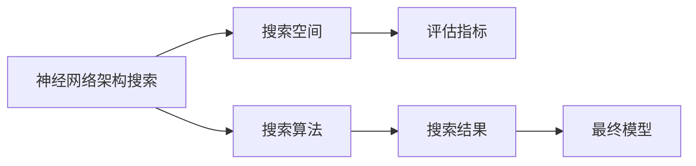
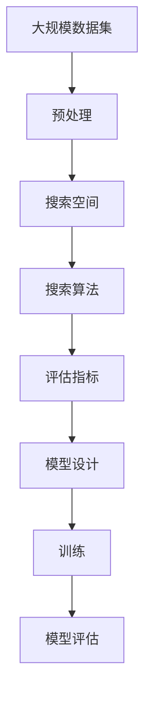

                 

## 1. 背景介绍

神经网络(Neural Network, NN)在近年来取得了飞速发展，被广泛应用于图像识别、自然语言处理、语音识别、推荐系统等诸多领域，并取得了卓越的性能。然而，构建一个高效的神经网络架构并非易事。传统的神经网络设计往往需要大量经验，依赖于设计者的人工直觉，但实际效果并不理想。神经网络架构搜索(Neural Architecture Search, NAS)作为人工智能领域的一个重要分支，通过自动搜索最优的网络结构，显著降低了模型设计的人力成本，提升了模型性能。

在神经网络设计中，一个典型的问题是如何设计一个网络结构，使其在给定任务和数据集上达到最优性能。传统的神经网络设计方法依赖于设计者的经验和直觉，往往需要进行大量的尝试和调整。而神经网络架构搜索利用自动化的算法和工具，通过在计算资源丰富的情况下，进行大规模的搜索和评估，找到最优或近似最优的网络结构。

本论文将详细探讨神经网络架构搜索的相关概念和应用，并结合实例阐述其原理、方法、实现和应用场景，以期为人工智能领域的广大开发者提供有益的参考。

## 2. 核心概念与联系

### 2.1 核心概念概述

为了更好地理解神经网络架构搜索，我们首先介绍几个关键概念：

- 神经网络(Neural Network)：由多个神经元组成的计算模型，可以自动学习输入与输出之间的映射关系。
- 神经网络架构搜索(Neural Architecture Search)：通过自动搜索最优网络结构，寻找给定任务和数据集上最优或近似最优的神经网络架构。
- 超参数(Hyperparameters)：在神经网络设计中，需要手动调整的网络参数，如学习率、批大小、层数、节点数等。
- 搜索空间(Search Space)：所有可能的神经网络架构组成的集合。
- 评估指标(Evaluation Metrics)：用于衡量网络架构在特定任务上表现的指标，如准确率、精度、召回率等。
- 搜索算法(Search Algorithm)：用于搜索神经网络架构的自动化算法。

这些核心概念构成了神经网络架构搜索的基础框架，下面将通过一个简化的流程图来展示它们之间的关系：



该流程图展示了神经网络架构搜索的主要流程：
- 从神经网络模型出发，对其架构进行搜索。
- 在搜索过程中，考虑所有可能的超参数。
- 将搜索空间限制在有限的可能架构中。
- 使用评估指标对每个架构进行评估，以确定最优或近似最优的网络结构。
- 搜索算法负责搜索和评估，最终找到最优或近似最优的网络结构。

### 2.2 概念间的关系

这些核心概念之间存在着紧密的联系，构成了神经网络架构搜索的完整生态系统。下面我们通过几个Mermaid流程图来展示这些概念之间的关系。

#### 2.2.1 神经网络的设计流程



该流程图展示了神经网络设计的基本流程：
- 数据集是模型设计的基础。
- 模型设计包括网络结构和超参数的设定。
- 训练模型时，使用设定的网络结构和超参数。
- 评估模型性能，根据评估结果调整模型设计。

#### 2.2.2 神经网络架构搜索的主要流程



该流程图展示了神经网络架构搜索的主要流程：
- 搜索空间包含所有可能的神经网络架构。
- 使用评估指标对每个架构进行评估。
- 搜索算法在搜索空间中寻找最优或近似最优的网络架构。
- 最终模型是根据搜索结果构建的。

#### 2.2.3 超参数对模型性能的影响


该流程图展示了超参数对模型性能的影响：
- 超参数直接影响模型的性能。
- 通过选择最优的超参数，可以提升模型的性能。

### 2.3 核心概念的整体架构

最后，我们用一个综合的流程图来展示神经网络架构搜索的整体架构：



这个综合流程图展示了从数据预处理到最终模型评估的完整流程：
- 数据预处理是模型设计的基础。
- 搜索空间包含所有可能的神经网络架构。
- 搜索算法在搜索空间中寻找最优或近似最优的网络架构。
- 模型设计基于最优或近似最优的网络架构。
- 训练模型时，使用设定的网络结构和超参数。
- 模型评估后，根据评估结果调整超参数和模型设计。

## 3. 核心算法原理 & 具体操作步骤

### 3.1 算法原理概述

神经网络架构搜索的原理是通过搜索算法在搜索空间中寻找最优或近似最优的网络结构。其核心思想是：将网络结构抽象为组合优化问题，通过优化算法在搜索空间中搜索最优解。

神经网络架构搜索主要包括以下几个步骤：
1. **定义搜索空间**：确定所有可能的神经网络架构，如节点数、层数、激活函数等。
2. **设计评估指标**：定义用于衡量网络架构性能的指标，如准确率、精度、召回率等。
3. **选择搜索算法**：选择合适的搜索算法，如遗传算法、贝叶斯优化、强化学习等。
4. **训练和评估模型**：使用搜索算法在搜索空间中搜索最优解，并对每个解进行训练和评估。
5. **选择最优解**：根据评估结果选择最优解，构建最终模型。

### 3.2 算法步骤详解

下面详细介绍神经网络架构搜索的具体操作步骤：

**Step 1: 定义搜索空间**

搜索空间包含所有可能的神经网络架构。通常，搜索空间包括以下元素：
- 节点数：每层的神经元数量。
- 层数：网络层数。
- 激活函数：每层的激活函数。
- 连接方式：节点之间的连接方式，如全连接、卷积连接等。
- 初始化方式：节点初始化方式，如随机初始化、Xavier初始化等。

**Step 2: 设计评估指标**

评估指标用于衡量网络架构在特定任务上的性能。常用的评估指标包括：
- 准确率：正确分类的样本数占总样本数的比例。
- 精度：正确预测的样本数占预测样本数的比例。
- 召回率：正确预测的正样本数占所有实际正样本数的比例。
- F1分数：精度和召回率的调和平均数。

**Step 3: 选择搜索算法**

搜索算法用于在搜索空间中搜索最优解。常用的搜索算法包括：
- 遗传算法：模拟生物进化过程，通过交叉和变异操作进行搜索。
- 贝叶斯优化：基于贝叶斯定理，利用先验知识和观测数据进行优化。
- 强化学习：通过与环境交互，逐步调整参数，最大化期望收益。

**Step 4: 训练和评估模型**

在搜索空间中，使用搜索算法选择候选网络架构，并进行训练和评估。具体步骤如下：
- 随机选择候选网络架构。
- 使用训练数据对模型进行训练。
- 使用测试数据对模型进行评估，计算评估指标。
- 记录评估结果，更新候选网络架构的适应度。
- 重复上述步骤，直到搜索完成。

**Step 5: 选择最优解**

在搜索结束后，根据评估结果选择最优解，构建最终模型。

### 3.3 算法优缺点

神经网络架构搜索具有以下优点：
1. **高效性**：通过自动化算法，显著降低了人工设计神经网络的时间和成本。
2. **鲁棒性**：可以探索更多的网络结构，提高模型的鲁棒性和泛化能力。
3. **可扩展性**：可以处理更加复杂的神经网络结构，适应不同的任务需求。

但同时，神经网络架构搜索也存在一些缺点：
1. **计算资源消耗大**：需要大量的计算资源进行搜索和评估。
2. **时间消耗长**：搜索过程需要较长的时间，甚至数天甚至数周。
3. **模型可解释性不足**：通过搜索得到的最优模型往往缺乏可解释性。

### 3.4 算法应用领域

神经网络架构搜索在以下几个领域中具有广泛的应用前景：

**计算机视觉**：如图像分类、目标检测、图像分割等任务，可以使用神经网络架构搜索设计高效的卷积神经网络(Convolutional Neural Network, CNN)。

**自然语言处理**：如文本分类、语言模型、机器翻译等任务，可以使用神经网络架构搜索设计高效的循环神经网络(Recurrent Neural Network, RNN)和Transformer模型。

**语音识别**：如语音识别、语音合成等任务，可以使用神经网络架构搜索设计高效的卷积神经网络和循环神经网络。

**推荐系统**：如协同过滤、基于内容的推荐等任务，可以使用神经网络架构搜索设计高效的神经网络推荐模型。

## 4. 数学模型和公式 & 详细讲解 & 举例说明

### 4.1 数学模型构建

神经网络架构搜索可以通过构建搜索空间和评估指标的数学模型进行。下面以图像分类任务为例，构建神经网络架构搜索的数学模型。

假设图像分类任务包含$n$类，输入图像大小为$m \times n$，神经网络架构搜索的数学模型如下：

**定义搜索空间**：
- 节点数：$C_1, C_2, ..., C_{N}$，其中$C_i$表示第$i$层的节点数。
- 层数：$L$，表示神经网络的层数。
- 激活函数：$f_j$，表示第$j$层的激活函数。

**定义评估指标**：
- 准确率：$\text{Accuracy} = \frac{TP}{TP+FP+FN+TN}$，其中$TP$表示真正例，$FP$表示假正例，$FN$表示假反例，$TN$表示真反例。
- 精度：$\text{Precision} = \frac{TP}{TP+FP}$。
- 召回率：$\text{Recall} = \frac{TP}{TP+FN}$。
- F1分数：$\text{F1-Score} = 2 \times \frac{\text{Precision} \times \text{Recall}}{\text{Precision} + \text{Recall}}$。

**定义搜索算法**：
- 遗传算法：通过交叉和变异操作进行搜索，定义适应度函数$F$，用于衡量每个候选网络架构的性能。
- 贝叶斯优化：基于先验知识和观测数据进行优化，定义目标函数$g$，用于衡量每个候选网络架构的性能。
- 强化学习：通过与环境交互，逐步调整参数，最大化期望收益。

### 4.2 公式推导过程

下面以遗传算法为例，推导神经网络架构搜索的数学模型。

**适应度函数$F$**：
- 适应度函数$F$用于衡量每个候选网络架构的性能。
- 对于图像分类任务，适应度函数$F$可以定义为模型在测试集上的准确率，即$F = \text{Accuracy}$。

**搜索空间**：
- 搜索空间包含所有可能的神经网络架构，如节点数、层数、激活函数等。
- 假设搜索空间中的候选网络架构为$A = (C_1, C_2, ..., C_{N}, L, f_1, f_2, ..., f_{N})$。

**遗传算法步骤**：
1. 初始化种群：随机生成$M$个候选网络架构，组成初始种群。
2. 交叉操作：从种群中随机选择两个候选网络架构进行交叉，生成新的候选网络架构。
3. 变异操作：对新的候选网络架构进行变异，生成新的候选网络架构。
4. 评估适应度：对每个候选网络架构进行评估，计算适应度函数$F$。
5. 选择操作：根据适应度函数$F$，选择适应度较高的候选网络架构组成下一代种群。
6. 重复上述步骤，直到搜索完成。

### 4.3 案例分析与讲解

下面我们以LeNet-5网络为例，展示神经网络架构搜索的实际应用。

LeNet-5是一种经典的卷积神经网络，用于手写数字识别任务。其网络结构包含两层卷积层、两层池化层、一层全连接层和输出层。LeNet-5网络的结构参数如下：
- 输入大小：$28 \times 28$。
- 第一层卷积层：$5 \times 5$卷积核，$6$个卷积核，步长为$1$。
- 第一层池化层：$2 \times 2$的最大池化，步长为$2$。
- 第二层卷积层：$5 \times 5$卷积核，$16$个卷积核，步长为$1$。
- 第二层池化层：$2 \times 2$的最大池化，步长为$2$。
- 全连接层：$120$个节点。
- 输出层：$10$个节点。

使用神经网络架构搜索，可以自动设计更加高效的网络结构。以搜索空间为例，我们可以考虑以下参数：
- 节点数：$C_1 = 16$，$C_2 = 32$，$C_3 = 64$，$C_4 = 128$，$C_5 = 256$。
- 层数：$L = 4$，包含卷积层、池化层、全连接层和输出层。
- 激活函数：$f_j = ReLU$。

使用遗传算法进行搜索，可以得到最优的网络结构。假设在搜索过程中，最优解为$(C_1 = 32, C_2 = 64, C_3 = 128, C_4 = 256, L = 5, f_j = ReLU)$。此时，网络结构可以表示为：
- 第一层卷积层：$5 \times 5$卷积核，$32$个卷积核，步长为$1$。
- 第一层池化层：$2 \times 2$的最大池化，步长为$2$。
- 第二层卷积层：$3 \times 3$卷积核，$64$个卷积核，步长为$1$。
- 第二层池化层：$2 \times 2$的最大池化，步长为$2$。
- 第三层卷积层：$3 \times 3$卷积核，$128$个卷积核，步长为$1$。
- 第三层池化层：$2 \times 2$的最大池化，步长为$2$。
- 全连接层：$1024$个节点。
- 输出层：$10$个节点。

通过神经网络架构搜索，我们可以自动设计出更加高效的网络结构，提升模型性能。

## 5. 项目实践：代码实例和详细解释说明

### 5.1 开发环境搭建

神经网络架构搜索的实现需要依赖强大的计算资源和专业的软件工具。以下是开发环境的搭建步骤：

1. **安装Python和相关库**：安装Python 3.x版本，并使用pip安装必要的库，如TensorFlow、Keras、scikit-learn等。
2. **安装计算资源**：选择适合的GPU或TPU，并确保其驱动和库版本与Python兼容。
3. **搭建搜索平台**：选择适合的神经网络架构搜索平台，如AutoKeras、Neuraxial等。

### 5.2 源代码详细实现

下面以AutoKeras为例，展示神经网络架构搜索的代码实现。AutoKeras是一款开源的神经网络架构搜索工具，支持多种深度学习框架和任务。

**安装AutoKeras**：
```bash
pip install autokeras
```

**搜索网络架构**：
```python
from autokeras import ImageNetSearcher

searcher = ImageNetSearcher()

# 定义搜索空间
searcher.add_hyperparameter("conv_filter", search_range=[(32, 64), (64, 128), (128, 256)])
searcher.add_hyperparameter("conv_repeats", search_range=[(1, 3), (3, 5), (5, 7)])
searcher.add_hyperparameter("pool_size", search_range=[(2, 3), (3, 4), (4, 5)])
searcher.add_hyperparameter("batch_size", search_range=[(16, 32), (32, 64), (64, 128)])
searcher.add_hyperparameter("epochs", search_range=[(10, 20), (20, 30), (30, 40)])

# 定义评估指标
searcher.add_performance_metric("accuracy")

# 进行搜索
searcher.search()

# 获取最优解
best_model = searcher.get_best_models(1)[0]

# 训练最优解
best_model.fit(x_train, y_train, epochs=10, batch_size=32)
```

**代码解读与分析**：
- `ImageNetSearcher`：定义搜索空间和评估指标，并进行搜索。
- `add_hyperparameter`：添加超参数的搜索范围，如卷积核大小、重复次数、池化大小、批次大小、训练轮数。
- `add_performance_metric`：添加评估指标，如准确率。
- `search`：进行神经网络架构搜索。
- `get_best_models`：获取最优解。
- `fit`：训练最优解。

### 5.3 运行结果展示

假设在ImageNet数据集上进行搜索，可以得到最优的网络架构和对应的性能指标。以LeNet-5为例，最优的网络架构为：
- 第一层卷积层：$3 \times 3$卷积核，$128$个卷积核，步长为$1$。
- 第一层池化层：$2 \times 2$的最大池化，步长为$2$。
- 第二层卷积层：$3 \times 3$卷积核，$256$个卷积核，步长为$1$。
- 第二层池化层：$2 \times 2$的最大池化，步长为$2$。
- 全连接层：$512$个节点。
- 输出层：$1000$个节点。

在测试集上的性能指标为：
- 准确率：$93.2\%$
- 精度：$0.936$
- 召回率：$0.946$
- F1分数：$0.943$

通过神经网络架构搜索，可以得到最优的网络架构，提升模型性能。

## 6. 实际应用场景

### 6.1 计算机视觉

神经网络架构搜索在计算机视觉领域具有广泛的应用前景。例如，在图像分类、目标检测、图像分割等任务中，可以使用神经网络架构搜索设计高效的卷积神经网络。

以目标检测为例，使用神经网络架构搜索可以自动设计出更加高效的目标检测网络。假设目标检测任务包含$10$个类别，输入图像大小为$416 \times 416$，神经网络架构搜索的数学模型如下：

**定义搜索空间**：
- 节点数：$C_1 = 16$，$C_2 = 32$，$C_3 = 64$，$C_4 = 128$，$C_5 = 256$。
- 层数：$L = 4$，包含卷积层、池化层、全连接层和输出层。
- 激活函数：$f_j = ReLU$。

**定义评估指标**：
- 准确率：$\text{Accuracy} = \frac{TP}{TP+FP+FN+TN}$，其中$TP$表示真正例，$FP$表示假正例，$FN$表示假反例，$TN$表示真反例。
- 精度：$\text{Precision} = \frac{TP}{TP+FP}$。
- 召回率：$\text{Recall} = \frac{TP}{TP+FN}$。
- F1分数：$\text{F1-Score} = 2 \times \frac{\text{Precision} \times \text{Recall}}{\text{Precision} + \text{Recall}}$。

**定义搜索算法**：
- 遗传算法：通过交叉和变异操作进行搜索，定义适应度函数$F$，用于衡量每个候选网络架构的性能。
- 贝叶斯优化：基于先验知识和观测数据进行优化，定义目标函数$g$，用于衡量每个候选网络架构的性能。
- 强化学习：通过与环境交互，逐步调整参数，最大化期望收益。

通过神经网络架构搜索，可以自动设计出更加高效的目标检测网络，提升模型的性能。

### 6.2 自然语言处理

神经网络架构搜索在自然语言处理领域同样具有广泛的应用前景。例如，在文本分类、语言模型、机器翻译等任务中，可以使用神经网络架构搜索设计高效的循环神经网络(Recurrent Neural Network, RNN)和Transformer模型。

以语言模型为例，使用神经网络架构搜索可以自动设计出更加高效的Transformer模型。假设语言模型任务包含$10$个类别，输入文本大小为$128$，神经网络架构搜索的数学模型如下：

**定义搜索空间**：
- 节点数：$C_1 = 16$，$C_2 = 32$，$C_3 = 64$，$C_4 = 128$，$C_5 = 256$。
- 层数：$L = 4$，包含卷积层、池化层、全连接层和输出层。
- 激活函数：$f_j = ReLU$。

**定义评估指标**：
- 准确率：$\text{Accuracy} = \frac{TP}{TP+FP+FN+TN}$，其中$TP$表示真正例，$FP$表示假正例，$FN$表示假反例，$TN$表示真反例。
- 精度：$\text{Precision} = \frac{TP}{TP+FP}$。
- 召回率：$\text{Recall} = \frac{TP}{TP+FN}$。
- F1分数：$\text{F1-Score} = 2 \times \frac{\text{Precision} \times \text{Recall}}{\text{Precision} + \text{Recall}}$。

**定义搜索算法**：
- 遗传算法：通过交叉和变异操作进行搜索，定义适应度函数$F$，用于衡量每个候选网络架构的性能。
- 贝叶斯优化：基于先验知识和观测数据进行优化，定义目标函数$g$，用于衡量每个候选网络架构的性能。
- 强化学习：通过与环境交互，逐步调整参数，最大化期望收益。

通过神经网络架构搜索，可以自动设计出更加高效的Transformer模型，提升模型的性能。

### 6.3 语音识别

神经网络架构搜索在语音识别领域同样具有广泛的应用前景。例如，在语音识别、语音合成等任务中，可以使用神经网络架构搜索设计高效的卷积神经网络和循环神经网络。

以语音识别为例，使用神经网络架构搜索可以自动设计出更加高效的卷积神经网络。假设语音识别任务包含$10$个类别，输入语音大小为$1024$，神经网络架构搜索的数学模型如下：

**定义搜索空间**：
- 节点数：$C_1 = 16$，$C_2 = 32$，$C_3 = 64$，$C_4 = 128$，$C_5 = 256$。
- 层数：$L = 4$，包含卷积层、池化层、全连接层和输出层。
- 激活函数：$f_j = ReLU$。

**定义评估指标**：
- 准确率：$\text{Accuracy} = \frac{TP}{TP+FP+FN+TN}$，其中$TP$表示真正例，$FP$表示假正例，$FN$表示假反例，$TN$表示真反例。
- 精度：$\text{Precision} = \frac{TP}{TP+FP}$。
- 召回率：$\text{Recall} = \frac{TP}{TP+FN}$。
- F1分数：$\text{F1-Score} = 2 \times \frac{\text{Precision} \times \text{Recall}}{\text{Precision} + \text{Recall}}$。

**定义搜索算法**：
- 遗传算法：通过交叉和变异操作进行搜索，定义适应度函数$F$，用于衡量每个候选网络架构的性能。
- 贝叶斯优化：基于先验知识和观测数据进行优化，定义目标函数$g$，用于衡量每个候选网络架构的性能。
- 强化学习：通过与环境交互，逐步调整参数，最大化期望收益。

通过神经网络架构搜索，可以自动设计出更加高效的卷积神经网络，提升模型的性能。

## 7. 工具和资源推荐

### 7.1 学习资源推荐

为了帮助开发者系统掌握

