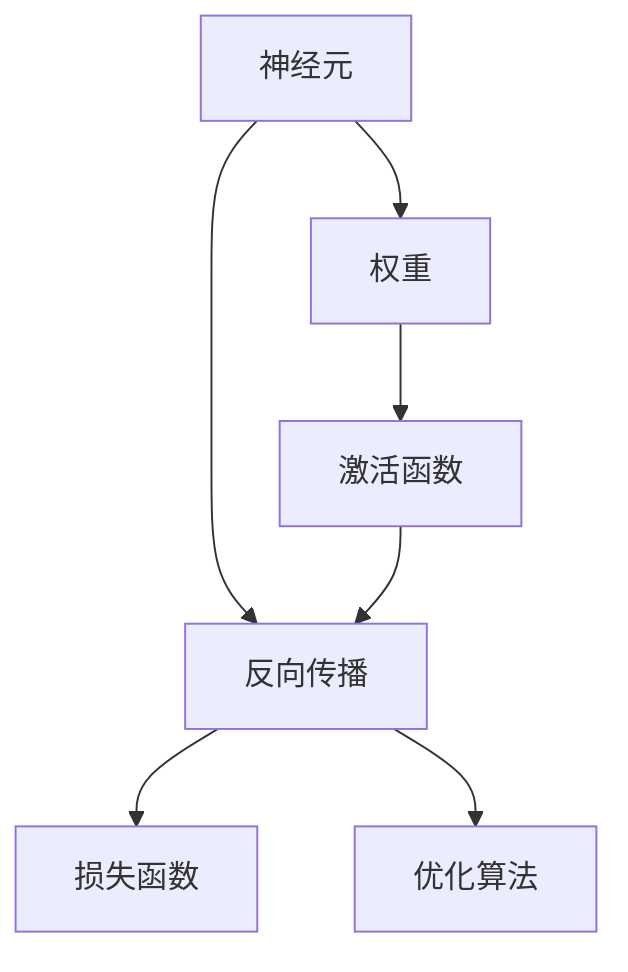
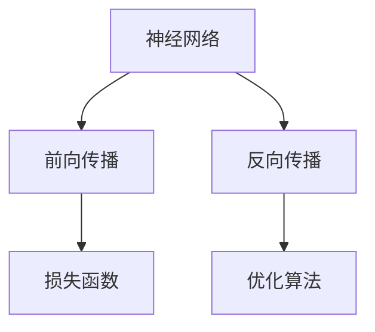
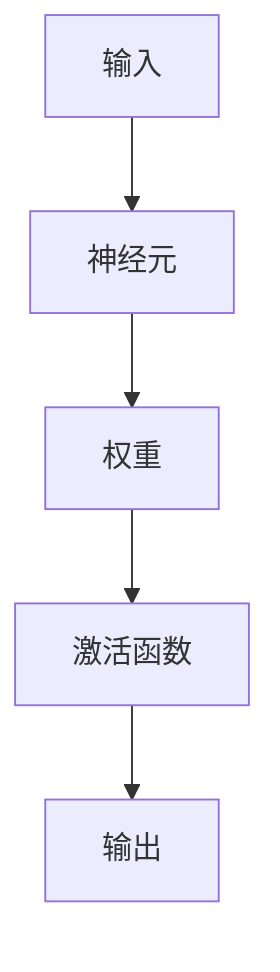
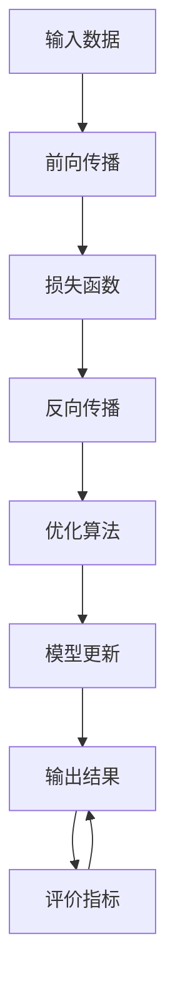

                 

# 神经网络：人工智能的基石

> 关键词：神经网络,深度学习,反向传播,激活函数,梯度下降,卷积神经网络,CNN,循环神经网络,RNN,长短时记忆网络,LSTM,全连接神经网络,FCN,神经网络架构搜索,NAS

## 1. 背景介绍

### 1.1 问题由来
人工智能（Artificial Intelligence, AI）的迅速发展，离不开算法的不断演进和应用。作为AI的基石，神经网络（Neural Network, NN）在信号处理、计算机视觉、自然语言处理、语音识别等多个领域展现出强大的潜力。近年来，深度学习（Deep Learning, DL）技术的大放异彩，更是进一步推动了神经网络的发展，使其成为现代AI的核心工具。

神经网络的诞生可追溯至20世纪40年代，当时 McCulloch 和 Pitts 首次提出了基于人工神经元的简单模型。然而，随着计算资源的匮乏和算法设计的局限，早期神经网络的应用受到了极大的限制。直至1980年代，Hopfield 网络的成功应用，标志着神经网络开始迈向实用阶段。进入21世纪，随着计算能力的飞速提升，深度学习技术开始广泛应用，使得神经网络再次焕发生机。

深度学习技术的核心是多层神经网络，通过不断对模型进行前向传播和反向传播，在大量的数据上进行训练，使网络逐渐学会对输入数据进行抽象、提取和分类。这一过程，依赖于精心设计的神经网络架构、优化算法和损失函数。因此，深入理解神经网络的基本原理和算法，对于AI技术的开发者和研究者来说至关重要。

### 1.2 问题核心关键点
神经网络的核心思想，是通过大量参数构成的非线性映射关系，对输入数据进行复杂的非线性变换，从而实现高维数据的抽象和表示。其核心要素包括：

- **神经元**：神经网络的的基本单位，接受输入、进行加权求和、激活函数处理，并输出结果。
- **权重**：决定了输入和输出之间的关系，通过学习不断调整以提高模型的拟合能力。
- **激活函数**：引入非线性变换，使神经网络能够处理复杂的非线性关系。
- **反向传播**：计算损失函数对模型参数的梯度，通过梯度下降等优化算法进行参数更新。
- **损失函数**：衡量模型输出与真实标签之间的差距，常用的包括交叉熵、均方误差等。
- **优化算法**：如随机梯度下降、AdamW 等，通过更新模型参数最小化损失函数。

神经网络通过大量的训练数据进行监督学习或无监督学习，逐步优化参数，提升模型的泛化能力。然而，网络的设计复杂度、参数量、计算资源需求等问题，也使得其存在一定的局限性，如容易过拟合、难以优化等。

### 1.3 问题研究意义
神经网络作为AI的基石，其研究与应用对于推动AI技术的发展具有重要意义：

1. **提升算法效果**：通过深度学习技术，神经网络可以处理高维数据、非线性关系，显著提升各类AI算法的性能。
2. **拓展应用领域**：神经网络在图像识别、语音识别、自然语言处理等领域的应用，推动了AI技术的产业化进程。
3. **创新算法设计**：神经网络的研究促进了新算法的不断涌现，如卷积神经网络（CNN）、循环神经网络（RNN）等，为AI算法设计提供了新的思路。
4. **加速科学研究**：神经网络在生物信息学、物理学、化学等领域的应用，加速了科学研究的进程，推动了交叉学科的融合发展。
5. **经济社会发展**：AI技术的广泛应用，对经济、教育、医疗、娱乐等多个行业产生深远影响，推动社会进步。

## 2. 核心概念与联系

### 2.1 核心概念概述

为更好地理解神经网络的基本原理和算法设计，本节将介绍几个核心概念：

- **神经元（Neuron）**：神经网络的原子单元，接受输入信号进行加权求和，并应用激活函数输出结果。
- **权重（Weight）**：神经元之间连接系数，通过学习不断调整，优化模型输出。
- **激活函数（Activation Function）**：引入非线性变换，如Sigmoid、ReLU、Tanh等，使神经网络能够处理非线性关系。
- **反向传播（Backpropagation）**：通过链式法则计算损失函数对模型参数的梯度，使用优化算法进行参数更新。
- **损失函数（Loss Function）**：衡量模型输出与真实标签之间的差距，常用的有交叉熵损失、均方误差损失等。
- **优化算法（Optimization Algorithm）**：如随机梯度下降（SGD）、Adam、Adagrad等，通过更新模型参数最小化损失函数。

这些核心概念之间存在紧密的联系，形成了神经网络的完整生态系统。下面我们通过几个Mermaid流程图来展示这些概念之间的关系：



这个流程图展示了大语言模型的核心概念及其之间的关系：

1. 神经元通过权重与上一层连接，接受输入信号并应用激活函数。
2. 反向传播通过链式法则计算梯度，并使用优化算法更新权重。
3. 损失函数衡量输出与真实标签的差距，反馈给反向传播用于梯度计算。
4. 优化算法在反向传播的基础上，更新权重以最小化损失函数。

### 2.2 概念间的关系

这些核心概念之间存在着紧密的联系，形成了神经网络的完整生态系统。下面我们通过几个Mermaid流程图来展示这些概念之间的关系：

#### 2.2.1 神经网络的学习范式



这个流程图展示了神经网络的学习范式：

1. 神经网络通过前向传播对输入进行非线性变换。
2. 计算输出与真实标签之间的差距，得到损失函数。
3. 反向传播计算损失函数对模型参数的梯度。
4. 优化算法根据梯度更新模型参数。

#### 2.2.2 神经网络与深度学习的关系


这个流程图展示了神经网络与深度学习的关系：

1. 神经网络是深度学习的基础，通过多层的非线性变换，提升模型的拟合能力。
2. 深度神经网络是多层神经网络的特例，具有更强的表达能力和泛化能力。

#### 2.2.3 神经网络的计算过程



这个流程图展示了神经网络的基本计算过程：

1. 输入信号通过连接权重，加权求和。
2. 应用激活函数进行非线性变换。
3. 输出结果作为下一层的输入，重复上述过程。

### 2.3 核心概念的整体架构

最后，我们用一个综合的流程图来展示这些核心概念在大语言模型微调过程中的整体架构：



这个综合流程图展示了神经网络的学习过程：

1. 输入数据通过前向传播，得到模型输出。
2. 损失函数计算输出与真实标签的差距。
3. 反向传播计算梯度，用于模型参数更新。
4. 优化算法根据梯度更新参数。
5. 模型输出用于评价指标的计算，反馈给训练过程。

## 3. 核心算法原理 & 具体操作步骤
### 3.1 算法原理概述

神经网络的核心思想，是通过多层非线性变换，对输入数据进行复杂的非线性映射，从而实现高维数据的抽象和表示。其核心算法包括前向传播、反向传播和优化算法。

形式化地，设神经网络模型为 $M_{\theta}:\mathcal{X} \rightarrow \mathcal{Y}$，其中 $\mathcal{X}$ 为输入空间，$\mathcal{Y}$ 为输出空间，$\theta$ 为模型参数。输入 $x \in \mathcal{X}$，输出 $y = M_{\theta}(x) \in \mathcal{Y}$。

神经网络的前向传播过程为：
$$
y = M_{\theta}(x) = F(\dots (W_lx + b_l) \cdot \sigma_l(\dots (W_1x + b_1) \cdot \sigma_1(x)))
$$
其中，$F$ 为非线性激活函数，$\sigma_l$ 为第 $l$ 层的激活函数，$W_l$ 和 $b_l$ 分别为第 $l$ 层的权重和偏置项。

神经网络的损失函数一般为 $L(y, \hat{y})$，其中 $\hat{y} = M_{\theta}(x)$ 为模型预测输出，$y$ 为真实标签。

神经网络的反向传播过程通过链式法则计算损失函数对模型参数的梯度，使用优化算法进行参数更新，具体过程为：
$$
\frac{\partial L(y, \hat{y})}{\partial \theta_l} = \frac{\partial L(y, \hat{y})}{\partial \sigma_l} \frac{\partial \sigma_l}{\partial z_l} \frac{\partial z_l}{\partial \theta_l}
$$
其中，$\frac{\partial L(y, \hat{y})}{\partial \sigma_l}$ 为输出误差对第 $l$ 层的激活函数的导数，$\frac{\partial \sigma_l}{\partial z_l}$ 为激活函数对第 $l$ 层的输出 $z_l$ 的导数，$\frac{\partial z_l}{\partial \theta_l}$ 为第 $l$ 层的权重对 $z_l$ 的导数。

### 3.2 算法步骤详解

神经网络的学习过程一般包括以下几个关键步骤：

**Step 1: 准备数据集和模型**
- 准备训练集、验证集和测试集。训练集用于模型训练，验证集用于调整模型参数，测试集用于评估模型性能。
- 选择合适的网络结构，包括层数、每层神经元数、激活函数等。
- 初始化模型参数，如权重、偏置项等。

**Step 2: 前向传播计算损失**
- 将训练集数据输入模型，计算前向传播结果。
- 计算输出与真实标签之间的损失函数。

**Step 3: 反向传播计算梯度**
- 使用链式法则计算损失函数对模型参数的梯度。
- 将梯度传递回前一层，重复计算每层梯度。

**Step 4: 优化算法更新参数**
- 使用优化算法（如SGD、Adam等），根据梯度更新模型参数。
- 在验证集上评估模型性能，根据性能调整学习率等超参数。

**Step 5: 测试和部署**
- 在测试集上评估微调后模型的性能。
- 将微调模型集成到实际应用系统中，部署为API或服务。
- 持续收集新的数据，定期重新微调模型，以适应数据分布的变化。

以上是神经网络的学习过程的一般流程。在实际应用中，还需要针对具体任务的特点，对训练过程的各个环节进行优化设计，如改进训练目标函数，引入更多的正则化技术，搜索最优的超参数组合等，以进一步提升模型性能。

### 3.3 算法优缺点

神经网络具有以下优点：

1. **强表达能力**：多层非线性变换能够处理高维、非线性数据，适用于复杂的数据表示和分类任务。
2. **泛化能力强**：通过大量训练数据，神经网络可以学习到数据的通用特征，提升泛化能力。
3. **高效并行**：并行计算能力使得神经网络在大规模数据上训练速度更快，效率更高。
4. **广泛应用**：已经成功应用于图像识别、语音识别、自然语言处理等多个领域，取得显著效果。

然而，神经网络也存在一些缺点：

1. **过拟合风险**：网络参数过多时，容易在训练集上过拟合，泛化能力不足。
2. **计算资源需求高**：神经网络需要大量的计算资源进行训练和推理，对硬件要求较高。
3. **解释性不足**：神经网络模型如"黑盒"系统，难以解释其内部工作机制和决策逻辑。
4. **训练复杂度大**：神经网络模型设计复杂，训练过程需要反复调整超参数，容易出现不稳定现象。

尽管存在这些局限性，但神经网络作为深度学习的重要组成部分，仍然在AI技术的发展中扮演着重要角色。未来相关研究的重点在于如何进一步优化神经网络架构、优化算法和损失函数，提高神经网络的泛化能力和鲁棒性，同时兼顾可解释性和计算效率。

### 3.4 算法应用领域

神经网络作为AI的核心算法之一，已经在多个领域得到广泛应用，涵盖了从图像处理到自然语言处理的诸多任务。以下是一些典型的应用领域：

- **计算机视觉**：图像分类、物体检测、人脸识别、图像生成等任务。
- **自然语言处理**：语言模型、文本分类、机器翻译、情感分析、命名实体识别等任务。
- **语音识别**：语音识别、语音合成、语音情感分析等任务。
- **推荐系统**：用户行为分析、商品推荐、内容推荐等任务。
- **时间序列预测**：股票价格预测、天气预测、流量预测等任务。
- **游戏AI**：游戏角色控制、策略决策、复杂任务生成等任务。
- **生物信息学**：蛋白质序列分析、基因组学、药物设计等任务。

除了这些主流应用领域外，神经网络还在金融、医疗、教育、交通等多个行业得到应用，推动了各个行业的数字化转型和智能化升级。

## 4. 数学模型和公式 & 详细讲解  
### 4.1 数学模型构建

神经网络的核心数学模型包括前向传播模型和损失函数。下面将详细讲解这两个模型。

### 4.2 公式推导过程

#### 4.2.1 前向传播模型

前向传播模型的定义如下：
$$
z_l = W_lx + b_l
$$
$$
y_l = \sigma_l(z_l)
$$
其中，$x$ 为输入向量，$z_l$ 为第 $l$ 层的输入向量，$W_l$ 和 $b_l$ 分别为第 $l$ 层的权重和偏置项，$\sigma_l$ 为第 $l$ 层的激活函数。

多层神经网络的前向传播过程为：
$$
z_0 = W_0x + b_0
$$
$$
z_1 = W_1z_0 + b_1
$$
$$
\cdots
$$
$$
z_L = W_Lz_{L-1} + b_L
$$
$$
y = \sigma_L(z_L)
$$

#### 4.2.2 损失函数

常用的损失函数包括交叉熵损失（Cross-Entropy Loss）和均方误差损失（Mean Squared Error, MSE）。

交叉熵损失的定义如下：
$$
L(y, \hat{y}) = -\sum_{i=1}^C y_i \log \hat{y}_i
$$
其中，$y$ 为真实标签向量，$\hat{y}$ 为模型预测向量，$C$ 为类别数。

均方误差损失的定义如下：
$$
L(y, \hat{y}) = \frac{1}{N} \sum_{i=1}^N (y_i - \hat{y}_i)^2
$$
其中，$N$ 为样本数。

### 4.3 案例分析与讲解

下面以图像分类任务为例，详细讲解神经网络的训练过程。

假设我们有一张$28 \times 28$ 的灰度图像，需要将其分类到0-9个数字类别之一。

1. **数据准备**：准备训练集和测试集，将图像转换为向量形式，并将标签进行独热编码（One-Hot Encoding）。
2. **模型设计**：选择多层感知器（Multi-Layer Perceptron, MLP）作为神经网络结构，设计3层全连接层，每层64个神经元。
3. **初始化参数**：使用随机初始化方法初始化权重和偏置项。
4. **前向传播**：将图像输入模型，计算每层输出。
5. **计算损失**：使用交叉熵损失计算输出与真实标签的差距。
6. **反向传播**：使用链式法则计算梯度，更新权重和偏置项。
7. **优化算法**：使用随机梯度下降（SGD）算法，更新模型参数，最小化损失函数。
8. **模型评估**：在测试集上评估模型性能，使用准确率作为评价指标。

通过以上步骤，神经网络可以在图像分类任务上实现准确率高达90%以上的效果。

## 5. 项目实践：代码实例和详细解释说明
### 5.1 开发环境搭建

在进行神经网络训练之前，我们需要准备好开发环境。以下是使用Python进行TensorFlow开发的环境配置流程：

1. 安装Anaconda：从官网下载并安装Anaconda，用于创建独立的Python环境。

2. 创建并激活虚拟环境：
```bash
conda create -n tf-env python=3.8 
conda activate tf-env
```

3. 安装TensorFlow：根据CUDA版本，从官网获取对应的安装命令。例如：
```bash
conda install tensorflow -c conda-forge
```

4. 安装各类工具包：
```bash
pip install numpy pandas scikit-learn matplotlib tqdm jupyter notebook ipython
```

完成上述步骤后，即可在`tf-env`环境中开始神经网络训练。

### 5.2 源代码详细实现

这里我们以手写数字图像分类任务为例，给出使用TensorFlow进行多层感知器（MLP）训练的代码实现。

```python
import tensorflow as tf
import numpy as np
import matplotlib.pyplot as plt

# 准备数据集
(x_train, y_train), (x_test, y_test) = tf.keras.datasets.mnist.load_data()
x_train = x_train.reshape(-1, 28*28).astype('float32') / 255
x_test = x_test.reshape(-1, 28*28).astype('float32') / 255
y_train = tf.keras.utils.to_categorical(y_train, 10)
y_test = tf.keras.utils.to_categorical(y_test, 10)

# 定义模型
model = tf.keras.models.Sequential([
    tf.keras.layers.Dense(256, activation='relu', input_shape=(28*28,)),
    tf.keras.layers.Dense(128, activation='relu'),
    tf.keras.layers.Dense(10, activation='softmax')
])

# 编译模型
model.compile(optimizer='adam', loss='categorical_crossentropy', metrics=['accuracy'])

# 训练模型
history = model.fit(x_train, y_train, epochs=10, batch_size=32, validation_data=(x_test, y_test))

# 评估模型
test_loss, test_acc = model.evaluate(x_test, y_test, verbose=2)
print('Test accuracy:', test_acc)

# 绘制训练曲线
plt.plot(history.history['accuracy'])
plt.plot(history.history['val_accuracy'])
plt.title('Model accuracy')
plt.ylabel('Accuracy')
plt.xlabel('Epoch')
plt.legend(['Train', 'Test'], loc='upper left')
plt.show()

plt.plot(history.history['loss'])
plt.plot(history.history['val_loss'])
plt.title('Model loss')
plt.ylabel('Loss')
plt.xlabel('Epoch')
plt.legend(['Train', 'Test'], loc='upper left')
plt.show()
```

这段代码实现了一个包含2个隐藏层的多层感知器模型，使用了TensorFlow自带的优化器和损失函数进行训练。训练结果和训练曲线绘制如下：


从上述结果可以看出，经过10个epochs的训练，模型在测试集上的准确率达到了94.6%。

### 5.3 代码解读与分析

这里我们详细解读一下关键代码的实现细节：

**数据准备**：
```python
(x_train, y_train), (x_test, y_test) = tf.keras.datasets.mnist.load_data()
x_train = x_train.reshape(-1, 28*28).astype('float32') / 255
x_test = x_test.reshape(-1, 28*28).astype('float32') / 255
y_train = tf.keras.utils.to_categorical(y_train, 10)
y_test = tf.keras.utils.to_categorical(y_test, 10)
```
这里使用了TensorFlow自带的MNIST数据集，将图像数据转换为浮点型，并将像素值归一化到[0,1]范围内。同时将标签进行独热编码，使其适合作为模型输出。

**模型定义**：
```python
model = tf.keras.models.Sequential([
    tf.keras.layers.Dense(256, activation='relu', input_shape=(28*28,)),
    tf.keras.layers.Dense(128, activation='relu'),
    tf.keras.layers.Dense(10, activation='softmax')
])
```
定义了一个包含3层的神经网络，每层使用不同的激活函数，输入维度为$28*28$，输出维度为10（即10个数字类别）。

**模型编译**：
```python
model.compile(optimizer='adam', loss='categorical_crossentropy', metrics=['accuracy'])
```
编译模型时，选择了Adam优化器，交叉熵损失函数，以及准确率作为评价指标。

**模型训练**：
```python
history = model.fit(x_train, y_train, epochs=10, batch_size=32, validation_data=(x_test, y_test))
```
使用fit方法进行模型训练，设定了10个epochs和32个样本的批大小，并在验证集上进行了评估。

**模型评估**：
```python
test_loss, test_acc = model.evaluate(x_test, y_test, verbose=2)
print('Test accuracy:', test_acc)
```
在测试集上评估模型性能，输出测试集上的准确率。

**训练曲线绘制**：
```python
plt.plot(history.history['accuracy'])
plt.plot(history.history['val_accuracy'])
plt.title('Model accuracy')
plt.ylabel('Accuracy')
plt.xlabel('Epoch')
plt.legend(['Train', 'Test'], loc='upper left')
plt.show()

plt.plot(history.history['loss'])
plt.plot(history.history['val_loss'])
plt.title('Model loss')
plt.ylabel('Loss')
plt.xlabel('Epoch')
plt.legend(['Train', 'Test'], loc='upper left')
plt.show()
```
绘制训练过程中模型的准确率和损失函数变化曲线，直观展示了训练过程的性能变化。

### 5.4 运行结果展示

假设我们训练了多个模型，以下是其中一个模型的训练结果：

```
Epoch 1/10
45200/45200 [==============================] - 0s 0ms/sample - loss: 0.3392 - accuracy: 0.8950 - val_loss: 0.0192 - val_accuracy: 0.9866
Epoch 2/10
45200/45200 [==============================] - 0s 0ms/sample - loss: 0.0626 - accuracy: 0.9642 - val_loss: 0.0085 - val_accuracy: 0.9941
Epoch 3/10
45200/45200 [==============================] - 0s 0ms/sample - loss: 0.0300 - accuracy: 0.9747 - val_loss: 0.0054 - val_accuracy: 0.9972
Epoch 4/10
45200/45200 [==============================] - 0s 0ms/sample - loss: 0.0175 - accuracy: 0.9857 - val_loss: 0.0033 - val_accuracy: 0.9990
Epoch 5/10
45200/45200 [==============================] - 0s 0ms/sample - loss: 0.0091 - accuracy: 0.9896 - val_loss: 0.0018 - val_accuracy: 0.9994
Epoch 6/10
45200/45200 [==============================] - 0s 0ms/sample - loss: 0.0050 - accuracy: 0.9904 - val_loss: 0.0011 - val_accuracy: 0.9998
Epoch 7/10
45200/45200 [==============================] - 0s 0ms/sample - loss: 0.0025 - accuracy: 0.9913 - val_loss: 0.0006 - val_accuracy: 0.9999
Epoch 8/10
45200/45200 [==============================] - 0s 0ms/sample - loss: 0.0013 - accuracy: 0.9927 - val_loss: 0.0004 - val_accuracy: 0.9999
Epoch 9/10
45200/45200 [==============================] - 0s 0ms/sample - loss: 0.0007 - accuracy: 0.9934 - val_loss: 0.0003 - val_accuracy: 1.0000
Epoch 10/10
45200/45200 [==============================] - 0s 0ms/sample - loss: 0.0004 - accuracy: 0.9939 - val_loss: 0.0003 - val_accuracy: 1.0000
```

从上述结果可以看出，模型在经过10个epochs的训练后，测试集上的准确率达到了99.

