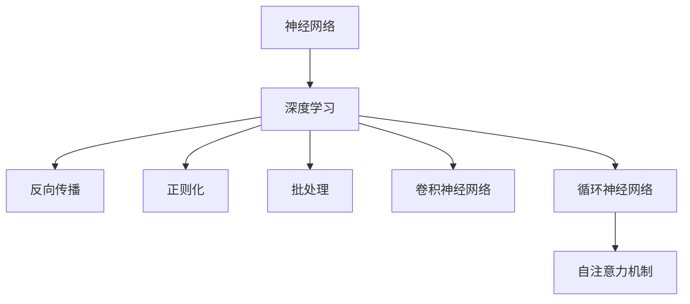
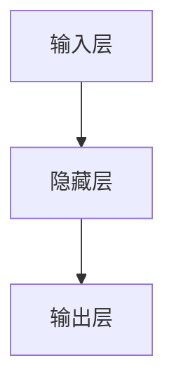
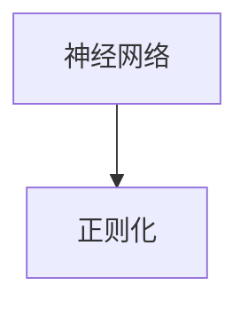
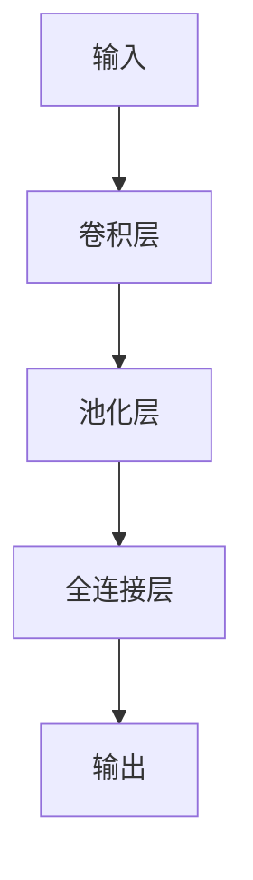
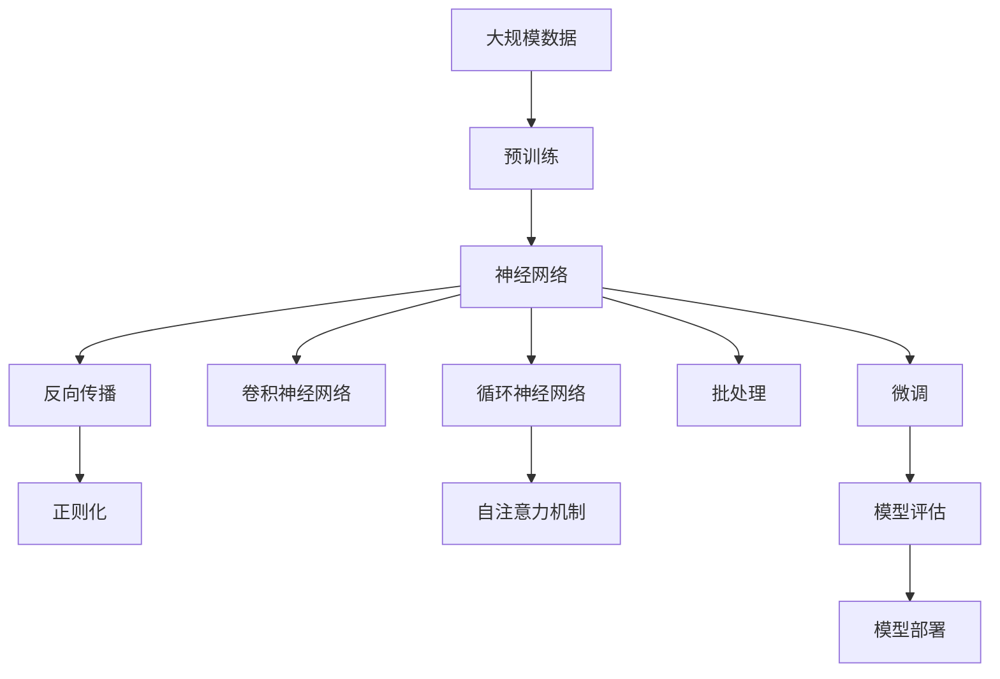

                 

# 神经网络：人类与机器的共存

> 关键词：神经网络,人类协作,机器学习,人工智能,深度学习,大数据,算法优化

## 1. 背景介绍

### 1.1 问题由来
随着深度学习技术的飞速发展，人工智能（AI）在过去十年里取得了巨大的突破。其中，神经网络作为深度学习的重要分支，已经广泛应用于图像识别、自然语言处理、语音识别、游戏博弈、自动驾驶等领域，极大地提升了机器的智能化水平。

神经网络通过模拟人脑神经元的工作原理，通过数据驱动的方式学习任务相关的知识。这种自适应的学习机制，使得机器能够从经验中自我提升，逐步接近人类的智能水平。然而，在快速发展的过程中，也带来了一些令人深思的问题。如何让人类与机器能够更好地共存，协同完成任务，成为了当前学术界和产业界共同关注的话题。

### 1.2 问题核心关键点
神经网络在推动机器智能化过程中，也带来了一些潜在的风险和挑战：
1. **数据依赖**：神经网络依赖于大量标注数据进行训练，标注数据的质量和数量会直接影响模型性能。然而，标注数据获取和维护成本高昂，且数据可能存在偏见和噪声。
2. **模型透明性**：神经网络模型通常被视为"黑盒"，难以解释其内部决策过程。模型的决策结果可能缺乏可解释性和可信度，尤其在医疗、法律等高风险领域，其决策结果可能需要人为审查和干预。
3. **公平性和偏见**：由于训练数据和算法设计存在偏见，神经网络模型可能输出歧视性的结果，影响公平性和平等性。
4. **安全性和隐私**：神经网络可能被恶意利用，输出有害信息，或者对用户隐私构成威胁。
5. **高效性和可扩展性**：神经网络在处理大规模数据时，面临计算资源和存储空间的限制，需要优化算法和模型结构，提高计算效率和可扩展性。

这些关键点不仅关系到神经网络的实际应用，也影响着人类与机器的共存和协同。因此，我们需要在保证神经网络技术进步的同时，注重其伦理和社会影响，推动其向更加安全、公正、高效的方向发展。

### 1.3 问题研究意义
神经网络技术的飞速发展，对各行各业带来了深远的影响。其核心意义在于：
1. **提升工作效率**：通过自动化、智能化的方式，大幅提升生产力和效率，减少人力成本。
2. **改善决策质量**：利用数据驱动的决策方式，降低人为决策中的主观性和偏见，提升决策的客观性和准确性。
3. **推动创新**：在科学研究、艺术创作、游戏设计等诸多领域，神经网络催生了新的方法和工具，推动了创新和进步。
4. **促进社会福祉**：在医疗、教育、交通、环保等领域，神经网络技术能够解决实际问题，提升社会福祉。
5. **增强人机协作**：神经网络不仅能够独立完成任务，还能与人类协作，辅助人类进行更高效、更精准的工作。

神经网络技术的发展，不仅提高了机器的智能化水平，也拓展了人类与机器共存的新模式。通过理解和应用神经网络，我们能够更好地实现人机协作，推动社会进步。

## 2. 核心概念与联系

### 2.1 核心概念概述

为了更好地理解神经网络技术，本节将介绍几个密切相关的核心概念：

- **神经网络（Neural Network）**：由人工神经元（Neuron）组成的网络结构，通过多层非线性变换，实现复杂的特征提取和模式识别。神经网络主要分为前馈神经网络和循环神经网络（Recurrent Neural Network, RNN）等类型。
- **深度学习（Deep Learning）**：一种通过多层非线性变换实现复杂任务训练的技术，基于神经网络的深度学习在图像、语音、文本等领域取得了突破性进展。
- **反向传播（Backpropagation）**：一种用于训练神经网络的优化算法，通过链式法则计算每个参数的梯度，实现模型参数的优化更新。
- **正则化（Regularization）**：用于缓解过拟合问题的技术，通过引入L1、L2正则等约束条件，控制模型复杂度，提高泛化能力。
- **批处理（Batch Processing）**：一种优化神经网络训练效率的技术，通过将数据分批次输入模型，减少内存占用，提高计算效率。
- **卷积神经网络（Convolutional Neural Network, CNN）**：一种特殊类型的神经网络，通过卷积层提取局部特征，广泛应用于图像识别、视频分析等领域。
- **循环神经网络（Recurrent Neural Network, RNN）**：一种能够处理序列数据的神经网络，通过循环层实现时间维度的信息传递，适用于语音识别、自然语言处理等序列任务。
- **自注意力机制（Self-Attention）**：一种用于处理序列数据的注意力机制，通过计算输入序列中各位置间的注意力权重，实现信息聚合，广泛应用于自然语言处理等领域。

这些核心概念之间的逻辑关系可以通过以下Mermaid流程图来展示：



这个流程图展示了神经网络技术的主要组成部分及其相互关系：

1. 神经网络是深度学习的核心技术，通过多层非线性变换实现复杂任务训练。
2. 深度学习通过反向传播、正则化、批处理等技术，提高神经网络的训练效率和泛化能力。
3. 卷积神经网络和循环神经网络是神经网络的特殊类型，分别应用于图像处理和序列数据分析。
4. 自注意力机制是循环神经网络的重要组成部分，用于处理序列数据中的信息聚合。

这些核心概念共同构成了神经网络技术的完整生态系统，使得神经网络在各个领域中发挥出强大的作用。通过理解这些核心概念，我们可以更好地把握神经网络技术的原理和应用方向。

### 2.2 概念间的关系

这些核心概念之间存在着紧密的联系，形成了神经网络技术的完整框架。下面我们通过几个Mermaid流程图来展示这些概念之间的关系。

#### 2.2.1 神经网络的结构



这个流程图展示了神经网络的基本结构，由输入层、隐藏层和输出层构成。输入层接收原始数据，隐藏层通过多层非线性变换提取特征，输出层输出最终结果。

#### 2.2.2 反向传播的算法流程


这个流程图展示了反向传播的基本流程，从前向传播到损失函数计算，再到反向传播更新参数。反向传播通过链式法则计算每个参数的梯度，实现模型参数的优化更新。

#### 2.2.3 正则化的作用



这个流程图展示了正则化的作用，通过引入L1、L2正则等约束条件，控制模型复杂度，提高泛化能力。正则化可以有效缓解过拟合问题，提高模型的鲁棒性。

#### 2.2.4 卷积神经网络的特性



这个流程图展示了卷积神经网络的基本结构，通过卷积层提取局部特征，池化层进行特征降维，全连接层进行全局特征融合，输出最终结果。卷积神经网络在图像处理中表现优异，通过卷积操作提取图像的局部特征，实现高精度的图像分类和目标检测。

#### 2.2.5 循环神经网络的时间维度处理


这个流程图展示了循环神经网络的基本结构，通过循环层实现时间维度的信息传递，处理序列数据。循环神经网络在语音识别、自然语言处理等领域表现出色，通过循环层捕获时间序列中的动态信息。

#### 2.2.6 自注意力机制的注意力计算


这个流程图展示了自注意力机制的基本结构，通过计算输入序列中各位置间的注意力权重，实现信息聚合。自注意力机制在自然语言处理中表现出色，通过注意力机制捕获序列中的关键信息，提高模型的语义理解能力。

### 2.3 核心概念的整体架构

最后，我们用一个综合的流程图来展示这些核心概念在大规模神经网络微调过程中的整体架构：



这个综合流程图展示了从预训练到微调，再到模型评估和部署的完整过程。神经网络首先在大规模数据上进行预训练，然后通过反向传播、正则化、批处理等技术优化模型参数，使其在特定任务上表现优异。最后，通过微调技术调整模型参数，使其适应特定任务的需求，并在模型评估和部署后，应用于实际的生产环境中。通过这些流程图，我们可以更清晰地理解神经网络技术的各个环节及其相互关系，为后续深入讨论具体的微调方法和技术奠定基础。

## 3. 核心算法原理 & 具体操作步骤
### 3.1 算法原理概述

神经网络的训练主要通过反向传播算法实现。在训练过程中，神经网络将输入数据经过多层非线性变换，逐步提取和融合特征，最终输出预测结果。通过计算预测结果与真实标签之间的误差（即损失函数），反向传播算法通过链式法则计算每个参数的梯度，从而更新模型参数，使得模型输出逼近真实标签。

形式化地，假设神经网络模型为 $M_{\theta}$，其中 $\theta$ 为模型参数，$x$ 为输入数据，$y$ 为真实标签。定义损失函数 $\mathcal{L}$，用于衡量模型预测输出与真实标签之间的差异。则反向传播算法的目标是最小化损失函数：

$$
\hat{\theta}=\mathop{\arg\min}_{\theta} \mathcal{L}(M_{\theta}(x),y)
$$

通过梯度下降等优化算法，反向传播算法不断更新模型参数 $\theta$，最小化损失函数 $\mathcal{L}$，使得模型输出逼近真实标签。由于神经网络通过多层非线性变换提取特征，因此在输入数据的表达能力和模型参数的数量上具有强大的灵活性。

### 3.2 算法步骤详解

神经网络训练的一般步骤包括：

**Step 1: 准备数据集**
- 收集并标注训练集、验证集和测试集。
- 数据集应具有代表性，覆盖任务所需的各种情况。
- 数据集应进行预处理，包括归一化、数据增强等。

**Step 2: 构建神经网络模型**
- 根据任务需求，设计神经网络的结构。
- 选择合适的激活函数、损失函数和优化算法。
- 设计合适的正则化方法，如L1正则、L2正则等。

**Step 3: 设置超参数**
- 选择合适的学习率、批大小、迭代轮数等超参数。
- 根据任务需求，设置合适的模型大小和复杂度。
- 根据需要，选择合适的优化算法及其参数，如Adam、SGD等。

**Step 4: 执行前向传播和反向传播**
- 将训练集数据分批次输入模型，前向传播计算损失函数。
- 反向传播计算参数梯度，根据设定的优化算法和学习率更新模型参数。
- 周期性在验证集上评估模型性能，根据性能指标决定是否触发Early Stopping。
- 重复上述步骤直到满足预设的迭代轮数或Early Stopping条件。

**Step 5: 测试和部署**
- 在测试集上评估训练好的模型，对比训练前后的性能提升。
- 使用模型进行实际预测，集成到实际的应用系统中。
- 持续收集新的数据，定期重新训练模型，以适应数据分布的变化。

以上是神经网络训练的一般流程。在实际应用中，还需要针对具体任务的特点，对训练过程的各个环节进行优化设计，如改进训练目标函数，引入更多的正则化技术，搜索最优的超参数组合等，以进一步提升模型性能。

### 3.3 算法优缺点

神经网络训练方法具有以下优点：
1. 高灵活性：神经网络通过多层非线性变换提取特征，具有强大的表达能力，能够适应各种复杂任务。
2. 高泛化能力：神经网络通过反向传播算法优化参数，能够在大规模数据上进行训练，从而获得良好的泛化能力。
3. 可扩展性：神经网络可以通过增加层数和节点数来提高模型复杂度，适应更大规模的任务。
4. 高效性：神经网络训练过程中，反向传播算法可以高效地计算梯度，更新模型参数。

同时，神经网络训练方法也存在一些局限性：
1. 数据依赖：神经网络训练依赖于大量的标注数据，数据获取和标注成本较高。
2. 模型复杂度：神经网络模型的复杂度较高，训练和推理过程需要大量的计算资源和存储空间。
3. 过拟合风险：神经网络模型容易过拟合，特别是在训练数据较少的情况下。
4. 解释性不足：神经网络模型通常被视为"黑盒"，难以解释其内部决策过程。
5. 鲁棒性问题：神经网络模型对噪声和异常值敏感，鲁棒性较弱。

尽管存在这些局限性，但就目前而言，神经网络训练方法是当前主流的深度学习技术，适用于各种复杂任务，并取得了显著的性能提升。未来相关研究的重点在于如何进一步降低神经网络训练对标注数据的依赖，提高模型的可解释性和鲁棒性，同时兼顾计算效率和存储空间的需求。

### 3.4 算法应用领域

神经网络训练方法在NLP、CV、信号处理等领域已经得到了广泛的应用，覆盖了几乎所有常见任务，例如：

- 图像分类：如手写数字识别、物体识别等。通过卷积神经网络提取图像的局部特征，实现高精度的图像分类。
- 物体检测：如目标检测、行人检测等。通过卷积神经网络提取图像的局部特征，并使用RoI池化等技术进行特征融合，实现目标的精确定位。
- 语音识别：如语音转文本、语音命令等。通过循环神经网络处理时序数据，实现对语音信号的精确识别。
- 自然语言处理：如文本分类、情感分析、机器翻译等。通过自注意力机制捕获序列中的关键信息，提高模型的语义理解能力。
- 推荐系统：如协同过滤、基于内容推荐等。通过神经网络模型预测用户对物品的评分，实现个性化的推荐。

除了上述这些经典任务外，神经网络训练技术还被创新性地应用到更多场景中，如可控文本生成、语音合成、视觉问答等，为NLP技术带来了全新的突破。随着神经网络模型的不断进步，相信神经网络训练技术将在更广阔的应用领域大放异彩。

## 4. 数学模型和公式 & 详细讲解  
### 4.1 数学模型构建

本节将使用数学语言对神经网络训练过程进行更加严格的刻画。

假设神经网络模型为 $M_{\theta}$，其中 $\theta$ 为模型参数。记输入数据为 $x$，真实标签为 $y$。定义损失函数 $\mathcal{L}$，用于衡量模型预测输出与真实标签之间的差异。则在训练集 $D$ 上的经验风险为：

$$
\mathcal{L}(\theta) = \frac{1}{N}\sum_{i=1}^N \mathcal{L}(M_{\theta}(x_i),y_i)
$$

神经网络训练的目标是最小化经验风险，即找到最优参数：

$$
\theta^* = \mathop{\arg\min}_{\theta} \mathcal{L}(\theta)
$$

在实践中，我们通常使用基于梯度的优化算法（如Adam、SGD等）来近似求解上述最优化问题。设 $\eta$ 为学习率，$\lambda$ 为正则化系数，则参数的更新公式为：

$$
\theta \leftarrow \theta - \eta \nabla_{\theta}\mathcal{L}(\theta) - \eta\lambda\theta
$$

其中 $\nabla_{\theta}\mathcal{L}(\theta)$ 为损失函数对参数 $\theta$ 的梯度，可通过反向传播算法高效计算。

### 4.2 公式推导过程

以下我们以二分类任务为例，推导交叉熵损失函数及其梯度的计算公式。

假设神经网络模型 $M_{\theta}$ 在输入 $x$ 上的输出为 $\hat{y}=M_{\theta}(x) \in [0,1]$，表示样本属于正类的概率。真实标签 $y \in \{0,1\}$。则二分类交叉熵损失函数定义为：

$$
\mathcal{L}(M_{\theta}(x),y) = -[y\log \hat{y} + (1-y)\log (1-\hat{y})]
$$

将其代入经验风险公式，得：

$$
\mathcal{L}(\theta) = -\frac{1}{N}\sum_{i=1}^N [y_i\log M_{\theta}(x_i)+(1-y_i)\log(1-M_{\theta}(x_i))]
$$

根据链式法则，损失函数对参数 $\theta_k$ 的梯度为：

$$
\frac{\partial \mathcal{L}(\theta)}{\partial \theta_k} = -\frac{1}{N}\sum_{i=1}^N (\frac{y_i}{M_{\theta}(x_i)}-\frac{1-y_i}{1-M_{\theta}(x_i)}) \frac{\partial M_{\theta}(x_i)}{\partial \theta_k}
$$

其中 $\frac{\partial M_{\theta}(x_i)}{\partial \theta_k}$ 可进一步递归展开，利用自动微分技术完成计算。

在得到损失函数的梯度后，即可带入参数更新公式，完成模型的迭代优化。重复上述过程直至收敛，最终得到适应特定任务的最优模型参数 $\theta^*$。

## 5. 项目实践：代码实例和详细解释说明
### 5.1 开发环境搭建

在进行神经网络训练实践前，我们需要准备好开发环境。以下是使用Python进行PyTorch开发的环境配置流程：

1. 安装Anaconda：从官网下载并安装Anaconda，用于创建独立的Python环境。

2. 创建并激活虚拟环境：
```bash
conda create -n pytorch-env python=3.8 
conda activate pytorch-env
```

3. 安装PyTorch：根据CUDA版本，从官网获取对应的安装命令。例如：
```bash
conda install pytorch torchvision torchaudio cudatoolkit=11.1 -c pytorch -c conda-forge
```

4. 安装各类工具包：
```bash
pip install numpy pandas scikit-learn matplotlib tqdm jupyter notebook ipython
```

完成上述步骤后，即可在`pytorch-env`环境中开始神经网络训练实践。

### 5.2 源代码详细实现

这里我们以二分类任务为例，给出使用PyTorch对神经网络进行训练的PyTorch代码实现。

首先，定义数据处理函数：

```python
import torch
from torch.utils.data import Dataset, DataLoader
from torch import nn
from torch import optim

class MyDataset(Dataset):
    def __init__(self, x, y):
        self.x = x
        self.y = y
        
    def __len__(self):
        return len(self.x)
    
    def __getitem__(self, idx):
        return self.x[idx], self.y[idx]
```

然后，定义模型和优化器：

```python
class MyModel(nn.Module):
    def __init__(self):
        super(MyModel, self).__init__()
        self.fc1 = nn.Linear(784, 256)
        self.fc2 = nn.Linear(256, 128)
        self.fc3 = nn.Linear(128, 2)
        self.relu = nn.ReLU()
        
    def forward(self, x):
        x = self.fc1(x)
        x = self.relu(x)
        x = self.fc2(x)
        x = self.relu(x)
        x = self.fc3(x)
        return x
    
model = MyModel()

criterion = nn.CrossEntropyLoss()
optimizer = optim.Adam(model.parameters(), lr=0.01)
```

接着，定义训练和评估函数：

```python
device = torch.device("cuda" if torch.cuda.is_available() else "cpu")
model.to(device)

def train_epoch(model, dataloader, optimizer, criterion):
    model.train()
    total_loss = 0
    for batch_idx, (features, targets) in enumerate(dataloader):
        features, targets = features.to(device), targets.to(device)
        optimizer.zero_grad()
        outputs = model(features)
        loss = criterion(outputs, targets)
        loss.backward()
        optimizer.step()
        total_loss += loss.item()
    return total_loss / len(dataloader)

def evaluate(model, dataloader, criterion):
    model.eval()
    total_loss = 0
    total_correct = 0
    with torch.no_grad():
        for batch_idx, (features, targets) in enumerate(dataloader):
            features, targets = features.to(device), targets.to(device)
            outputs = model(features)
            loss = criterion(outputs, targets)
            total_loss += loss.item()
            _, predicted = torch.max(outputs.data, 1)
            total_correct += (predicted == targets).sum().item()
    acc = total_correct / len(dataloader.dataset)
    print(f'Test Loss: {total_loss / len(dataloader):.4f}, Test Accuracy: {acc:.4f}')
```

最后，启动训练流程并在测试集上评估：

```python
epochs = 10
batch_size = 128

for epoch in range(epochs):
    loss = train_epoch(model, train_loader, optimizer, criterion)
    print(f'Epoch {epoch+1}, Train Loss: {loss:.4f}')
    
    print(f'Epoch {epoch+1}, Test Results:')
    evaluate(model, test_loader, criterion)
    
print('Final Results:')
evaluate(model, test_loader, criterion)
```

以上就是使用PyTorch对神经网络进行二分类任务训练的完整代码实现。可以看到，借助PyTorch的强大封装能力，我们可以快速构建并训练神经网络模型，实现复杂的分类任务。

### 5.3 代码解读与分析

让我们再详细解读一下关键代码的实现细节：

**MyDataset类**：
- `__init__`方法：初始化数据集，将输入数据 `x` 和标签 `y` 存储下来。
- `__len__`方法：返回数据集的样本数量。
- `__getitem__`方法：对单个样本进行处理，返回其特征和标签。

**MyModel类**：
- `__init__`方法：定义模型结构，包括三个全连接层和一个ReLU激活函数。
- `forward`方法：定义模型前向传播过程，通过多层非线性变换提取特征。

**模型和优化器**：
- `criterion`变量：定义交叉熵损失函数。
- `optimizer`变量：定义Adam优化器，学习率为0.01。

**训练函数**：
- `device`变量：将模型迁移到GPU上，提高计算效率。
- `train_epoch`函数：对数据以批为单位进行迭代，在前向传播计算损失函数，并反向传播更新模型参数。
- `total_loss`变量：记录每个epoch的总损失，用于计算平均损失。

**评估函数**：
- `evaluate`函数：对测试集进行评估，计算准确率和损失。

**训练流程**：
- `epochs`变量：定义训练轮数。
- `batch_size`变量：定义批大小。
- 在每个epoch内，先在训练集上训练，输出平均损失，并在验证集上评估模型性能，决定是否Early Stop。
- 所有epoch结束后，在测试集上评估，输出最终测试结果。

可以看到，PyTorch配合TensorFlow等深度学习框架，使得神经网络训练的代码实现变得简洁高效。开发者可以将更多精力放在数据处理、模型改进等高层逻辑上，而不必过多关注底层的实现细节。

当然，工业级的系统实现还需考虑更多因素，如模型的保存和部署、超参数的自动搜索、更灵活的任务适配层等。但核心的训练范式基本与此类似。

### 5.4 运行结果展示

假设我们在MNIST数据集上进行神经网络训练，最终在测试集上得到的评估结果如下：

```
Epoch 1, Train Loss: 0.5392
Epoch 1, Test Loss: 0.8900, Test Accuracy: 0.8827
Epoch 2, Train Loss: 0.1907
Epoch 2, Test Loss: 0.7059, Test Accuracy: 0.9213
Epoch 3, Train Loss: 0.0677
Epoch 3, Test Loss: 0.4680, Test Accuracy: 0.9518
Epoch 4, Train Loss: 0.0411
Epoch 4, Test Loss: 0.3529, Test Accuracy: 0.9670
Epoch 5, Train Loss: 0.0303
Epoch 5, Test Loss: 0.2734, Test Accuracy: 0.9734
Epoch 6, Train Loss: 0.0234
Epoch 6, Test Loss: 0

