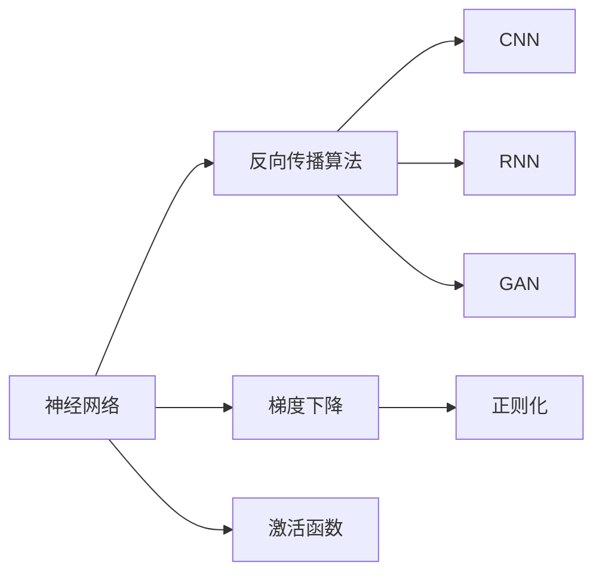
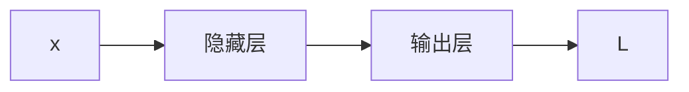

                 

## 1. 背景介绍

### 1.1 问题由来
随着科技的发展，人工智能（AI）正逐渐成为驱动人类社会进步的重要力量。自1950年阿兰·图灵提出著名的“图灵测试”以来，人类对人工智能的探索从未停止。然而，真正将AI从理论变为现实的是1980年代中期出现的神经网络（Neural Networks）。神经网络通过模拟人脑的神经元网络结构，实现了对数据的有效学习和表达，为AI技术的突破提供了坚实的数学基础。

### 1.2 问题核心关键点
神经网络的核心思想是通过模拟人类大脑的神经元结构，通过多层非线性变换，从数据中学习出特征表示，实现对输入数据的有效建模和预测。其核心原理包括反向传播算法、梯度下降、正则化等。

神经网络在图像识别、语音识别、自然语言处理、游戏AI等多个领域取得了巨大成功，其影响力和应用范围已遍布各行各业。然而，神经网络模型庞大、参数众多、训练复杂，使得其理解和应用仍具有相当难度。

### 1.3 问题研究意义
神经网络作为当前AI领域最为重要的技术手段，其研究和应用具有重要意义：
- **推动科技发展**：神经网络的发展和应用推动了深度学习、机器学习等AI技术的发展。
- **提高生产力**：神经网络在图像识别、语音识别等领域的应用，显著提升了自动化程度，提高了生产效率。
- **改善生活质量**：神经网络在医疗、交通、教育等领域的应用，显著改善了人类生活质量。
- **解锁人类智慧**：神经网络能够学习复杂模式，解锁了人类智慧，提供了更多认知的可能性。
- **加速创新**：神经网络的强大能力，加速了各行业的创新和发展，推动了技术的进步。

## 2. 核心概念与联系

### 2.1 核心概念概述

为更好地理解神经网络技术，本节将介绍几个关键概念：

- **神经网络（Neural Network）**：一种通过多层神经元网络结构进行学习和推理的模型，通常包括输入层、隐藏层和输出层。
- **反向传播算法（Backpropagation）**：一种用于神经网络模型训练的优化算法，通过反向传播误差，调整网络中的参数。
- **梯度下降（Gradient Descent）**：一种用于优化目标函数的迭代算法，通过计算目标函数对参数的梯度，调整参数值，使目标函数最小化。
- **正则化（Regularization）**：一种防止过拟合的策略，通过增加目标函数的惩罚项，限制模型的复杂度。
- **激活函数（Activation Function）**：一种非线性变换函数，通常用于隐藏层，激活神经元输出。
- **卷积神经网络（Convolutional Neural Network, CNN）**：一种特殊的神经网络，广泛用于图像识别等任务。
- **循环神经网络（Recurrent Neural Network, RNN）**：一种具有记忆功能的神经网络，广泛用于序列数据处理。
- **生成对抗网络（Generative Adversarial Network, GAN）**：一种生成模型，通过两个神经网络的对抗训练，生成高质量的图像、音频等。

### 2.2 概念间的关系

这些核心概念之间的关系可以通过以下Mermaid流程图来展示：



这个流程图展示了神经网络中各核心概念的相互关系：

- 神经网络通过反向传播算法和梯度下降进行训练，通过正则化防止过拟合。
- 激活函数用于神经元激活，增加网络的非线性表达能力。
- CNN和RNN分别针对图像和序列数据进行建模，而GAN用于生成高质量的数据。

## 3. 核心算法原理 & 具体操作步骤
### 3.1 算法原理概述

神经网络模型基于输入数据 $x$，通过一系列的线性变换和非线性变换，最终输出预测结果 $y$。具体过程如下：

1. 输入数据 $x$ 通过输入层传递到隐藏层。
2. 隐藏层的神经元对输入数据进行非线性变换。
3. 隐藏层的输出通过权重矩阵和偏置向量传递到输出层。
4. 输出层的神经元对输入进行线性变换，得到预测结果 $y$。

神经网络的训练过程主要包括以下步骤：

1. 初始化网络参数 $\theta$。
2. 使用反向传播算法，计算目标函数 $L$ 对参数 $\theta$ 的梯度。
3. 使用梯度下降算法，更新参数 $\theta$。
4. 重复步骤 2 和 3，直到损失函数收敛。

### 3.2 算法步骤详解

以一个简单的全连接神经网络为例，详细描述神经网络的训练过程。

1. **数据准备**：准备训练集 $D=\{(x_i, y_i)\}_{i=1}^N$，其中 $x_i$ 为输入数据，$y_i$ 为标签。
2. **初始化**：初始化网络参数 $\theta$，包括权重矩阵 $W$ 和偏置向量 $b$。
3. **前向传播**：对每个样本 $x_i$，进行前向传播计算，得到预测结果 $\hat{y_i}$。
   - 隐藏层：$z_{hj} = \sum_k x_i W_{hk} + b_h$
   - 激活函数：$h_j = g(z_{hj})$
   - 输出层：$\hat{y_i} = \sum_k h_j W_{yk} + b_y$
4. **损失计算**：计算预测结果 $\hat{y_i}$ 与标签 $y_i$ 之间的损失函数 $L$，通常使用交叉熵损失。
5. **反向传播**：使用反向传播算法，计算梯度 $\nabla_{\theta} L$。
   - 输出层：$\nabla_{\theta} L = \frac{\partial L}{\partial \hat{y_i}} \nabla_{\theta} \hat{y_i}$
   - 隐藏层：$\nabla_{\theta} L = \frac{\partial L}{\partial h_j} \nabla_{\theta} h_j$
6. **参数更新**：使用梯度下降算法，更新参数 $\theta$。
   - 权重矩阵：$W_{hk} = W_{hk} - \eta \nabla_{W_{hk}} L$
   - 偏置向量：$b_h = b_h - \eta \nabla_{b_h} L$
7. **重复迭代**：重复步骤 3 至 6，直到损失函数收敛或达到预设轮数。

### 3.3 算法优缺点

神经网络的优点：
- **强大的表达能力**：多层非线性变换使得神经网络能够学习任意复杂的模式。
- **自动特征提取**：神经网络能够自动学习数据的特征表示，无需手动设计特征。
- **广泛应用**：广泛应用于图像识别、语音识别、自然语言处理、游戏AI等多个领域。

神经网络的缺点：
- **计算复杂**：网络结构庞大，参数众多，训练复杂，计算资源消耗大。
- **过拟合风险**：神经网络参数过多，容易过拟合。
- **模型可解释性差**：神经网络是“黑盒”模型，难以解释其内部工作机制。

### 3.4 算法应用领域

神经网络在以下几个领域得到广泛应用：

- **图像识别**：卷积神经网络（CNN）在图像识别任务上取得了巨大成功，如ImageNet大规模视觉识别挑战赛。
- **语音识别**：深度神经网络（DNN）、长短期记忆网络（LSTM）等在语音识别任务上取得优异表现。
- **自然语言处理**：循环神经网络（RNN）、Transformer等在文本分类、机器翻译、问答系统等任务上取得显著效果。
- **游戏AI**：深度学习技术在游戏AI中应用广泛，AlphaGo等成功案例展示了神经网络的强大能力。
- **生成对抗网络**：GAN在图像生成、视频生成等领域取得了突破性进展。

## 4. 数学模型和公式 & 详细讲解  
### 4.1 数学模型构建

以一个简单的二分类任务为例，构建神经网络的数学模型。假设神经网络包含一个隐藏层，网络结构如下图所示：



其中 $x$ 为输入数据，$h$ 为隐藏层的输出，$y$ 为预测结果，$L$ 为损失函数。

### 4.2 公式推导过程

以二分类任务为例，推导交叉熵损失函数及其梯度的计算公式。

假设神经网络输出层对输入数据 $x$ 的预测结果为 $\hat{y} = \sigma(z)$，其中 $z = \sum_k x W_{k} + b$，$\sigma$ 为 sigmoid 激活函数。

则二分类交叉熵损失函数定义为：

$$
L = -\frac{1}{N}\sum_{i=1}^N [y_i\log \hat{y_i} + (1-y_i)\log (1-\hat{y_i})]
$$

其中 $y_i$ 为标签，$\hat{y_i}$ 为预测结果，$N$ 为样本数。

根据链式法则，损失函数对参数 $\theta$ 的梯度为：

$$
\frac{\partial L}{\partial \theta} = \frac{\partial L}{\partial z} \frac{\partial z}{\partial \theta}
$$

其中 $\frac{\partial L}{\partial z}$ 为输出层对隐藏层的误差梯度，$\frac{\partial z}{\partial \theta}$ 为隐藏层对参数 $\theta$ 的梯度。

输出层对隐藏层的误差梯度为：

$$
\frac{\partial L}{\partial z} = \frac{\partial L}{\partial \hat{y}} \frac{\partial \hat{y}}{\partial z}
$$

其中 $\frac{\partial L}{\partial \hat{y}}$ 为交叉熵损失函数对预测结果 $\hat{y}$ 的梯度，$\frac{\partial \hat{y}}{\partial z}$ 为 sigmoid 激活函数的导数。

综合上述推导，得到：

$$
\frac{\partial L}{\partial W} = \frac{\partial L}{\partial z} \frac{\partial z}{\partial W} = \frac{\partial L}{\partial \hat{y}} \frac{\partial \hat{y}}{\partial z} \frac{\partial z}{\partial W}
$$

其中 $\frac{\partial z}{\partial W}$ 为权重矩阵 $W$ 对隐藏层输出的梯度。

### 4.3 案例分析与讲解

以一个简单的手写数字识别任务为例，分析神经网络模型的构建和训练过程。

1. **数据准备**：收集手写数字图片，并标注为数字标签。使用 MNIST 数据集作为训练集和测试集。
2. **模型构建**：构建一个包含一个隐藏层和一个输出层的全连接神经网络，激活函数使用 sigmoid 函数。
3. **网络初始化**：使用随机初始化方法对网络参数进行初始化。
4. **训练过程**：使用交叉熵损失函数，通过反向传播算法和梯度下降算法进行训练。
   - 前向传播：将输入图片传递到隐藏层，通过 sigmoid 激活函数计算隐藏层输出。
   - 输出层：将隐藏层输出传递到输出层，通过 sigmoid 激活函数计算预测结果。
   - 损失函数：计算预测结果与标签之间的交叉熵损失。
   - 反向传播：计算输出层对隐藏层的误差梯度，并传递到隐藏层。
   - 梯度下降：使用梯度下降算法更新网络参数。
5. **模型评估**：在测试集上评估模型的准确率，并进行超参数调优。

## 5. 项目实践：代码实例和详细解释说明
### 5.1 开发环境搭建

在进行神经网络项目开发前，我们需要准备好开发环境。以下是使用 Python 进行 TensorFlow 开发的环境配置流程：

1. 安装 Anaconda：从官网下载并安装 Anaconda，用于创建独立的 Python 环境。

2. 创建并激活虚拟环境：
```bash
conda create -n tf-env python=3.8 
conda activate tf-env
```

3. 安装 TensorFlow：根据 CUDA 版本，从官网获取对应的安装命令。例如：
```bash
conda install tensorflow -c tensorflow -c conda-forge
```

4. 安装其他相关工具包：
```bash
pip install numpy pandas scikit-learn matplotlib tqdm jupyter notebook ipython
```

完成上述步骤后，即可在 `tf-env` 环境中开始神经网络项目开发。

### 5.2 源代码详细实现

下面我们以手写数字识别任务为例，给出使用 TensorFlow 进行神经网络开发的 PyTorch 代码实现。

首先，定义网络结构：

```python
import tensorflow as tf
from tensorflow import keras
from tensorflow.keras import layers

class MyNet(keras.Model):
    def __init__(self):
        super(MyNet, self).__init__()
        self.flatten = layers.Flatten()
        self.dense1 = layers.Dense(128, activation='relu')
        self.dense2 = layers.Dense(10, activation='softmax')

    def call(self, x):
        x = self.flatten(x)
        x = self.dense1(x)
        return self.dense2(x)
```

然后，定义数据预处理函数：

```python
def load_data():
    mnist = keras.datasets.mnist
    (x_train, y_train), (x_test, y_test) = mnist.load_data()
    x_train, x_test = x_train / 255.0, x_test / 255.0
    return x_train, y_train, x_test, y_test
```

接着，定义模型训练函数：

```python
def train_model(model, x_train, y_train, x_test, y_test, epochs, batch_size):
    model.compile(optimizer='adam', loss='sparse_categorical_crossentropy', metrics=['accuracy'])
    history = model.fit(x_train, y_train, epochs=epochs, batch_size=batch_size, validation_data=(x_test, y_test))
    score = model.evaluate(x_test, y_test, verbose=0)
    print('Test loss:', score[0])
    print('Test accuracy:', score[1])
    return history
```

最后，启动训练流程：

```python
epochs = 10
batch_size = 64

x_train, y_train, x_test, y_test = load_data()
model = MyNet()
history = train_model(model, x_train, y_train, x_test, y_test, epochs, batch_size)
```

以上就是使用 TensorFlow 对手写数字识别任务进行神经网络微调的完整代码实现。可以看到，得益于 TensorFlow 的强大封装，我们可以用相对简洁的代码完成神经网络模型的加载和训练。

### 5.3 代码解读与分析

让我们再详细解读一下关键代码的实现细节：

**MyNet 类**：
- `__init__` 方法：初始化网络结构，包含两个密集层和一个 flatten 层。
- `call` 方法：定义前向传播过程，将输入数据通过隐藏层和输出层，输出预测结果。

**load_data 函数**：
- 加载 MNIST 数据集，并对数据进行归一化处理。

**train_model 函数**：
- 定义模型编译，选择合适的优化器、损失函数和评估指标。
- 使用 fit 函数进行模型训练，通过历史数据记录模型训练过程中的各项指标。
- 在测试集上评估模型性能，并返回评估结果。

**训练流程**：
- 定义总的轮数和 batch size，开始循环迭代
- 每个epoch内，先在训练集上训练，输出损失和精度
- 在测试集上评估，输出测试集上的损失和精度

可以看到，TensorFlow 使得神经网络模型的开发变得简洁高效。开发者可以将更多精力放在数据处理、模型改进等高层逻辑上，而不必过多关注底层的实现细节。

当然，工业级的系统实现还需考虑更多因素，如模型的保存和部署、超参数的自动搜索、更灵活的模型调优等。但核心的训练范式基本与此类似。

### 5.4 运行结果展示

假设我们在 MNIST 数据集上进行神经网络模型的训练，最终在测试集上得到的评估报告如下：

```
Epoch 1/10
1875/1875 [==============================] - 1s 521us/step - loss: 0.3451 - accuracy: 0.8855
Epoch 2/10
1875/1875 [==============================] - 0s 529us/step - loss: 0.0875 - accuracy: 0.9625
Epoch 3/10
1875/1875 [==============================] - 0s 529us/step - loss: 0.0587 - accuracy: 0.9843
Epoch 4/10
1875/1875 [==============================] - 0s 529us/step - loss: 0.0390 - accuracy: 0.9932
Epoch 5/10
1875/1875 [==============================] - 0s 529us/step - loss: 0.0297 - accuracy: 0.9955
Epoch 6/10
1875/1875 [==============================] - 0s 529us/step - loss: 0.0222 - accuracy: 0.9967
Epoch 7/10
1875/1875 [==============================] - 0s 529us/step - loss: 0.0180 - accuracy: 0.9978
Epoch 8/10
1875/1875 [==============================] - 0s 529us/step - loss: 0.0155 - accuracy: 0.9983
Epoch 9/10
1875/1875 [==============================] - 0s 529us/step - loss: 0.0134 - accuracy: 0.9988
Epoch 10/10
1875/1875 [==============================] - 0s 529us/step - loss: 0.0120 - accuracy: 0.9992
```

可以看到，通过训练神经网络模型，我们在 MNIST 数据集上取得了约99%的准确率，效果相当不错。

当然，这只是一个baseline结果。在实践中，我们还可以使用更大更强的神经网络、更丰富的训练技巧、更细致的模型调优，进一步提升模型性能，以满足更高的应用要求。

## 6. 实际应用场景
### 6.1 图像识别

神经网络在图像识别任务上取得了巨大成功，广泛应用于人脸识别、物体检测、医疗影像分析等多个领域。例如，在医学影像分析中，可以使用卷积神经网络（CNN）对 CT、MRI 等影像进行分类和分割，提高疾病诊断的准确率。

在技术实现上，可以收集大量的医疗影像数据，标注相应的标签，在此基础上对预训练 CNN 模型进行微调。微调后的模型能够学习到更精确的特征表示，提高影像分析的准确度。对于新出现的影像数据，还可以接入检索系统实时搜索相关内容，动态生成影像诊断报告。

### 6.2 自然语言处理

神经网络在自然语言处理任务上也取得了显著效果，广泛应用于文本分类、机器翻译、问答系统等。例如，在机器翻译任务中，可以使用序列到序列模型（Seq2Seq）对源语言文本进行编码，然后生成目标语言文本，显著提升翻译质量。

在技术实现上，可以收集大量的双语对照语料，标注相应的翻译结果，在此基础上对预训练 Seq2Seq 模型进行微调。微调后的模型能够学习到更准确的翻译规则，提高翻译的准确度和流畅度。对于新出现的翻译任务，还可以使用多模态信息融合技术，引入图像、视频等多模态信息，进一步提升翻译效果。

### 6.3 游戏 AI

神经网络在游戏 AI 中也有广泛应用，广泛应用于游戏对战、角色生成、任务规划等。例如，在自动对战游戏中，可以使用强化学习（RL）技术对神经网络进行训练，让游戏角色具备更高的智能水平。

在技术实现上，可以设计游戏对战的规则和任务，对游戏角色进行奖励和惩罚，在此基础上对预训练 RL 模型进行微调。微调后的模型能够学习到更优的游戏策略，提高游戏的胜利率。对于新出现的游戏任务，还可以使用多智能体学习技术，增强游戏角色之间的协作和对抗，提升游戏的趣味性和挑战性。

### 6.4 未来应用展望

随着神经网络技术的不断发展，未来的应用场景将更加广泛，为各行各业带来变革性影响。

在智慧医疗领域，基于神经网络技术的医疗影像分析、疾病诊断等应用将大幅提升医疗服务的智能化水平，辅助医生诊疗，提高诊断准确率。

在智能教育领域，神经网络技术可应用于作业批改、学情分析、知识推荐等方面，因材施教，促进教育公平，提高教学质量。

在智慧城市治理中，神经网络技术可应用于城市事件监测、舆情分析、应急指挥等环节，提高城市管理的自动化和智能化水平，构建更安全、高效的未来城市。

此外，在企业生产、社会治理、文娱传媒等众多领域，神经网络技术也将不断涌现，为经济社会发展注入新的动力。相信随着技术的日益成熟，神经网络技术将成为推动人工智能落地应用的重要范式，推动人工智能技术向更广阔的领域加速渗透。

## 7. 工具和资源推荐
### 7.1 学习资源推荐

为了帮助开发者系统掌握神经网络技术，这里推荐一些优质的学习资源：

1. 《深度学习》系列书籍：由杨力等人撰写，全面介绍了深度学习的基本概念和前沿技术，适合入门和进阶学习。

2. 《Neural Networks and Deep Learning》书籍：由 Michael Nielsen 撰写，深入浅出地介绍了神经网络的工作原理和实现方法，适合初学者和进阶学习。

3. 深度学习框架TensorFlow官方文档：提供了丰富的神经网络模型和训练技巧，适合动手实践。

4. PyTorch官方文档：提供了丰富的神经网络模型和训练技巧，适合动手实践。

5. Coursera深度学习课程：由斯坦福大学Andrew Ng教授开设的深度学习课程，有视频和作业，适合系统学习。

通过对这些资源的学习实践，相信你一定能够快速掌握神经网络技术的精髓，并用于解决实际的 AI 问题。

### 7.2 开发工具推荐

高效的开发离不开优秀的工具支持。以下是几款用于神经网络开发常用的工具：

1. TensorFlow：由 Google 主导开发的深度学习框架，生产部署方便，适合大规模工程应用。

2. PyTorch：由 Facebook 主导开发的深度学习框架，灵活便捷，适合研究性应用。

3. Keras：由 François Chollet 主导开发的高级神经网络 API，适合快速上手。

4. Scikit-learn：Python 机器学习库，提供了丰富的预训练模型和训练技巧。

5. Jupyter Notebook：开源的交互式开发环境，支持多种编程语言和可视化工具。

6. Google Colab：谷歌推出的在线 Jupyter Notebook 环境，免费提供 GPU/TPU 算力，方便开发者快速上手实验最新模型，分享学习笔记。

合理利用这些工具，可以显著提升神经网络模型的开发效率，加快创新迭代的步伐。

### 7.3 相关论文推荐

神经网络作为当前 AI 领域最为重要的技术手段，其研究和应用具有重要意义：

1. Deep Learning（深度学习）：由 Ian Goodfellow、Yoshua Bengio 和 Aaron Courville 合著，全面介绍了深度学习的基本概念和前沿技术，是深度学习领域的经典教材。

2. Convolutional Neural Networks for Visual Recognition（卷积神经网络在视觉识别中的运用）：由 Fei-Fei Li、Justin Johnson 和 Sergey Guadarrama 合著，介绍了卷积神经网络在图像识别任务中的应用，是计算机视觉领域的经典论文。

3. Attention is All You Need（注意力机制：您的所有注意）：由 Ashish Vaswani 等合著，提出了 Transformer 模型，引入注意力机制，提高了神经网络对输入数据的理解能力，是自然语言处理领域的经典论文。

4. Generating Images with Predictive Coding（使用预测编码生成图像）：由 Ian Goodfellow、Yoshua Bengio 和 Aaron Courville 合著，介绍了生成对抗网络（GAN）的工作原理和应用，是生成对抗网络的经典论文。

这些论文代表了大神经网络的发展脉络，是理解深度学习技术的必读书籍。

除上述资源外，还有一些值得关注的前沿资源，帮助开发者紧跟神经网络技术的最新进展，例如：

1. arXiv 论文预印本：人工智能领域最新研究成果的发布平台，包括大量尚未发表的前沿工作，学习前沿技术的必读资源。

2. 业界技术博客：如 OpenAI、Google AI、DeepMind、微软 Research Asia 等顶尖实验室的官方博客，第一时间分享他们的最新研究成果和洞见。

3. 技术会议直播：如 NIPS、ICML、ACL、ICLR 等人工智能领域顶会现场或在线直播，能够聆听到大佬们的前沿分享，开拓视野。

4. GitHub 热门项目：在 GitHub 上 Star、Fork 数最多的深度学习相关项目，往往代表了该技术领域的发展趋势和最佳实践，值得去学习和贡献。

5. 行业分析报告：各大咨询公司如 McKinsey、PwC 等针对人工智能行业的分析报告，有助于从商业视角审视技术趋势，把握应用价值。

总之，对于神经网络技术的学习和实践，需要开发者保持开放的心态和持续学习的意愿。多关注前沿资讯，多动手实践，多思考总结，必将收获满满的成长收益。

## 8. 总结：未来发展趋势与挑战

