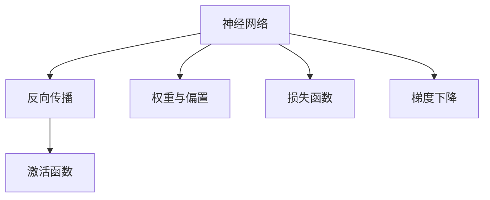
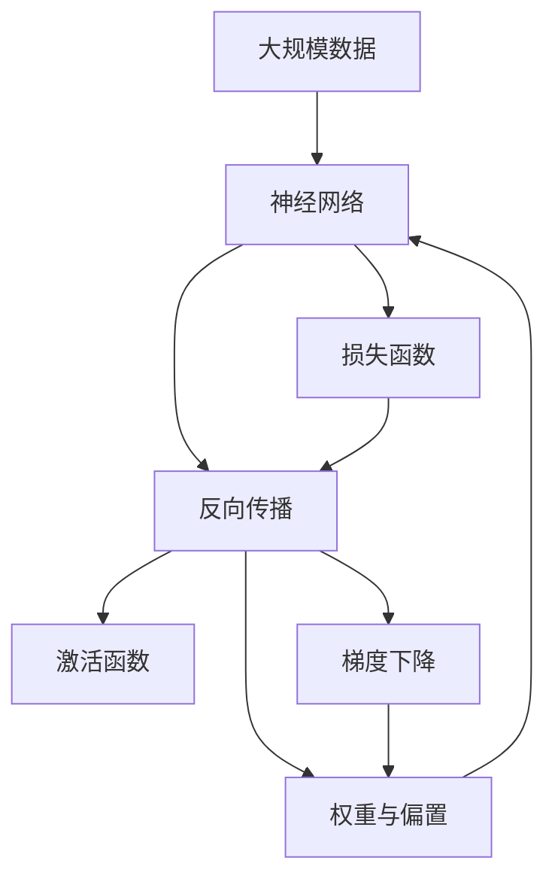

                 

# 神经网络：开启智能新纪元

在信息时代飞速发展的今天，人工智能（AI）正日益成为引领科技创新的核心力量。其中，神经网络（Neural Networks）作为AI领域的一项重要技术，以其强大的学习和模式识别能力，推动了智能技术在各个领域的应用与突破。本文将深入探讨神经网络的核心概念、算法原理与实践操作，并通过多个实例揭示其在不同领域中的应用前景，以期为AI领域的研究者和从业者提供理论与实践的全面指导。

## 1. 背景介绍

### 1.1 问题由来

随着大规模数据的不断积累和计算资源的迅速发展，神经网络技术在处理复杂非线性问题上展现出了无可匹敌的潜力。从图像识别、语音识别到自然语言处理，再到自动驾驶和机器人控制等领域，神经网络已经成为了人工智能的核心支柱。然而，尽管神经网络在许多领域取得了显著的进展，但其原理与操作方法仍处于快速发展与完善之中，深入理解和掌握神经网络技术是当前技术发展的重要方向。

### 1.2 问题核心关键点

神经网络的核心在于其多层结构与反向传播算法。神经网络由多个层次组成，每一层包含多个神经元，每个神经元接收输入并进行加权和，最终通过激活函数产生输出。反向传播算法则允许网络通过误差反馈机制调整权重，从而不断优化模型以逼近真实数据分布。此外，神经网络还可以通过微调（Fine-tuning）技术对特定任务进行优化，提升模型在特定领域的表现。

## 2. 核心概念与联系

### 2.1 核心概念概述

为更好地理解神经网络的核心原理与架构，本节将介绍几个密切相关的核心概念：

- **神经网络（Neural Network）**：一种由大量相互连接的神经元（Neuron）构成的多层网络结构，用于学习和处理复杂非线性问题。
- **反向传播（Backpropagation）**：一种用于训练神经网络的算法，通过误差反向传播机制调整网络权重，最小化损失函数。
- **激活函数（Activation Function）**：神经元输出时的非线性变换函数，如Sigmoid、ReLU等。
- **权重与偏置（Weights & Bias）**：神经元之间的连接权重和偏置，控制着神经元对输入信号的响应程度。
- **损失函数（Loss Function）**：用于衡量模型预测与真实值之间差异的函数，如均方误差、交叉熵等。
- **梯度下降（Gradient Descent）**：一种常用的优化算法，通过迭代更新权重和偏置，最小化损失函数。

### 2.2 概念间的关系

这些核心概念之间的联系可以通过以下Mermaid流程图来展示：



这个流程图展示了神经网络训练的基本流程：

1. 神经网络通过反向传播算法，利用权重和偏置控制神经元对输入的响应。
2. 激活函数将神经元输出转化为非线性特征。
3. 损失函数衡量预测与真实值之间的差异。
4. 梯度下降算法根据损失函数的变化调整权重和偏置，逐步优化模型性能。

### 2.3 核心概念的整体架构

最后，我们用一个综合的流程图来展示这些核心概念在大规模神经网络训练中的整体架构：



这个综合流程图展示了从数据输入到模型输出的完整过程，以及每个环节的具体功能与操作。

## 3. 核心算法原理 & 具体操作步骤
### 3.1 算法原理概述

神经网络的训练过程主要分为两个阶段：前向传播与反向传播。在前向传播阶段，输入数据通过网络进行计算，得到输出结果。在反向传播阶段，网络利用误差反向传播机制，调整权重和偏置，最小化损失函数。

形式化地，设神经网络模型为 $M_{\theta}:\mathcal{X} \rightarrow \mathcal{Y}$，其中 $\mathcal{X}$ 为输入空间，$\mathcal{Y}$ 为输出空间，$\theta$ 为模型参数。训练数据集为 $D=\{(x_i,y_i)\}_{i=1}^N$，训练过程的目标是找到最优参数 $\theta^*$，使得损失函数 $\mathcal{L}(\theta)$ 最小化。其中，损失函数 $\mathcal{L}(\theta)$ 定义为：

$$
\mathcal{L}(\theta) = \frac{1}{N} \sum_{i=1}^N \ell(M_{\theta}(x_i),y_i)
$$

其中，$\ell$ 为损失函数，如均方误差、交叉熵等。

### 3.2 算法步骤详解

神经网络的训练过程通常包括以下关键步骤：

**Step 1: 准备数据集**
- 收集并预处理训练数据集 $D=\{(x_i,y_i)\}_{i=1}^N$，其中 $x_i \in \mathcal{X}, y_i \in \mathcal{Y}$。

**Step 2: 初始化权重与偏置**
- 随机初始化神经网络各层的权重 $w$ 和偏置 $b$。

**Step 3: 前向传播**
- 将输入数据 $x$ 输入网络，通过各层的加权和与激活函数计算，得到最终输出 $y$。

**Step 4: 计算损失**
- 利用损失函数 $\ell$ 计算模型输出 $y$ 与真实值 $y_i$ 之间的差异，得到损失值 $\mathcal{L}(\theta)$。

**Step 5: 反向传播**
- 根据误差反向传播，计算各层神经元对损失的贡献，并更新权重和偏置。

**Step 6: 更新权重**
- 使用梯度下降算法，根据损失函数的梯度更新权重和偏置，使得损失函数 $\mathcal{L}(\theta)$ 逐渐减小。

**Step 7: 重复迭代**
- 重复执行前向传播、计算损失、反向传播与权重更新的过程，直至损失函数收敛。

### 3.3 算法优缺点

神经网络的优点包括：

- **强大的学习能力**：能够处理复杂非线性问题，适用于图像识别、语音识别、自然语言处理等领域。
- **并行计算优势**：利用GPU等硬件加速器，能够高效处理大规模数据。
- **灵活可扩展**：网络结构可以随意修改和扩展，适用于不同类型的问题。

神经网络的缺点包括：

- **计算资源需求高**：训练和推理过程中需要大量的计算资源和存储空间。
- **模型复杂度高**：神经网络结构复杂，难以解释和调试。
- **过拟合风险高**：需要大量的标注数据来避免过拟合。

### 3.4 算法应用领域

神经网络在多个领域中得到了广泛应用，以下是几个典型的应用场景：

- **图像识别**：通过卷积神经网络（Convolutional Neural Networks, CNNs），神经网络在图像分类、目标检测等任务中表现优异。
- **语音识别**：使用循环神经网络（Recurrent Neural Networks, RNNs）或变种如LSTM（Long Short-Term Memory）和Transformer，神经网络在语音识别、语音合成等任务中取得了显著进步。
- **自然语言处理**：通过编码器-解码器模型（Encoder-Decoder Models）和注意力机制（Attention Mechanism），神经网络在机器翻译、文本生成、情感分析等任务上取得了令人瞩目的成果。
- **自动驾驶**：利用深度神经网络处理传感器数据，实现环境感知、路径规划和决策优化等自动驾驶关键功能。
- **机器人控制**：通过神经网络对传感器数据进行学习和预测，实现机器人导航、避障、抓取等高级操作。

## 4. 数学模型和公式 & 详细讲解
### 4.1 数学模型构建

为了更深入地理解神经网络的工作原理，下面我们将使用数学语言对神经网络训练的数学模型进行严格刻画。

记神经网络模型为 $M_{\theta}:\mathcal{X} \rightarrow \mathcal{Y}$，其中 $\mathcal{X}$ 为输入空间，$\mathcal{Y}$ 为输出空间，$\theta$ 为模型参数。设训练数据集为 $D=\{(x_i,y_i)\}_{i=1}^N$，其中 $x_i \in \mathcal{X}, y_i \in \mathcal{Y}$。

定义模型 $M_{\theta}$ 在输入 $x$ 上的损失函数为 $\ell(M_{\theta}(x),y)$，则在数据集 $D$ 上的经验风险为：

$$
\mathcal{L}(\theta) = \frac{1}{N} \sum_{i=1}^N \ell(M_{\theta}(x_i),y_i)
$$

在训练过程中，我们使用梯度下降算法来最小化损失函数 $\mathcal{L}(\theta)$。设 $\eta$ 为学习率，$\theta_k$ 为模型第 $k$ 层的参数，则参数的更新公式为：

$$
\theta_k \leftarrow \theta_k - \eta \nabla_{\theta_k}\mathcal{L}(\theta)
$$

其中 $\nabla_{\theta_k}\mathcal{L}(\theta)$ 为损失函数对第 $k$ 层参数的梯度，可通过反向传播算法计算。

### 4.2 公式推导过程

以下我们以二分类任务为例，推导交叉熵损失函数及其梯度的计算公式。

假设模型 $M_{\theta}$ 在输入 $x$ 上的输出为 $\hat{y}=M_{\theta}(x) \in [0,1]$，表示样本属于正类的概率。真实标签 $y \in \{0,1\}$。则二分类交叉熵损失函数定义为：

$$
\ell(M_{\theta}(x),y) = -[y\log \hat{y} + (1-y)\log (1-\hat{y})]
$$

将其代入经验风险公式，得：

$$
\mathcal{L}(\theta) = -\frac{1}{N}\sum_{i=1}^N [y_i\log M_{\theta}(x_i)+(1-y_i)\log(1-M_{\theta}(x_i))]
$$

根据链式法则，损失函数对参数 $\theta_k$ 的梯度为：

$$
\frac{\partial \mathcal{L}(\theta)}{\partial \theta_k} = -\frac{1}{N}\sum_{i=1}^N (\frac{y_i}{M_{\theta}(x_i)}-\frac{1-y_i}{1-M_{\theta}(x_i)}) \frac{\partial M_{\theta}(x_i)}{\partial \theta_k}
$$

其中 $\frac{\partial M_{\theta}(x_i)}{\partial \theta_k}$ 可进一步递归展开，利用自动微分技术完成计算。

### 4.3 案例分析与讲解

这里以手写数字识别为例，展示神经网络在实际任务中的应用。

1. **数据预处理**：
   - 收集MNIST手写数字数据集，将其分为训练集和测试集。
   - 将图像数据进行归一化，转化为向量形式。

2. **模型设计**：
   - 设计一个三层神经网络模型，包含两个隐藏层，每个隐藏层有64个神经元。
   - 输入层与第一隐藏层之间是全连接层，第一隐藏层与第二隐藏层之间和第二隐藏层与输出层之间是卷积层。

3. **训练过程**：
   - 随机初始化权重和偏置。
   - 使用反向传播算法更新权重和偏置，最小化交叉熵损失函数。
   - 使用梯度下降算法，逐步优化模型参数。

4. **测试与评估**：
   - 在测试集上评估模型性能，使用准确率和混淆矩阵等指标。
   - 分析模型在各种数字上的识别效果，改进模型结构。

通过上述过程，神经网络能够从训练数据中学习到手写数字的特征表示，并在测试数据上取得较高的识别准确率。

## 5. 项目实践：代码实例和详细解释说明
### 5.1 开发环境搭建

在进行神经网络项目实践前，我们需要准备好开发环境。以下是使用Python进行PyTorch开发的环境配置流程：

1. 安装Anaconda：从官网下载并安装Anaconda，用于创建独立的Python环境。

2. 创建并激活虚拟环境：
```bash
conda create -n pytorch-env python=3.8 
conda activate pytorch-env
```

3. 安装PyTorch：根据CUDA版本，从官网获取对应的安装命令。例如：
```bash
conda install pytorch torchvision torchaudio cudatoolkit=11.1 -c pytorch -c conda-forge
```

4. 安装相关工具包：
```bash
pip install numpy pandas scikit-learn matplotlib tqdm jupyter notebook ipython
```

完成上述步骤后，即可在`pytorch-env`环境中开始神经网络项目实践。

### 5.2 源代码详细实现

这里我们以手写数字识别为例，给出使用PyTorch实现神经网络的完整代码实现。

首先，定义手写数字识别任务的训练数据集和测试数据集：

```python
import torch
from torch.utils.data import Dataset, DataLoader
from torchvision import transforms
from torchvision.datasets import MNIST

class MNISTDataset(Dataset):
    def __init__(self, root, train=True, transform=None):
        self.root = root
        self.train = train
        self.transform = transform
        self.train_set = MNIST(root, train=train, download=True)
        self.train_labels = self.train_set.train_labels
        self.test_set = MNIST(root, train=False, download=True)
        self.test_labels = self.test_set.test_labels
        
    def __len__(self):
        return len(self.train_set) if self.train else len(self.test_set)
    
    def __getitem__(self, idx):
        if self.train:
            img, label = self.train_set[idx]
        else:
            img, label = self.test_set[idx]
        
        if self.transform:
            img = self.transform(img)
        
        return img, label

# 定义数据预处理
transform = transforms.Compose([
    transforms.ToTensor(),
    transforms.Normalize((0.5,), (0.5,))
])

# 加载数据集
train_dataset = MNISTDataset(root='data/', train=True, transform=transform)
test_dataset = MNISTDataset(root='data/', train=False, transform=transform)
```

然后，定义神经网络模型和损失函数：

```python
import torch.nn as nn
import torch.nn.functional as F

class Net(nn.Module):
    def __init__(self):
        super(Net, self).__init__()
        self.conv1 = nn.Conv2d(1, 64, 3, 1)
        self.conv2 = nn.Conv2d(64, 64, 3, 1)
        self.dropout1 = nn.Dropout2d(0.25)
        self.dropout2 = nn.Dropout2d(0.5)
        self.fc1 = nn.Linear(9216, 128)
        self.fc2 = nn.Linear(128, 10)
    
    def forward(self, x):
        x = self.conv1(x)
        x = F.relu(x)
        x = self.conv2(x)
        x = F.relu(x)
        x = F.max_pool2d(x, 2)
        x = self.dropout1(x)
        x = torch.flatten(x, 1)
        x = self.fc1(x)
        x = F.relu(x)
        x = self.dropout2(x)
        x = self.fc2(x)
        output = F.log_softmax(x, dim=1)
        return output

# 定义损失函数
criterion = nn.CrossEntropyLoss()
```

接着，定义训练和评估函数：

```python
import torch.optim as optim

def train_model(model, train_loader, test_loader, num_epochs, batch_size, learning_rate):
    optimizer = optim.Adam(model.parameters(), lr=learning_rate)
    train_loss = 0
    train_correct = 0
    test_loss = 0
    test_correct = 0
    device = torch.device('cuda' if torch.cuda.is_available() else 'cpu')
    model.to(device)
    
    for epoch in range(num_epochs):
        model.train()
        for data, target in train_loader:
            data, target = data.to(device), target.to(device)
            optimizer.zero_grad()
            output = model(data)
            loss = criterion(output, target)
            loss.backward()
            optimizer.step()
            train_loss += loss.item()
            _, predicted = output.max(1)
            train_correct += (predicted == target).sum().item()
        
        model.eval()
        with torch.no_grad():
            for data, target in test_loader:
                data, target = data.to(device), target.to(device)
                output = model(data)
                loss = criterion(output, target)
                test_loss += loss.item()
                _, predicted = output.max(1)
                test_correct += (predicted == target).sum().item()
        
        train_loss /= len(train_loader.dataset)
        train_acc = 100. * train_correct / len(train_loader.dataset)
        test_loss /= len(test_loader.dataset)
        test_acc = 100. * test_correct / len(test_loader.dataset)
        
        print('Epoch [%d/%d], Train Loss: %.4f, Train Acc: %.2f, Test Loss: %.4f, Test Acc: %.2f' 
              % (epoch+1, num_epochs, train_loss, train_acc, test_loss, test_acc))
        
    print('Training completed.')
    
def evaluate_model(model, test_loader):
    model.eval()
    with torch.no_grad():
        correct = 0
        total = 0
        for data, target in test_loader:
            data, target = data.to(device), target.to(device)
            output = model(data)
            _, predicted = output.max(1)
            total += target.size(0)
            correct += (predicted == target).sum().item()
    
    print('Test Accuracy of the model on the 10000 test images: %d %% (%d/%d)' % (100. * correct / total, correct, total))
```

最后，启动训练流程并在测试集上评估：

```python
import matplotlib.pyplot as plt

num_epochs = 10
batch_size = 64
learning_rate = 0.001

train_loader = DataLoader(train_dataset, batch_size=batch_size, shuffle=True)
test_loader = DataLoader(test_dataset, batch_size=batch_size, shuffle=False)

model = Net()
train_model(model, train_loader, test_loader, num_epochs, batch_size, learning_rate)
evaluate_model(model, test_loader)
```

以上就是使用PyTorch实现手写数字识别任务的完整代码实现。可以看到，得益于PyTorch的强大封装和自动计算图机制，神经网络的实现变得简洁高效。

### 5.3 代码解读与分析

让我们再详细解读一下关键代码的实现细节：

**MNISTDataset类**：
- `__init__`方法：初始化数据集，读取并加载训练集和测试集。
- `__len__`方法：返回数据集的样本数量。
- `__getitem__`方法：对单个样本进行处理，将图像数据转化为Tensor形式，并进行标准化处理。

**Net类**：
- `__init__`方法：定义神经网络结构，包含两个卷积层、两个全连接层和两个Dropout层。
- `forward`方法：定义前向传播过程，包括卷积、激活、池化、全连接等操作。

**train_model函数**：
- 定义Adam优化器，设置学习率。
- 对训练集和测试集分别进行前向传播和反向传播，计算损失函数。
- 记录训练和测试的损失和准确率，并输出结果。

**evaluate_model函数**：
- 对测试集进行前向传播，计算准确率。
- 输出测试集上的准确率。

**训练流程**：
- 定义总的epoch数、批大小和学习率，开始循环迭代。
- 每个epoch内，先在训练集上训练，输出平均损失和准确率。
- 在测试集上评估，输出平均损失和准确率。
- 所有epoch结束后，在测试集上评估，给出最终测试结果。

可以看到，PyTorch配合自动微分技术使得神经网络的实现变得简单直接，开发者可以更加专注于模型结构和算法优化。当然，工业级的系统实现还需考虑更多因素，如模型裁剪、量化加速、服务化封装等，但核心的训练过程基本与此类似。

## 6. 实际应用场景
### 6.1 图像识别

神经网络在图像识别领域取得了巨大的成功，如图像分类、目标检测、图像分割等任务。其广泛应用于安防监控、自动驾驶、工业检测等领域，提升了自动化水平和生产效率。

**实际应用案例**：
- **安防监控**：利用深度神经网络对监控视频进行分析，实现人脸识别、行为分析等功能，提升公共安全。
- **自动驾驶**：通过摄像头和雷达数据，使用神经网络进行环境感知和路径规划，实现自动驾驶系统。
- **工业检测**：在生产线上使用神经网络进行质量检测和缺陷识别，提高产品质量和生产效率。

### 6.2 语音识别

神经网络在语音识别领域也取得了显著进展，如自动语音识别（ASR）和语音合成（TTS）等。其广泛应用于智能助手、语音交互、电话客服等领域，提升了用户体验和交互效率。

**实际应用案例**：
- **智能助手**：利用神经网络对语音命令进行理解和处理，实现语音控制智能家居、办公软件等功能。
- **语音交互**：通过自然语言理解技术，实现语音搜索、语音翻译等功能，提升语音交互的流畅性和自然度。
- **电话客服**：利用神经网络进行语音识别和情感分析，提升客服系统的自动化水平和响应速度。

### 6.3 自然语言处理

神经网络在自然语言处理（NLP）领域的应用非常广泛，如机器翻译、情感分析、文本生成等任务。其广泛应用于智能问答、自动摘要、文本理解等领域，提升了信息处理和分析效率。

**实际应用案例**：
- **智能问答**：利用神经网络进行自然语言理解和生成，实现智能客服、智能助手等功能。
- **自动摘要**：通过神经网络对长文本进行摘要和归纳，提升信息获取效率。
- **文本理解**：使用神经网络进行情感分析、实体识别等任务，提升文本处理和分析能力。

### 6.4 未来应用展望

未来，神经网络将在更多领域得到应用，推动智能技术进一步发展：

1. **医疗领域**：通过神经网络进行疾病诊断、治疗方案推荐等任务，提升医疗服务的智能化水平。
2. **金融领域**：利用神经网络进行风险评估、股票预测等任务，提升金融决策的智能化水平。
3. **教育领域**：通过神经网络进行个性化学习、自动评卷等任务，提升教育服务的智能化水平。
4. **智能家居**：利用神经网络进行环境感知、智能控制等任务，提升家居生活的智能化水平。

总之，神经网络技术在各个领域的应用前景广阔，未来的发展潜力巨大，将为人类生产和生活带来深刻的变革。

## 7. 工具和资源推荐
### 7.1 学习资源推荐

为了帮助开发者系统掌握神经网络理论基础和实践技巧，这里推荐一些优质的学习资源：

1. **《深度学习》课程**：斯坦福大学Andrew Ng教授开设的深度学习课程，内容全面，覆盖深度学习各个方面。

2. **《Python深度学习》书籍**：Francois Chollet所著，详细介绍了使用Keras实现深度学习的各个方面。

3. **TensorFlow官方文档**：TensorFlow的官方文档，提供了丰富的学习资源和样例代码，是入门TensorFlow的重要资料。

4. **PyTorch官方文档**：PyTorch的官方文档，提供了详细的API和样例代码，是使用PyTorch的重要参考。

5. **DeepLearning.ai官方文档**：DeepLearning.ai的官方文档，提供了从入门到进阶的深度学习学习路线。

通过对这些资源的学习实践，相信你一定能够快速掌握神经网络的精髓，并用于解决实际的AI问题。

### 7.2 开发工具推荐

高效的开发离不开优秀的工具支持。以下是几款用于神经网络开发的常用工具：

1. **PyTorch**：由Facebook开发的开源深度学习框架，提供了丰富的深度学习组件和自动微分功能，是深度学习研究的主流框架之一。

2. **TensorFlow**：由Google主导开发的开源深度学习框架，支持分布式训练和推理，适合大规模工程应用。

3. **Keras**：由Francois Chollet开发的高级深度学习框架，提供了简单易用的API，适合快速原型开发和实验。

4. **MXNet**：由亚马逊开发的深度学习框架，支持多种编程语言，提供了高效的计算图和分布式训练功能。

5. **Caffe**：由伯克利视觉学习中心开发的深度学习框架，适合图像处理和计算机视觉任务。

合理利用这些工具，可以显著提升神经网络的开发效率，加快创新迭代的步伐。

### 7.3 相关论文推荐

神经网络技术的发展源于学界的持续研究。以下是几篇奠基性的相关论文，推荐阅读：

1. **AlexNet**：ImageNet比赛2012年的冠军模型，开启了深度学习在图像识别领域的应用。

2. **VGG**：ImageNet比赛2014年的冠军模型，使用多层卷积结构提升了模型的准确率。

3. **ResNet**：ImageNet比赛2015年的冠军模型，使用残差连接解决了深层网络训练过程中的梯度消失问题。

4. **Inception**：使用多尺度卷积结构提升模型的准确率和效率，是深度学习中重要的

