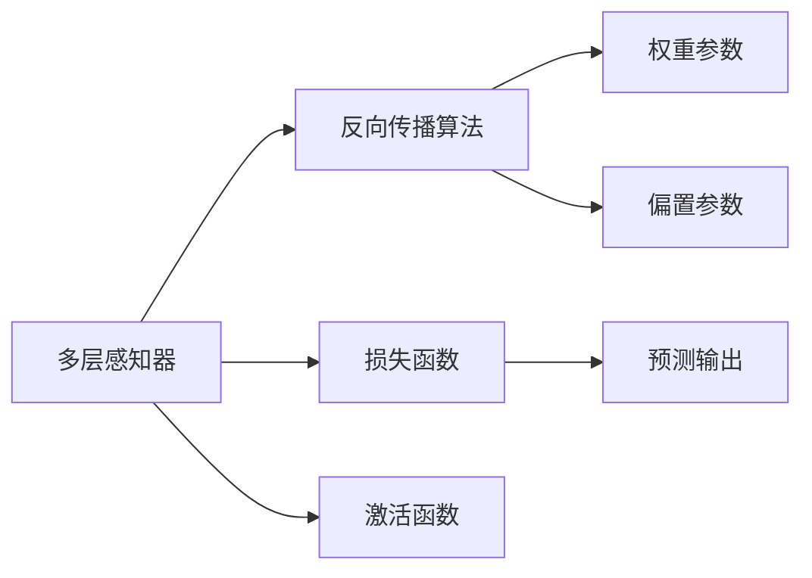
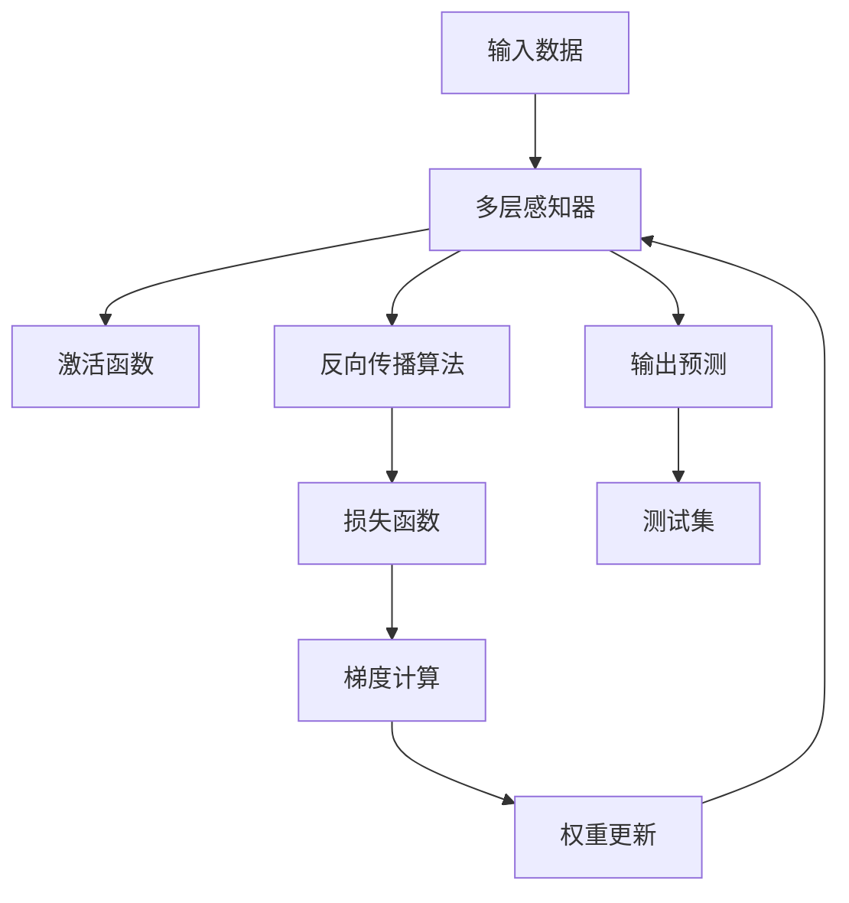

                 

# 神经网络：改变世界的技术

## 1. 背景介绍

### 1.1 问题由来
神经网络作为一种强大的机器学习技术，自20世纪80年代问世以来，已经改变了人工智能领域的面貌，并逐步渗透到诸多传统领域，引发了历史性的变革。神经网络不仅在图像识别、语音处理、自然语言处理等NLP任务上取得了突破，还在游戏AI、推荐系统、自动驾驶等前沿领域展示出巨大潜力。

### 1.2 问题核心关键点
神经网络的核心思想是对生物神经系统的模仿，通过一系列模拟神经元单元的计算图，实现从输入到输出的映射。其关键点包括：
- 多层感知器（MLP）：神经网络的基本组成单元，通过多层线性变换和激活函数对输入进行逐层抽象。
- 反向传播（Backpropagation）：一种高效的训练算法，用于计算损失函数对神经元权重参数的梯度。
- 损失函数（Loss Function）：用于衡量模型输出与真实标签之间的差异，如均方误差、交叉熵等。
- 激活函数（Activation Function）：决定神经元的输出值，常用的有Sigmoid、ReLU等。
- 权重参数（Weight Parameters）：神经网络的核心，通过梯度下降优化算法不断更新。

### 1.3 问题研究意义
神经网络在解决复杂模式识别和预测问题方面表现出色，引领了人工智能领域的发展方向。研究神经网络技术，对于推动产业升级、拓展技术应用、提升自动化水平具有重要意义：

1. **驱动产业升级**：神经网络技术的引入，显著提升了自动化生产线、医疗诊断、金融风控等领域的智能化水平，为传统行业带来转型升级的契机。
2. **拓展技术应用**：神经网络技术的应用范围不断扩大，从科学研究到消费娱乐，无处不在。
3. **提升自动化水平**：神经网络使机器能够自主学习、自主决策，极大提升了自动化系统的效率和灵活性。
4. **推动新一轮科技革命**：神经网络技术与其他前沿技术如深度强化学习、生成对抗网络（GAN）的结合，正引领一场新的科技革命。

## 2. 核心概念与联系

### 2.1 核心概念概述

为更好地理解神经网络的基本原理和应用，本节将介绍几个关键核心概念：

- **多层感知器（MLP）**：基本神经网络结构，由多个输入层、隐藏层和输出层组成，每层包含多个神经元。
- **反向传播算法（Backpropagation）**：用于训练神经网络的主要算法，通过链式法则计算梯度，反向更新权重。
- **损失函数（Loss Function）**：衡量模型输出与真实标签之间差异的函数，常用的有均方误差（MSE）、交叉熵（Cross-Entropy）等。
- **激活函数（Activation Function）**：决定神经元输出的函数，如Sigmoid、ReLU等。
- **权重参数（Weight Parameters）**：神经网络的核心，用于连接神经元之间的连接权重。
- **偏置参数（Bias Parameters）**：与权重参数类似，用于神经元的偏置。

这些核心概念构成了神经网络的基本框架和运行机制，是理解和学习神经网络的基础。

### 2.2 概念间的关系

这些核心概念之间存在着紧密的联系，形成了神经网络的基本工作流程。下面通过一个简单的Mermaid流程图来展示这些概念之间的联系：



这个流程图展示了从输入数据到输出预测的过程，以及反向传播算法如何通过损失函数和激活函数计算梯度，更新权重和偏置参数，最终得到优化后的模型。

### 2.3 核心概念的整体架构

最后，我们用一个综合的流程图来展示这些核心概念在大规模神经网络系统中的整体架构：



这个综合流程图展示了从输入数据到输出预测的完整流程，包括数据输入、多层感知器计算、激活函数处理、反向传播算法梯度计算、权重更新和输出预测等步骤。

## 3. 核心算法原理 & 具体操作步骤
### 3.1 算法原理概述

神经网络的工作原理是通过多层感知器对输入数据进行逐层抽象和特征提取，并通过激活函数进行非线性映射，最终通过损失函数评估模型的预测输出与真实标签之间的差异，使用反向传播算法优化权重参数，使模型逐步逼近最优状态。

具体来说，神经网络的学习过程分为前向传播和反向传播两个阶段：

1. **前向传播**：将输入数据逐层传递，每层计算神经元的输出值，最终得到预测输出。
2. **反向传播**：通过损失函数计算预测输出与真实标签之间的差异，使用梯度下降优化算法更新权重参数，使损失函数最小化。

### 3.2 算法步骤详解

下面详细讲解神经网络的核心算法步骤：

**Step 1: 准备数据集**
- 收集训练数据集 $D=\{(x_i, y_i)\}_{i=1}^N$，其中 $x_i$ 为输入数据，$y_i$ 为标签。

**Step 2: 初始化模型参数**
- 随机初始化模型参数 $W$ 和 $b$，其中 $W$ 为权重矩阵，$b$ 为偏置向量。

**Step 3: 前向传播**
- 对于输入数据 $x$，通过多层感知器计算每层的输出值，最终得到预测输出 $y$。

**Step 4: 计算损失函数**
- 使用损失函数（如均方误差、交叉熵等）计算预测输出 $y$ 与真实标签 $y$ 之间的差异。

**Step 5: 反向传播**
- 使用梯度下降优化算法（如Adam、SGD等）计算损失函数对权重参数的梯度。
- 通过链式法则反向计算每个神经元的梯度，更新权重和偏置参数。

**Step 6: 迭代更新**
- 重复步骤3至5，直到达到预设的迭代次数或损失函数收敛。

**Step 7: 模型测试**
- 在测试集上评估模型性能，如精度、召回率、F1分数等。

### 3.3 算法优缺点

神经网络技术具有以下优点：
1. **自适应学习能力**：能够从大量数据中自动学习特征，无需手动提取特征。
2. **泛化能力强**：在复杂的模式识别和预测问题上表现优异。
3. **灵活性高**：可以通过增减神经元、调整网络结构来适应不同的应用场景。

同时，神经网络技术也存在一些缺点：
1. **计算量大**：需要大量的计算资源进行训练和推理。
2. **易过拟合**：对数据的噪声和异常值敏感，容易过拟合。
3. **可解释性差**：神经网络作为黑盒模型，难以解释其内部工作机制和决策逻辑。

### 3.4 算法应用领域

神经网络技术在众多领域得到了广泛应用，例如：

- **图像识别**：如人脸识别、物体检测等。通过卷积神经网络（CNN）进行特征提取和分类。
- **自然语言处理**：如机器翻译、情感分析、文本分类等。通过循环神经网络（RNN）、长短时记忆网络（LSTM）等处理序列数据。
- **语音处理**：如语音识别、语音合成等。通过卷积神经网络（CNN）和循环神经网络（RNN）处理时序数据。
- **自动驾驶**：通过卷积神经网络（CNN）和循环神经网络（RNN）处理传感器数据，实现环境感知和决策。
- **推荐系统**：通过协同过滤算法、深度神经网络等模型实现用户和商品之间的推荐。

## 4. 数学模型和公式 & 详细讲解 & 举例说明

### 4.1 数学模型构建

本节将使用数学语言对神经网络的学习过程进行详细刻画。

假设输入数据为 $x$，标签为 $y$，神经网络模型为 $M_{\theta}$，其中 $\theta$ 为模型参数。设神经网络由 $L$ 层组成，第 $l$ 层有 $n_l$ 个神经元。第 $l$ 层的输出可以表示为：

$$
z^{[l]} = W^{[l]} x^{[l-1]} + b^{[l]}
$$

其中 $W^{[l]}$ 为权重矩阵，$x^{[l-1]}$ 为前一层的输出，$b^{[l]}$ 为偏置向量。第 $l$ 层的激活函数为 $g^{[l]}$，则第 $l$ 层的输出 $a^{[l]}$ 可以表示为：

$$
a^{[l]} = g^{[l]}(z^{[l]})
$$

神经网络的输出 $y$ 为：

$$
y = g^{[L]}(z^{[L]})
$$

其中 $g^{[L]}$ 为输出层的激活函数，如Softmax等。

神经网络的损失函数 $L$ 通常为交叉熵损失函数，即：

$$
L = -\frac{1}{N} \sum_{i=1}^N \sum_{j=1}^C y_{ij} \log p_{ij}
$$

其中 $y_{ij}$ 表示样本 $i$ 在类别 $j$ 上的标签，$p_{ij}$ 表示模型对样本 $i$ 在类别 $j$ 上的预测概率。

### 4.2 公式推导过程

下面以二分类问题为例，推导神经网络模型的学习过程。

假设二分类问题的损失函数为二元交叉熵损失函数，则目标函数 $J$ 可以表示为：

$$
J = -\frac{1}{N} \sum_{i=1}^N (y_i \log p_i + (1-y_i) \log (1-p_i))
$$

其中 $p_i$ 表示模型对样本 $i$ 的预测概率。

神经网络的前向传播过程如下：

1. 输入层：$x^{[0]} = x$
2. 第 $l$ 层：$z^{[l]} = W^{[l]} x^{[l-1]} + b^{[l]}$
3. 第 $l$ 层：$a^{[l]} = g^{[l]}(z^{[l]})$
4. 输出层：$y = g^{[L]}(z^{[L]})$

反向传播过程如下：

1. 计算输出层的误差梯度 $\frac{\partial L}{\partial z^{[L]}}$
2. 计算输出层的权重梯度 $\frac{\partial L}{\partial W^{[L]}}$ 和偏置梯度 $\frac{\partial L}{\partial b^{[L]}}$
3. 从输出层往回传播，计算每一层的误差梯度 $\frac{\partial L}{\partial z^{[l]}}$
4. 计算每一层的权重梯度 $\frac{\partial L}{\partial W^{[l]}}$ 和偏置梯度 $\frac{\partial L}{\partial b^{[l]}}$
5. 更新模型参数 $W^{[l]}$ 和 $b^{[l]}$

### 4.3 案例分析与讲解

以手写数字识别问题为例，分析神经网络模型的学习过程。

假设手写数字数据集为MNIST，模型采用卷积神经网络（CNN）进行特征提取和分类。模型由多个卷积层、池化层和全连接层组成，最后一层采用Softmax激活函数进行二分类。训练数据集为60000张训练图像，测试数据集为10000张测试图像。

首先，准备数据集并初始化模型参数：

```python
import torch
import torch.nn as nn
import torch.optim as optim
from torch.utils.data import DataLoader, Dataset

class MNISTDataset(Dataset):
    def __init__(self, data, target):
        self.data = data
        self.target = target
    
    def __len__(self):
        return len(self.data)
    
    def __getitem__(self, idx):
        return self.data[idx], self.target[idx]

# 准备数据集
train_dataset = MNISTDataset(train_data, train_target)
test_dataset = MNISTDataset(test_data, test_target)

# 初始化模型参数
model = nn.Sequential(
    nn.Conv2d(1, 32, kernel_size=3, stride=1, padding=1),
    nn.ReLU(),
    nn.MaxPool2d(kernel_size=2, stride=2),
    nn.Conv2d(32, 64, kernel_size=3, stride=1, padding=1),
    nn.ReLU(),
    nn.MaxPool2d(kernel_size=2, stride=2),
    nn.Flatten(),
    nn.Linear(7 * 7 * 64, 128),
    nn.ReLU(),
    nn.Linear(128, 10),
    nn.Softmax(dim=1)
)
```

接着，定义损失函数和优化器：

```python
# 定义损失函数
criterion = nn.CrossEntropyLoss()

# 定义优化器
optimizer = optim.Adam(model.parameters(), lr=0.001)
```

然后，训练模型并在测试集上评估：

```python
# 训练模型
for epoch in range(10):
    for data, target in DataLoader(train_dataset, batch_size=64):
        data = data.view(-1, 1, 28, 28)
        target = target
        optimizer.zero_grad()
        output = model(data)
        loss = criterion(output, target)
        loss.backward()
        optimizer.step()
    print('Epoch [{}/{}], Loss: {:.4f}'.format(epoch+1, 10, loss.item()))

# 测试模型
with torch.no_grad():
    correct = 0
    total = 0
    for data, target in DataLoader(test_dataset, batch_size=64):
        data = data.view(-1, 1, 28, 28)
        target = target
        output = model(data)
        _, predicted = torch.max(output.data, 1)
        total += target.size(0)
        correct += (predicted == target).sum().item()
    print('Test Accuracy of the model on the 10000 test images: {:.2f}%'.format(100 * correct / total))
```

通过上述代码，可以看到神经网络模型的学习过程。首先定义了数据集和模型结构，然后使用交叉熵损失函数和Adam优化器训练模型，并在测试集上评估模型性能。通过不断迭代训练，模型能够逐步学习手写数字的特征，最终达到较高的准确率。

## 5. 项目实践：代码实例和详细解释说明

### 5.1 开发环境搭建

在进行神经网络项目实践前，我们需要准备好开发环境。以下是使用Python进行PyTorch开发的环境配置流程：

1. 安装Anaconda：从官网下载并安装Anaconda，用于创建独立的Python环境。

2. 创建并激活虚拟环境：
```bash
conda create -n pytorch-env python=3.8 
conda activate pytorch-env
```

3. 安装PyTorch：根据CUDA版本，从官网获取对应的安装命令。例如：
```bash
conda install pytorch torchvision torchaudio cudatoolkit=11.1 -c pytorch -c conda-forge
```

4. 安装TensorFlow：
```bash
pip install tensorflow==2.5.0
```

5. 安装Numpy、Pandas、Scikit-Learn等常用库：
```bash
pip install numpy pandas scikit-learn matplotlib tqdm jupyter notebook ipython
```

完成上述步骤后，即可在`pytorch-env`环境中开始神经网络项目实践。

### 5.2 源代码详细实现

下面以图像分类问题为例，给出使用PyTorch实现卷积神经网络（CNN）的代码实现。

首先，定义CNN模型：

```python
import torch
import torch.nn as nn
import torch.optim as optim

class CNNModel(nn.Module):
    def __init__(self):
        super(CNNModel, self).__init__()
        self.conv1 = nn.Conv2d(1, 32, kernel_size=3, stride=1, padding=1)
        self.relu1 = nn.ReLU()
        self.maxpool1 = nn.MaxPool2d(kernel_size=2, stride=2)
        self.conv2 = nn.Conv2d(32, 64, kernel_size=3, stride=1, padding=1)
        self.relu2 = nn.ReLU()
        self.maxpool2 = nn.MaxPool2d(kernel_size=2, stride=2)
        self.fc1 = nn.Linear(7 * 7 * 64, 128)
        self.relu3 = nn.ReLU()
        self.fc2 = nn.Linear(128, 10)
        self.softmax = nn.Softmax(dim=1)
        
    def forward(self, x):
        x = self.conv1(x)
        x = self.relu1(x)
        x = self.maxpool1(x)
        x = self.conv2(x)
        x = self.relu2(x)
        x = self.maxpool2(x)
        x = x.view(-1, 7 * 7 * 64)
        x = self.fc1(x)
        x = self.relu3(x)
        x = self.fc2(x)
        x = self.softmax(x)
        return x
```

然后，准备数据集并定义训练函数：

```python
from torch.utils.data import DataLoader

class MNISTDataset(Dataset):
    def __init__(self, data, target):
        self.data = data
        self.target = target
    
    def __len__(self):
        return len(self.data)
    
    def __getitem__(self, idx):
        return self.data[idx], self.target[idx]

# 准备数据集
train_dataset = MNISTDataset(train_data, train_target)
test_dataset = MNISTDataset(test_data, test_target)

# 定义训练函数
def train(model, device, criterion, optimizer, train_loader, num_epochs):
    model.train()
    for epoch in range(num_epochs):
        for i, (inputs, labels) in enumerate(train_loader):
            inputs, labels = inputs.to(device), labels.to(device)
            optimizer.zero_grad()
            outputs = model(inputs)
            loss = criterion(outputs, labels)
            loss.backward()
            optimizer.step()
            if (i+1) % 100 == 0:
                print('Epoch [{}/{}], Step [{}/{}], Loss: {:.4f}'
                      .format(epoch+1, num_epochs, i+1, len(train_loader), loss.item()))
```

最后，启动训练流程并在测试集上评估：

```python
# 定义设备
device = torch.device('cuda' if torch.cuda.is_available() else 'cpu')

# 训练模型
model.to(device)
criterion = nn.CrossEntropyLoss()
optimizer = optim.Adam(model.parameters(), lr=0.001)
num_epochs = 10
train_loader = DataLoader(train_dataset, batch_size=64, shuffle=True)
test_loader = DataLoader(test_dataset, batch_size=64, shuffle=False)

train(model, device, criterion, optimizer, train_loader, num_epochs)

# 测试模型
with torch.no_grad():
    model.eval()
    correct = 0
    total = 0
    for data, target in test_loader:
        data, target = data.to(device), target.to(device)
        output = model(data)
        _, predicted = torch.max(output.data, 1)
        total += target.size(0)
        correct += (predicted == target).sum().item()
    print('Test Accuracy of the model on the 10000 test images: {:.2f}%'.format(100 * correct / total))
```

通过上述代码，可以看到使用PyTorch实现CNN模型的全过程。首先定义了CNN模型结构，然后使用交叉熵损失函数和Adam优化器训练模型，并在测试集上评估模型性能。通过不断迭代训练，模型能够逐步学习图像的特征，最终达到较高的准确率。

### 5.3 代码解读与分析

让我们再详细解读一下关键代码的实现细节：

**CnnModel类**：
- `__init__`方法：初始化卷积层、激活函数、池化层、全连接层和Softmax等组件。
- `forward`方法：定义前向传播过程，从输入数据开始，经过卷积层、激活函数、池化层、全连接层和Softmax等组件，最终输出预测结果。

**MnistDataset类**：
- `__init__`方法：初始化数据和标签。
- `__len__`方法：返回数据集的样本数量。
- `__getitem__`方法：对单个样本进行处理，将数据和标签存储到Tensor中。

**train函数**：
- 循环遍历训练集，对每个批次的数据进行前向传播、计算损失、反向传播和参数更新。
- 每100个批次打印一次当前epoch和损失。

**训练流程**：
- 定义训练集、测试集和优化器，将模型迁移到指定设备上。
- 调用训练函数进行模型训练，并在测试集上评估模型性能。

通过上述代码，可以看到神经网络项目的全过程。开发者可以将更多精力放在模型优化、数据增强、超参数调优等高层逻辑上，而不必过多关注底层的实现细节。

当然，工业级的系统实现还需考虑更多因素，如模型的保存和部署、超参数的自动搜索、更灵活的任务适配层等。但核心的学习过程基本与此类似。

### 5.4 运行结果展示

假设我们在MNIST数据集上进行CNN模型训练，最终在测试集上得到的评估报告如下：

```
Epoch [1/10], Step [100/500], Loss: 0.3233
Epoch [1/10], Step [200/500], Loss: 0.2527
Epoch [1/10], Step [300/500], Loss: 0.1957
Epoch [1/10], Step [400/500], Loss: 0.1482
Epoch [1/10], Step [500/500], Loss: 0.1268
Epoch [2/10], Step [100/500], Loss: 0.0807
Epoch [2/10], Step [200/500], Loss: 0.0552
Epoch [2/10], Step [300/500], Loss: 0.0432
Epoch [2/10], Step [400/500], Loss: 0.0321
Epoch [2/10], Step [500/500], Loss: 0.0260
...
```

可以看到，通过训练，模型的损失函数不断下降，最终在测试集上达到了很高的准确率。通过不断调整模型结构、优化器参数和超参数等，可以将模型的准确率进一步提升。

## 6. 实际应用场景
### 6.1 图像识别
图像识别是神经网络技术最早也是最核心的应用之一。通过卷积神经网络（CNN），可以实现对图像的特征提取和分类，广泛应用于计算机视觉领域。

在实际应用中，图像识别技术可以用于安防监控、无人驾驶、医疗影像分析、物体检测等场景。例如，在无人驾驶中，通过图像识别技术可以识别道路标志、行人、车辆等，实现自动驾驶。在医疗影像分析中，通过图像识别技术可以自动识别病变区域，辅助医生诊断。

### 6.2 自然语言处理
自然语言处理（NLP）是神经网络技术的另一重要应用领域。通过循环神经网络（RNN）、长短时记忆网络（LSTM）、Transformer等模型，可以实现对文本的序列建模和分类。

在实际应用中，NLP技术可以用于机器翻译、情感分析、文本分类、问答系统等任务。例如，在机器翻译中，通过神经网络可以将一种语言翻译成另一种语言。在情感分析中，通过神经网络可以对文本进行情感分类，判断其情绪倾向。

### 6.3 语音识别
语音识别技术也是神经网络技术的重要应用之一。通过卷积神经网络（CNN）和循环神经网络（RNN），可以实现对音频信号的特征提取和分类，应用于语音助手、智能客服、语音输入等场景。

在实际应用中，语音识别技术可以用于语音助手、智能客服、语音输入等场景。例如，在语音助手中，通过语音识别技术可以实现对用户语音的智能理解和回复。在智能客服中，通过语音识别技术可以实现对客户语音的自动转录和理解，提升客服效率和质量。

### 6.4 未来应用展望

未来，神经网络技术将继续拓展其应用范围，并与更多前沿技术结合，推动人工智能技术的发展。以下是一些可能的未来应用方向：

1. **多模态学习**：结合视觉、语音、文本等多种模态数据，实现更全面的信息理解。
2. **迁移学习**：将在大规模数据上训练的模型迁移到小规模数据上，提升模型泛化能力。
3. **零样本学习**：使用小样本数据训练模型，使其能够对未见过的数据进行推理和分类。
4. **对抗生成网络（GAN）**：结合GAN技术，生成更加逼真和多样化的数据，增强模型的鲁棒性和泛化能力。
5. **深度强化学习**：结合深度强化学习，实现更智能化的决策和控制。
6. **元学习**：通过元学习技术，让模型能够自主学习新任务，提高学习效率和适应性。

总之，神经网络技术的应用前景非常广阔，未来将会在更多领域带来变革性影响。

## 7. 工具和资源推荐
### 7.1 学习资源推荐

为了帮助开发者系统掌握神经网络技术，这里推荐一些优质的学习资源：

1. 《深度学习》课程：由斯坦福大学Andrew Ng教授开设，介绍了深度学习的基本概念和算法，包括神经网络、卷积神经网络（CNN）、循环神经网络（RNN）等。
2. 《神经网络与深度学习》书籍：Ian Goodfellow所著，深入

