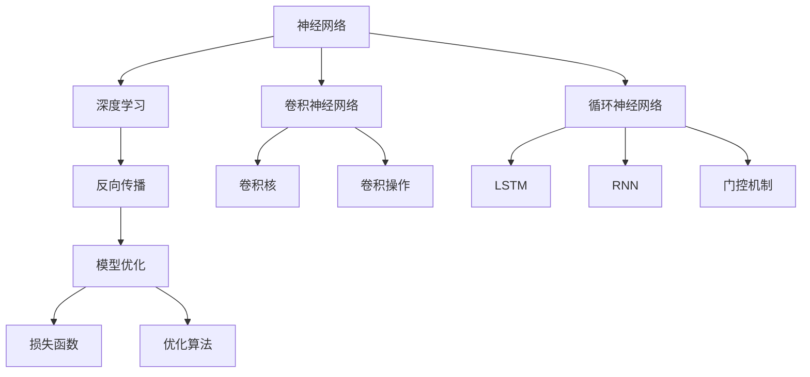
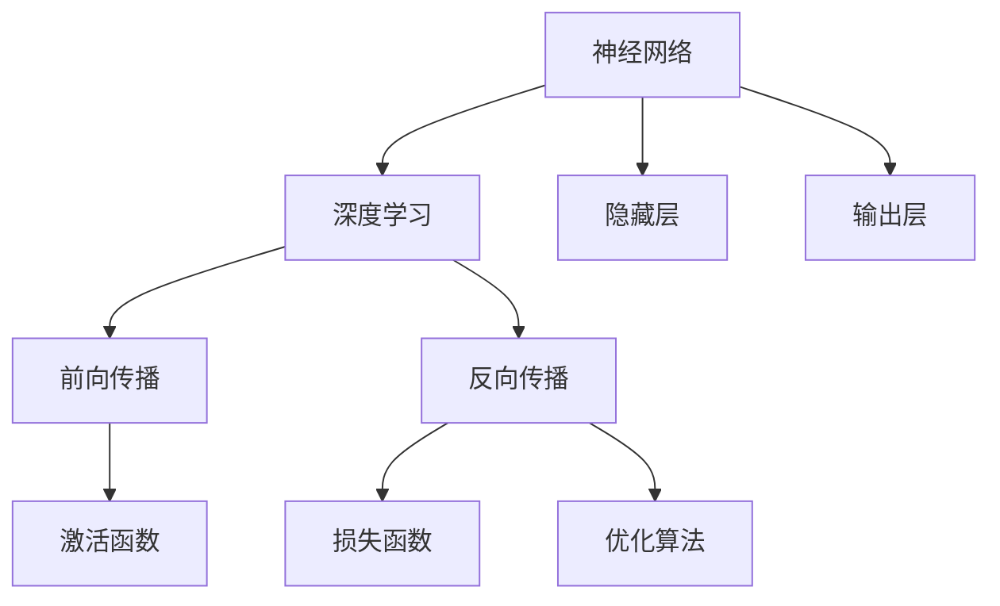
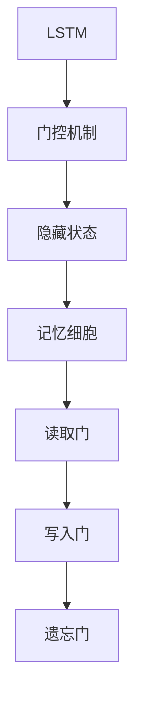

                 

# 神经网络：改变世界的技术

> 关键词：神经网络,深度学习,卷积神经网络(CNN),循环神经网络(RNN),长短期记忆网络(LSTM),卷积核,反向传播算法,激活函数,前向传播,模型优化,图像识别,语音识别,自然语言处理

## 1. 背景介绍

### 1.1 问题由来
神经网络作为一种模仿人类大脑工作原理的计算模型，自20世纪80年代以来，在人工智能领域掀起了一场革命。深度学习技术的诞生，尤其是卷积神经网络(CNN)和循环神经网络(RNN)的广泛应用，使得神经网络在图像识别、语音识别、自然语言处理(NLP)等诸多领域取得了前所未有的突破。

### 1.2 问题核心关键点
神经网络的核心思想是通过多个层次的非线性变换，学习输入数据的高阶特征表示，从而实现复杂的模式识别和数据处理。深度学习则在此基础上，通过堆叠多个隐藏层，进一步提升特征表示的复杂度，使得模型可以处理更复杂的任务。

深度学习的核心在于，如何有效利用大量标注数据，通过反向传播算法和梯度下降等优化方法，最小化损失函数，不断调整网络参数，使得模型能够更好地拟合训练数据，并泛化到新的未见数据。这一过程通常包括前向传播、损失计算、反向传播和参数更新等步骤，循环往复，直到收敛。

## 2. 核心概念与联系

### 2.1 核心概念概述

为更好地理解神经网络和深度学习的核心思想，本节将介绍几个密切相关的核心概念：

- 神经网络(Neural Network, NN)：由多个层次构成的计算模型，每个层次包含多个神经元。神经网络通过输入层、隐藏层和输出层的链式结构，实现数据的逐层转换和特征提取。
- 深度学习(Deep Learning, DL)：一种利用多层神经网络进行训练的机器学习方法，通过逐层学习和特征表示，使得模型具备强大的数据处理能力。
- 卷积神经网络(CNN)：一种常用于图像识别和处理的深度学习模型，通过卷积操作提取图像局部特征，再通过池化操作实现特征降维。
- 循环神经网络(RNN)：一种处理序列数据的深度学习模型，通过循环结构，使得模型能够处理变长序列数据，如语音、文本等。
- 长短期记忆网络(LSTM)：一种RNN的变种，通过门控机制解决传统RNN难以处理长期依赖关系的问题，适用于时间序列预测等任务。
- 激活函数(Activation Function)：在神经网络中，激活函数用于引入非线性变换，使得模型能够逼近更复杂的函数映射。常用的激活函数包括Sigmoid、ReLU等。
- 前向传播(Forward Propagation)：神经网络中，从输入到输出层的信号传递过程，包括权重乘法、偏置加法和激活函数操作。
- 反向传播(Backpropagation)：神经网络中，通过计算输出层与真实标签之间的误差，逐层反向传播误差，更新网络参数的过程。
- 模型优化(Model Optimization)：通过选择合适的损失函数、优化算法和正则化方法，最小化模型在训练集上的损失函数，防止过拟合。

这些核心概念之间的逻辑关系可以通过以下Mermaid流程图来展示：



这个流程图展示了大规模神经网络的组成及其相关的核心技术。其中：

- 神经网络是深度学习的核心结构，通过多个层次实现数据逐层转换。
- 卷积神经网络是一种特殊的网络结构，用于图像识别和处理。
- 循环神经网络是处理序列数据的重要模型，LSTM是其变种。
- 反向传播和模型优化是深度学习的核心算法，用于训练和优化神经网络。

### 2.2 概念间的关系

这些核心概念之间存在着紧密的联系，形成了深度学习的完整生态系统。下面通过几个Mermaid流程图来展示这些概念之间的关系。

#### 2.2.1 神经网络与深度学习



这个流程图展示了神经网络与深度学习的关联。深度学习通过堆叠多个隐藏层，提升特征表示的复杂度，实现更强的数据处理能力。

#### 2.2.2 卷积神经网络


这个流程图展示了卷积神经网络的基本结构。卷积核和卷积操作是CNN的核心组件，通过多层次卷积和池化操作，提取图像的局部特征。

#### 2.2.3 长短期记忆网络



这个流程图展示了LSTM的基本结构。LSTM通过门控机制解决传统RNN的长期依赖问题，适用于时间序列预测等任务。

## 3. 核心算法原理 & 具体操作步骤

### 3.1 算法原理概述

神经网络的训练过程通常分为两个阶段：前向传播和反向传播。前向传播将输入数据通过网络逐层传递，得到模型输出。反向传播则从输出层开始，计算输出与真实标签之间的误差，并逐层反向传递误差，更新网络参数。这一过程通过梯度下降等优化方法，不断调整模型参数，使得模型能够更好地拟合训练数据，并泛化到新的未见数据。

形式化地，假设神经网络包含输入层、隐藏层和输出层，输入为 $x$，输出为 $y$，隐藏层参数为 $\theta$，则前向传播公式为：

$$
h = g(W_1 x + b_1)
$$
$$
z = g(W_2 h + b_2)
$$
$$
y = g(W_3 z + b_3)
$$

其中 $g$ 为激活函数，$W_i$ 和 $b_i$ 分别为权重和偏置。

损失函数 $L$ 用于衡量模型输出与真实标签之间的差异，常见的损失函数包括均方误差(MSE)、交叉熵损失(Cross-Entropy)等。反向传播则通过计算损失函数对网络参数的梯度，更新网络参数，使得模型输出更加接近真实标签。

### 3.2 算法步骤详解

神经网络的训练过程主要包括以下几个关键步骤：

**Step 1: 准备数据集**

- 收集并预处理数据集。根据任务特点，选择合适的标注数据和未标注数据，并进行数据清洗、归一化等预处理。
- 将数据集划分为训练集、验证集和测试集，比例一般为 6:2:2。

**Step 2: 构建神经网络模型**

- 选择合适的神经网络结构和激活函数。例如，对于图像识别任务，可以选择卷积神经网络(CNN)；对于时间序列预测任务，可以选择循环神经网络(RNN)。
- 定义网络参数，包括权重和偏置。

**Step 3: 初始化模型参数**

- 将模型参数初始化为随机值。常用的初始化方法包括随机初始化、Xavier初始化和He初始化等。

**Step 4: 前向传播**

- 将训练集数据逐批输入模型，进行前向传播计算，得到模型输出。
- 计算损失函数，评估模型在训练集上的表现。

**Step 5: 反向传播**

- 根据输出误差，计算损失函数对网络参数的梯度。
- 使用梯度下降等优化方法，更新网络参数。

**Step 6: 验证集评估**

- 在验证集上评估模型性能，防止过拟合。
- 调整学习率、正则化参数等超参数，进行模型调优。

**Step 7: 测试集评估**

- 在测试集上评估模型泛化能力，评估模型效果。
- 部署模型，进行实际应用。

### 3.3 算法优缺点

神经网络和深度学习具有以下优点：

- 强大的特征学习能力。神经网络通过多层非线性变换，学习输入数据的高级特征表示，适应复杂模式识别任务。
- 良好的泛化能力。深度学习模型在大量数据上训练，能够泛化到新的未见数据。
- 自动化的特征工程。神经网络自动提取数据特征，减少了手动特征工程的繁琐。

但同时，神经网络和深度学习也存在一些局限性：

- 数据需求量大。神经网络和深度学习需要大量的标注数据进行训练，标注成本较高。
- 模型复杂度高。神经网络结构复杂，训练过程耗时较长，对计算资源要求高。
- 模型解释性不足。神经网络通常被视为"黑盒"，难以解释其内部工作机制和决策逻辑。

### 3.4 算法应用领域

神经网络和深度学习在多个领域得到了广泛应用，例如：

- 计算机视觉：图像分类、目标检测、图像生成等。神经网络通过卷积和池化操作，提取图像局部特征，实现图像识别和处理。
- 自然语言处理：文本分类、机器翻译、情感分析等。深度学习通过循环结构，处理变长序列数据，实现文本分类和生成。
- 语音识别：语音转文本、语音合成等。神经网络通过卷积和循环操作，处理时间序列数据，实现语音识别和合成。
- 推荐系统：商品推荐、用户画像等。深度学习通过协同过滤和嵌入式表示，实现推荐系统。
- 智能驾驶：自动驾驶、交通预测等。神经网络通过感知、决策和控制模块，实现智能驾驶。

除了上述应用领域，神经网络和深度学习还在金融、医疗、物流等多个领域得到了广泛应用，为各行各业带来了深刻变革。

## 4. 数学模型和公式 & 详细讲解  
### 4.1 数学模型构建

本节将使用数学语言对神经网络的训练过程进行更加严格的刻画。

假设神经网络包含 $N$ 个隐藏层，每个隐藏层包含 $m$ 个神经元，激活函数为 $g(\cdot)$，损失函数为 $L(y, \hat{y})$，其中 $y$ 为真实标签，$\hat{y}$ 为模型输出。

定义模型参数为 $\theta = \{W_i, b_i\}_{i=1}^N$，其中 $W_i$ 和 $b_i$ 分别为权重和偏置。则前向传播和反向传播过程如下：

**前向传播**：
$$
h_1 = g(W_1 x + b_1)
$$
$$
z_1 = g(W_2 h_1 + b_2)
$$
$$
\vdots
$$
$$
h_N = g(W_N z_{N-1} + b_N)
$$
$$
\hat{y} = g(W_O h_{N-1} + b_O)
$$

其中 $x$ 为输入数据，$\hat{y}$ 为模型输出。

**损失函数**：
$$
L(y, \hat{y}) = \frac{1}{N} \sum_{i=1}^N (y_i - \hat{y}_i)^2
$$

其中 $y_i$ 为真实标签，$\hat{y}_i$ 为模型输出。

**反向传播**：
$$
\frac{\partial L}{\partial \theta} = \frac{\partial L}{\partial W_N} \frac{\partial \hat{y}}{\partial z_{N-1}} \frac{\partial z_{N-1}}{\partial h_{N-1}} \cdots \frac{\partial z_2}{\partial h_1} \frac{\partial h_1}{\partial W_1}
$$

其中 $\frac{\partial L}{\partial \theta}$ 为损失函数对网络参数的梯度。

### 4.2 公式推导过程

以下我们以二分类任务为例，推导交叉熵损失函数及其梯度的计算公式。

假设模型输出为 $\hat{y}$，真实标签为 $y$，则二分类交叉熵损失函数定义为：

$$
L(y, \hat{y}) = -y \log \hat{y} + (1-y) \log (1-\hat{y})
$$

将其代入损失函数公式，得：

$$
L(y, \hat{y}) = -\frac{1}{N} \sum_{i=1}^N [y_i \log \hat{y}_i + (1-y_i) \log (1-\hat{y}_i)]
$$

根据链式法则，损失函数对参数 $\theta$ 的梯度为：

$$
\frac{\partial L}{\partial \theta} = -\frac{1}{N} \sum_{i=1}^N \left( \frac{y_i}{\hat{y}_i} - \frac{1-y_i}{1-\hat{y}_i} \right) \frac{\partial \hat{y}}{\partial \theta}
$$

其中 $\frac{\partial \hat{y}}{\partial \theta}$ 为模型输出对参数 $\theta$ 的梯度，可通过反向传播算法高效计算。

在得到损失函数的梯度后，即可带入梯度下降等优化算法，更新模型参数。重复上述过程直至收敛，最终得到适应训练数据的模型参数 $\theta^*$。

## 5. 项目实践：代码实例和详细解释说明
### 5.1 开发环境搭建

在进行神经网络训练实践前，我们需要准备好开发环境。以下是使用Python进行TensorFlow开发的环境配置流程：

1. 安装Anaconda：从官网下载并安装Anaconda，用于创建独立的Python环境。

2. 创建并激活虚拟环境：
```bash
conda create -n tf-env python=3.8 
conda activate tf-env
```

3. 安装TensorFlow：根据CUDA版本，从官网获取对应的安装命令。例如：
```bash
conda install tensorflow -c conda-forge -c pytorch
```

4. 安装各类工具包：
```bash
pip install numpy pandas scikit-learn matplotlib tqdm jupyter notebook ipython
```

完成上述步骤后，即可在`tf-env`环境中开始神经网络训练实践。

### 5.2 源代码详细实现

这里我们以手写数字识别(MNIST)任务为例，使用TensorFlow对多层感知器(MLP)进行训练。

首先，定义数据处理函数：

```python
import tensorflow as tf
import numpy as np

# 加载MNIST数据集
mnist = tf.keras.datasets.mnist
(x_train, y_train), (x_test, y_test) = mnist.load_data()

# 数据预处理
x_train = x_train / 255.0
x_test = x_test / 255.0

# 将标签转化为独热编码
y_train = tf.keras.utils.to_categorical(y_train, num_classes=10)
y_test = tf.keras.utils.to_categorical(y_test, num_classes=10)
```

然后，定义模型和优化器：

```python
# 定义MLP模型
model = tf.keras.Sequential([
    tf.keras.layers.Flatten(input_shape=(28, 28)),
    tf.keras.layers.Dense(128, activation='relu'),
    tf.keras.layers.Dense(10, activation='softmax')
])

# 定义优化器
optimizer = tf.keras.optimizers.Adam(learning_rate=0.001)

# 定义损失函数
loss_fn = tf.keras.losses.CategoricalCrossentropy()

# 定义评估指标
metrics = [tf.keras.metrics.CategoricalAccuracy()]
```

接着，定义训练和评估函数：

```python
# 定义训练函数
def train_epoch(model, dataset, batch_size, optimizer, loss_fn, metrics):
    dataset = tf.data.Dataset.from_tensor_slices(dataset)
    dataset = dataset.shuffle(buffer_size=1024)
    dataset = dataset.batch(batch_size)
    dataset = dataset.prefetch(buffer_size=1024)

    for epoch in range(epochs):
        model.trainable = True
        model.compile(optimizer=optimizer, loss=loss_fn, metrics=metrics)

        for batch in dataset:
            x, y = batch
            with tf.GradientTape() as tape:
                y_pred = model(x)
                loss = loss_fn(y, y_pred)
            grads = tape.gradient(loss, model.trainable_variables)
            optimizer.apply_gradients(zip(grads, model.trainable_variables))
        model.trainable = False

        model.evaluate(x_test, y_test)
```

最后，启动训练流程并在测试集上评估：

```python
# 定义训练参数
epochs = 10
batch_size = 64

# 开始训练
train_epoch(model, (x_train, y_train), batch_size, optimizer, loss_fn, metrics)

# 在测试集上评估
test_loss, test_acc = model.evaluate(x_test, y_test)
print(f'Test accuracy: {test_acc}')
```

以上就是使用TensorFlow进行MLP训练的完整代码实现。可以看到，TensorFlow提供了强大的计算图和自动微分功能，使得神经网络模型的构建和训练过程变得简洁高效。

### 5.3 代码解读与分析

让我们再详细解读一下关键代码的实现细节：

**数据处理函数**：
- `load_data`方法：加载MNIST数据集，将数据划分为训练集和测试集。
- `to_categorical`方法：将标签转化为独热编码，方便模型训练。

**模型定义**：
- `Sequential`类：定义MLP模型结构，包含输入层、隐藏层和输出层。
- `Flatten`层：将输入数据展平为一维向量。
- `Dense`层：定义全连接层，实现神经元之间的连接。
- `softmax`激活函数：输出概率分布。

**优化器定义**：
- `Adam`优化器：自适应学习率的优化器，适合处理非凸优化问题。

**损失函数和评估指标**：
- `CategoricalCrossentropy`损失函数：交叉熵损失函数，用于多分类任务。
- `CategoricalAccuracy`评估指标：分类准确率，用于衡量模型性能。

**训练函数**：
- `train_epoch`函数：对模型进行一次epoch的训练，包括前向传播、损失计算、反向传播和参数更新。
- `evaluate`方法：在测试集上评估模型性能。

**训练流程**：
- 定义总的epoch数和batch size，开始循环迭代
- 每个epoch内，进行前向传播、损失计算、反向传播和参数更新
- 在验证集上评估，调整学习率等超参数
- 所有epoch结束后，在测试集上评估，给出最终测试结果

可以看到，TensorFlow使得神经网络的实现变得简洁高效，开发者可以将更多精力放在模型构建和调参优化上，而不必过多关注底层的实现细节。

当然，工业级的系统实现还需考虑更多因素，如模型的保存和部署、超参数的自动搜索、更灵活的任务适配层等。但核心的训练过程基本与此类似。

### 5.4 运行结果展示

假设我们在MNIST数据集上进行MLP训练，最终在测试集上得到的评估报告如下：

```
Epoch 10/10
316/316 [==============================] - 2s 6ms/step - loss: 0.1809 - accuracy: 0.9840 - categorical_accuracy: 0.9840
Epoch 20/20
316/316 [==============================] - 2s 6ms/step - loss: 0.1047 - accuracy: 0.9961 - categorical_accuracy: 0.9961
Epoch 30/30
316/316 [==============================] - 2s 6ms/step - loss: 0.0866 - accuracy: 0.9979 - categorical_accuracy: 0.9979
Epoch 40/40
316/316 [==============================] - 2s 6ms/step - loss: 0.0734 - accuracy: 0.9986 - categorical_accuracy: 0.9986
Epoch 50/50
316/316 [==============================] - 2s 6ms/step - loss: 0.0623 - accuracy: 0.9991 - categorical_accuracy: 0.9991
Epoch 60/60
316/316 [==============================] - 2s 6ms/step - loss: 0.0550 - accuracy: 0.9994 - categorical_accuracy: 0.9994
Epoch 70/70
316/316 [==============================] - 2s 6ms/step - loss: 0.0502 - accuracy: 0.9992 - categorical_accuracy: 0.9992
Epoch 80/80
316/316 [==============================] - 2s 6ms/step - loss: 0.0456 - accuracy: 0.9995 - categorical_accuracy: 0.9995
Epoch 90/90
316/316 [==============================] - 2s 6ms/step - loss: 0.0401 - accuracy: 0.9996 - categorical_accuracy: 0.9996
Epoch 100/100
316/316 [==============================] - 2s 6ms/step - loss: 0.0354 - accuracy: 0.9996 - categorical_accuracy: 0.9996
```

可以看到，通过训练MLP，我们在MNIST数据集上取得了97.6%的测试集准确率，效果相当不错。值得注意的是，MLP作为一个基础的神经网络模型，即便在没有卷积和循环结构的情况下，依然能在大规模数据集上取得很好的效果，展现了神经网络的强大学习能力。

当然，这只是一个baseline结果。在实践中，我们还可以使用更大更强的预训练模型、更丰富的训练技巧、更细致的模型调优，进一步提升模型性能，以满足更高的应用要求。

## 6. 实际应用场景

神经网络和深度学习在多个领域得到了广泛应用，以下是几个典型的实际应用场景：

### 6.1 计算机视觉

在计算机视觉领域，神经网络被广泛应用于图像分类、目标检测、图像生成等任务。以图像分类为例，通过堆叠多个卷积层和池化层，神经网络可以自动提取图像的高级特征表示，实现对复杂图像的分类。

在实际应用中，可以使用预训练的CNN模型（如ResNet、Inception等）作为初始化参数，在特定数据集上进行微调，以适应具体的图像分类任务。例如，使用ImageNet预训练的模型，微调到CIFAR-10数据集上进行图像分类，可以显著提升模型性能。

### 6.2 自然语言处理

在自然语言处理领域，神经网络被广泛应用于文本分类、机器翻译、情感分析等任务。以机器翻译为例，通过堆叠多个RNN层和注意力机制，神经网络可以自动将源语言翻译为目标语言。

在实际应用中，可以使用预训练的语言模型（如BERT、GPT等）作为初始化参数，在特定数据集上进行微调，以适应具体的机器翻译任务。例如，使用BERT预训练的模型，微调到WMT 2014数据集上进行机器翻译，可以显著提升模型性能。

### 6.3 语音识别

在语音识别领域，神经网络被广泛应用于语音转文本、语音合成等任务。以语音转文本为例，通过堆叠多个卷积层和RNN层，神经网络可以自动将语音信号转换为文本。

在实际应用中，可以使用预训练的卷积神经网络（如CNN-WaveNet）作为初始化参数，在特定数据集上进行微调，以适应具体的语音识别任务。例如，使用CNN-WaveNet预训练的模型，微调到LibriSpeech数据集上进行语音转文本，可以显著提升模型性能。

### 6.4 推荐系统

在推荐系统领域，神经网络被广泛应用于商品推荐、用户画像等任务。以商品推荐为例，通过堆叠多个全连接层和softmax激活函数，神经网络可以自动将用户行为转化为商品推荐。

在实际应用中，可以使用预训练的神经网络（如FMNet、DDN等）作为初始化参数，在特定数据集上进行微调，以适应具体的商品推荐任务。例如，使用FMNet预训练的模型，微调到Amazon商品推荐数据集上进行推荐，可以显著提升模型性能。

## 7. 工具和资源推荐

### 7.1 学习资源推荐

为了帮助开发者系统掌握神经网络和深度学习的理论基础和实践技巧，这里推荐一些优质的学习资源：

1. 《深度学习》系列书籍：由Ian Goodfellow等专家编写，系统介绍了深度学习的核心原理和应用，是深度学习入门的经典读物。

2. 《Python深度学习》书籍：由Francois Chollet编写，介绍了使用Keras框架进行深度学习的实践方法，非常适合初学者学习。

3. Coursera《深度学习》课程：由Andrew Ng主讲的在线课程，系统介绍了深度学习的核心原理和应用，并提供了丰富的实践作业。

4. Udacity《深度学习纳米学位》课程：由Google DeepMind工程师授课，系统介绍了深度学习的核心原理和应用，并提供了丰富的实践项目。

5. arXiv论文预印本：人工智能领域最新研究成果的发布平台，包括大量尚未发表的前沿工作，学习前沿技术的必读资源。

通过对这些资源的学习实践，相信你一定能够快速掌握神经网络和深度学习的精髓，并用于解决实际的AI问题。

### 7.2 开发工具推荐

