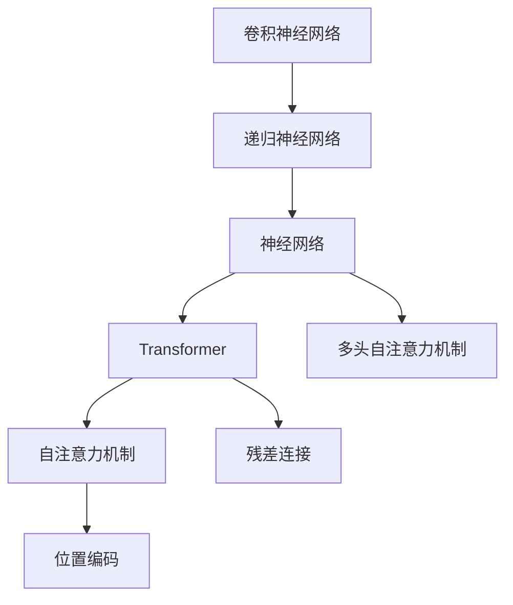
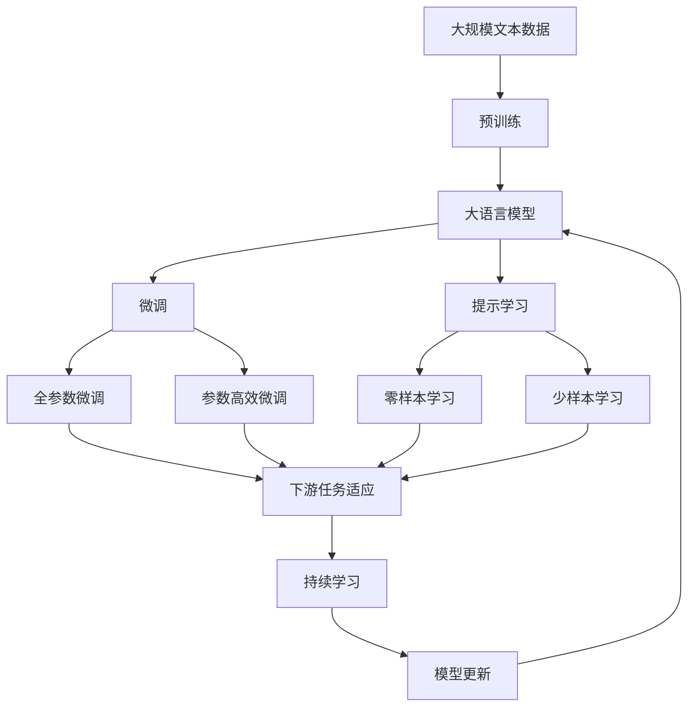
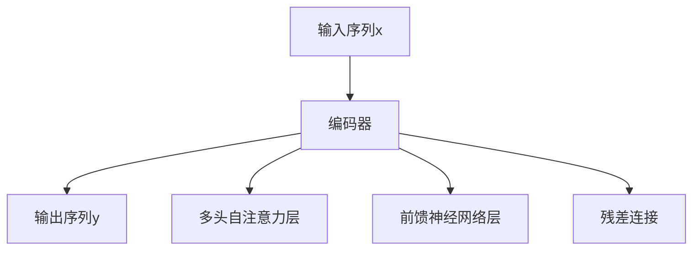

                 

## 1. 背景介绍

### 1.1 问题由来

随着人工智能技术的不断进步，自然语言处理（Natural Language Processing, NLP）领域迎来了新的突破。传统的NLP方法主要依赖于手工设计的特征工程和统计模型，但随着深度学习特别是神经网络（Neural Network, NN）的兴起，NLP领域逐步转向基于数据驱动的模型训练。

特别是近年来，以卷积神经网络（Convolutional Neural Network, CNN）和递归神经网络（Recurrent Neural Network, RNN）为代表的传统神经网络在文本分类、情感分析等任务上取得了显著效果，但它们在长序列建模和结构化信息处理上仍存在较大局限。

神经网络在NLP领域的新突破在于，它不仅能捕捉到文本的局部特征，还能学习到序列之间的全局依赖关系，同时还能高效地处理结构化信息。特别是Transformer架构的出现，显著提升了NLP任务的性能，使得神经网络在NLP领域的应用更加广泛和深入。

### 1.2 问题核心关键点

本文聚焦于神经网络在自然语言处理中的应用，特别是Transformer架构及其改进方法。我们通过系统地介绍Transformer的原理和应用，探讨其在自然语言处理领域的新突破。

## 2. 核心概念与联系

### 2.1 核心概念概述

为了更好地理解Transformer在自然语言处理中的应用，我们首先介绍几个核心概念：

- **神经网络**：一种模拟人脑神经元的计算模型，通过一系列的线性变换和非线性激活函数实现数据的处理和预测。

- **卷积神经网络（CNN）**：一种特殊的神经网络，通过卷积层、池化层和全连接层进行特征提取和分类。

- **递归神经网络（RNN）**：一种能够处理序列数据的神经网络，通过循环结构实现对序列中前后元素的依赖关系建模。

- **Transformer**：一种基于自注意力机制的神经网络架构，通过多头自注意力机制和多层次编码器实现对序列数据的高效处理。

- **自然语言处理（NLP）**：一种通过计算机实现人类语言理解和生成的技术，包括文本分类、机器翻译、情感分析等任务。

- **自注意力机制（Self-Attention）**：一种通过计算输入序列中每个位置与其他位置之间的关系来分配注意力的机制。

- **多头自注意力机制（Multi-Head Self-Attention）**：一种将输入序列分成多个子序列，分别计算不同子序列之间的注意力，然后将结果合并的方式。

- **残差连接（Residual Connection）**：一种在神经网络中引入跨层连接的机制，用于缓解梯度消失和爆炸问题。

- **位置编码（Positional Encoding）**：一种用于在序列中引入位置信息的机制，解决Transformer在处理序列时可能忽略位置信息的局限。

这些核心概念之间存在紧密联系，共同构成了Transformer架构及其在自然语言处理中的应用框架。

### 2.2 概念间的关系

这些核心概念之间的联系可以通过以下Mermaid流程图来展示：



这个流程图展示了大语言模型的核心概念及其之间的关系：

1. 卷积神经网络和递归神经网络是神经网络的两个重要分支，分别用于处理局部和序列数据。
2. 神经网络是一种通用的计算模型，能够处理各种类型的输入数据。
3. Transformer是一种基于自注意力机制的神经网络架构，能够高效地处理序列数据。
4. 多头自注意力机制和残差连接是Transformer的两个关键组件，分别用于并行计算和跨层连接。
5. 位置编码用于解决Transformer在处理序列时忽略位置信息的局限。

这些概念共同构成了Transformer架构及其在自然语言处理中的应用框架，使其能够在各种场景下发挥强大的语言理解和生成能力。

### 2.3 核心概念的整体架构

最后，我们用一个综合的流程图来展示这些核心概念在大语言模型微调过程中的整体架构：



这个综合流程图展示了从预训练到微调，再到持续学习的完整过程。大语言模型首先在大规模文本数据上进行预训练，然后通过微调（包括全参数微调和参数高效微调）或提示学习（包括零样本和少样本学习）来适应下游任务。最后，通过持续学习技术，模型可以不断更新和适应新的任务和数据。

## 3. 核心算法原理 & 具体操作步骤

### 3.1 算法原理概述

基于Transformer的神经网络在自然语言处理中的应用主要体现在以下几个方面：

1. 文本分类：通过多层编码器对输入文本进行编码，最后通过一个全连接层进行分类。

2. 机器翻译：使用多层编码器和解码器，将源语言文本转换为目标语言文本。

3. 文本生成：通过多层编码器和解码器，生成自然语言文本。

4. 文本摘要：通过多层编码器和解码器，对长文本进行压缩和提取关键信息。

5. 问答系统：通过编码器和解码器，将问题和答案进行匹配。

这些任务的核心原理都是通过多层Transformer进行序列编码和解码，从而实现对文本信息的处理和生成。Transformer的原理和操作步骤如下：

### 3.2 算法步骤详解

Transformer架构主要包括编码器和解码器两部分。编码器用于将输入序列转换为高维表示，解码器用于生成目标序列。

#### 3.2.1 编码器（Encoder）

编码器由多层Transformer编码器组成，每个编码器由多头自注意力层、前馈神经网络（Feedforward Network, FFN）层和残差连接组成。

1. **多头自注意力层**：用于计算输入序列中每个位置与其他位置之间的关系，分配注意力权重。具体步骤如下：
   - 将输入序列分成多个子序列，分别计算不同子序列之间的注意力，得到多头注意力结果。
   - 将多头注意力结果进行拼接，并通过线性变换和softmax函数得到注意力权重。
   - 使用注意力权重计算每个位置的加权和，得到多头自注意力结果。

   公式推导如下：

   $$
   \text{Attention}(Q, K, V) = \text{softmax}(\frac{QK^T}{\sqrt{d_k}})V
   $$

   其中，$Q, K, V$分别为查询矩阵、键矩阵和值矩阵，$d_k$为键的维度。

   ```mermaid
   graph TB
       A[查询矩阵Q] --> B[键矩阵K] --> C[值矩阵V]
       B --> D[softmax] --> E[注意力权重]
       E --> F[加权和]
   ```

2. **前馈神经网络层**：用于对多头自注意力结果进行非线性变换，得到新的表示。

   具体步骤如下：
   - 将多头自注意力结果通过一个线性变换和一个ReLU激活函数，得到新的表示。
   - 使用一个线性变换将新的表示映射回输入序列的维度。

   公式推导如下：

   $$
   \text{FFN}(x) = \max(0, xW_1 + b_1)W_2 + b_2
   $$

   其中，$W_1, b_1, W_2, b_2$分别为线性变换的权重和偏置。

   ```mermaid
   graph TB
       A[多头自注意力结果] --> B[线性变换] --> C[ReLU] --> D[线性变换]
   ```

3. **残差连接**：用于将原始输入序列与经过多层编码器处理后的结果相加，从而保留原始信息。

   公式推导如下：

   $$
   x' = x + \text{FFN}(x)
   $$

   ```mermaid
   graph TB
       A[原始输入序列x] --> B[多层编码器处理] --> C[残差连接]
   ```

#### 3.2.2 解码器（Decoder）

解码器由多层Transformer解码器组成，每个解码器由多头自注意力层、多头编码器注意力层、前馈神经网络层和残差连接组成。

1. **多头自注意力层**：用于计算目标序列中每个位置与其他位置之间的关系，分配注意力权重。具体步骤如下：
   - 将目标序列分成多个子序列，分别计算不同子序列之间的注意力，得到多头注意力结果。
   - 将多头注意力结果进行拼接，并通过线性变换和softmax函数得到注意力权重。
   - 使用注意力权重计算每个位置的加权和，得到多头自注意力结果。

   公式推导如下：

   $$
   \text{Attention}(Q, K, V) = \text{softmax}(\frac{QK^T}{\sqrt{d_k}})V
   $$

   其中，$Q, K, V$分别为查询矩阵、键矩阵和值矩阵，$d_k$为键的维度。

   ```mermaid
   graph TB
       A[查询矩阵Q] --> B[键矩阵K] --> C[值矩阵V]
       B --> D[softmax] --> E[注意力权重]
       E --> F[加权和]
   ```

2. **多头编码器注意力层**：用于计算目标序列与编码器输出之间的注意力，分配注意力权重。具体步骤如下：
   - 将目标序列的查询矩阵和编码器输出进行拼接，计算出多头编码器注意力结果。
   - 将多头编码器注意力结果进行拼接，并通过线性变换和softmax函数得到注意力权重。
   - 使用注意力权重计算每个位置的加权和，得到多头编码器注意力结果。

   公式推导如下：

   $$
   \text{Attention}(Q, K, V) = \text{softmax}(\frac{QK^T}{\sqrt{d_k}})V
   $$

   其中，$Q, K, V$分别为查询矩阵、键矩阵和值矩阵，$d_k$为键的维度。

   ```mermaid
   graph TB
       A[目标序列查询矩阵Q] --> B[编码器输出] --> C[多头编码器注意力结果]
       B --> D[拼接] --> E[线性变换] --> F[softmax] --> G[注意力权重]
       G --> H[加权和]
   ```

3. **前馈神经网络层**：用于对多头自注意力结果和多头编码器注意力结果进行非线性变换，得到新的表示。

   具体步骤如下：
   - 将多头自注意力结果和多头编码器注意力结果通过一个线性变换和一个ReLU激活函数，得到新的表示。
   - 使用一个线性变换将新的表示映射回目标序列的维度。

   公式推导如下：

   $$
   \text{FFN}(x) = \max(0, xW_1 + b_1)W_2 + b_2
   $$

   其中，$W_1, b_1, W_2, b_2$分别为线性变换的权重和偏置。

   ```mermaid
   graph TB
       A[多头自注意力结果] --> B[多头编码器注意力结果] --> C[线性变换] --> D[ReLU] --> E[线性变换]
   ```

4. **残差连接**：用于将原始目标序列与经过多层解码器处理后的结果相加，从而保留原始信息。

   公式推导如下：

   $$
   x' = x + \text{FFN}(x)
   $$

   ```mermaid
   graph TB
       A[原始目标序列x] --> B[多层解码器处理] --> C[残差连接]
   ```

### 3.3 算法优缺点

Transformer架构在自然语言处理中的应用具有以下优点：

1. **高效性**：Transformer架构能够高效地处理长序列数据，避免了RNN在长序列建模时的梯度消失和梯度爆炸问题。

2. **全局依赖性**：Transformer架构能够同时考虑序列中的全局依赖关系，避免了CNN在序列建模时的局部信息丢失问题。

3. **并行计算**：Transformer架构的多头自注意力机制和残差连接能够并行计算，大大提高了模型的训练效率和推理速度。

4. **可解释性**：Transformer架构的注意力机制能够帮助理解模型在处理序列时对不同位置的关注程度，增强了模型的可解释性。

但是，Transformer架构也存在一些缺点：

1. **计算复杂度高**：Transformer架构的计算复杂度较高，需要较大的计算资源支持。

2. **参数量较大**：Transformer架构的参数量较大，需要大量的标注数据进行微调，且微调过程较为复杂。

3. **内存占用高**：Transformer架构的计算图较大，需要较高的内存支持。

4. **序列长度受限**：Transformer架构在处理长序列时，可能会遇到内存限制问题，需要特殊处理。

### 3.4 算法应用领域

Transformer架构在自然语言处理领域的应用非常广泛，涵盖了以下领域：

1. **文本分类**：使用多层编码器对输入文本进行编码，最后通过一个全连接层进行分类。

2. **机器翻译**：使用多层编码器和解码器，将源语言文本转换为目标语言文本。

3. **文本生成**：通过多层编码器和解码器，生成自然语言文本。

4. **文本摘要**：通过多层编码器和解码器，对长文本进行压缩和提取关键信息。

5. **问答系统**：通过编码器和解码器，将问题和答案进行匹配。

6. **命名实体识别**：通过编码器和解码器，识别文本中的人名、地名、机构名等特定实体。

7. **情感分析**：通过编码器和解码器，判断文本的情感倾向。

8. **信息抽取**：通过编码器和解码器，从文本中抽取实体之间的语义关系。

9. **对话系统**：通过编码器和解码器，使机器能够与人自然对话。

10. **文本校验**：通过编码器和解码器，对文本进行语法和语义校验。

这些应用领域展示了Transformer架构在自然语言处理中的广泛应用，使得神经网络在NLP领域的应用更加深入和广泛。

## 4. 数学模型和公式 & 详细讲解 & 举例说明

### 4.1 数学模型构建

Transformer架构的数学模型构建基于自注意力机制和多层次编码器。以下是一个典型的Transformer模型架构图：



其中，$x$为输入序列，$y$为输出序列，$D, E, F$分别为多头自注意力层、前馈神经网络层和残差连接。

### 4.2 公式推导过程

Transformer架构的数学推导过程包括以下几个关键步骤：

1. **多头自注意力层**

   输入序列$x$通过一个线性变换，得到查询矩阵$Q, K, V$，并计算多头注意力结果：

   $$
   \text{Attention}(Q, K, V) = \text{softmax}(\frac{QK^T}{\sqrt{d_k}})V
   $$

   其中，$Q, K, V$分别为查询矩阵、键矩阵和值矩阵，$d_k$为键的维度。

2. **前馈神经网络层**

   多头自注意力结果通过一个线性变换和一个ReLU激活函数，得到新的表示：

   $$
   \text{FFN}(x) = \max(0, xW_1 + b_1)W_2 + b_2
   $$

   其中，$W_1, b_1, W_2, b_2$分别为线性变换的权重和偏置。

3. **残差连接**

   将原始输入序列与经过多层编码器处理后的结果相加，得到编码器输出：

   $$
   x' = x + \text{FFN}(x)
   $$

4. **解码器**

   解码器由多层Transformer解码器组成，每个解码器由多头自注意力层、多头编码器注意力层、前馈神经网络层和残差连接组成。

   解码器处理目标序列时，需要同时考虑目标序列中每个位置与其他位置之间的关系，以及目标序列与编码器输出之间的关系，最后通过残差连接得到解码器输出。

### 4.3 案例分析与讲解

以机器翻译为例，说明Transformer架构在自然语言处理中的应用。

机器翻译任务通常包括两个部分：编码器和解码器。编码器将源语言文本转换为高维表示，解码器将高维表示转换为目标语言文本。

1. **编码器**

   编码器由多层Transformer编码器组成，每个编码器由多头自注意力层、前馈神经网络层和残差连接组成。

   编码器处理源语言文本时，需要考虑每个位置的上下文信息，并通过多头自注意力机制进行加权和，得到高维表示。

   ```mermaid
   graph TB
       A[源语言文本] --> B[编码器] --> C[高维表示]
       B --> D[多头自注意力层]
       B --> E[前馈神经网络层]
       B --> F[残差连接]
   ```

2. **解码器**

   解码器由多层Transformer解码器组成，每个解码器由多头自注意力层、多头编码器注意力层、前馈神经网络层和残差连接组成。

   解码器处理目标语言文本时，需要考虑每个位置的上下文信息和编码器输出之间的关系，并通过多头编码器注意力机制进行加权和，得到高维表示。

   ```mermaid
   graph TB
       A[目标语言文本] --> B[解码器] --> C[高维表示]
       B --> D[多头自注意力层]
       B --> E[多头编码器注意力层]
       B --> F[前馈神经网络层]
       B --> G[残差连接]
   ```

3. **解码过程**

   解码器处理目标语言文本时，通过多头自注意力机制和多头编码器注意力机制，逐步生成目标语言文本，直到生成终止符为止。

   ```mermaid
   graph TB
       A[目标语言文本] --> B[解码器] --> C[高维表示]
       B --> D[多头自注意力层]
       B --> E[多头编码器注意力层]
       B --> F[前馈神经网络层]
       B --> G[残差连接]
   ```

通过解码器逐步生成目标语言文本，可以得到与源语言文本对应的翻译结果。

## 5. 项目实践：代码实例和详细解释说明

### 5.1 开发环境搭建

在进行Transformer项目实践前，我们需要准备好开发环境。以下是使用Python进行TensorFlow开发的环境配置流程：

1. 安装Anaconda：从官网下载并安装Anaconda，用于创建独立的Python环境。

2. 创建并激活虚拟环境：
```bash
conda create -n tf-env python=3.8 
conda activate tf-env
```

3. 安装TensorFlow：根据CUDA版本，从官网获取对应的安装命令。例如：
```bash
conda install tensorflow -c pytorch -c conda-forge
```

4. 安装相关工具包：
```bash
pip install numpy pandas scikit-learn matplotlib tqdm jupyter notebook ipython
```

完成上述步骤后，即可在`tf-env`环境中开始Transformer实践。

### 5.2 源代码详细实现

这里我们以机器翻译任务为例，给出使用TensorFlow实现Transformer模型的PyTorch代码实现。

首先，定义机器翻译任务的输入和输出：

```python
import tensorflow as tf

class MachineTranslationModel(tf.keras.Model):
    def __init__(self, d_model, dff, n_layers, dropout, attention_heads):
        super(MachineTranslationModel, self).__init__()
        self.encoder = Encoder(d_model, dff, n_layers, attention_heads, dropout)
        self.decoder = Decoder(d_model, dff, n_layers, attention_heads, dropout)

    def call(self, x, y):
        return self.encoder(x), self.decoder(y)
```

然后，定义Transformer编码器和解码器的实现：

```python
class Encoder(tf.keras.layers.Layer):
    def __init__(self, d_model, dff, n_layers, attention_heads, dropout):
        super(Encoder, self).__init__()
        self.layer_norm1 = tf.keras.layers.LayerNormalization()
        self.dropout = tf.keras.layers.Dropout(dropout)
        self.encoder_layers = [EncoderLayer(d_model, dff, attention_heads, dropout) for _ in range(n_layers)]
        self.final_layer_norm = tf.keras.layers.LayerNormalization()

    def call(self, x):
        for layer in self.encoder_layers:
            x = layer(x, training=True)
        return self.final_layer_norm(x)

class Decoder(tf.keras.layers.Layer):
    def __init__(self, d_model, dff, n_layers, attention_heads, dropout):
        super(Decoder, self).__init__()
        self.layer_norm1 = tf.keras.layers.LayerNormalization()
        self.dropout = tf.keras.layers.Dropout(dropout)
        self.decoder_layers = [DecoderLayer(d_model, dff, attention_heads, dropout) for _ in range(n_layers)]
        self.final_layer_norm = tf.keras.layers.LayerNormalization()

    def call(self, x):
        for layer in self.decoder_layers:
            x = layer(x, training=True)
        return self.final_layer_norm(x)
```

接着，定义Transformer编码器和解码器层的实现：

```python
class EncoderLayer(tf.keras.layers.Layer):
    def __init__(self, d_model, dff, attention_heads, dropout):
        super(EncoderLayer, self).__init__()
        self.layer_norm1 = tf.keras.layers.LayerNormalization()
        self.dropout = tf.keras.layers.Dropout(dropout)
        self.encoder_self_attention = MultiHeadAttention(d_model, attention_heads, dropout)
        self.encoder_feedforward = FeedForward(d_model, dff, dropout)
        self.final_layer_norm = tf.keras.layers.LayerNormalization()

    def call(self, x, y):
        attn_output, mask = self.encoder_self_attention(x, x, x, mask)
        attn_output = self.dropout(attn_output)
        ffn_output = self.encoder_feedforward(attn_output)
        ffn_output = self.dropout(ffn_output)
        x = x + attn_output + ffn_output
        return self.final_layer_norm(x)

class DecoderLayer(tf.keras.layers.Layer):
    def __init__(self, d_model, dff, attention_heads, dropout):
        super(DecoderLayer, self).__init__()
        self.layer_norm1 = tf.keras.layers.LayerNormalization()
        self.dropout = tf.keras.layers.Dropout(dropout)
        self.decoder_self_attention = MultiHeadAttention(d_model, attention_heads, dropout)
        self.decoder_encoder_attention = MultiHeadAttention(d_model, attention_heads, dropout)
        self.decoder_feedforward = FeedForward(d_model, dff, dropout)
        self.final_layer_norm = tf.keras.layers.LayerNormalization()

    def call(self, x, y):
        attn_output, mask = self.decoder_self_attention(x, x, x, mask)
        attn_output = self.dropout(attn_output)
        ffn_output = self.decoder_feedforward(attn_output)
        ffn_output = self.dropout(ffn_output)
        x = x + attn_output + ffn_output
        return self.final_layer_norm(x)
```

最后，定义Transformer模型的输入和输出，并进行训练：

```python
class MultiHeadAttention(tf.keras.layers.Layer):
    def __init__(self, d_model, attention_heads, dropout):
        super(MultiHeadAttention, self).__init__()
        self.d_model = d_model
        self.attention_heads = attention_heads
        self.dropout = dropout
        self.head_dim = d_model // attention_heads
        self.fc1 = tf.keras.layers.Dense(d_model)
        self.fc2 = tf.keras.layers.Dense(d_model)
        self.fc3 = tf.keras.layers.Dense(d_model)

    def split_heads(self, x, batch_size):
        x = tf.reshape(x, (batch_size, -1, self.attention_heads, self.head_dim))
        return tf.transpose(x, perm=[0, 2, 1, 3])

    def call(self, q, k, v, mask):
        q = self.fc1(q)
        k = self.fc1(k)
        v = self.fc1(v)
        q = tf.reshape(q, (self.batch_size, -1, self.attention_heads, self.head_dim))
        k = tf.reshape(k, (self.batch_size, -1, self.attention_heads, self.head_dim))
        v = tf.reshape(v, (self.batch_size, -1, self.attention_heads, self.head_dim))
        q = self.split_heads(q, self.batch_size)
        k = self.split_heads(k, self.batch_size)
        v = self.split_heads(v, self.batch_size)
        scaled_attention_scores = tf.matmul(q, k, transpose_b=True) / tf.math.sqrt(tf.cast(self.head_dim, tf.float32))
        attention_weights = tf.nn.softmax(scaled_attention_scores, axis=-1)
        attention_weights = tf.cast(attention_weights, tf.float32)
        output = tf.matmul(attention_weights, v)
        output = tf.reshape(output, (self.batch_size, -1, self.d_model))
        output = self.fc2(output)
        output = self.dropout(output)
        output = self.fc3(output)
        return output

class FeedForward

