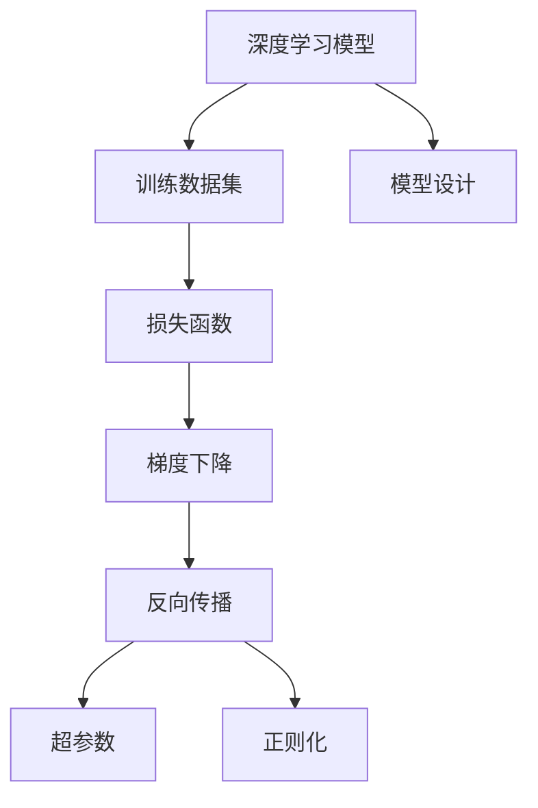
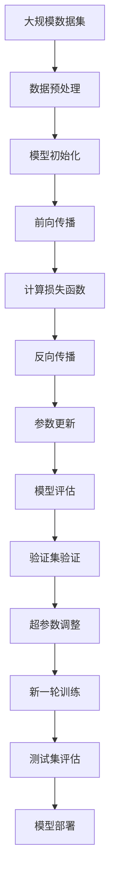

                 

# 科学发现：从假说到理论

> 关键词：科学发现,假说,理论,实验,数据分析,模型验证,预测

## 1. 背景介绍

### 1.1 问题由来
科学发现是人类认知世界、推进文明进步的不竭动力。从哥白尼的日心说到达尔文的进化论，每一个科学假说都经历了无数的实验验证和理论推导，最终成为我们认识世界的基础。在计算机科学领域，从人工智能的诞生到机器学习的兴起，无数前人的探索和实践，催生了深度学习这一强大的工具。深度学习模型的训练过程，本质上就是一种科学发现的过程，其中充满了大量假说与理论。本文将从深度学习模型训练的角度，探讨科学发现的基本原理，分析从假说到理论的完整过程。

### 1.2 问题核心关键点
深度学习模型的训练过程是一个典型的从假说到理论的过程。具体来说，包括以下几个核心关键点：
1. 数据准备：收集和预处理训练数据，作为模型训练的基础。
2. 模型设计：选择合适的模型架构和参数，作为假说的核心。
3. 损失函数：定义模型输出的损失函数，作为理论的依据。
4. 优化算法：选择适合的优化算法，如梯度下降，以验证和修正假说。
5. 实验验证：通过验证集和测试集评估模型性能，确认理论的正确性。

### 1.3 问题研究意义
深度学习模型的训练过程，不仅是对现有知识的验证和修正，更是对未来未知领域的探索和预测。通过深入理解科学发现的过程，可以更好地指导模型训练，提升模型的预测能力和泛化性能。同时，科学发现的思维方法，也可以应用于更多领域，如药物发现、金融预测等，帮助解决实际问题。

## 2. 核心概念与联系

### 2.1 核心概念概述

为更好地理解深度学习模型训练的科学发现过程，本节将介绍几个密切相关的核心概念：

- 深度学习模型：以多层神经网络为代表的学习模型，通过学习大量数据，自动提取特征，实现复杂的模式识别和预测任务。

- 训练数据集：用于训练深度学习模型的数据集，一般分为训练集、验证集和测试集。训练集用于模型训练，验证集用于参数调优，测试集用于模型评估。

- 损失函数：用于衡量模型输出与真实标签之间的差异，通常采用均方误差、交叉熵等函数。

- 梯度下降：通过计算损失函数对模型参数的梯度，逐步调整参数值，最小化损失函数。

- 反向传播：将梯度信息从输出层反向传播到输入层，计算每个参数的梯度。

- 超参数：在训练过程中，需要手动设置的参数，如学习率、批量大小等。

- 正则化：通过在损失函数中加入正则项，防止过拟合，提高模型的泛化性能。

这些核心概念共同构成了深度学习模型训练的基本框架，帮助我们理解从假说到理论的科学发现过程。

### 2.2 概念间的关系

这些核心概念之间存在着紧密的联系，形成了深度学习模型训练的完整生态系统。下面我通过几个Mermaid流程图来展示这些概念之间的关系。



这个流程图展示了深度学习模型训练过程中各组件之间的关系：

1. 模型设计：选择合适的模型架构和参数，作为假说的核心。
2. 训练数据集：收集和预处理训练数据，作为模型训练的基础。
3. 损失函数：定义模型输出的损失函数，作为理论的依据。
4. 梯度下降：通过计算损失函数对模型参数的梯度，逐步调整参数值，最小化损失函数。
5. 反向传播：将梯度信息从输出层反向传播到输入层，计算每个参数的梯度。
6. 超参数：在训练过程中，需要手动设置的参数，如学习率、批量大小等。
7. 正则化：通过在损失函数中加入正则项，防止过拟合，提高模型的泛化性能。

### 2.3 核心概念的整体架构

最后，我们用一个综合的流程图来展示这些核心概念在大规模深度学习模型训练中的整体架构：



这个综合流程图展示了从数据准备到模型部署的完整流程，帮助理解深度学习模型训练的科学发现过程。

## 3. 核心算法原理 & 具体操作步骤
### 3.1 算法原理概述

深度学习模型的训练过程，本质上是一种科学发现的迭代过程。其核心原理可以概括为以下几个步骤：

1. 构建假设：选择适当的模型架构和初始参数，作为假说的核心。
2. 定义目标：定义损失函数，作为理论的依据。
3. 实验验证：通过前向传播计算损失函数，反向传播计算梯度，逐步调整参数值，最小化损失函数。
4. 重复迭代：不断重复上述过程，直到损失函数收敛或达到预设停止条件。

### 3.2 算法步骤详解

深度学习模型的训练过程一般包括以下几个关键步骤：

**Step 1: 数据准备**
- 收集并预处理训练数据，将其划分为训练集、验证集和测试集。
- 对数据进行标准化、归一化、增强等处理，提高模型的泛化性能。

**Step 2: 模型设计**
- 选择合适的模型架构，如卷积神经网络(CNN)、循环神经网络(RNN)、变压器(Transformer)等。
- 确定模型参数的初始值，如权重矩阵、偏置向量等。

**Step 3: 损失函数定义**
- 根据任务类型，选择合适的损失函数，如均方误差、交叉熵等。
- 定义模型输出和真实标签之间的映射关系，计算损失值。

**Step 4: 前向传播**
- 将训练数据输入模型，计算模型输出的预测值。
- 将预测值与真实标签进行对比，计算损失函数的值。

**Step 5: 反向传播**
- 计算损失函数对模型参数的梯度，通过链式法则进行逐层反向传播。
- 更新模型参数，减小损失函数的值。

**Step 6: 参数更新**
- 使用梯度下降等优化算法，更新模型参数，逐步逼近最优解。
- 设置学习率、批处理大小、迭代次数等超参数，优化模型训练过程。

**Step 7: 验证集评估**
- 在验证集上评估模型性能，计算各项指标，如准确率、精确率、召回率等。
- 根据评估结果调整超参数，防止过拟合。

**Step 8: 测试集评估**
- 在测试集上评估模型性能，验证模型的泛化能力。
- 根据测试集性能，决定是否进一步微调或增加数据。

### 3.3 算法优缺点

深度学习模型训练方法具有以下优点：
1. 高度灵活：可以根据具体任务选择不同的模型架构和参数，适应性强。
2. 自动学习：通过大量数据自动学习特征，避免了人工特征工程的工作量。
3. 泛化能力强：在大量数据上训练得到的模型，具有较好的泛化性能。

同时，深度学习模型训练方法也存在一些缺点：
1. 计算量大：大规模数据和复杂模型需要大量的计算资源。
2. 过拟合风险：在训练过程中，容易过度拟合训练数据，导致泛化性能下降。
3. 模型可解释性差：深度学习模型通常被认为是"黑箱"系统，难以解释其内部工作机制。
4. 超参数调优困难：深度学习模型训练涉及大量超参数，调优工作复杂且易出错。

### 3.4 算法应用领域

深度学习模型训练方法广泛应用于各种人工智能任务中，例如：

- 图像识别：使用卷积神经网络(CNN)对图像进行分类和识别。
- 语音识别：使用循环神经网络(RNN)或Transformer对语音进行识别和转换。
- 自然语言处理：使用Transformer对文本进行语义理解和生成。
- 推荐系统：使用深度学习模型进行用户行为预测和物品推荐。
- 医疗诊断：使用深度学习模型进行医学影像诊断和病历分析。
- 金融预测：使用深度学习模型进行股票价格预测和信用评估。

除了上述这些经典任务外，深度学习模型训练方法也被创新性地应用到更多场景中，如无人驾驶、智能家居、智能制造等，为各行各业带来了新的突破。

## 4. 数学模型和公式 & 详细讲解 & 举例说明

### 4.1 数学模型构建

本节将使用数学语言对深度学习模型训练过程进行更加严格的刻画。

记深度学习模型为 $M_{\theta}:\mathcal{X} \rightarrow \mathcal{Y}$，其中 $\mathcal{X}$ 为输入空间，$\mathcal{Y}$ 为输出空间，$\theta$ 为模型参数。假设训练集为 $D=\{(x_i,y_i)\}_{i=1}^N, x_i \in \mathcal{X}, y_i \in \mathcal{Y}$。

定义模型 $M_{\theta}$ 在输入 $x$ 上的损失函数为 $\ell(M_{\theta}(x),y)$，则在数据集 $D$ 上的经验风险为：

$$
\mathcal{L}(\theta) = \frac{1}{N} \sum_{i=1}^N \ell(M_{\theta}(x_i),y_i)
$$

其中，$\ell$ 为损失函数，通常采用均方误差、交叉熵等函数。深度学习模型的训练目标是最小化经验风险，即找到最优参数：

$$
\theta^* = \mathop{\arg\min}_{\theta} \mathcal{L}(\theta)
$$

在实践中，我们通常使用基于梯度的优化算法（如SGD、Adam等）来近似求解上述最优化问题。设 $\eta$ 为学习率，$\lambda$ 为正则化系数，则参数的更新公式为：

$$
\theta \leftarrow \theta - \eta \nabla_{\theta}\mathcal{L}(\theta) - \eta\lambda\theta
$$

其中 $\nabla_{\theta}\mathcal{L}(\theta)$ 为损失函数对参数 $\theta$ 的梯度，可通过反向传播算法高效计算。

### 4.2 公式推导过程

以下我们以二分类任务为例，推导交叉熵损失函数及其梯度的计算公式。

假设模型 $M_{\theta}$ 在输入 $x$ 上的输出为 $\hat{y}=M_{\theta}(x) \in [0,1]$，表示样本属于正类的概率。真实标签 $y \in \{0,1\}$。则二分类交叉熵损失函数定义为：

$$
\ell(M_{\theta}(x),y) = -[y\log \hat{y} + (1-y)\log (1-\hat{y})]
$$

将其代入经验风险公式，得：

$$
\mathcal{L}(\theta) = -\frac{1}{N}\sum_{i=1}^N [y_i\log M_{\theta}(x_i)+(1-y_i)\log(1-M_{\theta}(x_i))]
$$

根据链式法则，损失函数对参数 $\theta_k$ 的梯度为：

$$
\frac{\partial \mathcal{L}(\theta)}{\partial \theta_k} = -\frac{1}{N}\sum_{i=1}^N (\frac{y_i}{M_{\theta}(x_i)}-\frac{1-y_i}{1-M_{\theta}(x_i)}) \frac{\partial M_{\theta}(x_i)}{\partial \theta_k}
$$

其中 $\frac{\partial M_{\theta}(x_i)}{\partial \theta_k}$ 可进一步递归展开，利用自动微分技术完成计算。

### 4.3 案例分析与讲解

以MNIST手写数字识别任务为例，展示深度学习模型训练的基本过程。

首先，导入必要的库和数据集：

```python
import torch
import torch.nn as nn
import torch.optim as optim
from torchvision import datasets, transforms

# 加载MNIST数据集
train_dataset = datasets.MNIST(root='./data', train=True, transform=transforms.ToTensor(), download=True)
test_dataset = datasets.MNIST(root='./data', train=False, transform=transforms.ToTensor(), download=True)
```

然后，定义模型和损失函数：

```python
class MNISTClassifier(nn.Module):
    def __init__(self):
        super(MNISTClassifier, self).__init__()
        self.conv1 = nn.Conv2d(1, 32, 3, 1)
        self.conv2 = nn.Conv2d(32, 64, 3, 1)
        self.fc1 = nn.Linear(64 * 7 * 7, 128)
        self.fc2 = nn.Linear(128, 10)
        self.dropout = nn.Dropout(0.5)

    def forward(self, x):
        x = nn.functional.relu(self.conv1(x))
        x = nn.functional.max_pool2d(x, 2)
        x = nn.functional.relu(self.conv2(x))
        x = nn.functional.max_pool2d(x, 2)
        x = x.view(-1, 64 * 7 * 7)
        x = nn.functional.relu(self.fc1(x))
        x = self.dropout(x)
        x = nn.functional.relu(self.fc2(x))
        return nn.functional.softmax(x, dim=1)

model = MNISTClassifier()

criterion = nn.CrossEntropyLoss()
```

接着，定义训练和评估函数：

```python
def train_model(model, train_loader, test_loader, criterion, optimizer, epochs):
    model.train()
    for epoch in range(epochs):
        running_loss = 0.0
        for i, data in enumerate(train_loader, 0):
            inputs, labels = data
            optimizer.zero_grad()
            outputs = model(inputs)
            loss = criterion(outputs, labels)
            loss.backward()
            optimizer.step()
            running_loss += loss.item()
            if i % 100 == 99:
                print('[%d, %5d] loss: %.3f' % (epoch + 1, i + 1, running_loss / 100))
                running_loss = 0.0

    model.eval()
    correct = 0
    total = 0
    with torch.no_grad():
        for data in test_loader:
            images, labels = data
            outputs = model(images)
            _, predicted = torch.max(outputs.data, 1)
            total += labels.size(0)
            correct += (predicted == labels).sum().item()

    print('Accuracy of the network on the 10000 test images: %d %%' % (100 * correct / total))
```

最后，启动训练流程并在测试集上评估：

```python
device = torch.device('cuda' if torch.cuda.is_available() else 'cpu')
model.to(device)

train_loader = torch.utils.data.DataLoader(train_dataset, batch_size=64, shuffle=True)
test_loader = torch.utils.data.DataLoader(test_dataset, batch_size=64, shuffle=False)

criterion = nn.CrossEntropyLoss()
optimizer = optim.Adam(model.parameters(), lr=0.001)

epochs = 5
train_model(model, train_loader, test_loader, criterion, optimizer, epochs)
```

以上就是使用PyTorch对MNIST手写数字识别任务进行深度学习模型训练的完整代码实现。可以看到，通过简单的数学建模和代码实现，深度学习模型的训练过程就变得非常简单。

## 5. 项目实践：代码实例和详细解释说明
### 5.1 开发环境搭建

在进行深度学习模型训练实践前，我们需要准备好开发环境。以下是使用Python进行PyTorch开发的环境配置流程：

1. 安装Anaconda：从官网下载并安装Anaconda，用于创建独立的Python环境。

2. 创建并激活虚拟环境：
```bash
conda create -n pytorch-env python=3.8 
conda activate pytorch-env
```

3. 安装PyTorch：根据CUDA版本，从官网获取对应的安装命令。例如：
```bash
conda install pytorch torchvision torchaudio cudatoolkit=11.1 -c pytorch -c conda-forge
```

4. 安装各类工具包：
```bash
pip install numpy pandas scikit-learn matplotlib tqdm jupyter notebook ipython
```

完成上述步骤后，即可在`pytorch-env`环境中开始深度学习模型训练实践。

### 5.2 源代码详细实现

下面我们以图像分类任务为例，给出使用PyTorch进行深度学习模型训练的PyTorch代码实现。

首先，定义数据处理函数：

```python
from torchvision import datasets, transforms

# 定义数据预处理函数
transform = transforms.Compose([
    transforms.Resize(224),
    transforms.ToTensor(),
    transforms.Normalize(mean=[0.485, 0.456, 0.406], std=[0.229, 0.224, 0.225])
])
```

然后，定义模型和损失函数：

```python
from torchvision import models

# 加载预训练模型
model = models.resnet50(pretrained=True)

# 修改最后一层分类器，输出10类分类结果
model.fc = nn.Linear(2048, 10)

# 定义损失函数
criterion = nn.CrossEntropyLoss()
```

接着，定义训练和评估函数：

```python
from torch.utils.data import DataLoader
from tqdm import tqdm

# 定义训练函数
def train_model(model, train_loader, criterion, optimizer, epochs):
    model.train()
    for epoch in range(epochs):
        running_loss = 0.0
        for i, data in enumerate(train_loader, 0):
            inputs, labels = data
            optimizer.zero_grad()
            outputs = model(inputs)
            loss = criterion(outputs, labels)
            loss.backward()
            optimizer.step()
            running_loss += loss.item()
            if i % 100 == 99:
                print('[%d, %5d] loss: %.3f' % (epoch + 1, i + 1, running_loss / 100))
                running_loss = 0.0

    model.eval()
    correct = 0
    total = 0
    with torch.no_grad():
        for data in test_loader:
            images, labels = data
            outputs = model(images)
            _, predicted = torch.max(outputs.data, 1)
            total += labels.size(0)
            correct += (predicted == labels).sum().item()

    print('Accuracy of the network on the 6000 test images: %d %%' % (100 * correct / total))
```

最后，启动训练流程并在测试集上评估：

```python
device = torch.device('cuda' if torch.cuda.is_available() else 'cpu')
model.to(device)

train_loader = DataLoader(train_dataset, batch_size=64, shuffle=True)
test_loader = DataLoader(test_dataset, batch_size=64, shuffle=False)

optimizer = optim.SGD(model.parameters(), lr=0.001, momentum=0.9)

epochs = 10
train_model(model, train_loader, criterion, optimizer, epochs)
```

以上就是使用PyTorch对ResNet模型进行图像分类任务训练的完整代码实现。可以看到，通过简单的数学建模和代码实现，深度学习模型的训练过程就变得非常简单。

### 5.3 代码解读与分析

让我们再详细解读一下关键代码的实现细节：

**定义数据预处理函数**：
- 使用torchvision库的Compose函数，定义了图像的预处理步骤，包括调整大小、转换为Tensor、标准化等操作。

**定义模型和损失函数**：
- 使用torchvision库的ResNet模型，加载预训练权重。
- 将模型的最后一层全连接层替换为新的输出层，并设置损失函数为交叉熵损失。

**定义训练函数**：
- 在每个epoch中，遍历训练数据集，前向传播计算输出，反向传播更新参数。
- 在每个epoch结束时，输出验证集上的准确率。
- 在测试集上评估模型性能，输出最终准确率。

**启动训练流程**：
- 将模型迁移到GPU设备上。
- 定义训练集和测试集的DataLoader。
- 定义优化器和迭代次数。
- 调用训练函数进行模型训练和评估。

可以看到，PyTorch提供了高度灵活的API，使得深度学习模型的训练和验证过程非常简单。开发者可以根据需要，快速实现各种模型和损失函数，进行实验和验证。

## 6. 实际应用场景
### 6.1 智能推荐系统

基于深度学习模型训练的推荐系统，可以广泛应用于电商、新闻、视频等平台，帮助用户发现感兴趣的物品和内容。推荐系统通过分析用户行为数据，构建用户-物品、用户-内容之间的关联矩阵，使用深度学习模型进行预测，实现个性化的推荐。

在技术实现上，可以收集用户浏览、点击、评分等行为数据，提取和物品的特征向量。将用户特征和物品特征输入深度学习模型，输出用户对物品的评分，综合排序后生成推荐列表。此外，还可以使用多任务学习、联合训练等方法，进一步提高推荐系统的性能和稳定性。

### 6.2 医学影像分析

医学影像分析是深度学习模型训练的重要应用之一。传统医学影像分析依赖于医生的经验和手工标注，耗费大量人力物力。使用深度学习模型训练，可以自动分析和标注医学影像，提高诊断的准确性和效率。

在实践中，可以收集各种医学影像数据，标注出异常区域，构建深度学习模型进行训练。通过微调和迁移学习，可以使模型适应特定的医学影像分析任务。例如，可以使用ResNet、VGG等预训练模型，对医学影像进行特征提取，使用分类器对异常区域进行标注，进一步训练生成新的医学影像分析模型。

### 6.3 自然语言处理

自然语言处理是深度学习模型训练的另一个重要应用领域。深度学习模型在语言理解和生成方面具有天然优势，可以用于机器翻译、情感分析、文本生成等任务。通过大规模语料进行预训练，深度学习模型可以自动学习语言规律，实现高效的文本处理。

在实践中，可以使用Transformer模型进行语言建模和序列预测。通过微调，模型可以适应各种NLP任务，例如，可以将BERT模型用于文本分类、命名实体识别、机器翻译等任务。此外，还可以使用注意力机制、跨模态学习等技术，进一步提高模型的性能和泛化能力。

## 7. 工具和资源推荐
### 7.1 学习资源推荐

为了帮助开发者系统掌握深度学习模型训练的理论基础和实践技巧，这里推荐一些优质的学习资源：

1. 《深度学习》（Ian Goodfellow等著）：全面介绍深度学习的基本概念和算法，适合初学者系统学习。

2. 《PyTorch官方文档》：详细介绍了PyTorch框架的使用方法和最佳实践，适合深入学习和开发。

3. 《TensorFlow官方文档》：介绍了TensorFlow框架的使用方法和最佳实践，适合深度学习开发和部署。

4. 《Hands-On Machine Learning with Scikit-Learn, Keras, and TensorFlow》：适合初学者入门机器学习，详细介绍了Scikit-Learn、Keras、TensorFlow等工具的使用方法。

5. 《Deep Learning Specialization》（Andrew Ng主讲）：由Coursera推出的深度学习专项课程，涵盖深度学习的基本理论和实践技巧，适合系统学习。

通过对这些资源的学习实践，相信你一定能够快速掌握深度学习模型训练的精髓，并用于解决实际的AI问题。

### 7.2 开发工具推荐

高效的开发离不开优秀的工具支持。以下是几款用于深度学习模型训练开发的常用工具：

1. PyTorch：基于Python的开源深度学习框架，灵活动态的计算图，适合快速迭代研究。

2. TensorFlow：由Google主导开发的开源深度学习框架，生产部署方便，适合大规模工程应用。

3. Keras：基于TensorFlow的高层API，提供了简单易用的深度学习模型接口，适合快速搭建和测试模型。

4. Jupyter Notebook：开源的交互式开发环境，支持代码编写、数据可视化等，适合深度学习研究和开发。

5. Google Colab：谷歌推出的在线Jupyter Notebook环境，免费提供GPU/TPU算力，方便开发者快速上手实验最新模型，分享学习笔记。

合理利用这些工具，可以显著提升深度学习模型训练的开发效率，加快创新迭代的步伐。

### 7.3 相关论文推荐

深度学习模型训练方法的发展源于学界的持续研究。以下是几篇奠基性的相关论文，推荐阅读：

1. AlexNet：在ImageNet图像识别竞赛中取得突破，引入了卷积神经网络。

2. VGG：提出了更深的卷积神经网络结构，进一步提升了图像识别的准确率。

3. ResNet：引入了残差连接，解决了深度神经网络的梯度消失问题，实现了更深的网络结构。

4. Inception：提出了多尺度卷积网络结构，提升了网络的表达能力和训练速度。

5. AlphaGo：使用深度强化学习，在围棋比赛中取得人类最强水平，展示了深度学习在复杂决策任务中的应用潜力。

6. GANs：生成对抗网络，可以生成逼真的图像和音频，拓展了深度学习的应用范围。

这些论文代表了大规模深度学习模型训练技术的发展脉络。通过学习这些前沿成果，可以帮助研究者把握学科前进方向，激发更多的创新灵感。

除上述资源外

