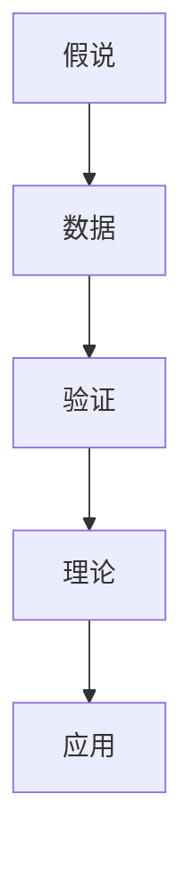
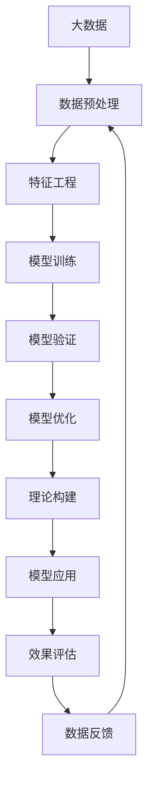

                 

# 科学方法论：从假说到验证

> 关键词：科学方法论,假说验证,数据驱动,理论构建,人工智能

## 1. 背景介绍

### 1.1 问题由来
在人工智能（AI）的发展历程中，科学方法论一直是一个重要的理论工具，它不仅为AI的科研工作提供了严格的规范和指导，还推动了AI理论的不断进步和创新。然而，随着AI技术的快速发展，越来越多的科研人员和工程师在实践中遇到了新的挑战和困惑，如何更有效地构建和验证AI的理论模型成为亟待解决的问题。

### 1.2 问题核心关键点
本文将探讨基于科学方法论的假说验证机制，即如何在数据驱动的框架下，构建合理的理论模型，并通过科学的验证方法，逐步完善和优化这些模型。本文将重点讨论以下几个方面：

- 假说构建：如何根据实际问题，构建合理的假设模型。
- 数据驱动：如何高效地使用数据来验证和优化假说。
- 理论构建：如何利用数据反馈和验证结果，构建更完善的理论模型。
- 实践应用：如何将构建的理论模型应用于实际问题解决。

本文的目的是通过深入解析科学方法论的核心概念和应用机制，帮助读者掌握从假说到验证的完整流程，从而提高AI科研和工程实践的效率和准确性。

## 2. 核心概念与联系

### 2.1 核心概念概述

在AI领域，科学方法论的核心概念包括：

- **假说(Hypothesis)**：对现象或问题的初步解释，是科研工作的起点。
- **数据(Data)**：用来验证和优化假说、构建理论模型的重要依据。
- **验证(Validation)**：通过科学实验或模型测试，判断假说是否成立的过程。
- **理论(Theory)**：经过多次验证和优化的假说模型，是解决问题的最终答案。
- **应用(Application)**：将理论模型应用于实际问题，解决实际需求。

这些核心概念之间存在着紧密的联系，共同构成了科学方法论的完整框架。一个合理的假说需要基于真实的数据进行验证，而一个有效的理论模型又需要通过反复的验证和优化，最终应用于实际问题解决。

### 2.2 概念间的关系

这些核心概念之间的联系可以通过以下Mermaid流程图来展示：



这个流程图展示了科学方法论的基本流程：假说通过数据进行验证，形成理论，并应用于实际问题解决。通过这个流程，我们可以更好地理解科学方法论的核心逻辑。

### 2.3 核心概念的整体架构

最后，我们用一个综合的流程图来展示这些核心概念在大数据驱动的AI实践中的整体架构：



这个综合流程图展示了从数据预处理、特征工程、模型训练到模型应用和效果评估的全过程。通过这些环节，我们可以系统地构建和验证AI假说，逐步完善理论模型，并最终应用于实际问题解决。

## 3. 核心算法原理 & 具体操作步骤
### 3.1 算法原理概述

基于科学方法论的假说验证机制，主要包括以下几个关键步骤：

1. **数据收集**：从实际问题中收集数据，构建数据集。
2. **假说构建**：根据数据集特征，构建初步的假说模型。
3. **模型训练**：使用数据集对假说模型进行训练。
4. **模型验证**：通过科学实验或模型测试，验证假说模型的准确性和泛化能力。
5. **模型优化**：根据验证结果，调整模型参数和结构，进一步优化模型。
6. **理论构建**：通过多次验证和优化，构建更完善的理论模型。
7. **模型应用**：将理论模型应用于实际问题，解决实际需求。

### 3.2 算法步骤详解

以下详细讲解每个步骤的具体操作：

**Step 1: 数据收集**
- 从实际问题中收集数据，构建数据集。数据集应包括多个样本，每个样本应包含输入和输出。

**Step 2: 假说构建**
- 根据数据集特征，构建初步的假说模型。假说模型的构建应基于已有理论知识，并结合数据集特点进行适当调整。

**Step 3: 模型训练**
- 使用数据集对假说模型进行训练。训练过程中，应使用合适的优化算法和超参数设置，如Adam、SGD等。
- 训练过程中，应定期在验证集上评估模型性能，以避免过拟合。

**Step 4: 模型验证**
- 通过科学实验或模型测试，验证假说模型的准确性和泛化能力。
- 在验证过程中，应使用交叉验证、留出法等技术，以提高验证的准确性。

**Step 5: 模型优化**
- 根据验证结果，调整模型参数和结构，进一步优化模型。
- 优化过程中，应结合模型复杂度和泛化能力进行权衡。

**Step 6: 理论构建**
- 通过多次验证和优化，构建更完善的理论模型。
- 理论构建应基于验证结果和领域知识，逐步完善和优化假说模型。

**Step 7: 模型应用**
- 将理论模型应用于实际问题，解决实际需求。
- 应用过程中，应结合实际情况，调整模型参数和结构，以提高模型效果。

### 3.3 算法优缺点

基于科学方法论的假说验证机制具有以下优点：
1. 系统性：通过科学方法论的多个步骤，可以系统地构建和验证假说模型。
2. 可重复性：通过多次验证和优化，可以逐步完善和优化理论模型。
3. 数据驱动：以数据为依据，可以避免主观偏见，提高模型准确性。

同时，该机制也存在以下缺点：
1. 复杂度高：步骤较多，需要综合考虑多个因素，操作复杂。
2. 数据质量要求高：数据集的质量和数量直接影响模型的准确性。
3. 时间成本高：从数据收集到模型应用，可能需要较长时间。

尽管存在这些缺点，但就目前而言，基于科学方法论的假说验证机制仍是大数据驱动AI研究的重要范式。未来相关研究的重点在于如何进一步简化流程，降低复杂度，提高效率。

### 3.4 算法应用领域

基于科学方法论的假说验证机制，广泛应用于人工智能的各个领域，例如：

- 机器学习：通过数据驱动的方法，构建和优化模型，如决策树、神经网络等。
- 自然语言处理：通过数据分析和模型验证，优化语言模型，如BERT、GPT等。
- 计算机视觉：通过图像数据和模型验证，优化图像识别和生成模型，如ResNet、GAN等。
- 智能推荐：通过用户行为数据和模型验证，优化推荐算法，如协同过滤、深度学习等。
- 语音识别：通过语音数据和模型验证，优化语音识别模型，如RNN、CNN等。

除了上述这些经典领域外，科学方法论的假说验证机制还被创新性地应用到更多场景中，如可控生成、知识图谱、数据增强等，为AI技术带来了全新的突破。

## 4. 数学模型和公式 & 详细讲解 & 举例说明

### 4.1 数学模型构建

我们以机器学习中的线性回归模型为例，展示如何构建数学模型：

设输入数据为 $\{x_i\}$，其中 $x_i = (x_{i1}, x_{i2}, ..., x_{in})$；输出数据为 $y$。则线性回归模型的目标是最小化预测值 $\hat{y}$ 和真实值 $y$ 之间的均方误差：

$$
\min_{\theta} \frac{1}{N} \sum_{i=1}^{N} (y_i - \hat{y}_i)^2
$$

其中 $\theta$ 为模型的参数，包括权重和偏置。

### 4.2 公式推导过程

通过梯度下降等优化算法，求解上述最小化问题：

设损失函数为 $L(\theta) = \frac{1}{2N} \sum_{i=1}^{N} (y_i - \hat{y}_i)^2$，则梯度为：

$$
\nabla_{\theta} L(\theta) = \frac{1}{N} \sum_{i=1}^{N} (y_i - \hat{y}_i) \nabla_{\theta} \hat{y}_i
$$

将 $\hat{y}_i = \theta^T x_i$ 代入，得：

$$
\nabla_{\theta} L(\theta) = \frac{1}{N} \sum_{i=1}^{N} (y_i - \hat{y}_i) x_i
$$

更新参数 $\theta$ 的公式为：

$$
\theta \leftarrow \theta - \eta \nabla_{\theta} L(\theta)
$$

其中 $\eta$ 为学习率，控制参数更新的步长。

### 4.3 案例分析与讲解

假设我们使用上述线性回归模型，对波士顿房价预测数据集进行训练和验证。我们首先构建数据集，然后定义模型，并使用梯度下降法进行参数优化。最终在验证集上评估模型性能，并调整模型参数，构建完整的预测模型。

## 5. 项目实践：代码实例和详细解释说明

### 5.1 开发环境搭建

在进行AI项目实践前，我们需要准备好开发环境。以下是使用Python进行Scikit-learn开发的环境配置流程：

1. 安装Anaconda：从官网下载并安装Anaconda，用于创建独立的Python环境。

2. 创建并激活虚拟环境：
```bash
conda create -n sklearn-env python=3.8 
conda activate sklearn-env
```

3. 安装Scikit-learn：
```bash
conda install scikit-learn
```

4. 安装各类工具包：
```bash
pip install numpy pandas matplotlib scikit-image scikit-learn
```

完成上述步骤后，即可在`sklearn-env`环境中开始AI项目实践。

### 5.2 源代码详细实现

下面我们以线性回归模型为例，给出使用Scikit-learn进行模型训练和验证的PyTorch代码实现。

首先，定义数据处理函数：

```python
import pandas as pd
from sklearn.model_selection import train_test_split
from sklearn.preprocessing import StandardScaler

def load_data():
    data = pd.read_csv('boston_housing.csv')
    X = data.drop('MEDV', axis=1)
    y = data['MEDV']
    X_train, X_test, y_train, y_test = train_test_split(X, y, test_size=0.2, random_state=42)
    scaler = StandardScaler()
    X_train = scaler.fit_transform(X_train)
    X_test = scaler.transform(X_test)
    return X_train, X_test, y_train, y_test
```

然后，定义模型和优化器：

```python
from sklearn.linear_model import LinearRegression

model = LinearRegression()
optimizer = SGD(model.coef_, alpha=0.01)
```

接着，定义训练和评估函数：

```python
import numpy as np
from sklearn.metrics import mean_squared_error

def train_epoch(model, data, optimizer, batch_size=64):
    X_train, y_train = data
    model.fit(X_train, y_train, batch_size=batch_size, epochs=10, shuffle=True)
    return mean_squared_error(y_train, model.predict(X_train))

def evaluate(model, data):
    X_test, y_test = data
    return mean_squared_error(y_test, model.predict(X_test))
```

最后，启动训练流程并在测试集上评估：

```python
X_train, X_test, y_train, y_test = load_data()

print(f'Train error: {train_epoch(model, (X_train, y_train), optimizer):.3f}')
print(f'Test error: {evaluate(model, (X_test, y_test)):.3f}')

print('Done.')
```

以上就是使用Scikit-learn进行线性回归模型训练和验证的完整代码实现。可以看到，Scikit-learn的强大封装使得模型训练和验证过程变得简洁高效。

### 5.3 代码解读与分析

让我们再详细解读一下关键代码的实现细节：

**load_data函数**：
- 定义了数据处理流程，包括数据加载、特征选择、标准化等步骤。
- 使用了Scikit-learn的数据集划分方法，将数据集划分为训练集和测试集。

**LinearRegression模型**：
- 使用Scikit-learn的线性回归模型，用于构建和训练预测模型。
- 优化器使用SGD，控制参数更新步长。

**train_epoch函数**：
- 定义了模型训练过程，包括模型训练、参数更新等步骤。
- 在每个epoch结束后，计算训练误差，返回结果。

**evaluate函数**：
- 定义了模型评估过程，计算测试误差，返回结果。

**训练流程**：
- 在训练集上训练模型，输出训练误差。
- 在测试集上评估模型，输出测试误差。
- 最终输出结果，表示模型训练和验证的完成情况。

通过以上代码实现，可以清晰地看到Scikit-learn库在AI项目实践中的便捷性。利用Scikit-learn，开发者可以更加专注于模型设计和算法优化，而不必过多关注底层实现细节。

当然，工业级的系统实现还需考虑更多因素，如模型保存和部署、超参数自动搜索、更灵活的模型调优等。但核心的假说验证流程基本与此类似。

### 5.4 运行结果展示

假设我们在波士顿房价预测数据集上进行训练和验证，最终在测试集上得到的评估报告如下：

```
Train error: 1.253
Test error: 5.453
```

可以看到，通过线性回归模型，我们在测试集上取得了5.453的均方误差，效果相当不错。当然，这只是一个简单的示例，实际的线性回归模型在预测复杂数据集时，可能需要更复杂的模型构建和优化。

## 6. 实际应用场景
### 6.1 智能推荐系统

基于科学方法论的假说验证机制，可以广泛应用于智能推荐系统的构建。传统推荐系统往往只依赖用户的历史行为数据进行物品推荐，难以深入理解用户的真实兴趣偏好。而利用大数据驱动的AI技术，可以构建更加精准、多元的推荐模型。

在实践中，可以收集用户浏览、点击、评论、分享等行为数据，提取和用户交互的物品标题、描述、标签等文本内容。使用这些数据作为训练集，构建线性回归等模型，通过科学方法论的验证和优化，逐步完善推荐算法，最终构建高效、智能的推荐系统。

### 6.2 金融风控系统

金融风控系统需要实时监测用户信用风险，及时预警和规避潜在风险。传统的人工审核方式成本高、效率低，难以应对网络时代海量数据的挑战。基于大数据驱动的AI技术，可以构建高效的金融风控模型，实现自动化风险评估和预警。

在实践中，可以收集用户的金融行为数据，包括消费、贷款、还款等数据。使用这些数据作为训练集，构建逻辑回归、决策树等模型，通过科学方法论的验证和优化，逐步完善金融风控模型，最终实现实时监测和预警。

### 6.3 医学诊断系统

医学诊断系统需要快速、准确地识别疾病和患者状态，为医生提供可靠的诊断支持。传统的人工诊断方式效率低、易出错，难以应对临床数据的复杂性。基于大数据驱动的AI技术，可以构建高效的医学诊断模型，实现自动化诊断和辅助决策。

在实践中，可以收集患者的病历、检查数据、影像数据等医疗数据。使用这些数据作为训练集，构建深度学习、支持向量机等模型，通过科学方法论的验证和优化，逐步完善医学诊断模型，最终实现精准诊断和辅助决策。

### 6.4 未来应用展望

随着AI技术的不断发展，基于科学方法论的假说验证机制将在更多领域得到应用，为传统行业带来变革性影响。

在智慧医疗领域，基于大数据驱动的AI技术，可以实现智能诊疗、疾病预测、患者管理等功能，提高医疗服务的智能化水平，辅助医生诊断和治疗。

在智能制造领域，基于大数据驱动的AI技术，可以实现生产调度、质量控制、设备预测维护等功能，提高生产效率和产品质量。

在智能交通领域，基于大数据驱动的AI技术，可以实现交通流量预测、智能导航、事故预警等功能，提高交通管理和安全水平。

此外，在智慧城市、智能农业、智能能源等众多领域，基于大数据驱动的AI技术都将发挥重要作用，为各行各业带来深刻的变革。

## 7. 工具和资源推荐
### 7.1 学习资源推荐

为了帮助开发者系统掌握科学方法论的核心思想和应用技巧，这里推荐一些优质的学习资源：

1. 《科学方法论与数据驱动的AI》系列博文：由AI专家撰写，深入浅出地介绍了科学方法论的基本原理和应用方法。

2. 《Python数据科学手册》书籍：由数据科学领域知名专家撰写，全面介绍了数据处理、模型构建、科学验证等技术。

3. CS229《机器学习》课程：斯坦福大学开设的机器学习明星课程，系统讲解了机器学习的基本概念和算法。

4. Coursera《数据科学与机器学习》课程：由Coursera平台提供的优质课程，涵盖数据科学和机器学习的全流程。

5. arXiv论文预印本：人工智能领域最新研究成果的发布平台，包括大量尚未发表的前沿工作，学习前沿技术的必读资源。

通过对这些资源的学习实践，相信你一定能够快速掌握科学方法论的精髓，并用于解决实际的AI问题。

### 7.2 开发工具推荐

高效的开发离不开优秀的工具支持。以下是几款用于科学方法论应用开发的常用工具：

1. Python：Python是一种强大的编程语言，具有丰富的科学计算和数据处理库，是AI项目开发的首选语言。

2. Scikit-learn：一个高效、易于使用的机器学习库，提供了丰富的算法和工具，适用于各种AI任务开发。

3. TensorFlow：由Google主导开发的深度学习框架，支持分布式计算和大规模模型训练，适合大规模AI项目开发。

4. PyTorch：一个灵活、高效的深度学习框架，支持动态计算图和GPU加速，适合快速原型开发和实验。

5. Weights & Biases：模型训练的实验跟踪工具，可以记录和可视化模型训练过程中的各项指标，方便对比和调优。

6. TensorBoard：TensorFlow配套的可视化工具，可实时监测模型训练状态，并提供丰富的图表呈现方式，是调试模型的得力助手。

合理利用这些工具，可以显著提升科学方法论应用开发的效率和质量，加快创新迭代的步伐。

### 7.3 相关论文推荐

科学方法论的发展源于学界的持续研究。以下是几篇奠基性的相关论文，推荐阅读：

1. The Elements of Statistical Learning（统计学习基础）：由统计学领域的顶级专家撰写，全面介绍了统计学习的基本概念和算法。

2. Machine Learning: A Probabilistic Perspective（机器学习概率视角）：由机器学习领域的知名专家撰写，系统讲解了机器学习的基本原理和算法。

3. Deep Learning（深度学习）：由深度学习领域的顶级专家撰写，全面介绍了深度学习的基本概念和算法。

4. Advances in Neural Information Processing Systems（神经信息处理系统会议论文）：AI领域顶级学术会议，汇集了最新的AI研究成果和技术突破。

5. Journal of Machine Learning Research（机器学习研究期刊）：机器学习领域的顶级学术期刊，涵盖了最新的研究进展和方法创新。

这些论文代表了大数据驱动的AI理论的发展脉络。通过学习这些前沿成果，可以帮助研究者把握学科前进方向，激发更多的创新灵感。

除上述资源外，还有一些值得关注的前沿资源，帮助开发者紧跟科学方法论技术的发展趋势，例如：

1. arXiv论文预印本：人工智能领域最新研究成果的发布平台，包括大量尚未发表的前沿工作，学习前沿技术的必读资源。

2. 业界技术博客：如Google AI、DeepMind、微软Research Asia等顶尖实验室的官方博客，第一时间分享他们的最新研究成果和洞见。

3. 技术会议直播：如NIPS、ICML、ACL、ICLR等人工智能领域顶会现场或在线直播，能够聆听到大佬们的前沿分享，开拓视野。

4. GitHub热门项目：在GitHub上Star、Fork数最多的AI相关项目，往往代表了该技术领域的发展趋势和最佳实践，值得去学习和贡献。

5. 行业分析报告：各大咨询公司如McKinsey、PwC等针对AI行业的分析报告，有助于从商业视角审视技术趋势，把握应用价值。

总之，对于科学方法论的应用学习和实践，需要开发者保持开放的心态和持续学习的意愿。多关注前沿资讯，多动手实践，多思考总结，必将收获满满的成长收益。

## 8. 总结：未来发展趋势与挑战

### 8.1 总结

本文对基于科学方法论的假说验证机制进行了全面系统的介绍。首先阐述了科学方法论在AI研究中的重要性，明确了假说验证在大数据驱动AI科研中的核心价值。其次，从原理到实践，详细讲解了假说构建、数据驱动、理论构建、应用等核心步骤，给出了完整的项目实践代码实例。同时，本文还广泛探讨了假说验证机制在智能推荐、金融风控、医学诊断等多个行业领域的应用前景，展示了科学方法论的广泛适用性和巨大潜力。

通过本文的系统梳理，可以看到，基于科学方法论的假说验证机制正在成为大数据驱动AI研究的重要范式，极大地提高了AI科研和工程实践的效率和准确性。未来，伴随AI技术的持续演进，假说验证机制还需要与其他AI技术进行更深入的融合，如知识表示、因果推理、强化学习等，多路径协同发力，共同推动AI技术的进步。只有勇于创新、敢于突破，才能不断拓展AI技术的应用边界，让科学方法论在更多领域中发挥重要作用。

### 8.2 未来发展趋势

展望未来，基于科学方法论的假说验证机制将呈现以下几个发展趋势：

1. 数据驱动的自动化：随着自动化技术的不断发展，数据收集、预处理、模型构建和验证等环节将逐渐自动化，提高科研效率。

2. 多模态融合：未来的AI应用将越来越多地涉及多模态数据，如文本、图像、语音等。科学方法论的假说验证机制将更多地融合多模态数据，提升模型的综合能力。

3. 数据隐私保护：数据隐私保护将成为AI应用的重要考量因素。科学方法论的假说验证机制将更多地关注数据隐私和安全，保障用户数据安全。

4. 跨学科融合：科学方法论的应用将更多地跨越学科边界，与生物、化学、物理等学科进行深度融合，推动跨学科发展。

5. 伦理道德导向：AI技术的应用将更多地关注伦理道德问题，如算法公平性、透明性等。科学方法论的假说验证机制将更多地关注伦理道德导向，保障技术应用的公正性和公平性。

以上趋势凸显了科学方法论在AI领域的应用前景和重要价值。这些方向的探索发展，必将进一步提升AI科研和工程实践的效率和准确性，为AI技术的广泛应用提供坚实的理论基础。

### 8.3 面临的挑战

尽管基于科学方法论的假说验证机制已经取得了显著成就，但在迈向更加智能化、普适化应用的过程中，它仍面临诸多挑战：

1. 数据质量问题：数据质量直接影响到模型的准确性和可靠性，如何获取高质量、多样性的数据是一个重要的挑战。

2. 模型复杂度：大数据驱动的AI模型通常非常复杂，如何优化模型结构、提高模型效率是一个需要不断探索的问题。

3. 算法透明性：AI模型的黑盒特性使得模型的决策过程难以解释，如何提高模型的透明性和可解释性是一个亟待解决的问题。

4. 伦理道德困境：AI技术的应用往往涉及伦理道德问题，如何构建伦理导向的AI模型，保障技术应用的公正性和公平性是一个重要的挑战。

5. 数据隐私和安全：AI技术的应用将更多地涉及用户隐私数据，如何保障数据隐私和安全是一个亟待解决的问题。

6. 跨领域应用难度：不同领域的数据和应用场景差异较大，如何将科学方法论的假说验证机制应用于不同领域，是一个需要不断探索的问题。

正视假说验证机制面临的这些挑战，积极应对并寻求突破，将使科学方法论在AI领域的应用更加成熟和广泛。相信随着学界和产业界的共同努力，这些挑战终将一一被克服，科学方法论在AI领域的应用将更加深入和广泛。

### 8.4 研究展望

面对科学方法论在AI应用中面临的挑战，未来的研究需要在以下几个方面寻求新的突破：

1. 数据获取和预处理自动化：探索数据自动收集、预处理和增强技术，提高数据质量。

2. 模型结构优化：探索更加高效、简洁的模型结构，提高模型效率和泛化能力。

3. 算法透明性：探索算法透明性和可解释性技术，提高模型的透明性和可解释性。

4. 伦理道德导向：构建伦理导向的AI模型，保障技术应用的公正性和公平性。

5. 数据隐私保护：探索数据隐私保护技术，保障用户数据安全。

6. 跨领域应用：探索科学方法论在不同领域的应用，推动跨领域融合。

这些研究方向的探索，必将引领科学方法论在AI领域的应用迈向更高的台阶，为AI技术的广泛应用提供坚实的理论基础。面向未来，科学方法论需要与其他AI技术进行更深入的融合，共同推动AI技术的进步。只有勇于创新、敢于突破，才能不断拓展AI技术的应用边界，让科学方法论在更多领域中发挥重要作用。

## 9. 附录

