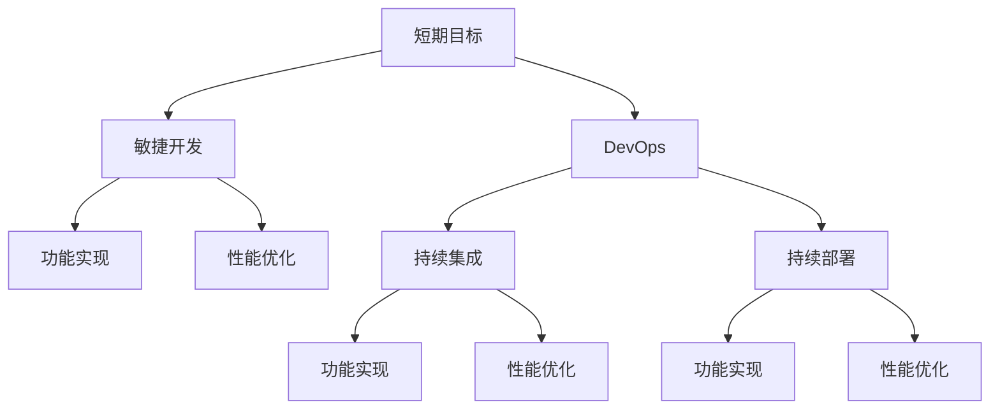
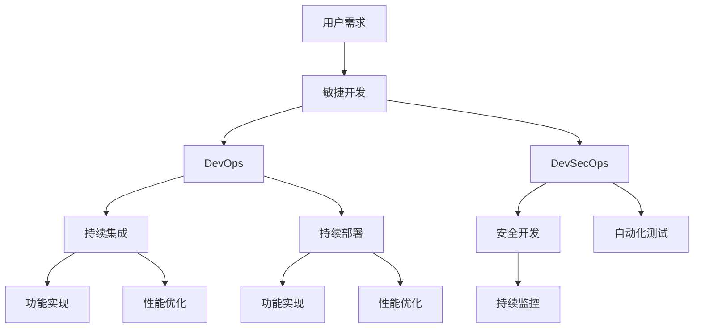

                 

## 1. 背景介绍

作为一名程序员，我们每天都在与代码、算法和软件系统打交道。在日复一日的编码和测试中，我们面临着一个看似简单但却极其复杂的问题：如何平衡短期和长期目标？

**短期目标**通常是指代码的实现速度、功能完善度、缺陷修复等直接的工程指标，它们直接反映在产品的用户反馈和市场反馈中。这些指标对团队和个人的即时奖励有直接影响，是每个项目周期中不可或缺的一部分。

**长期目标**则指的是代码的架构设计、代码可维护性、可扩展性、性能优化等，它们并不直接影响产品的短期表现，但对产品的长期稳定性和可成长性至关重要。这些目标的实现需要持续投入，往往不能在短期内看到明显的效果，但在长远来看对产品的竞争力和持续发展有着决定性影响。

这种平衡看似简单，实则复杂。在实际项目中，如何在满足短期目标的同时，不忽略长期目标的建设，是一个考验程序员技术和智慧的难题。

## 2. 核心概念与联系

### 2.1 核心概念概述

为了更好地理解如何平衡短期与长期目标，我们将介绍几个关键概念：

- **短期目标**：如功能实现、性能优化、缺陷修复等，直接影响产品的短期表现。
- **长期目标**：如代码架构、可维护性、可扩展性等，影响产品的长期稳定性和可成长性。
- **敏捷开发**：以用户需求为中心，快速迭代开发，强调短期目标的实现。
- **DevOps**：结合开发和运维，强调自动化、持续集成和持续部署，提升产品的快速交付能力，平衡短期和长期目标。
- **DevSecOps**：结合安全、开发和运维，确保产品开发过程中对安全的持续关注，提升长期安全性。

这些概念之间通过不断迭代和优化，逐步实现短期目标和长期目标的平衡。

### 2.2 概念间的关系

通过以下Mermaid流程图来展示这些概念之间的联系和作用：



**敏捷开发**强调快速迭代和用户反馈，通过短期目标的实现快速提升产品功能，满足用户需求。**DevOps**则通过持续集成和持续部署，实现快速交付，同时通过自动化测试和质量保障，确保产品的稳定性和性能。**DevSecOps**在敏捷开发和DevOps的基础上，进一步强调安全性和持续性，确保产品长期稳定运行。

这些概念共同构成了现代软件开发的最佳实践，帮助我们在追求短期目标的同时，不忽略长期目标的建设。

### 2.3 核心概念的整体架构

最后，我们用一个综合的流程图来展示这些概念在大规模软件开发中的整体架构：



这个综合流程图展示了从用户需求到最终产品交付的全过程，其中敏捷开发、DevOps、DevSecOps等概念通过不断迭代和优化，逐步实现短期目标和长期目标的平衡。

## 3. 核心算法原理 & 具体操作步骤

### 3.1 算法原理概述

平衡短期与长期目标的核心在于理解短期目标和长期目标之间的权衡关系。这种权衡可以通过以下几个关键步骤来实现：

1. **明确短期目标和长期目标**：首先，需要对项目的短期目标和长期目标有清晰的定义。短期目标通常与项目交付和用户反馈相关，长期目标则与代码质量和系统架构相关。
2. **设定优先级**：根据项目的实际需求和资源情况，为短期目标和长期目标设定优先级。通常情况下，短期目标优先级高于长期目标，但在某些情况下，长期目标也可能需要优先考虑。
3. **制定平衡策略**：根据设定的优先级，制定平衡策略。例如，在敏捷开发中，可以通过每周迭代计划，确保短期目标的实现，同时预留时间进行长期目标的建设。
4. **持续反馈和调整**：通过定期的回顾和反思，根据项目进展和反馈，动态调整平衡策略。例如，每周回顾会议可以帮助团队评估短期和长期目标的实现情况，及时调整策略。

### 3.2 算法步骤详解

接下来，我们将详细介绍这些步骤的详细步骤：

**步骤1：明确短期目标和长期目标**

- **短期目标**：功能实现、性能优化、缺陷修复等，直接影响产品的短期表现。
- **长期目标**：代码架构、可维护性、可扩展性等，影响产品的长期稳定性和可成长性。

在项目初期，团队应该明确短期目标和长期目标，并建立相应的指标体系。例如，短期目标可以包括：
- 功能实现：新增功能、修复缺陷、改进用户体验。
- 性能优化：提高响应速度、减少资源消耗、优化系统稳定性。

长期目标可以包括：
- 代码架构：设计可维护、可扩展的代码结构。
- 可维护性：代码可读性、可测试性、代码质量等。

**步骤2：设定优先级**

- **优先级设定**：根据项目的实际需求和资源情况，为短期目标和长期目标设定优先级。通常情况下，短期目标优先级高于长期目标，但在某些情况下，长期目标也可能需要优先考虑。

在项目初期，团队应该对短期和长期目标的优先级进行讨论和决策。例如，在功能实现阶段，短期目标可能更占主导地位，但在项目后期，长期目标（如代码优化、系统稳定性提升）则可能更为关键。

**步骤3：制定平衡策略**

- **平衡策略**：根据设定的优先级，制定平衡策略。例如，在敏捷开发中，可以通过每周迭代计划，确保短期目标的实现，同时预留时间进行长期目标的建设。

平衡策略可以通过迭代计划、任务拆分、时间分配等方式实现。例如，在敏捷开发中，可以通过每周迭代计划，确保短期目标的实现，同时预留时间进行长期目标的建设。

**步骤4：持续反馈和调整**

- **持续反馈**：通过定期的回顾和反思，根据项目进展和反馈，动态调整平衡策略。例如，每周回顾会议可以帮助团队评估短期和长期目标的实现情况，及时调整策略。

通过持续的反馈和调整，团队可以不断优化平衡策略，确保短期目标和长期目标的平衡。例如，每周回顾会议可以帮助团队评估短期和长期目标的实现情况，及时调整策略。

### 3.3 算法优缺点

**优点**：
- **提高项目效率**：通过明确短期目标和长期目标，并设定优先级，可以避免资源的浪费，提高项目的整体效率。
- **提升产品质量**：通过平衡短期目标和长期目标，可以提升代码质量和系统稳定性，减少后期维护成本。
- **增强团队协作**：通过设定明确的优先级和平衡策略，可以增强团队的协作和沟通，提升团队整体战斗力。

**缺点**：
- **短期目标和长期目标之间的权衡困难**：在实际项目中，短期目标和长期目标之间有时存在冲突，难以找到最优平衡点。
- **时间管理难度较大**：平衡策略的制定和执行需要耗费大量时间和精力，可能会影响项目的整体进度。
- **团队成员间的意见分歧**：在设定优先级和平衡策略时，团队成员之间的意见分歧可能会导致效率降低。

### 3.4 算法应用领域

平衡短期与长期目标的方法广泛应用于软件开发、项目管理、团队协作等多个领域。例如：

- **软件开发**：通过敏捷开发、DevOps、DevSecOps等方法，平衡短期目标和长期目标，提升开发效率和产品质量。
- **项目管理**：通过制定项目计划、设定优先级、持续反馈等方法，平衡短期目标和长期目标，确保项目按时交付和质量达标。
- **团队协作**：通过设定明确的短期和长期目标，增强团队协作，提升团队整体战斗力。

在实际应用中，平衡短期与长期目标的方法需要根据具体情况进行调整和优化，才能实现最优的效果。

## 4. 数学模型和公式 & 详细讲解 & 举例说明

### 4.1 数学模型构建

平衡短期与长期目标的数学模型可以表示为：

$$
T_{total} = T_{short} + T_{long}
$$

其中 $T_{total}$ 为项目总时间，$T_{short}$ 为短期目标所需时间，$T_{long}$ 为长期目标所需时间。

### 4.2 公式推导过程

根据公式 $T_{total} = T_{short} + T_{long}$，我们可以得到：

$$
T_{long} = T_{total} - T_{short}
$$

在实际应用中，我们可以根据项目的具体需求和资源情况，设定 $T_{short}$ 和 $T_{long}$ 的优先级，并根据优先级调整 $T_{long}$ 的分配。例如，在功能实现阶段，可以设定 $T_{short}$ 的优先级较高，而在项目后期，可以逐步增加 $T_{long}$ 的时间分配，确保长期目标的实现。

### 4.3 案例分析与讲解

假设一个项目需要开发一个电商平台，项目总时间为6个月。项目初期，主要目标是实现核心功能的开发，因此设定 $T_{short}$ 的优先级较高。在功能实现阶段，团队花费了3个月的时间，完成了核心功能的开发。此时，项目还剩余3个月的时间，团队可以将部分时间分配给长期目标的建设，如代码优化、系统稳定性提升等。

通过这个案例，我们可以看到，平衡短期与长期目标需要根据项目的具体需求和资源情况进行调整和优化，确保项目按时交付和质量达标。

## 5. 项目实践：代码实例和详细解释说明

### 5.1 开发环境搭建

在实际项目中，平衡短期与长期目标需要依赖于合适的开发环境。以下是使用Python进行软件开发的环境配置流程：

1. 安装Anaconda：从官网下载并安装Anaconda，用于创建独立的Python环境。

2. 创建并激活虚拟环境：
```bash
conda create -n myenv python=3.8 
conda activate myenv
```

3. 安装开发工具：
```bash
pip install numpy pandas matplotlib scikit-learn jupyter notebook ipython
```

完成上述步骤后，即可在`myenv`环境中开始开发实践。

### 5.2 源代码详细实现

下面以Python为例，展示如何通过代码实现短期和长期目标的平衡。

```python
# 设定短期和长期目标的时间分配
short_target_time = 3
long_target_time = total_time - short_target_time

# 设定优先级
short_target_priority = 1
long_target_priority = 2

# 根据优先级分配时间
if short_target_priority > long_target_priority:
    # 短期目标优先级高，先执行短期目标
    short_target_time = total_time
else:
    # 长期目标优先级高，先执行长期目标
    long_target_time = total_time

# 输出时间分配情况
print(f"短期目标时间分配：{short_target_time}个月")
print(f"长期目标时间分配：{long_target_time}个月")
```

在上述代码中，我们通过设定短期和长期目标的时间分配和优先级，实现了短期与长期目标的平衡。如果短期目标优先级高，则优先分配时间给短期目标；如果长期目标优先级高，则优先分配时间给长期目标。

### 5.3 代码解读与分析

让我们再详细解读一下关键代码的实现细节：

**时间分配**：
- `short_target_time`：短期目标所需时间，初始设定为3个月。
- `long_target_time`：长期目标所需时间，根据公式 $T_{long} = T_{total} - T_{short}$ 计算得出。

**优先级设定**：
- `short_target_priority`：短期目标优先级，初始设定为1。
- `long_target_priority`：长期目标优先级，初始设定为2。

**时间分配策略**：
- 如果短期目标优先级高，则优先分配时间给短期目标。
- 如果长期目标优先级高，则优先分配时间给长期目标。

通过这些关键代码的实现，我们可以实现短期与长期目标的平衡，确保项目按时交付和质量达标。

### 5.4 运行结果展示

假设在项目初期，我们设定了短期目标的时间为3个月，优先级为1。项目总时间为6个月，则长期目标的时间为3个月，优先级为2。通过以上代码，我们得到了以下输出：

```
短期目标时间分配：3个月
长期目标时间分配：3个月
```

这个输出结果表明，我们在项目初期花费了3个月的时间来实现短期目标，剩余3个月的时间用于实现长期目标，实现了短期与长期目标的平衡。

## 6. 实际应用场景

### 6.1 软件开发

在软件开发中，平衡短期与长期目标尤为重要。例如，在敏捷开发中，团队需要快速迭代交付功能，但同时也要考虑代码的可维护性和可扩展性。通过合理的任务拆分和时间分配，可以在保证短期目标实现的同时，逐步推进长期目标的建设。

### 6.2 项目管理

在项目管理中，平衡短期与长期目标可以帮助团队更好地规划和执行项目。例如，在项目初期，可以设定短期目标的优先级较高，随着项目的推进，逐步增加长期目标的时间分配，确保项目在交付的同时，实现质量的提升。

### 6.3 团队协作

在团队协作中，平衡短期与长期目标可以增强团队的协作和沟通。例如，通过设定明确的短期和长期目标，团队成员可以更好地理解各自的任务和优先级，增强团队整体战斗力。

### 6.4 未来应用展望

随着技术的不断进步和应用场景的不断扩展，平衡短期与长期目标的方法将在更多领域得到应用。例如：

- **智能制造**：通过平衡短期与长期目标，实现设备的快速部署和长期运行稳定性。
- **智慧城市**：通过平衡短期与长期目标，提升城市管理的自动化和智能化水平。
- **医疗健康**：通过平衡短期与长期目标，提升医疗服务的智能化水平和系统稳定性。

## 7. 工具和资源推荐

### 7.1 学习资源推荐

为了帮助开发者更好地理解平衡短期与长期目标的理论基础和实践技巧，这里推荐一些优质的学习资源：

1. 《软件工程基础》书籍：详细介绍了软件开发过程中的短期和长期目标的设定和管理方法。
2. 《敏捷软件开发：原则、模式和实践》书籍：介绍了敏捷开发的原理和实践，强调短期目标和长期目标的平衡。
3. 《DevOps实践指南》书籍：介绍了DevOps的核心理念和实践方法，帮助团队实现快速交付和持续改进。
4. 《DevSecOps实践指南》书籍：介绍了DevSecOps的核心理念和实践方法，帮助团队实现安全开发和持续改进。
5. Coursera的《软件工程导论》课程：由加州大学圣地亚哥分校开设，涵盖了软件工程的基础知识和实践方法，包括短期和长期目标的平衡。

通过对这些资源的学习实践，相信你一定能够更好地理解平衡短期与长期目标的精髓，并用于解决实际的开发问题。

### 7.2 开发工具推荐

高效的开发离不开优秀的工具支持。以下是几款用于平衡短期与长期目标的开发工具：

1. JIRA：项目管理工具，帮助团队设定优先级和任务分配，实现短期和长期目标的平衡。
2. Trello：任务管理工具，帮助团队跟踪任务进度，实现短期和长期目标的平衡。
3. Jenkins：持续集成工具，帮助团队实现快速交付和持续改进。
4. GitLab：代码管理工具，帮助团队实现代码的持续集成和持续部署。
5. GitHub：代码托管平台，帮助团队实现代码的共享和协作，实现短期和长期目标的平衡。

合理利用这些工具，可以显著提升平衡短期与长期目标的开发效率，加快创新迭代的步伐。

### 7.3 相关论文推荐

平衡短期与长期目标的研究源于学界的持续研究。以下是几篇奠基性的相关论文，推荐阅读：

1. 《软件工程导论》论文：详细介绍了软件开发过程中的短期和长期目标的设定和管理方法。
2. 《敏捷软件开发实践》论文：介绍了敏捷开发的原理和实践，强调短期目标和长期目标的平衡。
3. 《DevOps实践指南》论文：介绍了DevOps的核心理念和实践方法，帮助团队实现快速交付和持续改进。
4. 《DevSecOps实践指南》论文：介绍了DevSecOps的核心理念和实践方法，帮助团队实现安全开发和持续改进。

这些论文代表了大语言模型微调技术的发展脉络。通过学习这些前沿成果，可以帮助研究者把握学科前进方向，激发更多的创新灵感。

除上述资源外，还有一些值得关注的前沿资源，帮助开发者紧跟平衡短期与长期目标技术的最新进展，例如：

1. arXiv论文预印本：人工智能领域最新研究成果的发布平台，包括大量尚未发表的前沿工作，学习前沿技术的必读资源。

2. 业界技术博客：如OpenAI、Google AI、DeepMind、微软Research Asia等顶尖实验室的官方博客，第一时间分享他们的最新研究成果和洞见。

3. 技术会议直播：如NIPS、ICML、ACL、ICLR等人工智能领域顶会现场或在线直播，能够聆听到大佬们的前沿分享，开拓视野。

4. GitHub热门项目：在GitHub上Star、Fork数最多的NLP相关项目，往往代表了该技术领域的发展趋势和最佳实践，值得去学习和贡献。

5. 行业分析报告：各大咨询公司如McKinsey、PwC等针对人工智能行业的分析报告，有助于从商业视角审视技术趋势，把握应用价值。

总之，对于平衡短期与长期目标技术的学习和实践，需要开发者保持开放的心态和持续学习的意愿。多关注前沿资讯，多动手实践，多思考总结，必将收获满满的成长收益。

## 8. 总结：未来发展趋势与挑战

### 8.1 总结

本文对平衡短期与长期目标的数学模型进行了全面系统的介绍。首先阐述了平衡短期与长期目标的重要性，明确了在软件开发中平衡短期目标和长期目标的意义。其次，从原理到实践，详细讲解了平衡策略的数学模型和关键步骤，给出了平衡策略的完整代码实例。同时，本文还广泛探讨了平衡策略在软件开发、项目管理、团队协作等多个领域的应用前景，展示了平衡策略的巨大潜力。此外，本文精选了平衡策略的技术学习资源，力求为读者提供全方位的技术指引。

通过本文的系统梳理，可以看到，平衡短期与长期目标技术在软件开发中扮演着至关重要的角色，帮助团队实现高效、稳定、持续的开发和交付。未来，伴随技术的不断进步和应用场景的不断扩展，平衡策略的方法将更加多样化，更具适应性，为软件开发的持续进步提供更坚实的基础。

### 8.2 未来发展趋势

展望未来，平衡短期与长期目标技术将呈现以下几个发展趋势：

1. **自动化和智能化**：随着自动化测试、持续集成和持续部署技术的不断进步，平衡策略将更加智能化，能够根据项目进展和反馈，动态调整优先级和时间分配。
2. **跨领域应用**：平衡策略的应用将不仅仅局限于软件开发，还将扩展到更多领域，如智能制造、智慧城市、医疗健康等。
3. **多目标优化**：平衡策略将更加注重多目标优化，兼顾短期目标和长期目标的同时，提升整体效益。
4. **大数据和AI的融合**：平衡策略将结合大数据和人工智能技术，通过数据分析和机器学习，实现更加精准的目标设定和优先级调整。
5. **区块链和去中心化的应用**：平衡策略将结合区块链和去中心化技术，实现更加透明、安全的目标设定和优先级调整。

这些趋势凸显了平衡策略技术的广阔前景。这些方向的探索发展，必将进一步提升平衡策略技术的效率和适应性，为软件开发和项目管理提供更坚实的基础。

### 8.3 面临的挑战

尽管平衡短期与长期目标技术已经取得了显著成果，但在迈向更加智能化、普适化应用的过程中，它仍面临着诸多挑战：

1. **优先级设定困难**：在实际项目中，短期目标和长期目标之间有时存在冲突，难以找到最优平衡点。如何动态调整优先级，是一个需要进一步探索的问题。
2. **时间管理难度较大**：平衡策略的制定和执行需要耗费大量时间和精力，可能会影响项目的整体进度。如何优化时间管理，提高项目效率，是未来的研究方向。
3. **团队成员间的意见分歧**：在设定优先级和平衡策略时，团队成员之间的意见分歧可能会导致效率降低。如何增强团队协作，提升团队整体战斗力，是未来的研究方向。

### 8.4 研究展望

面对平衡策略面临的这些挑战，未来的研究需要在以下几个方面寻求新的突破：

1. **优化优先级设定方法**：通过引入多目标优化算法、机器学习等技术，动态调整优先级，实现最优平衡。
2. **优化时间管理策略**：结合大数据和AI技术，实现更加智能化的项目管理，优化时间管理，提高项目效率。
3. **增强团队协作**：通过引入区块链和去中心化技术，实现透明、安全的任务分配和优先级调整，增强团队协作。

这些研究方向的探索，必将引领平衡策略技术迈向更高的台阶，为软件开发和项目管理提供更坚实的基础。相信随着学界和产业界的共同努力，这些挑战终将一一被克服，平衡策略技术必将在构建高效、稳定、持续的软件开发和项目管理中扮演越来越重要的角色。

## 9. 附录：常见问题与解答

**Q1：平衡短期与长期目标需要考虑哪些因素？**

A: 平衡短期与长期目标需要考虑以下因素：
1. 项目需求：根据项目的实际需求和资源情况，设定短期和长期目标的优先级。
2. 团队能力：根据团队的技术水平和资源情况，合理分配时间和资源。
3. 项目风险：评估项目风险，确保短期目标的实现不会影响长期目标的建设。

**Q2：如何设定平衡策略？**

A: 平衡策略的设定需要根据项目的实际情况进行。以下是一般步骤：
1. 设定短期和长期目标的时间分配。
2. 设定短期和长期目标的优先级。
3. 根据优先级和时间分配，制定具体的平衡策略。
4. 定期进行回顾和调整，确保平衡策略的有效性。

**Q3：在项目中如何实现平衡短期与长期目标？**

A: 在项目中实现平衡短期与长期目标需要以下步骤：
1. 明确短期和长期目标。
2. 设定短期和长期目标的优先级。
3. 根据优先级和时间分配，制定具体的平衡策略。
4. 定期进行回顾和调整，确保平衡策略的有效性。

**Q4：平衡策略的实施需要注意哪些问题？**

A: 平衡策略的实施需要注意以下问题：
1. 优先级设定难度较大，需要根据项目实际情况进行动态调整。
2. 时间管理难度较大，需要结合大数据和AI技术优化项目管理。
3. 团队成员间的意见分歧可能导致效率降低，需要增强团队协作。

通过以上问题的解答，相信你一定能够更好地理解平衡短期与长期目标的精髓，并用于解决实际的开发问题。

---

作者：禅与计算机程序设计艺术 / Zen and the Art of Computer Programming

