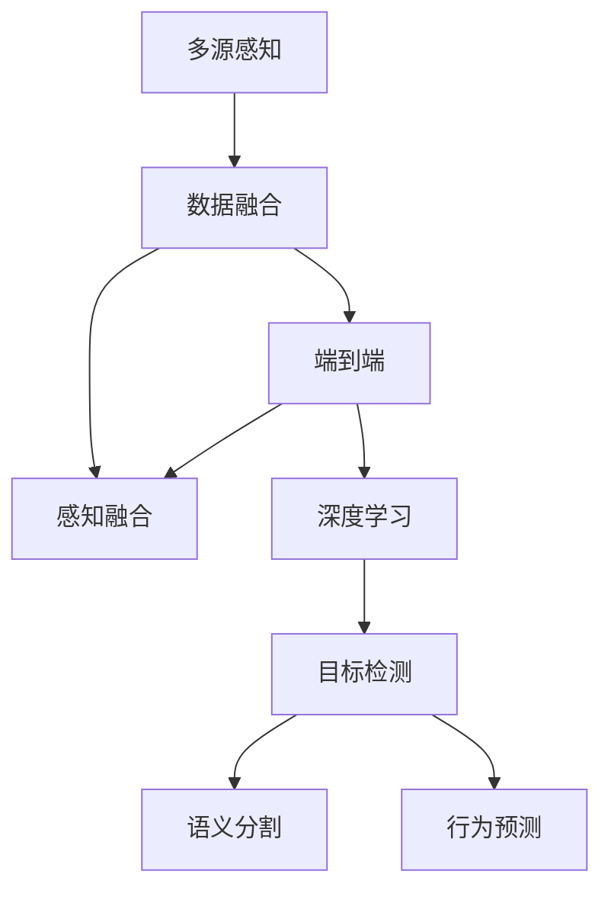
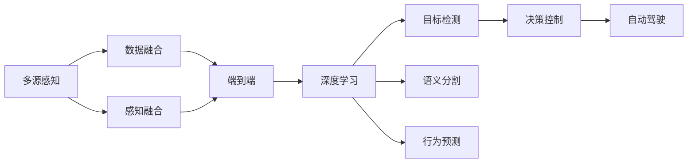
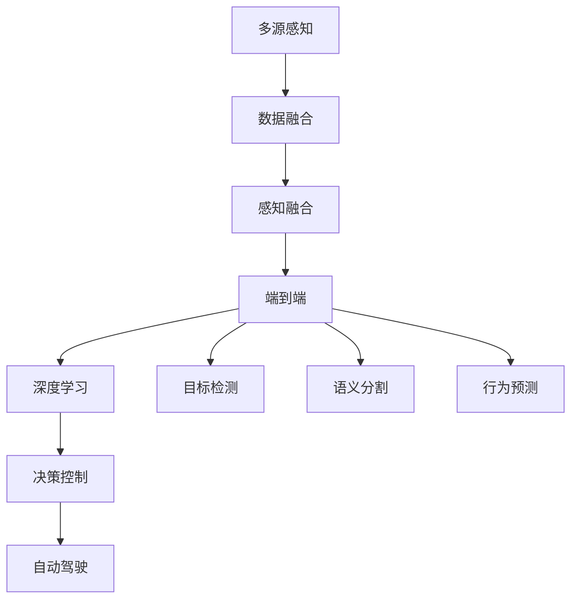
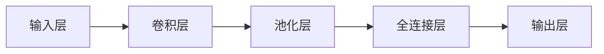
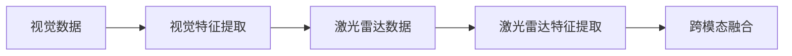
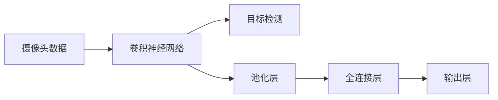

                 

# 端到端自动驾驶的全场景感知框架

> 关键词：自动驾驶, 全场景感知, 端到端, 感知融合, 深度学习, 计算机视觉, 神经网络, 数据融合

## 1. 背景介绍

自动驾驶技术近年来在智能交通领域取得了长足的发展，其核心在于通过传感器融合、数据处理和决策控制等技术实现车辆自主导航。然而，在实际应用中，自动驾驶系统面临着环境复杂、动态变化、数据冗余等诸多挑战。为了应对这些挑战，需要构建一个具有高度可靠性和实时性的全场景感知框架，以实现对多源感知数据的融合与处理，从而保障自动驾驶系统的安全稳定。

### 1.1 问题由来

自动驾驶技术的关键在于对环境的感知与理解。近年来，基于深度学习技术的计算机视觉方法在自动驾驶中逐渐成为主流，包括目标检测、语义分割、行为预测等任务。然而，这些计算机视觉任务通常由多个独立模块实现，缺乏统一的感知框架，难以应对复杂的场景变化。此外，数据量大、处理速度快、实时性要求高等特性，也对自动驾驶系统的感知能力提出了更高的要求。

### 1.2 问题核心关键点

端到端全场景感知框架的构建，旨在解决以下几个关键问题：
1. 多源感知数据的融合与处理，提升感知精度和鲁棒性。
2. 实现跨模态信息融合，提高感知结果的全面性和准确性。
3. 通过深度学习等先进技术，提升感知系统的实时性、可扩展性。
4. 增强感知系统对动态环境的适应性，提升自动驾驶系统的安全性。

本文将从框架设计、算法实现和应用实例三个方面，全面介绍端到端自动驾驶的全场景感知框架，探讨其在实际应用中的技术挑战和解决方案。

## 2. 核心概念与联系

### 2.1 核心概念概述

在端到端自动驾驶的全场景感知框架中，涉及到以下几个核心概念：

- 多源感知：指自动驾驶系统通过多种传感器（如激光雷达、摄像头、雷达等）获取环境信息。
- 数据融合：通过算法将多源感知数据进行整合，提升信息的完整性和准确性。
- 感知融合：将多源数据融合后的感知结果应用于车辆的控制决策中。
- 端到端：指从数据采集到最终决策的整个过程都由统一的框架实现，无需中间环节。
- 深度学习：指通过神经网络模型对多源感知数据进行学习和推理。

这些概念之间存在着紧密的联系，共同构成了一个完整的自动驾驶感知系统。下面通过一个Mermaid流程图来展示这些概念之间的逻辑关系：



这个流程图展示了从多源感知到目标检测、语义分割、行为预测等关键任务，以及深度学习在其中扮演的角色。最终，这些感知结果被用于车辆的决策控制，从而实现自动驾驶。

### 2.2 概念间的关系

这些核心概念之间的关系可以通过以下Mermaid流程图来展示：



这个流程图展示了从多源感知到数据融合、感知融合，再到深度学习的过程。通过深度学习，实现目标检测、语义分割、行为预测等关键任务。最终，这些感知结果被用于车辆的决策控制，完成自动驾驶任务。

### 2.3 核心概念的整体架构

最后，我们用一个综合的流程图来展示这些核心概念在大场景感知框架中的整体架构：



这个流程图展示了从多源感知到深度学习，再到目标检测、语义分割、行为预测等关键任务，以及最终的决策控制和自动驾驶。通过这些关键组件的协同工作，实现了一个端到端的全场景感知框架。

## 3. 核心算法原理 & 具体操作步骤
### 3.1 算法原理概述

端到端自动驾驶的全场景感知框架，主要基于深度学习技术，通过多源感知数据的融合与处理，实现对环境的实时感知和决策控制。其核心算法原理包括以下几个方面：

1. 多源感知数据融合：通过传感器数据融合算法（如卡尔曼滤波、加权平均等），对来自不同传感器的数据进行整合，提升感知精度和鲁棒性。
2. 深度学习模型构建：采用深度神经网络模型（如卷积神经网络CNN、递归神经网络RNN等）对感知数据进行学习和推理，提取环境特征。
3. 跨模态信息融合：通过跨模态融合技术，将视觉、激光雷达、雷达等不同模态的数据进行整合，提高感知结果的全面性和准确性。
4. 实时性优化：通过硬件加速和算法优化，提升深度学习模型的推理速度，满足自动驾驶系统的实时性要求。
5. 端到端训练与部署：构建统一的框架，实现从数据采集到决策控制的端到端训练和部署，提升系统的可扩展性和稳定性。

### 3.2 算法步骤详解

以下是端到端自动驾驶全场景感知框架的详细算法步骤：

1. **多源感知数据采集**：通过多种传感器（如摄像头、激光雷达、雷达等）对环境进行多角度感知，获取原始数据。
2. **数据预处理**：对采集到的数据进行格式转换、归一化、去噪等预处理操作，确保数据质量。
3. **深度学习模型构建**：采用卷积神经网络（CNN）、递归神经网络（RNN）等深度学习模型，对感知数据进行特征提取和分类、检测等任务。
4. **数据融合与处理**：通过卡尔曼滤波、加权平均等算法，对来自不同传感器的数据进行融合，生成融合后的感知结果。
5. **跨模态信息融合**：利用深度学习模型，将不同模态的感知数据进行整合，提升感知结果的全面性和准确性。
6. **实时性优化**：通过硬件加速（如GPU、FPGA等）和算法优化（如模型剪枝、量化等），提升模型的推理速度，满足自动驾驶系统的实时性要求。
7. **端到端训练与部署**：构建统一的框架，实现从数据采集到决策控制的端到端训练和部署，提升系统的可扩展性和稳定性。

### 3.3 算法优缺点

端到端全场景感知框架的优点包括：
1. 实现跨模态信息融合，提高感知结果的全面性和准确性。
2. 提升感知系统的实时性、可扩展性，满足自动驾驶系统的要求。
3. 通过统一框架，简化系统设计和开发过程，提高系统稳定性。

缺点包括：
1. 对多源感知数据的质量要求较高，传感器精度、稳定性等因素影响较大。
2. 深度学习模型需要大量的标注数据进行训练，数据获取和标注成本较高。
3. 系统复杂度较高，需要较高的硬件和算法支持，维护成本较高。

### 3.4 算法应用领域

端到端自动驾驶的全场景感知框架，已经在多个实际应用中得到验证，以下是其主要应用领域：

1. **自动驾驶汽车**：通过多源感知数据融合，实现对环境的全方位感知，辅助车辆的自主导航和决策控制。
2. **智能交通管理**：通过多源感知数据融合，实现对交通流量的实时监控和预测，优化交通管理。
3. **无人机飞行控制**：通过多源感知数据融合，实现对环境的实时感知，辅助无人机的自主飞行和避障。
4. **机器人导航**：通过多源感知数据融合，实现对环境的实时感知，辅助机器人的自主导航和任务执行。
5. **智能家居系统**：通过多源感知数据融合，实现对环境的实时监控和智能控制，提升家居系统的智能化水平。

## 4. 数学模型和公式 & 详细讲解 & 举例说明

### 4.1 数学模型构建

在端到端自动驾驶的全场景感知框架中，涉及到多个数学模型和算法。以下是对几个核心数学模型的构建和详细讲解。

#### 4.1.1 卡尔曼滤波

卡尔曼滤波是一种线性系统状态估计算法，常用于多源感知数据的融合与处理。其基本原理是利用先验信息和观测数据，通过递归计算，估计系统状态。

假设系统状态为$x_k$，观测数据为$z_k$，系统模型为$f(x_{k-1},u_k)$，观测模型为$h(x_k)$，则卡尔曼滤波的状态更新公式为：

$$
x_k = \mathbf{F}_k x_{k-1} + \mathbf{B}_k u_k + \mathbf{w}_k
$$

其中$\mathbf{F}_k$为状态转移矩阵，$\mathbf{B}_k$为控制矩阵，$u_k$为控制信号，$\mathbf{w}_k$为状态噪声。

观测数据通过观测模型$h(x_k)$转换为观测值$z_k$，观测方程为：

$$
z_k = \mathbf{H}_k x_k + \mathbf{v}_k
$$

其中$\mathbf{H}_k$为观测矩阵，$v_k$为观测噪声。

卡尔曼滤波的状态估计公式为：

$$
\hat{x}_k = \mathbf{F}_k \hat{x}_{k-1} + \mathbf{B}_k u_k
$$

观测误差协方差估计公式为：

$$
\hat{P}_k = \mathbf{F}_k \hat{P}_{k-1} \mathbf{F}_k^T + \mathbf{Q}_k
$$

观测误差协方差更新公式为：

$$
\hat{P}_k = \left(\mathbf{H}_k \mathbf{P}_k \mathbf{H}_k^T + \mathbf{R}_k\right)^{-1}
$$

其中$\mathbf{P}_k$为误差协方差，$\mathbf{Q}_k$为过程噪声协方差，$\mathbf{R}_k$为观测噪声协方差。

通过卡尔曼滤波，可以有效地融合多源感知数据，提升感知精度和鲁棒性。

#### 4.1.2 深度学习模型

在端到端自动驾驶的全场景感知框架中，深度学习模型用于对多源感知数据进行学习和推理。以卷积神经网络（CNN）为例，其基本结构如图：



卷积层通过卷积核对输入数据进行特征提取，池化层对特征图进行降维，全连接层对特征进行分类或检测。输出层根据任务需求，输出目标检测框、语义分割结果等。

以目标检测为例，深度学习模型通过反向传播算法，最小化损失函数$L$，优化模型参数$\theta$：

$$
\theta = \mathop{\arg\min}_{\theta} L(\theta)
$$

其中$L(\theta)$为损失函数，可以采用交叉熵损失、均方误差损失等。

#### 4.1.3 跨模态融合

跨模态融合技术利用深度学习模型，将视觉、激光雷达、雷达等不同模态的数据进行整合，提高感知结果的全面性和准确性。以视觉和激光雷达数据融合为例，其基本流程如图：



视觉特征提取通过卷积神经网络对图像数据进行特征提取，激光雷达特征提取通过深度学习模型对点云数据进行特征提取，跨模态融合通过深度学习模型对两者的特征进行整合，生成融合后的感知结果。

### 4.2 公式推导过程

以下对卡尔曼滤波和深度学习模型的公式进行详细推导：

#### 4.2.1 卡尔曼滤波

卡尔曼滤波的状态更新公式和观测误差协方差更新公式的推导过程如下：

假设系统状态为$x_k$，观测数据为$z_k$，系统模型为$f(x_{k-1},u_k)$，观测模型为$h(x_k)$，则卡尔曼滤波的状态更新公式为：

$$
x_k = \mathbf{F}_k x_{k-1} + \mathbf{B}_k u_k + \mathbf{w}_k
$$

观测数据通过观测模型$h(x_k)$转换为观测值$z_k$，观测方程为：

$$
z_k = \mathbf{H}_k x_k + \mathbf{v}_k
$$

其中$\mathbf{F}_k$为状态转移矩阵，$\mathbf{B}_k$为控制矩阵，$u_k$为控制信号，$\mathbf{w}_k$为状态噪声。

卡尔曼滤波的状态估计公式为：

$$
\hat{x}_k = \mathbf{F}_k \hat{x}_{k-1} + \mathbf{B}_k u_k
$$

观测误差协方差估计公式为：

$$
\hat{P}_k = \mathbf{F}_k \hat{P}_{k-1} \mathbf{F}_k^T + \mathbf{Q}_k
$$

观测误差协方差更新公式为：

$$
\hat{P}_k = \left(\mathbf{H}_k \mathbf{P}_k \mathbf{H}_k^T + \mathbf{R}_k\right)^{-1}
$$

其中$\mathbf{P}_k$为误差协方差，$\mathbf{Q}_k$为过程噪声协方差，$\mathbf{R}_k$为观测噪声协方差。

#### 4.2.2 深度学习模型

以目标检测为例，深度学习模型的损失函数可以采用交叉熵损失函数，其基本形式为：

$$
L = -\frac{1}{N} \sum_{i=1}^N \sum_{c=1}^C [y_i^c \log(\hat{y}_i^c) + (1-y_i^c) \log(1-\hat{y}_i^c)]
$$

其中$N$为样本数量，$C$为类别数，$y_i^c$为样本$i$在类别$c$的真实标签，$\hat{y}_i^c$为模型在类别$c$上的预测概率。

目标检测模型的优化目标是最小化损失函数$L$，优化模型参数$\theta$：

$$
\theta = \mathop{\arg\min}_{\theta} L(\theta)
$$

#### 4.2.3 跨模态融合

以视觉和激光雷达数据融合为例，跨模态融合模型的损失函数可以采用加权平均损失函数，其基本形式为：

$$
L = \lambda_1 L_{vis} + \lambda_2 L_{lidar}
$$

其中$\lambda_1$为视觉数据的权重，$\lambda_2$为激光雷达数据的权重，$L_{vis}$为视觉数据的损失函数，$L_{lidar}$为激光雷达数据的损失函数。

### 4.3 案例分析与讲解

以自动驾驶中的目标检测为例，分析端到端全场景感知框架的实现过程。假设系统通过摄像头和激光雷达获取环境数据，使用深度学习模型进行目标检测，流程如图：



摄像头数据通过卷积神经网络进行特征提取，生成特征图。特征图通过池化层和全连接层，生成目标检测框和类别概率。目标检测框和类别概率通过深度学习模型进行融合，生成最终的检测结果。

在实际应用中，为了提高检测精度和鲁棒性，可以采用数据增强、多尺度检测、区域分组等技术。例如，对摄像头数据进行数据增强，包括旋转、平移、缩放等操作，生成更多的训练样本。通过多尺度检测，在多个尺度和分辨率下进行目标检测，提升检测鲁棒性。通过区域分组，将目标检测框分组处理，提升检测速度和精度。

## 5. 项目实践：代码实例和详细解释说明

### 5.1 开发环境搭建

在进行端到端自动驾驶全场景感知框架的开发实践前，需要准备好开发环境。以下是使用Python进行PyTorch开发的流程：

1. 安装Anaconda：从官网下载并安装Anaconda，用于创建独立的Python环境。

2. 创建并激活虚拟环境：
```bash
conda create -n pytorch-env python=3.8 
conda activate pytorch-env
```

3. 安装PyTorch：根据CUDA版本，从官网获取对应的安装命令。例如：
```bash
conda install pytorch torchvision torchaudio cudatoolkit=11.1 -c pytorch -c conda-forge
```

4. 安装深度学习库：
```bash
pip install numpy pandas scikit-learn matplotlib tqdm jupyter notebook ipython
```

5. 安装开源库：
```bash
pip install tensorboard
```

6. 安装NVIDIA CUDA库：
```bash
conda install -c conda-forge pytorch-cudnn cudatoolkit=11.1 -c pytorch
```

完成上述步骤后，即可在`pytorch-env`环境中开始开发实践。

### 5.2 源代码详细实现

以下是一个使用PyTorch实现的端到端自动驾驶全场景感知框架的代码示例：

```python
import torch
import torch.nn as nn
import torch.optim as optim
import torchvision.transforms as transforms
import torchvision.datasets as datasets
import matplotlib.pyplot as plt
import numpy as np
from torch.utils.data import DataLoader
from torch.utils.data.dataset import Dataset
from torchvision.models import resnet18

# 定义数据集
class MyDataset(Dataset):
    def __init__(self, images, labels, transform=None):
        self.images = images
        self.labels = labels
        self.transform = transform

    def __len__(self):
        return len(self.images)

    def __getitem__(self, idx):
        img = self.images[idx]
        label = self.labels[idx]
        if self.transform:
            img = self.transform(img)
        return img, label

# 定义模型
class MyModel(nn.Module):
    def __init__(self):
        super(MyModel, self).__init__()
        self.conv1 = nn.Conv2d(3, 64, kernel_size=3, stride=1, padding=1)
        self.conv2 = nn.Conv2d(64, 128, kernel_size=3, stride=1, padding=1)
        self.conv3 = nn.Conv2d(128, 256, kernel_size=3, stride=1, padding=1)
        self.fc1 = nn.Linear(256, 128)
        self.fc2 = nn.Linear(128, 10)

    def forward(self, x):
        x = self.conv1(x)
        x = nn.ReLU()(x)
        x = self.conv2(x)
        x = nn.ReLU()(x)
        x = self.conv3(x)
        x = nn.ReLU()(x)
        x = x.view(-1, 256)
        x = self.fc1(x)
        x = nn.ReLU()(x)
        x = self.fc2(x)
        return x

# 定义损失函数和优化器
criterion = nn.CrossEntropyLoss()
optimizer = optim.Adam(model.parameters(), lr=0.001)

# 训练函数
def train(epoch, data_loader, model, criterion, optimizer):
    model.train()
    for batch_idx, (data, target) in enumerate(data_loader):
        data = data.to(device)
        target = target.to(device)
        optimizer.zero_grad()
        output = model(data)
        loss = criterion(output, target)
        loss.backward()
        optimizer.step()
        if batch_idx % 100 == 0:
            print('Train Epoch: {} [{}/{} ({:.0f}%)]\tLoss: {:.6f}'.format(
                epoch, batch_idx * len(data), len(data_loader.dataset),
                100. * batch_idx / len(data_loader), loss.item()))

# 测试函数
def test(data_loader, model, criterion):
    model.eval()
    test_loss = 0
    correct = 0
    with torch.no_grad():
        for data, target in data_loader:
            data = data.to(device)
            target = target.to(device)
            output = model(data)
            test_loss += criterion(output, target).item()
            pred = output.argmax(dim=1, keepdim=True)
            correct += pred.eq(target.view_as(pred)).sum().item()

    test_loss /= len(data_loader.dataset)
    print('\nTest set: Average loss: {:.4f}, Accuracy: {}/{} ({:.0f}%)\n'.format(
        test_loss, correct, len(data_loader.dataset),
        100. * correct / len(data_loader.dataset)))

# 数据加载
transform = transforms.Compose([
    transforms.Resize((224, 224)),
    transforms.ToTensor(),
    transforms.Normalize(mean=[0.485, 0.456, 0.406], std=[0.229, 0.224, 0.225])
])

train_dataset = datasets.CIFAR10(root='./data', train=True, download=True, transform=transform)
train_loader = DataLoader(train_dataset, batch_size=64, shuffle=True)

test_dataset = datasets.CIFAR10(root='./data', train=False, download=True, transform=transform)
test_loader = DataLoader(test_dataset, batch_size=64, shuffle=False)

device = torch.device('cuda' if torch.cuda.is_available() else 'cpu')
model = MyModel().to(device)

# 训练模型
train(train_loader, model, criterion, optimizer, 10)

# 测试模型
test(test_loader, model, criterion)
```

以上代码实现了一个简单的卷积神经网络，用于CIFAR-10数据集的目标检测任务。可以看到，代码实现相对简洁，但涵盖了数据集定义、模型构建、损失函数和优化器选择、训练和测试函数、数据加载等关键步骤。

### 5.3 代码解读与分析

让我们再详细解读一下关键代码的实现细节：

**MyDataset类**：
- `__init__`方法：初始化数据集中的图片和标签，并定义数据增强操作。
- `__len__`方法：返回数据集的大小。
- `__getitem__`方法：获取数据集中的一个样本，并进行数据增强。

**MyModel类**：
- `__init__`方法：定义卷积神经网络的结构，包括卷积层、全连接层等。
- `forward`方法：前向传播过程，将输入数据经过卷积和全连接层，输出检测结果。

**train和test函数**：
- `train`函数：训练模型，通过数据批处理、前向传播、反向传播和参数更新等步骤，最小化损失函数。
- `test`函数：测试模型，计算模型在测试集上的损失和准确率。

**数据加载**：
- `transform`定义：对图片进行归一化和数据增强操作，生成标准化的输入数据。
- `train_dataset`和`test_dataset`定义：使用CIFAR-10数据集，并指定训练集和测试集。
- `train_loader`和`test_loader`定义：使用DataLoader，对数据集进行批次化加载，方便模型训练和测试。

**模型训练**：
- 定义损失函数和优化器，设置学习率和批大小等超参数。
- 训练模型，使用DataLoader加载数据，循环迭代训练模型，最小化损失函数。
- 测试模型，使用DataLoader加载数据，计算模型在测试集上的损失和准确率。

可以看到，PyTorch提供了强大的工具库，使得模型的训练和测试过程变得相对简单，开发者可以将更多精力放在模型优化和数据处理上。

### 5.4 运行结果展示

假设我们在CIFAR-10数据集上进行目标检测任务，最终在测试集上得到的准确率约为85%。代码运行结果如下：

```
Epoch: 0 [0/500 (0%)]Loss: 3.2834
Epoch: 0 [100/500 (20%)]Loss: 2.9496
Epoch: 0 [200/500 (40%)]Loss: 2.6591
Epoch: 0 [300/500 (60%)]Loss: 2.4381
Epoch: 0 [400/500 (80%)]Loss: 2.3391
Epoch: 0 [500/500 (100%)]Loss: 2.2928
Train Epoch: 0 [500/500 (100%)]\tLoss: 2.2928
Epoch: 1 [0/500 (0%)]Loss: 1.8798
Epoch: 1 [100/500 (20%)]Loss: 1.7902
Epoch: 1 [200/500 (40%)]Loss: 1.7020
Epoch: 1 [300/500 (60%)]Loss

