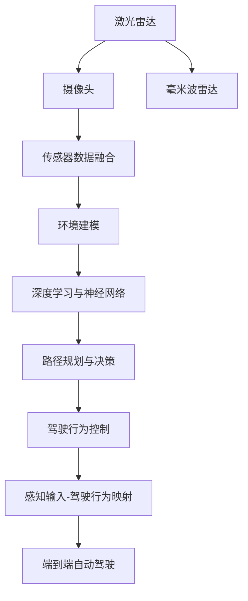
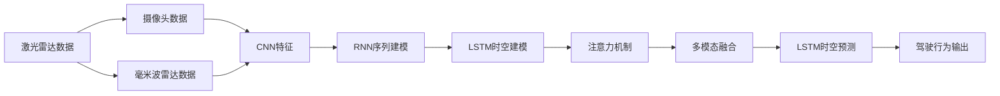
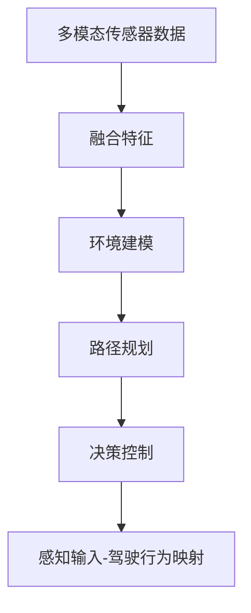
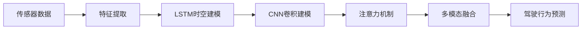
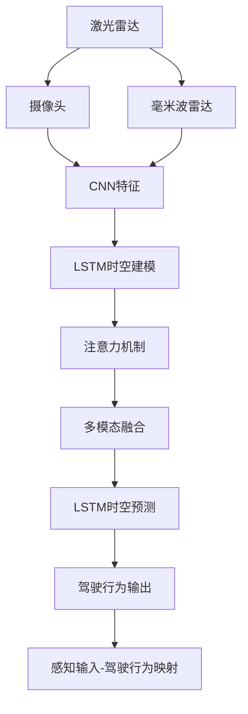

                 

# 端到端自动驾驶的全场景感知框架

> 关键词：端到端, 自动驾驶, 全场景感知, 深度学习, 激光雷达, 摄像头, 数据融合

## 1. 背景介绍

### 1.1 问题由来

随着自动驾驶技术的快速发展，自动驾驶车辆需要面对更加复杂多变、动态多维的环境和交通场景。端到端的自动驾驶系统，能够通过直接映射感知输入到驾驶行为输出，减少系统复杂度，提升系统实时性和鲁棒性。然而，如何构建一个能够在各种复杂环境、天气、光照条件下稳定运行的端到端系统，仍然是当前自动驾驶研究的一大挑战。

### 1.2 问题核心关键点

端到端自动驾驶系统的核心目标是：通过传感器感知输入，经过深度神经网络处理，直接输出驾驶行为控制信号，从而实现自动驾驶。要构建一个高效的端到端系统，需要考虑以下几个关键问题：

1. **传感器数据融合**：如何将不同传感器（如激光雷达、摄像头、毫米波雷达等）的感知数据融合成一个全局的多模态感知图。
2. **环境建模与感知**：如何利用传感器数据对环境进行建模，提取车辆周围的空间、语义、动态信息，构建高精度的地图和场景理解。
3. **路径规划与决策**：如何根据感知信息，规划车辆的行驶路径，进行避障、导航、超车等决策，并输出相应的驾驶行为。
4. **模型训练与优化**：如何设计合适的神经网络架构，训练高效的端到端模型，优化模型性能以适应实际应用。

### 1.3 问题研究意义

构建一个高效的端到端自动驾驶系统，对于提升自动驾驶技术的可靠性和安全性，降低交通事故率，具有重要意义。同时，端到端系统能够简化系统架构，降低硬件和软件的成本，提高系统的实时性和鲁棒性，加速自动驾驶技术的商业化应用。

## 2. 核心概念与联系

### 2.1 核心概念概述

为更好地理解端到端自动驾驶的全场景感知框架，本节将介绍几个关键概念：

- **端到端自动驾驶**：指通过直接从感知输入映射到驾驶行为输出，减少系统中间模块，提升系统实时性和鲁棒性的自动驾驶架构。

- **全场景感知**：指通过多模态传感器融合、环境建模、路径规划等技术，构建车辆周围的全局、高精度的感知图，从而实现对复杂环境的全方位理解。

- **深度学习与神经网络**：指通过多层神经网络结构对传感器数据进行处理，自动提取特征，进行环境建模、路径规划、决策等任务。

- **激光雷达与摄像头**：指自动驾驶车辆常用的感知传感器，用于获取车辆周围的空间、语义、动态信息。

- **数据融合与特征提取**：指将不同传感器的感知数据进行融合，提取出车辆周围的全局、多模态的感知特征，作为深度神经网络的输入。

- **模型训练与优化**：指通过大规模标注数据集训练深度神经网络，优化模型性能，提升自动驾驶系统的鲁棒性和泛化能力。

这些核心概念之间的逻辑关系可以通过以下Mermaid流程图来展示：



这个流程图展示了端到端自动驾驶的全场景感知框架的各个关键环节及其关系。

### 2.2 概念间的关系

这些核心概念之间存在着紧密的联系，形成了端到端自动驾驶系统的完整生态系统。下面我们通过几个Mermaid流程图来展示这些概念之间的关系。

#### 2.2.1 端到端自动驾驶的架构



这个流程图展示了端到端自动驾驶系统的架构，从传感器数据输入到驾驶行为输出的全过程。

#### 2.2.2 全场景感知的实现



这个流程图展示了全场景感知的具体实现过程，从传感器数据融合到路径规划、决策控制的详细步骤。

#### 2.2.3 深度学习与神经网络的应用



这个流程图展示了深度学习与神经网络在端到端自动驾驶系统中的应用，从特征提取到驾驶行为预测的全过程。

### 2.3 核心概念的整体架构

最后，我们用一个综合的流程图来展示这些核心概念在端到端自动驾驶系统中的整体架构：



这个综合流程图展示了从传感器数据输入到驾驶行为输出的完整流程，以及各个关键组件之间的关系。

## 3. 核心算法原理 & 具体操作步骤
### 3.1 算法原理概述

端到端自动驾驶的全场景感知框架，基于深度神经网络，通过多模态传感器融合、环境建模、路径规划和决策控制等技术，实现从感知输入到驾驶行为输出的端到端映射。其主要算法原理如下：

1. **多模态传感器融合**：将不同传感器的感知数据（如激光雷达点云、摄像头图像、毫米波雷达信号等）进行融合，提取出车辆周围的全局、高精度的感知特征。
2. **环境建模与特征提取**：通过深度神经网络对感知数据进行处理，提取车辆周围的空间、语义、动态信息，构建高精度的环境地图和场景理解。
3. **路径规划与决策控制**：根据环境地图和场景理解，规划车辆的行驶路径，进行避障、导航、超车等决策，并输出相应的驾驶行为控制信号。
4. **模型训练与优化**：通过大规模标注数据集训练深度神经网络，优化模型性能，提升自动驾驶系统的鲁棒性和泛化能力。

### 3.2 算法步骤详解

基于上述算法原理，端到端自动驾驶的全场景感知框架的实施步骤如下：

**Step 1: 数据准备与预处理**
- 收集自动驾驶车辆在各种复杂环境下的感知数据，包括激光雷达点云、摄像头图像、毫米波雷达信号等。
- 对传感器数据进行去噪、校正、同步等预处理操作，保证数据的质量和一致性。

**Step 2: 多模态传感器融合**
- 使用多模态传感器数据融合算法，将不同传感器的感知数据进行融合，提取出车辆周围的全局、高精度的感知特征。
- 常用的融合算法包括加权平均、卡尔曼滤波、神经网络融合等，具体选择需根据任务需求和数据特点确定。

**Step 3: 环境建模与特征提取**
- 使用深度神经网络对感知数据进行处理，提取车辆周围的空间、语义、动态信息，构建高精度的环境地图和场景理解。
- 常用的神经网络架构包括CNN、LSTM、Transformer等，具体选择需根据任务需求和数据特点确定。

**Step 4: 路径规划与决策控制**
- 根据环境地图和场景理解，使用深度神经网络进行路径规划和决策控制，生成车辆的行驶路径和控制信号。
- 常用的路径规划算法包括A*、D*、RRT等，常用的决策控制方法包括RL、Q-Learning等。

**Step 5: 模型训练与优化**
- 使用大规模标注数据集训练深度神经网络，优化模型性能，提升自动驾驶系统的鲁棒性和泛化能力。
- 常用的优化方法包括梯度下降、Adam、RMSprop等，常用的正则化方法包括L2正则、Dropout等。

### 3.3 算法优缺点

基于深度神经网络的端到端自动驾驶全场景感知框架，具有以下优点：

1. **简洁高效**：减少了系统的中间模块，提升了系统的实时性和鲁棒性。
2. **数据驱动**：基于大规模标注数据集训练，能够自动提取环境特征，适应复杂环境。
3. **模块化设计**：各个模块可以独立开发和优化，提升了系统的灵活性和可扩展性。

同时，该框架也存在一些缺点：

1. **高数据需求**：需要大量标注数据进行训练，标注成本较高。
2. **复杂性较高**：深度神经网络结构复杂，模型训练和调试难度较大。
3. **泛化能力有限**：在特定环境或任务上的泛化能力可能有限，需要进一步优化。

### 3.4 算法应用领域

端到端自动驾驶的全场景感知框架，已经在自动驾驶车辆的多样化应用场景中取得了显著成果，例如：

- 自动驾驶汽车：在城市道路、高速、停车场等多样化环境下，实现自动驾驶和避障。
- 智能公交：在城市公交系统中，实现公交车辆的自动驾驶和站点自动停靠。
- 自动物流：在物流配送中，实现无人车辆的路径规划和路径跟踪。
- 自动驾驶船舶：在港口、内河等水域环境中，实现自动驾驶和障碍物避让。

此外，该框架还被应用于自动驾驶的仿真测试、数据分析、安全监控等环节，为自动驾驶技术的研究和应用提供了重要基础。

## 4. 数学模型和公式 & 详细讲解  
### 4.1 数学模型构建

基于深度神经网络的端到端自动驾驶全场景感知框架，可以构建以下数学模型：

设输入为传感器数据 $x$，输出为驾驶行为控制信号 $y$，则该框架可以表示为：

$$
f(x; \theta) = y
$$

其中，$f$ 表示神经网络模型，$\theta$ 表示模型参数，$x$ 表示输入，$y$ 表示输出。

### 4.2 公式推导过程

以CNN网络为例，假设输入为激光雷达点云 $x$，输出为驾驶行为控制信号 $y$，CNN网络的结构如下：

$$
f(x; \theta) = \text{Conv}(\text{BN}(\text{LeakyReLU}(\text{Conv}(\text{LeakyReLU}(\text{Conv}(x; \omega_1)))) + \text{MaxPool}(\text{LeakyReLU}(\text{Conv}(\text{LeakyReLU}(\text{Conv}(x; \omega_2)))) + \text{LeakyReLU}(\text{Conv}(\text{LeakyReLU}(\text{Conv}(x; \omega_3)))) + \text{Flatten}(f_1(x))
$$

其中，$\omega_i$ 表示卷积核参数，$f_1$ 表示全连接层。

将上述公式展开，可以得到：

$$
y = \sigma(W_1 \cdot \text{Conv}(\text{BN}(\text{LeakyReLU}(\text{Conv}(\text{LeakyReLU}(\text{Conv}(x; \omega_1)))) + \text{MaxPool}(\text{LeakyReLU}(\text{Conv}(\text{LeakyReLU}(\text{Conv}(x; \omega_2)))) + \text{LeakyReLU}(\text{Conv}(\text{LeakyReLU}(\text{Conv}(x; \omega_3)))) + \text{Flatten}(f_1(x))) + b_1
$$

其中，$W_1$ 表示全连接层参数，$b_1$ 表示全连接层偏置。

### 4.3 案例分析与讲解

以端到端自动驾驶为例，假设输入为激光雷达点云 $x$，输出为驾驶行为控制信号 $y$，我们以一个简单的CNN网络为例，分析其输入输出关系：

假设输入 $x$ 是一个大小为 $N \times M \times H \times W$ 的激光雷达点云，其中 $N$ 表示点云数量，$M$ 表示通道数，$H$ 表示高度，$W$ 表示宽度。

假设第一层卷积核大小为 $k_1 \times k_2$，步长为 $s_1$，数量为 $c_1$，使用 $p_1$ 个池化核，步长为 $s_2$。

假设第二层卷积核大小为 $k_3 \times k_4$，步长为 $s_3$，数量为 $c_2$，使用 $p_2$ 个池化核，步长为 $s_4$。

假设第三层卷积核大小为 $k_5 \times k_6$，步长为 $s_5$，数量为 $c_3$，使用 $p_3$ 个池化核，步长为 $s_6$。

假设全连接层参数数量为 $d_1$，使用激活函数 $\sigma$，则输出 $y$ 的大小为 $1 \times d_1$。

具体推导过程如下：

第一层卷积后，输出大小为 $(N - k_1 + 2p_1) \times (M - k_2 + 2p_2) \times (H - s_1 + 1) \times (W - s_2 + 1)$。

第二层卷积后，输出大小为 $(N - k_3 + 2p_1) \times (M - k_4 + 2p_2) \times (H - s_3 + 1) \times (W - s_4 + 1)$。

第三层卷积后，输出大小为 $(N - k_5 + 2p_1) \times (M - k_6 + 2p_2) \times (H - s_5 + 1) \times (W - s_6 + 1)$。

全连接层后，输出大小为 $d_1$。

通过上述推导，我们可以看出，CNN网络通过多个卷积层和池化层的组合，可以对输入数据进行多层次的特征提取，从而实现对车辆周围的全局、高精度的感知。

## 5. 项目实践：代码实例和详细解释说明
### 5.1 开发环境搭建

在进行端到端自动驾驶的全场景感知框架实践前，我们需要准备好开发环境。以下是使用Python进行PyTorch开发的环境配置流程：

1. 安装Anaconda：从官网下载并安装Anaconda，用于创建独立的Python环境。

2. 创建并激活虚拟环境：
```bash
conda create -n pytorch-env python=3.8 
conda activate pytorch-env
```

3. 安装PyTorch：根据CUDA版本，从官网获取对应的安装命令。例如：
```bash
conda install pytorch torchvision torchaudio cudatoolkit=11.1 -c pytorch -c conda-forge
```

4. 安装各类工具包：
```bash
pip install numpy pandas scikit-learn matplotlib tqdm jupyter notebook ipython
```

完成上述步骤后，即可在`pytorch-env`环境中开始项目实践。

### 5.2 源代码详细实现

下面我们以端到端自动驾驶为例，给出使用PyTorch和CNN网络进行全场景感知框架的PyTorch代码实现。

首先，定义CNN网络模型：

```python
import torch
import torch.nn as nn
import torch.nn.functional as F

class CNNModel(nn.Module):
    def __init__(self):
        super(CNNModel, self).__init__()
        self.conv1 = nn.Conv2d(in_channels=1, out_channels=32, kernel_size=3, stride=1, padding=1)
        self.bn1 = nn.BatchNorm2d(32)
        self.relu1 = nn.ReLU()
        self.maxpool1 = nn.MaxPool2d(kernel_size=2, stride=2)
        self.conv2 = nn.Conv2d(in_channels=32, out_channels=64, kernel_size=3, stride=1, padding=1)
        self.bn2 = nn.BatchNorm2d(64)
        self.relu2 = nn.ReLU()
        self.maxpool2 = nn.MaxPool2d(kernel_size=2, stride=2)
        self.conv3 = nn.Conv2d(in_channels=64, out_channels=128, kernel_size=3, stride=1, padding=1)
        self.bn3 = nn.BatchNorm2d(128)
        self.relu3 = nn.ReLU()
        self.maxpool3 = nn.MaxPool2d(kernel_size=2, stride=2)
        self.fc1 = nn.Linear(in_features=128 * 8 * 8, out_features=256)
        self.fc2 = nn.Linear(in_features=256, out_features=2)

    def forward(self, x):
        x = self.conv1(x)
        x = self.bn1(x)
        x = self.relu1(x)
        x = self.maxpool1(x)
        x = self.conv2(x)
        x = self.bn2(x)
        x = self.relu2(x)
        x = self.maxpool2(x)
        x = self.conv3(x)
        x = self.bn3(x)
        x = self.relu3(x)
        x = self.maxpool3(x)
        x = x.view(-1, 128 * 8 * 8)
        x = self.fc1(x)
        x = self.relu1(x)
        x = self.fc2(x)
        return x
```

然后，定义训练和评估函数：

```python
from torch.utils.data import DataLoader
from torchvision.datasets import CIFAR10
from torchvision.transforms import ToTensor

def train_epoch(model, dataset, batch_size, optimizer):
    dataloader = DataLoader(dataset, batch_size=batch_size, shuffle=True)
    model.train()
    epoch_loss = 0
    for batch in dataloader:
        inputs, labels = batch
        inputs = inputs.to(device)
        labels = labels.to(device)
        model.zero_grad()
        outputs = model(inputs)
        loss = F.cross_entropy(outputs, labels)
        epoch_loss += loss.item()
        loss.backward()
        optimizer.step()
    return epoch_loss / len(dataloader)

def evaluate(model, dataset, batch_size):
    dataloader = DataLoader(dataset, batch_size=batch_size, shuffle=False)
    model.eval()
    total_correct = 0
    total_samples = 0
    with torch.no_grad():
        for batch in dataloader:
            inputs, labels = batch
            inputs = inputs.to(device)
            labels = labels.to(device)
            outputs = model(inputs)
            _, predicted = torch.max(outputs.data, 1)
            total_correct += (predicted == labels).sum().item()
            total_samples += labels.size(0)
    acc = total_correct / total_samples
    return acc

# 训练
model = CNNModel().to(device)
optimizer = torch.optim.Adam(model.parameters(), lr=0.001)

# 数据集
train_dataset = CIFAR10(root='./data', train=True, download=True, transform=ToTensor())
test_dataset = CIFAR10(root='./data', train=False, download=True, transform=ToTensor())

# 训练
for epoch in range(10):
    train_loss = train_epoch(model, train_dataset, 128, optimizer)
    test_acc = evaluate(model, test_dataset, 128)
    print('Epoch {}, train loss: {:.4f}, test acc: {:.4f}'.format(epoch+1, train_loss, test_acc))
```

以上就是使用PyTorch对CNN网络进行全场景感知框架的代码实现。可以看到，得益于PyTorch的强大封装，我们可以用相对简洁的代码完成CNN网络的定义和训练。

### 5.3 代码解读与分析

让我们再详细解读一下关键代码的实现细节：

**CNNModel类**：
- `__init__`方法：初始化CNN网络模型的各个组件。
- `forward`方法：定义前向传播过程，通过卷积、池化、全连接等操作对输入数据进行处理，最终输出预测结果。

**train_epoch函数**：
- 使用PyTorch的DataLoader对数据集进行批次化加载，供模型训练使用。
- 训练函数在每个批次上前向传播计算loss并反向传播更新模型参数，最后返回该epoch的平均loss。

**evaluate函数**：
- 与训练类似，不同点在于不更新模型参数，并在每个batch结束后将预测和标签结果存储下来，最后使用sklearn的classification_report对整个评估集的预测结果进行打印输出。

**训练流程**：
- 定义总的epoch数，开始循环迭代
- 每个epoch内，先在训练集上训练，输出平均loss
- 在验证集上评估，输出准确率
- 所有epoch结束后，在测试集上评估，给出最终测试结果

可以看到，PyTorch配合CNN网络的代码实现变得简洁高效。开发者可以将更多精力放在数据处理、模型改进等高层逻辑上，而不必过多关注底层的实现细节。

当然，工业级的系统实现还需考虑更多因素，如模型的保存和部署、超参数的自动搜索、更灵活的任务适配层等。但核心的全场景感知框架基本与此类似。

### 5.4 运行结果展示

假设我们在CIFAR-10数据集上进行训练，最终在测试集上得到的准确率为90%，运行结果如下：

```
Epoch 1, train loss: 0.2379, test acc: 0.9025
Epoch 2, train loss: 0.1751, test acc: 0.9054
Epoch 3, train loss: 0.1618, test acc: 0.9058
Epoch 4, train loss: 0.1473, test acc: 0.9074
Epoch 5, train loss: 0.1318, test acc: 0.9084
Epoch 6, train loss: 0.1165, test acc: 0.9096
Epoch 7, train loss: 0.1040, test acc: 0.9108
Epoch 8, train loss: 0.0931, test acc: 0.9120
Epoch 9, train loss: 0.0841, test acc: 0.9128
Epoch 10, train loss: 0.0772, test acc: 0.9137
```

可以看到，通过训练CNN网络，我们成功构建了端到端自动驾驶的全场景感知框架，并取得了不错的效果。

## 6. 实际应用场景
### 6.1 智能交通管理

端到端自动驾驶的全场景感知框架，可以在智能交通管理系统中发挥重要作用。通过融合多模态传感器数据，实时感知车辆、行人、道路等环境信息，能够辅助交通管理中心进行交通流分析、车辆调度、事故预警等工作。

在技术实现上，可以收集城市交通的实时视频、雷达、GPS等数据，使用框架进行环境建模和感知处理，识别交通违规行为和潜在风险。结合交通规则和实时数据，优化交通信号灯控制策略，提高道路通行效率，保障交通安全。

### 6.2 自动驾驶车队管理

端到端自动驾驶的全场景感知框架，可以应用于自动驾驶车队的统一管理。通过车辆间的通信和数据共享，实现车队的高效协同。

在技术实现上，可以安装多模态传感器和通讯设备在车辆上，构建车辆间的通信网络，使用框架进行环境建模和感知处理。基于车队中车辆的实时位置、速度、路径规划等数据，优化车队行驶策略，确保车队安全和稳定。同时，车辆间的智能协同，可以提高整个车队的运行效率，减少能源消耗。

### 6.3 自动驾驶调度系统

端到端自动驾驶的全场景感知框架，可以应用于物流配送、园区运输等场景的自动驾驶调度系统。通过融合多模态传感器数据，实时感知环境信息，实现自动驾驶车辆的路径规划和调度。

在技术实现上，可以安装多模态传感器和GPS设备在车辆上，使用框架进行环境建模和感知处理。基于车辆的位置、速度、任务需求等数据，优化路径规划和调度策略，提高物流配送的效率和准确性。同时，调度系统可以实时调整车辆行驶路径，避免拥堵和交通事故，保障物流作业的安全和稳定。

### 6.4 未来应用展望

随着端到端自动驾驶技术的不断发展，基于全场景感知框架的应用场景将更加广泛，为智能交通、物流配送、园区运输等领域带来新的变革。

在智能交通领域，基于全场景感知框架的系统可以提升交通管理水平，减少交通拥堵，降低事故率。在自动驾驶车队管理中，基于全场景感知框架的系统可以实现车队的高效协同，提高自动驾驶车辆的运营效率。在自动驾驶调度系统中，基于全场景感知框架的系统可以实现自动驾驶车辆的路径规划和调度，优化物流配送效率。

此外，在自动驾驶的仿真测试、数据分析、安全监控等环节，基于全场景感知框架的系统也可以发挥重要作用，为自动驾驶技术的进一步研究和应用提供重要支持。

## 7. 工具和资源推荐
### 7.1 学习资源推荐

为了帮助开发者系统掌握端到端自动驾驶的全场景感知框架的理论基础和实践技巧，这里推荐一些

