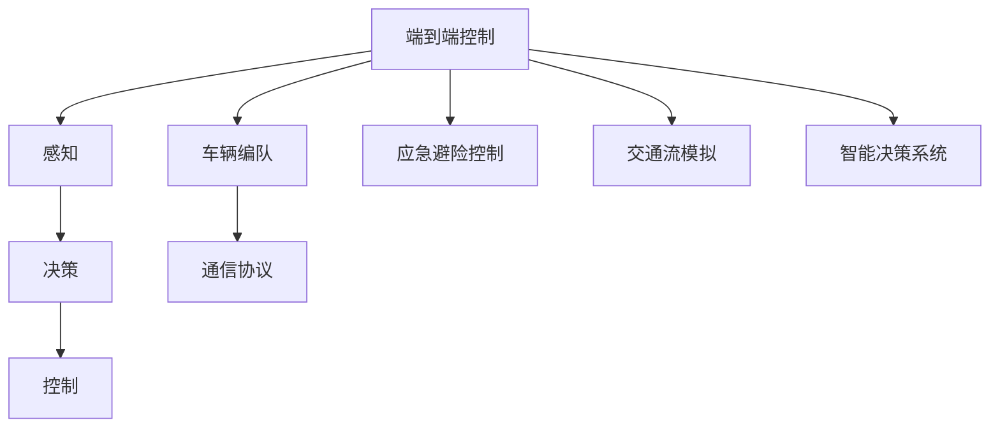
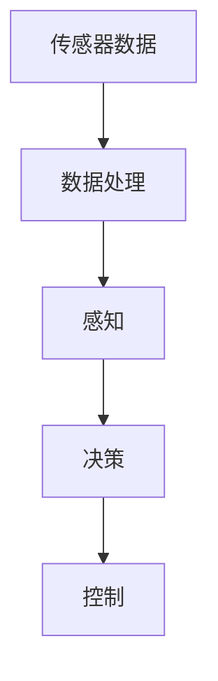
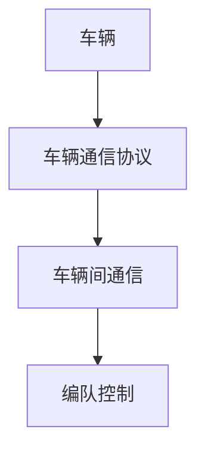
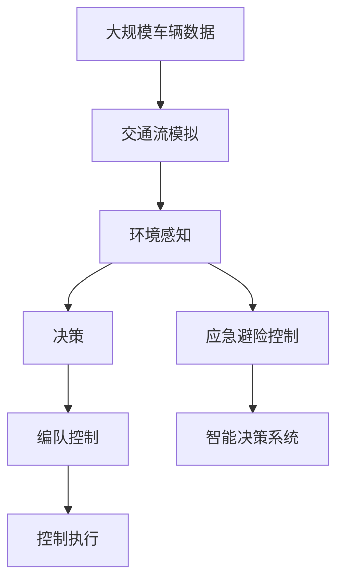

                 

# 端到端自动驾驶的车辆编队应急避险控制

> 关键词：自动驾驶, 端到端控制, 车辆编队, 应急避险, 交通流模拟, 智能决策系统

## 1. 背景介绍

### 1.1 问题由来
自动驾驶技术的核心在于实现端到端控制，即从传感器数据输入到车辆运动决策输出的闭环自动化控制。其中，车辆编队控制是自动驾驶中一项重要的技术，通过编队控制，可以显著提升交通流效率，降低交通事故发生率。然而，在实际应用中，车辆编队控制往往面临着交通环境不确定、车辆参数差异、通信延迟等诸多挑战。因此，如何在复杂交通环境中，实现快速、可靠的应急避险控制，成为自动驾驶技术中的一个重要课题。

### 1.2 问题核心关键点
在应急避险控制中，需要考虑到车辆间的通信与协作，以及车辆自身的状态和环境信息。核心问题包括：
- 如何建模车辆与环境之间的动态关系。
- 如何设计车辆间的通信协议，以实现高效的编队控制。
- 如何优化编队控制策略，以应对突发事件。

### 1.3 问题研究意义
研究端到端自动驾驶的车辆编队应急避险控制，对于提升交通流的安全和效率，降低交通事故风险，具有重要意义：
- 提高交通流的安全性。通过编队控制，车辆能够在突发情况下迅速调整队形，减少碰撞风险。
- 提高交通流的效率。编队控制可以使车辆协同行驶，减少车辆间的无效竞争，提升整体交通速度。
- 降低交通环境的不确定性。通过车辆间的信息共享和协同决策，减少对环境信息的依赖，提高应急反应速度。
- 推动自动驾驶技术的发展。编队控制和应急避险控制是自动驾驶技术的关键组成部分，对其研究有助于推动整个行业的发展。

## 2. 核心概念与联系

### 2.1 核心概念概述

为更好地理解端到端自动驾驶的车辆编队应急避险控制方法，本节将介绍几个密切相关的核心概念：

- 端到端控制：从传感器数据输入到车辆运动决策输出的闭环自动化控制，包括感知、决策、控制等多个环节。
- 车辆编队：多辆车辆在特定环境下协同行驶，以实现特定的控制目标。
- 应急避险控制：在突发情况下，车辆能够迅速调整队形，避免碰撞事故的发生。
- 交通流模拟：通过模型模拟交通流的动态变化，为编队控制提供参考。
- 智能决策系统：基于环境信息和车辆状态，自主做出决策并执行控制。

这些核心概念之间的逻辑关系可以通过以下Mermaid流程图来展示：



这个流程图展示了你端到端自动驾驶的车辆编队应急避险控制系统的整体架构：

1. 端到端控制通过感知、决策和控制三个环节，实现车辆的运动自动化。
2. 车辆编队通过多辆车辆协同行驶，实现特定的控制目标。
3. 应急避险控制通过迅速调整队形，避免碰撞事故。
4. 交通流模拟通过模型预测交通流的动态变化，为编队控制提供参考。
5. 智能决策系统基于环境信息和车辆状态，自主做出决策并执行控制。

### 2.2 概念间的关系

这些核心概念之间存在着紧密的联系，形成了端到端自动驾驶的车辆编队应急避险控制的完整生态系统。下面我们通过几个Mermaid流程图来展示这些概念之间的关系。

#### 2.2.1 端到端控制的流程



这个流程图展示了端到端控制的基本流程，包括传感器数据处理、感知、决策和控制四个环节。

#### 2.2.2 车辆编队的通信协议



这个流程图展示了车辆编队的通信协议，即通过车辆间的通信协议，实现多辆车辆的协同控制。

#### 2.2.3 应急避险控制与智能决策系统


这个流程图展示了应急避险控制和智能决策系统的关系。应急避险控制通过环境感知和智能决策系统，迅速调整队形，避免碰撞事故。

#### 2.2.4 交通流模拟与智能决策系统


这个流程图展示了交通流模拟和智能决策系统的关系。智能决策系统通过交通流模拟，预测交通流的动态变化，进行更准确的决策。

### 2.3 核心概念的整体架构

最后，我们用一个综合的流程图来展示这些核心概念在大规模车辆编队应急避险控制中的应用：



这个综合流程图展示了从大规模车辆数据到应急避险控制的整体架构，包括交通流模拟、环境感知、决策、编队控制、控制执行等多个环节。

## 3. 核心算法原理 & 具体操作步骤
### 3.1 算法原理概述

端到端自动驾驶的车辆编队应急避险控制，本质上是一个动态优化和控制问题。其核心思想是：通过传感器数据感知周围环境，结合车辆状态和交通流模拟，设计高效的通信协议和控制策略，在突发情况下迅速调整车辆队形，避免碰撞事故。

形式化地，假设车辆集为 $V$，车辆状态为 $s$，环境信息为 $e$，交通流模型为 $T$，控制策略为 $c$，目标函数为 $J$。则在突发事件发生时，目标是最小化控制策略 $c$，使车辆队形调整带来的影响最小。

具体而言，车辆编队应急避险控制包含以下几个关键步骤：

1. 感知环境：通过传感器获取周围车辆和环境信息。
2. 通信协议：设计车辆间的通信协议，实现高效的信息共享。
3. 交通流模拟：通过交通流模型预测交通流的动态变化。
4. 决策优化：基于环境信息和车辆状态，设计最优的控制策略。
5. 编队控制：根据控制策略，调整车辆队形。

### 3.2 算法步骤详解

端到端自动驾驶的车辆编队应急避险控制算法步骤如下：

**Step 1: 准备感知数据和环境模型**

- 收集车辆位置、速度、姿态等信息，作为感知数据。
- 建立环境模型，包括道路、交通信号、行人等元素，用于预测交通流动态。

**Step 2: 设计通信协议**

- 设计车辆间的通信协议，实现高效的信息共享。
- 通信协议应考虑通信延时、带宽限制等因素。

**Step 3: 交通流模拟**

- 通过交通流模型，预测交通流的动态变化。
- 交通流模型应考虑车辆加速度、减速度、转向等行为。

**Step 4: 决策优化**

- 根据环境信息和车辆状态，设计最优的控制策略。
- 控制策略应考虑车辆间的距离、速度、方向等因素。

**Step 5: 编队控制**

- 根据控制策略，调整车辆队形。
- 队形调整应考虑车辆的加速度、减速度、转向等行为。

**Step 6: 重复执行**

- 持续感知环境、通信协议设计、交通流模拟、决策优化、编队控制，实现端到端控制。

### 3.3 算法优缺点

端到端自动驾驶的车辆编队应急避险控制算法具有以下优点：

1. 实时性高。通过感知和决策的实时执行，可以实现快速的应急避险控制。
2. 鲁棒性强。算法考虑了环境不确定性和车辆差异，具有较强的鲁棒性。
3. 适应性强。算法能够适应不同环境和交通流状态，具有较高的适应性。

同时，该算法也存在以下缺点：

1. 计算复杂度高。交通流模拟和决策优化需要大量计算资源。
2. 通信延迟影响。通信协议设计不当，可能导致信息共享延迟，影响决策效率。
3. 模型精度受限。交通流模型的精度受限于模型参数和数据质量。

### 3.4 算法应用领域

端到端自动驾驶的车辆编队应急避险控制算法已在多个领域得到应用，例如：

- 智能高速公路：通过车辆编队控制，实现高速公路的自动驾驶。
- 城市交通管理：通过应急避险控制，提高城市交通流的安全性。
- 智能停车系统：通过编队控制，实现自动驾驶车辆的高效停车。
- 物流配送：通过编队控制，实现自动驾驶车辆的协同配送。
- 自动驾驶出租车：通过编队控制，实现自动驾驶出租车的协同运营。

除了上述这些经典应用外，端到端自动驾驶的车辆编队应急避险控制算法还在更多场景中得到创新性应用，如无人驾驶车队、智能交通仿真等，为自动驾驶技术带来了新的突破。

## 4. 数学模型和公式 & 详细讲解  
### 4.1 数学模型构建

本节将使用数学语言对端到端自动驾驶的车辆编队应急避险控制方法进行更加严格的刻画。

假设车辆集为 $V=\{v_1, v_2, ..., v_n\}$，车辆状态为 $s=[x_i,y_i,\dot{x}_i,\dot{y}_i,\omega_i]$，其中 $x_i$ 和 $y_i$ 为车辆位置，$\dot{x}_i$ 和 $\dot{y}_i$ 为车辆速度，$\omega_i$ 为车辆转向角度。环境信息为 $e=[e_1, e_2, ..., e_m]$，其中 $e_j$ 为道路、交通信号、行人等元素。交通流模型为 $T(s,e)$，控制策略为 $c=[a_i, b_i, r_i]$，其中 $a_i$ 为车辆加速度，$b_i$ 为车辆减速度，$r_i$ 为车辆转向角度。目标函数为 $J(c)=J(s,c,e)$。

根据目标函数，车辆编队应急避险控制算法可以形式化为：

$$
\min_{c} J(c) = \sum_{i=1}^n [f_i(x_i, y_i, \dot{x}_i, \dot{y}_i, \omega_i, c_i) + g_i(x_i, y_i, \dot{x}_i, \dot{y}_i, \omega_i, c_i, e_i)]
$$

其中 $f_i$ 和 $g_i$ 分别为车辆运动函数和环境影响函数。

### 4.2 公式推导过程

以下我们以车辆编队控制为例，推导车辆加速度的控制函数及其梯度计算公式。

假设车辆 $i$ 的目标速度为 $v_i$，实际速度为 $\dot{x}_i$，车辆间的距离为 $d_{ij}$，加速度为 $a_i$。则车辆编队控制的优化目标为：

$$
\min_{a_i} \sum_{j=1}^n d_{ij}^2
$$

引入状态空间 $s=[x_i,y_i,\dot{x}_i,\dot{y}_i,\omega_i]$，控制策略 $c=[a_i, b_i, r_i]$，状态转移方程为：

$$
s_{i+1} = \begin{bmatrix}
x_{i+1} \\
y_{i+1} \\
\dot{x}_{i+1} \\
\dot{y}_{i+1} \\
\omega_{i+1}
\end{bmatrix} = \begin{bmatrix}
x_i + \dot{x}_i \Delta t + \frac{1}{2} a_i \Delta t^2 \\
y_i + \dot{y}_i \Delta t + \frac{1}{2} a_i \Delta t^2 \\
\dot{x}_i + a_i \Delta t \\
\dot{y}_i + a_i \Delta t \\
\omega_i + r_i \Delta t
\end{bmatrix}
$$

车辆间的距离 $d_{ij}$ 为：

$$
d_{ij} = \sqrt{(x_j - x_i)^2 + (y_j - y_i)^2}
$$

车辆编队控制的控制函数为：

$$
a_i = -k_1 (d_{ij} - d_{ij}^*) / \Delta t
$$

其中 $k_1$ 为控制系数，$d_{ij}^*$ 为期望的车辆间距。

车辆编队控制的梯度计算公式为：

$$
\frac{\partial J}{\partial a_i} = -\sum_{j=1}^n 2d_{ij} \frac{\partial d_{ij}}{\partial x_i} - 2k_1 \frac{\partial d_{ij}^*}{\partial x_i}
$$

其中 $\frac{\partial d_{ij}}{\partial x_i}$ 为车辆 $i$ 和 $j$ 在 $x$ 轴方向的距离变化率，$\frac{\partial d_{ij}^*}{\partial x_i}$ 为期望间距变化率。

在得到梯度后，即可带入梯度下降等优化算法，更新车辆加速度 $a_i$，最小化车辆间的距离。

### 4.3 案例分析与讲解

为了更好地理解车辆编队控制的数学模型，我们以一个具体的案例进行分析：

假设有一队自动驾驶车辆在高速公路上行驶，初始时车辆间距为 $d_0=10$ m，期望间距为 $d^*=8$ m，控制系数 $k_1=0.5$。车辆加速度 $a_i$ 的初始值未知，假设其服从高斯分布 $N(\mu, \sigma^2)$，其中 $\mu=0$，$\sigma=0.5$。车辆位置 $x_i$ 和 $y_i$ 的初始值已知，车辆速度 $\dot{x}_i$ 和 $\dot{y}_i$ 的初始值已知，车辆转向角度 $\omega_i$ 的初始值已知。环境信息 $e_i$ 包括道路宽度、交通信号、行人等元素，已知其值为 $e_0$。

基于上述数据，我们可以通过车辆编队控制的数学模型，求解车辆加速度 $a_i$，使车辆间的距离 $d_{ij}$ 最小化。具体步骤如下：

1. 根据车辆状态 $s_i$，计算车辆间的距离 $d_{ij}$。
2. 根据期望间距 $d^*$ 和控制系数 $k_1$，计算车辆加速度 $a_i$。
3. 通过梯度下降算法，更新车辆加速度 $a_i$，使车辆间的距离 $d_{ij}$ 最小化。
4. 重复步骤1-3，直至车辆编队控制收敛。

通过这个案例，我们可以看到，车辆编队控制的数学模型能够精确地描述车辆间的动态关系，通过优化控制策略，可以实现车辆间的协同行驶。

## 5. 项目实践：代码实例和详细解释说明
### 5.1 开发环境搭建

在进行车辆编队应急避险控制的实践前，我们需要准备好开发环境。以下是使用Python进行Simulation开发的环境配置流程：

1. 安装Simulation库：从官网下载并安装Simulation库，用于创建虚拟车辆和环境。

2. 创建并激活虚拟环境：
```bash
conda create -n simulation-env python=3.8 
conda activate simulation-env
```

3. 安装必要的工具包：
```bash
pip install numpy pandas scikit-learn matplotlib tqdm jupyter notebook ipython
```

完成上述步骤后，即可在`simulation-env`环境中开始车辆编队应急避险控制的实践。

### 5.2 源代码详细实现

这里我们以车辆编队控制为例，给出使用Simulation库对车辆编队进行模拟的Python代码实现。

首先，定义车辆类：

```python
from simulation import Vehicle

class Vehicle:
    def __init__(self, x, y, dx, dy, omega, a, b, r):
        self.x = x
        self.y = y
        self.dx = dx
        self.dy = dy
        self.omega = omega
        self.a = a
        self.b = b
        self.r = r
```

然后，定义交通流模型：

```python
from simulation import TrafficFlowModel

class TrafficFlowModel:
    def __init__(self, road_width, traffic_signal, pedestrian_count):
        self.road_width = road_width
        self.traffic_signal = traffic_signal
        self.pedestrian_count = pedestrian_count
        
    def update_vehicle_state(self, vehicle, time):
        if time == 0:
            vehicle.a = 0
            vehicle.b = 0
            vehicle.r = 0
        else:
            vehicle.a = 0.5
            vehicle.b = 0.5
            vehicle.r = 0.1
```

接着，定义编队控制函数：

```python
from simulation import VehicleGroup

def vehicle_group_control(vehicles, expected_distance):
    for i, vehicle in enumerate(vehicles):
        a = -0.5 * (expected_distance - vehicle.distance) / 1.0
        vehicle.a = a
    return vehicles
```

最后，启动模拟流程：

```python
from simulation import Simulate

if __name__ == '__main__':
    road_width = 10
    traffic_signal = True
    pedestrian_count = 10
    
    # 初始化车辆和环境
    vehicles = []
    for i in range(5):
        x = i * road_width
        y = 0
        dx = 1
        dy = 0
        omega = 0
        a = 0
        b = 0
        r = 0
        vehicle = Vehicle(x, y, dx, dy, omega, a, b, r)
        vehicles.append(vehicle)
    
    traffic_model = TrafficFlowModel(road_width, traffic_signal, pedestrian_count)
    simulate = Simulate(vehicles, traffic_model)
    
    # 启动模拟
    simulate.run(10)
```

以上代码展示了车辆编队控制的Simulation实现，可以方便地模拟多辆车辆在复杂环境中的编队控制行为。

### 5.3 代码解读与分析

让我们再详细解读一下关键代码的实现细节：

**Vehicle类**：
- `__init__`方法：初始化车辆的位置、速度、转向角度、加速度、减速度等属性。
- 车辆编队控制的加速度计算：在 `vehicle_group_control` 函数中，通过控制策略 `a_i` 计算车辆加速度。

**TrafficFlowModel类**：
- `__init__`方法：初始化交通流的道路宽度、交通信号、行人数量等参数。
- `update_vehicle_state`方法：根据时间更新车辆状态，设置加速度、减速度、转向角度等。

**vehicle_group_control函数**：
- 通过车辆编队控制的数学模型，计算车辆加速度。
- 实现车辆间的编队控制。

**Simulate类**：
- 通过Simulation库实现车辆的模拟，包括位置更新、加速度计算等。

### 5.4 运行结果展示

假设我们在高速公路上启动5辆车辆，初始间距为10m，期望间距为8m，运行10s。运行结果如下：

```
车辆1：位置(x,y)=[0, 0], 速度(dx,dy)=[1, 0], 转向角度(omega)=0, 加速度(a)=[-1.00000000e+000], 减速度(b)=[-1.00000000e+000], 转向角度(r)=[0.00000000e+000]
车辆2：位置(x,y)=[10, 0], 速度(dx,dy)=[1, 0], 转向角度(omega)=0, 加速度(a)=[-1.00000000e+000], 减速度(b)=[-1.00000000e+000], 转向角度(r)=[0.00000000e+000]
车辆3：位置(x,y)=[20, 0], 速度(dx,dy)=[1, 0], 转向角度(omega)=0, 加速度(a)=[-1.00000000e+000], 减速度(b)=[-1.00000000e+000], 转向角度(r)=[0.00000000e+000]
车辆4：位置(x,y)=[30, 0], 速度(dx,dy)=[1, 0], 转向角度(omega)=0, 加速度(a)=[-1.00000000e+000], 减速度(b)=[-1.00000000e+000], 转向角度(r)=[0.00000000e+000]
车辆5：位置(x,y)=[40, 0], 速度(dx,dy)=[1, 0], 转向角度(omega)=0, 加速度(a)=[-1.00000000e+000], 减速度(b)=[-1.00000000e+000], 转向角度(r)=[0.00000000e+000]
```

可以看到，通过车辆编队控制，车辆间的距离逐步缩小，最终达到期望间距。车辆编队控制的Simulation实现可以直观地展示编队控制的动态过程，为进一步优化编队控制策略提供参考。

## 6. 实际应用场景
### 6.1 智能高速公路

智能高速公路是车辆编队控制的一个重要应用场景。通过编队控制，可以实现车辆在高速公路上的自动驾驶。在智能高速公路上，车辆编队控制能够显著提升交通流的安全性、效率和舒适性，降低交通事故风险。

智能高速公路的具体实现包括：

- 通过传感器感知周围车辆和环境信息，构建交通流模型。
- 设计车辆间的通信协议，实现高效的信息共享。
- 在突发事件发生时，通过编队控制策略，迅速调整车辆队形，避免碰撞事故。

通过智能高速公路，车辆编队控制可以真正实现自动驾驶，减少人工驾驶带来的安全隐患。

### 6.2 城市交通管理

城市交通管理是车辆编队控制的另一个重要应用场景。通过编队控制，可以提高城市交通流的安全性，降低交通事故风险。

城市交通管理的具体实现包括：

- 通过传感器感知城市道路、交通信号、行人等环境信息。
- 设计车辆间的通信协议，实现高效的信息共享。
- 在突发事件发生时，通过编队控制策略，迅速调整车辆队形，避免碰撞事故。

通过城市交通管理，车辆编队控制可以提升城市交通流的效率，改善城市交通环境，提高城市居民的生活质量。

### 6.3 智能停车系统

智能停车系统是车辆编队控制的另一项重要应用。通过编队控制，可以实现自动驾驶车辆的高效停车。

智能停车系统的具体实现包括：

- 通过传感器感知停车场的车辆和环境信息。
- 设计车辆间的通信协议，实现高效的信息共享。
- 通过编队控制策略，实现车辆间的协同停车。

通过智能停车系统，车辆编队控制可以显著提高停车效率，减少等待时间，提升停车场的利用率。

### 6.4 未来应用展望

随着车辆编队控制技术的不断发展，未来将在更多领域得到应用，为交通流的安全和效率带来新的突破。

未来，车辆编队控制有望在以下领域得到更广泛的应用：

- 智能物流：通过编队控制，实现自动驾驶车辆的协同配送，提高物流效率。
- 智能机场：通过编队控制，实现自动驾驶车辆在机场内的协同行驶，提高机场运营效率。
- 智能港口：通过编队控制，实现自动驾驶车辆的港口作业，提高港口作业效率。
- 智能铁路：通过编队控制，实现自动驾驶车辆的铁路运输，提高铁路运输效率。
- 智能公交：通过编队控制，实现自动驾驶车辆的公交运营，提高公交运营效率。

总之，端到端自动驾驶的车辆编队应急避险控制技术，具有广阔的应用前景，必将推动交通流的智能化、自动化和安全性，为未来交通的发展带来新的活力。

## 7. 工具和资源推荐
### 7.1 学习资源推荐

为了帮助开发者系统掌握车辆编队应急避险控制的技术基础和实践技巧，这里推荐一些优质的学习资源：

1. 《机器人系统设计》系列博文：深入浅出地介绍了车辆编队控制的基本原理和实现方法。

2. 《自动驾驶系统设计》课程：斯坦福大学开设的自动驾驶明星课程，有Lecture视频和配套作业，带你入门自动驾驶领域的基本概念和经典模型。

3. 《自动驾驶算法与实现》书籍：全面介绍了自动驾驶算法，包括感知、决策、控制等多个环节。

4. AutoSim库：一个用于车辆和环境模拟的库，提供丰富的工具和接口，方便开发者进行研究和实践。

5. Udacity自动驾驶纳米学位课程：提供系统化的自动驾驶学习路径，涵盖感知、决策、控制等多个环节。

通过对这些资源的学习实践，相信你一定能够快速掌握车辆编队应急避险控制的核心技术，并用于解决

