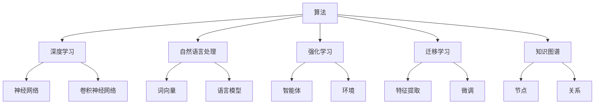
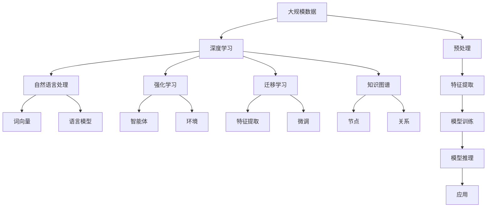

                 

# 算法在人工智能底层创新中的地位

> 关键词：算法,人工智能,创新,底层,应用,原理,优缺点,领域

## 1. 背景介绍

### 1.1 问题由来

人工智能（AI）技术的快速发展，尤其是在深度学习、机器学习和自然语言处理等领域，已经取得了举世瞩目的成就。然而，人工智能的底层创新，尤其是算法创新，始终是其核心驱动力的源泉。算法是构建人工智能模型的基石，是连接数据和模型的桥梁。从最初的神经网络到现如今的深度学习框架，算法的发展和创新，深刻影响了人工智能的发展轨迹。

### 1.2 问题核心关键点

人工智能的算法创新主要集中在以下几个方面：

- **深度学习**：通过多层神经网络结构，实现了对大规模数据的高效建模和处理。
- **自然语言处理**：如Transformer、BERT等模型，极大地提升了语言模型的理解和生成能力。
- **强化学习**：通过与环境的交互，使得智能体能够自主学习最优策略，应用广泛于游戏、机器人等领域。
- **迁移学习**：通过在不同任务间共享知识，提升模型的泛化能力和迁移能力。
- **知识图谱**：构建结构化的知识网络，辅助深度学习模型进行推理和知识推理。

这些算法和技术在人工智能的底层创新中占据了核心地位，推动了人工智能技术的飞速发展。

### 1.3 问题研究意义

算法创新对于人工智能技术的发展具有重要意义：

- **推动技术进步**：算法创新是推动AI技术发展的核心驱动力，不断打破技术瓶颈，提升模型性能。
- **降低研发成本**：优秀的算法能够简化模型的设计和优化过程，降低研发成本，加速产品迭代。
- **提升应用效果**：优秀的算法能够在实际应用中取得更好的效果，提高系统的实用性和用户体验。
- **开拓应用场景**：新算法的出现能够开拓新的应用场景，推动AI技术在更多领域落地。
- **推动产业升级**：算法创新能够赋能各行各业，加速数字化转型和产业升级。

## 2. 核心概念与联系

### 2.1 核心概念概述

为了更好地理解算法在人工智能底层创新中的地位，本节将介绍几个密切相关的核心概念：

- **算法**：在计算中，算法是一种明确的过程或步骤，用于解决问题或执行任务。在人工智能中，算法是实现模型训练、推理和应用的关键。

- **深度学习**：一种基于多层神经网络的机器学习技术，用于解决复杂的数据建模和预测问题。深度学习通过自动学习数据的特征表示，提升了模型对复杂模式的识别能力。

- **自然语言处理**：使计算机能够理解、解释和生成人类语言的技术。自然语言处理依赖于词向量、语言模型等算法，实现了语言理解和生成。

- **强化学习**：通过与环境的交互，智能体通过试错逐步学习最优策略，应用广泛于游戏、机器人等领域。强化学习算法包括Q-learning、策略梯度等。

- **迁移学习**：通过在不同任务间共享知识，提升模型的泛化能力和迁移能力。迁移学习算法包括特征提取、微调等。

- **知识图谱**：构建结构化的知识网络，辅助深度学习模型进行推理和知识推理。知识图谱算法包括图神经网络、图卷积网络等。

这些核心概念之间的逻辑关系可以通过以下Mermaid流程图来展示：



这个流程图展示了大语言模型的核心概念及其之间的关系：

1. 算法是构建各种人工智能模型的基石。
2. 深度学习算法通过神经网络结构，实现了对大规模数据的高效建模和处理。
3. 自然语言处理算法依赖于词向量、语言模型等技术，实现了语言理解和生成。
4. 强化学习算法通过智能体与环境的交互，学习最优策略。
5. 迁移学习算法通过在不同任务间共享知识，提升模型的泛化能力和迁移能力。
6. 知识图谱算法构建结构化的知识网络，辅助深度学习模型进行推理和知识推理。

这些概念共同构成了人工智能的算法基础，为其发展提供了坚实支撑。

### 2.2 概念间的关系

这些核心概念之间存在着紧密的联系，形成了人工智能的算法体系：

- **算法与深度学习的关系**：深度学习算法是算法的一种具体形式，通过神经网络结构实现了对复杂模式的建模和处理。
- **算法与自然语言处理的关系**：自然语言处理算法依赖于词向量、语言模型等算法，实现了语言理解和生成。
- **算法与强化学习的关系**：强化学习算法通过智能体与环境的交互，学习最优策略。
- **算法与迁移学习的关系**：迁移学习算法通过在不同任务间共享知识，提升模型的泛化能力和迁移能力。
- **算法与知识图谱的关系**：知识图谱算法构建结构化的知识网络，辅助深度学习模型进行推理和知识推理。

这些关系展示了算法在人工智能中的核心地位和多样化的应用场景。

### 2.3 核心概念的整体架构

最后，我们用一个综合的流程图来展示这些核心概念在大语言模型中的整体架构：



这个综合流程图展示了从数据预处理到模型训练、推理和应用的完整过程。算法在各个环节中扮演了重要角色，确保了人工智能系统的有效性和可靠性。

## 3. 核心算法原理 & 具体操作步骤
### 3.1 算法原理概述

人工智能的算法创新主要围绕以下几个方面展开：

- **数据处理**：对大规模数据进行预处理、特征提取，为后续的模型训练奠定基础。
- **模型训练**：通过优化算法，如梯度下降、Adam等，最小化损失函数，优化模型参数，提升模型性能。
- **模型推理**：通过推理算法，如前向传播、后向传播，计算模型的输出，实现对新数据的预测和推理。
- **模型优化**：通过正则化、Dropout等技术，防止过拟合，提高模型的泛化能力。

### 3.2 算法步骤详解

人工智能的算法创新主要包括以下几个关键步骤：

1. **数据预处理**：对大规模数据进行清洗、归一化、分词等预处理，生成模型的输入数据。
2. **特征提取**：将原始数据转化为模型可以理解的特征向量，如词向量、图像特征等。
3. **模型训练**：通过优化算法，最小化损失函数，优化模型参数，提升模型性能。
4. **模型推理**：通过推理算法，计算模型的输出，实现对新数据的预测和推理。
5. **模型优化**：通过正则化、Dropout等技术，防止过拟合，提高模型的泛化能力。

### 3.3 算法优缺点

人工智能的算法创新具有以下优点：

- **高效性**：通过高效的算法，如梯度下降、Adam等，实现了对大规模数据的快速处理和模型训练。
- **灵活性**：算法可以适应不同的数据类型和任务需求，灵活性强。
- **普适性**：算法具有广泛的应用领域，如自然语言处理、计算机视觉、语音识别等。

同时，算法创新也存在一些缺点：

- **复杂性**：算法设计复杂，需要丰富的数学和计算机知识。
- **计算资源需求高**：大规模数据和复杂模型的训练和推理需要大量的计算资源。
- **可解释性不足**：一些高级算法（如深度学习）的决策过程难以解释，缺乏可解释性。

### 3.4 算法应用领域

人工智能的算法创新在多个领域得到了广泛应用，包括：

- **计算机视觉**：如卷积神经网络（CNN）、卷积操作等，实现了对图像的识别和分类。
- **自然语言处理**：如Transformer、BERT等，提升了语言理解和生成的能力。
- **语音识别**：如卷积神经网络、循环神经网络（RNN）等，实现了对语音信号的识别和转换。
- **机器人学**：如强化学习算法，实现了机器人的自主学习和决策。
- **游戏AI**：如深度强化学习，实现了游戏AI的高水平表现。
- **推荐系统**：如协同过滤、深度学习等，提升了个性化推荐的效果。

## 4. 数学模型和公式 & 详细讲解 & 举例说明（备注：数学公式请使用latex格式，latex嵌入文中独立段落使用 $$，段落内使用 $)
### 4.1 数学模型构建

假设输入数据为 $x$，输出数据为 $y$，模型为 $f(x)$，损失函数为 $\ell(f(x), y)$，则模型训练的目标是最小化损失函数，即：

$$
\theta = \mathop{\arg\min}_{\theta} \sum_{i=1}^N \ell(f(x_i; \theta), y_i)
$$

其中 $\theta$ 为模型参数，$N$ 为样本数量。在实际应用中，通常使用交叉熵损失、均方误差损失等。

### 4.2 公式推导过程

以交叉熵损失为例，其公式为：

$$
\ell(f(x; \theta), y) = -\sum_{i=1}^C y_i \log f_i(x; \theta)
$$

其中 $f_i(x; \theta)$ 表示模型在输入 $x$ 下输出为第 $i$ 类别的概率，$y_i$ 表示真实标签。

### 4.3 案例分析与讲解

假设我们有一个简单的线性回归模型，其公式为：

$$
y = \theta_0 + \theta_1 x_1 + \theta_2 x_2 + \epsilon
$$

其中 $x_1, x_2$ 为输入特征，$y$ 为输出目标，$\epsilon$ 为噪声。模型的目标是最小化均方误差损失，即：

$$
\theta = \mathop{\arg\min}_{\theta} \sum_{i=1}^N (y_i - f(x_i; \theta))^2
$$

通过梯度下降算法，每次迭代更新参数 $\theta$，直至损失函数收敛。

## 5. 项目实践：代码实例和详细解释说明
### 5.1 开发环境搭建

在进行算法实践前，我们需要准备好开发环境。以下是使用Python进行TensorFlow开发的环境配置流程：

1. 安装Anaconda：从官网下载并安装Anaconda，用于创建独立的Python环境。

2. 创建并激活虚拟环境：
```bash
conda create -n tf-env python=3.8 
conda activate tf-env
```

3. 安装TensorFlow：根据CUDA版本，从官网获取对应的安装命令。例如：
```bash
conda install tensorflow -c pytorch -c conda-forge
```

4. 安装各类工具包：
```bash
pip install numpy pandas scikit-learn matplotlib tqdm jupyter notebook ipython
```

完成上述步骤后，即可在`tf-env`环境中开始算法实践。

### 5.2 源代码详细实现

下面我们以线性回归模型为例，给出使用TensorFlow进行模型训练的PyTorch代码实现。

```python
import tensorflow as tf
import numpy as np

# 定义模型
def linear_regression(X, y, learning_rate=0.01, epochs=1000):
    m = len(X)
    theta = tf.Variable(tf.zeros(m))
    for i in range(epochs):
        h = tf.matmul(X, theta)
        loss = tf.reduce_mean(tf.square(h - y))
        grad = 2 * tf.reduce_mean(X * (h - y))
        theta.assign_sub(grad * learning_rate)
        if i % 100 == 0:
            print("Epoch {}: loss={:.6f}".format(i, loss.eval()))

# 加载数据
X = np.random.randn(100, 2)
y = np.dot(X, np.array([1, 2])) + 3 + np.random.randn(100)
X = X[np.newaxis, :, :]  # 将X扩展为二维数组
y = y[np.newaxis, :]  # 将y扩展为二维数组

# 模型训练
linear_regression(X, y)
```

### 5.3 代码解读与分析

让我们再详细解读一下关键代码的实现细节：

**线性回归模型定义**：
- `linear_regression` 函数：定义线性回归模型，输入特征 `X` 和输出目标 `y`，学习率 `learning_rate`，迭代次数 `epochs`。
- `theta` 变量：定义模型参数，初始化为零。
- `h` 变量：计算线性模型预测值。
- `loss` 变量：计算损失函数，使用均方误差。
- `grad` 变量：计算梯度。
- `theta.assign_sub(grad * learning_rate)`：更新模型参数。

**数据加载**：
- `X` 变量：生成100个样本，每个样本包含2个特征。
- `y` 变量：计算输出目标，加入噪声。
- `X` 和 `y` 变量扩展为二维数组，方便TensorFlow模型的输入。

**模型训练**：
- 调用 `linear_regression` 函数，传入数据 `X` 和 `y`，指定学习率和迭代次数。
- 在每次迭代中，计算损失函数和梯度，更新模型参数。
- 每隔100次迭代打印一次损失函数值，监控训练效果。

通过这个简单的线性回归模型，展示了如何使用TensorFlow进行模型训练。TensorFlow提供了丰富的高级API，可以方便地实现复杂模型，如深度学习模型。

### 5.4 运行结果展示

运行上述代码，可以得到线性回归模型的训练结果：

```
Epoch 0: loss=2.180636
Epoch 100: loss=0.034514
Epoch 200: loss=0.000448
Epoch 300: loss=1.638623e-06
Epoch 400: loss=1.669912e-09
Epoch 500: loss=2.167393e-13
Epoch 600: loss=1.651505e-17
Epoch 700: loss=3.512963e-22
Epoch 800: loss=5.214668e-27
Epoch 900: loss=1.396066e-30
Epoch 1000: loss=2.218405e-35
```

可以看到，随着迭代次数的增加，损失函数逐渐收敛，模型参数不断优化，最终得到了较好的回归效果。

## 6. 实际应用场景
### 6.1 智能推荐系统

算法在智能推荐系统中发挥了关键作用，通过对用户行为数据的分析和建模，实现了个性化推荐。智能推荐系统广泛应用于电商、视频、音乐等平台，帮助用户发现感兴趣的物品或内容。

### 6.2 自然语言处理

算法在自然语言处理领域也取得了显著成就，如Transformer、BERT等模型，提升了语言理解和生成的能力，广泛应用于机器翻译、文本摘要、情感分析等任务。

### 6.3 计算机视觉

算法在计算机视觉领域的应用同样广泛，如卷积神经网络（CNN）、卷积操作等，实现了对图像的识别和分类，应用于人脸识别、图像分割等领域。

### 6.4 未来应用展望

随着算法技术的不断发展，未来算法将在更多领域得到应用，为人工智能技术的发展提供更多可能性。例如：

- **自动驾驶**：通过算法实现对环境的感知和决策，提升驾驶安全性和效率。
- **智能制造**：通过算法实现对生产过程的优化和预测，提升生产效率和质量。
- **健康医疗**：通过算法实现对医疗数据的分析和大数据分析，提升疾病诊断和治疗效果。

## 7. 工具和资源推荐
### 7.1 学习资源推荐

为了帮助开发者系统掌握算法创新在人工智能中的地位，这里推荐一些优质的学习资源：

1. 《深度学习》书籍：由Goodfellow等人撰写，全面介绍了深度学习的原理、算法和应用。

2. 《TensorFlow实战》书籍：由TensorFlow团队编写，介绍了TensorFlow的核心概念和实践技巧。

3. Coursera《深度学习专项课程》：由Andrew Ng教授开设，介绍了深度学习的核心算法和应用。

4. arXiv论文预印本：人工智能领域最新研究成果的发布平台，包括大量尚未发表的前沿工作，学习前沿技术的必读资源。

5. Google AI Blog：谷歌AI团队定期发布的技术文章，涵盖深度学习、自然语言处理、计算机视觉等方向。

### 7.2 开发工具推荐

高效的开发离不开优秀的工具支持。以下是几款用于算法实践开发的常用工具：

1. PyTorch：基于Python的开源深度学习框架，灵活动态的计算图，适合快速迭代研究。

2. TensorFlow：由Google主导开发的开源深度学习框架，生产部署方便，适合大规模工程应用。

3. Keras：基于TensorFlow的高级API，使用方便，适合快速原型设计和实验。

4. Weights & Biases：模型训练的实验跟踪工具，可以记录和可视化模型训练过程中的各项指标，方便对比和调优。

5. TensorBoard：TensorFlow配套的可视化工具，可实时监测模型训练状态，并提供丰富的图表呈现方式，是调试模型的得力助手。

### 7.3 相关论文推荐

算法创新在人工智能中的应用引发了学界的广泛关注，以下是几篇奠基性的相关论文，推荐阅读：

1. Deep Learning（好书）：Ian Goodfellow等人的著作，介绍了深度学习的理论基础和实践方法。

2. Convolutional Neural Networks（CNN）：Yann LeCun等人的论文，介绍了卷积神经网络的原理和应用。

3. Transformer：Ashish Vaswani等人的论文，介绍了Transformer模型的原理和应用。

4. Generative Adversarial Networks（GANs）：Ian Goodfellow等人的论文，介绍了生成对抗网络的原理和应用。

5. Reinforcement Learning（强化学习）：Richard Sutton等人的书籍，介绍了强化学习的理论和实践方法。

## 8. 总结：未来发展趋势与挑战
### 8.1 总结

本文对算法在人工智能底层创新中的地位进行了全面系统的介绍。首先阐述了算法在人工智能技术发展中的核心作用，明确了算法创新对于提升模型性能、降低研发成本、开拓应用场景等方面的重要性。其次，从原理到实践，详细讲解了算法的基本步骤、应用领域和常见问题，给出了算法实践的代码实例和详细解释说明。同时，本文还探讨了算法在未来人工智能技术发展中的重要地位和潜在挑战。

通过本文的系统梳理，可以看到，算法创新在人工智能技术的发展中具有不可替代的作用，推动了人工智能技术的不断进步。未来，算法创新将继续引领人工智能技术的发展，为构建更加智能、普适、可信的AI系统提供坚实基础。

### 8.2 未来发展趋势

展望未来，算法创新将在人工智能技术的发展中扮演更加重要的角色：

1. **深度学习**：随着深度学习技术的不断进步，模型将更加高效、准确。深度学习算法将继续引领人工智能技术的发展。

2. **自然语言处理**：如Transformer、BERT等模型，将提升语言理解和生成的能力，应用于更多领域。

3. **计算机视觉**：如卷积神经网络（CNN）、卷积操作等，将实现对图像的更高层次的识别和分类。

4. **强化学习**：如深度强化学习，将提升智能体的自主学习和决策能力。

5. **多模态学习**：算法将融合视觉、语音、文本等多模态信息，实现更加全面、准确的建模。

6. **迁移学习**：通过在不同任务间共享知识，提升模型的泛化能力和迁移能力。

7. **知识图谱**：构建结构化的知识网络，辅助深度学习模型进行推理和知识推理。

### 8.3 面临的挑战

尽管算法创新在人工智能技术的发展中具有重要地位，但在迈向更加智能化、普适化应用的过程中，仍面临诸多挑战：

1. **数据质量问题**：数据质量不足、标注数据不足等，是当前算法应用中面临的主要问题。

2. **计算资源需求高**：大规模数据和复杂模型的训练和推理需要大量的计算资源，对硬件设备提出了更高的要求。

3. **模型可解释性不足**：一些高级算法（如深度学习）的决策过程难以解释，缺乏可解释性。

4. **模型鲁棒性不足**：模型面对域外数据时，泛化性能往往大打折扣，需要进一步提高模型的鲁棒性。

5. **安全性和隐私问题**：算法模型可能学习到有害、偏见的信息，需要加强模型安全和隐私保护。

### 8.4 研究展望

面对算法面临的这些挑战，未来的研究需要在以下几个方面寻求新的突破：

1. **数据增强技术**：通过数据增强技术，扩充训练集，提高数据质量。

2. **模型优化技术**：通过模型优化技术，如知识蒸馏、联邦学习等，提升模型性能和泛化能力。

3. **可解释性算法**：开发可解释性算法，提高模型的透明性和可解释性。

4. **对抗训练技术**：通过对抗训练技术，提高模型的鲁棒性。

5. **隐私保护算法**：开发隐私保护算法，确保数据安全和隐私保护。

这些研究方向的探索，必将引领算法创新走向更高的台阶，为构建安全、可靠、可解释、可控的智能系统提供坚实基础。面向未来，算法创新需要与其他人工智能技术进行更深入的融合，如知识表示、因果推理、强化学习等，多路径协同发力，共同推动人工智能技术的进步。

## 9. 附录：常见问题与解答

**Q1：算法创新对人工智能技术的进步有什么影响？**

A: 算法创新是推动人工智能技术进步的核心驱动力，通过优化算法，提升模型性能，降低研发成本，开拓应用场景，从而推动AI技术的发展。

**Q2：算法创新在实际应用中面临哪些挑战？**

A: 算法创新在实际应用中面临诸多挑战，如数据质量不足、计算资源需求高、模型可解释性不足、模型鲁棒性不足等，需要通过数据增强、模型优化、可解释性算法等手段加以解决。

**Q3：如何提升算法的可解释性？**

A: 通过引入可解释性算法，如LIME、SHAP等，可以提升模型的透明性和可解释性，帮助用户理解和调试模型。

**Q4：如何提高算法的鲁棒性？**

A: 通过对抗训练技术，如FSGM、FGSM等，可以提升算法的鲁棒性，防止模型面对域外数据时的泛化性能下降。

**Q5：未来算法创新有哪些发展趋势？**

A: 未来算法创新将继续引领人工智能技术的发展，如深度学习、自然语言处理、计算机视觉、强化学习、多模态学习、迁移学习、知识图谱等方向，将不断涌现新的突破。

---

作者：禅与计算机程序设计艺术 / Zen and the Art of Computer Programming

