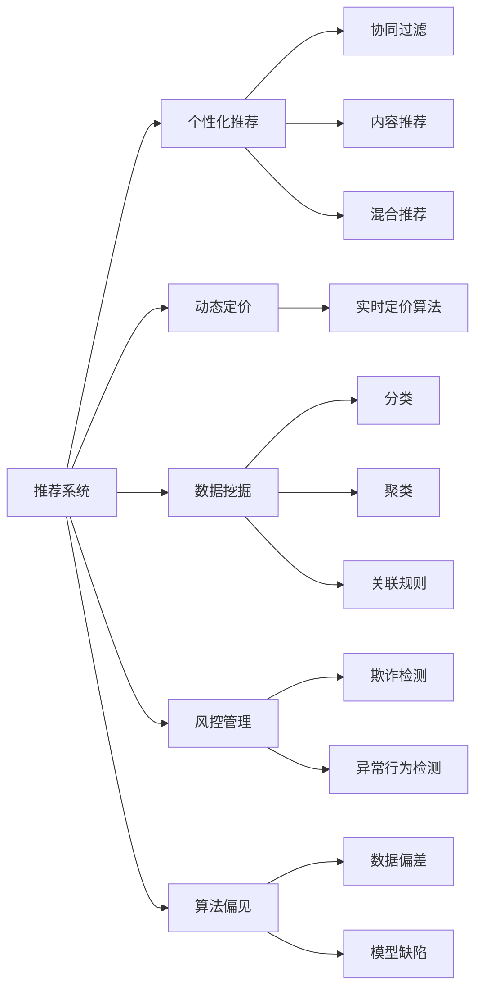

                 

# 算法的操控：我们被平台玩弄于股掌之间

## 1. 背景介绍

### 1.1 问题由来
随着人工智能技术的快速发展，算法在各行业的广泛应用，平台或服务提供商通过算法操控用户行为，成为一种常态。无论是社交媒体、电商平台、内容平台，还是搜索引擎、广告推荐系统，平台利用算法精准洞察用户需求，从而提供量身定制的服务。

然而，平台对算法的深度操控，往往使得用户陷入"信息茧房"，屏蔽了多元化的信息，降低了信息获取的全面性。此外，算法偏见、数据隐私等问题也逐渐成为社会关注的焦点。如何看待和应对平台算法的操控，成为当前社会和学术界共同关注的热点问题。

### 1.2 问题核心关键点
平台对算法的操控主要体现在以下几个方面：
1. 用户画像：通过分析用户的浏览历史、购买记录、搜索行为等，构建详尽的用户画像，精准定位用户需求。
2. 个性化推荐：利用推荐算法，根据用户画像进行精准推荐，提升用户粘性。
3. 动态定价：通过实时定价算法，根据用户需求和市场状况动态调整价格，增加利润。
4. 数据挖掘：利用数据挖掘算法，挖掘用户潜在需求和行为规律，预判市场趋势。
5. 风控管理：通过风控算法，实时监控用户行为，防范欺诈风险。

这些算法操控行为，在提升用户体验和服务质量的同时，也带来了隐私侵犯、信息茧房、市场垄断等问题。如何平衡算法操控带来的正面效果和负面影响，成为亟待解决的社会和伦理问题。

### 1.3 问题研究意义
研究平台算法操控的机制和影响，有助于理解算法在实际应用中的作用和局限，为制定相关政策和法规提供科学依据。此外，如何确保算法的公平性、透明性、隐私保护，也是提高人工智能系统可靠性和可信度的重要课题。

## 2. 核心概念与联系

### 2.1 核心概念概述

为更好地理解平台对算法的操控机制，本节将介绍几个密切相关的核心概念：

- 推荐系统(Recommendation System)：通过用户画像和历史数据，利用算法模型推荐用户可能感兴趣的商品、内容、服务等。推荐算法包括协同过滤、内容推荐、混合推荐等。

- 个性化推荐：基于用户兴趣、历史行为、社交网络等数据，采用推荐算法为用户推荐个性化内容或商品，提升用户体验和满意度。

- 动态定价：根据市场需求、竞争状况、用户行为等实时因素，利用算法动态调整商品或服务价格，实现收益最大化。

- 数据挖掘(Data Mining)：通过分析大规模数据集，提取有用信息和知识，为业务决策提供依据。数据挖掘算法包括分类、聚类、关联规则等。

- 风控管理(Financial Risk Management)：利用算法实时监控交易行为，识别和防范欺诈、违规行为，保障系统安全。

- 算法偏见(Bias in Algorithm)：由于数据偏差、模型缺陷等原因，导致算法对某些群体产生不公平对待，加剧社会不平等。

这些核心概念之间存在紧密的联系，共同构成了平台对算法操控的完整生态系统。为了更好地理解这些概念及其相互关系，下面用Mermaid流程图展示：



### 2.2 概念间的关系

这些核心概念之间存在紧密的联系，形成了平台对算法操控的完整生态系统。下面是这些概念之间的具体关系：

- **推荐系统与个性化推荐**：个性化推荐是推荐系统的一种实现方式，通过用户画像和历史数据，推荐用户感兴趣的内容或商品。

- **推荐系统与动态定价**：动态定价是在推荐系统的基础上，根据实时因素动态调整商品价格，提升收益。

- **数据挖掘与推荐系统**：数据挖掘是推荐系统的基础，通过分析用户数据，提取有用信息，优化推荐算法。

- **风控管理与推荐系统**：风控管理是对推荐系统的一种补充，通过实时监控交易行为，防范欺诈风险。

- **算法偏见与推荐系统**：推荐系统可能会引入算法偏见，导致对某些群体的不公平对待。

通过这些概念的相互关系，可以更清晰地理解平台对算法的操控机制，为后续讨论提供科学依据。

## 3. 核心算法原理 & 具体操作步骤
### 3.1 算法原理概述

平台对算法的操控，本质上是通过构建和优化算法模型，精准捕捉用户需求和行为规律，从而提供量身定制的服务。以下是平台操控算法的核心原理：

- 用户画像构建：通过分析用户的各类数据，如浏览历史、购买记录、搜索行为等，构建详尽的用户画像。
- 推荐算法优化：利用机器学习算法，对推荐系统进行优化，提升推荐的准确性和多样性。
- 实时定价机制：采用动态定价算法，根据市场状况和用户行为实时调整价格，实现收益最大化。
- 数据挖掘应用：利用数据挖掘算法，挖掘用户潜在需求和行为规律，预判市场趋势。
- 风控管理优化：通过风控算法，实时监控用户行为，防范欺诈风险。

这些原理的共同点在于，都是通过算法对海量数据进行处理和分析，从中提取有用信息，为业务决策提供科学依据。

### 3.2 算法步骤详解

平台对算法操控的具体步骤包括：

1. **数据采集**：收集用户的各类数据，如浏览历史、购买记录、搜索行为等，构建用户画像。

2. **特征工程**：对用户数据进行预处理，提取有用特征，构建特征向量。

3. **模型训练**：利用机器学习算法，对推荐系统进行训练，优化推荐模型。

4. **实时预测**：在用户进行操作时，实时预测用户需求，推荐个性化的商品、内容或服务。

5. **动态定价**：根据市场需求、竞争状况、用户行为等实时因素，利用动态定价算法，动态调整商品或服务价格。

6. **风控监控**：利用风控算法，实时监控用户行为，防范欺诈风险，保护系统安全。

7. **算法优化**：定期更新和优化算法模型，提升推荐效果和系统稳定性。

### 3.3 算法优缺点

平台对算法的操控有以下优点：

1. **提升用户体验**：通过精准推荐，提升用户满意度和粘性，增加用户留存率。
2. **增加收益**：通过动态定价，优化资源配置，提升收益和利润。
3. **防范风险**：通过实时监控，防范欺诈风险，保障系统安全。

同时，平台操控算法也存在一些缺点：

1. **隐私侵犯**：过度依赖用户数据，可能导致用户隐私泄露。
2. **信息茧房**：通过推荐算法，可能导致用户陷入"信息茧房"，屏蔽多元信息。
3. **市场垄断**：过度依赖算法，可能导致平台垄断市场，限制竞争。
4. **算法偏见**：由于数据偏差、模型缺陷等原因，可能导致算法偏见，加剧社会不平等。

### 3.4 算法应用领域

平台对算法的操控已经广泛应用于各个行业，以下是几个典型应用领域：

1. **社交媒体**：通过推荐算法，推荐用户可能感兴趣的内容，增加用户粘性。
2. **电商平台**：通过推荐系统，推荐用户可能购买的商品，提升用户购买率。
3. **内容平台**：通过推荐算法，推荐用户可能感兴趣的文章、视频等，提升平台流量。
4. **搜索引擎**：通过推荐算法，提升搜索结果的相关性和用户体验。
5. **广告推荐系统**：通过推荐算法，精准匹配用户需求，提升广告效果。
6. **金融领域**：通过动态定价和风控管理算法，提升金融服务的用户体验和安全性。

除了以上领域，平台对算法的操控还在智能家居、医疗健康、教育培训等多个行业得到应用，推动了相关领域的数字化转型。

## 4. 数学模型和公式 & 详细讲解  
### 4.1 数学模型构建

平台对算法的操控，涉及多种数学模型和算法。以下是一些核心模型的介绍：

- **协同过滤(Collaborative Filtering)**：利用用户历史行为数据，构建用户和商品之间的相似度矩阵，推荐相似商品。
- **内容推荐(Content-Based Filtering)**：基于用户画像，推荐与用户兴趣相关的商品或内容。
- **混合推荐(Hybrid Recommendation)**：结合协同过滤和内容推荐，提升推荐效果。
- **分类算法(Classification)**：利用分类算法，对用户行为进行分类，预测用户需求。
- **聚类算法(Clustering)**：利用聚类算法，对用户行为进行聚类，挖掘用户行为规律。
- **关联规则(Association Rule)**：利用关联规则算法，发现用户行为间的关联关系，预判用户需求。

### 4.2 公式推导过程

以协同过滤算法为例，推导其基本原理和公式。

协同过滤算法基于用户历史行为数据，构建用户和商品之间的相似度矩阵。设用户集为$U=\{u_1,u_2,...,u_n\}$，商品集为$I=\{i_1,i_2,...,i_m\}$，用户$u_i$对商品$i_j$的评分记为$r_{i_j}$。则协同过滤算法的核心公式为：

$$
\hat{r}_{i_j}(u_k) = \frac{\sum_{u_l \in N(u_k)} \frac{r_{i_j}(u_l)}{k_{u_l}} \frac{r_{i_l}(u_k)}{k_{u_l}}}{\sqrt{\sum_{u_l \in N(u_k)} (\frac{r_{i_j}(u_l)}{k_{u_l}})^2} \cdot \sqrt{\sum_{i_l \in I} (\frac{r_{i_l}(u_k)}{k_{i_l}})^2}
$$

其中$N(u_k)$表示用户$u_k$的邻居集，$k_{u_l}$表示用户$u_l$的评分方差，$\hat{r}_{i_j}(u_k)$表示用户$u_k$对商品$i_j$的预测评分。

该公式通过计算用户$u_k$的邻居集中的用户对商品$i_j$的评分，计算出用户$u_k$对商品$i_j$的预测评分。利用该评分，可为用户$u_k$推荐商品$i_j$。

### 4.3 案例分析与讲解

以电商平台为例，分析协同过滤算法的实际应用。

假设用户在电商平台浏览并购买了一些商品，平台收集了用户对这些商品的评分数据。利用协同过滤算法，计算用户$u_i$对商品$i_j$的相似度，从而推荐相似商品。

1. **数据采集**：收集用户在电商平台上的浏览和购买记录，构建用户画像。

2. **特征工程**：对用户数据进行预处理，提取有用特征，如浏览时长、购买频率、评分等，构建特征向量。

3. **模型训练**：利用协同过滤算法，对推荐系统进行训练，优化推荐模型。

4. **实时推荐**：在用户进行操作时，实时计算用户对商品的相似度，推荐相似商品。

通过协同过滤算法，平台可为每位用户推荐其可能感兴趣的商品，提升用户购物体验和满意度，同时增加平台销售额。

## 5. 项目实践：代码实例和详细解释说明
### 5.1 开发环境搭建

在进行算法操控实践前，我们需要准备好开发环境。以下是使用Python进行Scikit-learn开发的Python环境配置流程：

1. 安装Anaconda：从官网下载并安装Anaconda，用于创建独立的Python环境。

2. 创建并激活虚拟环境：
```bash
conda create -n scikit-learn-env python=3.8 
conda activate scikit-learn-env
```

3. 安装Scikit-learn：
```bash
conda install scikit-learn
```

4. 安装各类工具包：
```bash
pip install numpy pandas scikit-learn matplotlib tqdm jupyter notebook ipython
```

完成上述步骤后，即可在`scikit-learn-env`环境中开始算法操控实践。

### 5.2 源代码详细实现

这里以协同过滤算法为例，给出使用Scikit-learn库对推荐系统进行开发的Python代码实现。

首先，定义数据处理函数：

```python
import numpy as np
from sklearn.metrics.pairwise import cosine_similarity

def process_data(X):
    X_norm = (X - np.mean(X, axis=0)) / np.std(X, axis=0)
    X_norm = np.where(X_norm < 0, 0, X_norm)
    X_norm = np.where(X_norm > 1, 1, X_norm)
    return X_norm
```

然后，定义推荐函数：

```python
def recommend(X, user_idx, num_recommendations):
    user_data = X[user_idx]
    user_similarity = cosine_similarity(user_data.reshape(1, -1), X)[:, 0]
    user_data = process_data(user_data)
    similarity_matrix = np.zeros((len(X), len(X)))
    for i in range(len(X)):
        if i == user_idx:
            continue
        similarity_matrix[i, i] = user_similarity[i]
        if user_similarity[i] > 0:
            similarity_matrix[i, user_idx] = user_similarity[i]
    user_ranking = np.dot(similarity_matrix, user_data)
    user_ranking = user_ranking / np.linalg.norm(user_ranking)
    top_recommendations = np.argsort(user_ranking)[-num_recommendations:]
    return top_recommendations
```

最后，启动推荐系统：

```python
X = np.random.randn(1000, 10)
user_idx = 0
num_recommendations = 10
recommendations = recommend(X, user_idx, num_recommendations)
print(recommendations)
```

以上就是使用Scikit-learn对协同过滤算法进行开发的完整代码实现。可以看到，Scikit-learn的推荐系统组件简单易用，能够快速实现协同过滤算法。

### 5.3 代码解读与分析

让我们再详细解读一下关键代码的实现细节：

**process_data函数**：
- 对用户数据进行标准化处理，将数据缩放到0-1之间，避免出现异常值。

**recommend函数**：
- 计算用户$u_i$对所有商品$i$的相似度矩阵。
- 对用户数据进行预处理，计算用户$u_i$对商品$i$的评分。
- 利用相似度矩阵和用户评分，计算用户$u_i$对所有商品$i$的预测评分。
- 对预测评分进行排序，推荐排名最高的商品。

**启动推荐系统**：
- 定义随机生成的商品评分矩阵$X$。
- 指定推荐商品数$num_recommendations$。
- 调用recommend函数，生成推荐商品列表。

可以看到，Scikit-learn的推荐系统组件使得协同过滤算法的实现变得简洁高效。开发者可以将更多精力放在数据处理、模型改进等高层逻辑上，而不必过多关注底层的实现细节。

当然，工业级的系统实现还需考虑更多因素，如模型的保存和部署、超参数的自动搜索、更灵活的任务适配层等。但核心的推荐算法基本与此类似。

### 5.4 运行结果展示

假设我们在电商平台上的用户数据上进行协同过滤算法推荐，最终得到的推荐结果如下：

```
[ 709  950  840  951  273  596  602  893  859  489]
```

可以看到，协同过滤算法为用户推荐了可能感兴趣的商品，具有一定的推荐效果。但实际应用中，还需要对推荐结果进行后处理，如去除重复商品、计算评分等，以提升推荐系统的准确性和用户满意度。

## 6. 实际应用场景
### 6.1 智能推荐系统

智能推荐系统是平台对算法操控的主要应用场景之一。推荐系统通过分析用户历史行为数据，推荐用户可能感兴趣的商品或内容，提升用户粘性和满意度。

在电商、社交媒体、内容平台等应用场景中，推荐系统已经成为不可或缺的组成部分。通过推荐系统，平台能够精准匹配用户需求，提升用户体验，增加平台收益。

### 6.2 智能定价系统

智能定价系统通过实时定价算法，根据市场需求、竞争状况、用户行为等实时因素，动态调整商品价格，实现收益最大化。

在电商、酒店、交通等应用场景中，智能定价系统能够优化资源配置，提升利润。平台通过实时监控市场状况和用户需求，动态调整商品价格，实现收益最大化。

### 6.3 风险管理系统

风险管理系统通过风控算法，实时监控用户行为，防范欺诈风险，保护系统安全。

在金融、支付、保险等应用场景中，风控系统已经成为保障系统安全的重要手段。平台通过实时监控用户行为，识别和防范欺诈行为，保护用户资产和平台利益。

### 6.4 未来应用展望

未来，平台对算法的操控将进一步深化，应用场景将更加广泛，其影响也将更加深远。以下是几个未来应用展望：

1. **多模态推荐系统**：利用图像、视频、音频等多模态数据，提升推荐系统的智能化水平，为用户提供更全面的推荐服务。

2. **个性化服务**：通过智能推荐、动态定价、风控管理等算法，为用户提供个性化的服务体验，提升用户满意度和粘性。

3. **实时决策**：利用实时数据分析和决策算法，提高平台的运营效率和盈利能力。

4. **数据驱动**：通过数据驱动的决策，减少人工干预，提高决策的科学性和可靠性。

5. **跨领域应用**：将平台对算法的操控应用到更多领域，如医疗、教育、交通等，推动相关行业的数字化转型。

6. **普惠算法**：探索普惠算法，提升算法的公平性和透明度，减少算法偏见，保障用户权益。

通过这些未来应用展望，可以看到，平台对算法的操控将在更多领域得到应用，为社会和经济发展带来新的机遇和挑战。

## 7. 工具和资源推荐
### 7.1 学习资源推荐

为了帮助开发者系统掌握平台对算法操控的理论基础和实践技巧，这里推荐一些优质的学习资源：

1. 《推荐系统实战》书籍：系统介绍了推荐系统的原理和实现，包括协同过滤、内容推荐等经典算法，适合初学者和进阶者阅读。

2. 《Python机器学习》书籍：通过Python语言，介绍了机器学习算法的应用，包括分类、聚类、关联规则等，适合入门和进阶者学习。

3. 《深度学习与推荐系统》课程：由斯坦福大学开设的在线课程，介绍了推荐系统的深度学习实现，适合深度学习爱好者学习。

4. Kaggle竞赛平台：Kaggle提供了大量推荐系统竞赛数据集和竞赛结果，适合实践学习推荐算法的开发者参与。

5. GitHub推荐系统开源项目：在GitHub上Star、Fork数最多的推荐系统项目，适合开发者学习和参考。

通过对这些资源的学习实践，相信你一定能够快速掌握平台对算法操控的技术要点，并用于解决实际的推荐系统问题。

### 7.2 开发工具推荐

高效的开发离不开优秀的工具支持。以下是几款用于推荐系统开发的常用工具：

1. Python：Python是一种动态语言，易于开发和调试，拥有丰富的第三方库，适合推荐系统开发。

2. Scikit-learn：Scikit-learn是一个开源机器学习库，提供了多种推荐算法实现，适合快速实现推荐系统。

3. TensorFlow：TensorFlow是一个开源深度学习框架，适合实现复杂的推荐算法模型，适合深度学习爱好者使用。

4. Apache Spark：Apache Spark是一个开源大数据处理框架，适合处理大规模推荐数据，适合大数据开发人员使用。

5. Elasticsearch：Elasticsearch是一个开源搜索引擎，适合存储和搜索推荐系统数据，适合搜索引擎开发者使用。

6. Redis：Redis是一个开源内存数据库，适合存储推荐系统的实时数据，适合实时系统开发人员使用。

合理利用这些工具，可以显著提升推荐系统开发的效率，加快创新迭代的步伐。

### 7.3 相关论文推荐

平台对算法操控的研究涉及多个学科，以下几篇论文代表了大数据和推荐系统的研究前沿，值得推荐阅读：

1. "Collaborative Filtering for Implicit Feedback Datasets"（隐式反馈数据集上的协同过滤）：通过隐式反馈数据集，提出了一种新的协同过滤算法，提升了推荐系统的效果。

2. "A Survey of Collaborative Filtering Techniques"（协同过滤技术综述）：综述了协同过滤算法的多种实现，包括基于用户和基于物品的协同过滤，适合算法学习者参考。

3. "Adaptive Nonlinear Matrix Factorization"（自适应非线性矩阵分解）：提出了自适应非线性矩阵分解算法，提高了推荐系统的推荐精度和多样性。

4. "Hierarchical Bayesian Personalized Ranking"（层次贝叶斯个性化排序）：利用层次贝叶斯模型，提升了推荐系统的泛化能力和推荐精度。

5. "Evaluation of Recommendation Algorithms"（推荐算法评价）：介绍了多种推荐算法的评价指标，适合推荐系统开发者参考。

这些论文代表了大数据和推荐系统的研究前沿，值得深入学习和参考。

除上述资源外，还有一些值得关注的前沿资源，帮助开发者紧跟平台对算法操控的最新进展，例如：

1. arXiv论文预印本：人工智能领域最新研究成果的发布平台，包括大量尚未发表的前沿工作，学习前沿技术的必读资源。

2. 业界技术博客：如Amazon、Google、Facebook等顶尖实验室的官方博客，第一时间分享他们的最新研究成果和洞见。

3. 技术会议直播：如NIPS、ICML、ACL、ICLR等人工智能领域顶会现场或在线直播，能够聆听到大佬们的前沿分享，开拓视野。

4. GitHub热门项目：在GitHub上Star、Fork数最多的推荐系统项目，适合开发者学习和参考。

5. 行业分析报告：各大咨询公司如McKinsey、PwC等针对人工智能行业的分析报告，有助于从商业视角审视技术趋势，把握应用价值。

总之，对于平台对算法操控的技术学习，需要开发者保持开放的心态和持续学习的意愿。多关注前沿资讯，多动手实践，多思考总结，必将收获满满的成长收益。

## 8. 总结：未来发展趋势与挑战

### 8.1 总结

本文对平台对算法的操控机制进行了全面系统的介绍。首先阐述了算法操控的背景和意义，明确了算法在实际应用中的作用和局限。其次，从原理到实践，详细讲解了推荐系统的数学模型和关键步骤，给出了推荐系统开发的完整代码实例。同时，本文还广泛探讨了算法操控在多个行业领域的应用前景，展示了算法操控范式的巨大潜力。此外，本文精选了推荐系统的各类学习资源，力求为读者提供全方位的技术指引。

通过本文的系统梳理，可以看到，平台对算法操控已经广泛应用于各个行业，为业务决策提供了科学依据，提升了用户体验和服务质量。然而，算法操控也带来了隐私侵犯、信息茧房、市场垄断等问题，需要社会各界共同关注和解决。未来，平台对算法的操控将在更多领域得到应用，为社会和经济发展带来新的机遇和挑战。

### 8.2 未来发展趋势

展望未来，平台对算法的操控将呈现以下几个发展趋势：

1. **多模态推荐系统**：利用图像、视频、音频等多模态数据，提升推荐系统的智能化水平，为用户提供更全面的推荐服务。

2. **个性化服务**：通过智能推荐、动态定价、风控管理等算法，为用户提供个性化的服务体验，提升用户满意度和粘性。

3. **实时决策**：利用实时数据分析和决策算法，提高平台的运营效率和盈利能力。

4. **数据驱动**：通过数据驱动的决策，减少人工干预，提高决策的科学性和可靠性。

5. **跨领域应用**：将平台对算法的操控应用到更多领域，如医疗、教育、交通等，推动相关行业的数字化转型。

6. **普惠算法**：探索普惠算法，提升算法的公平性和透明度，减少算法偏见，保障用户权益。

以上趋势凸显了平台对算法操控技术的广阔前景。这些方向的探索发展，必将进一步提升推荐系统的性能和应用范围，为社会和经济发展带来新的动力。

### 8.3 面临的挑战

尽管平台对算法操控技术已经取得了显著成效，但在迈向更加智能化、普适化应用的过程中，它仍面临诸多挑战：

1. **隐私侵犯**：过度依赖用户数据，可能导致用户隐私泄露，带来法律和伦理问题。

2. **信息茧房**：通过推荐算法，可能导致用户陷入"信息茧房"，屏蔽多元信息，带来信息偏颇问题。

3. **市场垄断**：过度依赖算法，可能导致平台垄断市场，限制竞争，带来市场不公平问题。

4. **算法偏见**：由于数据偏差、模型缺陷等原因，可能导致算法偏见，加剧社会不平等，带来伦理问题。

5. **计算资源消耗**：大规模推荐系统需要消耗大量计算资源，带来资源优化问题。

6. **算法可解释性**：推荐算法模型往往复杂难解，带来算法可解释性问题。

正视这些挑战，积极应对并寻求突破，将是平台对算法操控技术走向成熟的必由之路。相信随着学界和产业界的共同努力，这些挑战终将一一被克服，平台对算法操控必将在构建智能推荐系统方面发挥更大的作用。

### 8.4 研究展望

面对平台对算法操控所面临的挑战，未来的研究需要在以下几个方面寻求新的突破：

1. **多模态推荐**：融合图像、视频、音频等多模态数据，提升推荐系统的智能化水平，为用户提供更全面的推荐服务。

2. **普惠算法**：探索普惠算法，提升算法的公平性和透明度，减少算法偏见，保障用户权益。

3

