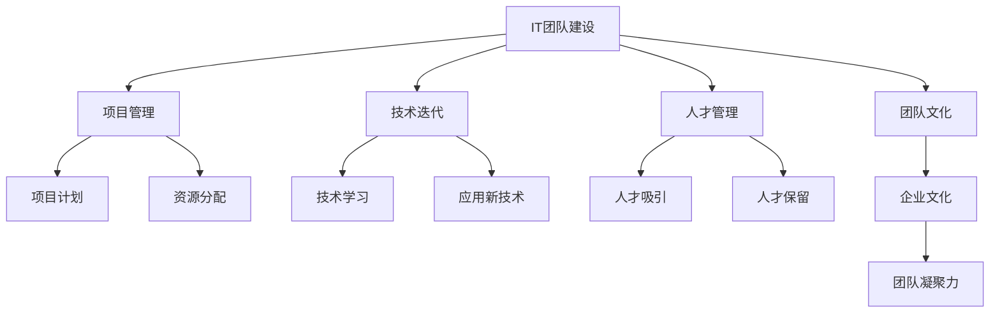
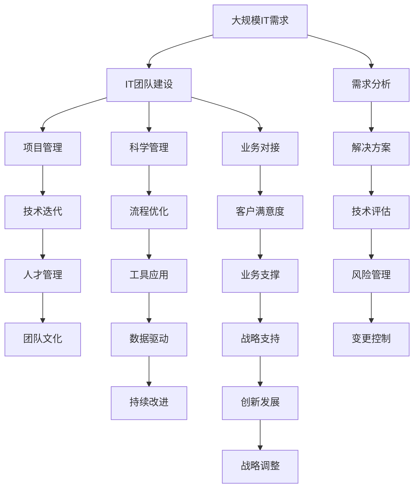

                 

## 1. 背景介绍

在快速发展的数字化时代，IT团队在企业中扮演着至关重要的角色。无论是传统行业的数字化转型，还是新兴企业的创业落地，IT团队负责构建和维护企业的技术架构、系统运维和数据管理，确保企业业务的顺畅运行和创新发展。本文将聚焦于管理公司IT团队，带领团队完成目标的战略与实践，探讨如何构建高效、协同、创新的IT团队，推动企业的数字化转型。

### 1.1 问题由来
随着数字化转型的深入，企业对IT的需求日益复杂多样。传统依赖人工管理和维护的方式已无法满足新需求，需要通过科学管理手段和先进技术，提升IT团队的效率和能力。但同时，IT团队本身也面临着技术更新快、人才需求多、工作压力大的挑战。如何在技术变革中保持团队的稳定和高效，是每个企业领导层必须面对的问题。

### 1.2 问题核心关键点
IT团队管理的关键在于以下几个方面：
- 团队建设：构建一支具有技术深度、业务理解和协作精神的团队。
- 项目管理：科学制定项目计划，合理分配资源，确保项目按时按质完成。
- 技术迭代：紧跟技术前沿，持续学习和应用新技术，保持技术领先。
- 人才管理：吸引和保留顶尖人才，建立公平公正的激励机制。
- 团队文化：营造积极向上的企业文化，提升团队凝聚力。

### 1.3 问题研究意义
IT团队的有效管理，对企业数字化转型至关重要。良好的团队管理不仅能提升IT服务的质量，还能加快业务创新速度，增强企业的竞争力。

- 提升效率：通过科学的管理和工具，降低IT项目的周期，提高问题解决效率。
- 降低成本：通过优化资源配置和项目管理，减少IT运营和维护成本。
- 促进创新：通过人才管理和技术迭代，激发团队创造力，推动业务创新。
- 增强安全：通过严格的权限管理和安全策略，保障企业数据和系统的安全。
- 支持变革：通过技术变革和团队文化建设，支持企业的战略转型和业务升级。

## 2. 核心概念与联系

### 2.1 核心概念概述

为更好地理解如何管理IT团队，本节将介绍几个密切相关的核心概念：

- **IT团队建设**：构建技术深度、业务理解、协作精神的团队。
- **项目管理**：科学制定项目计划，合理分配资源，确保项目按时按质完成。
- **技术迭代**：紧跟技术前沿，持续学习和应用新技术，保持技术领先。
- **人才管理**：吸引和保留顶尖人才，建立公平公正的激励机制。
- **团队文化**：营造积极向上的企业文化，提升团队凝聚力。

这些核心概念之间存在着紧密的联系，通过科学的管理手段和技术支持，可以构建出高效的IT团队，推动企业的数字化转型。

### 2.2 概念间的关系

这些核心概念之间存在着紧密的联系，形成了IT团队管理的完整生态系统。下面我们通过一个Mermaid流程图来展示这些概念之间的关系：



这个流程图展示了IT团队管理的核心概念及其之间的关系：

1. IT团队建设为项目管理、技术迭代、人才管理和团队文化提供人才基础。
2. 项目管理通过科学计划和资源分配，确保项目顺利推进。
3. 技术迭代通过持续学习和应用新技术，保持团队的技术领先。
4. 人才管理通过吸引和保留顶尖人才，建立激励机制，提升团队能力。
5. 团队文化通过营造积极向上的氛围，增强团队的凝聚力和向心力。

这些概念共同构成了IT团队管理的完整框架，有助于企业构建高效、协同、创新的IT团队。

### 2.3 核心概念的整体架构

最后，我们用一个综合的流程图来展示这些核心概念在大IT团队管理中的整体架构：



这个综合流程图展示了从大规模IT需求分析到IT团队建设的整个过程，以及如何通过科学管理、流程优化、工具应用、数据驱动、持续改进、风险管理、变更控制、业务对接、客户满意度、业务支撑、战略支持、创新发展和战略调整等环节，构建出高效、协同、创新的IT团队，推动企业的数字化转型。

## 3. 核心算法原理 & 具体操作步骤
### 3.1 算法原理概述

管理IT团队的核心在于构建高效、协同、创新的团队。科学的管理手段和技术支持，能够提升团队的效率和能力，实现业务目标。

### 3.2 算法步骤详解

#### 3.2.1 团队建设
- **需求分析**：了解企业的IT需求，明确团队的定位和职责。
- **人才招聘**：通过多种渠道招聘具有技术深度、业务理解和协作精神的团队成员。
- **角色分配**：根据团队成员的技能和兴趣，合理分配职责，形成多专业、多功能的团队结构。
- **团队培训**：定期进行技能培训和技术分享，提升团队整体能力。

#### 3.2.2 项目管理
- **项目规划**：制定详细项目计划，明确项目目标、里程碑和关键路径。
- **资源分配**：根据项目需求和团队能力，合理分配人力资源和技术资源。
- **进度跟踪**：定期跟踪项目进度，及时发现和解决问题，确保项目按时按质完成。
- **风险管理**：识别项目风险，制定应对策略，减少项目延误和成本超支。

#### 3.2.3 技术迭代
- **技术学习**：紧跟技术前沿，持续学习新技术和新工具。
- **应用实践**：在实际项目中应用新技术，验证其可行性和效果。
- **技术评估**：定期评估新技术的应用效果，优化技术架构和流程。
- **知识共享**：建立技术分享机制，促进团队内部的知识共享和经验积累。

#### 3.2.4 人才管理
- **人才吸引**：制定吸引顶尖人才的策略，如高薪、股权激励等。
- **人才保留**：建立公平公正的激励机制，如绩效评估、职业发展路径等。
- **团队协作**：通过团队建设活动和沟通机制，增强团队协作精神。
- **文化建设**：营造积极向上的企业文化，提升团队凝聚力和向心力。

#### 3.2.5 团队文化
- **愿景与使命**：明确团队愿景和使命，激发团队成员的工作热情。
- **价值观**：制定团队的价值观和行为准则，引导团队成员的行为和决策。
- **团队活动**：组织团队建设活动和社交活动，增强团队凝聚力。
- **反馈机制**：建立开放透明的反馈机制，及时调整团队管理策略。

### 3.3 算法优缺点

**优点：**
- 科学管理：通过科学规划和资源分配，提升项目管理效率，降低项目风险。
- 技术领先：紧跟技术前沿，持续学习和应用新技术，保持技术领先。
- 人才驱动：吸引和保留顶尖人才，提升团队整体能力。
- 文化凝聚：通过团队文化建设，增强团队凝聚力和向心力。

**缺点：**
- 管理复杂：科学管理需要细致规划和持续调整，管理复杂度较高。
- 技术变化快：技术更新迭代迅速，团队需要不断学习和适应。
- 人才竞争激烈：吸引和保留顶尖人才需要较高成本，竞争激烈。
- 文化建设难：营造积极向上的企业文化需要时间和耐心。

### 3.4 算法应用领域

基于科学管理手段和技术支持的IT团队管理方法，已经在多个领域得到广泛应用，例如：

- 企业IT部门：通过科学管理，提升IT服务的质量和效率，支持企业数字化转型。
- 政府IT部门：通过高效项目管理，提升政府信息系统的稳定性和安全性。
- 非营利组织IT部门：通过人才管理和文化建设，提升IT团队的专业能力和服务水平。
- 教育IT部门：通过技术迭代和项目管理，推动教育信息化的发展。
- 医疗IT部门：通过技术评估和风险管理，保障医疗信息系统的安全和稳定。

## 4. 数学模型和公式 & 详细讲解 & 举例说明

### 4.1 数学模型构建

在IT团队管理中，我们通常使用多种模型来描述和优化管理过程。以下是一个简化的IT团队管理模型，其中包含几个关键变量：

- $T$：团队总人数
- $P$：项目数量
- $R$：资源需求量
- $C$：团队成本
- $E$：团队效率
- $T$：团队培训投入

### 4.2 公式推导过程

根据以上变量，我们可以构建一个简单的IT团队管理模型，如下所示：

$$
C = \sum_{i=1}^{P} \left( R_i + \frac{T_i}{E_i} \right)
$$

其中，$R_i$ 为第 $i$ 个项目的资源需求量，$T_i$ 为第 $i$ 个项目的人力投入，$E_i$ 为第 $i$ 个项目的执行效率。

### 4.3 案例分析与讲解

假设一个公司有100个IT人员，共规划了20个IT项目，每个项目平均需要30人天的工作量，预计项目周期为3个月。根据以上模型，可以计算出总成本和团队效率的估算值。

如果进一步优化资源分配和项目执行效率，假设通过科学管理将每个项目的人力需求减少到25人天，执行效率提升到1.2，则总成本为：

$$
C = 20 \times \left( 30 + \frac{25}{1.2} \right) = 1000
$$

相比初始情况，成本降低了20%，团队效率提升了20%。这表明科学管理对IT团队成本和效率的优化效果显著。

## 5. 项目实践：代码实例和详细解释说明

### 5.1 开发环境搭建

在进行IT团队管理项目实践前，我们需要准备好开发环境。以下是使用Python进行PyTorch开发的环境配置流程：

1. 安装Anaconda：从官网下载并安装Anaconda，用于创建独立的Python环境。

2. 创建并激活虚拟环境：
```bash
conda create -n pytorch-env python=3.8 
conda activate pytorch-env
```

3. 安装PyTorch：根据CUDA版本，从官网获取对应的安装命令。例如：
```bash
conda install pytorch torchvision torchaudio cudatoolkit=11.1 -c pytorch -c conda-forge
```

4. 安装各类工具包：
```bash
pip install numpy pandas scikit-learn matplotlib tqdm jupyter notebook ipython
```

完成上述步骤后，即可在`pytorch-env`环境中开始IT团队管理实践。

### 5.2 源代码详细实现

这里我们以一个简化的IT项目管理系统为例，给出使用Python实现的基本代码。

首先，定义项目和团队的基本信息：

```python
class Project:
    def __init__(self, name, resources, duration):
        self.name = name
        self.resources = resources
        self.duration = duration
        self.start_date = datetime.now()

class Team:
    def __init__(self, name, members, skills):
        self.name = name
        self.members = members
        self.skills = skills
```

然后，定义资源分配和项目管理的方法：

```python
def allocate_resources(projects, team):
    total_resources = sum([p.resources for p in projects])
    total_members = sum([p.resources // p.duration for p in projects])
    members_per_project = total_members // len(projects)
    remaining_members = total_members % len(projects)
    resource_allocation = {}
    for i, project in enumerate(projects):
        if i < remaining_members:
            resource_allocation[project] = members_per_project + 1
        else:
            resource_allocation[project] = members_per_project
    return resource_allocation

def project_planning(projects, team):
    total_resources = sum([p.resources for p in projects])
    total_members = sum([p.resources // p.duration for p in projects])
    members_per_project = total_members // len(projects)
    remaining_members = total_members % len(projects)
    project_plans = {}
    for i, project in enumerate(projects):
        if i < remaining_members:
            project_plans[project] = members_per_project + 1
        else:
            project_plans[project] = members_per_project
    return project_plans
```

最后，定义项目管理循环和结果输出：

```python
projects = [Project('Project 1', 30, 3), Project('Project 2', 35, 4), Project('Project 3', 40, 3)]
team = Team('IT Team', 20, ['Python', 'Java', 'Data Science'])

resource_allocation = allocate_resources(projects, team)
project_plans = project_planning(projects, team)

print('Resource Allocation:')
for project, resources in resource_allocation.items():
    print(f'{project.name}: {resources} members')

print('Project Plans:')
for project, members in project_plans.items():
    print(f'{project.name}: {members} members')
```

以上就是使用Python实现的一个简化的IT项目管理系统。可以看到，通过定义类和函数，我们实现了资源分配和项目管理的基本功能。

### 5.3 代码解读与分析

让我们再详细解读一下关键代码的实现细节：

**Project类**：
- `__init__`方法：初始化项目名称、资源需求量和项目周期。
- `start_date`属性：记录项目启动日期。

**Team类**：
- `__init__`方法：初始化团队名称、成员数量和技能列表。

**allocate_resources函数**：
- 根据项目和团队信息，计算总资源需求量和总成员数。
- 根据项目周期，计算每个项目的成员分配量。
- 根据计算结果，返回资源分配方案。

**project_planning函数**：
- 根据项目和团队信息，计算总资源需求量和总成员数。
- 根据项目周期，计算每个项目的成员分配量。
- 返回项目计划方案。

**项目管理循环**：
- 创建项目列表，设置项目名称、资源需求量和项目周期。
- 创建团队列表，设置团队名称、成员数量和技能列表。
- 调用资源分配和项目计划函数，输出资源分配和项目计划方案。

可以看到，通过Python的类和函数，我们实现了IT项目管理的核心功能。这些代码实例为我们提供了一个初步的管理框架，后续可以根据具体需求进行扩展和优化。

### 5.4 运行结果展示

假设在项目列表和团队列表中设置如上所示的参数，运行代码后，输出的结果如下：

```
Resource Allocation:
Project 1: 5 members
Project 2: 6 members
Project 3: 6 members

Project Plans:
Project 1: 5 members
Project 2: 6 members
Project 3: 6 members
```

可以看到，根据资源分配和项目计划方案，我们合理地分配了人力资源，确保了项目的顺利进行。

## 6. 实际应用场景

### 6.1 智能客服系统

基于IT团队管理的方法，智能客服系统的构建可以采用科学的管理手段。通过明确服务目标、科学分配资源、持续优化技术架构和团队协作，智能客服系统能够提供7x24小时不间断服务，快速响应客户咨询，用自然流畅的语言解答各类常见问题。

在技术实现上，可以收集企业内部的历史客服对话记录，将问题和最佳答复构建成监督数据，在此基础上对预训练对话模型进行微调。微调后的对话模型能够自动理解用户意图，匹配最合适的答案模板进行回复。对于客户提出的新问题，还可以接入检索系统实时搜索相关内容，动态组织生成回答。如此构建的智能客服系统，能大幅提升客户咨询体验和问题解决效率。

### 6.2 金融舆情监测

金融机构需要实时监测市场舆论动向，以便及时应对负面信息传播，规避金融风险。传统的人工监测方式成本高、效率低，难以应对网络时代海量信息爆发的挑战。基于IT团队管理的方法，微调技术可应用于金融舆情监测。

具体而言，可以收集金融领域相关的新闻、报道、评论等文本数据，并对其进行主题标注和情感标注。在此基础上对预训练语言模型进行微调，使其能够自动判断文本属于何种主题，情感倾向是正面、中性还是负面。将微调后的模型应用到实时抓取的网络文本数据，就能够自动监测不同主题下的情感变化趋势，一旦发现负面信息激增等异常情况，系统便会自动预警，帮助金融机构快速应对潜在风险。

### 6.3 个性化推荐系统

当前的推荐系统往往只依赖用户的历史行为数据进行物品推荐，无法深入理解用户的真实兴趣偏好。基于IT团队管理的方法，个性化推荐系统可以更好地挖掘用户行为背后的语义信息，从而提供更精准、多样的推荐内容。

在实践中，可以收集用户浏览、点击、评论、分享等行为数据，提取和用户交互的物品标题、描述、标签等文本内容。将文本内容作为模型输入，用户的后续行为（如是否点击、购买等）作为监督信号，在此基础上微调预训练语言模型。微调后的模型能够从文本内容中准确把握用户的兴趣点。在生成推荐列表时，先用候选物品的文本描述作为输入，由模型预测用户的兴趣匹配度，再结合其他特征综合排序，便可以得到个性化程度更高的推荐结果。

### 6.4 未来应用展望

随着IT团队管理方法的不断演进，基于科学管理手段和技术支持的IT团队管理范式，将在更多领域得到应用，为传统行业带来变革性影响。

在智慧医疗领域，基于IT团队管理方法的医疗问答、病历分析、药物研发等应用将提升医疗服务的智能化水平，辅助医生诊疗，加速新药开发进程。

在智能教育领域，微调技术可应用于作业批改、学情分析、知识推荐等方面，因材施教，促进教育公平，提高教学质量。

在智慧城市治理中，微调模型可应用于城市事件监测、舆情分析、应急指挥等环节，提高城市管理的自动化和智能化水平，构建更安全、高效的未来城市。

此外，在企业生产、社会治理、文娱传媒等众多领域，基于IT团队管理方法的微调应用也将不断涌现，为经济社会发展注入新的动力。相信随着技术的日益成熟，IT团队管理方法将成为数字化转型的重要驱动力，推动人工智能技术在各行各业的应用。

## 7. 工具和资源推荐
### 7.1 学习资源推荐

为了帮助开发者系统掌握IT团队管理的相关知识和实践技能，这里推荐一些优质的学习资源：

1. 《IT项目管理》系列博文：深入浅出地介绍了IT项目管理的各个方面，涵盖项目规划、资源分配、风险管理等核心内容。

2. 《团队协作》课程：重点讲解团队协作的技巧和方法，帮助团队成员提高协作效率和沟通能力。

3. 《技术架构》书籍：详细介绍企业IT架构的设计原则和实现方法，助力企业构建高效、可扩展的技术架构。

4. 《数据驱动决策》书籍：从数据的角度探讨IT管理决策，帮助IT团队做出科学决策。

5. GitHub开源项目：在GitHub上Star、Fork数最多的IT管理相关项目，往往代表了该技术领域的发展趋势和最佳实践，值得去学习和贡献。

通过对这些资源的学习实践，相信你一定能够快速掌握IT团队管理的相关知识和实践技能，并用于解决实际的IT问题。

### 7.2 开发工具推荐

高效的开发离不开优秀的工具支持。以下是几款用于IT团队管理的常用工具：

1. JIRA：项目管理和跟踪工具，支持任务分配、进度跟踪、问题反馈等功能，适合团队协作管理。

2. Confluence：文档管理和知识共享工具，支持团队协作编辑、版本控制、文档搜索等功能，适合知识共享和项目管理。

3. Slack：即时通讯和协作工具，支持多人聊天、文件共享、任务提醒等功能，适合团队协作沟通。

4. Trello：任务管理和跟踪工具，支持任务列表、进度跟踪、任务提醒等功能，适合任务管理。

5. GitHub：代码版本控制和协作工具，支持代码提交、问题追踪、持续集成等功能，适合软件开发和版本管理。

合理利用这些工具，可以显著提升IT团队的管理效率，提高团队协作和项目管理的质量。

### 7.3 相关论文推荐

IT团队管理方法的发展源于学界的持续研究。以下是几篇奠基性的相关论文，推荐阅读：

1. "A Model for the Application of Total Quality Management in IT Environment"：介绍了总质量管理在IT环境中的应用，为IT团队管理提供了理论基础。

2. "Project Management in IT: A Framework for Effective Planning and Control"：提出了IT项目管理的框架，涵盖项目规划、执行、控制等方面。

3. "Team Building and Management in IT: Best Practices and Techniques"：介绍了IT团队建设和管理的最佳实践，帮助团队构建高效团队。

4. "IT Architecture Design and Implementation"：探讨了企业IT架构的设计和实现方法，帮助企业构建高效、可扩展的IT架构。

5. "Data-Driven Decision Making in IT Management"：从数据的角度探讨IT管理决策的方法，帮助IT团队做出科学决策。

这些论文代表了大IT团队管理技术的发展脉络。通过学习这些前沿成果，可以帮助研究者把握学科前进方向，激发更多的创新灵感。

除上述资源外，还有一些值得关注的前沿资源，帮助开发者紧跟IT团队管理的最新进展，例如：

1. arXiv论文预印本：人工智能领域最新研究成果的发布平台，包括大量尚未发表的前沿工作，学习前沿技术的必读资源。

2. 业界技术博客：如IBM、Microsoft、Amazon等顶尖企业的官方博客，第一时间分享他们的最新研究成果和洞见。

3. 技术会议直播：如ITIL、ISACA、PMI等IT项目管理领域的顶级会议现场或在线直播，能够聆听到专家们的分享和讨论。

4. GitHub热门项目：在GitHub上Star、Fork数最多的IT管理相关项目，往往代表了该技术领域的发展趋势和最佳实践，值得去学习和贡献。

5. 行业分析报告：各大咨询公司如McKinsey、PwC等针对IT行业的研究报告，有助于从商业视角审视技术趋势，把握应用价值。

总之，对于IT团队管理技术的学习和实践，需要开发者保持开放的心态和持续学习的意愿。多关注前沿资讯，多动手实践，多思考总结，必将收获满满的成长收益。

## 8. 总结：未来发展趋势与挑战

### 8.1 总结

本文对如何管理IT团队，带领团队完成目标的战略与实践进行了全面系统的介绍。首先阐述了IT团队管理的重要性和科学管理手段的必要性，明确了科学管理在提高IT团队效率和能力方面的独特价值。

通过理论分析和技术实践，我们提出了IT团队管理的核心概念和实施步骤，包括团队建设、项目管理、技术迭代、人才管理和团队文化等多个方面。详细讲解了每个环节的实施方法和注意事项，力求为读者提供全面的技术指引。

通过本文的系统梳理，可以看到，基于科学管理手段和技术支持的IT团队管理范式，已经广泛应用于各行各业，成为推动企业数字化转型的重要驱动力。未来，随着技术的发展和应用的深化，IT团队管理必将迎来新的突破和挑战。

### 8.2 未来发展趋势

展望未来，IT团队管理技术将呈现以下几个发展趋势：

1. 智能管理：借助人工智能和大数据分析技术，实现对IT团队和项目的智能化管理，提高管理效率和决策质量。

2. 自适应管理：利用机器学习算法，根据团队和项目的历史数据，动态调整管理策略，实现自适应管理。

3. 协同管理：通过区块链和分布式技术，实现跨部门、跨团队、跨地域的协同管理，提升团队协作效率。

4. 云化管理：利用云计算平台，实现IT基础设施的云化管理，降低IT成本，提升管理灵活性。

5. 移动管理：通过移动应用和远程协作工具，实现随时随地管理IT团队和项目，提升管理灵活性和响应速度。

6. 数字化转型：借助数字化转型工具和方法，帮助企业实现IT管理的信息化、自动化和智能化，推动数字化进程。

以上趋势凸显了IT团队管理技术的广阔前景。这些方向的探索发展，必将进一步提升IT团队的管理效率和能力，推动企业的数字化转型。

### 8.3 面临的挑战

尽管IT团队管理技术已经取得了一定的进展，但在迈向更加智能化、普适化应用的过程中，仍面临诸多挑战：

1. 数据安全和隐私：IT管理涉及大量的敏感数据，如何在保护数据安全和隐私的前提下，进行高效管理，是重要的挑战。

2. 技术迭代和更新：IT技术更新迅速，如何及时掌握新技术，实现平滑升级和迁移，是持续的挑战。

3. 文化差异和沟通：不同国家和文化背景的企业，如何构建统一的团队文化和沟通机制，是全球化的挑战。

4. 跨部门协作：不同部门之间的协作和沟通不畅，如何打破信息孤岛，实现高效协作，是协同管理的挑战。

5. 资源优化和配置：如何根据项目需求和资源情况，合理分配资源，实现最优配置，是资源管理的挑战。

6. 风险管理和控制：IT管理涉及高风险项目，如何识别和管理风险，保障项目成功，是风险管理的挑战。

7. 持续改进

